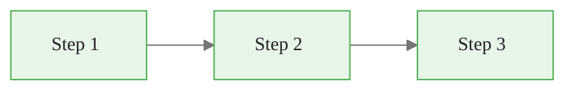
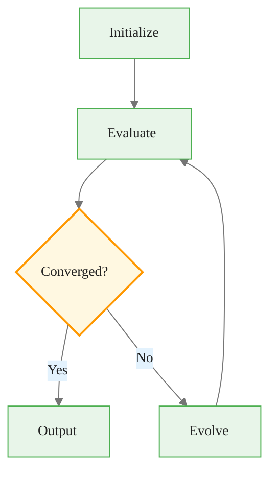

# Course Styling Guide

A comprehensive, portable reference for the visual styling system used across all course materials. Copy this file along with the `resources/` directory to apply the styling system to any new project.

---

## 1. Design Principles

| Principle | Description |
|-----------|-------------|
| **Visual-first** | Every concept starts with a diagram, illustration, or annotated graphic before text explanation. |
| **High graphic density** | Insert a visual (SVG diagram, annotated code window, process flow, or plot) every 2-3 paragraphs. No wall of text exceeding 3 consecutive paragraphs without a graphic. |
| **Pastel palette** | Section backgrounds use soft pastels (mint, amber, blue, lavender, rose) for visual grouping. Strong saturated colors reserved for borders and icons only. |
| **Editorial typography** | Serif headings (Georgia / Playfair Display) paired with sans-serif body (Inter). Tight letter-spacing, generous whitespace, restrained weight usage. |
| **Annotated code** | Code blocks styled as macOS terminal windows with traffic-light dots, filenames, and positioned annotation callouts with arrows. |

---

## 2. Color Reference

### 2.1 Full Token Table

| Token | Hex | Usage |
|-------|-----|-------|
| `--bg-primary` | `#ffffff` | Main content background |
| `--bg-section-mint` | `#e8f5e9` | Section backgrounds, success contexts |
| `--bg-section-amber` | `#fff8e1` | Process flows, warning contexts |
| `--bg-section-blue` | `#e3f2fd` | Architecture diagrams, info contexts |
| `--bg-section-lavender` | `#f3e5f5` | Insight callouts, highlight contexts |
| `--bg-section-rose` | `#fce4ec` | Danger/error contexts |
| `--bg-code` | `#1e1e2e` | Code block background (Catppuccin Mocha) |
| `--bg-sidebar` | `#1a1a2e` | Navigation sidebar |
| `--accent-green` | `#4caf50` | Success, checkmarks, positive |
| `--accent-orange` | `#ff9800` | Warnings, highlights, steps |
| `--accent-blue` | `#1976D2` | Links, interactive, info |
| `--accent-red` | `#ef5350` | Errors, important, danger |
| `--accent-purple` | `#7c4dff` | Special emphasis |
| `--text-primary` | `#212121` | Body text |
| `--text-heading` | `#1a1a2e` | Headings |
| `--text-muted` | `#757575` | Captions, metadata |
| `--text-on-dark` | `#f5f5f5` | Text on dark backgrounds |
| `--border-light` | `#e0e0e0` | Subtle borders |
| `--shadow` | `rgba(0,0,0,0.08)` | Card/component shadows |

### 2.2 Semantic Color Sets

Each content context maps to a pastel background + accent border + icon:

| Context | Background | Border/Accent | Icon |
|---------|-----------|---------------|------|
| Insight | `--bg-section-lavender` (`#f3e5f5`) | `--accent-purple` (`#7c4dff`) | Lightbulb |
| Warning | `--bg-section-amber` (`#fff8e1`) | `--accent-orange` (`#ff9800`) | Warning triangle |
| Key Point | `--bg-section-mint` (`#e8f5e9`) | `--accent-green` (`#4caf50`) | Key |
| Danger | `--bg-section-rose` (`#fce4ec`) | `--accent-red` (`#ef5350`) | Alert |
| Info | `--bg-section-blue` (`#e3f2fd`) | `--accent-blue` (`#1976D2`) | Info circle |

### 2.3 Accessibility Contrast Ratios

| Combination | Ratio | AA Status |
|------------|-------|-----------|
| `--text-primary` (#212121) on `--bg-primary` (#ffffff) | 16.1:1 | Pass |
| `--text-heading` (#1a1a2e) on `--bg-primary` (#ffffff) | 17.4:1 | Pass |
| `--text-muted` (#757575) on `--bg-primary` (#ffffff) | 4.48:1 | Pass (normal text) |
| `--text-on-dark` (#f5f5f5) on `--bg-sidebar` (#1a1a2e) | 14.8:1 | Pass |
| `--text-on-dark` (#f5f5f5) on `--bg-code` (#1e1e2e) | 14.1:1 | Pass |
| `--accent-blue` (#1976D2) on `--bg-primary` (#ffffff) | 4.56:1 | Pass (normal text) |
| `--accent-green` (#4caf50) on `--bg-primary` (#ffffff) | 3.07:1 | Fail for text |

**Rules:**
- Accent green is never used as the sole text color for essential content. It is always paired with borders, icons, or high-contrast body text.
- Do not use `--text-muted` as body text on pastel backgrounds. Use `--text-primary` (#212121) instead. Muted text on pastel backgrounds fails AA (approximately 3.8-4.0:1).

---

## 3. Typography Spec

### 3.1 Font Stacks

| Element | Font Stack |
|---------|-----------|
| Headings (H1-H3) | `Georgia, 'Playfair Display', serif` |
| Body | `'Inter', 'Segoe UI', system-ui, sans-serif` |
| Code | `'JetBrains Mono', 'Fira Code', 'Cascadia Code', monospace` |
| Captions | Same as body, italic |
| Metadata badges | Same as body |

### 3.2 Size Scale

| Element | Size |
|---------|------|
| H1 | 2.2em |
| H2 | 1.6em |
| H3 | 1.2em |
| Body (slides) | 26px |
| Body (guides) | 18px |
| Code | 0.85em |
| Captions | 0.85em |
| Metadata badges | 0.75em |

### 3.3 Weight Guide

| Element | Weight |
|---------|--------|
| H1 | 700 (bold) |
| H2 | 600 (semi-bold) |
| H3 | 600 (semi-bold) |
| Body | 400 (regular) |
| Code | 400 (regular) |
| Captions | 400, italic |
| Metadata badges | 500 (medium) |

### 3.4 Heading Hierarchy

- **H1:** Serif, `--text-heading`, no underline, `0.5em` bottom margin
- **H2:** Serif, with a 3px bottom border in `--accent-orange` spanning 60px (via `::after` pseudo-element, not full width)
- **H3:** Serif, `--text-primary`, no decoration
- All headings use `letter-spacing: -0.01em` for a tighter editorial feel

### 3.5 Font Loading

Include at the top of the Marp CSS theme:

```css
@import url('https://fonts.googleapis.com/css2?family=Inter:wght@400;500;600;700&family=Playfair+Display:wght@600;700&display=swap');
```

For offline/CI environments, `Georgia` (system serif) serves as the heading fallback and `Segoe UI` / system sans-serif for body. The visual target is achievable with system fonts only.

---

## 4. Component Library

### 4.1 Code Window

macOS-style terminal with traffic-light dots, filename header, and optional annotations.

```html
<div class="code-window">
  <div class="code-header">
    <div class="dots">
      <span class="dot-red"></span>
      <span class="dot-yellow"></span>
      <span class="dot-green"></span>
    </div>
    <span class="filename">model.py</span>
  </div>
  <div class="code-body">

```python
import numpy as np

def train(X, y, epochs=100):
    model = build_model(X.shape[1])
    model.fit(X, y, epochs=epochs)
    return model
```

  </div>
</div>
```

**With annotations:**

```html
<div class="code-window" style="position: relative;">
  <div class="code-header">
    <div class="dots">
      <span class="dot-red"></span>
      <span class="dot-yellow"></span>
      <span class="dot-green"></span>
    </div>
    <span class="filename">pipeline.py</span>
  </div>
  <div class="code-body">

```python
# Feature selection with genetic algorithm
ga = GeneticSelector(estimator=model, n_features=10)
ga.fit(X_train, y_train)
selected = ga.get_support()
```

  </div>
  <div class="code-annotation right" style="top: 60px;">
    Wrapper method — uses model performance as fitness
  </div>
</div>
```

**CSS classes:**

| Class | Purpose |
|-------|---------|
| `.code-window` | Outer container, dark background (`--bg-code`), 12px border-radius, box-shadow |
| `.code-header` | Top bar (`#2d2d44`), flex row with dots and filename |
| `.dots` | Flex container for traffic-light dots |
| `.dot-red` / `.dot-yellow` / `.dot-green` | 12px circles (`#ff5f57`, `#ffbd2e`, `#28ca41`) |
| `.filename` | Monospace, muted color (`#a0a0b0`), 0.8em |
| `.code-body` | Code content area |
| `.code-annotation` | Positioned annotation pill (white bg, shadow, 0.75em sans-serif) |
| `.code-annotation.right` | Positioned to the right of the code block |
| `.code-annotation.left` | Positioned to the left |
| `.code-annotation.top` | Positioned above |

**Annotation positioning details:**

Each annotation position variant includes a CSS `::before` or `::after` pseudo-element that renders a triangular arrow connector pointing from the pill toward the code. The arrows are 6px CSS triangles using transparent borders.

- **`.right`:** Positioned with `right: -10px; transform: translateX(100%)`. Arrow points left via `::before`.
- **`.left`:** Positioned with `left: -10px; transform: translateX(-100%)`. Arrow points right via `::after`.
- **`.top`:** Positioned with `top: -10px; transform: translateY(-100%); left: 50%`. Arrow points down via `::after`.

**Setting the `top` offset:** Use an inline `style="top: Xpx;"` to align each annotation with the relevant code line. Estimate ~26px per line of code (at slide font size) or ~22px per line (at guide font size). Example: to annotate line 3, use `style="top: 78px;"` (3 lines x 26px).

**Stacking multiple annotations:** When placing multiple `.code-annotation.right` pills, space them at least 40px apart vertically to avoid overlap. Each annotation pill is approximately 28px tall.

```html
<div class="code-window" style="position: relative;">
  <div class="code-header">
    <div class="dots"><span class="dot-red"></span><span class="dot-yellow"></span><span class="dot-green"></span></div>
    <span class="filename">pipeline.py</span>
  </div>
  <div class="code-body">

```python
from sklearn.model_selection import cross_val_score
selector = GeneticSelector(estimator=model)
selector.fit(X_train, y_train)
selected = selector.get_support()
X_reduced = X_train[:, selected]
```

  </div>
  <div class="code-annotation right" style="top: 52px;">
    Wrapper pattern — wraps any sklearn estimator
  </div>
  <div class="code-annotation right" style="top: 104px;">
    Returns boolean mask of selected features
  </div>
  <div class="code-annotation left" style="top: 130px;">
    Apply mask to reduce feature matrix
  </div>
</div>
```

**Constraints:** Annotation text should stay under ~40 characters to avoid overflow. Annotations use `white-space: nowrap`, so long text will extend outside the slide boundary. For longer explanations, use a callout box below the code-window instead.

### 4.2 Process Flow

Numbered step-by-step flow with pastel-colored boxes and arrows.

```html
<div class="flow">
  <div class="flow-step mint">1. Encode Features</div>
  <div class="flow-arrow">&#8594;</div>
  <div class="flow-step amber">2. Evaluate Fitness</div>
  <div class="flow-arrow">&#8594;</div>
  <div class="flow-step blue">3. Select Parents</div>
  <div class="flow-arrow">&#8594;</div>
  <div class="flow-step lavender">4. Crossover & Mutate</div>
</div>
```

**CSS classes:**

| Class | Purpose |
|-------|---------|
| `.flow` | Flex container, centered, gap managed by arrows |
| `.flow-step` | Rounded box (12px radius), 600 weight, shadow, min-width 140px |
| `.flow-step.mint` | Mint background + green border |
| `.flow-step.amber` | Amber background + orange border |
| `.flow-step.blue` | Blue background + blue border |
| `.flow-step.lavender` | Lavender background + purple border |
| `.flow-step.rose` | Rose background + red border |
| `.flow-arrow` | 1.5em arrow character, muted color |

### 4.3 Callout Boxes

Five semantic types with pastel backgrounds and left accent borders.

**Insight:**
```html
<div class="callout-insight">
  <strong>Insight:</strong> Genetic algorithms are particularly effective when the
  search space is too large for exhaustive methods but has enough structure for
  evolutionary pressure to exploit.
</div>
```

**Warning:**
```html
<div class="callout-warning">
  <strong>Warning:</strong> Premature convergence occurs when the population loses
  diversity too early. Monitor population entropy across generations.
</div>
```

**Key Point:**
```html
<div class="callout-key">
  <strong>Key Point:</strong> Tournament selection balances exploitation and
  exploration better than roulette wheel for most feature selection tasks.
</div>
```

**Danger:**
```html
<div class="callout-danger">
  <strong>Danger:</strong> Never evaluate fitness on the test set. Use cross-validation
  within the training fold only.
</div>
```

**Info:**
```html
<div class="callout-info">
  <strong>Info:</strong> The chromosome length equals the number of input features.
  Each gene is a binary flag indicating feature inclusion.
</div>
```

**CSS classes:**

| Class | Background | Border Color |
|-------|-----------|-------------|
| `.callout-insight` | `--bg-section-lavender` | `--accent-purple` |
| `.callout-warning` | `--bg-section-amber` | `--accent-orange` |
| `.callout-key` | `--bg-section-mint` | `--accent-green` |
| `.callout-danger` | `--bg-section-rose` | `--accent-red` |
| `.callout-info` | `--bg-section-blue` | `--accent-blue` |

All callouts share: `padding: 1.2rem 1.5rem`, `border-radius: 8px`, `border-left: 4px solid`, `font-size: 0.95em`, `line-height: 1.6`.

### 4.4 Comparison Cards

Side-by-side before/after or approach A/B layouts.

```html
<div class="compare">
  <div class="compare-card">
    <div class="header before">Before: Manual Selection</div>
    <div class="body">
      Trial-and-error feature selection. No systematic search.
      High risk of missing feature interactions.
    </div>
  </div>
  <div class="compare-card">
    <div class="header after">After: GA Selection</div>
    <div class="body">
      Population-based search explores feature combinations.
      Fitness function captures interaction effects automatically.
    </div>
  </div>
</div>
```

**CSS classes:**

| Class | Purpose |
|-------|---------|
| `.compare` | 2-column grid, 1rem gap |
| `.compare-card` | Rounded container (12px), box-shadow, overflow hidden |
| `.compare-card .header` | Colored header bar, white text, centered, 600 weight |
| `.compare-card .header.before` | Red background (`--accent-red`) |
| `.compare-card .header.after` | Green background (`--accent-green`) |
| `.compare-card .body` | White background, 1rem padding |

### 4.5 Tables

Dark header with white text, striped body rows, hover highlighting.

```html
| Feature | Type | Importance |
|---------|------|-----------|
| Volume | Numeric | 0.85 |
| Momentum | Numeric | 0.72 |
| Sector | Categorical | 0.68 |
```

**Styling (applied automatically via CSS):**

| Element | Style |
|---------|-------|
| Header row | `--bg-sidebar` background, white text |
| Odd rows | White background |
| Even rows | `#fafafa` background |
| Hover | `--bg-section-blue` background |
| Borders | 1px `--border-light` |
| Width | Full width, clean sans-serif |

### 4.6 Section Breaks

Module section break slides use the `module-break` class:

```html
<!-- _class: module-break -->

## Module 2: Selection Methods
```

**Styling:** Mint background (`--bg-section-mint`), centered serif H2, 4px top border in `--accent-green`.

### 4.7 Link Preview Card

Styled preview card for cross-references between guides, slides, and external resources. Rounded card with a title, description, left border accent, and hover lift effect.

```html
<a class="link-card" href="./02_advanced_topic_slides.md">
  <div class="link-card-title">Advanced Topic — Companion Slides</div>
  <div class="link-card-description">Interactive slide deck covering the implementation details and worked examples.</div>
</a>
```

**Multiple cards:**

```html
<a class="link-card" href="../notebooks/02_advanced_topic.ipynb">
  <div class="link-card-title">Hands-on Notebook</div>
  <div class="link-card-description">15-minute micro-notebook with real data and guided exercises.</div>
</a>

<a class="link-card" href="./02_advanced_topic_guide.md">
  <div class="link-card-title">Conceptual Guide</div>
  <div class="link-card-description">Deep dive into the theory and mathematical foundations.</div>
</a>
```

**CSS classes:**

| Class | Purpose |
|-------|---------|
| `.link-card` | Outer container (white bg, left border in `--accent-blue`, shadow, hover lift) |
| `.link-card-title` | Heading-weight title (serif, `--text-heading`) |
| `.link-card-description` | Muted description text (0.85em, `--text-muted`) |
| `.link-card::after` | Arrow icon (auto-generated via CSS) |

### 4.8 Badges

Inline metadata pills for tags, reading time, difficulty, and module labels.

```html
<span class="badge mint">Beginner</span>
<span class="badge amber">~10 min</span>
<span class="badge blue">Module 2</span>
<span class="badge lavender">ML</span>
<span class="badge rose">Advanced</span>
```

**CSS classes:**

| Class | Background | Text Color |
|-------|-----------|-----------|
| `.badge` | Base style: inline-block, 0.75em, 500 weight, rounded pill |
| `.badge.mint` | `--bg-section-mint` | `#1b5e20` |
| `.badge.amber` | `--bg-section-amber` | `#e65100` |
| `.badge.blue` | `--bg-section-blue` | `#0d47a1` |
| `.badge.lavender` | `--bg-section-lavender` | `#4a148c` |
| `.badge.rose` | `--bg-section-rose` | `#b71c1c` |

### 4.9 Caption

Centered italic text for figure and diagram captions.

```html
<div class="caption">Figure 1: GA lifecycle showing initialization, evaluation, selection, crossover, and mutation stages.</div>
```

**Styling:** 0.85em, italic, `--text-muted`, centered, 0.4em top margin.

### 4.10 Base Element Styles

These elements are styled automatically by course-theme.css without needing extra classes.

#### Blockquotes

Amber background with orange left border. Used for metadata banners and supplementary notes.

```html
> **Reading time:** ~10 min | **Module:** 2 — Selection Methods | **Prerequisites:** Module 1
```

**Styling:** 4px left border in `--accent-orange`, `--bg-section-amber` background, normal font style (not italic), 8px border-radius on right corners.

#### Inline Code

Highlighted code within body text.

```html
Use `np.array()` to convert the list to a NumPy array.
```

**Styling:** `#f0f0f5` background, `--text-heading` color, 4px border-radius, 0.85em monospace.

#### Code Blocks (outside code-window)

Standalone fenced code blocks without the macOS code-window wrapper.

**Styling:** `--bg-code` background, 12px border-radius, subtle shadow. Code text uses `--text-on-dark` (#f5f5f5) at 0.85em monospace.

#### Strong and Emphasis

- **`<strong>` / `**text**`:** Renders in `--text-heading` color (#1a1a2e) for stronger visual weight.
- **`<em>` / `*text*`:** Renders in `--text-muted` color (#757575) for de-emphasized content.

#### Horizontal Rules

```html
---
```

**Styling:** 2px solid `--border-light` line, 1.2em vertical margin. In Marp slides, horizontal rules create slide breaks.

#### Images

All images auto-constrain to `max-width: 100%` with 8px border-radius.

#### Lists

Unordered and ordered lists use 0.4em vertical margin with 0.25em spacing between items. Bold text within list items renders in `--text-heading`.

#### MathJax

`.MathJax` elements render at 1em (matching body text). Use `$...$` for inline math and `$$...$$` for display math.

#### Mermaid Diagrams

`.mermaid` elements are centered with flex layout and 0.8em auto margins.

#### Pagination Footer

`section::after` renders page numbers at 0.65em in `--text-muted`.

### 4.11 Lead Slides

Title/section slides with a dark gradient background.

```html
<!-- _class: lead -->

# Deck Title
## Module N — Course Name
```

**CSS behavior:**

| Selector | Effect |
|----------|--------|
| `section.lead` | Dark gradient background (`--bg-sidebar` to `#16213e`), centered layout, white text |
| `section.lead::before` | Subtle radial overlay for visual depth |
| `section.lead h1` | 2.4em, white, text shadow, no bottom border |
| `section.lead h2` | Sans-serif, 1.1em, 70% white opacity, no orange underline |
| `section.lead strong` | Orange accent (`--accent-orange`) for emphasis on dark backgrounds |
| `section.lead blockquote` | Orange left border, semi-transparent white background |

### 4.12 Comparison Slides

Two-column grid layout for side-by-side content on a single slide.

```html
<!-- _class: comparison -->

Left column content goes here.

Right column content goes here.
```

**CSS behavior:** `section.comparison` applies a 2-column CSS grid with `1fr 1fr` columns and 1rem gap. Content flows into columns automatically. Use this for placing two code-windows, two callouts, or any two blocks side by side.

---

## 5. SVG Graphics Guide

### 5.1 Diagram Generator API

The SVG diagram generator lives at `resources/graphics/diagram_generator.py` and uses Python stdlib only (`xml.etree.ElementTree`).

**Public functions:**

| Function | Purpose |
|----------|---------|
| `process_flow(steps, colors, title, orientation)` | Numbered step-by-step process flow |
| `architecture_diagram(layers, connections, title)` | Multi-layer architecture with labeled connections |
| `comparison_graphic(left, right, title)` | Side-by-side comparison (before/after, A/B) |
| `concept_map(nodes, edges, title)` | Node-and-edge concept relationship map |
| `timeline(events, title, orientation)` | Timeline with labeled milestones |
| `annotated_code(code, language, annotations, filename)` | Code block with positioned annotation callouts |

All functions return an `SVGDocument` instance:

```python
class SVGDocument:
    def save(self, path: str) -> None: ...
    def to_string(self) -> str: ...
    def to_data_uri(self) -> str: ...  # For inline embedding in notebooks
    def _repr_svg_(self) -> str: ...   # Jupyter display integration
```

### 5.2 Style Constants

```python
COLORS = {
    "mint":     {"bg": "#e8f5e9", "border": "#4caf50", "text": "#1b5e20"},
    "amber":    {"bg": "#fff8e1", "border": "#ff9800", "text": "#e65100"},
    "blue":     {"bg": "#e3f2fd", "border": "#2196f3", "text": "#0d47a1"},
    "lavender": {"bg": "#f3e5f5", "border": "#7c4dff", "text": "#4a148c"},
    "rose":     {"bg": "#fce4ec", "border": "#ef5350", "text": "#b71c1c"},
    "gray":     {"bg": "#f5f5f5", "border": "#9e9e9e", "text": "#424242"},
}

FONTS = {
    "heading": "Georgia, serif",
    "body": "Inter, sans-serif",
    "code": "JetBrains Mono, monospace",
}
```

### 5.3 Usage Examples

**Process flow:**

```python
from resources.graphics import process_flow

svg = process_flow(
    steps=["Encode", "Evaluate", "Select", "Crossover", "Mutate"],
    colors=["mint", "amber", "blue", "lavender", "rose"],
    title="GA Lifecycle",
    orientation="horizontal"
)
svg.save("assets/ga_lifecycle.svg")
```

**Architecture diagram:**

```python
from resources.graphics import architecture_diagram

svg = architecture_diagram(
    layers=[
        {"name": "Data Layer", "nodes": ["Raw Data", "Features", "Labels"], "color": "blue"},
        {"name": "GA Engine", "nodes": ["Population", "Fitness", "Selection"], "color": "mint"},
        {"name": "Output", "nodes": ["Selected Features", "Model"], "color": "amber"},
    ],
    connections=[("Features", "Population"), ("Fitness", "Selection"), ("Selection", "Selected Features")],
    title="Feature Selection Pipeline"
)
svg.save("assets/pipeline.svg")
```

**Comparison graphic:**

```python
from resources.graphics import comparison_graphic

svg = comparison_graphic(
    left={"title": "Manual Selection", "items": ["Trial and error", "Misses interactions", "Slow"]},
    right={"title": "GA Selection", "items": ["Systematic search", "Captures interactions", "Scalable"]},
    title="Selection Approaches"
)
svg.save("assets/comparison.svg")
```

**In a Jupyter notebook (inline display):**

```python
from resources.graphics import process_flow

svg = process_flow(steps=["Load", "Transform", "Train", "Evaluate"])
svg  # Jupyter renders via _repr_svg_
```

---

## 6. Mermaid Theme Config

Every Mermaid diagram in slides and guides must include this `%%{init}%%` directive as the first line:

````markdown

````

**Copy-paste snippet:**

```
%%{init: {"theme": "base", "themeVariables": {"primaryColor": "#e8f5e9", "primaryBorderColor": "#4caf50", "primaryTextColor": "#212121", "secondaryColor": "#e3f2fd", "tertiaryColor": "#fff8e1", "lineColor": "#757575", "fontFamily": "Inter, sans-serif", "fontSize": "14px"}}}%%
```

For per-node color overrides, use `classDef` + `class` syntax (not inline `style` directives):

````markdown

````

---

## 7. Plot Theme

### 7.1 Matplotlib/Seaborn Setup

Apply the course-consistent plot theme in any notebook or script:

```python
from resources.graphics.plot_theme import apply_plot_theme

apply_plot_theme()
```

### 7.2 Theme Settings

| Setting | Value |
|---------|-------|
| Color cycle | `['#4caf50', '#2196f3', '#ff9800', '#7c4dff', '#ef5350', '#00bcd4']` |
| Background | White with `#f5f5f5` grid lines |
| Title font | Serif (Georgia), left-aligned, `--text-heading` color |
| Label font | Inter (sans-serif) |
| Tick font | JetBrains Mono (monospace) |
| Spine style | Left + bottom only, light gray |
| Figure size | `(10, 6)` default |
| Legend | No frame, positioned outside right or below |

### 7.3 Manual Setup (Without Module)

If you cannot import the module, apply these settings directly:

```python
import matplotlib.pyplot as plt
import matplotlib as mpl

# Color cycle
mpl.rcParams['axes.prop_cycle'] = mpl.cycler(
    color=['#4caf50', '#2196f3', '#ff9800', '#7c4dff', '#ef5350', '#00bcd4']
)

# Typography
mpl.rcParams['font.family'] = 'sans-serif'
mpl.rcParams['font.sans-serif'] = ['Inter', 'Segoe UI', 'sans-serif']
mpl.rcParams['axes.titlesize'] = 16
mpl.rcParams['axes.titleweight'] = 'bold'
mpl.rcParams['axes.labelsize'] = 13

# Grid and spines
mpl.rcParams['axes.grid'] = True
mpl.rcParams['grid.color'] = '#f5f5f5'
mpl.rcParams['grid.linewidth'] = 1.0
mpl.rcParams['axes.spines.top'] = False
mpl.rcParams['axes.spines.right'] = False
mpl.rcParams['axes.edgecolor'] = '#e0e0e0'

# Figure
mpl.rcParams['figure.figsize'] = [10, 6]
mpl.rcParams['figure.facecolor'] = 'white'
mpl.rcParams['axes.facecolor'] = 'white'

# Legend
mpl.rcParams['legend.frameon'] = False
```

---

## 8. Content Conventions

### 8.1 Guide Structure Template

Every guide markdown follows this structure:

```markdown
# Guide Title

> **Module N** | Course Name | Estimated reading time: X min

## Learning Objectives

- Objective 1
- Objective 2
- Objective 3

---

## Section 1: Concept Name

[2-3 paragraphs of explanation]

<!-- Visual: SVG diagram or annotated code window here -->

[1-2 paragraphs continuing explanation]

<div class="callout-key">
  <strong>Key Point:</strong> Summary of the critical takeaway from this section.
</div>

---

## Section 2: Next Concept

[Repeat pattern: text -> visual -> text -> callout]

---

## Summary

| Concept | Key Takeaway |
|---------|-------------|
| Concept 1 | One-line summary |
| Concept 2 | One-line summary |

## Next Steps

- Link to companion slide deck: `_slides.md`
- Link to hands-on notebook: `notebooks/`
- Link to exercises: `exercises/`
```

### 8.2 Slide Deck Structure Template

Every slide deck follows this structure:

```markdown
---
marp: true
theme: course
paginate: true
math: mathjax
---

<!-- _class: lead -->

# Deck Title
## Module N — Course Name

<!-- Speaker notes: Welcome to this module. Today we cover X, Y, Z. -->

---

## Learning Objectives

- Objective 1
- Objective 2
- Objective 3

<!-- Speaker notes: By the end of this deck, you will be able to... -->

---

## Concept Slide

[Content with visual component]

<!-- Speaker notes: Explanation for the presenter. -->

---

<!-- _class: module-break -->

## Section Title

---

## Code Example

<div class="code-window">
  <div class="code-header">
    <div class="dots"><span class="dot-red"></span><span class="dot-yellow"></span><span class="dot-green"></span></div>
    <span class="filename">example.py</span>
  </div>

```python
# code here
```

</div>

<!-- Speaker notes: Walk through the code line by line. -->

---

## Summary

| Concept | Key Point |
|---------|-----------|
| A | Summary |
| B | Summary |

<!-- Speaker notes: Recap the main takeaways. -->
```

### 8.3 Notebook Structure Template

Every Jupyter notebook follows this cell structure:

1. **Cell 1 (Markdown):** Title, metadata badge, learning objectives
2. **Cell 2 (Code):** Setup — imports, `sys.path`, `apply_course_theme()`, `apply_plot_theme()`
3. **Cell 3+ (alternating):** Markdown section headers with brief context, followed by code cells
4. **Visual rule:** A plot, diagram, or styled output every 2-3 code cells
5. **Final cell (Markdown):** Key takeaways summary, next steps links

### 8.4 Visual Density Rule

**Minimum graphic density:** One visual element (diagram, plot, annotated code window, process flow, or table) every 2-3 paragraphs of text. This applies to:

- Guides: SVG diagrams, callout boxes, comparison cards, tables
- Slides: Flow components, code windows, Mermaid diagrams, comparison cards
- Notebooks: Plots, inline SVGs, styled DataFrames, callout HTML

### 8.5 Graphic Selection Guide

Use this matrix to select the right visual type for your content:

| Content Type | Recommended Visual | Fallback |
|---|---|---|
| Conceptual / theory explanation | Concept map SVG or architecture diagram | Process flow |
| Sequential processes / algorithms | Process flow component (`.flow`) or timeline SVG | Mermaid flowchart |
| Comparisons / tradeoffs | Comparison cards (`.compare`) or comparison SVG | Side-by-side table |
| Code explanations | Code-window with annotations | Code block + callout |
| Key decisions / warnings | Callout boxes (`.callout-*`) | Blockquote |
| Data relationships / workflows | Mermaid diagrams | Architecture SVG |
| Mathematical concepts | LaTeX blocks (`$$...$$`) with callout context | Table of notation |
| Timelines / historical progressions | Timeline SVG | Numbered list |
| Summary / reference data | Table with dark headers | Bulleted callout |

**Medium selection by content type:**
- **Slide decks:** Use Mermaid diagrams (rendered live by Marp) and HTML components (`.flow`, `.compare`, `.code-window`).
- **Guide markdowns:** Use pre-generated SVG files (embedded via ``) and HTML components.
- **Notebooks:** Use inline SVG via `diagram_generator.py` or matplotlib/seaborn plots.

### 8.6 Code Presentation Tiers

Not every code block needs a full code-window. Use these tiers to decide:

| Tier | When to Use | Format |
|------|-------------|--------|
| **Code-window** | Key implementations, functions the learner will use, code being explained in detail | Full `<div class="code-window">` with filename header and traffic-light dots |
| **Annotated code-window** | Code with non-obvious patterns that need visual callouts | Code-window + `.code-annotation` pills pointing to specific lines |
| **Bare fenced block** | Short snippets (<5 lines), inline examples, configuration, terminal commands, practice problems | Standard triple-backtick ` ```python ` block |

**Rules:**
- The first/primary code example in each guide section uses a code-window.
- Follow-up code blocks in the same section may use bare fenced blocks with a `# Purpose:` first-line comment.
- Practice problem code always uses bare fenced blocks (to visually distinguish from teaching code).
- Terminal/shell commands always use bare fenced blocks with ` ```bash `.

### 8.7 Guide Structure — Two Formats

Guides follow one of two structures depending on content type.

**Full format** — for conceptual/theoretical guides introducing a topic for the first time:

```markdown
# Title

> **Reading time:** ~X min | **Module:** N — Topic | **Prerequisites:** ...

## In Brief

<div class="callout-insight">
  <strong>Insight:</strong> One-paragraph summary of the concept.
</div>

## Formal Definition

[LaTeX definitions and mathematical formulation]

## Intuitive Explanation

[Analogy or plain-language explanation]

## Code Implementation

<div class="code-window">...</div>

[Supporting bare code blocks with # Purpose: comments]

## Common Pitfalls

1. Pitfall with code example
2. Pitfall with code example

## Connections

<div class="callout-info">
  <strong>How this connects:</strong>
</div>

- **Builds On:** [Prior concepts]
- **Leads To:** [Next concepts]
- **Related To:** [Parallel concepts]

## Practice Problems

1. Problem statement
   ```python
   # skeleton code
   ```

## Further Reading

- [Academic papers]
- [Books]
- [Online resources]

---

**Next:** [Companion Slides](./XX_slides.md) | [Notebook](../notebooks/XX.ipynb)
```

**Compact format** — for practical/reference guides where the reader already has conceptual foundation:

```markdown
# Title

> **Reading time:** ~X min | **Module:** N — Topic | **Prerequisites:** ...

## [Topic-Driven Section 1]

[Focused explanation + code]

## [Topic-Driven Section 2]

[Focused explanation + code]

## Key Takeaways

<div class="callout-key">
  <strong>Key Takeaways:</strong>
  1. Takeaway one
  2. Takeaway two
  3. Takeaway three
</div>

---

**Next:** [Companion Slides](./XX_slides.md) | [Notebook](../notebooks/XX.ipynb)
```

**When to use each:**
- **Full format:** First guide for a topic area, concept introductions, theory-heavy content.
- **Compact format:** Reference/implementation guides, practical how-to content, supplementary material.

### 8.8 Algorithm Pseudocode Presentation

Present algorithms using a `callout-info` with monospace formatting:

```html
<div class="callout-info" style="font-family: var(--font-code);">
<strong>Algorithm:</strong> Tournament Selection<br/>
<strong>Input:</strong> Population P, tournament size k<br/>
<strong>Output:</strong> Selected individual<br/><br/>
1. Sample k individuals from P uniformly at random<br/>
2. Evaluate fitness of each sampled individual<br/>
3. Return individual with best fitness from sample
</div>
```

### 8.9 Parameter Tables

Use a standard markdown table with consistent columns for documenting configuration parameters:

```markdown
| Parameter | Type | Default | Description |
|-----------|------|---------|-------------|
| `population_size` | int | 50 | Number of individuals per generation |
| `mutation_rate` | float | 0.01 | Probability of flipping each gene |
| `crossover_rate` | float | 0.8 | Probability of recombination |
| `tournament_size` | int | 3 | Number of candidates per selection |
```

For parameters with mathematical notation, add a Symbol column:

```markdown
| Parameter | Symbol | Range | Recommended | Notes |
|-----------|--------|-------|-------------|-------|
| Population size | $N$ | 20-200 | 50 | Larger for more features |
| Mutation rate | $p_m$ | 0.001-0.1 | $1/n$ | $n$ = chromosome length |
| Crossover rate | $p_c$ | 0.6-0.95 | 0.8 | |
| Tournament size | $k$ | 2-7 | 3 | Higher = more pressure |
```

### 8.10 LaTeX Conventions

- Use `$$...$$` for display (block) math and `$...$` for inline math.
- Use `\operatorname{argmin}` instead of `\argmin` for proper upright rendering.
- Avoid `\text{}` where possible for KaTeX compatibility. Use `\mathrm{}` if you need upright text in math mode.
- Multi-line equations: use `\begin{cases}` or `\begin{bmatrix}`, not aligned plain text.
- Where/Given/Find blocks: use bold labels followed by a bulleted list outside the math block.

```markdown
$$
f(x) = \sum_{i=1}^{n} w_i \cdot x_i
$$

where:
- $w_i$ is the weight for feature $i$
- $x_i \in \{0, 1\}$ indicates feature inclusion
```

---

## 9. Quick Start Checklist

Apply this styling system to a new project in these steps:

- [ ] **Copy `resources/` directory** to your project root (themes, graphics, notebook_style, templates)
- [ ] **Install fonts** — ensure Inter and Playfair Display are available (or rely on system fallbacks Georgia + Segoe UI)
- [ ] **Set up Marp rendering** — always pass `--theme-set resources/themes/course-theme.css` to `marp-cli`
- [ ] **Use frontmatter** in all slide decks:
  ```yaml
  ---
  marp: true
  theme: course
  paginate: true
  math: mathjax
  ---
  ```
- [ ] **Add `sys.path` setup** to notebooks:
  ```python
  import sys, os
  sys.path.insert(0, os.path.join(os.path.dirname("__file__"), "../../../"))
  ```
- [ ] **Apply notebook theme** in the first code cell:
  ```python
  from resources.notebook_style import apply_course_theme
  from resources.graphics.plot_theme import apply_plot_theme
  apply_course_theme()
  apply_plot_theme()
  ```
- [ ] **Include Mermaid init** in every Mermaid diagram (see Section 6)
- [ ] **Use starter templates** from `resources/templates/` as scaffolds for new content
- [ ] **Follow visual density rule** — graphic every 2-3 paragraphs (see Section 8.4)
- [ ] **Render slides** with:
  ```bash
  npx @marp-team/marp-cli --html --theme-set resources/themes/course-theme.css -- "path/to/slides.md"
  ```

---

## 10. File Map

Files to copy to a new project and their roles:

```
resources/
├── themes/
│   └── course-theme.css              # Marp CSS theme (REQUIRED for slide rendering)
├── graphics/
│   ├── __init__.py                   # Public exports: process_flow, architecture_diagram, etc.
│   ├── diagram_generator.py          # SVG diagram generator (stdlib only)
│   ├── plot_theme.py                 # Matplotlib/Seaborn theme: apply_plot_theme()
│   └── icons/                        # Reusable 24x24 SVG icon fragments
│       ├── robot.svg
│       ├── brain.svg
│       ├── gear.svg
│       ├── chart.svg
│       ├── database.svg
│       ├── dna.svg
│       ├── target.svg
│       ├── magnifier.svg
│       ├── arrow_right.svg
│       ├── arrow_down.svg
│       ├── checkmark.svg
│       └── warning.svg
├── notebook_style.py                 # Notebook CSS injector: apply_course_theme()
├── streamlit/
│   └── custom.css                    # Streamlit custom styles
└── templates/
    ├── slide_template.md             # Starter Marp slide deck
    ├── guide_template.md             # Starter guide markdown
    └── notebook_template.ipynb       # Starter Jupyter notebook

STYLING_GUIDE.md                      # This file — portable styling reference
styling_guide.html                    # Live HTML component preview
```

| File | When to Copy | Purpose |
|------|-------------|---------|
| `resources/themes/course-theme.css` | Always | Slide rendering requires this theme |
| `resources/graphics/` | If generating SVG diagrams or using plot theme | Diagram + plot styling |
| `resources/notebook_style.py` | If creating Jupyter notebooks | Consistent notebook appearance |
| `resources/templates/` | When scaffolding new content | Starter files with correct frontmatter and structure |
| `STYLING_GUIDE.md` | For reference | This document |
| `styling_guide.html` | For visual reference | Live component previews |
