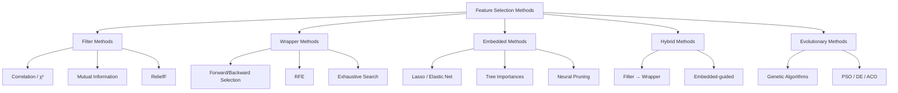
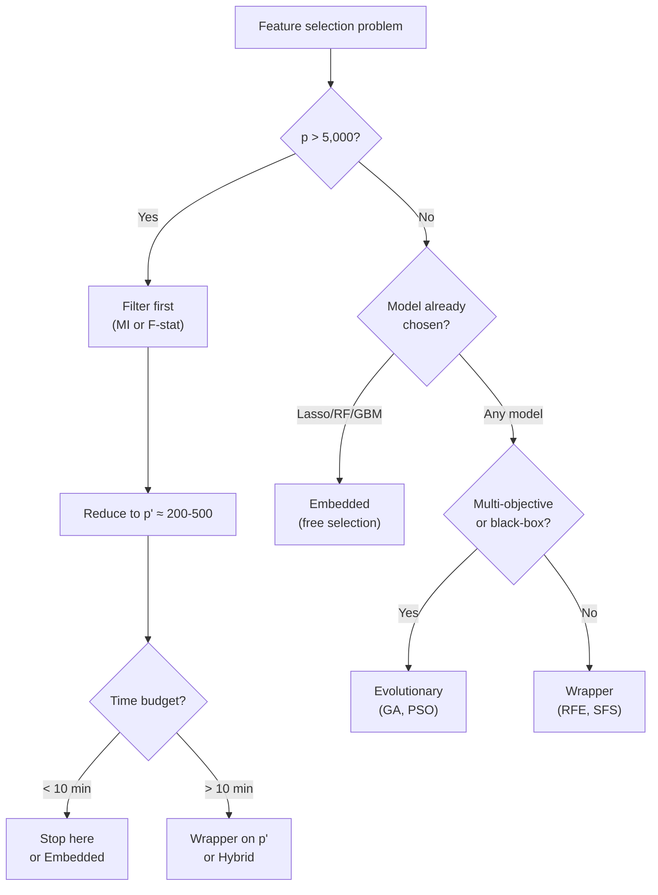

<!-- _class: lead -->
<!-- Speaker notes: Welcome to Module 0 of Advanced Feature Selection. This deck maps the full landscape — five families of methods, their mathematical foundations, and the trade-offs that determine which you should reach for first. By the end, you will have a mental model that orients everything that follows in the course. -->

# The Feature Selection Landscape

## Module 00 — Taxonomy and Trade-offs

*Five families. One decision framework.*

---

<!-- Speaker notes: Ground the problem immediately. p=50 already has quadrillions of subsets. p=500 is a common real-world setting. The combinatorial explosion is the reason we need principled methods, and it's why different families make different trade-offs. -->

## The Core Problem

Given $n$ samples with $p$ features, find the subset $S^* \subseteq \{1,\ldots,p\}$ that maximises predictive utility:

$$S^* = \arg\max_{S \subseteq \{1,\ldots,p\}} J(S)$$

The search space has $2^p$ candidate subsets.

| $p$ | Search space | Exhaustive search |
|-----|-------------|------------------|
| 20 | ~1 million | Feasible |
| 50 | ~$10^{15}$ | Seconds since Big Bang |
| 500 | ~$10^{150}$ | Larger than atoms in universe |

**We need principled shortcuts.** That's what the five families provide.

---

<!-- Speaker notes: This is the central taxonomy. Every method in the course belongs to one of these five families. The colours reflect computational cost, roughly: green=fast, yellow=moderate, red=expensive. Spend time letting this diagram settle before moving on. -->

## The Five Families



---

<!-- Speaker notes: The key axis is how tightly coupled selection and learning are. Filters decouple them completely — this is fast but potentially suboptimal. Embedded methods fuse them — you get the selection signal for free. Wrappers sit in the middle: they use model performance, but as an external oracle, not as a gradient. -->

## The Selection-Learning Coupling Axis

<div class="columns">

**Decoupled (Fast)**

Filter methods evaluate features **before** training any model.

Relevance score $s_j$ computed from data statistics:
- Pearson $r$, mutual information $I(X_j; Y)$
- ANOVA F-statistic
- Chi-squared test

No model trains during selection.

**Tightly Coupled (Accurate)**

Embedded methods select features **during** model training.

The regularisation term does the selection:
$$\hat{\boldsymbol{\beta}} = \arg\min_{\boldsymbol{\beta}} \mathcal{L} + \lambda\|\boldsymbol{\beta}\|_1$$

Zero coefficients → excluded features.

</div>

---

<!-- Speaker notes: Walk through each column carefully. The key insight is the cost formula column — the O() expressions tell you exactly what drives the computational bill. T_model is your biggest lever: a linear model makes wrappers cheap; a neural network makes them nearly intractable. -->

## Computational Cost Comparison

| Method | Cost Formula | $p=100$ | $p=1{,}000$ | $p=10{,}000$ |
|--------|-------------|---------|------------|-------------|
| Filter | $O(p \cdot n)$ | Fast | Fast | Fast |
| Wrapper (greedy) | $O(k \cdot p \cdot T_m)$ | Moderate | Slow | Very slow |
| Embedded | $O(T_m)$ | Fast | Fast | Fast |
| Hybrid | $O(pn + kp'T_m)$ | Fast | Moderate | Moderate |
| Evolutionary | $O(G \cdot P \cdot T_m)$ | Moderate | Moderate | Slow |

*$T_m$ = single model training time; $k$ = features selected; $p'$ = after filter; $G$ = generations; $P$ = population*

---

<!-- Speaker notes: The optimality column is the hardest pill to swallow. No method guarantees the globally optimal subset (except exhaustive search, which is intractable). Greedy wrappers guarantee local optima. Embedded with convex loss (Lasso) recovers the true support under strict conditions. Evolutionary methods are heuristic — no guarantee, but often very good. -->

## Optimality and Interpretability Trade-offs

<div class="columns">

**Optimality Guarantees**

| Method | Guarantee |
|--------|-----------|
| Filter | None |
| Wrapper (greedy) | Local optimum |
| Embedded (Lasso, convex) | Exact under RIP condition |
| Hybrid | None |
| Evolutionary | None (heuristic) |

**Interpretability**

| Method | Score |
|--------|-------|
| Filter | High — p-values, MI scores |
| Wrapper | Medium — subset performance |
| Embedded | Medium — coefficient magnitudes |
| Hybrid | Medium |
| Evolutionary | Low — black-box selection |

</div>

---

<!-- Speaker notes: Dive into filters now. The key sub-distinction is univariate versus multivariate. Univariate (correlation, F-stat) evaluates each feature in isolation. ReliefF samples nearest neighbours to estimate feature relevance in context of other features. This matters when features interact — univariate methods can miss the signal entirely. -->

## Filter Methods: Univariate vs. Multivariate

**Univariate filters** score each feature independently:

$$s_j = I(X_j; Y) = \sum_{x,y} p(x,y) \log \frac{p(x,y)}{p(x)p(y)}$$

Fast: $O(p \cdot n)$. Blind to feature interactions.

**Multivariate filter (ReliefF):** samples $m$ instances, finds $k$ nearest hits and misses, estimates feature relevance from neighbourhood structure.

$$W_j \mathrel{+}= \frac{1}{m}\sum_{i=1}^m \left[-\text{diff}(j, x_i, H_i) + \sum_{C \neq c_i} \frac{P(C)}{1-P(c_i)} \text{diff}(j, x_i, M_i(C))\right]$$

Cost: $O(m \cdot k \cdot n \cdot p)$. Captures interactions.

---

<!-- Speaker notes: Wrapper methods are the gold standard for solution quality but the enemy of scalability. The critical insight is T_model — a 10ms linear model makes forward selection on p=200 feasible in seconds. A 10-minute neural network makes it impossible. Show how the cost explodes: 50 iterations × 200 features × 1 model train per step = 10,000 model trains. -->

## Wrapper Methods: Using the Model as Oracle

```
Feature subset S
      │
      ▼
  Train model f̂_S on training fold
      │
      ▼
  Evaluate J(S) = CV-Accuracy(f̂_S)
      │
      ▼
  Update search strategy
      │
      ▼
  New candidate subset S'
```

**Forward Selection cost:** $O(k \cdot p \cdot T_\text{model})$

For $k=20$, $p=500$, $T_m=0.1s$: **1,000 model fits = 100 seconds**

For $k=20$, $p=500$, $T_m=60s$: **1,000 model fits = 17 hours**

---

<!-- Speaker notes: Embedded methods are the practical workhorse. Lasso is the textbook embedded method — the L1 penalty drives small coefficients to exactly zero. The geometry explains why: the L1 ball has corners at the coordinate axes, and the optimum tends to land on a corner (sparse solution). This is fundamentally different from L2, which shrinks but never zeros. -->

## Embedded Methods: Selection During Training

Lasso optimisation drives coefficients to exactly zero:

$$\hat{\boldsymbol{\beta}}_\text{Lasso} = \arg\min_{\boldsymbol{\beta}} \underbrace{\|\mathbf{y} - \mathbf{X}\boldsymbol{\beta}\|_2^2}_{\text{fit}} + \lambda \underbrace{\|\boldsymbol{\beta}\|_1}_{\text{sparsity penalty}}$$

<div class="columns">

**Geometric intuition**

The L1 ball $\|\boldsymbol{\beta}\|_1 \leq t$ has *corners* on coordinate axes.

Contours of the loss function tend to touch the L1 ball at a corner → sparse solution.

**Practical consequence**

Selection is **free**: no extra model fits, no cross-validation loop for selection.

Only need to tune $\lambda$ via CV for the model itself.

</div>

---

<!-- Speaker notes: Hybrid methods solve the practical scaling problem. The filter stage does the heavy lifting to get from p=10,000 to p'=300 cheaply. Then the wrapper stage finds the best 20 from that 300 efficiently. The risk is that the filter might drop a genuinely useful feature — so the filter threshold should be set conservatively (keep more than you think you need). -->

## Hybrid Methods: Best of Both Worlds

**Filter → Wrapper pipeline:**

$$\underbrace{p = 10{,}000}_{\text{raw}} \xrightarrow{\text{MI filter}} \underbrace{p' = 300}_{\text{pre-screened}} \xrightarrow{\text{RFE}} \underbrace{k = 20}_{\text{final}}$$

**Cost breakdown:**
- Filter stage: $O(p \cdot n)$ — fast, model-free
- Wrapper stage: $O(k \cdot p' \cdot T_m)$ — now feasible since $p' \ll p$

**The key risk:** Features removed by the filter are never reconsidered.

Set filter thresholds conservatively — it is better to pass 300 features to the wrapper than to incorrectly eliminate a signal-carrying feature at the filter stage.

---

<!-- Speaker notes: Evolutionary methods are the most flexible but most expensive. The GA framework is intuitive: chromosomes encode which features to include, fitness is model performance, and evolution drives the population toward high-fitness regions of the 2^p search space. The key advantage over wrappers is non-locality — GA can jump across the search space, while greedy forward selection is stuck in a local neighbourhood. -->

## Evolutionary Methods: Population-Based Search

**Genetic Algorithm for feature selection:**

```
Chromosome: [1, 0, 1, 1, 0, 0, 1, 0, 1, 1]
             f1 f2 f3 f4 f5 f6 f7 f8 f9 f10

1 = selected, 0 = excluded
```

Each chromosome encodes a candidate subset. Fitness = model performance on that subset.

**Cost:** $O(G \cdot P \cdot T_\text{fitness})$

For $G=100$ generations, $P=50$ population, $T_m=1s$: **5,000 model fits = 83 minutes**

**Advantage over wrappers:** Can escape local optima by crossover and mutation.

---

<!-- Speaker notes: This flowchart is the decision framework. Walk through it with the audience. The main bifurcation is dimensionality. If p is very large, filters are mandatory — there's no choice. If p is moderate, the next question is whether you care more about speed/interpretability (filter/embedded) or solution quality (wrapper/evolutionary). -->

## Decision Framework: Which Method for Your Problem?



---

<!-- Speaker notes: The selection vs. extraction question comes up constantly. The short answer: if interpretability or inference speed matters, select. If the task is unsupervised or you need a dense representation, extract. The table on the right makes the distinction concrete. -->

## Feature Selection vs. Feature Extraction

<div class="columns">

**Feature Selection**

Retains *original* variables — the output is a subset of inputs.

- Interpretable: coefficients point to real features
- Sparse: only relevant features remain
- Fast inference: fewer input dimensions
- Works on mixed data types

**Feature Extraction** (PCA, AE, t-SNE)

*Transforms* variables — output is a new representation.

- Dense: all original info compressed
- Not interpretable: PC1 = "0.3·age + 0.7·income + ..."
- Better for correlated features
- Requires continuous, numeric inputs (usually)

</div>

**Choose selection when:** interpretability required, sparsity expected, regulatory compliance needed, inference cost matters.

---

<!-- Speaker notes: The NFL theorem is the honest caveat. No method wins everywhere. The practical lesson is not nihilism — it is the workflow: run multiple methods, cross-validate the whole pipeline, and treat method choice as a hyperparameter. This is what separates practitioners from academics chasing a single "best" algorithm. -->

## The No-Free-Lunch Reality

**Theorem (Wolpert & Macready, 1997):** No optimisation algorithm outperforms random search when averaged uniformly over all possible objective functions.

**Applied to feature selection:** No single method is best across all datasets.

Benchmark evidence (Pes et al., 2020 — 14 filter methods, 30 datasets):
- No method ranks consistently in the top 3
- Best method varies by dataset characteristics

**Practical response:**

1. Run 2-3 candidate methods in parallel
2. Cross-validate the *entire* pipeline (not just the model)
3. Use stability selection to identify robustly selected features
4. Treat method choice as a hyperparameter

---

<!-- Speaker notes: Summarise the five families with their defining trade-off. Filter: fast but model-agnostic. Wrapper: accurate but slow. Embedded: free if model supports it. Hybrid: practical compromise. Evolutionary: global explorer but expensive. This is the mental model they need going into the rest of the course. -->

## Module Summary

| Family | Core Trade-off | Best For |
|--------|--------------|----------|
| **Filter** | Speed vs. interaction-blindness | $p > 10{,}000$, first pass |
| **Wrapper** | Accuracy vs. cost | Moderate $p$, fast models |
| **Embedded** | Convenience vs. model-lock | Lasso/RF/GBM users |
| **Hybrid** | Balance vs. complexity | Production pipelines |
| **Evolutionary** | Global search vs. runtime | Multi-objective, black-box |

**Coming up:**
- Module 01: Statistical filter theory in depth
- Module 03: Wrapper algorithms and RFE
- Module 04: Lasso, Ridge, and tree-based embedded methods
- Module 05: Genetic algorithms for feature selection

---

<!-- Speaker notes: Three key takeaways to drive home. First, the problem is combinatorially hard — 2^p is not solvable by brute force. Second, all families make trade-offs — there is no dominant method. Third, the decision framework from slide 11 is their practical compass. If they remember nothing else, they should remember that compass. -->

<!-- _class: lead -->

## Three Takeaways

1. **The search space is 2^p** — you need principled shortcuts, not brute force

2. **Every family trades something** — speed for accuracy, generality for convenience

3. **No-Free-Lunch means the right method depends on *your* problem** — use the decision flowchart

*Next: The Curse of Dimensionality — why high-dimensional spaces break your intuition*
