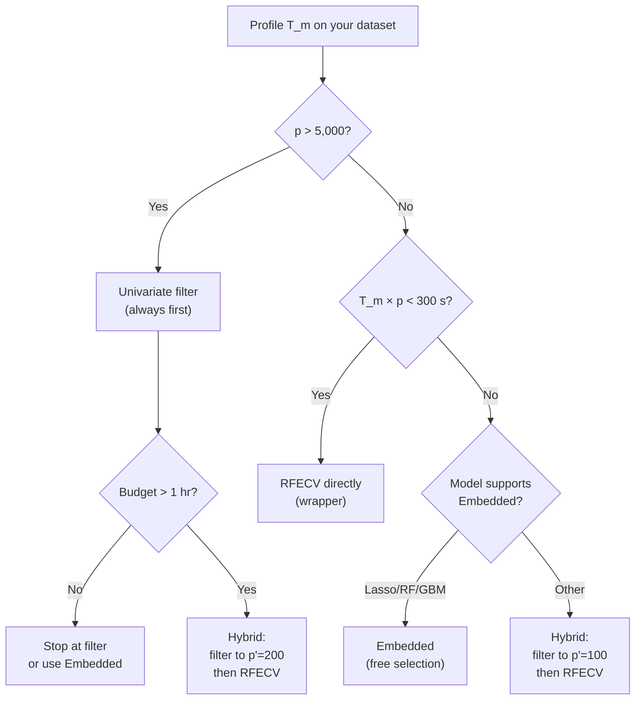

<!-- _class: lead -->
<!-- Speaker notes: This deck gives students the tools to estimate selection pipeline runtime before committing to an approach. The key variables are T_model and p. Once you know those, you can calculate exactly how long each method family will take. This is practical engineering knowledge, not just theory. -->

# Computational Complexity of Feature Selection

## Module 00 — Cost Analysis for Every Method Family

*Know your runtime before you write a line of code*

---

<!-- Speaker notes: Start by naming the variables. T_m is the single most important variable — it multiplies everything in wrapper and evolutionary methods. p is the dimensionality. n is less critical for model-based methods (it's baked into T_m) but critical for filter methods. Make sure students write these down; they'll use them throughout the deck. -->

## The Key Variables

| Symbol | Meaning | Your value |
|---|---|---|
| $p$ | Total features | ______ |
| $n$ | Training samples | ______ |
| $k$ | Features to select | ______ |
| $T_m$ | Single model training time | ______ |
| $G$ | GA generations | typically 100 |
| $P$ | GA population size | typically 50 |
| $f$ | CV folds | typically 5 |

**The dominant cost in wrapper/evolutionary methods:**

$$\text{Total model fits} = \text{(method constant)} \times T_m$$

**Profile $T_m$ first. Then choose your method.**

---

<!-- Speaker notes: The 2^p table is the most important slide in the deck. Students often don't have visceral intuition for how fast exponential growth works. The "longer than the universe" entry at p=100 is the key memory anchor. The only practical use of exhaustive search is p≤20 with a very fast model. Everything else requires a smarter approach. -->

## Exhaustive Search: $O(2^p \cdot T_m)$

The gold standard — evaluate every subset, return the best.

| $p$ | Subsets | Time at $T_m = 1$ ms | Time at $T_m = 1$ sec |
|---|---|---|---|
| 10 | 1,024 | 1 sec | 17 min |
| 15 | 32,768 | 33 sec | 9 hr |
| 20 | 1,048,576 | 17 min | 12 days |
| 25 | 33,554,432 | 9 hr | 1.1 yr |
| 30 | $10^9$ | 12 days | 33 yr |
| 50 | $10^{15}$ | 31 million yr | — |
| 100 | $10^{30}$ | longer than universe | — |

**Practical limit: $p \leq 20$ with $T_m < 1$ ms.**

Everything else: use a smarter algorithm.

---

<!-- Speaker notes: Filter methods are the speed champions. Univariate filters are O(p*n) — linear in both dimensions. For p=10,000 and n=100,000, that is 10^9 operations: a few seconds of NumPy. The mRMR quadratic case is the warning: p^2 * n kills you at p=10,000 even though it's "just a filter". Emphasise that the label "filter" does not mean "cheap" for multivariate variants. -->

## Filter Methods: $O(p \cdot n)$ to $O(p^2 \cdot n)$

**Univariate filter** — scores each feature independently:

$$T_\text{filter-1} = O(p \cdot n)$$

No model trains. Pearson, F-stat, MI computed directly from data.

**Multivariate filter (mRMR, ReliefF)** — considers feature pairs:

$$T_\text{filter-2} = O(p^2 \cdot n)$$

The $p \times p$ pairwise MI matrix costs $O(p^2 \cdot n)$.

| Method | $p=100$, $n=10k$ | $p=1k$, $n=10k$ | $p=10k$, $n=10k$ |
|---|---|---|---|
| Univariate (Pearson, F) | < 1 ms | < 10 ms | < 100 ms |
| Mutual Information | 50 ms | 500 ms | 5 sec |
| mRMR ($O(p^2 n)$) | 1 sec | 100 sec | 2.8 hr |

---

<!-- Speaker notes: The wrapper cost formula has T_m as a multiplicative factor. This is the critical point. Show students how to use the formula: count the model fits, multiply by T_m. Forward selection with k=20 and p=500 requires about k*p = 10,000 model fits. If T_m=1 sec, that is 10,000 seconds = 2.8 hours. If T_m=1 ms, that is 10 seconds. The model choice determines whether wrapper selection is practical. -->

## Wrapper Methods: $O(k \cdot p \cdot T_m)$

**Forward Selection:** Add one feature at a time:

$$T_\text{forward} \approx k \cdot p \cdot T_m$$

**Recursive Feature Elimination (RFE):** Remove one at a time:

$$T_\text{RFE} = \left\lceil \frac{p-k}{\text{step}}\right\rceil \cdot T_m$$

**RFECV:** RFE with cross-validation:

$$T_\text{RFECV} = f \cdot \left\lceil \frac{p-k}{\text{step}}\right\rceil \cdot T_m$$

Total model fits for Forward Selection ($k=20$, $p=500$): **~10,000 fits**

At $T_m = 1$ ms: **10 sec** | At $T_m = 1$ sec: **2.8 hours**

---

<!-- Speaker notes: The wall-clock table makes the cost concrete. The three columns represent three real model choices: linear (1ms), Random Forest (1s), LightGBM (5s). Walk through the table row by row. The key takeaway: with a fast linear model, wrappers are practical even for p=1000. With LightGBM, wrappers become intractable for p>100. Students should leave knowing their T_m before choosing a method. -->

## Wrapper Wall-Clock: $k=20$, $f=5$, $n=10{,}000$

<div class="columns">

**$p = 100$**

| Method | Linear 1ms | RF 1s | LGBM 5s |
|---|---|---|---|
| Forward sel. | 100ms | 100sec | 500sec |
| RFE (step=5) | 20ms | 20sec | 100sec |
| RFECV (step=5) | 100ms | 100sec | 500sec |

**$p = 1{,}000$**

| Method | Linear 1ms | RF 1s | LGBM 5s |
|---|---|---|---|
| Forward sel. | 1sec | 17min | 83min |
| RFE (step=5) | 200ms | 3.3min | 16.7min |
| RFECV (step=5) | 1sec | 17min | 83min |

</div>

**Rule of thumb:** If $T_m \cdot p > 300$ seconds, switch to hybrid (filter first).

---

<!-- Speaker notes: Embedded methods are the elegant solution — selection is a by-product of training. For Lasso, the L1 penalty simultaneously fits the model and zeroes out irrelevant coefficients. You don't pay separately for selection. The caveat: you still need to tune lambda, which requires CV. But a Lasso CV path (100 lambda values) is still usually faster than a single wrapper run. -->

## Embedded Methods: $O(T_m)$ — Selection Is Free

Feature selection occurs **during** model training. No extra model fits.

**Lasso** (coordinate descent, single $\lambda$):

$$T_\text{Lasso} = O(p \cdot n \cdot I) \approx O(T_m)$$

$I$ = coordinate descent iterations (100–1,000).

**Lasso path + CV** ($|\Lambda|$ values, $f$ folds):

$$T_\text{Lasso, CV} = f \cdot |\Lambda| \cdot T_\text{Lasso}$$

For $f=5$, $|\Lambda|=100$: **500 Lasso fits total**

**Random Forest importance:**

$$T_\text{RF + importance} = T_\text{RF training}$$

Importance scores computed as a free by-product of split evaluations.

---

<!-- Speaker notes: The Lasso path visualisation is the key insight for embedded methods. As lambda increases from left to right, more and more coefficients are driven to zero. The plot shows which features are selected at each regularisation level. The CV curve (right panel) picks the optimal lambda. This entire procedure costs about 500 Lasso fits — fast even for large p. -->

## The Lasso Path: Selection as Regularisation Increases

```
Coefficient value
        |
    β₁  |━━━━━━━━━━━━━━━━━━━━━━━━━━━━━━━╮
        |                                 ╲
    β₃  |━━━━━━━━━━━━━━━━━━━━━━━━━╮       ╲
        |                          ╲        ╲
    β₂  |━━━━━━━━━━━━━━━━╮          ╲        ╲
        |                 ╲          ╲        0────
    β₄  |━━━━━━━━━╮        ╲         0────────────
        |          ╲        0─────────────────────
    0   |───────────0──────────────────────────────
        |
        +──────────────────────────────────────────────
        λ → increasing (more regularisation → more zeros)
```

**At the optimal $\lambda$:** the model has non-zero $\hat{\beta}_j$ only for the selected features. Selection and fitting happened in one pass.

---

<!-- Speaker notes: Evolutionary methods are the most expensive per problem instance but the most flexible. The formula G*P*f*T_m has four multiplicative terms. For G=100, P=50, f=5: that is 25,000 model fits. With a 1-second RF, that is 25,000 seconds = 7 hours. The parallel speedup is key: the P evaluations per generation are embarrassingly parallel. With 8 cores, the 7 hours becomes ~1 hour. Still expensive but sometimes worth it for multi-objective problems. -->

## Evolutionary Methods: $O(G \cdot P \cdot T_\text{fitness})$

Maintain a population of $P$ candidate subsets, evolve for $G$ generations:

$$T_\text{GA} = G \cdot P \cdot f \cdot T_m$$

For typical parameters ($G=100$, $P=50$, $f=5$): **25,000 model fits**

| $T_m$ | Total time | With 8-core parallelism |
|---|---|---|
| 1 ms | 25 sec | 3 sec |
| 10 ms | 4 min | 30 sec |
| 100 ms | 42 min | 5 min |
| 1 sec | 7 hr | 1 hr |
| 10 sec | 70 hr | 9 hr |
| 60 sec | 17 days | 2 days |

**Parallelism is almost mandatory for GA with slow fitness functions.**

---

<!-- Speaker notes: The speedup strategies for GA are practical knowledge. Surrogate fitness is the most powerful: train a fast neural network on the fitness values of evaluated chromosomes and use it as an oracle for the majority of evaluations. This reduces the number of true model fits from 25,000 to ~2,000 in many applications. Warm initialisation from filter ranks reduces generations needed by 30-50%. -->

## Evolutionary Speedup Strategies

**1. Parallelism:** $P$ fitness evaluations per generation are independent.

$$T_\text{parallel GA} = G \cdot \lceil P / C \rceil \cdot f \cdot T_m$$

**2. Surrogate fitness:** Train a fast proxy (XGBoost on chromosome features) to approximate fitness for most evaluations.

**3. Warm initialisation:** Seed the initial population from filter-ranked features. Converges in fewer generations (empirically ~30-50% fewer).

**4. Fitness approximation:** Use 1-fold holdout for most generations; full CV only for final evaluation.

**5. Early stopping:** Halt if best fitness hasn't improved for $g_\text{patience}$ generations.

Combined, these strategies can reduce effective cost by **5-10×**.

---

<!-- Speaker notes: This comparison table is the deliverable for the deck. Walk through each row. The key pattern: filters are cheap because they don't train models. Wrappers are expensive because T_m multiplies everything. Embedded is T_m once (plus path/CV overhead). Evolutionary is G*P*T_m — expensive, but parallelisable. The hybrid row shows why it's the practical choice for large p: filter reduces p to p', then wrapper on p' is tractable. -->

## Complete Comparison: $p=1{,}000$, $n=10{,}000$, $k=20$

| Method | Formula | Linear 1ms | RF 1s | LGBM 5s |
|---|---|---|---|---|
| Univariate filter | $O(pn)$ | 10 ms | 10 ms | 10 ms |
| mRMR | $O(p^2 n)$ | 100 sec | 100 sec | 100 sec |
| Forward selection | $O(kpT_m)$ | 20 sec | 5.6 hr | 28 hr |
| RFECV (step=10) | $O(fp T_m)$ | 5 sec | 1.4 hr | 7 hr |
| Lasso (CV path) | $O(f|\Lambda|T_m)$ | 0.5 sec | — | — |
| RF importance | $O(T_m)$ | — | 1 sec | — |
| GA ($G=100$, $P=50$) | $O(GPfT_m)$ | 4 min | 7 hr | 35 hr |
| **Hybrid** (filter $p'=100$ + RFECV) | $O(pn + fp'T_m)$ | **10ms + 0.5s** | **10ms + 8 min** | **10ms + 42 min** |

**At $p=1{,}000$ with RF: Hybrid is 10× faster than RFECV, 50× faster than GA.**

---

<!-- Speaker notes: The decision tree gives a concrete procedure. Profile T_m first — that's always step 1. Then check p. Then apply the budget constraint. The decision procedure eliminates the guesswork and gives students a systematic way to choose. They should print this slide and keep it handy. -->

## Decision Procedure: Picking the Right Method



---

<!-- Speaker notes: The parallelism table is important for practitioners. Understanding which methods parallelise well determines how to scale them. RFECV parallelises perfectly across folds — Python's sklearn accepts n_jobs=-1. GA parallelises across population individuals. Lasso path has limited benefit due to warm-start sequential dependency. Give students the practical code note: n_jobs=-1 in sklearn. -->

## Parallelism Opportunities

| Method | Parallel? | How | Speedup (8 cores) |
|---|---|---|---|
| Univariate filter | Full | Each feature independent | ~8× |
| RFECV | By fold | Each CV fold independent | Up to $f$× |
| Lasso path | Partial | Limited by warm-start | ~2× |
| GA | By individual | Each chromosome independent | ~$P$×, capped at $C$ |
| RF importance | By tree | Each tree independent | ~8× |

**sklearn trick:** `RFECV(n_jobs=-1)`, `RandomForestClassifier(n_jobs=-1)` — parallelism is one flag away.

---

<!-- Speaker notes: Conclude with the three rules of thumb. These are the take-home messages. Rule 1: profile T_m before choosing. Rule 2: if p > 5000 and T_m > 1s, filters are not optional — they are the only thing that works. Rule 3: Embedded gives you selection for free if your model supports it, so always check that first. -->

<!-- _class: lead -->

## Three Rules for Practical Complexity Management

1. **Profile $T_m$ first** — it multiplies everything in wrapper and evolutionary methods

2. **Large $p$ + slow $T_m$ → Hybrid** — filter to $p' \leq 200$, then wrapper/embedded

3. **Embedded is always worth checking** — if your model is Lasso/RF/GBM, selection comes free

*Next: Notebook 01 — Seeing the curse of dimensionality and timing all three families on real data*
