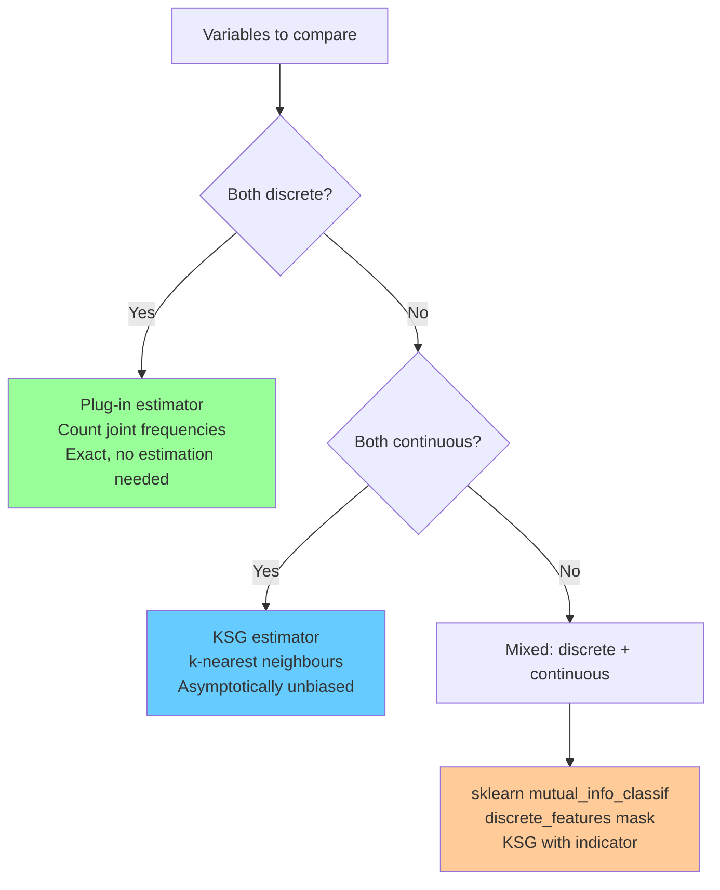
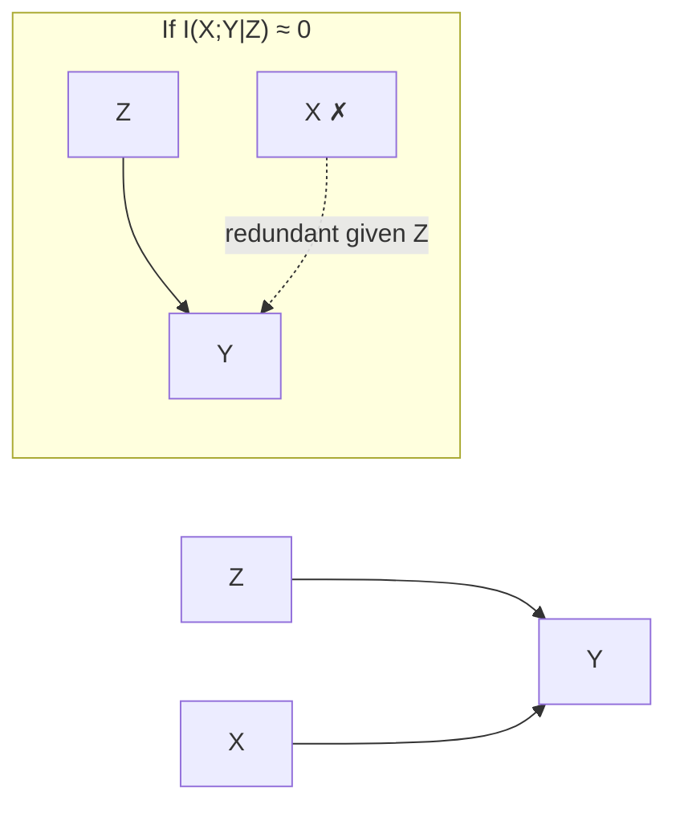

<!-- _class: lead -->
<!-- Speaker notes: Welcome to Module 1 of Advanced Feature Selection. This deck focuses on mutual information — the workhorse of information-theoretic feature filters. The key message throughout: MI detects ALL statistical dependencies, not just linear ones. That single property makes it fundamentally more powerful than correlation for real-world data. Plan ~40 minutes for this deck with exercises. -->

# Mutual Information for Feature Selection

## Module 01 — Statistical Filter Methods

Beyond Pearson: capturing nonlinear dependencies with information theory

---

<!-- Speaker notes: Ground this in the practical failure mode of correlation. A feature perfectly predictive of the target via a quadratic relationship will score zero Pearson correlation. Mutual information detects it. Ask learners: have you ever thrown away a feature because it had low correlation with the target, only to wish you hadn't? -->

## Why Correlation Is Not Enough

```
Feature X ~ N(0,1),   Target Y = X² + ε

Pearson r(X, Y) = 0   ← completely blind to the relationship

Mutual Information I(X; Y) > 0   ← correctly detects dependence
```

> Correlation measures the *strength of the linear component* of a relationship.
> Mutual information measures *total statistical dependence* — any shape, any strength.

---

<!-- Speaker notes: Walk through each equality carefully. H(Y) is the uncertainty in Y before seeing X. H(Y|X) is uncertainty in Y after seeing X. The difference is what X tells us about Y. This is the cleanest way to build intuition. Emphasise that MI = 0 iff X and Y are independent — it is a true independence test, not just a linear association measure. -->

## What Is Mutual Information?

$$I(X; Y) = H(Y) - H(Y \mid X)$$

**Entropy:** $H(Y) = -\sum_y p(y) \log p(y)$ — total uncertainty in $Y$

**Conditional entropy:** $H(Y \mid X)$ — uncertainty in $Y$ after observing $X$

**MI:** the reduction in uncertainty about $Y$ from knowing $X$

$$I(X; Y) = \sum_{x,y} p(x,y) \log \frac{p(x,y)}{p(x)\,p(y)}$$

Properties: $I(X;Y) \geq 0$, $\; I(X;Y) = I(Y;X)$, $\; I(X;Y) = 0 \Leftrightarrow X \perp Y$

---

<!-- Speaker notes: This Mermaid diagram shows the four estimator choices and when each is appropriate. The KSG estimator is the one learners will use most often — it handles continuous features, is asymptotically unbiased, and is what sklearn uses under the hood. Spend time on the KSG branch of the tree. -->

## Choosing an MI Estimator



---

<!-- Speaker notes: The histogram estimator is dead simple but has a serious problem: bin width controls everything, and there's no principled way to choose it. Show learners this code — it's the right mental model for what MI estimation is doing (counting joint occurrences) even if we don't use it in practice. Point out the Miller-Madow bias correction at the end. -->

## Plug-In Estimator: Counting Joint Occurrences

```python
def mi_plugin(x, y, n_bins=10):
    # Discretise continuous variables uniformly
    x_disc = np.digitize(x, np.linspace(x.min(), x.max(), n_bins))
    y_disc = np.digitize(y, np.linspace(y.min(), y.max(), n_bins))

    n = len(x)
    joint = np.zeros((n_bins + 1, n_bins + 1))
    for xi, yi in zip(x_disc, y_disc):
        joint[xi, yi] += 1
    joint /= n

    px = joint.sum(axis=1, keepdims=True)
    py = joint.sum(axis=0, keepdims=True)

    # MI = sum p(x,y) * log[p(x,y) / p(x)p(y)]
    mask = (joint > 0) & (px > 0) & (py > 0)
    mi = (joint[mask] * np.log(joint[mask] / (px * py)[mask])).sum()

    # Miller-Madow bias correction
    B = (joint > 0).sum()
    return mi - (B - 1) / (2 * n)
```

**Bias:** overestimates MI; correction is $(B-1)/(2N)$ where $B$ = occupied bins.

---

<!-- Speaker notes: The KSG estimator is the key algorithm to understand deeply. The digamma function appears because it is the derivative of the log-gamma function — it arises naturally from the geometry of nearest-neighbour counting. Walk through the three steps: (1) find k-th neighbour in joint space, (2) count marginal neighbours, (3) apply formula. k=5 is the go-to default. -->

## KSG Estimator: k-Nearest Neighbours

$$\hat{I}(X;Y) = \psi(k) + \psi(N) - \left\langle \psi(n_x+1) + \psi(n_y+1) \right\rangle$$

where $\psi$ is the digamma function, $N$ is sample size, and $n_x, n_y$ count marginal neighbours within the $k$-th neighbour's Chebyshev radius.

```python
from scipy.special import digamma
from sklearn.neighbors import NearestNeighbors

def mi_ksg(x, y, k=5):
    xy = np.column_stack([x, y])
    knn = NearestNeighbors(n_neighbors=k+1, metric='chebyshev').fit(xy)
    dists, _ = knn.kneighbors(xy)
    eps = dists[:, k]                    # radius = dist to k-th neighbour

    nx = count_marginal_neighbors(x, eps)
    ny = count_marginal_neighbors(y, eps)

    mi = digamma(k) + digamma(len(x)) - np.mean(digamma(nx+1) + digamma(ny+1))
    return max(0.0, mi)
```

> **Default:** `k=5`. Larger $k$ reduces variance, increases bias.

---

<!-- Speaker notes: This is the slide most learners will bookmark. sklearn's mutual_info_classif and mutual_info_regression are production-ready KSG estimators with adaptive partitioning. Learners should use these in practice, not roll their own. Point out the discrete_features parameter — crucial for mixed datasets. -->

## sklearn in Practice: The Production Path

```python
from sklearn.feature_selection import mutual_info_classif, mutual_info_regression
import pandas as pd

def rank_features_by_mi(X: pd.DataFrame, y, task='classification',
                         n_neighbors=5, random_state=42):
    """
    Return MI scores for all features, sorted descending.
    task: 'classification' (discrete target) or 'regression' (continuous).
    """
    if task == 'classification':
        scores = mutual_info_classif(X, y, n_neighbors=n_neighbors,
                                     random_state=random_state)
    else:
        scores = mutual_info_regression(X, y, n_neighbors=n_neighbors,
                                        random_state=random_state)
    return pd.Series(scores, index=X.columns).sort_values(ascending=False)

# Mixed features: tell sklearn which are discrete
discrete_mask = X.dtypes == int
scores = mutual_info_classif(X, y, discrete_features=discrete_mask)
```

---

<!-- Speaker notes: This diagram illustrates conditional MI as a nested information flow. The key question: does X tell us anything about Y that Z doesn't already tell us? If I(X;Y|Z) is close to zero, then X is conditionally redundant given Z. This is the foundation of Markov blanket algorithms and mRMR. -->

## Conditional Mutual Information

$$I(X; Y \mid Z) = H(Y \mid Z) - H(Y \mid X, Z)$$

**Interpretation:** Does $X$ carry information about $Y$ *beyond* what $Z$ already provides?



**Key uses:**
- Detecting **spurious features** (correlated with Y only through Z)
- **Markov blanket discovery** — find the minimal sufficient feature set
- Foundation of **mRMR** and **IAMB** algorithms

---

<!-- Speaker notes: Walk through the Markov blanket algorithm step by step. It is a greedy forward selection, but the stopping criterion is based on conditional independence (CMI threshold), not a fixed number of features. The Markov blanket is theoretically the optimal feature set — selecting it is equivalent to retaining all predictive information. -->

## Markov Blanket Discovery

The Markov blanket of $Y$ is the **minimal set** $\mathbf{S}$ such that:

$$I(X_i; Y \mid \mathbf{S}) \approx 0 \quad \forall X_i \notin \mathbf{S}$$

**Greedy forward algorithm:**

```
Selected = {}
Remaining = all features

While Remaining is not empty:
    For each X_i in Remaining:
        Compute I(X_i; Y | Selected)
    Add the feature with highest CMI to Selected
    If best CMI < threshold:
        Stop — no more informative features
```

**Stopping threshold:** Use bootstrap confidence interval lower bound, or set threshold = 0.01 nats.

---

<!-- Speaker notes: The NMI and AMI slides often trip learners up. The key distinction: NMI normalises by entropy (puts MI on 0-1 scale), while AMI additionally corrects for the expected MI under random label permutation. AMI is essential when comparing MI across features with very different cardinalities (e.g., a binary feature vs. a 100-level categorical). -->

## Normalised MI Variants

Raw MI is unbounded — comparing across features is meaningless without normalisation.

<div class="columns">

**NMI — Normalised Mutual Information:**
$$\text{NMI}(X;Y) = \frac{I(X;Y)}{\sqrt{H(X)\cdot H(Y)}} \in [0,1]$$
Simple, widely used. Biased upward for high-cardinality features.

**AMI — Adjusted Mutual Information:**
$$\text{AMI}(X;Y) = \frac{I(X;Y) - \mathbb{E}[I]}{\text{mean}(H(X),H(Y)) - \mathbb{E}[I]}$$
Corrects for chance. Use when comparing across features with different cardinalities.

</div>

```python
from sklearn.metrics import normalized_mutual_info_score, adjusted_mutual_info_score
nmi = normalized_mutual_info_score(x_discrete, y)
ami = adjusted_mutual_info_score(x_discrete, y)
```

---

<!-- Speaker notes: Sample size is the most common practical failure point with MI estimation. Stress the 500-sample guideline for weak dependencies. For small datasets, bootstrap confidence intervals are essential — a feature whose 95% CI includes zero should not be selected regardless of its point estimate. -->

## Practical Issue 1: Sample Size Requirements

| Dependency strength | Minimum samples | Risk if ignored |
|---|---|---|
| Strong (MI > 1.0 nat) | ~100 | Low |
| Moderate (MI 0.1–1.0) | ~500 | Medium — noisy rankings |
| Weak (MI < 0.1) | > 2,000 | High — rankings unreliable |

**Bootstrap confidence interval:**

```python
def mi_ci(x, y, n_bootstrap=200, alpha=0.05, k=5):
    point = mi_ksg(x, y, k=k)
    rng = np.random.default_rng(42)
    boots = [mi_ksg(x[rng.choice(len(x), len(x), replace=True)],
                    y[rng.choice(len(y), len(y), replace=True)], k=k)
             for _ in range(n_bootstrap)]
    lo = np.percentile(boots, 100 * alpha / 2)
    hi = np.percentile(boots, 100 * (1 - alpha / 2))
    return point, lo, hi
```

**Rule:** Drop features whose bootstrap CI lower bound is ≤ 0.

---

<!-- Speaker notes: Computational cost matters once you have thousands of features. The sklearn estimator is O(N log N) per feature due to k-d tree construction. With p=10,000 features and N=50,000 samples, this is about 10 minutes on a single core — easily parallelised. Show learners the joblib pattern; it's a one-liner speedup. -->

## Practical Issue 2: Computational Cost

| Estimator | Complexity | $N=10^4$, $p=1000$ |
|---|---|---|
| Plug-in (histogram) | $O(N \cdot B^2)$ | < 10 s |
| **KSG / sklearn** | $O(N \log N)$ per feature | ~2 min (parallelised) |
| KDE (kernel density) | $O(N^2)$ per feature | Hours — avoid |

**Parallelise with joblib:**

```python
from joblib import Parallel, delayed

mi_scores = Parallel(n_jobs=-1)(
    delayed(mi_ksg)(X[:, j], y, k=5)
    for j in range(X.shape[1])
)
```

---

<!-- Speaker notes: Common mistakes — spend time on negative MI. Learners are often alarmed when they see negative MI values from the KSG estimator. These are pure sampling artefacts — the true MI is always non-negative. Clamp to zero. Bin strategy is subtler: uniform bins with skewed data creates artificially high MI for extreme bins. Always use quantile bins for continuous data. -->

## Common Pitfalls

| Pitfall | What Goes Wrong | Fix |
|---|---|---|
| Uniform histogram bins with skewed data | Overestimates MI for tail bins | Use `strategy='quantile'` in discretiser |
| Negative KSG estimates | Alarming but harmless artefact | Clamp to `max(0, mi)` |
| Comparing raw MI across different targets | MI scales with $H(Y)$ | Normalise: NMI or AMI |
| Treating MI as a metric | Violates triangle inequality | Use $\sqrt{1 - \text{NMI}}$ for distances |
| No standardisation before KSG | k-NN distances dominated by large-scale features | `StandardScaler` before calling KSG |
| Single estimate on small data | High variance, misleading rankings | Bootstrap CI; report interval |

---

<!-- Speaker notes: Summarise the three key takeaways. MI is powerful (captures nonlinear dependence), but requires care (sample size, normalisation, estimator choice). In the next guide, learners will see distance correlation and HSIC — two more dependence measures that complement MI for specific problem types. -->

## Summary

**Three things to remember:**

1. **MI captures all dependencies** — not just linear. $I(X;Y) = 0$ iff $X \perp Y$.

2. **KSG is the standard estimator** for continuous features. sklearn's `mutual_info_classif` / `mutual_info_regression` implement it. Use `k=5` to `k=10`.

3. **Small samples are dangerous.** Bootstrap CIs reveal when MI estimates are unreliable. Never select features based on noisy MI estimates alone.

**Next:** Guide 02 — Distance correlation and HSIC: complementary dependence measures for high-dimensional and distributional comparisons.

---

<!-- Speaker notes: This is the reference slide. Kraskov 2004 is the foundational KSG paper — worth reading if learners want the derivation. Ross 2014 cleanly handles the mixed discrete-continuous case. Vergara 2014 surveys the entire landscape of MI-based feature selection. -->

## References

- Kraskov, A., Stögbauer, H. & Grassberger, P. (2004). **Estimating mutual information.** *Physical Review E*, 69(6).
- Ross, B.C. (2014). **Mutual information between discrete and continuous data sets.** *PLOS ONE*, 9(2).
- Vergara, J.R. & Estévez, P.A. (2014). **A review of feature selection methods based on mutual information.** *Neural Computing & Applications*, 24(1–2).
- Cover, T.M. & Thomas, J.A. (2006). *Elements of Information Theory*, 2nd ed. Wiley.
