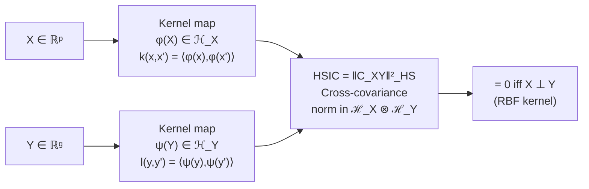
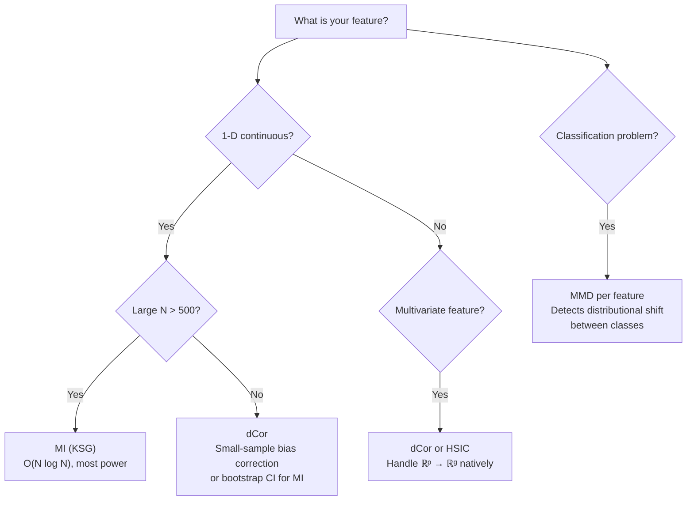

<!-- _class: lead -->
<!-- Speaker notes: This deck covers three advanced dependence measures that complement mutual information. The unifying theme: all three embed random variables into a rich function space and test whether the joint distribution equals the product of marginals. Distance correlation handles multivariate features natively. HSIC adds kernel flexibility. MMD operates at the level of full distributions — ideal for class-separability in classification. -->

# Advanced Dependence Measures

## Module 01 — Statistical Filter Methods

Distance Correlation, HSIC, and MMD: beyond correlation and MI

---

<!-- Speaker notes: Use this comparison table as the anchor for the whole deck. Learners should leave knowing which row to use for their problem. The key differentiator: Pearson and Spearman are signed but only detect specific dependency shapes. dCor, HSIC, and MI detect anything, and dCor/HSIC handle multivariate features natively without needing to estimate a density. -->

## The Dependence Landscape

| Measure | Linear | Monotone | Arbitrary | Multivariate $X,Y$ | $=0 \Leftrightarrow$ Indep |
|---|---|---|---|---|---|
| Pearson $r$ | Yes | No | No | No | No |
| Spearman $\rho$ | Yes | Yes | No | No | No |
| **Distance Cor** | Yes | Yes | **Yes** | **Yes** | **Yes** |
| **HSIC** | Yes | Yes | **Yes** | **Yes** | **Yes** |
| **MI** | Yes | Yes | **Yes** | No | **Yes** |

> All three advanced measures equal zero **if and only if** the variables are independent.

---

<!-- Speaker notes: Distance covariance builds on a beautifully simple idea: if X and Y are dependent, their pairwise distances are also dependent. Double-centering removes marginal distance effects, leaving only the cross-dependence structure. The formula looks intimidating but the implementation is just matrix operations on pairwise distance arrays. Walk through the three steps on the board: (1) compute distance matrices A and B, (2) doubly centre them, (3) take inner product. -->

## Distance Correlation: Core Idea

**Intuition:** If $X$ and $Y$ are dependent, the *pairwise distances* among $X$ values are also related to pairwise distances among $Y$ values.

$$\text{dCov}^2(X, Y) = \frac{1}{n^2} \sum_{k,l} A_{kl} B_{kl}$$

where $A_{kl}$, $B_{kl}$ are **doubly-centred** pairwise distance matrices:

$$A_{kl} = a_{kl} - \bar{a}_{k\cdot} - \bar{a}_{\cdot l} + \bar{a}_{\cdot\cdot}, \quad a_{kl} = \|X_k - X_l\|$$

$$\text{dCor}(X, Y) = \sqrt{\frac{\text{dCov}^2(X, Y)}{\sqrt{\text{dVar}^2(X) \cdot \text{dVar}^2(Y)}}} \in [0, 1]$$

---

<!-- Speaker notes: This code slide is the complete implementation — learners can copy-paste this. Point out that X and Y can be matrices (multivariate features). The only constraint is that they must have the same number of rows. The bias-corrected (U-centred) version is numerically preferred for small samples; the biased version is fine for n > 200. -->

## Distance Correlation: Implementation

```python
from scipy.spatial.distance import cdist

def distance_correlation(X: np.ndarray, Y: np.ndarray) -> float:
    """dCor in [0,1]. X and Y can be matrices (multivariate)."""
    X = X.reshape(-1, 1) if X.ndim == 1 else X
    Y = Y.reshape(-1, 1) if Y.ndim == 1 else Y

    def double_center(D):
        """A_kl = d_kl - row_mean - col_mean + grand_mean"""
        row = D.mean(axis=1, keepdims=True)
        col = D.mean(axis=0, keepdims=True)
        return D - row - col + D.mean()

    A = double_center(cdist(X, X))   # pairwise distances in X-space
    B = double_center(cdist(Y, Y))   # pairwise distances in Y-space

    dcov2_xy = (A * B).mean()
    dcov2_xx = (A * A).mean()
    dcov2_yy = (B * B).mean()

    denom = np.sqrt(dcov2_xx * dcov2_yy)
    return float(np.sqrt(max(0.0, dcov2_xy) / denom)) if denom > 1e-10 else 0.0
```

**Complexity:** $O(N^2)$ — feasible up to $N \approx 10^4$.

---

<!-- Speaker notes: This diagram shows the RKHS embedding idea that underlies both HSIC and MMD. The key insight: mapping into a high (infinite) dimensional feature space where the inner product is given by the kernel. In that space, statistical independence corresponds to the cross-covariance operator being the zero operator, and HSIC measures the Hilbert-Schmidt norm of this operator. -->

## HSIC: Dependence via Kernel Embeddings



**Empirical estimate:**

$$\widehat{\text{HSIC}} = \frac{1}{(n-1)^2} \text{tr}(KHLH)$$

$K_{ij} = k(x_i, x_j)$, $L_{ij} = l(y_i, y_j)$, $H = I - \frac{1}{n}\mathbf{1}\mathbf{1}^T$

---

<!-- Speaker notes: The median heuristic for bandwidth is the practical key to making HSIC work. Without it, a poorly chosen bandwidth makes HSIC either too sensitive (noisy) or too insensitive (misses dependence). The median heuristic is not theoretically optimal but is robust across a wide range of data distributions. For very non-Gaussian data, try a few multiples of the median (0.5x, 1x, 2x) and take the maximum HSIC. -->

## HSIC: Implementation with Median Heuristic

```python
def hsic(X: np.ndarray, Y: np.ndarray, sigma_x=None, sigma_y=None) -> float:
    """HSIC with RBF kernels. Bandwidth via median heuristic if not specified."""
    X = X.reshape(-1, 1) if X.ndim == 1 else X
    Y = Y.reshape(-1, 1) if Y.ndim == 1 else Y
    n = X.shape[0]

    def rbf_kernel(Z, sigma):
        D2 = cdist(Z, Z, metric='sqeuclidean')
        return np.exp(-D2 / (2 * sigma**2))

    def median_bw(Z):
        D2 = cdist(Z, Z, metric='sqeuclidean')
        return np.sqrt(0.5 * np.median(D2[D2 > 0]))

    K = rbf_kernel(X, sigma_x or median_bw(X))
    L = rbf_kernel(Y, sigma_y or median_bw(Y))
    H = np.eye(n) - np.ones((n, n)) / n   # centering matrix

    return float(np.trace(K @ H @ L @ H) / (n - 1)**2)
```

**Bandwidth rule:** Median heuristic = $\sqrt{0.5 \times \text{median pairwise squared distance}}$.

---

<!-- Speaker notes: MMD is conceptually the simplest of the three: it directly measures the distance between two distributions. For binary classification feature selection, split samples by class label and compute MMD on each feature. A feature with high MMD effectively separates the two class distributions — even if their means are identical (e.g., different variances). This catches features that t-tests and ANOVA miss. -->

## MMD: Distributional Feature Relevance

**Use case:** Binary classification — does this feature's distribution *differ between classes*?

$$\text{MMD}^2(P, Q) = \underbrace{\mathbb{E}_{P}[k(x,x')]}_{\text{within class 1}} - 2\underbrace{\mathbb{E}_{P,Q}[k(x,y)]}_{\text{cross-class}} + \underbrace{\mathbb{E}_{Q}[k(y,y')]}_{\text{within class 0}}$$

```python
def mmd_feature_score(x_pos, x_neg, sigma=None):
    """MMD² between positive and negative class samples of one feature."""
    x_pos = x_pos.reshape(-1, 1)
    x_neg = x_neg.reshape(-1, 1)

    pooled = np.vstack([x_pos, x_neg])
    D2_pooled = cdist(pooled, pooled, 'sqeuclidean')
    sigma = sigma or np.sqrt(0.5 * np.median(D2_pooled[D2_pooled > 0]))

    K_pp = np.exp(-cdist(x_pos, x_pos, 'sqeuclidean') / (2*sigma**2))
    K_qq = np.exp(-cdist(x_neg, x_neg, 'sqeuclidean') / (2*sigma**2))
    K_pq = np.exp(-cdist(x_pos, x_neg, 'sqeuclidean') / (2*sigma**2))

    n, m = len(x_pos), len(x_neg)
    np.fill_diagonal(K_pp, 0); np.fill_diagonal(K_qq, 0)
    return K_pp.sum()/(n*(n-1)) + K_qq.sum()/(m*(m-1)) - 2*K_pq.sum()/(n*m)
```

---

<!-- Speaker notes: MMD detects distributional differences that mean-based tests miss. The canonical example: two distributions with identical means but different variances. A t-test gives p≈1.0, but MMD gives a significant positive value. Walk through this: if a feature separates classes only through different variances, MMD catches it while Pearson, MI, and even HSIC (with wrong bandwidth) may not. -->

## MMD Catches What Mean Tests Miss

<div class="columns">

**Example: Same mean, different variance**

Class 0: $X \sim \mathcal{N}(0, 1)$
Class 1: $X \sim \mathcal{N}(0, 4)$ (wider)

| Test | Result |
|---|---|
| t-test (mean difference) | $p \approx 1.0$ — misses it |
| Levene (variance test) | $p \ll 0.05$ — catches it |
| **MMD** | **Large positive** — catches it |

</div>

**Key insight:** MMD tests the entire distribution, not just a moment. It detects differences in mean, variance, skewness, or any other aspect of the distribution shape.

---

<!-- Speaker notes: Permutation testing is the correct way to get p-values for any of these measures. The null hypothesis is independence (X and Y are not associated). Under the null, permuting Y (while holding X fixed) destroys any real dependence while preserving marginal distributions. The p-value is the fraction of permuted statistics that exceed the observed statistic. This works for dCor, HSIC, MMD, and MI alike. -->

## Permutation Testing for Any Measure

```python
def permutation_pvalue(X, y, stat_fn, n_perm=1000, seed=42):
    """
    Get p-value for H₀: X ⊥ y via permutation test.
    Works with any dependence statistic.
    """
    rng = np.random.default_rng(seed)
    observed = stat_fn(X, y)

    # Under H₀, permuting y destroys dependence while keeping marginals
    null = np.array([stat_fn(X, rng.permutation(y)) for _ in range(n_perm)])

    p_value = (null >= observed).mean()
    return observed, p_value

# Usage examples:
dcor_val, dcor_p = permutation_pvalue(x, y, distance_correlation)
hsic_val, hsic_p = permutation_pvalue(x, y, hsic)
```

**Rule of thumb:** Use $n_{\text{perm}} = 1000$ for $\alpha = 0.05$; use $n_{\text{perm}} = 10{,}000$ for $\alpha = 0.001$.

---

<!-- Speaker notes: This is the complexity slide — learners need to know that dCor, HSIC, and MMD are all O(N²) in both time and space. For N > 10,000 this becomes impractical. The RFF approximation reduces HSIC to O(N·D) where D ≈ 1000. Distance correlation has an O(N log N) approximation (AVL-tree method) but it's not in sklearn. For most real-world datasets (N < 50,000), the exact O(N²) methods work fine. -->

## Computational Complexity

| Measure | Time | Space | $N=1000$ | $N=10{,}000$ |
|---|---|---|---|---|
| Pearson / Spearman | $O(N)$ | $O(1)$ | < 1 ms | < 1 ms |
| MI (KSG) | $O(N \log N)$ | $O(N)$ | ~5 ms | ~60 ms |
| **dCor, HSIC, MMD** | $O(N^2)$ | $O(N^2)$ | ~10 ms | **~10 s** |

**Scaling HSIC to large $N$: Random Fourier Features**

```python
from sklearn.kernel_approximation import RBFSampler

rff = RBFSampler(gamma=1.0, n_components=1000, random_state=42)
phi_x = rff.fit_transform(X)   # (N, 1000) — O(N · D)
phi_y = rff.fit_transform(Y)   # (N, 1000)
# Approximate HSIC via mean embedding difference
hsic_approx = np.linalg.norm(phi_x.T @ phi_y / N - np.outer(
    phi_x.mean(0), phi_y.mean(0)))**2
```

$O(N \cdot D)$ with $D = 1000$ — feasible for $N = 10^6$.

---

<!-- Speaker notes: Walk through the decision tree on this slide carefully. The most common mistake is reaching for dCor or HSIC when MI would suffice (MI is cheaper and equally powerful for 1-D continuous features). dCor and HSIC add value when: (1) features are multivariate, (2) you need a p-value from a fast permutation test, or (3) MI estimation is unreliable due to small sample size. MMD is the right choice specifically when you care about class separability in terms of distribution shape, not just statistical association. -->

## Choosing the Right Measure



---

<!-- Speaker notes: Summarise the three measures with their defining use cases. The takeaway for learners: these are not replacements for MI — they are complements. In practice, compute all measures on a small subset and check whether they agree. Disagreement reveals interesting structure in the data worth investigating. -->

## Summary

**Distance Correlation:** Generalises correlation to arbitrary nonlinear dependencies and multivariate features. $O(N^2)$. Exact test of independence.

**HSIC:** Kernel-based. Most flexible — kernel choice tunes sensitivity to specific dependency types. Foundation of kernel-based feature selection methods.

**MMD:** Tests distributional shift between groups. Best for binary classification when class differences go beyond location shifts.

**Key principle:** Use MI for 1-D continuous features. Use dCor/HSIC when features are multivariate or when MI estimation is unreliable. Use MMD when distribution shape matters for classification.

**Next:** Guide 03 — mRMR and Relief: filter methods that account for redundancy between features.

---

<!-- Speaker notes: Reference slide. The Székely 2007 paper is the foundational dCor reference — the proofs are accessible for learners with measure theory background. Gretton 2012 is the definitive MMD reference. Song 2007 connects HSIC directly to supervised feature selection. -->

## References

- Székely, G.J., Rizzo, M.L. & Bakirov, N.K. (2007). **Measuring and testing dependence by correlation of distances.** *Annals of Statistics*, 35(6).
- Gretton, A. et al. (2012). **A kernel two-sample test.** *JMLR*, 13. MMD foundation.
- Song, L. et al. (2007). **Supervised feature selection via dependence estimation.** *ICML*. HSIC for feature selection.
- Rahimi, A. & Recht, B. (2007). **Random features for large-scale kernel machines.** *NeurIPS*. Random Fourier Features.
