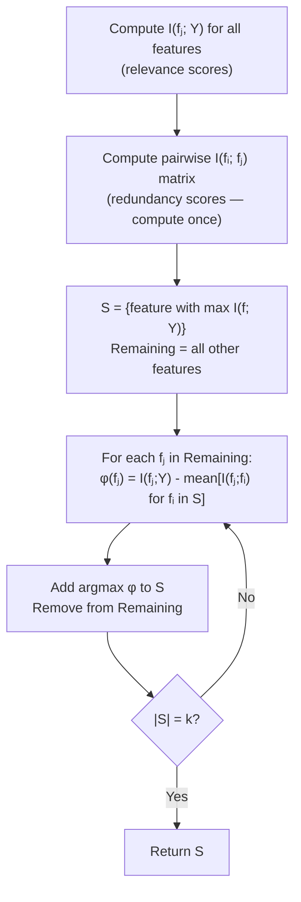
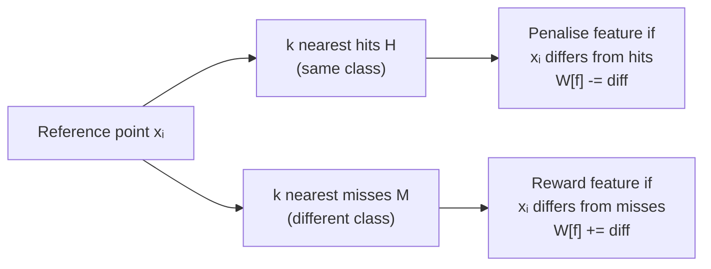

<!-- _class: lead -->
<!-- Speaker notes: This deck completes the statistical filter module. The thread connecting mRMR, FCBF, and Relief: they all reject the false assumption that features can be evaluated independently. A feature is only valuable relative to the set it would join. mRMR handles this algebraically via mutual information differences. Relief handles it geometrically via nearest-neighbour distances. FCBF handles it via symmetric uncertainty thresholding. By the end of this deck, learners should be able to choose the right method for their problem. -->

# mRMR, FCBF, and the Relief Family

## Module 01 — Statistical Filter Methods

Redundancy-aware feature selection: relevance is necessary but not sufficient

---

<!-- Speaker notes: This slide is the central problem statement for the whole deck. A feature with high MI with the target but high MI with another already-selected feature is worthless in a set context. The classic failure mode: adding "mean radius" and "mean perimeter" from breast cancer data — they carry essentially the same information but both score highly in univariate MI filtering. mRMR's second-feature selection penalises the redundant one. -->

## The Problem: Relevance Without Redundancy Control

```
Univariate MI filter on breast cancer dataset:

Rank 1: mean_radius      I = 0.68  ✓ select
Rank 2: mean_perimeter   I = 0.67  ← almost identical to radius!
Rank 3: mean_area        I = 0.65  ← also highly correlated with radius!

Pearson r(mean_radius, mean_perimeter) = 0.998
```

**The problem:** Selecting the top-$k$ MI features can give you $k$ nearly identical features — redundant information repeated, independent information missed.

> **mRMR solution:** When selecting the 2nd feature, subtract the MI between the candidate and the already-selected feature. Redundant features are penalised.

---

<!-- Speaker notes: Walk through the MID formula term by term. The first term is the raw MI relevance — same as univariate MI filtering. The second term is the average redundancy: how much does this candidate share with the already-selected features? The two variants differ in how they combine these: MID subtracts (additive penalty), MIQ divides (multiplicative penalty). MIQ is more aggressive at eliminating redundancy but can be numerically unstable when the denominator is near zero. -->

## mRMR: The Objective

**MID — Mutual Information Difference:**

$$\phi_\text{MID}(f_j) = \underbrace{I(f_j; Y)}_{\text{relevance}} - \underbrace{\frac{1}{|S_m|} \sum_{f_i \in S_m} I(f_j; f_i)}_{\text{average redundancy with selected set}}$$

**MIQ — Mutual Information Quotient:**

$$\phi_\text{MIQ}(f_j) = \frac{I(f_j; Y)}{\frac{1}{|S_m|} \sum_{f_i \in S_m} I(f_j; f_i) + \varepsilon}$$

**Choose MID when:** Features have similar relevance values.
**Choose MIQ when:** Redundancy needs aggressive suppression; high-dimensional data.

---

<!-- Speaker notes: Walk through the algorithm step by step. The first feature is just the highest MI feature — no redundancy to subtract yet. Each subsequent step recomputes the score for all remaining features using the current selected set. The key implementation detail: precompute the full pairwise MI matrix before starting the greedy loop — this avoids repeated expensive MI computations. -->

## mRMR: Greedy Algorithm



**Cost:** $O(p^2)$ for pairwise MI matrix + $O(p \cdot k)$ for greedy selection.

---

<!-- Speaker notes: This is the implementation slide learners will copy. Point out the two-step structure: (1) compute relevance and pairwise MI once, (2) run greedy loop. The pairwise MI computation is the expensive part. For p=100 features and n=1000 samples, this takes about 30 seconds. For p=1000 and n=10000, it becomes impractical — that's where FCBF comes in. -->

## mRMR: Core Implementation

```python
from sklearn.feature_selection import mutual_info_classif

def mrmr(X: pd.DataFrame, y: np.ndarray, n_features: int,
         variant: str = 'MID') -> list:
    p = X.shape[1]
    cols = list(X.columns)

    # Step 1: relevance (MI with target)
    rel = pd.Series(mutual_info_classif(X, y, random_state=42), index=cols)

    # Step 2: pairwise MI matrix (computed once)
    mi_mat = np.zeros((p, p))
    for i, col in enumerate(cols):
        scores = mutual_info_classif(X.drop(columns=[col]), X[col], random_state=42)
        other = [c for c in cols if c != col]
        for k, c in enumerate(other):
            j = cols.index(c)
            mi_mat[i, j] = mi_mat[j, i] = scores[k]

    # Step 3: greedy forward selection
    selected_idx = [rel.values.argmax()]
    remaining_idx = [i for i in range(p) if i != selected_idx[0]]

    for _ in range(n_features - 1):
        scores = {}
        for j in remaining_idx:
            red = mi_mat[j, selected_idx].mean()
            scores[j] = rel.iloc[j] - red if variant=='MID' else rel.iloc[j]/(red+1e-10)
        best = max(scores, key=scores.get)
        selected_idx.append(best); remaining_idx.remove(best)

    return [cols[i] for i in selected_idx]
```

---

<!-- Speaker notes: FCBF was designed for the genomics setting: tens of thousands of binary SNP features, moderate sample size, fast runtime required. The Symmetric Uncertainty is just normalised MI: dividing by the average of the marginal entropies maps it to [0,1], which makes the threshold interpretable. Phase 1 is just MI thresholding. Phase 2 is the clever redundancy step: a feature is dropped if any higher-ranked feature explains it at least as well as the target does. -->

## FCBF: Fast Correlation-Based Filter

Designed for ultra-high-dimensional discrete features ($p > 10{,}000$).

**Symmetric Uncertainty (SU)** — normalised MI:

$$\text{SU}(X, Y) = 2 \cdot \frac{I(X; Y)}{H(X) + H(Y)} \in [0, 1]$$

**Two-phase algorithm:**

```
Phase 1 — Relevance threshold:
  Keep features where SU(f, Y) > δ (default δ = 0.01)
  Sort by SU(f, Y) descending → ordered list S_rel

Phase 2 — Redundancy elimination:
  For each candidate f_i in S_rel (in order):
    For each already-selected f_j:
      If SU(f_i, f_j) ≥ SU(f_i, Y):
        f_i is redundant given f_j → discard
    If not discarded → add to final set
```

**Complexity:** $O(p)$ for Phase 1 + $O(p \cdot |S_\text{rel}|)$ for Phase 2 — linear in $p$.

---

<!-- Speaker notes: The XOR interaction example is the canonical demonstration of why Relief is categorically different from MI-based methods. Spend time on this — it's counter-intuitive. Each feature individually has zero mutual information with the XOR target, yet they are jointly perfectly predictive. ReliefF discovers this because: for a given instance, the nearest miss (opposite XOR class) must differ on at least one of A or B, while the nearest hit (same XOR class) tends to match on both. The nearest-neighbour geometry captures this. -->

## Why Relief Is Different: Feature Interactions

**XOR problem:** $Y = \text{XOR}(A, B)$, with 10 noise features added.

```python
# Generate XOR dataset
n = 1000
A = np.random.randint(0, 2, n)
B = np.random.randint(0, 2, n)
Y = np.bitwise_xor(A, B)
noise = np.random.randn(n, 10)

X = pd.DataFrame(np.column_stack([A, B, noise]),
                 columns=['A', 'B'] + [f'noise_{i}' for i in range(10)])
```

| Method | Score for A | Score for B | Decision |
|---|---|---|---|
| MI (univariate) | $\approx 0$ | $\approx 0$ | Discard both |
| Pearson | $\approx 0$ | $\approx 0$ | Discard both |
| **ReliefF** | **Positive** | **Positive** | **Keep both** |

ReliefF correctly identifies A and B through the neighbourhood geometry — no density estimation needed.

---

<!-- Speaker notes: Walk through the ReliefF weight update geometrically. Imagine a 2-D plot of instances. For a given reference point x_i, you find its k nearest hits (same class) and k nearest misses (different class). Features that put hits close but misses far receive high weights. Features that are noisy (hits and misses equally far) receive near-zero weights. Features that put hits far (non-discriminative within class) receive negative weights. This is a much richer signal than any marginal statistic. -->

## ReliefF: Nearest-Neighbour Feature Weighting

$$W[f] \mathrel{{+}{=}} -\frac{1}{mk}\sum_{i=1}^{m}\sum_{j=1}^{k} \text{diff}(f, x_i, H_j^i) + \frac{1}{mk}\sum_{i=1}^{m}\sum_c \frac{P(c)}{1-P(c_i)}\sum_{j=1}^{k}\text{diff}(f, x_i, M_j^{i,c})$$

where $\text{diff}(f, x_i, x_j) = |x_i^f - x_j^f|$ (normalised to $[0, 1]$).



---

<!-- Speaker notes: MultiSURF is the version to recommend for new users — it removes the k hyperparameter by using a data-adaptive radius. The radius is half the average pairwise distance. Features inside the radius are treated as hits or misses; features outside are ignored. In practice MultiSURF is more robust than ReliefF when class boundaries are complex. The tradeoff: O(n²) preprocessing to compute the full distance matrix. -->

## MultiSURF: Adaptive Neighbourhood (No $k$ Needed)

ReliefF requires choosing $k$ (hits and misses per instance). MultiSURF replaces $k$ with an adaptive radius:

$$r = \frac{1}{2} \cdot \overline{d(x_i, x_j)} \quad \text{(half the average pairwise distance)}$$

All instances within radius $r$ are treated as hits or misses; outside are ignored.

```python
def multisurf_score(X_norm, y):
    from sklearn.metrics import pairwise_distances
    D = pairwise_distances(X_norm)
    radius = D[D > 0].mean() / 2.0
    weights = np.zeros(X_norm.shape[1])

    for i in range(len(X_norm)):
        neighbours = np.where((D[i] < radius) & (np.arange(len(X_norm)) != i))[0]
        hits  = [j for j in neighbours if y[j] == y[i]]
        misses = [j for j in neighbours if y[j] != y[i]]
        n_total = len(hits) + len(misses) or 1
        for j in hits:
            weights -= np.abs(X_norm[i] - X_norm[j]) / (len(X_norm) * n_total)
        for j in misses:
            weights += np.abs(X_norm[i] - X_norm[j]) / (len(X_norm) * n_total)
    return weights
```

---

<!-- Speaker notes: This comparison table is the decision framework learners should memorise. The key differentiators: FCBF wins on speed for huge discrete datasets; ReliefF wins on interaction detection; mRMR wins on continuous data with explicit redundancy control. None of them is universally best — the problem structure determines the choice. Encourage learners to try all three on their data and look for consensus features (features ranked highly by all three methods are the safest to include). -->

## Decision Framework: Which Method?

| | **mRMR** | **ReliefF / MultiSURF** | **FCBF** |
|---|---|---|---|
| Feature interactions | No | **Yes** | No |
| Explicit redundancy | **Yes** | Partial | **Yes** |
| $p > 10{,}000$ | No | Slow | **Yes** |
| Continuous features | **Best** | Yes | Needs discretisation |
| Needs hyperparameter | No | $k$ (or none w/ MultiSURF) | $\delta$ threshold |

**Practical recommendation:**
1. Run all three on your dataset
2. **Consensus features** (ranked high by all methods) — safe to include
3. **Method-specific features** — investigate why; look for interactions or redundancy patterns
4. Cross-validate both consensus-only and union sets

---

<!-- Speaker notes: Summary slide — three key messages. (1) Univariate MI filtering ignores redundancy: fix it with mRMR. (2) Univariate filtering ignores interactions: fix it with Relief. (3) High-dimensional discrete data needs speed: fix it with FCBF. These three methods cover most practical scenarios. The next module moves to wrapper methods (GA) which can handle all these cases simultaneously at much higher computational cost. -->

## Summary

**Three filters for the relevance-redundancy trade-off:**

1. **mRMR**: Explicit redundancy removal via pairwise MI. Best for continuous features, $p < 1000$. Two variants: MID (additive) and MIQ (multiplicative).

2. **ReliefF / MultiSURF**: Neighbourhood-based weighting. Captures feature interactions — the only filter-stage method that does. Start with MultiSURF (no $k$ to tune).

3. **FCBF**: Symmetric uncertainty thresholding. Designed for $p > 10{,}000$ discrete features. Fastest of the three.

**Consensus approach:** Run all three, select features agreed upon by at least two methods, validate with cross-validation.

**Next module:** Wrapper and embedded methods — genetic algorithms, Boruta, and recursive feature elimination.

---

<!-- Speaker notes: Reference slide. The Peng 2005 mRMR paper is the most-cited feature selection paper of the last 20 years — essential reading. Yu & Liu 2003 (FCBF) is short and elegant. Urbanowicz 2018 is the definitive modern survey of Relief-based methods. Kononenko 1994 is the original ReliefF paper. -->

## References

- Peng, H., Long, F. & Ding, C. (2005). **Feature selection based on mutual information: criteria of max-dependency, max-relevance, and min-redundancy.** *IEEE TPAMI*, 27(8).
- Yu, L. & Liu, H. (2003). **Feature selection for high-dimensional data: a fast correlation-based filter solution.** *ICML*.
- Kononenko, I. (1994). **Estimating attributes: analysis and extensions of Relief.** *ECML*.
- Urbanowicz, R.J. et al. (2018). **Relief-based feature selection: introduction and review.** *Journal of Biomedical Informatics*, 85.
- Robnik-Šikonja, M. & Kononenko, I. (2003). **Theoretical and empirical analysis of ReliefF and RReliefF.** *Machine Learning*, 53(1–2).
