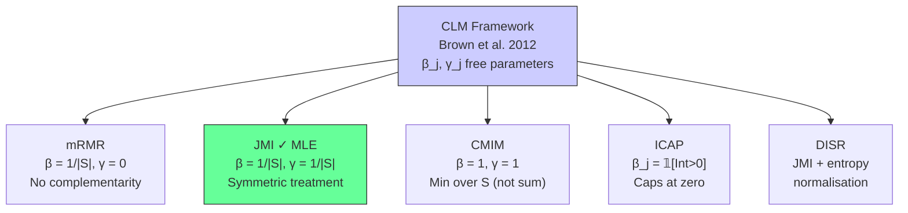

<!-- _class: lead -->
<!-- Speaker notes: Open by asking the audience how many ITFS criteria they've heard of — mRMR, JMI, CMIM, DISR, ICAP. The point of this deck is to show that all of these are the same criterion wearing different clothes. Reference Brown et al. (2012) JMLR early so students know to read it. -->

# Information-Theoretic Feature Selection
## The Unified Framework

### Module 02 — Information Theory

Based on Brown et al. (2012) — *Conditional Likelihood Maximisation: A Unifying Framework for Information Theoretic Feature Selection*, JMLR 13

---

<!-- Speaker notes: This slide motivates the entire module. The key message: there is an embarrassingly large zoo of ITFS criteria in the literature, and practitioners pick them arbitrarily. Brown et al. showed they are all the same thing. Once students understand this, they can reason about criteria rather than memorise them. -->

## The Problem with the ITFS Zoo

<div class="columns">
<div>

**Named criteria in the literature:**

- mRMR (Peng et al., 2005)
- JMI (Yang & Moody, 1999)
- CMIM (Fleuret, 2004)
- DISR (Meyer et al., 2008)
- ICAP (Jakulin, 2005)
- FCBF, MIM, MRMRQ, ...

</div>
<div>

**Practitioner reality:**

> "I tried mRMR, then JMI, then CMIM. JMI worked best. I don't know why."

This is the wrong way to work. **Brown et al. (2012) give us principled guidance.**

</div>
</div>

---

<!-- Speaker notes: Walk through the notation carefully. H, I, and CMI are the three building blocks. Emphasise that all of the criteria we discuss use only these three quantities — they just combine them differently. The chain rule identity at the bottom is the algebraic backbone of everything. -->

## Notation and Building Blocks

Let $S$ be the selected set, $x_k$ a candidate feature, $y$ the target.

**Shannon Entropy:**
$$H(X) = -\sum_x p(x) \log p(x)$$

**Mutual Information:**
$$I(X; Y) = H(X) - H(X|Y) = \sum_{x,y} p(x,y) \log \frac{p(x,y)}{p(x)p(y)}$$

**Conditional Mutual Information:**
$$I(X; Y | Z) = H(X|Z) - H(X|Y,Z)$$

**Chain rule identity** (key algebraic tool):
$$I(X; Y | Z) = I(X; Y) - I(X; Z) + I(X; Z | Y)$$

---

<!-- Speaker notes: This is the punchline of the entire deck. Show this slide and let it sink in for 30 seconds before speaking. Then say: "Every ITFS criterion you have ever seen is a special case of this equation. The only thing that varies is beta and gamma." -->

## The Unified CLM Criterion

**Brown et al. (2012), Theorem 1:**

$$\boxed{J_\text{CLM}(x_k) = I(x_k; y) + \sum_{x_j \in S} \left[ \gamma_j \cdot I(x_k; x_j | y) - \beta_j \cdot I(x_k; x_j) \right]}$$

| Term | Meaning | Sign |
|------|---------|------|
| $I(x_k; y)$ | Relevance of $x_k$ to target | + (maximise) |
| $\beta_j \cdot I(x_k; x_j)$ | Redundancy with selected $x_j$ | − (penalise) |
| $\gamma_j \cdot I(x_k; x_j \vert y)$ | Complementarity with $x_j$ | + (reward) |

> Every major ITFS criterion sets $(\beta_j, \gamma_j)$ differently.

---

<!-- Speaker notes: Walk through the mermaid diagram explaining how each criterion sits in the family. Emphasise that JMI is the most principled (it is the MLE solution), while mRMR is a degraded version that ignores complementarity. CMIM uses the same parameters as JMI but applies them differently (min instead of mean). -->

## How the Criteria Relate



---

<!-- Speaker notes: Walk through the derivation one line at a time. This is the mathematical core. Emphasise that the log-likelihood of a naive Bayes classifier, when you expand it and take expectations, gives you exactly the CLM objective. This validates JMI as the "right" criterion — it is ML estimation, not a heuristic. -->

## Deriving the Unified Criterion

**Start:** Naive Bayes log-likelihood for class $y$ given features $\{x_k\} \cup S$:

$$\ell = \sum_i \log p(y_i \mid x_{k,i}, \mathbf{x}_{S,i})$$

**Conditional independence approximation over $S$:**

$$\log p(y \mid x_k, \mathbf{x}_S) \approx \log p(y \mid x_k) + \sum_{x_j \in S} \log \frac{p(y \mid x_k, x_j)}{p(y \mid x_j)}$$

**Take expectation over the data distribution:**

$$\mathbb{E}[\ell] = I(x_k; y) + \sum_{x_j \in S} \underbrace{\left[I(x_k; x_j \mid y) - I(x_k; x_j)\right]}_{\text{CLM with } \beta=\gamma=1} + \text{const}$$

> **JMI maximises the expected naive Bayes likelihood** — it is principled ML estimation.

---

<!-- Speaker notes: mRMR is the most widely used criterion but also the most flawed within the CLM framework. The key point: by setting gamma=0, mRMR cannot detect complementary features — features that are individually useless but jointly informative. Show the XOR example if you have time. -->

## mRMR: Minimum Redundancy Maximum Relevance

$$J_\text{mRMR}(x_k) = I(x_k; y) - \frac{1}{|S|} \sum_{x_j \in S} I(x_k; x_j)$$

**CLM parameters:** $\beta_j = 1/|S|$, $\gamma_j = 0$

**Interpretation:**
- Maximise relevance to $y$
- Penalise average pairwise MI with selected features
- **Ignores complementarity entirely** ($\gamma = 0$)

**When mRMR fails:**
- Features $x_a$, $x_b$ individually have $I(x_a;y) \approx 0$, $I(x_b;y) \approx 0$
- But $I(x_a, x_b; y) \gg 0$ (XOR-type interaction)
- mRMR will never select either feature

---

<!-- Speaker notes: JMI is the recommended default. Walk through the decomposition using the chain rule to show that JMI and mRMR differ only by the gamma term. The gamma term is the conditional MI I(x_k; x_j | y) — the information x_k and x_j share ABOUT y specifically. -->

## JMI: Joint Mutual Information

$$J_\text{JMI}(x_k) = \sum_{x_j \in S} I(x_k, x_j; y)$$

Expanding via chain rule:
$$= \underbrace{|S| \cdot I(x_k; y)}_{\text{relevance}} - \underbrace{\sum_{x_j \in S} I(x_k; x_j)}_{\text{redundancy}} + \underbrace{\sum_{x_j \in S} I(x_k; x_j | y)}_{\text{complementarity}}$$

**CLM parameters:** $\beta_j = 1/|S|$, $\gamma_j = 1/|S|$

> JMI is the **maximum likelihood estimate** of the CLM objective. It is the principled default.

---

<!-- Speaker notes: CMIM uses the same parameters as JMI (beta=gamma=1) but applies them to the single WORST case x_j rather than averaging over all S. This makes CMIM conservative and robust when one dominant feature in S makes many candidates look redundant. -->

## CMIM: Conditional MI Maximisation

$$J_\text{CMIM}(x_k) = \min_{x_j \in S} I(x_k; y | x_j)$$

**Minimax interpretation:**
- Find the feature that is **most informative about $y$** even given its worst-case competitor
- Conservative: guards against one dominant selected feature making all candidates look redundant

**CLM parameters:** $\beta = 1$, $\gamma = 1$, applied to the minimising $x_j^*$:

$$J_\text{CMIM}(x_k) = I(x_k; y) - I(x_k; x_{j^*}) + I(x_k; x_{j^*} | y)$$

where $x_{j^*} = \argmin_{x_j \in S} I(x_k; y | x_j)$

---

<!-- Speaker notes: DISR is the scale-invariant version of JMI. The normalisation by joint entropy makes it range-bound between 0 and 1, which is useful when you want to set a threshold for selection rather than choosing k a priori. -->

## DISR: Double Input Symmetrical Relevance

$$J_\text{DISR}(x_k) = \frac{1}{|S|} \sum_{x_j \in S} \frac{I(x_k, x_j; y)}{H(x_k, x_j, y)}$$

**Symmetrical uncertainty extended to three variables:**

$$\text{SU}(x_k, x_j; y) = \frac{I(x_k, x_j; y)}{H(x_k, x_j, y)} \in [0, 1]$$

**When to prefer DISR:**
- Features have very different cardinalities or ranges
- You want a threshold-based stopping criterion
- Mixed discrete/continuous features (after discretisation)

> DISR is JMI with an entropy normalisation. It does not change which features are selected in most cases, but makes scores more interpretable.

---

<!-- Speaker notes: ICAP is the conservative choice for noisy data. The interaction information (co-information) can be negative (synergy) or positive (redundancy). ICAP caps the reward for synergy at zero — it penalises redundancy but does not reward synergy. This is appropriate when you suspect label noise or look-ahead bias. -->

## ICAP: Interaction Capping

$$J_\text{ICAP}(x_k) = I(x_k; y) - \sum_{x_j \in S} \max\{0, \underbrace{I(x_k; x_j) - I(x_k; x_j | y)}_{\text{interaction information}}\}$$

**Interaction information:**
$$\text{Int}(x_k; x_j; y) = I(x_k; x_j) - I(x_k; x_j | y)$$

| Sign of Int | Interpretation |
|-------------|----------------|
| $\text{Int} > 0$ | $x_k$, $x_j$ **redundant** with respect to $y$ — penalise |
| $\text{Int} < 0$ | $x_k$, $x_j$ **synergistic** with respect to $y$ — cap at 0 |

> Use ICAP for financial time series where spurious interactions are common.

---

<!-- Speaker notes: This table is the key practical output of the deck. Tell students to save or screenshot this slide — it is the decision guide for choosing a criterion. The main message: JMI is your default, but you should switch based on the properties of your data. -->

## Criterion Selection Guide

| Criterion | Best For | Avoid When |
|-----------|----------|------------|
| **mRMR** | Quick baseline | Complementarity exists |
| **JMI** | General purpose (default) | Very small $n$ |
| **CMIM** | Strong dominant features in $S$ | Many weak interactions |
| **DISR** | Mixed cardinality features | Computational budget tight |
| **ICAP** | Noisy / financial data | Strong synergies expected |

**Rule of thumb:** Start with JMI. Switch to CMIM if $|S|$ contains one very strong feature. Switch to ICAP if label noise is suspected.

---

<!-- Speaker notes: Walk through the complexity table. The key point is that all criteria have the same asymptotic complexity O(pk) — the difference is the constant. For large p and n, the bottleneck is always the MI estimation, not the criterion logic. Parallelising over candidates x_k is the most impactful optimisation. -->

## Computational Complexity

All criteria select $k$ features from $p$ using **greedy forward search**:

| Criterion | Per-Step MI Calls | Type of MI |
|-----------|------------------|------------|
| mRMR | $O(pk)$ | Marginal MI |
| JMI | $O(pk)$ | Conditional MI |
| CMIM | $O(pk)$ | Conditional MI + min |
| ICAP | $O(2pk)$ | Marginal + Conditional |
| DISR | $O(pk)$ | Joint MI + entropy |

**Total cost for selecting $k$ features:**

$$\text{Cost} = O\left(\frac{pk^2}{2}\right) \text{ MI evaluations}$$

> Parallelise over the $p$ candidates at each step. All criteria are embarrassingly parallel.

---

<!-- Speaker notes: This two-column layout shows a minimal working implementation of the CLM framework. The key insight in the code is that all criteria reduce to the same function call pattern — just with different score functions. Students should modify this in Notebook 01. -->

## Implementation Pattern

<div class="columns">
<div>

**Unified selector skeleton:**

```python
def itfs_select(X, y, k, criterion):
    S = []
    candidates = list(range(X.shape[1]))

    for _ in range(k):
        scores = {
            f: criterion(f, y, S, X)
            for f in candidates
        }
        best = max(scores, key=scores.get)
        S.append(best)
        candidates.remove(best)

    return S
```

</div>
<div>

**Plug in any criterion:**

```python
itfs_select(X, y, k=10, criterion=jmi_score)
itfs_select(X, y, k=10, criterion=cmim_score)
itfs_select(X, y, k=10, criterion=mrmr_score)
```

**The CLM perspective:**
All three calls run the same algorithm. Only `criterion(...)` — the $(\beta, \gamma)$ choice — differs.

</div>
</div>

---

<!-- Speaker notes: Walk through the empirical results from Brown et al. (2012). The key findings: JMI wins most often. mRMR wins least often. CMIM is competitive when strong features dominate. These results motivate the guideline on the previous slide. -->

## Empirical Comparison (Brown et al., 2012)

Results across 14 benchmark classification datasets, varying $k$ from 1 to 20:

<div class="columns">
<div>

**Win rates (most-often best):**
1. JMI — 43% of cases
2. CMIM — 31% of cases
3. DISR — 29% of cases
4. ICAP — 27% of cases
5. mRMR — 18% of cases

</div>
<div>

**Key finding:**
No single criterion dominates all datasets. JMI is the best overall default but can be beaten by CMIM when a single strong feature dominates the early selection rounds.

> No free lunch — but **JMI is the principled default.**

</div>
</div>

---

<!-- Speaker notes: Common pitfalls are just as important as the theory. Hit all four points clearly. The CMI sample size issue (#3) is the one most students get wrong in their implementations — conditioning on x_j partitions the data, and small partitions give unreliable estimates. -->

## Common Pitfalls

**1. Applying ITFS to raw continuous features**
Discretise first. Use quantile-based binning ($n_\text{bins} = 10$). For continuous targets, use $k$-NN MI estimators.

**2. Treating selected features as globally optimal**
ITFS is greedy and sequential — there is no global optimality guarantee. Results depend on selection order.

**3. Ignoring CMI sample-size requirements**
$I(x_k; y | x_j)$ with $x_j$ having 10 bins requires $\sim n/10$ samples per bin. Reliable estimation needs $n > 500$.

**4. Using mRMR when complementarity exists**
mRMR sets $\gamma = 0$ — it cannot detect XOR-type feature interactions. Use JMI instead.

---

<!-- Speaker notes: Summarise the entire deck in one table. Students should be able to reconstruct the key ideas from this table alone. Emphasise the unified view: all criteria are the same objective with different hyperparameters. -->

## Key Takeaways

| Concept | Key Point |
|---------|-----------|
| **CLM Framework** | All major ITFS criteria are $J = I(x_k;y) - \beta \sum I(x_k;x_j) + \gamma \sum I(x_k;x_j\|y)$ |
| **JMI = MLE** | JMI is the maximum likelihood estimate of the naive Bayes likelihood |
| **mRMR flaw** | $\gamma = 0$ — ignores complementarity, performs worst empirically |
| **CMIM** | Minimax criterion — use when $S$ contains a dominant feature |
| **ICAP** | Caps synergy reward — use for noisy financial data |
| **Complexity** | All are $O(pk^2/2)$ — parallelise over candidates |

---

<!-- Speaker notes: Connections slide — always include this. Point students to the guide for proofs and the notebook for implementation. Emphasise that Transfer Entropy and Rényi MI in Guide 02 are extensions of this framework to handle heavy tails and directed time series dependence. -->

## What's Next

<div class="columns">
<div>

**Builds on (Module 01):**
- Shannon entropy and MI basics
- Filter methods: relevance-redundancy
- Greedy forward selection

</div>
<div>

**Leads to:**
- **Guide 02**: When standard MI fails — Rényi entropy, transfer entropy, copula MI
- **Notebook 01**: Build the unified selector and compare all 5 criteria on real data
- **Module 03**: Wrapper methods replace MI with model CV error

</div>
</div>

> **Read:** Brown, G. et al. (2012). Conditional Likelihood Maximisation. *JMLR* 13, 27–66.
