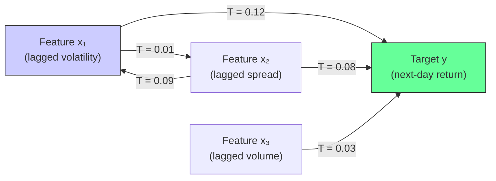
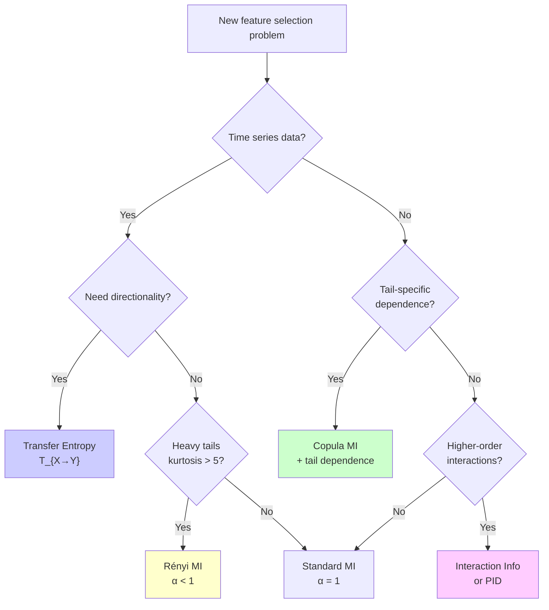

<!-- _class: lead -->
<!-- Speaker notes: Open with the question: "When does mutual information lie to you?" The answer is: when your data has heavy tails, directional causality, or higher-order feature synergy. Each section of this deck addresses one failure mode of standard MI and shows the advanced measure that fixes it. -->

# Advanced Information Measures
## When Standard MI Is Not Enough

### Module 02 — Information Theory

Transfer Entropy · Rényi MI · Copula Dependence · Interaction Information

---

<!-- Speaker notes: This slide frames the problem. Standard MI is optimal for Gaussian data with symmetric, undirected dependence. Financial data violates all three assumptions. Walk through each row of the table and ask students: "Does this apply to your data?" The answer for financial data is almost always yes. -->

## Why Standard MI Sometimes Fails

Standard MI $I(X;Y) = \sum p(x,y) \log \frac{p(x,y)}{p(x)p(y)}$ assumes:

| Assumption | Violated By | Consequence |
|------------|-------------|-------------|
| Well-behaved tails | Fat-tailed returns (Student-$t$, Pareto) | MI underweights extremes |
| Symmetric dependence | Time series causality ($X$ drives $Y$) | Cannot detect direction |
| Pairwise sufficiency | XOR-type feature interactions | Misses synergistic features |
| Stable marginals | Regime-switching (crisis vs. calm) | Non-stationary MI |

> Each failure mode has a targeted fix. This deck covers all four.

---

<!-- Speaker notes: The Rényi entropy family is indexed by alpha. Walk through what happens as alpha varies from 0 to infinity. The key insight: alpha < 1 upweights rare events (tails), alpha > 1 downweights them (focuses on the mode). For heavy-tailed financial data, use alpha < 1. -->

## Rényi Entropy: Controlling Tail Sensitivity

$$H_\alpha(X) = \frac{1}{1-\alpha} \log \sum_x p(x)^\alpha, \quad \alpha > 0$$

**Special cases:**

| $\alpha$ | Name | Focus |
|----------|------|-------|
| $\alpha \to 0$ | Max entropy | Support size only |
| $\alpha \to 1$ | **Shannon** | Expected log-probability |
| $\alpha = 2$ | Collision entropy | $-\log P(\text{two draws equal})$ |
| $\alpha \to \infty$ | Min-entropy | Most probable event only |

**Key property:** For $\alpha < 1$, rare events (tails) receive **more** weight.

---

<!-- Speaker notes: The alpha choice guide is the practical output of this section. Students should apply the kurtosis rule of thumb before running feature selection on any new financial dataset. Do not cherry-pick alpha after seeing results — that is model selection bias. -->

## $\alpha$-MI for Heavy-Tailed Financial Data

**$\alpha$-mutual information** (additive approximation):

$$I_\alpha(X; Y) \approx H_\alpha(X) + H_\alpha(Y) - H_\alpha(X, Y)$$

**Choosing $\alpha$ based on tail heaviness:**

| Tail behaviour | Kurtosis | Recommended $\alpha$ |
|----------------|----------|---------------------|
| Gaussian | $\kappa \approx 0$ | $1.0$ (Shannon) |
| Moderate tails | $\kappa \in [1, 5]$ | $0.75$ |
| Heavy tails | $\kappa \in [5, 15]$ | $0.5$ |
| Extreme tails / crisis | $\kappa > 15$ | $0.25$ |

> Determine $\alpha$ from the **kurtosis of the marginal distribution** before running feature selection — not after seeing results.

---

<!-- Speaker notes: The code block shows a minimal Renyi MI implementation. Emphasise that the additive decomposition H(X) + H(Y) - H(X,Y) is exact for alpha=1 (Shannon) but approximate for other alpha. For precision, use the variational definition based on Renyi divergence (see Guide 02). -->

## Rényi MI: Implementation

```python
def renyi_entropy(probs, alpha):
    probs = probs[probs > 0]
    if np.isclose(alpha, 1.0):
        return -np.sum(probs * np.log(probs))  # Shannon
    return (1.0 / (1.0 - alpha)) * np.log(np.sum(probs ** alpha))

def renyi_mi(x_disc, y_disc, alpha):
    """Alpha-MI using the additive approximation."""
    n = len(x_disc)
    _, px = np.unique(x_disc, return_counts=True)
    _, py = np.unique(y_disc, return_counts=True)
    xy = x_disc * (np.max(y_disc) + 1) + y_disc
    _, pxy = np.unique(xy, return_counts=True)

    hx  = renyi_entropy(px/n, alpha)
    hy  = renyi_entropy(py/n, alpha)
    hxy = renyi_entropy(pxy/n, alpha)
    return hx + hy - hxy
```

> For $\alpha = 1$: recovers Shannon MI exactly.

---

<!-- Speaker notes: Transfer entropy is the non-linear generalisation of Granger causality. Walk through the formula carefully: the key is that we condition on Y's OWN history. This controls for Y's autocorrelation, so the TE only captures the additional information flowing from X. -->

## Transfer Entropy: Directed Information Flow

**Transfer entropy** from $X$ to $Y$ (Schreiber, 2000):

$$T_{X \to Y} = I(Y_{t+1}; X_{t-\ell:t} \mid Y_{t-k:t})$$

$$= H(Y_{t+1} \mid Y_{t-k:t}) - H(Y_{t+1} \mid Y_{t-k:t}, X_{t-\ell:t})$$

**Interpretation:**
- How much does knowing $X$'s past reduce uncertainty about $Y$'s next value...
- ...over and above what $Y$'s own past already tells us?

**Key property:** $T_{X \to Y} \neq T_{Y \to X}$ — **TE is asymmetric by construction.**

---

<!-- Speaker notes: The comparison table between Granger causality and Transfer Entropy is important. The key message: TE is strictly more general. Granger causality is a special case of TE for linear Gaussian VAR models. Use TE when you suspect non-linear dynamics (e.g., regime switching, volatility clustering). -->

## Transfer Entropy vs. Granger Causality

| Property | Granger Causality | Transfer Entropy |
|----------|------------------|-----------------|
| Linear assumption | Yes — VAR model | No — model-free |
| Gaussian assumption | Yes | No |
| Non-linear detection | No | Yes |
| Computational cost | Low (OLS) | Medium (MI estimation) |
| Significance testing | F-test | Surrogate test |

**For linear Gaussian systems**, both are equivalent:

$$T_{X \to Y} = \frac{1}{2} \log \frac{\text{Var}(Y_{t+1} \mid Y_{t-k:t})}{\text{Var}(Y_{t+1} \mid Y_{t-k:t}, X_{t-\ell:t})}$$

> When in doubt, run both. If they disagree, the non-linearity is informative.

---

<!-- Speaker notes: The mermaid diagram shows a directed information flow network. In practice you compute this for all p features and rank by T_{x_i -> y}. The directed edges capture which features are leading indicators of the target. Features with high TE to y but low TE from y are the best candidates. -->

## Information Flow Network



> Rank features by $T_{x_i \to y}$. Features with high TE to $y$ and low TE from $y$ are strong leading indicators.

---

<!-- Speaker notes: Surrogate testing is essential. Without it, you will select features that appear to have high TE purely by chance (multiple testing). The procedure is simple: shuffle the source time series to destroy temporal structure, then recompute TE. The distribution of surrogate TEs forms the null hypothesis. -->

## Significance Testing: Surrogate Method

Transfer entropy must be tested against a null of **no directed dependence**:

```python
def te_significance(x, y, k=1, ell=1, n_bins=10,
                    n_surrogates=200, alpha=0.05):
    te_obs = transfer_entropy(x, y, k, ell, n_bins)

    surrogate_tes = []
    rng = np.random.default_rng(42)
    for _ in range(n_surrogates):
        # Shuffle x to destroy temporal structure
        # but preserve marginal distribution
        x_shuffled = rng.permutation(x)
        surrogate_tes.append(
            transfer_entropy(x_shuffled, y, k, ell, n_bins)
        )

    p_value = np.mean(np.array(surrogate_tes) >= te_obs)
    return te_obs, p_value, p_value < alpha
```

> Always test TE significance. Without surrogates, you are likely to select noise features.

---

<!-- Speaker notes: Copulas separate the "what" (marginal distributions) from the "how" (dependence structure). Sklar's theorem guarantees this decomposition is always possible. The key practical step is the probability integral transform — mapping each series to uniform marginals before computing MI. -->

## Copula-Based MI: Separating Structure from Margins

**Sklar's Theorem:** Any joint CDF $F(x,y)$ decomposes as:

$$F(x, y) = C(F_X(x), F_Y(y))$$

where $C: [0,1]^2 \to [0,1]$ is the **copula** — the dependence structure independent of marginals.

**Copula MI:**

$$I_C(X; Y) = \int_0^1 \int_0^1 c(u, v) \log c(u, v) \, du \, dv$$

**Practical computation:**
1. Map each series to uniform marginals: $u_i = \hat{F}_{x_i}(x_i)$ (rank transform)
2. Compute MI on the uniform-marginal data

> Standard MI conflates marginal shape with dependence. Copula MI isolates dependence only.

---

<!-- Speaker notes: Tail dependence is the most important copula property for financial risk management. The upper tail dependence coefficient lambda_U measures how often both variables exceed their high quantile simultaneously. Gaussian copula has lambda_U = 0, which is why it failed in 2008 — it underestimated crisis co-movements. -->

## Tail Dependence: Crisis Co-movement

**Upper tail dependence coefficient:**

$$\lambda_U = \lim_{u \to 1} P(Y > F_Y^{-1}(u) \mid X > F_X^{-1}(u))$$

<div class="columns">
<div>

**Interpretation:**
- $\lambda_U = 0$: No crisis co-movement (Gaussian copula)
- $\lambda_U > 0$: Features co-move during extremes
- $\lambda_U = 1$: Perfect tail dependence (comonotonicity)

</div>
<div>

**Copula families by $\lambda_U$:**

| Copula | $\lambda_U$ |
|--------|-------------|
| Gaussian | 0 |
| Clayton (upper) | Varies |
| Gumbel | $2 - 2^{1/\theta}$ |
| Student-$t$ | $> 0$ for all $\nu$ |

</div>
</div>

---

<!-- Speaker notes: Interaction information is the key to understanding synergy and redundancy in feature pairs. Walk through the sign convention carefully: positive = redundancy (features tell y the same thing), negative = synergy (features tell y something together that neither tells alone). Use the XOR example. -->

## Interaction Information: Redundancy and Synergy

**Interaction information** (McGill, 1954):

$$\text{Int}(X; Y; Z) = I(X; Y) - I(X; Y \mid Z)$$

Using Brown et al. convention for features $x_k$, $x_j$, target $y$:

$$\text{Int}(x_k; x_j; y) = I(x_k; x_j) - I(x_k; x_j \mid y)$$

| Sign | Meaning | Action |
|------|---------|--------|
| $\text{Int} > 0$ | **Redundancy**: features convey same info about $y$ | Select only the better one |
| $\text{Int} < 0$ | **Synergy**: features are jointly informative about $y$ | Always include both |
| $\text{Int} = 0$ | Features are interaction-neutral | Either works |

> The ICAP criterion in Guide 01 uses interaction information directly.

---

<!-- Speaker notes: PID resolves the ambiguity in interaction information. The total synergy and redundancy exist simultaneously — interaction information only tells you which dominates. Walk through the atoms: redundancy, unique_x1, unique_x2, synergy. They sum to the joint MI I(x1,x2;y). -->

## Partial Information Decomposition (PID)

For two sources $x_1$, $x_2$ and target $y$:

$$I(x_1, x_2; y) = \underbrace{\Pi_\text{red}}_{\text{shared}} + \underbrace{\Pi_\text{uniq1}}_{\text{x₁ only}} + \underbrace{\Pi_\text{uniq2}}_{\text{x₂ only}} + \underbrace{\Pi_\text{syn}}_{\text{synergy}}$$

All four atoms are $\geq 0$ (unlike interaction information).

**Connection to interaction information:**

$$\text{Int}(x_1; x_2; y) = \Pi_\text{red} - \Pi_\text{syn}$$

**Feature selection implications:**
- Large $\Pi_\text{syn}$: include both features (synergistic pair)
- Large $\Pi_\text{red}$: include only one (redundant pair)
- Large $\Pi_\text{uniq1}$, small $\Pi_\text{uniq2}$: prefer $x_1$

---

<!-- Speaker notes: The decision flowchart is the practical summary of the entire deck. Students should use this when starting a new feature selection problem with financial data. Walk through it step by step with a concrete example: "I have commodity futures returns. Step 1: is this a time series? Yes. Step 2: do I need direction? Yes for momentum strategies. So I should use transfer entropy." -->

## Decision Guide: Choosing the Right Measure



---

<!-- Speaker notes: Walk through the thresholds table. These are empirically derived guidelines for financial data. The kurtosis > 5 threshold for Renyi MI, the 0.3 threshold for tail dependence, and the -0.05 threshold for synergy are all approximate. Students should validate these on their specific datasets. -->

## Practical Thresholds for Financial Data

| Statistic | Threshold | Action |
|-----------|-----------|--------|
| Kurtosis of returns | $> 5$ | Use Rényi MI, $\alpha = 0.5$ |
| Ljung-Box $p$-value | $< 0.05$ | Use Transfer Entropy |
| Upper tail dependence | $> 0.3$ | Use Copula MI as primary score |
| Interaction information | $< -0.05$ | Synergistic — keep both features |
| Interaction information | $> 0.3$ | Redundant — keep only better feature |

> These are guidelines, not rules. Validate on your specific dataset using cross-validation.

---

<!-- Speaker notes: Hit all four pitfalls clearly. The autocorrelation pitfall for TE is the most common error. The copula vs standard MI confusion is the subtlest. The PID MMI limitation is important for practitioners trying to quantify synergy precisely. -->

## Common Pitfalls

**1. TE without autocorrelation control**
Always condition on $Y$'s own history. Failing to do so conflates autocorrelation with causal flow.

**2. Selecting $\alpha$ post-hoc**
Choose $\alpha$ from kurtosis before running Rényi MI. Optimising $\alpha$ on results is model selection bias.

**3. Confusing Copula MI with Standard MI**
Copula MI $\leq$ standard MI always. Do not substitute one for the other in ITFS criteria.

**4. Over-interpreting PID MMI synergy**
The minimum mutual information PID underestimates redundancy, inflating apparent synergy. Cross-validate with Granger causality or domain knowledge.

---

<!-- Speaker notes: Summary slide — connect the advanced measures back to the CLM framework from Guide 01. Advanced measures extend ITFS to handle data properties that violate the assumptions behind standard MI. The CLM framework can accommodate these if you substitute the appropriate MI estimator. -->

## Key Takeaways

| Measure | Fixes | When to Use |
|---------|-------|-------------|
| **Rényi MI ($\alpha < 1$)** | Heavy tail underweighting | Kurtosis $> 5$, financial returns |
| **Transfer Entropy** | Symmetric MI (no direction) | Time series causality, momentum |
| **Copula MI** | Marginal confounding | Tail dependence, crisis data |
| **Interaction Info** | Pairwise sufficiency | XOR features, synergy screening |
| **PID** | Signed interaction info | Decompose redundancy vs. synergy |

> These measures extend the CLM framework — substitute the appropriate estimator for $I(x_k; y)$ and $I(x_k; x_j | y)$ in the unified criterion.

---

<!-- Speaker notes: Final connections slide. Point to the notebook for hands-on implementation of transfer entropy. Emphasise that Module 07 covers the full time series feature selection pipeline where transfer entropy is integrated with time-series cross-validation. -->

## What's Next

<div class="columns">
<div>

**Builds on:**
- Guide 01: CLM framework and standard MI
- Module 01: Shannon entropy, MI estimation
- Prerequisites: Probability theory, time series basics

</div>
<div>

**Leads to:**
- **Notebook 02**: Transfer entropy feature selector
- **Module 07**: Full time series feature pipeline
- **Module 09**: Causal feature selection (interventional vs. observational)

</div>
</div>

**Key papers to read:**
- Schreiber (2000) — Transfer entropy (*Phys. Rev. Lett.*)
- Rényi (1961) — Entropy measures (*Berkeley Symposium*)
- Williams & Beer (2010) — PID (*arXiv:1004.2515*)
