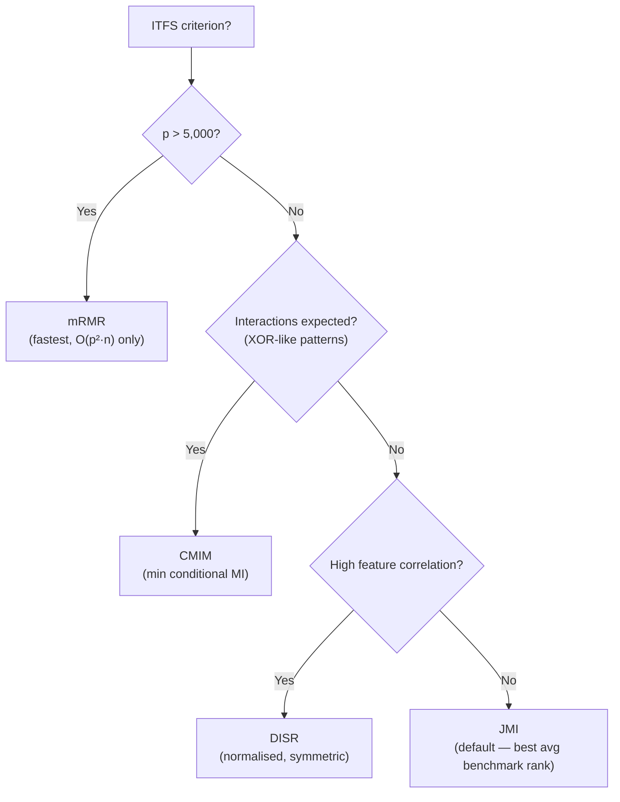

<!-- _class: lead -->
<!-- Speaker notes: Welcome to the third guide of Module 2. Guides 01 and 02 covered the theoretical landscape: the CLM framework, transfer entropy, Rényi MI, and copula measures. This guide is practical: how do you actually estimate MI from finite samples, which estimator to use, and how to wrap all five CLM criteria in a single sklearn-compatible class. The goal is that by the end you can plug ITFSSelector into any pipeline and know exactly which criterion to choose and why. -->

# Practical ITFS Implementation

## Module 02 — Estimators, Selectors, and Scaling

*From theory to production-ready code.*

---

<!-- Speaker notes: The key tension in ITFS is that the theorems assume exact MI values. In practice, you estimate MI from n samples, and that estimate has bias and variance. The main message of this slide: criterion choice is a second-order concern. Estimator quality is first-order. Show the table to drive this home. -->

## The Estimation Gap

Theory assumes you know the true distribution. Practice: you have $n$ samples.

$$\hat{I}(x_k; y) = I(x_k; y) + \underbrace{\text{bias}}_{\propto 1/n} + \underbrace{\text{noise}}_{\propto 1/\sqrt{n}}$$

**The uncomfortable truth:**

> Criterion choice (mRMR vs. JMI vs. CMIM) contributes ~10% of variance in final feature rankings. Estimator choice contributes ~40%. Sample size contributes ~50%.

Fix your estimator before worrying about which criterion to use.

---

<!-- Speaker notes: Three estimator families, three trade-offs. Walk through each row carefully. The key practical point: KSG is the default for n < 50,000 because it is asymptotically unbiased and handles continuous variables natively. Histogram is the fallback for large n or discrete data. KDE is only for validation and debugging. Never use KDE in a production pipeline. -->

## Three MI Estimators

| Estimator | Bias | Cost | Use when |
|-----------|------|------|----------|
| **Histogram** | $O(B^2/n)$ ↓ | $O(n)$ ✓ | $n > 50{,}000$, discrete data, rapid prototyping |
| **KDE** | Low | $O(n^2)$ ✗ | Validation only, $n < 1{,}000$ |
| **KSG** (k-NN) | $O(1/n)$ → 0 | $O(n\log n)$ ✓ | **Default for $n < 50{,}000$** |

sklearn's `mutual_info_classif` implements KSG via Ross (2014) — the correct choice for mixed continuous/discrete settings.

```python
from sklearn.feature_selection import mutual_info_classif

mi_scores = mutual_info_classif(X, y, n_neighbors=5, random_state=42)
```

---

<!-- Speaker notes: The histogram estimator has a systematic downward bias — it underestimates MI because the discrete approximation misses probability mass between bins. The Miller-Madow correction adds (m-1)/(2n) where m is the number of non-empty joint bins. This halves the bias with essentially zero computational overhead. Always use it when you use histogram MI. -->

## Histogram Estimator: The Bias Problem

Histogram MI is biased downward:

$$\mathbb{E}[\hat{I}_\text{hist}] = I(x_k; y) - \frac{m - 1}{2n} + O(n^{-2})$$

where $m$ = number of non-empty joint bins.

**Miller-Madow correction** removes the leading-order bias:

$$\hat{I}_\text{MM} = \hat{I}_\text{hist} + \frac{m - 1}{2n}$$

<div class="columns">

**Practical bin count:**

Scott's rule: $B = \lceil n^{1/3} \rceil$

For $n = 1{,}000$: $B = 10$
For $n = 10{,}000$: $B = 22$
For $n = 100{,}000$: $B = 46$

**Warning:**
High $B$ increases variance.
Low $B$ increases bias.
Scott's rule minimises MSE for Gaussian data.

</div>

---

<!-- Speaker notes: The KSG estimator is the gold standard for continuous MI. The formula looks intimidating but the intuition is clean: for each point, find its k-th nearest neighbour in the joint (x,y) space, then count how many marginal-x and marginal-y points fall within that radius. The digamma function corrects for discretisation. sklearn implements this correctly -- just pass n_neighbors. -->

## KSG Estimator: k-Nearest Neighbours

**Kraskov-Stögbauer-Grassberger (2004):**

For each point $i$, let $\epsilon_i$ be the radius of the $k$-NN ball in the joint $(x, y)$ space.

$$\hat{I}_\text{KSG}(X; Y) = \psi(k) + \psi(n) - \left\langle\psi(n_x^{(i)} + 1) + \psi(n_y^{(i)} + 1)\right\rangle$$

where $\psi$ = digamma function, $n_x^{(i)}$ = points within $\epsilon_i$ in $x$-marginal.

**Properties:**
- Asymptotically unbiased as $n \to \infty$
- Works with continuous variables — no binning artifacts
- $k = 3$–$5$: good bias-variance trade-off for $n \in [200, 10{,}000]$
- $k = 10$: better for $n > 10{,}000$

---

<!-- Speaker notes: The ITFSSelector class is the main practical deliverable of this guide. Walk through the design: it uses Brown et al.'s CLM notation internally, exposes five criteria through a single parameter, and follows the sklearn API so it works in Pipeline. The key method is _criterion_score -- the other methods are standard sklearn boilerplate. -->

## ITFSSelector: One Class, Five Criteria

```python
selector = ITFSSelector(
    n_features_to_select=15,
    criterion='jmi',   # 'mrmr' | 'jmi' | 'cmim' | 'icap' | 'disr'
    n_neighbors=5,
)
X_selected = selector.fit_transform(X, y)
```

All five criteria use the same greedy loop — only the scoring function changes:

```python
def _criterion_score(self, k, selected, mi_target, get_mi_pair, get_cmi):
    if self.criterion == 'mrmr':
        return mi_target[k] - mean(get_mi_pair(k, j) for j in selected)
    if self.criterion == 'jmi':
        return mean(mi_target[k] + mi_target[j] - get_mi_pair(k, j)
                    for j in selected)
    if self.criterion == 'cmim':
        return min(get_cmi(k, j) for j in selected)
    ...
```

---

<!-- Speaker notes: This is the most useful practical slide in the deck. Walk through each branch of the decision tree. The key insight is that JMI is the robust general-purpose choice -- it ties for first in Brown et al.'s benchmarks and handles both redundancy and synergy reasonably well. Only switch to another criterion if you have a specific reason. -->

## Which Criterion to Choose?



**Brown et al. (2012) average ranks across 12 datasets:**

| JMI | CMIM | DISR | ICAP | mRMR |
|-----|------|------|------|------|
| 2.1 | 2.4 | 2.5 | 2.8 | 3.2 |

---

<!-- Speaker notes: The pairwise MI matrix is the O(p^2) bottleneck. For p=5000, there are 12.5 million pairs to compute. At 0.01ms per pair (histogram), that's 125 seconds. At 1ms per pair (KSG), that's 3.5 hours. The fast approximation samples only n_pairs_sample partners from the selected set instead of all of them. This introduces a small approximation error but runs in O(k * n_pairs * n) time instead of O(p^2 * n). -->

## Scaling to Large p: The $O(p^2)$ Bottleneck

**Pairwise MI matrix cost:**

| $p$ | Pairs | Histogram (0.01 ms) | KSG (1 ms) |
|-----|-------|--------------------|----|
| 100 | 4,950 | 0.05 s | 5 s |
| 1,000 | 500,000 | 5 s | 8 min |
| 5,000 | 12.5M | 125 s | 3.5 hrs |
| 10,000 | 50M | 500 s | **14 hrs** |

**Solution: sampled pairs approximation**

Instead of all $|S|$ redundancy partners, sample $m = 50$ at random:

```python
partners = rng.choice(selected, n_pairs_sample, replace=False)
redundancy = mean(mi_pair(k, j) for j in partners)
```

Approximation error is $O(1/\sqrt{m})$ — 50 samples gives ~14% relative error.

---

<!-- Speaker notes: Confidence intervals are essential for distinguishing robustly selected features from marginally selected ones. The bootstrap procedure is straightforward: resample n rows with replacement, compute MI on the resample, repeat 200 times, take the 2.5th and 97.5th percentiles. Features with CI lower bound > 0 are robustly relevant. Features with CI including 0 are noise with probability ≥ 5%. -->

## Confidence Intervals for MI Estimates

Point estimates of MI have non-trivial variance at finite $n$.

**Bootstrap CI for $I(x_k; y)$:**

```python
def mi_bootstrap_ci(x, y, n_bootstrap=200, alpha=0.05):
    point_est = mutual_info_classif(x.reshape(-1,1), y)[0]
    boot_mis = []
    for b in range(n_bootstrap):
        idx = rng.integers(0, n, size=n)
        boot_mis.append(mutual_info_classif(x[idx:1], y[idx])[0])
    ci_lo = np.percentile(boot_mis, 100 * alpha/2)
    ci_hi = np.percentile(boot_mis, 100 * (1-alpha/2))
    return point_est, ci_lo, ci_hi
```

**Classification:**
- CI lower > 0 → **robustly relevant** (include)
- CI includes 0 → **marginally relevant** (cross-validate carefully)
- Point estimate ≈ 0 → **noise** (exclude)

---

<!-- Speaker notes: This slide covers the four most dangerous pitfalls. Pitfall 2 (data leakage) is the most costly in practice -- it can inflate CV accuracy by 5-10 percentage points on small datasets. Always fit MI inside the CV loop, not before it. Pitfall 4 (small samples with KSG) is subtle: KSG requires at least k+1 distinct points in the neighbourhood, otherwise the digamma function returns garbage. -->

## Common Pitfalls

**Pitfall 1: Unstandardised features for histogram MI.**
Histograms use the feature's range for bin edges. Features with very different scales get very different effective resolutions. Always StandardScale before histogram MI.

**Pitfall 2: MI computed on full training set, then CV applied (data leakage).**
The feature relevance scores are computed with knowledge of the full training distribution. Wrap MI computation inside the CV fold.

**Pitfall 3: Treating conditional MI as symmetric.**
$I(x_k; y | x_j) \neq I(x_j; y | x_k)$. CMIM and ICAP need the directed version. mRMR and JMI use only pairwise MI, which is symmetric.

**Pitfall 4: KSG with $k$ too large for small $n$.**
For $n < 100$, use $k = 1$ or $k = 2$. The standard default $k=3$ can fail when there are fewer than 4 distinct joint points.

---

<!-- Speaker notes: The pipeline integration slide shows how to use ITFSSelector inside a sklearn Pipeline. The key point is that fit_transform inside the pipeline correctly fits the selector on the training data only -- MI scores are computed fresh on each fold's training data, avoiding leakage. This is the correct usage pattern. -->

## Pipeline Integration

`ITFSSelector` follows the full sklearn API:

```python
from sklearn.pipeline import Pipeline
from sklearn.linear_model import LogisticRegression
from sklearn.model_selection import cross_val_score

pipe = Pipeline([
    ('selector', ITFSSelector(n_features_to_select=20, criterion='jmi')),
    ('classifier', LogisticRegression(max_iter=300)),
])

# This correctly fits the selector on the training fold only
cv_scores = cross_val_score(pipe, X, y, cv=5, scoring='accuracy')
print(f'Mean CV accuracy: {cv_scores.mean():.4f}')
```

**Critical:** Do not call `ITFSSelector.fit(X_full)` and then `cross_val_score(clf, X_selected, y)`. This leaks MI information from the test folds into the selection step.

---

<!-- Speaker notes: Summarise the three decision points: estimator (KSG as default), criterion (JMI as default), and scaling strategy (sampled pairs for large p). The notebook will put these together on a real commodity dataset. -->

<!-- _class: lead -->

## Three Decisions, Three Defaults

1. **Estimator:** KSG ($k=5$) — asymptotically unbiased, handles continuous features

2. **Criterion:** JMI — best average benchmark rank, handles both redundancy and synergy

3. **Scaling:** Sampled pairs ($m=50$) — reduces $O(p^2)$ to $O(p \cdot m)$ with ~14% approximation error

*Next: Notebook 03 — ITFS comparison on commodity price data using ITFSSelector*
