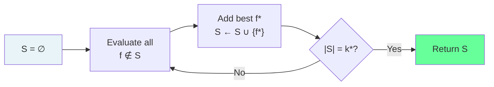
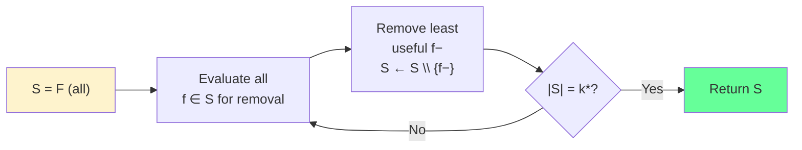
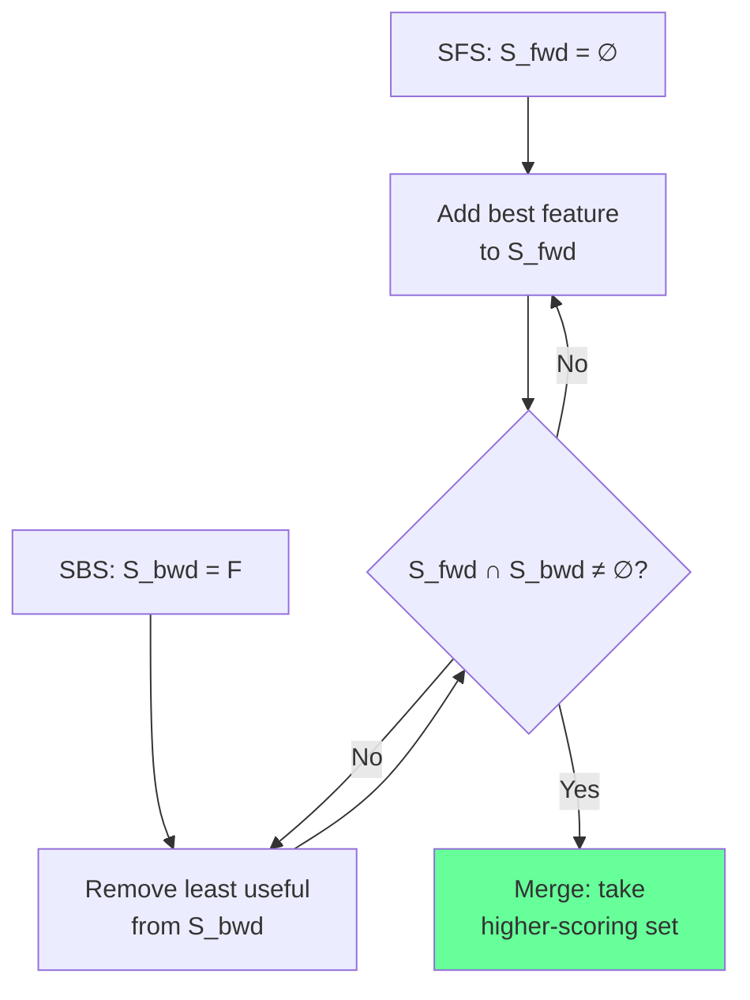
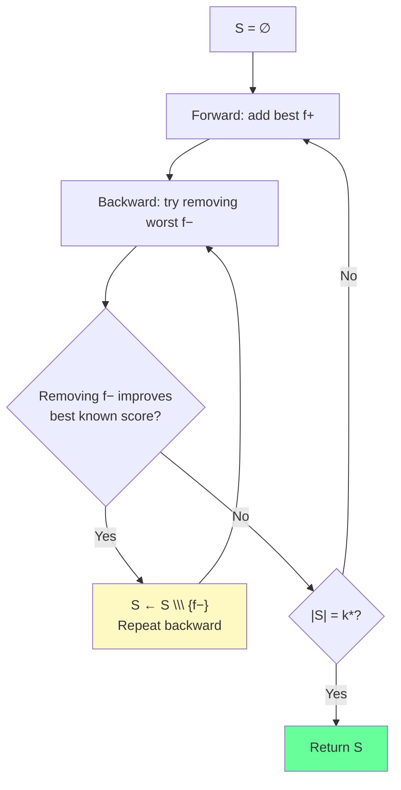

<!-- _class: lead -->
<!-- Speaker notes: This deck covers sequential wrapper methods: SFS, SBS, bidirectional search, and the floating variants SFFS/SBFS. The key mental model is a greedy hill-climber that either grows or shrinks a feature subset by one at each step. Floating variants add a backtracking move that lets them escape local optima without the exponential cost of full search. -->

# Sequential Wrapper Methods

## Module 03 — Wrapper Methods at Scale

SFS · SBS · SFFS · SBFS · Early Stopping

---

<!-- Speaker notes: Wrapper methods evaluate a model directly on feature subsets. They find better feature sets than filter methods because they capture feature interactions, but they pay a price in compute time: every candidate subset requires a cross-validated model fit. The core question for this module is how to make that cost manageable. -->

## What Makes a Method a Wrapper?

| Property | Filter | Wrapper | Embedded |
|----------|--------|---------|----------|
| Uses model score | No | **Yes** | During training |
| Captures interactions | Limited | **Yes** | Yes |
| Cost per evaluation | $O(n)$ | $O(v \cdot T_\mathcal{M})$ | Zero extra |
| Overfitting risk | Low | **Medium** | Low |

**Wrapper = model is the yardstick for subset quality**

---

<!-- Speaker notes: SFS is the simplest wrapper. Start empty, greedily add the single feature that gives the biggest CV score gain. The flowchart shows a single iteration: evaluate all remaining features, pick the best, add it to S, repeat. The algorithm is easy to implement but makes irrevocable decisions — a feature added early cannot be removed later. -->

## Sequential Forward Selection (SFS)

$$S_0 = \emptyset, \quad S_{k+1} = S_k \cup \left\{ \arg\max_{f \notin S_k} J(S_k \cup \{f\}) \right\}$$



**Irrevocable decisions:** once added, a feature stays.

---

<!-- Speaker notes: SBS is the mirror of SFS. Start with all features and remove the least informative at each step. SBS is preferred when the target k* is close to p (removing a few features) while SFS is preferred when k* is small. Neither method handles feature interactions optimally because they cannot undo earlier decisions. -->

## Sequential Backward Selection (SBS)

$$S_0 = \mathcal{F}, \quad S_{k-1} = S_k \setminus \left\{ \arg\max_{f \in S_k} J(S_k \setminus \{f\}) \right\}$$



**Computational advantage of SBS:** captures all interactions in early steps.

---

<!-- Speaker notes: The nesting property explains why SFS and SBS produce different results. If SFS selects {A,B} at step 2, both A and B will be in every subsequent set. If SBS removes C at step 1, C never appears in any smaller subset. These nested sequences miss combinations that require re-evaluating earlier decisions. -->

## The Nesting Problem

```
SFS path (p=5, k*=3):
  Step 1: S = {A}          ← A chosen first
  Step 2: S = {A, C}       ← C chosen with A
  Step 3: S = {A, C, E}    ← final set

  Problem: {B, C, E} might score higher but was never evaluated!

SBS path (p=5, k*=3):
  Remove D: S = {A,B,C,E}
  Remove B: S = {A,C,E}     ← same result, different path

  Different method, same nesting trap.
```

**Solution: let the search reverse direction — floating variants.**

---

<!-- Speaker notes: Bidirectional search runs SFS and SBS simultaneously, hoping the two frontiers meet at an optimal subset. The diagram shows the two searches converging from opposite ends. In practice this doubles the computation and is rarely used — SFFS is more effective. -->

## Bidirectional Search



Doubles compute cost; rarely superior to SFFS in practice.

---

<!-- Speaker notes: SFFS adds a backward phase after every forward step. The crucial rule: the backward phase only removes a feature if doing so strictly improves the best score seen so far at that subset size. This prevents the backward phase from immediately undoing the forward step. The result is a non-monotone search path that can revisit subset sizes, escaping the nesting trap. -->

## Sequential Floating Forward Selection (SFFS)

**Forward phase:** add the best feature $f^+$ to $S$

**Floating backward phase:** while removing the worst $f^-$ improves the best known score at size $|S|-1$:

$$\text{if } J(S \setminus \{f^-\}) > J_{\text{best}}(|S|-1) \text{ then } S \leftarrow S \setminus \{f^-\}$$



---

<!-- Speaker notes: This example traces a concrete SFFS execution. At step 3 the backward phase removes feature B even though it was added at step 1 — this is impossible with basic SFS. The result is a different and potentially better subset than SFS would find. The score history shows the non-monotone path: score goes up, down, then up again. -->

## SFFS: Concrete Trace (p=5, k*=3)

```
Step 1  Forward:  S = {C}         score = 0.72
Step 2  Forward:  S = {C, A}      score = 0.78
        Backward: remove A?        J({C}) = 0.72 < J_best(1)=0.72 → NO
Step 3  Forward:  S = {C, A, E}   score = 0.81
        Backward: remove A?        J({C, E}) = 0.83 > J_best(2)=0.78 → YES
        S = {C, E}                 score = 0.83  ← backtracked!
Step 4  Forward:  S = {C, E, D}   score = 0.87
        Backward: remove C?        J({E, D}) = 0.85 < J_best(2)=0.83 → NO

Final: S = {C, E, D}   (feature A was added and removed)
```

---

<!-- Speaker notes: SFFS has the same asymptotic cost as SFS — O(k* · p · T_M) — but with a constant factor of roughly 2-3x due to the backward phase. In practice SFFS consistently outperforms SFS on datasets where features interact, because it can undo poor early decisions. The floating mechanism was introduced by Pudil et al. in 1994 and remains the standard greedy sequential method. -->

## Cost Analysis

For $p$ features, target $k^*$, $v$-fold CV, model cost $T_\mathcal{M}$:

$$\text{Total cost} = k^* \cdot p \cdot v \cdot T_\mathcal{M}$$

| Setting | Evaluations | Time (0.1s/model) |
|---------|------------|-------------------|
| $p=50, k^*=10, v=5$ | 2,500 | **4 min** |
| $p=100, k^*=20, v=5$ | 10,000 | **17 min** |
| $p=500, k^*=50, v=5$ | 125,000 | **3.5 hrs** |

**SFFS overhead:** $\approx 2$–$3\times$ SFS cost. Usually worth it.

---

<!-- Speaker notes: These three stopping criteria let you halt early without evaluating all k* features. Patience is the simplest and most robust: stop after tau steps without meaningful improvement. Diminishing returns is more principled: stop when the marginal gain per additional feature drops to a fraction of the maximum marginal gain seen so far. Plateau detection uses a rolling regression for noise robustness. -->

## Early Stopping Heuristics

**Patience** — stop after $\tau$ steps without gain $> \delta_{\min}$:
$$\text{no\_improve} \geq \tau$$

**Diminishing returns** — stop when marginal gain collapses:
$$\Delta J_k = J_{\text{best}}(k) - J_{\text{best}}(k{-}1)$$
$$\text{stop if } \Delta J_k < \alpha \cdot \max_{i < k} \Delta J_i$$

**Plateau detection** — fit slope of smoothed score curve:
$$\text{stop if } \frac{d\hat{J}}{dk}\bigg|_{k=t} < \epsilon$$

Typical: $\tau = 5$, $\alpha = 0.10$, $\epsilon = 10^{-4}$

---

<!-- Speaker notes: This code snippet shows the patience-based early stopper. It tracks consecutive steps without improvement and the list of historical scores for the diminishing returns check. The update() method returns True when the search should stop. The two criteria are evaluated independently and either can trigger a halt. -->

## Early Stopper Implementation

```python
class EarlyStopper:
    def __init__(self, patience=5, tol=1e-4, min_delta_fraction=0.1):
        self.patience = patience
        self.tol = tol
        self.min_delta_fraction = min_delta_fraction
        self._scores = []
        self._no_improve_count = 0

    def update(self, score: float) -> bool:
        """Return True = stop."""
        self._scores.append(score)
        if len(self._scores) == 1:
            return False

        # Patience check
        if score > self._scores[-2] + self.tol:
            self._no_improve_count = 0
        else:
            self._no_improve_count += 1
        if self._no_improve_count >= self.patience:
            return True

        # Diminishing returns check
        if len(self._scores) >= 3:
            deltas = [self._scores[i] - self._scores[i-1]
                      for i in range(1, len(self._scores))]
            if max(deltas) > 0:
                if deltas[-1] < self.min_delta_fraction * max(deltas):
                    return True
        return False
```

---

<!-- Speaker notes: The forward step is the inner loop of sequential search. It iterates over all unselected features, temporarily adds each one, calls cached_score, and records the best. The cache is a dict keyed on sorted feature tuples. Cache hits are essentially free — no model fit needed. In SFFS the backward phase frequently scores subsets already evaluated during the forward pass, so the cache can reduce total evaluations by 20-40%. -->

## Warm-Starting and Caching

```python
# Filter pre-screening: restrict to top p' candidates
from sklearn.feature_selection import mutual_info_classif

def prescreened_candidates(X, y, n_candidates):
    """Keep only the top n_candidates features by MI."""
    scores = mutual_info_classif(X, y)
    return np.argsort(scores)[-n_candidates:]  # top indices

# Evaluation cache: keyed on sorted feature index tuple
cache = {}

def cached_cv_score(feature_idx, X, y, estimator, cv):
    key = tuple(sorted(feature_idx))
    if key not in cache:
        scores = cross_val_score(
            clone(estimator), X[:, key], y, cv=cv)
        cache[key] = scores.mean()
    return cache[key]
```

**Pre-screen to $p' = 3k^*$ reduces cost by $(1 - 3k^*/p) \times 100\%$**

---

<!-- Speaker notes: The full search path visualisation shows the non-monotone character of SFFS. The left panel shows score at each evaluation step — it goes up and down as the backward phase removes features. The right panel shows the best score achieved at each subset size — this is monotone-ish and is used to choose the final k*. The red dashed line marks the selected k. -->

## Visualising the Search Path

```python
# After fitting SequentialFeatureSelector:
sfs.plot_search_path()
```

```
Score per step (SFFS):              Best score vs subset size:
0.90 |  *    *                      0.90 |          ****
0.88 |    *    *  *                 0.88 |      ***
0.85 |  *        *  **              0.85 |   **
0.82 |*                             0.82 |*
     +──────────────────                 +──────────────────
     0  5  10  15  20  25                2  4  6  8  10  12
     Evaluation step                    Number of features
                                                      ^
                                               Final k* here
```

---

<!-- Speaker notes: This comparison table is a practical decision guide. Use SFS when you want a small subset from many features. Use SBS when you want to prune a nearly-good feature set. Use SFFS as the default when you can afford 2-3x SFS cost. Use SBFS when starting from many features and removing down to a moderate k*. Bidirectional is rarely worth the complexity. -->

## Which Method to Choose?

| Scenario | Recommended |
|----------|-------------|
| Small $k^*$, large $p$ | **SFS** (fast early steps) |
| Large $k^*$, moderate $p$ | **SBS** (fast early steps from full set) |
| Default choice, moderate $p$ | **SFFS** (best quality / cost ratio) |
| High-$p$ backward search | **SBFS** |
| Never | Bidirectional (extra complexity, no gain) |

> SFFS with a cache and pre-screening handles most real-world cases under $p = 300$.

---

<!-- Speaker notes: Data leakage is the most common mistake in wrapper methods. The scaler must be re-fit inside each CV fold, not on the whole training set before the CV loop. The correct approach is to wrap both scaler and model in a Pipeline so sklearn's cross_val_score handles this correctly. -->

## Common Pitfall: Data Leakage

```python
# WRONG: scaler sees all training data before CV
scaler = StandardScaler().fit(X_train)
X_scaled = scaler.transform(X_train)
sfs.fit(X_scaled, y_train)  # leaks scale information

# CORRECT: Pipeline ensures scaler is fit per fold
from sklearn.pipeline import Pipeline

pipe = Pipeline([
    ('scaler', StandardScaler()),
    ('clf', RandomForestClassifier(n_estimators=50))
])
sfs = SequentialFeatureSelector(pipe, n_features_to_select=10)
sfs.fit(X_train, y_train)  # clean: no leakage
```

---

<!-- Speaker notes: This visual summary anchors the key ideas. SFS grows the set, SBS shrinks it, SFFS bounces between both directions guided by the best-at-size criterion. The cost table shows why pre-screening is so effective: cutting p in half cuts cost by roughly half. The early stopping heuristics can cut cost by another 30-50% on well-behaved datasets. -->

## Summary

```
SEQUENTIAL SEARCH METHODS
==========================

SFS:  ∅ → {A} → {A,C} → {A,C,E}          (monotone growth)
SBS:  F → F\{B} → F\{B,D} → {A,C,E}      (monotone shrink)
SFFS: ∅ → {A} → {A,C} → {C} → {C,E}      (non-monotone, best quality)

Cost: O(k* · p · v · T_M)
  → Reduce p via pre-screening (filter methods)
  → Reduce evaluations via caching
  → Reduce steps via early stopping

Use SFFS by default.  Add pre-screening for p > 200.
```

---

<!-- Speaker notes: The next guide covers Boruta and beam search, which trade sequential greedy decisions for a population of candidates. Boruta identifies all relevant features rather than a minimal optimal set. Beam search is a width-bounded version that maintains multiple candidates simultaneously, giving better coverage of the feature space. -->

## What's Next

**Guide 02: Boruta and Advanced Wrappers**

- Boruta: shadow features + statistical testing → all-relevant feature sets
- Beam search: $w$ candidates in parallel, memory-bounded
- Optuna-driven wrapper: treat feature selection as hyperparameter optimisation

**Guide 03: Scalable Wrappers**

- Pre-screening, parallelisation, subsampling
- When to abandon wrappers for embedded methods

---

<!-- Speaker notes: These are the canonical papers for sequential search. Pudil 1994 is the original SFFS paper and remains the primary reference. Jain 1997 shows empirically when SFFS outperforms SFS. The sklearn documentation links to SequentialFeatureSelector which implements SFS and SBS natively. -->

## Further Reading

- **Pudil, Novovicova & Kittler (1994)** — "Floating search methods in feature selection." *Pattern Recognition Letters* 15(11). Original SFFS paper.

- **Ferri et al. (1994)** — "Comparative study of techniques for large-scale feature selection." Empirical comparison of all four sequential variants.

- **Jain & Zongker (1997)** — "Feature selection: Evaluation, application, and small sample performance." *IEEE TPAMI* 19(2). When SFFS wins.

- **scikit-learn SequentialFeatureSelector:** `sklearn.feature_selection.SequentialFeatureSelector`
