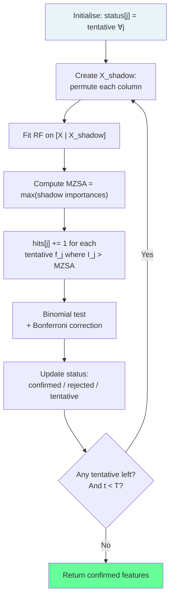
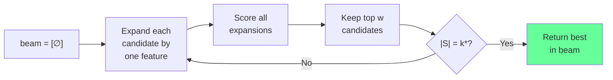
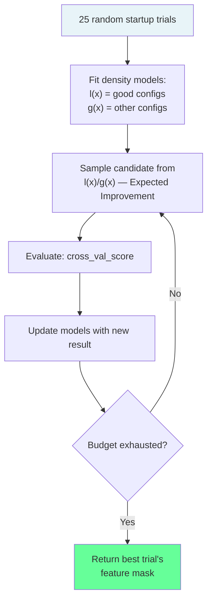

<!-- _class: lead -->
<!-- Speaker notes: This deck covers three advanced wrapper methods: Boruta (statistical all-relevant selection via shadow features), beam search (width-bounded multi-path greedy search), and Optuna TPE (treating feature selection as hyperparameter optimisation). The central theme is that sequential greedy search is just one point in a design space of wrapper strategies — these alternatives trade compute for solution quality or statistical rigor. -->

# Boruta and Advanced Wrappers

## Module 03 — Wrapper Methods at Scale

Shadow features · Beam search · Optuna TPE · BOHB

---

<!-- Speaker notes: The all-relevant vs minimal-optimal distinction is the key conceptual difference in this guide. Sequential methods find the smallest subset that achieves near-optimal CV score. Boruta finds every feature that has any signal at all. Both are valid goals, but they serve different purposes: minimal-optimal for deployment, all-relevant for analysis and interpretability. -->

## Two Different Questions

<div class="columns">
<div>

**Minimal-optimal** (SFS/SFFS)

> "What is the smallest feature set that maximises predictive performance?"

- Returns non-redundant compact set
- Best for deployment
- Size: $k^* \ll p$

</div>
<div>

**All-relevant** (Boruta)

> "Which features carry any information about the target?"

- Returns every feature with signal
- Best for analysis/interpretability
- Size: varies, often larger

</div>
</div>

**Neither is universally better — the right choice depends on your goal.**

---

<!-- Speaker notes: Boruta's core idea is elegant: create shadow features by randomly shuffling each real feature column. A shuffled copy of a feature carries zero information about the target by construction. If a real feature cannot consistently beat the best shuffled copy, it has no detectable signal. The Random Forest is used because it naturally produces feature importances through split counting. -->

## Boruta: Shadow Features

For feature matrix $\mathbf{X} \in \mathbb{R}^{n \times p}$:

**Step 1:** Create shadow matrix $\mathbf{X}^{\text{shadow}}$ — permute each column independently:

$$X^{\text{shadow}}_{ij} = X_{\sigma_j(i), j}, \quad \sigma_j \sim \text{Uniform}(\text{permutations})$$

**Step 2:** Augment: $\mathbf{X}^{\text{aug}} = [\mathbf{X} \mid \mathbf{X}^{\text{shadow}}] \in \mathbb{R}^{n \times 2p}$

**Step 3:** Train Random Forest on $\mathbf{X}^{\text{aug}}$, extract importances

**Key:** Shadow features have zero information by design — they are the noise baseline.

---

<!-- Speaker notes: The shadow threshold is the maximum importance among all shadow features. A real feature must beat this threshold to count as a hit in that iteration. The reason for using the maximum (rather than mean) is conservative: we only claim relevance when a feature clearly outperforms even the luckiest noise feature. This maximum is called MZSA — Maximum Z-Score Among Shadow Attributes — in the original paper. -->

## Boruta: The Shadow Threshold

$$\text{MZSA}_t = \max_{j=p+1}^{2p} I_{jt}$$

Maximum importance among all shadow features in iteration $t$.

```
Iteration t:
  Real importances:   [0.15, 0.03, 0.22, 0.09, 0.18]
  Shadow importances: [0.08, 0.05, 0.12, 0.07, 0.10]

  MZSA = max(shadow) = 0.12

  Hits at step t:
    f1: 0.15 > 0.12  → HIT
    f2: 0.03 < 0.12  → MISS
    f3: 0.22 > 0.12  → HIT
    f4: 0.09 < 0.12  → MISS
    f5: 0.18 > 0.12  → HIT
```

---

<!-- Speaker notes: The statistical test is a two-sided binomial test with Bonferroni correction. Under the null hypothesis that a feature is irrelevant, its importance is equally likely to be above or below the shadow threshold in any iteration — hits follow Bin(T, 0.5). Too many hits → confirmed relevant. Too few hits → confirmed irrelevant. The Bonferroni correction divides alpha by 2p to account for testing p features simultaneously. -->

## Boruta: Statistical Testing

Under $H_0$ (feature is irrelevant): $h_j \sim \text{Binomial}(T, 0.5)$

With Bonferroni correction for $p$ simultaneous tests at level $\alpha$:

$$\text{threshold} = \frac{\alpha}{2p}$$

$$\text{Confirmed relevant: } P(h_j \geq h_j^{\text{obs}}) < \frac{\alpha}{2p}$$

$$\text{Confirmed irrelevant: } P(h_j \leq h_j^{\text{obs}}) < \frac{\alpha}{2p}$$

$$\text{Tentative: neither criterion met}$$

---

<!-- Speaker notes: The Boruta flowchart shows the full algorithm. The key loop is: create shadows, fit RF, compute MZSA, record hits, run binomial test, remove decided features. The algorithm terminates when all features are decided or max_iter is reached. Tentative features at termination are often included conservatively. -->

## Boruta: Full Algorithm



---

<!-- Speaker notes: The violin plot is the canonical Boruta visualisation. Each violin shows the distribution of importance values for a feature across all iterations. The red dashed line is the median shadow max — the noise baseline. Features with their violin entirely above the red line are confirmed relevant (green). Features entirely below are confirmed irrelevant (red). Features straddling the line are tentative (grey). -->

## Boruta: Importance Visualisation

```
Feature importance distributions across T iterations:

                            ┃ ← Shadow max (median)
  f3  ██████████████████████┃█████     (confirmed: always above)
  f1  ███████████████████░░░┃          (confirmed: mostly above)
  f5  ████████████░░░░░░░░░░┃          (tentative: straddling)
  f2  ░░░░░░░░░░░░░░░░░░░░░░┃          (rejected: always below)
  f4  ░░░░░░░░░░░░░░░░░░░░░░┃░         (rejected: mostly below)

Legend: █ above shadow max  ░ below shadow max
Green violin = confirmed | Red violin = rejected | Grey = tentative
```

---

<!-- Speaker notes: Beam search maintains w candidate subsets simultaneously. At each step, every candidate in the beam is expanded by adding each remaining feature, creating up to w×(p-k) new candidates. The best w are kept for the next step. Width 1 = standard greedy SFS. Width 5-10 gives meaningfully different paths without prohibitive cost. -->

## Beam Search for Feature Selection

**Maintain $w$ candidate subsets ("beam") at each step:**



**Evaluations per step:** $w \times (p - k)$

**Total:** $O(w \cdot k^* \cdot p \cdot v \cdot T_\mathcal{M})$

---

<!-- Speaker notes: This trace shows beam search with w=3 at step 2. Each of the 3 candidates in the beam generates multiple expansions. After scoring, the best 3 are kept. Contrast this with SFS (w=1) which would keep only {A,C} and never explore {B,E} or {A,E}. The wider beam finds better combinations at the cost of 3x the evaluations. -->

## Beam Search: Step-by-Step (w=3)

```
After step 1 (beam = [{A}, {C}, {E}]):

Step 2 expansions:
  {A} → {A,B}(0.79), {A,C}(0.82), {A,D}(0.75), {A,E}(0.80)
  {C} → {C,A}=cached, {C,B}(0.78), {C,D}(0.76), {C,E}(0.84)
  {E} → {E,A}=cached, {E,B}(0.81), {E,C}=cached, {E,D}(0.73)

All scored: [{A,C}=0.82, {C,E}=0.84, {E,B}=0.81, {A,E}=0.80, ...]

Top w=3: beam = [{C,E}, {A,C}, {E,B}]
                 ^^^^^ would be missed by SFS!
```

---

<!-- Speaker notes: Stochastic beam search adds temperature-controlled randomness to the beam selection step. Instead of always keeping the deterministic top-w, it samples proportional to softmax scores. High temperature = near-random exploration. Low temperature = near-greedy. Combining stochastic beam search with random restarts gives a simple but effective approximate search over the exponential feature space. -->

## Stochastic Beam Search

Instead of keeping the deterministic top-$w$, sample proportionally:

$$P(\text{keep } S_i) \propto \exp\left(\frac{J(S_i)}{\tau}\right)$$

| Temperature $\tau$ | Behaviour |
|-------------------|-----------|
| $\tau \to 0$ | Greedy (same as deterministic) |
| $\tau = 0.01$ | Mostly greedy, occasional exploration |
| $\tau = 0.1$ | Balanced exploration/exploitation |
| $\tau \to \infty$ | Uniform random |

**With random restarts:** run $r$ times, return best result.

---

<!-- Speaker notes: Optuna's TPE sampler builds a probabilistic model of which feature combinations tend to give high scores. After each trial, it updates two density estimators: one for configurations that performed well (l(x)), one for the rest (g(x)). New trials are drawn from l(x)/g(x). This is fundamentally different from greedy search — it learns correlations between features and uses that knowledge to guide future trials. -->

## Feature Selection as Hyperparameter Optimisation

**Treat feature selection as:** choose binary values $\{f_0, f_1, \ldots, f_{p-1}\} \in \{0, 1\}^p$

**Optimise with Optuna TPE:**

```python
def objective(trial):
    mask = np.array([
        trial.suggest_categorical(f"f{j}", [True, False])
        for j in range(p)
    ])
    if mask.sum() < min_features:
        return -np.inf

    scores = cross_val_score(
        clone(estimator), X[:, mask], y, cv=5)
    return scores.mean()

study = optuna.create_study(
    direction="maximize",
    sampler=optuna.samplers.TPESampler(seed=42)
)
study.optimize(objective, n_trials=300)
```

---

<!-- Speaker notes: The TPE sampler models the feature space probabilistically. After 25 startup trials (random), it begins fitting density estimators. The result is a search that learns which features tend to appear together in high-scoring configurations. This captures feature interactions that pure sequential search cannot detect. The cost is that TPE needs many trials (200-500) before outperforming simple greedy search. -->

## Optuna TPE: How It Works



---

<!-- Speaker notes: BOHB combines Bayesian optimisation with HyperBand multi-fidelity pruning. Early in each trial, the CV uses fewer folds (faster but noisier). Optuna reports intermediate scores at each fidelity level and prunes trials that are clearly worse than the median at that fidelity. Only promising trials receive full CV evaluation. This can reduce total compute by 3-5x compared to fixed-fidelity TPE. -->

## BOHB: Multi-Fidelity Pruning

```python
def objective(trial):
    mask = [trial.suggest_categorical(f"f{j}", [True, False])
            for j in range(p)]

    # Progressive fidelity: 2 → 3 → 5 folds
    for n_folds in [2, 3, 5]:
        score = cross_val_score(
            clone(estimator), X[:, mask], y,
            cv=n_folds).mean()

        trial.report(score, step=n_folds)
        if trial.should_prune():
            raise optuna.TrialPruned()  # Cut bad trials early!

    return score

pruner = optuna.pruners.HyperbandPruner(
    min_resource=2, max_resource=5)
```

**Pruning removes 40-70% of trials before full evaluation.**

---

<!-- Speaker notes: This comparison table is the practical decision guide for this guide's methods. The key axis is: do you need all-relevant features or a minimal subset? Do you have a fixed budget of model evaluations? Is your base model expensive? Boruta is the best default for analysis tasks. SFFS is the best default for deployment tasks. Optuna makes sense when you have a budget of 200+ trials and want to model feature interactions. -->

## Method Comparison

| | Boruta | Beam ($w$=5) | Optuna TPE |
|--|--------|-------------|-----------|
| **Goal** | All-relevant | Minimal-optimal | Minimal-optimal |
| **Cost** | $T \cdot T_{\text{RF}}$ | $5 \times$ SFS | $n\_trials \times T_\mathcal{M}$ |
| **Interactions** | Via RF | Limited | Yes (TPE model) |
| **Guarantees** | Statistical | None | None |
| **Interpretable path** | No | Yes | No |
| **Best at** | Analysis | Moderate $p$ | Small $p$, expensive model |

---

<!-- Speaker notes: The key pitfall with Boruta is using too few iterations. With T=20, the binomial test has very low power for weakly informative features. The confidence interval for 20 coin flips is so wide that few features will reach significance. Use T >= 100. The other pitfall is using a linear model as the base estimator -- Boruta's importance estimates are only reliable with tree-based models. -->

## Common Pitfalls

**Boruta:**
- Using $T < 100$ iterations → low statistical power, many tentative features
- Using linear model as base estimator → unreliable importances

**Beam search:**
- Width $w = 1$ → identical to greedy SFS (no benefit)
- Not caching scores → exponential redundant evaluations

**Optuna:**
- $n\_trials < 100$ → TPE model not calibrated, random-search quality
- Not setting `min_features` guard → trivial empty-mask solutions

> For all methods: wrap preprocessing in a Pipeline to prevent data leakage across CV folds.

---

<!-- Speaker notes: The summary table anchors the conceptual differences. Boruta asks "is there signal?" (statistical test). SFS asks "does adding this feature help right now?" (greedy). Beam search asks "which of w paths is best?" (bounded search). Optuna asks "what combination has historically worked?" (probabilistic model). Each is suited to a different regime of the exploration vs. compute tradeoff. -->

## Visual Summary

```
WRAPPER METHOD TAXONOMY
========================

Greedy (SFS/SFFS):
  ∅ → add best → add best → ... → k* features
  One path. Fast. Local optima.

Beam Search (w=5):
  ∅ → 5 candidates → 5×expand → keep top 5 → ... → k*
  Multiple paths. 5x cost. Better coverage.

Boruta:
  T iterations of: augment → fit RF → test binomial
  All-relevant set. Statistical guarantee. No size control.

Optuna TPE:
  Build probabilistic model of feature space.
  n_trials evaluations. Learns interactions.
```

---

<!-- Speaker notes: The next guide covers making all of these methods scalable for large datasets. The key techniques are feature pre-screening, parallel evaluation, approximate evaluation with subsampling, and memory-efficient implementations. The guide also discusses when to abandon wrappers entirely and use embedded methods or fast filters instead. -->

## What's Next

**Guide 03: Scalable Wrapper Implementations**

- Pre-screening: filter methods reduce $p$ before wrapper search
- Parallelisation: embarrassingly parallel feature evaluation
- Subsampling: approximate evaluation with small data fractions
- Memory-efficient implementations for $p > 1{,}000$ features
- Decision boundary: when to abandon wrappers for embedded methods

---

<!-- Speaker notes: These references cover the key ideas in this guide. Kursa 2010 is the original Boruta paper and includes the R BorutaPy implementation. The Optuna paper covers TPE and multi-fidelity extensions. The Bergstra 2011 paper on TPE is the theoretical foundation for Optuna's sampler. -->

## Further Reading

- **Kursa & Rudnicki (2010)** — "Feature selection with the Boruta package." *J. Statistical Software* 36(11). Original Boruta paper.

- **Akiba et al. (2019)** — "Optuna: A next-generation hyperparameter optimization framework." *KDD 2019.* Optuna library paper.

- **Bergstra et al. (2011)** — "Algorithms for hyper-parameter optimization." *NeurIPS 2011.* Theory of TPE.

- **BorutaPy:** `pip install boruta` — Python port of Boruta with RF and LightGBM support.
