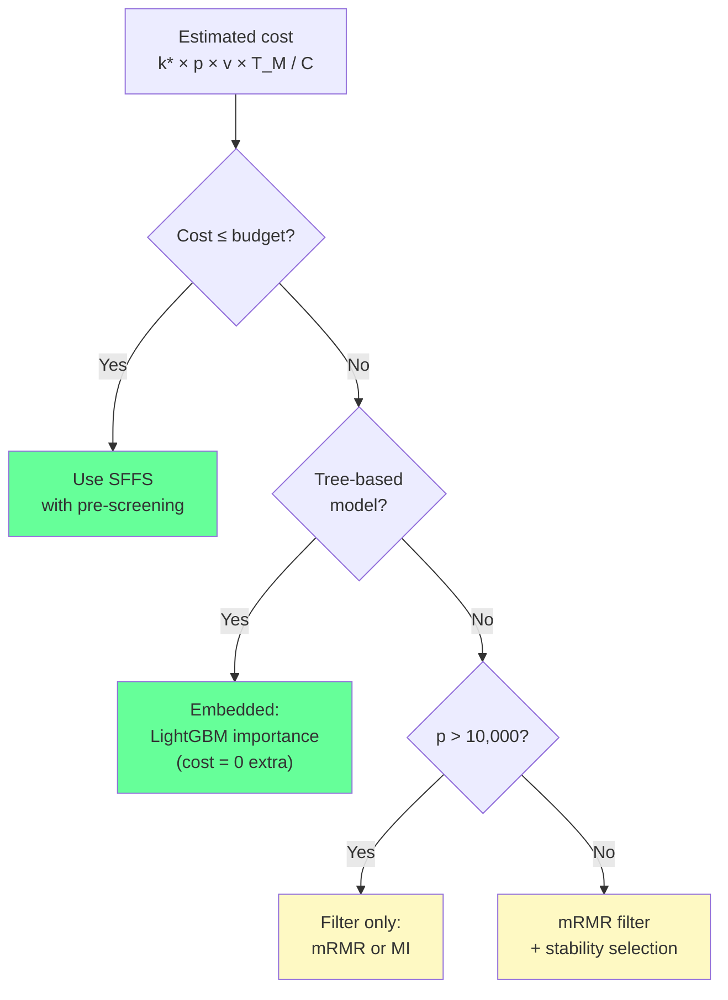

<!-- _class: lead -->
<!-- Speaker notes: This deck covers five strategies to make wrapper methods tractable at scale: pre-screening, caching, parallelisation, approximate evaluation, and memory efficiency. The central message is that no single trick is enough — production wrapper systems combine all five. The guide ends with a clear decision framework for when to abandon wrappers entirely. -->

# Scalable Wrapper Implementations

## Module 03 — Wrapper Methods at Scale

Pre-screening · Caching · Parallelisation · Subsampling · Memory

---

<!-- Speaker notes: The cost equation is the foundation of this guide. Every scalability strategy attacks one of the four multiplicative terms: k* (target features), p (feature count), v (CV folds), or T_M (model training time). The divisor C is the number of CPU cores — parallelisation. Each strategy provides an independent multiplicative reduction in total wall time. -->

## The Cost Equation

$$\text{Wall time} = \frac{k^* \cdot p \cdot v \cdot T_{\mathcal{M}}}{C}$$

| Term | Reduction strategy | Typical saving |
|------|-------------------|---------------|
| $p$ | Filter pre-screening | 50–90% |
| $T_\mathcal{M}$ | Fast model, subsampling | 50–80% |
| $v$ | Reduce CV folds early | 30–60% |
| $C$ | Parallelisation | $C \times$ speedup |
| Evaluations | Caching | 20–40% |

**Combined effect can reduce wall time by 100–1000×.**

---

<!-- Speaker notes: Pre-screening is the highest-leverage strategy. By running a cheap filter method first, you reduce p before the wrapper ever starts. The cost of the filter step is negligible compared to the wrapper. The key question is how aggressively to screen: p' = 2k* is the minimum sensible value; p' = 5k* is safer. mRMR is the best filter for pre-screening because it removes redundant features that would confuse the wrapper's greedy search. -->

## Strategy 1: Filter Pre-Screening


**Cost reduction:**

$$1 - \frac{p'}{p} = 1 - \frac{3k^*}{p}$$

For $p=500, k^*=20$: **88% reduction** in candidate pool.

---

<!-- Speaker notes: mRMR is the best filter for pre-screening because it removes both irrelevant features (low relevance) and redundant features (high correlation with already-selected features). Standard mutual information only removes irrelevant features. The mRMR criterion at each step is: relevance to y minus mean redundancy with already-selected features. Use mRMR for pre-screening when features are expected to be correlated. -->

## mRMR: The Best Pre-Screener

**Minimum-Redundancy Maximum-Relevance:**

At each step, select the feature maximising:

$$\text{mRMR}(f_j) = I(f_j; y) - \frac{1}{|S|}\sum_{f_s \in S} I(f_j; f_s)$$

```python
def mrmr_filter(X, y, n_candidates):
    relevance = mutual_info_classif(X, y)
    selected = []

    for _ in range(n_candidates):
        if not selected:
            best = np.argmax(relevance)
        else:
            redundancy = np.array([
                np.mean([feature_mi[j, s] for s in selected])
                for j in remaining
            ])
            scores = relevance[remaining] - redundancy
            best = remaining[np.argmax(scores)]
        selected.append(best)
    return np.array(selected)
```

---

<!-- Speaker notes: The cache is a dictionary mapping sorted feature index tuples to their CV scores. Before evaluating any candidate, check the cache. In SFFS, the backward phase frequently re-evaluates subsets that were scored during the forward pass, making the cache especially effective. Track hit rates to verify the cache is working — a 0% hit rate suggests the search never revisits subsets. -->

## Strategy 2: Evaluation Caching

```python
class EvaluationCache:
    """Dict-based cache keyed on sorted feature index tuples."""
    def __init__(self):
        self._store = {}
        self._hits = self._misses = 0

    def get(self, feature_indices):
        key = tuple(sorted(feature_indices))
        if key in self._store:
            self._hits += 1
            return self._store[key]
        self._misses += 1
        return None  # Cache miss

    def set(self, feature_indices, score):
        key = tuple(sorted(feature_indices))
        self._store[key] = score

    @property
    def hit_rate(self):
        total = self._hits + self._misses
        return self._hits / total if total > 0 else 0.0
```

**Typical hit rate:** 20–40% in SFFS (backward phase revisits forward scores).

---

<!-- Speaker notes: Feature evaluation at each SFS step is embarrassingly parallel — each candidate can be scored independently. The joblib Parallel/delayed pattern distributes these evaluations across cores. Critical: parallelise the outer candidate loop, not the inner CV. Parallelising both creates nested parallelism, which causes thread contention and can actually slow down the search. -->

## Strategy 3: Embarrassingly Parallel Evaluation

```python
from joblib import Parallel, delayed
from sklearn.base import clone

def evaluate_candidates_parallel(X, y, mask, candidates,
                                  estimator, cv=5, n_jobs=-1):
    """Evaluate all candidate features in parallel."""

    def score_one(j):
        new_mask = mask.copy()
        new_mask[j] = True
        selected = np.where(new_mask)[0]
        # IMPORTANT: n_jobs=1 inside to avoid nested parallelism
        return cross_val_score(
            clone(estimator), X[:, selected], y,
            cv=cv, n_jobs=1  # ← serial CV, parallel outer loop
        ).mean()

    return np.array(Parallel(n_jobs=n_jobs)(
        delayed(score_one)(j) for j in candidates
    ))
```

---

<!-- Speaker notes: The Amdahl's Law plot shows the theoretical speedup limit. For SFS with a 5% serial fraction (bookkeeping between steps), the maximum speedup is about 15x regardless of core count. In practice, joblib overhead for small T_M (< 0.5 seconds per fold) can make parallel slower than serial. Only parallelise when each model fit takes at least 0.5 seconds. -->

## Parallelisation Limits

**Amdahl's Law:** serial fraction $s$ limits speedup to $\frac{1}{s + (1-s)/C}$

```
Cores  Serial 5%  Serial 10%
  2      1.90       1.82
  4      3.48       3.08
  8      5.93       4.71
 16      8.83       6.40
 32    11.43        7.56
 ∞     20.00       10.00
```

**Rule:** Only parallelise when $T_\mathcal{M} > 0.5$ s per fold.

For fast models (0.01 s/fold), joblib overhead exceeds the work.

---

<!-- Speaker notes: Progressive subsampling exploits the fact that early SFS steps evaluate many candidates where the score differences are large — noisy estimates suffice. Later steps evaluate fewer candidates with smaller differences — full data is needed. The interpolation formula grows the sample size from min_fraction at step 0 to 1.0 at the final step. This can reduce total compute by 40-60% with minimal impact on the final selected set. -->

## Strategy 4: Progressive Subsampling

Early steps: many candidates, large score gaps → noisy estimates OK.
Later steps: few candidates, small score gaps → full data needed.

$$n'(k) = \min\left(n, n_{\min} + \frac{k}{k^*} \cdot (n - n_{\min})\right)$$

```python
def progressive_subsample_score(X, y, mask, estimator,
                                 step, total_steps,
                                 min_fraction=0.2, cv=5):
    fraction = min_fraction + (1.0 - min_fraction) * (step / max(total_steps-1, 1))
    n_samples = int(len(y) * fraction)

    rng = np.random.default_rng(42 + step)
    indices = rng.choice(len(y), size=n_samples, replace=False)

    selected = np.where(mask)[0]
    return cross_val_score(
        clone(estimator), X[indices][:, selected],
        y[indices], cv=min(cv, n_samples//10)
    ).mean()
```

---

<!-- Speaker notes: Large feature matrices cause two problems: (1) the matrix itself may exceed RAM, and (2) repeated column slicing causes cache misses. The solutions are storing in column-major (Fortran) order for fast column access, using memory-mapped arrays for datasets larger than RAM, and using sparse matrices for high-cardinality categorical features. -->

## Strategy 5: Memory-Efficient Data Structures

```python
# Column-major storage: column slices are contiguous in memory
X_fortran = np.asfortranarray(X)      # O(n*p) memory, fast columns
X_sub = X_fortran[:, selected_idx]    # No copy needed if column-major

# Memory-mapped arrays for datasets > RAM
import numpy as np
X_mmap = np.memmap("X_large.dat", dtype="float32",
                    mode="r", shape=(n, p))
# Workers share the mmap — no data copying across processes

# Sparse matrices for categorical/text features
from scipy.sparse import csc_matrix
X_sparse = csc_matrix(X)              # CSC: O(nnz) memory
X_sub = X_sparse[:, selected_idx]    # Efficient column slicing
```

**Key:** float32 vs float64 halves memory at minimal precision cost.

---

<!-- Speaker notes: This combined pipeline is the production pattern. Pre-screen first, then run SFFS with caching, parallelism, and progressive subsampling. Each component reduces cost independently, and the reductions multiply. The cache hit rate at the end tells you whether the caching was effective — aim for 20%+. -->

## Combined Scalable Pipeline

```python
class ScalableWrapperPipeline:
    """Combines all five strategies."""

    def fit(self, X, y):
        # 1. Pre-screen: p → p' = max(2k*, 0.3p)
        prescreened_idx = mrmr_filter(X, y, self.n_prescreened)
        X_pre = np.asfortranarray(X[:, prescreened_idx])

        for step in range(k_target):
            candidates = np.where(~mask)[0]

            # 2+3. Parallel evaluation with cache
            scores = Parallel(n_jobs=self.n_jobs)(
                delayed(self._cached_score)(j, step)
                for j in candidates
            )
            mask[candidates[np.argmax(scores)]] = True

            # 4. Floating backward (SFFS)
            self._backward_phase(X_pre, y, mask, best_at_size)

            # 5. Patience early stopping
            if self._early_stopper.update(max(scores)):
                break

        print(f"Cache hit rate: {self._cache.hit_rate:.1%}")
```

---

<!-- Speaker notes: The decision framework is the practical answer to "when should I use a wrapper vs something else?" Cost is the primary axis. If the estimated wall time exceeds your budget and you cannot reduce it further, switch to embedded methods (tree-based importance) or filter methods. Wrappers are never correct for p > 10,000 without distributed computing. -->

## When to Abandon Wrappers



---

<!-- Speaker notes: This table maps feature count ranges to recommended approaches. Below 50 features, run full SFFS with no pre-screening. Between 50 and 300, add mRMR pre-screening. Between 300 and 1000, aggressive pre-screening plus parallelisation. Above 1000, embedded methods are usually better. Above 10,000, filter-only. The boundaries are rough guides — adjust based on your model's T_M. -->

## Hard Limits by Feature Count

| $p$ range | Strategy |
|-----------|---------|
| $< 50$ | Full SFFS, no pre-screening |
| 50–300 | SFFS + mRMR pre-screen ($p' = 3k^*$) |
| 300–1,000 | SFFS + aggressive pre-screen + parallelise |
| 1,000–10,000 | Embedded (LightGBM importance) or Boruta |
| $> 10{,}000$ | Filter methods only (wrappers require cluster) |

**These are guidelines. Model $T_\mathcal{M}$ is the real driver.**

---

<!-- Speaker notes: Nested parallelism is the most common mistake when parallelising wrappers. Both joblib and sklearn's cross_val_score use parallelism internally. If you use n_jobs=-1 in both, they compete for the same cores, causing slowdowns or deadlocks. Always set n_jobs=1 inside the inner cross_val_score call when parallelising the outer candidate loop. -->

## Key Pitfall: Nested Parallelism

```python
# WRONG: joblib outer + sklearn inner = thread contention
Parallel(n_jobs=8)(
    delayed(cross_val_score)(
        estimator, X_sub, y,
        cv=5, n_jobs=8   # ← also parallel!
    )
    for j in candidates
)

# CORRECT: parallel outer loop, serial CV
Parallel(n_jobs=8)(
    delayed(cross_val_score)(
        estimator, X_sub, y,
        cv=5, n_jobs=1   # ← serial CV inside
    )
    for j in candidates
)
```

---

<!-- Speaker notes: The memory pitfall is less obvious but equally painful. For X matrices larger than a few GB, joblib's default loky backend copies the entire matrix to each worker process. For 8 workers and a 4GB matrix, this requires 32GB RAM — likely more than available. The fix is to use numpy memmap arrays, which are shared across processes without copying. -->

## Key Pitfall: Memory in Parallel Workers

```python
# PROBLEM: loky copies X to each worker → OOM for large X
Parallel(n_jobs=8)(
    delayed(score_candidate)(j, X)  # X copied 8 times!
    for j in candidates
)

# SOLUTION: memory-mapped array (shared, no copy)
import tempfile, os
with tempfile.NamedTemporaryFile(delete=False) as f:
    path = f.name
X_mmap = np.memmap(path, dtype=X.dtype,
                    mode="w+", shape=X.shape)
X_mmap[:] = X[:]

Parallel(n_jobs=8)(
    delayed(score_candidate)(j, X_mmap)  # Shared memory
    for j in candidates
)
os.unlink(path)
```

---

<!-- Speaker notes: The summary table brings together all five strategies with their typical savings. The combined pipeline applies all five simultaneously. The key insight is that each strategy targets a different term in the cost equation, so their effects multiply rather than add. A pipeline combining all five can reduce wall time by 100-1000x compared to naive SFFS. -->

## Summary: Five Scalability Strategies

| Strategy | Reduces | Typical saving |
|----------|---------|---------------|
| mRMR pre-screen | $p$ | 50–90% |
| Evaluation cache | Redundant evals | 20–40% |
| Parallel evaluation | Wall time (not cost) | $C\times$ |
| Progressive subsample | $T_\mathcal{M}$ at early steps | 30–60% |
| Column-major / mmap | Memory pressure | Avoids OOM |

**Combined: 100–1000× reduction in practical wall time.**

Pre-screen first. Parallelise second. Cache third.

---

<!-- Speaker notes: This module has covered the full spectrum of wrapper methods from simple greedy SFS to statistically rigorous Boruta to scalable production pipelines. The next module covers embedded methods, which bypass the wrapper overhead entirely by performing feature selection during model training. LightGBM's feature importance, LASSO regularisation paths, and attention-based selection are covered in Module 04. -->

## What's Next: Module 04 — Embedded Methods

Embedded methods select features **during** model training — zero wrapper overhead:

- **Regularisation paths:** LASSO, Elastic Net coefficient trajectories
- **Tree importance:** LightGBM / XGBoost split-based and SHAP importance
- **Attention mechanisms:** learned feature weights in neural networks
- **SelectFromModel:** sklearn wrapper for any importance-bearing estimator

**When embedded beats wrappers:**
- $p > 1{,}000$ features
- Model training time is the bottleneck
- Feature importances are meaningful for the chosen model

---

<!-- Speaker notes: These references cover the scalability techniques. The joblib documentation is essential for understanding parallelism patterns. The Ray paper covers distributed computing for very large scale. The HDF5 and sparse matrix references are for memory-efficient storage. The sklearn documentation for Pipeline covers the data leakage prevention pattern. -->

## Further Reading

- **joblib docs:** https://joblib.readthedocs.io — Parallel, delayed, memmapping
- **Ray docs:** https://docs.ray.io — Distributed computing at scale
- **Ding & Peng (2005)** — mRMR filter: "Minimum redundancy feature selection." *J. Bioinformatics and Computational Biology* 3(2).
- **h5py docs:** https://docs.h5py.org — HDF5 for large datasets
- **sklearn Pipeline:** `sklearn.pipeline.Pipeline` — Correct CV with preprocessing
