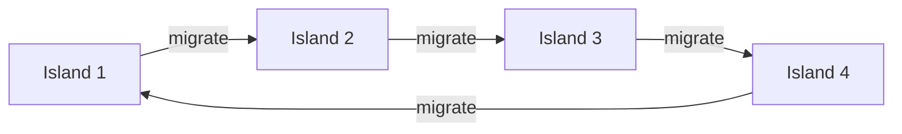

<!-- _class: lead -->
<!-- Speaker notes: This final guide in Module 5 covers the practical engineering of a good GA: knowing when it's done, keeping it healthy, and setting the right parameters. Emphasise that a GA that converges prematurely is not just suboptimal — it may be far worse than a well-tuned greedy search. This is where most real-world GA failures occur. -->

# Convergence, Diversity, and Parameter Tuning
## Module 5.3 — Making the GA Work in Practice

**Detecting, preserving, and recovering diversity for reliable feature selection**

---

<!-- Speaker notes: Motivate why convergence monitoring matters. A GA that runs too long wastes computation. A GA that stops too early gives a bad answer. The combination of plateau detection + diversity monitoring + generation limit is the standard industry approach. No single criterion is sufficient alone. -->

## Why Convergence Monitoring Matters

**Too few generations**: GA hasn't found the optimum — returns mediocre solution.

**Too many generations**: Wasted computation — population has converged, no new solutions explored.

**Three complementary termination signals**:

```python
def should_stop(gen, max_gen, plateau_count, patience,
                diversity, min_diversity):
    return (
        gen >= max_gen          # safety backstop
        or plateau_count >= patience   # fitness plateau
        or diversity < min_diversity   # diversity collapse
    )
```

**Practical defaults**:
- `max_gen = 200`
- `patience = 20`
- `min_diversity = 0.02` (Hamming)

Use all three — they catch different failure modes.

---

<!-- Speaker notes: Walk through each convergence indicator. Fitness plateau is the most intuitive. Hamming diversity catches the chromosome-level collapse (all individuals look the same). Genotypic entropy catches gene-level fixation (every individual has gene 7 = 1). Phenotypic diversity (fitness std) catches the case where chromosomes differ but all have similar fitness. -->

## Convergence Detection: Three Metrics

**1. Fitness plateau** — no improvement for $G$ generations:
```python
if best_fitness - last_best < 1e-5:
    stagnation_count += 1
else:
    stagnation_count = 0
    last_best = best_fitness
```

**2. Hamming diversity** — mean pairwise chromosome distance:
$$D_H = \frac{\sum_{i \neq j} d_H(s_i, s_j)}{N(N-1) \cdot p}$$

```python
chroms = np.array([ind.chromosome for ind in pop])
diffs = np.sum(chroms[:, None, :] != chroms[None, :, :], axis=2)
D_H = diffs[np.triu_indices(len(chroms), k=1)].mean() / p
```

**3. Genotypic entropy** — per-gene Shannon entropy:
$$H = \frac{1}{p}\sum_{i=1}^p H(p_i)$$

High entropy → diverse; low entropy → converged.

---

<!-- Speaker notes: Show the convergence curves from a typical run. The key visual: best fitness rises fast, then plateaus; Hamming diversity falls fast, then bottoms out. These happen at the same time — which is the signature of premature convergence. Contrast with a healthy run where fitness reaches a plateau after diversity has already stabilised at a moderate level. -->

## Convergence Diagnosis: Reading the Curves

A **healthy GA** (left) vs. **premature convergence** (right):

<div class="columns">

Healthy:
```
Fitness:   ↗↗↗↗↗↗→→→
Diversity: ↘↘↘↘→→→→→
           ↑ diversity stabilises
             before fitness plateaus
```

Premature:
```
Fitness:   ↗↗→→→→→→→
Diversity: ↘↘↘↘↘↘↘↘↘
           ↑ diversity collapses early,
             fitness plateaus too soon
```

</div>

**Diagnosis checklist**:

| Symptom | Measurement | Threshold | Cause |
|:---|:---:|:---:|:---|
| Early plateau | Stagnation gens | > 30 | Selection too strong |
| Low diversity | $D_H$ | < 0.05 | Elitism too high |
| Uniform pop | # unique chroms | < 5 | Population too small |

---

<!-- Speaker notes: Crowding is the most intuitive diversity mechanism. Each offspring only competes against similar individuals. Analogy: in a school, students compete for the same grade — a top student doesn't displace a star athlete because they're in different niches. The key parameter is crowding_factor — 3 is a good default. -->

## Crowding — Niche-Based Replacement

**Standard replacement**: offspring competes against entire population → strong individuals dominate.

**Crowding**: offspring competes only against the **most similar individual** (nearest Hamming neighbour):

```python
def crowding_replacement(population, offspring, crowding_factor=3):
    new_pop = population.copy()
    for child in offspring:
        # Sample crowding_factor candidates
        candidates = np.random.choice(len(new_pop), crowding_factor, replace=False)
        # Find most similar (min Hamming distance)
        distances = [np.sum(child.chromosome != new_pop[i].chromosome)
                     for i in candidates]
        closest = candidates[np.argmin(distances)]
        # Replace only if child is better
        if child.fitness >= new_pop[closest].fitness:
            new_pop[closest] = child.copy()
    return new_pop
```

**Effect**: maintains multiple phenotypic niches — different feature subsets coexist.

> Use crowding when you want a **diverse set of good solutions** (not just one best).

---

<!-- Speaker notes: Fitness sharing reduces fitness of individuals in crowded regions. Think of it as resource sharing — individuals in the same neighbourhood compete for the same "resources" (selection slots). The sharing radius sigma_share determines what "similar" means. Too small and sharing has no effect; too large and everything shares. 0.15-0.2 is a good default. -->

## Fitness Sharing — Rewarding Sparse Regions

Each individual's fitness is divided by its **niche count** (how many similar individuals exist):

$$f'(s_i) = \frac{f(s_i)}{\sum_j \text{sh}(d_H(s_i, s_j))}$$

$$\text{sh}(d) = \begin{cases} 1 - (d/\sigma_{\text{share}})^\alpha & d < \sigma_{\text{share}} \\ 0 & \text{otherwise} \end{cases}$$

```python
def apply_fitness_sharing(population, sigma_share=0.2, alpha=1.0):
    p = len(population[0].chromosome)
    sigma_abs = sigma_share * p
    for i, ind_i in enumerate(population):
        niche_count = 1.0
        for j, ind_j in enumerate(population):
            if i == j: continue
            d = np.sum(ind_i.chromosome != ind_j.chromosome)
            if d < sigma_abs:
                niche_count += 1.0 - (d / sigma_abs) ** alpha
        ind_i.fitness /= niche_count
```

**Setting $\sigma_{\text{share}}$**: start at $0.15$ — individuals within 15% of chromosome length share fitness.

---

<!-- Speaker notes: Island models are the most effective diversity strategy AND give you parallelism for free. Each island is an independent GA. Migration connects them. The ring topology (island i sends to island i+1) is simple and works well. The key parameter is migration interval — too frequent destroys isolation, too infrequent and islands never share good solutions. -->

## Island Models — Parallel GAs with Migration

Run $K$ independent GAs on separate **islands**. Periodically **migrate** individuals between islands:



**Ring topology migration** (every 10 generations):

```python
def migrate(islands, migration_rate=0.1):
    n_migrants = max(1, int(island_pop_size * migration_rate))
    migrants = [sorted(isl, key=lambda x: x.fitness,
                       reverse=True)[:n_migrants]
                for isl in islands]
    # Ring: island i receives from island (i-1) % K
    for i, island in enumerate(islands):
        incoming = migrants[(i - 1) % len(islands)]
        # Replace worst
        island.sort(key=lambda x: x.fitness)
        island[:n_migrants] = [ind.copy() for ind in incoming]
```

**Advantages**: diversity by isolation + natural CPU parallelism.

---

<!-- Speaker notes: Premature convergence is the most common GA failure mode. Walk through the three-step diagnosis: (1) check if fitness plateaued early (< 50 generations for a 100-generation run), (2) check Hamming diversity at plateau time, (3) check if the plateau fitness is suspiciously close to a filter-method result. Then apply the remedies in order. -->

## Premature Convergence: Diagnosis and Remedies

**Step 1: Diagnose**

```python
def diagnose(population, history, gen):
    return {
        "diversity": hamming_diversity(population),
        "stagnation": sum(1 for h in reversed(history)
                         if abs(h - history[-1]) < 1e-5),
        "n_unique": len(set(ind.chromosome.tobytes()
                           for ind in population)),
    }
```

**Step 2: Apply remedy (in priority order)**

| Diagnosis | Remedy |
|:---|:---|
| Selection pressure too high | Reduce tournament size $k$ |
| Diversity collapsed | Boost mutation rate 5× for 5 gens |
| Early plateau | Inject random immigrants (10–20% pop) |
| All identical chromosomes | Restart with elites |

---

<!-- Speaker notes: Random immigrant injection is the most practical remedy and least disruptive. It adds new genetic material without discarding what the GA has already learned. The key parameter is how many to inject — 10-20% per restart event is the standard. Trigger on diversity falling below threshold rather than on a fixed schedule. -->

## Diversity Recovery — Immigrant Injection

**Replace worst individuals with random newcomers** when diversity falls:

```python
def inject_immigrants(population, n_immigrants, n_features,
                      X, y, fitness_fn):
    """Replace worst n_immigrants with random individuals."""
    immigrants = []
    for _ in range(n_immigrants):
        ind = Individual.random(n_features)
        ind.fitness = fitness_fn(ind.chromosome, X, y)
        immigrants.append(ind)

    # Sort descending (best first), replace worst
    population.sort(key=lambda x: x.fitness, reverse=True)
    return population[:-n_immigrants] + immigrants

# Trigger condition:
if hamming_diversity(population) < 0.05:
    n_inject = max(5, int(len(population) * 0.15))
    population = inject_immigrants(population, n_inject,
                                   n_features, X, y, fitness_fn)
```

**Rule of thumb**: inject 10–15% of population when $D_H < 0.05$.

---

<!-- Speaker notes: Parameter recommendations. These are empirically validated starting points — not magic numbers. Emphasise that these should be treated as starting points, not constants. The grid search workflow in Notebook 03 shows how to tune them systematically. The most impactful parameters are population size and parsimony weight — get these right first. -->

## Parameter Recommendations for Feature Selection

| Parameter | Default | Low ($p<30$) | High ($p>100$) |
|:---:|:---:|:---:|:---:|
| Population $N$ | 50 | 30 | 100–200 |
| Generations $T$ | 100 | 75 | 150 |
| Crossover $p_c$ | 0.8 | 0.8 | 0.8 |
| Mutation $p_m$ | $1/p$ | $1/p$ | $1.5/p$ |
| Tournament $k$ | 3 | 3 | 3–5 |
| Elitism $e$ | 2 | 2 | 3–5 |
| Parsimony $\lambda$ | 0.01 | 0.01 | 0.01 |
| Patience | 20 | 15 | 30 |

**Tuning priority** (most → least impactful):

1. Population size $N$
2. Parsimony weight $\lambda$
3. Mutation rate $p_m$
4. Tournament size $k$

---

<!-- Speaker notes: GA vs alternatives. This is the question students always ask: "when should I use a GA vs a simpler method?" The honest answer is: GAs shine when features interact. If features are mostly independent, a filter method or forward selection will match GA performance in a fraction of the time. The comparison chart makes this concrete. -->

## GA vs Alternative Search Methods

**Same evaluation budget** ($N=50$ pop, $T=100$ gens = 5,000 evaluations with caching):

| Method | Quality | Speed | Handles interactions | When to use |
|:---|:---:|:---:|:---:|:---|
| Filter (MI, F-stat) | Moderate | Very fast | No | Baseline, $p > 1000$ |
| Forward selection | Good locally | Fast | Partial | Clean feature spaces |
| Backward elimination | Good locally | Fast | Partial | $p < n$ |
| **GA** | **Best overall** | Moderate | **Yes** | **Feature interactions** |
| Random search (5000 evals) | Competitive | Fast | No | Strong baseline |
| Exhaustive ($p \leq 20$) | Optimal | Slow | Yes | Tiny feature spaces |

**GA advantage is largest when**:
- Features have interactions (synergistic or antagonistic effects)
- Fitness landscape is multi-modal (many local optima)
- $p \in [20, 500]$ (large enough for interactions, small enough for reasonable pop sizes)

---

<!-- Speaker notes: DEAP gives three things the custom implementation doesn't: (1) multi-objective algorithms (NSGA-II for Pareto fronts), (2) easy parallelism via pool.map, (3) Hall of Fame tracking built in. The code should be recognisable because all the concepts are the same — just different API calls. Walk through the key lines. -->

## DEAP Integration — Key Components

```python
from deap import base, creator, tools, algorithms

# Define fitness and individual types
creator.create("FitnessMax", base.Fitness, weights=(1.0,))
creator.create("Individual", list, fitness=creator.FitnessMax)

toolbox = base.Toolbox()
toolbox.register("attr_bool", np.random.randint, 0, 2)
toolbox.register("individual", tools.initRepeat,
                 creator.Individual, toolbox.attr_bool, N_FEATURES)
toolbox.register("population", tools.initRepeat, list, toolbox.individual)

# Register operators (same concepts, DEAP API)
toolbox.register("evaluate", your_fitness_fn)
toolbox.register("mate", tools.cxUniform, indpb=0.5)      # uniform crossover
toolbox.register("mutate", tools.mutFlipBit, indpb=1/N_FEATURES)
toolbox.register("select", tools.selTournament, tournsize=3)

# Hall of Fame + statistics
hof = tools.HallOfFame(5)
stats = tools.Statistics(lambda ind: ind.fitness.values[0])
stats.register("max", np.max)
stats.register("mean", np.mean)

# One-line evolution
pop, log = algorithms.eaSimple(pop, toolbox, cxpb=0.8, mutpb=1.0,
                               ngen=100, stats=stats, halloffame=hof)
```

---

<!-- Speaker notes: DEAP parallelism is the standout feature. The pool.map replacement means fitness evaluations run in parallel across all CPU cores with almost zero code change. Caveat: fitness caching doesn't work across processes unless you use shared memory. In practice, use caching within the process, parallel evaluation across population. -->

## DEAP Parallelisation

Replace single-process evaluation with process pool in 3 lines:

```python
import multiprocessing

if __name__ == "__main__":
    # Register parallel map
    pool = multiprocessing.Pool()          # uses all CPU cores
    toolbox.register("map", pool.map)      # replaces built-in map

    # eaSimple now evaluates population in parallel automatically
    pop, log = algorithms.eaSimple(
        pop, toolbox, cxpb=0.8, mutpb=1.0, ngen=100,
        stats=stats, halloffame=hof, verbose=True
    )
    pool.close()
```

**Expected speedup on 8-core machine**:

| Fitness cost | Speedup |
|:---:|:---:|
| LogReg (fast) | 2–3× (overhead dominates) |
| RandomForest (moderate) | 4–6× |
| XGBoost (slow) | 6–8× |

> Always profile before parallelising — overhead matters for fast fitness functions.

---

<!-- Speaker notes: Compare the custom implementation with DEAP. The honest assessment: custom is better for learning and full control; DEAP is better for production multi-objective and parallelism. Both are valid. The key insight: once you understand the custom implementation (Guide 01), DEAP is just a different API for the same concepts. -->

## Custom vs DEAP: When to Use Each

<div class="columns">

**Custom implementation**:
- Full control over every component
- Easier to debug and understand
- Best for learning and experimentation
- Add custom operators freely
- No framework overhead

**DEAP framework**:
- NSGA-II for Pareto-front selection
- Built-in parallelism (pool.map)
- Hall of Fame, Statistics, Logbook
- CMA-ES, GP, and other algorithms
- Active community and documentation

</div>

**Decision rule**:

| Use case | Choice |
|:---|:---:|
| Learning GA concepts | Custom |
| Single-objective feature selection | Custom or DEAP |
| Multi-objective (accuracy + size Pareto front) | DEAP (NSGA-II) |
| Parallel evaluation needed | DEAP |
| Full algorithmic control | Custom |

---

<!-- Speaker notes: The complete workflow slide puts everything together. This is what a student should implement in their own project. The key sequence: (1) start with recommended defaults, (2) monitor convergence, (3) apply diversity preservation if needed, (4) do parameter sweep on validation set (not test set!), (5) evaluate on holdout test set only once at the very end. -->

## Complete GA Workflow

```python
# 1. Configure with recommended defaults
cfg = GAConfig(pop_size=50, n_generations=200, patience=20,
               mutation_rate=None,  # 1/p
               parsimony_weight=0.01, adaptive_mutation=True)

# 2. Run GA with monitoring
selector = GAFeatureSelector(cfg)
selector.fit(X_train, y_train)

# 3. Monitor convergence health
report = diagnose_convergence(selector.final_population_,
                              selector.history["best_fitness"],
                              selector.n_generations_run_)

# 4. Parameter sweep on validation set (not test set)
grid = {"pop_size": [30, 50, 100],
        "parsimony_weight": [0.005, 0.01, 0.05]}
results = parameter_sweep(X_train, y_train, X_val, y_val, grid)

# 5. Final evaluation on holdout test set (once only)
best_cfg = results.sort_values("val_accuracy").iloc[-1]
final_selector = GAFeatureSelector(GAConfig(**best_cfg))
final_selector.fit(X_train, y_train)
test_score = evaluate_on_test(final_selector, X_test, y_test)
```

---

<!-- Speaker notes: Final summary. Ten key points — this is the complete mental model for running a GA feature selector in production. Emphasise that parameter tuning must be done on a validation set, not the test set. The test set is used exactly once, after all tuning is done. This is the most commonly violated rule in practice. -->

## Module 5.3 Summary

**Ten key takeaways for GA in production:**

1. Use **compound termination**: plateau + diversity + generation limit
2. Monitor both **Hamming diversity** and **genotypic entropy** — they catch different failure modes
3. **Crowding** preserves niches; **fitness sharing** rewards sparse regions
4. **Island models** are the most effective diversity strategy and provide free parallelism
5. Premature convergence: (1) reduce selection pressure, (2) boost mutation, (3) inject immigrants
6. Population size $N = \max(50, 1.5p)$ is a practical rule; scale up for $p > 100$
7. Mutation rate $1/p$ with diversity-triggered adaptive boost is the best default
8. **DEAP** for NSGA-II (Pareto front) and easy parallelism; custom for learning and control
9. **Random search with equal budget** is the minimum baseline — always compare against it
10. **Parameter tuning uses the validation set** — the test set is used exactly once

**You are now ready for Notebooks 01–03.**

---

<!-- Speaker notes: Self-check before the notebooks. Q4 is the most important — students need to be able to diagnose a convergence problem from curves alone. This is a practical skill they'll need when their GA doesn't work on their own dataset. Q5 is about understanding the island model topology. -->

## Self-Check Questions

1. Your GA runs for 200 generations. Hamming diversity reaches 0.02 at generation 30 and stays there. Best fitness hasn't improved since generation 35. What happened and what should you try?

2. Write the formula for genotypic entropy and explain what $H = 0$ and $H = 1$ mean in terms of the population state.

3. You have 4 island GAs running in parallel. Island 1 finds a high-fitness solution at generation 20. With ring topology and migration every 10 generations, when does Island 3 first receive a copy of this solution?

4. Fitness sharing uses $\sigma_{\text{share}} = 0.2$ with $p = 50$ features. Individual A has 10 neighbours within Hamming distance 10. Individual B has 2 neighbours. If both have raw fitness 0.90, which has higher shared fitness?

5. Your GA runs 50 generations. Random search with 50×50=2,500 evaluations achieves a test AUC of 0.84. Your GA achieves 0.83. What does this tell you about the fitness landscape?
