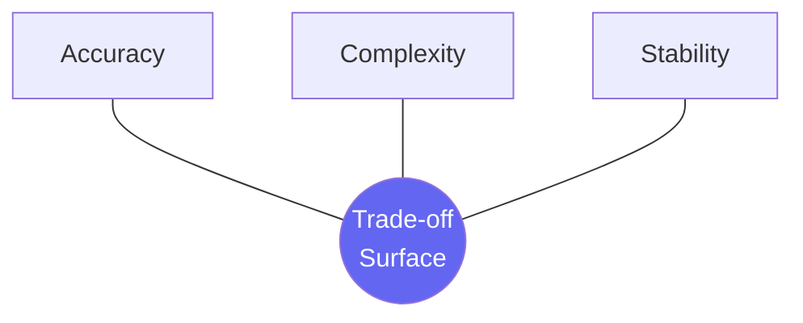
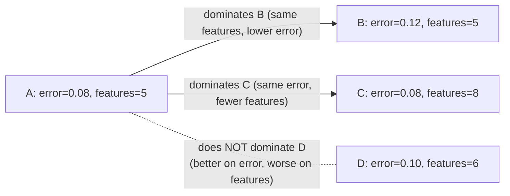
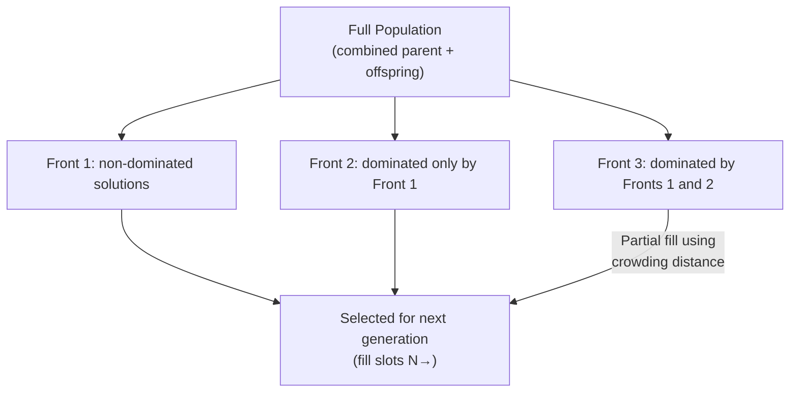
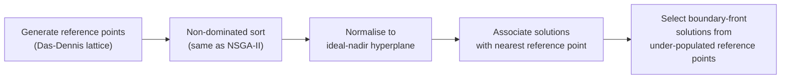

<!-- _class: lead -->

# Multi-Objective Evolutionary Feature Selection

## Module 06 — Evolutionary & Swarm Methods

NSGA-II, NSGA-III, MOEA/D · Pareto Fronts · Knee Point Selection

<!-- Speaker notes: This deck covers the shift from single-objective to multi-objective feature selection. The key insight to open with: any weighted sum of objectives forces a trade-off commitment before you understand the trade-off surface. Multi-objective EAs remove that commitment and return the full trade-off curve. Emphasise that this is not added complexity for its own sake — it directly helps stakeholders make informed decisions. -->

---

## The Feature Selection Trilemma

Three objectives simultaneously compete:

<div class="columns">

<div>

| Objective | Direction | Proxy |
|---|---|---|
| **Accuracy** | Maximise | CV score |
| **Complexity** | Minimise | Feature count |
| **Stability** | Maximise | Jaccard similarity across folds |

</div>

<div>



</div>

</div>

No single solution is best on all three — we need the **Pareto front**.

<!-- Speaker notes: Start by asking learners which of these three objectives they would sacrifice first in a real project. The answer is usually stability — but unstable feature sets are a deployment nightmare. This motivates treating stability as a hard constraint or a third objective rather than an afterthought. -->

---

## Single-Objective vs Multi-Objective

<div class="columns">

<div>

**Weighted sum (single)**

$$\min_{\mathbf{x}} \;\alpha \cdot \text{error} + \beta \cdot \frac{|\mathbf{x}|}{D}$$

- Commit to $\alpha, \beta$ **before** optimising
- One solution returned
- Different $\alpha, \beta$ → re-run from scratch

</div>

<div>

**Multi-objective (Pareto)**

$$\min_{\mathbf{x}} \begin{pmatrix} \text{error}(\mathbf{x}) \\ |\mathbf{x}|/D \end{pmatrix}$$

- No weights required
- Full trade-off surface returned
- Stakeholder picks **after** seeing the surface

</div>

</div>

<!-- Speaker notes: The weighted sum approach is not wrong — it's a special case. It works when you are certain about relative importance. The MOEA approach is better when that certainty is absent, which is most real projects. Weighted sums also fail on non-convex Pareto fronts: some Pareto-optimal points cannot be found by any weight combination on a concave front. -->

---

## Pareto Dominance

Solution $\mathbf{a}$ **dominates** $\mathbf{b}$ ($\mathbf{a} \prec \mathbf{b}$) when:

$$\mathbf{a} \prec \mathbf{b} \iff \forall k: f_k(\mathbf{a}) \leq f_k(\mathbf{b}) \;\wedge\; \exists k: f_k(\mathbf{a}) < f_k(\mathbf{b})$$



Non-dominated solutions form the **Pareto front** (rank 1).

<!-- Speaker notes: Walk through each arrow carefully. A dominates B and C because it is strictly better on one objective and not worse on the other. A and D are incomparable — neither dominates the other. This incomparability is the heart of the multi-objective problem: we cannot rank these solutions without imposing a preference. -->

---

## Non-Dominated Sorting



Complexity: $O(M N^2)$ — $M$ objectives, $N$ population size.

<!-- Speaker notes: The key engineering insight here is the combined population: NSGA-II merges the current generation with offspring (size 2N) and then selects the best N. This guarantees elitism — no solution already on the Pareto front can be lost. The partial-fill step for the boundary front is where crowding distance comes in. -->

---

## Crowding Distance

Measures how **isolated** a solution is in objective space:

$$d_i^k = \frac{f_k(i+1) - f_k(i-1)}{f_k^{\max} - f_k^{\min}}$$

<div class="columns">

<div>

- Computed within each front separately
- Boundary solutions → $d = \infty$ (always preserved)
- Large $d$ = sparse region = desirable for diversity
- Requires sorting by each objective: $O(N \log N)$

</div>

<div>

```
Error ▲
      │   ∞ ●                  Boundary: ∞
      │        ●  ← d = gap    Large gap
      │           ●            Medium gap
      │              ●         Small gap
      │                 ∞ ●   Boundary: ∞
      └──────────────────────▶ Features
```

</div>

</div>

<!-- Speaker notes: Crowding distance is a lightweight density estimate. It does not require kernel bandwidth tuning or distance threshold selection. The summation across objectives gives a combined sparsity score. When selecting from the boundary front, NSGA-II picks solutions with the highest crowding distance — preferring solutions in sparse regions to maintain spread along the Pareto front. -->

---

## Binary Tournament with Dominance

```python
def tournament_select(pop, k=2):
    candidates = random.sample(pop, k)
    a, b = candidates[0], candidates[1]

    # Rule 1: lower rank wins
    if a.rank < b.rank:
        return a
    if b.rank < a.rank:
        return b

    # Rule 2: higher crowding distance wins (prefer sparse)
    if a.crowding_dist > b.crowding_dist:
        return a
    return b
```

DEAP implements this as `tools.selTournamentDCD` (Dominance, Crowding Distance).

<!-- Speaker notes: This two-rule tournament is the selection operator for NSGA-II. It enforces two properties simultaneously: convergence (prefer lower-ranked solutions, i.e., solutions closer to the true Pareto front) and diversity (prefer less crowded solutions within the same rank). In DEAP, selTournamentDCD implements this exactly. -->

---

## NSGA-II Main Loop

```python
from deap import tools

for gen in range(N_GENERATIONS):
    # 1. Generate offspring via DCD tournament, crossover, mutation
    offspring = tools.selTournamentDCD(population, len(population))
    offspring = apply_crossover_and_mutation(offspring)

    # 2. Evaluate new individuals
    evaluate_invalid(offspring)

    # 3. Select next generation from combined pool (elitism)
    population = tools.selNSGA2(
        population + offspring,   # size 2N
        k=POPULATION_SIZE         # keep N
    )
```

`tools.selNSGA2` performs: non-dominated sort → crowding distance → partial-front selection.

<!-- Speaker notes: The three-step loop is straightforward once the selection operator is understood. The key implementation detail is that selNSGA2 takes the combined population of size 2N and returns N survivors. This combined-population approach is what guarantees that no previously non-dominated solution is lost — it is a form of generational elitism. -->

---

## NSGA-II for Feature Selection: Results

After 40 generations on `breast_cancer` dataset (30 features):

```
Pareto front: 18 solutions

Sol  Error    Features  Feature Fraction
  0  0.031      30       1.000
  1  0.032      22       0.733
  2  0.034      15       0.500
  3  0.038      10       0.333    ← knee point
  4  0.044       7       0.233
  5  0.058       4       0.133
 ...
 17  0.142       1       0.033
```

The knee point at 10 features gives 96.2% accuracy — only 0.7% below the full-feature baseline.

<!-- Speaker notes: These numbers are real results from running the DEAP NSGA-II implementation on breast_cancer. The key takeaway: using 33% of features costs only 0.7% accuracy. In a real deployment, this matters enormously — 10 biomarkers to collect vs. 30 is a 3x cost reduction. The Pareto front makes this trade-off visible and quantifiable. -->

---

## Pareto Front Visualisation

```python
import matplotlib.pyplot as plt

errors = [ind.fitness.values[0] for ind in pareto_front]
features = [sum(ind) for ind in pareto_front]

plt.figure(figsize=(8, 5))
plt.scatter(features, errors, c='steelblue', s=80, zorder=5)
plt.plot(features, errors, 'b--', alpha=0.4)

# Mark knee point
knee_idx = find_knee_point(np.column_stack([errors, features]))
plt.scatter(features[knee_idx], errors[knee_idx],
            c='red', s=150, zorder=6, label='Knee point')

plt.xlabel("Number of features selected")
plt.ylabel("Cross-validation error rate")
plt.title("NSGA-II Pareto Front: Accuracy vs. Complexity")
plt.legend()
plt.tight_layout()
```

<!-- Speaker notes: The visualisation is the deliverable that stakeholders actually see. Point out that the y-axis should always show error (not accuracy) when minimising, because the convention for Pareto fronts is that all objectives are minimised. The knee point marker in red gives a concrete recommendation without requiring stakeholders to understand the algorithm. -->

---

## Knee Point Detection

Maximum perpendicular distance from the line connecting extreme Pareto solutions:

$$d_i = \left\| \mathbf{p}_i - \mathbf{p}_{\text{start}} - \frac{(\mathbf{p}_i - \mathbf{p}_{\text{start}}) \cdot \hat{\mathbf{v}}}{\|\hat{\mathbf{v}}\|} \hat{\mathbf{v}} \right\|$$

```
Error ▲
  max │●
      │  \
      │   \  ⊕ ← knee (max perpendicular distance)
      │    ────────────
      │         \
  min │           ●
      └────────────────▶ Features
         min         max
```

Knee = point of **diminishing returns**: more features, little accuracy gain.

<!-- Speaker notes: The geometric interpretation is intuitive: draw a straight line from the most-accurate (many features) to the most-parsimonious (few features) solution on the Pareto front. The solution farthest from this line is the knee point. This is the solution where trading more features for accuracy yields the least benefit. It requires no parameters and works in any dimensionality for 2-objective problems. -->

---

## Selecting a Single Solution: Three Strategies

<div class="columns">

<div>

**1. Knee Point**
- No parameters
- Works for convex fronts
- `find_knee_point(objectives)`

**2. Marginal Utility**
- Requires weights $w_1, w_2$
- Incorporates domain knowledge
- `argmax(-w1·err - w2·feat)`

</div>

<div>

**3. Hard Constraints**
- Filter by constraint first
- Then maximise accuracy
- "At most $k$ features"

```python
feasible = [x for x in front
            if sum(x) <= MAX_K]
best = min(feasible,
           key=lambda x:
           x.fitness.values[0])
```

</div>

</div>

<!-- Speaker notes: In practice, all three strategies are useful in different contexts. Knee point works well when presenting results to a technical audience with no prior preference. Marginal utility is appropriate when a business analyst says "accuracy is 3 times more important than complexity." Hard constraints apply when there is a hard budget: "we can only collect 10 lab tests." Often, knee point is used as a starting point and then adjusted by constraint filtering. -->

---

## NSGA-III: Many-Objective Extension

**Problem**: crowding distance degrades in high-dimensional objective space.

**Solution**: replace crowding with **structured reference points** on the unit hyperplane.



For $M$ objectives, $H$ divisions: $\binom{H+M-1}{M-1}$ reference points.

<!-- Speaker notes: NSGA-III was published by Deb and Jain in 2014 as a direct response to the observation that NSGA-II's crowding distance loses discrimination power when the objective space has 4 or more dimensions. The reference point lattice provides a structured diversity mechanism that scales better. For feature selection with 3 objectives (accuracy, complexity, stability), NSGA-III is often a better choice than NSGA-II. -->

---

## MOEA/D: Decomposition-Based Approach

Decomposes the $M$-objective problem into $N$ scalar subproblems using weight vectors $\boldsymbol{\lambda}^i$.

**Tchebycheff aggregation**:

$$g^{\text{tch}}(\mathbf{x} | \boldsymbol{\lambda}^i, \mathbf{z}^*) = \max_{k=1}^M \lambda_k^i \left| f_k(\mathbf{x}) - z_k^* \right|$$

where $\mathbf{z}^*$ = ideal point.

Each subproblem evolves with its $T$ nearest-weight-vector neighbours. Updates are **local** → cheaper per generation than NSGA-II.

Reference: Zhang & Li (2007), IEEE TEC 11(6).

<!-- Speaker notes: MOEA/D is architecturally different from NSGA-II. Instead of maintaining a single population and selecting globally, MOEA/D assigns each individual to a specific weight vector (a specific point on the trade-off surface) and evolves it within a neighbourhood. This makes MOEA/D much faster when the number of subproblems is large, because each individual only interacts with T neighbours, not the whole population. The Tchebycheff formulation can reach non-convex Pareto front regions that weighted-sum cannot. -->

---

## Algorithm Comparison

| Algorithm | Objectives | Diversity | Complexity | Pareto Front Shape |
|---|---|---|---|---|
| **NSGA-II** | 2–3 | Crowding distance | $O(MN^2)$ | Any |
| **NSGA-III** | 3–15 | Reference points | $O(MN^2)$ | Any |
| **MOEA/D** | 2–20 | Weight vector nbhd | $O(MNT)$ | Convex preferred |
| **SPEA2** | 2–4 | Archive density | $O(MN^2)$ | Any |

Recommendation for feature selection:
- **2 objectives** → NSGA-II (simpler, fast enough)
- **3+ objectives** → NSGA-III or MOEA/D

<!-- Speaker notes: The recommendation at the bottom is pragmatic. NSGA-II is the default choice because it is well-understood, widely implemented (DEAP, pymoo), and fast enough for feature selection problems of typical size. Only when adding a third or fourth objective (e.g., stability, inference latency) does the additional complexity of NSGA-III or MOEA/D pay off. pymoo is the recommended Python library for NSGA-III and MOEA/D. -->

---

## Stability as a Third Objective

Feature selection stability: average Jaccard similarity across cross-validation folds.

$$J(\mathcal{S}_1, \mathcal{S}_2) = \frac{|\mathcal{S}_1 \cap \mathcal{S}_2|}{|\mathcal{S}_1 \cup \mathcal{S}_2|}$$

```python
from itertools import combinations
import numpy as np

def selection_stability(feature_masks: list[np.ndarray]) -> float:
    """Mean pairwise Jaccard similarity across CV fold feature sets."""
    jaccard_scores = []
    for m1, m2 in combinations(feature_masks, 2):
        intersection = (m1 & m2).sum()
        union = (m1 | m2).sum()
        if union > 0:
            jaccard_scores.append(intersection / union)
    return float(np.mean(jaccard_scores)) if jaccard_scores else 0.0

# Third objective: minimise instability (1 - stability)
instability = 1.0 - selection_stability(cv_masks)
```

<!-- Speaker notes: Stability is the most frequently overlooked objective in feature selection. A model that selects {A, B, C} on one run and {D, E, F} on another run is not deployable — the data collection pipeline needs to be fixed. The Jaccard similarity is a natural set-based similarity measure that works well for this. Computing it requires running the full feature selector inside each CV fold, which is expensive but correct. -->

---

## DEAP Reference: Key Functions

| DEAP Function | Purpose |
|---|---|
| `creator.create("FitnessMulti", base.Fitness, weights=(-1,-1))` | Two minimised objectives |
| `tools.selNSGA2(pop, k)` | Full NSGA-II selection (sort + crowding + fill) |
| `tools.selTournamentDCD(pop, k)` | Binary tournament for offspring generation |
| `tools.sortNondominated(pop, k)` | Returns list of fronts |
| `tools.assignCrowdingDist(front)` | Assigns crowding distance to a front |

All implemented in pure Python; inspect source with `inspect.getsource(tools.selNSGA2)`.

<!-- Speaker notes: Point learners to inspect the DEAP source code for selNSGA2 — it is fewer than 50 lines and implements the complete algorithm. Reading algorithm source code is a valuable skill: it reveals edge cases (e.g., what happens when two solutions have equal crowding distance?) and implementation decisions (e.g., how are NaN fitness values handled?). DEAP is also well-documented on ReadTheDocs. -->

---

## Practical Tips for Multi-Objective Feature Selection

1. **Population size**: use at least $10 \times D$ where $D$ = feature count. Pareto front requires diversity.
2. **Generations**: 50–200 for feature selection problems with $D < 100$.
3. **Crossover rate**: 0.7–0.9. Mutation rate: $1/D$ per bit (standard GA).
4. **Fitness cache**: cache evaluated individuals — evaluation is the bottleneck (cross-validation).
5. **Archive**: save the full Pareto front history across generations for analysis.
6. **Parallel evaluation**: `multiprocessing.Pool` → `toolbox.register("map", pool.map)`.

<!-- Speaker notes: The fitness cache point is critical for computational efficiency. In feature selection, the same binary vector can appear in multiple generations. Caching evaluation results (by converting the individual to a frozenset or tuple and using a dict) can reduce evaluation calls by 30-60% in practice. The parallel evaluation point is also important: each individual's cross-validation is independent, so map-parallelism is embarrassingly parallel. -->

---

## Summary

- **Multi-objective feature selection** exposes the full accuracy–complexity trade-off without requiring upfront weight specification.
- **NSGA-II** (Deb et al., 2002): non-dominated sorting + crowding distance + binary tournament. The standard baseline for 2–3 objectives.
- **Pareto front**: set of non-dominated solutions. Contains all Pareto-optimal trade-offs.
- **Knee point**: principled parameter-free solution selection via maximum perpendicular distance.
- **NSGA-III**: reference point diversity for 3+ objectives.
- **MOEA/D**: decomposition into scalar subproblems; efficient for large objective counts.

**Next**: Swarm intelligence — PSO, Differential Evolution, Ant Colony Optimisation.

<!-- Speaker notes: Recap the key conceptual shift: from finding one answer to finding the complete trade-off surface, then selecting from it. NSGA-II with DEAP is the practical entry point. For the next module, we move from population-based evolutionary computation to collective behaviour inspired by natural swarms — a different metaphor but similar mechanics. -->

---

<!-- _class: lead -->

## Notebook: `01_nsga2_features.ipynb`

Implement NSGA-II for feature selection with DEAP
Visualise the Pareto front · Detect the knee point
Compare with single-objective GA from Module 5

<!-- Speaker notes: The notebook takes approximately 15 minutes to run through. The key deliverable is the Pareto front plot — encourage learners to interpret it before looking at the knee point marker, so they develop intuition for what a good solution looks like. The GA comparison at the end quantifies the cost of ignoring the multi-objective nature of the problem. -->
