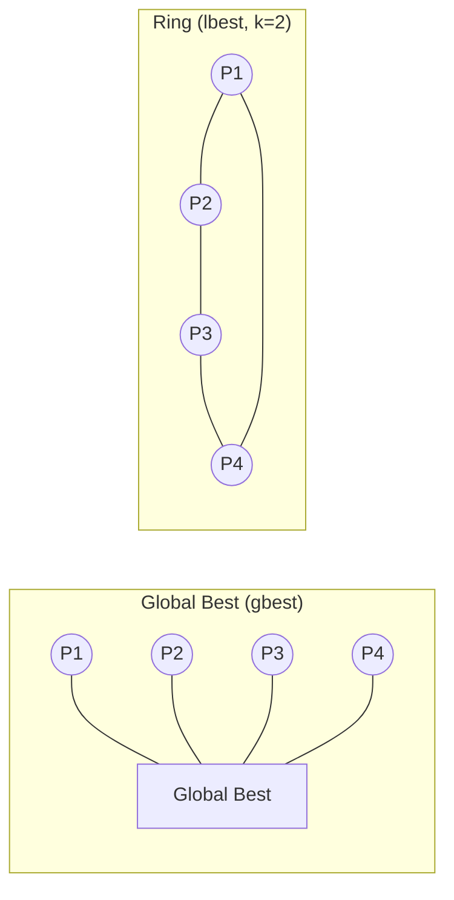
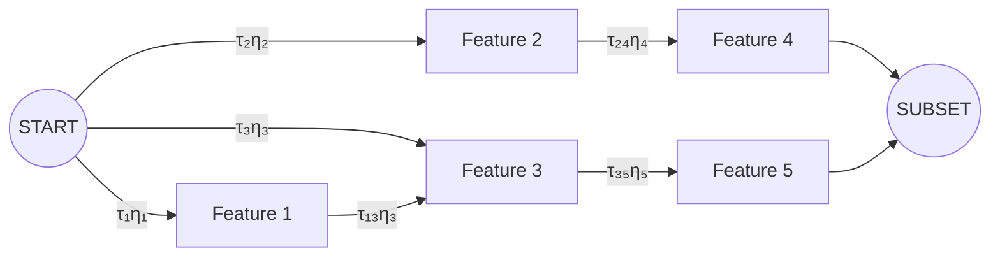

<!-- _class: lead -->

# Swarm Intelligence for Feature Selection

## Module 06 — Evolutionary & Swarm Methods

PSO · Differential Evolution · Ant Colony Optimisation

<!-- Speaker notes: Swarm intelligence is the second major family of nature-inspired optimisation, distinct from evolutionary computation. Where GA/NSGA-II mimic biological reproduction, swarm algorithms model collective behaviour: birds flocking (PSO), information diffusion via pheromones (ACO), and vector perturbations (DE). All three can be applied to feature selection. Today we implement all three and compare their behaviour. -->

---

## Why Swarm Intelligence?

<div class="columns">

<div>

**Evolutionary algorithms** rely on:
- Reproduction (crossover)
- Natural selection
- Mutation

</div>

<div>

**Swarm algorithms** rely on:
- Collective memory (PSO personal/global best)
- Indirect communication (ACO pheromones)
- Population diversity (DE difference vectors)

</div>

</div>

All three methods are **population-based** and **gradient-free** — they work with any fitness function, including the non-differentiable cross-validation score.

<!-- Speaker notes: The gradient-free property is critical for feature selection: the fitness function (cross-validation accuracy) is not differentiable with respect to the binary feature mask. Gradient-based optimisation (SGD, Adam) cannot be directly applied. Swarm and evolutionary methods are a natural fit because they require only function evaluations, not gradients. -->

---

## Particle Swarm Optimisation (PSO)

Kennedy & Eberhart, ICNN 1995.

Each particle has a **position** (solution) and a **velocity** (direction of movement):

$$\mathbf{v}_i^{t+1} = \underbrace{w \mathbf{v}_i^t}_{\text{inertia}} + \underbrace{c_1 r_1 (\mathbf{p}_i - \mathbf{x}_i^t)}_{\text{cognitive}} + \underbrace{c_2 r_2 (\mathbf{g} - \mathbf{x}_i^t)}_{\text{social}}$$

$$\mathbf{x}_i^{t+1} = \mathbf{x}_i^t + \mathbf{v}_i^{t+1}$$

| Parameter | Role | Typical Value |
|---|---|---|
| $w$ | Inertia (exploration vs exploitation) | $0.4 \to 0.9$ (decay) |
| $c_1$ | Cognitive (personal best attraction) | $2.0$ |
| $c_2$ | Social (global best attraction) | $2.0$ |

<!-- Speaker notes: The three-term velocity update is the heart of PSO. Inertia carries the particle forward (momentum). The cognitive term pulls toward the particle's own best-known position — a form of individual memory. The social term pulls toward the swarm's global best — collective knowledge sharing. The balance between these three determines whether PSO explores (high inertia) or exploits (high social). -->

---

## Binary PSO: Sigmoid Transfer Function

Feature selection requires binary decisions. Convert continuous velocity to probability:

$$S(v_{id}) = \frac{1}{1 + e^{-v_{id}}}$$

$$x_{id}^{t+1} = \begin{cases} 1 & \text{if } U(0,1) < S(v_{id}) \\ 0 & \text{otherwise} \end{cases}$$

**Velocity clamping** prevents sigmoid saturation:

$$v_{id} \leftarrow \text{clip}(v_{id}, -v_{\max}, +v_{\max}), \quad v_{\max} = 4.0$$

$S(\pm 4) \approx 0.018 / 0.982$ — both 0 and 1 remain reachable.

<!-- Speaker notes: The sigmoid saturation problem is real and important: if velocities grow large in magnitude (e.g., |v| > 10), S(v) approaches 0 or 1 deterministically, and the particle can no longer change bits. Velocity clamping at ±4 keeps the position update probabilistic. In practice, if you see PSO converging too early with all bits fixed at 0 or 1, velocity clamping is the first thing to check. -->

---

## Transfer Function Comparison

<div class="columns">

<div>

**S-shaped** (original)
$$S(v) = \frac{1}{1+e^{-v}}$$
- Smooth, differentiable
- Saturates at extremes

**V-shaped** (Mirjalili 2014)
$$V(v) = |\tanh(v)|$$
- Preserves direction information
- Often better for FS tasks

</div>

<div>

```
P(x=1)
1.0 ┤        ────────────  S-shaped
    │       /
0.5 ┤─────ˣ──────────────
    │     /
0.0 ┤────────────────────
    │
    │     V-shaped (from 0.5)
0.5 ┤──\      /──────────
    │   \    /
0.0 ┤    ────
    └──────────────────── v
       -4   0   +4
```

</div>

</div>

<!-- Speaker notes: V-shaped transfer functions were proposed by Mirjalili and Lewis in 2013. The key difference: for V-shaped, a large negative velocity has the same high flip probability as a large positive velocity (symmetric around 0). This means a particle moving fast in any direction is likely to flip bits, maintaining exploration. S-shaped particles moving with large negative velocity are likely to become all-zeros, stagnating. -->

---

## PSO Topology: Who Talks to Whom?



| Topology | Convergence | Exploration |
|---|---|---|
| Global best | Fast | Low |
| Ring (lbest) | Slow | High |
| Von Neumann (grid) | Medium | Medium-high |

<!-- Speaker notes: Topology controls the spread of information through the swarm. Global best spreads the best solution immediately to all particles — fast convergence but prone to premature convergence on multimodal landscapes. Ring topology restricts information flow: a bad global optimum can only propagate slowly. For feature selection, which is typically multimodal, ring topology often finds better solutions given enough iterations. The Von Neumann grid is a practical compromise. -->

---

## Binary PSO: Key Implementation Steps

```python
for t in range(N_ITERATIONS):
    # 1. Decaying inertia
    w = W_MAX - (W_MAX - W_MIN) * t / N_ITERATIONS

    # 2. Velocity update (cognitive + social)
    r1, r2 = rng.random((N_PARTICLES, D)), rng.random((N_PARTICLES, D))
    velocities = (w * velocities
                  + C1 * r1 * (personal_best - positions)
                  + C2 * r2 * (global_best - positions))

    # 3. Clamp velocities
    velocities = np.clip(velocities, -V_MAX, V_MAX)

    # 4. Binary position update via sigmoid
    probs = 1 / (1 + np.exp(-velocities))
    positions = (rng.random((N_PARTICLES, D)) < probs).astype(float)

    # 5. Evaluate and update bests
    ...
```

<!-- Speaker notes: Step 3 (clamping) must come before step 4 (sigmoid) — not after. Step 4 is stochastic: the same velocity produces different binary positions each call. This stochasticity is intentional and maintains diversity. Personal best is updated greedily: only replace if the new fitness is strictly better. Global best is updated to the best personal best across all particles. -->

---

## Differential Evolution (DE)

Storn & Price, Journal of Global Optimization, 1997.

**Three mutation strategies** for generating trial vectors:

$$\text{DE/rand/1}: \quad \mathbf{v}_i = \mathbf{x}_{r_1} + F \cdot (\mathbf{x}_{r_2} - \mathbf{x}_{r_3})$$

$$\text{DE/best/1}: \quad \mathbf{v}_i = \mathbf{x}_{\text{best}} + F \cdot (\mathbf{x}_{r_1} - \mathbf{x}_{r_2})$$

$$\text{DE/current-to-best/1}: \quad \mathbf{v}_i = \mathbf{x}_i + F(\mathbf{x}_{\text{best}} - \mathbf{x}_i) + F(\mathbf{x}_{r_1} - \mathbf{x}_{r_2})$$

$F \in [0.4, 0.9]$: mutation scale. Larger $F$ = more exploration.

<!-- Speaker notes: The "rand" vs "best" distinction captures exploration vs exploitation. DE/rand/1 uses three random population members — unbiased, diverse. DE/best/1 always pulls toward the current best — faster convergence but risky on multimodal problems. DE/current-to-best/1 is a compromise: it perturbs the current individual in the direction of the best, scaled by a random difference. For feature selection, DE/rand/1 is the safest default because feature landscapes are often highly multimodal. -->

---

## DE Binomial Crossover

After mutation, the trial vector $\mathbf{u}_i$ is assembled from mutant $\mathbf{v}_i$ and original $\mathbf{x}_i$:

$$u_{ij} = \begin{cases} v_{ij} & \text{if } U(0,1) \leq CR \text{ or } j = j_{\text{rand}} \\ x_{ij} & \text{otherwise} \end{cases}$$

$j_{\text{rand}}$: a randomly chosen dimension, ensuring at least one mutant gene is inherited.

**Greedy selection**: $\mathbf{u}_i$ replaces $\mathbf{x}_i$ only if it is at least as good.

$$\mathbf{x}_i^{t+1} = \begin{cases} \mathbf{u}_i & \text{if } f(\mathbf{u}_i) \leq f(\mathbf{x}_i) \\ \mathbf{x}_i & \text{otherwise} \end{cases}$$

<!-- Speaker notes: The $j_{\text{rand}}$ requirement is subtle but important. Without it, if CR is low, it is possible that no gene from the mutant is used — the trial vector would be identical to the original, producing no change. $j_{\text{rand}}$ prevents this degenerate case. The greedy selection (accept only if better) makes DE an elitist algorithm: no solution in the population ever gets worse between generations. -->

---

## Self-Adaptive DE Variants

Manual tuning of $F$ and $CR$ is brittle. Self-adaptive variants learn parameters during the run.

<div class="columns">

<div>

**jDE** (Brest et al., 2006)
- Each individual carries own $F_i, CR_i$
- Adapt by self-mutation rule
- Simple, robust

**SHADE** (Tanabe & Fukunaga, 2013)
- Historical archive of successful $F, CR$
- Sample from Cauchy/Gaussian around historical mean
- State-of-the-art on CEC benchmarks

</div>

<div>

**L-SHADE**
- SHADE + linear population size reduction
- $N: N_{\max} \to N_{\min}$ over generations
- Best results on CEC 2014 competition

```
N
│▓▓▓▓▓
│   ▓▓▓▓▓
│       ▓▓▓▓
│           ▓▓
└──────────────▶ gen
```

</div>

</div>

<!-- Speaker notes: Self-adaptive DE eliminates the need to pre-specify F and CR, which are genuinely hard to tune without domain knowledge. SHADE maintains a "memory" of parameter values that have led to improvements in recent generations. L-SHADE adds population reduction: as the algorithm converges, a smaller population focuses on refining the best solution. For feature selection, SHADE is recommended when you want robustness across different datasets without retuning. -->

---

## Ant Colony Optimisation: Feature Graph



Each ant walks the graph, selecting features with probability:

$$P(j | \text{visited}) = \frac{\tau_j^\alpha \cdot \eta_j^\beta}{\sum_{k \notin \text{visited}} \tau_k^\alpha \cdot \eta_k^\beta}$$

<!-- Speaker notes: The ACO graph for feature selection simplifies the standard TSP graph: rather than edges between features, we use a simpler node-selection model where each feature has a pheromone value and a heuristic value. Pheromone reflects learned information (accumulated over many ants). Heuristic reflects static domain knowledge (e.g., mutual information score). The alpha and beta parameters control the balance. High alpha = follow the pheromone trail (exploitation). High beta = follow the heuristic (domain knowledge). -->

---

## ACO Pheromone Update

**Evaporation** (reduces old pheromone, allows forgetting):
$$\tau_j \leftarrow (1 - \rho) \cdot \tau_j, \quad \rho \in (0, 1)$$

**Deposit** (reward features used in good solutions):
$$\tau_j \leftarrow \tau_j + \sum_{k : j \in S_k} \frac{Q}{L_k}$$

- Better ant solutions ($L_k$ small) deposit more pheromone
- Evaporation prevents indefinite accumulation
- **Elite ant**: best-so-far solution deposits extra pheromone with weight $e$

```python
# Evaporate
pheromone *= (1 - rho)

# Deposit by all ants
for solution, fitness in zip(ant_solutions, ant_fitness):
    pheromone[solution] += q / (fitness + 1e-12)
```

<!-- Speaker notes: The evaporation-deposit balance is the key ACO design choice. Low rho (slow evaporation) preserves learned information longer but makes ACO rigid and slow to recover from bad paths. High rho allows fast adaptation but can lose good solutions. Typical values are rho = 0.1 to 0.3 for feature selection. The elite ant mechanism strongly reinforces the best path found, biasing ACO toward the global best while other ants explore alternatives. -->

---

## Algorithm Comparison

| | PSO | DE | ACO | GA |
|---|---|---|---|---|
| **Representation** | Continuous+sigmoid | Continuous+threshold | Discrete path | Binary string |
| **Memory** | Personal best | None | Pheromone matrix | None |
| **Convergence** | Fast | Medium | Slow | Medium |
| **Exploration** | Medium | High | High | Medium |
| **Parameters** | $w, c_1, c_2, v_{max}$ | $F, CR$ | $\alpha, \beta, \rho, k$ | $p_c, p_m$ |
| **Parallelism** | Trivial | Trivial | Sequential | Trivial |

<!-- Speaker notes: This table is a useful quick reference. The "Memory" row captures an important structural difference: PSO has individual memory (personal best) and collective memory (global best). GA has no memory between generations beyond the population itself. DE is also memoryless. ACO has a unique form of shared, persistent memory in the pheromone matrix — this is what makes ACO naturally suited to problems with sequential or dependency structure between features. -->

---

## When to Use Which Algorithm

<div class="columns">

<div>

**Use PSO when:**
- Fast convergence is priority
- $D < 200$ features
- You want simple implementation

**Use DE when:**
- $D < 500$ features
- Robust convergence without tuning
- Continuous-space relaxation is natural

</div>

<div>

**Use ACO when:**
- Features have dependency structure
- Sequential feature selection needed
- Budget for longer runtime

**Use GA when:**
- Multi-point crossover is domain-appropriate
- NSGA-II (multi-objective) needed
- Need a well-understood baseline

</div>

</div>

<!-- Speaker notes: In practice, the most common choice is: start with GA as the baseline, then try PSO if you need faster convergence, then try DE if PSO underperforms. ACO is a specialist choice for problems where the order or sequence of features matters. For high-dimensional problems (D > 500), all of these become expensive — Module 8 covers dimensionality-specific strategies. -->

---

## PSO vs GA: Convergence Behaviour

```
Error
0.20 ┤● GA
     │ ●
0.15 ┤  ●●
     │    ●●    PSO converges faster early
0.10 ┤      ●● ●
     │          ●●●● GA catches up
0.05 ┤               ●●●●●●●●
     │               ○○○○○○○○○○○○ PSO plateau
0.03 ┤                        ●●●●●● GA final
     └──────────────────────────────────── Iterations
         10   20   30   40   50
```

PSO converges faster initially but often plateaus. GA with elitism achieves better final solutions on complex landscapes.

<!-- Speaker notes: This convergence pattern is typical but not universal. PSO's fast early convergence comes from its inertia-driven momentum — particles move quickly through the search space early on. The plateau occurs when the swarm collapses around the global best, losing diversity. GA maintains diversity through crossover and mutation across the entire population, which enables continued improvement later in the run. For tight time budgets, PSO wins. For solution quality, GA often wins. -->

---

## Practical Implementation Tips

1. **Cache fitness evaluations**: CV is expensive — cache by `tuple(mask)` → skip re-evaluation
2. **Parallel evaluation**: all particle evaluations are independent — use `multiprocessing.Pool`
3. **PSO stagnation detection**: if global best hasn't improved for $K$ iterations, reset velocities
4. **DE constraint handling**: after crossover, ensure at least one feature is selected
5. **ACO heuristic**: mutual information is a strong heuristic — compute once, reuse every iteration
6. **Warm start**: initialise PSO/DE/ACO from GA's best solution to skip early exploration

<!-- Speaker notes: The warm start tip is underutilised. If you have already run a GA and have a good solution, initialise one particle/individual/ant at that solution. The remaining population explores from random positions. This hybrid approach often finds better solutions than either algorithm alone. The cache tip is the most impactful for wall-clock time: a simple dict with tuple keys eliminates all redundant evaluations and can reduce runtime by 40-60%. -->

---

## Summary

- **Binary PSO** adapts continuous PSO to feature selection via sigmoid transfer. Velocity clamping ($v_{\max} = 4.0$) prevents bit saturation.
- **V-shaped transfer functions** often outperform S-shaped by preserving directional information.
- **PSO topology** controls information spread: global best (fast) vs. ring (diverse).
- **DE/rand/1** is the recommended default strategy: robust, exploratory, simple. $F=0.5, CR=0.7$.
- **SHADE/L-SHADE**: self-adaptive DE eliminates manual tuning.
- **ACO** models feature selection as pheromone-guided path construction through a feature graph.

**Next**: Advanced evolutionary methods — memetic algorithms, CMA-ES, cooperative co-evolution.

<!-- Speaker notes: The key takeaway is that all three swarm algorithms are viable alternatives to GA for feature selection. The choice depends on the specific problem structure, computational budget, and whether you need interpretable behaviour or raw performance. In the next module we cover more sophisticated evolutionary methods: memetic algorithms (GA + local search), CMA-ES for continuous relaxation, and cooperative co-evolution for very large feature spaces. -->
