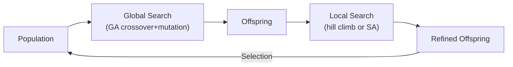
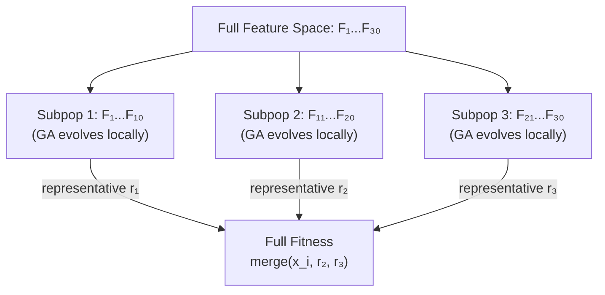
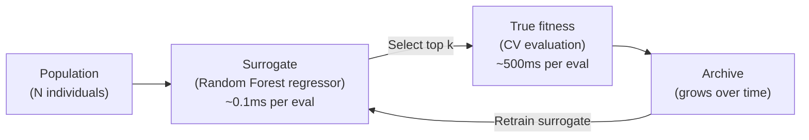
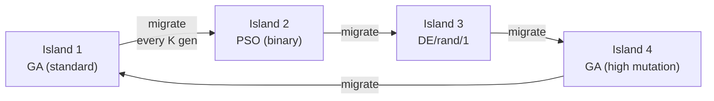
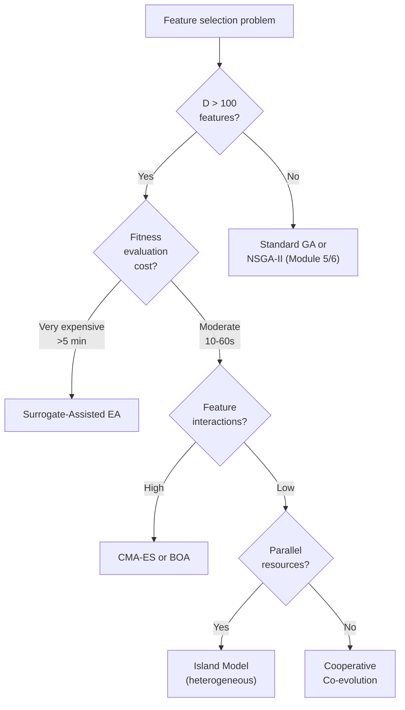

<!-- _class: lead -->

# Advanced Evolutionary Methods

## Module 06 — Evolutionary & Swarm Methods

Memetic · Co-evolution · CMA-ES · Surrogates · EDAs · Islands

<!-- Speaker notes: This deck covers the most sophisticated evolutionary strategies for feature selection. The common thread is hybridisation: combining the strengths of different algorithms. Memetic algorithms add local search. Cooperative co-evolution adds problem decomposition. Surrogate methods add computational efficiency. EDAs add probabilistic modelling. Island models add parallel diversity. Each addresses a specific weakness of standard GA. -->

---

## Beyond Standard GA: Why Go Further?

Standard GA limitations:

| Limitation | Symptom | Advanced Fix |
|---|---|---|
| Coarse global search | Misses local improvements | Memetic: add local search |
| Scales poorly to $D > 100$ | Poor diversity in $2^D$ space | Cooperative co-evolution |
| Expensive fitness function | Slow convergence | Surrogate-assisted EA |
| Binary representation loses structure | GA unaware of feature interactions | CMA-ES continuous relaxation |
| Single population converges prematurely | Stuck at local optimum | Island model migration |

<!-- Speaker notes: Each row maps a concrete problem to its solution. Introduce this as a "menu" of improvements, not a mandatory stack. In practice, choosing one or two of these enhancements is usually sufficient. The right choice depends on the specific bottleneck: if fitness evaluation is the bottleneck, surrogates. If feature count is large, co-evolution. If premature convergence, island models or SA. -->

---

## Memetic Algorithms: Hybridisation



Reference: Moscato (1989), inspired by Dawkins' "memes".

**Key insight**: global search finds promising regions; local search exploits them efficiently.

<!-- Speaker notes: Moscato coined the term "memetic algorithm" in 1989. The biological analogy: genes (global operators) set the genetic material, but individual learning (local search) refines behaviour within a lifetime. The meme is the unit of cultural learning — a solution can improve through experience before passing its structure to offspring. In practice, this means: after crossover, before putting the child in the new population, run hill climbing on it. -->

---

## Local Search Options

<div class="columns">

<div>

**Hill Climbing**
```python
for j in range(D):
    flip bit j
    if improved:
        keep flip
        break  # first improvement
```
- Fast, $O(D)$ per step
- Terminates at local optimum
- No escape from traps

</div>

<div>

**Simulated Annealing**
```python
flip random bit j
delta = new_fit - current_fit
if delta < 0 or rand() < exp(-delta/T):
    accept flip
T *= cooling_rate
```
- Slower, $O(\text{steps})$
- Probabilistic escape from traps
- Requires temperature schedule

</div>

</div>

<!-- Speaker notes: Hill climbing is deterministic and fast — it reaches a local optimum in O(D) evaluations in the best case. SA is stochastic and slower but can escape local optima by occasionally accepting worse solutions. For feature selection, hill climbing is usually sufficient because the fitness landscape (though multimodal) has many acceptable local optima. SA adds overhead that is often not justified. Use HC as the default and SA when HC shows systematic premature convergence. -->

---

## Lamarckian vs Baldwinian

<div class="columns">

<div>

**Lamarckian**
- Replace chromosome with locally improved version
- Offspring inherit improved genotype
- Faster convergence
- Lower diversity

```
Before: [0,1,0,1,1,0]
Local search improves bit 2
After:  [0,1,1,1,1,0]  ✓
```

</div>

<div>

**Baldwinian**
- Use improved fitness for selection
- Chromosome stays original
- Slower convergence
- Higher diversity

```
Chromosome: [0,1,0,1,1,0] (unchanged)
Fitness:    improved score (used for selection)
```

</div>

</div>

Practical recommendation: **Lamarckian** for speed. **Baldwinian** when premature convergence is observed.

<!-- Speaker notes: The Lamarckian/Baldwinian distinction is named after two competing theories of evolution. Lamarck believed that characteristics acquired during an organism's lifetime are passed to offspring (now known to be false biologically, but computationally useful). Baldwin showed how learned behaviours can influence evolution without Lamarckian inheritance. For feature selection, Lamarckian is almost universally preferred for its speed advantage. -->

---

## Cooperative Co-Evolution

Potter & De Jong (1994): decompose large feature spaces into sub-populations.



Each sub-population evolves independently, evaluated via **collaboration** with the best known solutions from other sub-populations.

<!-- Speaker notes: The key operation is "collaboration": when evaluating individual x from subpopulation 1, we construct the full solution by combining x with the current representative (best-known individual) from subpopulations 2 and 3. This means each subpopulation is always evaluated in the context of the best available configuration of the other groups. The interaction between groups is captured over cycles as representatives improve. -->

---

## CMA-ES: Covariance Matrix Adaptation

Hansen & Ostermeier (2001). One of the most powerful continuous black-box optimisers.

**Key idea**: adapt the search distribution $\mathcal{N}(\boldsymbol{\mu}, \sigma^2 \mathbf{C})$ to the fitness landscape.

- $\boldsymbol{\mu}$: distribution mean (current best estimate)
- $\sigma$: step size (adapts automatically)
- $\mathbf{C}$: covariance matrix (learns correlations between features)

$$\mathbf{z}_i \sim \mathcal{N}(\boldsymbol{\mu}, \sigma^2 \mathbf{C}), \quad i = 1, \ldots, \lambda$$

After sigmoid mapping: $x_j = \mathbf{1}[\sigma(z_j) > 0.5]$

**CMA-ES learns which feature combinations improve fitness** — captured in $\mathbf{C}$.

<!-- Speaker notes: CMA-ES is unusual among evolutionary algorithms in that it maintains and adapts a full covariance matrix. This means it learns the correlation structure between variables: if features 3 and 7 tend to be selected together in good solutions, the (3,7) off-diagonal element of C becomes positive. This is especially valuable for feature selection when features are correlated and selecting one makes another more or less useful. The limitation is cost: O(D²) per generation. -->

---

## CMA-ES vs DE vs GA: Structural Comparison

| | GA | DE | CMA-ES |
|---|---|---|---|
| Search distribution | Implicit | Difference vectors | Explicit multivariate Gaussian |
| Learns correlations | No | Partially (via mutation) | Yes (full $\mathbf{C}$) |
| Representation | Binary | Continuous | Continuous (→binary via sigmoid) |
| Scales to $D$ | $D < 1000$ | $D < 500$ | $D < 200$ (due to $\mathbf{C}$) |
| Implementation | DEAP | Custom | `pip install cma` |

```python
import cma
es = cma.CMAEvolutionStrategy([0.0]*D, sigma0=0.5, {'maxiter': 100})
while not es.stop():
    solutions = es.ask()
    fitnesses = [cma_fitness(z) for z in solutions]
    es.tell(solutions, fitnesses)
```

<!-- Speaker notes: CMA-ES scales to D ≈ 100-200 features before the covariance matrix update becomes expensive. For feature selection problems with fewer than 100 features (common in structured domains like finance or biomarkers), CMA-ES is an excellent choice. The `cma` Python package is a high-quality implementation by Nikolaus Hansen, the algorithm's author. It handles all the internal step-size and covariance adaptation automatically. -->

---

## Surrogate-Assisted Evolution

**Problem**: cross-validation is expensive. Each fitness evaluation trains a model $k$ times.

**Solution**: use a cheap surrogate model to pre-screen candidates.



**Typical savings**: evaluate all $N$ individuals with surrogate ($N$ × 0.1ms), true-eval only top $k$ (k × 500ms). With $k = 0.2N$: 5× fewer expensive evaluations.

<!-- Speaker notes: The economics of surrogate-assisted EA are straightforward: if CV evaluation takes 500ms and surrogate evaluation takes 0.1ms, we can afford to evaluate 5000 candidates with the surrogate for every true evaluation. The surrogate does not need to be accurate in absolute terms — it only needs to correctly rank candidates (ordinal accuracy). A Random Forest surrogate trained on as few as 50 previous true evaluations achieves surprisingly good ranking accuracy in practice. -->

---

## Surrogate-Assisted GA: Key Design Choices

<div class="columns">

<div>

**Surrogate model**
- Random Forest: robust, no tuning
- Gaussian Process: provides uncertainty
- XGBoost: accurate, fast inference

**Archive strategy**
- Keep all evaluated individuals
- Rolling window (recent only)
- Stratified by fitness value

</div>

<div>

**Evaluation policy**
- Evaluate elite fraction (top 20%) with true fitness
- Evaluate random fraction for surrogate diversity
- Uncertainty-based: evaluate most uncertain

**Update frequency**
- Retrain surrogate every $K$ generations
- Or after adding $M$ new true evaluations

</div>

</div>

<!-- Speaker notes: The Gaussian Process surrogate has a significant advantage: it provides not just a predicted fitness value but also an uncertainty estimate. This enables "expected improvement" selection: prefer candidates that either have high predicted fitness or high uncertainty (could be better than expected). This is the basis of Bayesian optimisation. For feature selection, RF surrogates are usually sufficient because the surrogate only needs to rank candidates, not predict exact fitness values. -->

---

## Estimation of Distribution Algorithms

EDAs replace genetic operators with **probabilistic model estimation and sampling**.

<div class="columns">

<div>

**PBIL**: probability vector

$$p_j^{t+1} = (1-\eta) p_j^t + \eta \cdot x_j^{\text{best}}$$

Simple, fast, assumes independence.

**UMDA**: estimate marginals

$$p_j = \frac{|\{x \in \text{top-}k : x_j=1\}|}{k}$$

</div>

<div>

**BOA**: Bayesian network

Learns dependency structure among features:

```
 F₁ → F₃ → F₅
      ↗
 F₂ →
```

Most powerful, most expensive.

</div>

</div>

<!-- Speaker notes: The EDA family is philosophically elegant: instead of mimicking evolution (crossover, mutation), we ask "what is the probability distribution over good solutions?" and sample from it. PBIL is the simplest — a single probability per feature, updated toward the best solution. UMDA is slightly more principled — it estimates probabilities from the entire top-k population rather than just the best. BOA learns the actual dependency structure between features, which is most useful when features have strong conditional dependencies. -->

---

## Island Models: Parallel Diversity



**Ring migration**: each island sends its best $m$ individuals to the next island.

**Heterogeneous islands**: different algorithms prevent convergence to the same local optimum. Diversity is structural, not just parameter-based.

<!-- Speaker notes: Island models are the most natural way to exploit parallel hardware. Each island runs independently on a separate CPU core (or machine) for K generations, then the migration step exchanges solutions. The heterogeneity is the key design insight: if all islands use the same GA with the same parameters, they will likely converge to the same solution and migration adds no diversity. Using different algorithms (GA, PSO, DE) or very different parameters (low vs. high mutation rate) creates genuine diversity that migration can exploit. -->

---

## NES and OpenAI-ES for Feature Selection

**Natural Evolution Strategies** (Wierstra et al., 2014): follow natural gradient of expected fitness.

**OpenAI-ES** gradient estimate (Salimans et al., 2017):

$$\nabla_{\boldsymbol{\mu}} \mathbb{E}[f] \approx \frac{1}{n\sigma} \sum_{i=1}^n f(\boldsymbol{\mu} + \sigma\boldsymbol{\epsilon}_i) \boldsymbol{\epsilon}_i, \quad \boldsymbol{\epsilon}_i \sim \mathcal{N}(0,I)$$

Applied to feature selection:
- Sample $n$ perturbations of the "mean feature vector" $\boldsymbol{\mu}$
- Evaluate each after sigmoid mapping to binary
- Update $\boldsymbol{\mu}$ in the gradient direction
- **Embarrassingly parallel**: all evaluations are independent

<!-- Speaker notes: OpenAI-ES was proposed for training neural networks but applies directly to feature selection. The key advantage is parallelism: all n perturbations can be evaluated simultaneously across n CPU cores. The gradient estimate improves with more samples. The sigmoid mapping to binary introduces a discretisation but the continuous gradient estimate still provides useful search direction. For D > 200 features where CMA-ES becomes expensive, OpenAI-ES is a scalable alternative. -->

---

## Choosing an Advanced Method



<!-- Speaker notes: This decision tree is a starting point, not a rigid rulebook. The most important factor is fitness evaluation cost — if each evaluation takes more than 30 seconds, surrogate methods pay off immediately. If evaluation is fast, focus on exploration quality: island models with heterogeneous algorithms for general cases, CMA-ES when feature correlations are important, co-evolution for very large feature spaces. In practice, benchmark two or three methods on your problem rather than selecting purely theoretically. -->

---

## Summary

| Method | Key Idea | Best For |
|---|---|---|
| **Memetic** | GA + local search | Better solutions, same budget |
| **Cooperative Co-evolution** | Decompose feature space | $D > 100$, weak inter-group deps |
| **CMA-ES** | Adapt covariance to landscape | Correlated features, $D < 200$ |
| **OpenAI-ES** | Natural gradient, parallel | Large $D$, parallel hardware |
| **Surrogate-Assisted** | Cheap model for pre-screening | Expensive evaluation |
| **EDA (PBIL/BOA)** | Probabilistic model building | Captures feature dependencies |
| **Island Model** | Parallel heterogeneous pops | Premature convergence problems |

<!-- Speaker notes: Close by emphasising that these methods are not mutually exclusive. A surrogate-assisted memetic island model is a legitimate (if complex) combination. In practice, start with the simplest enhancement that addresses your bottleneck, validate that it helps, then consider combining methods. Always compare against the standard GA baseline to confirm that the added complexity is justified by measurable improvement. -->

---

<!-- _class: lead -->

## Notebook: `03_de_and_memetic.ipynb`

DE/rand/1 + local search = memetic algorithm
Compare: pure DE · memetic DE · GA · PSO
Benchmark on shared dataset · Wall-clock comparison

<!-- Speaker notes: The notebook provides running code for all four algorithms on the same dataset, making it easy to compare results directly. The wall-clock comparison is important: a 5% accuracy improvement from memetic DE is less valuable if it takes 10× longer than standard GA. The notebook measures and plots both solution quality and runtime, helping learners make informed trade-offs. -->
