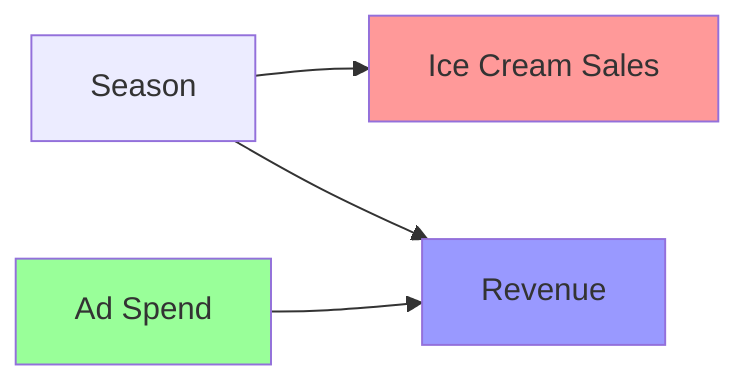
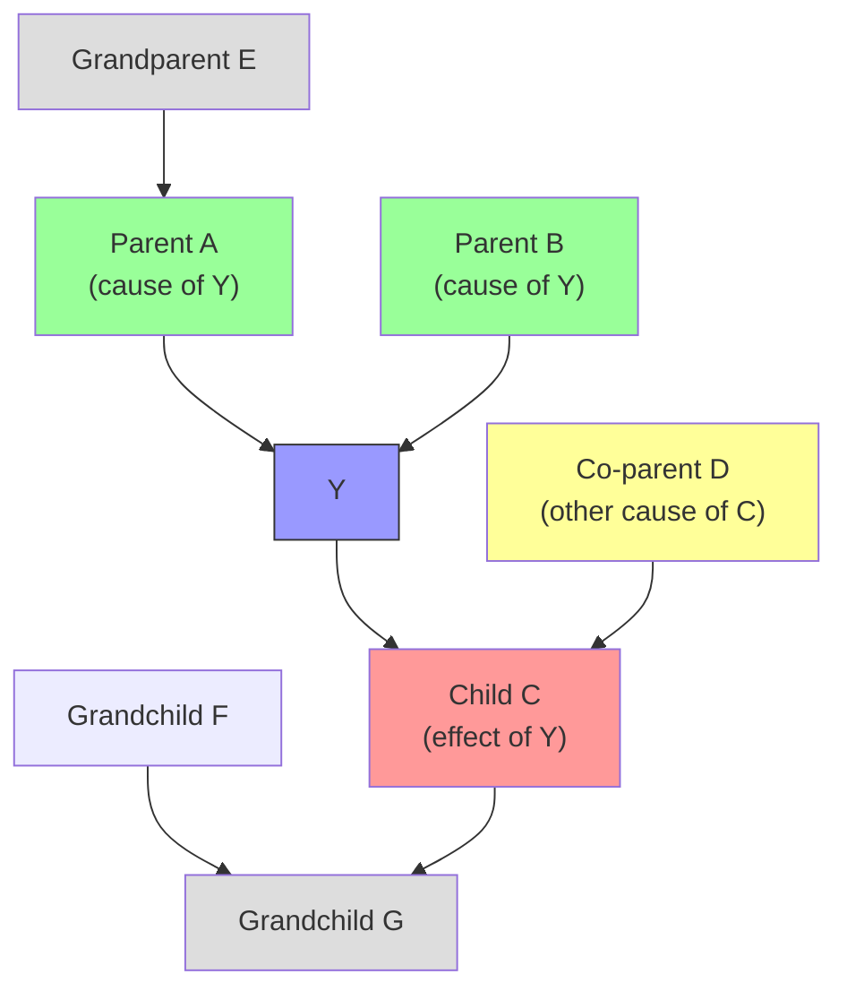
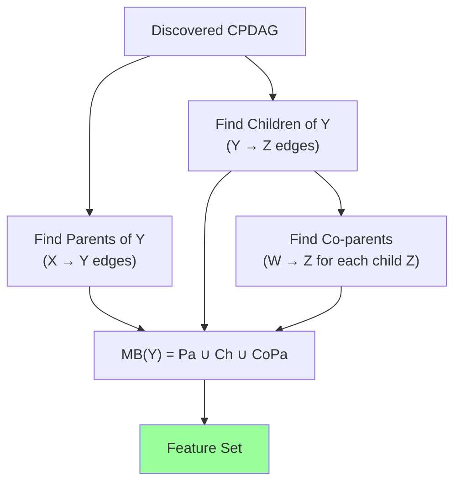
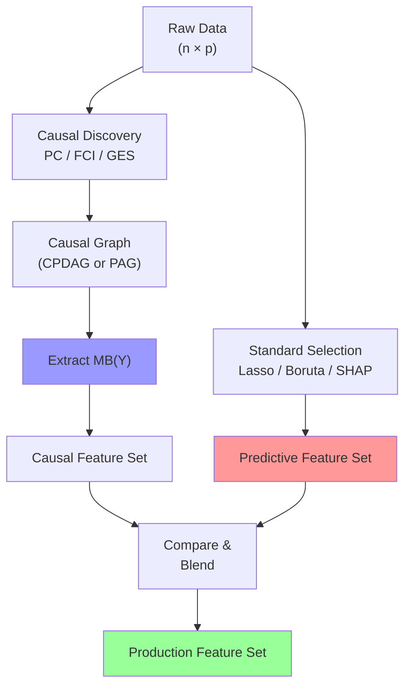

<!-- _class: lead -->
<!-- Speaker notes: Welcome to Module 9 on causal feature selection. This is the conceptually deepest module in the course. The key shift: we move from asking "which features correlate with the target?" to "which features causally matter?" That shift has profound practical consequences for out-of-distribution robustness. -->

# Causal Graphs and the Markov Blanket

## Module 09 — Causal Feature Selection

From correlation to causation — the optimal feature set under the true data-generating process

---

<!-- Speaker notes: Start by motivating the problem. Two features correlate perfectly with sales in training data: advertising spend (a real cause) and ice cream consumption (a seasonal correlate). Standard feature selection keeps both. Causal feature selection keeps only advertising spend. When the season changes, ice cream fails but advertising spend remains predictive. This is the core difference. -->

## Why Causality Changes Feature Selection

**Standard selection:** Which features correlate with $Y$?

**Causal selection:** Which features *causally determine* $Y$?



- Standard selection keeps both `Ice Cream` and `Ad Spend`
- Causal selection keeps only `Ad Spend`
- When season changes: `Ice Cream` fails, `Ad Spend` stays predictive

> The difference matters when the environment changes.

<!-- Speaker notes: Draw this on a whiteboard if possible. The season acts as a confounder, creating spurious correlation between ice cream sales and revenue. A causal model recognises this and excludes ice cream from the feature set. -->

---

<!-- Speaker notes: Introduce structural causal models formally but briefly. The key elements: endogenous variables (what we observe), exogenous variables (external noise), and structural equations (the causal mechanism). Each variable is a deterministic function of its causes plus noise. This is more expressive than a probabilistic graphical model because it supports the do-operator. -->

## Structural Causal Models (SCMs)

An SCM $\mathcal{M} = (\mathbf{U}, \mathbf{V}, \mathcal{F}, P_\mathbf{U})$:

- $\mathbf{U}$: exogenous (background) noise variables
- $\mathbf{V}$: endogenous (observed) variables
- $\mathcal{F}$: structural equations $V_i := f_{V_i}(\text{Pa}(V_i), U_{V_i})$

Each variable is a **deterministic function of its causes** plus independent noise.

$$\text{Price} := 2 \cdot \text{Cost} + 0.5 \cdot \text{Demand} + U_{\text{Price}}$$

The DAG encodes: draw $V_j \to V_i$ whenever $V_j \in \text{Pa}(V_i)$.

<!-- Speaker notes: The structural equation is more than a regression equation — it defines what would happen under intervention. If we force Cost to a new value, Price changes accordingly. If we force Price directly (intervention), the equation for Price is removed and replaced by a constant. -->

---

<!-- Speaker notes: The do-operator is Pearl's key contribution. P(Y|X=x) is observational — we're selecting a sub-population where X happens to be x. P(Y|do(X=x)) is interventional — we're forcing X to be x by surgery on the graph, cutting all incoming arrows to X. These differ when confounders exist. Feature selection based only on observational distributions will select confounders. -->

## Observation vs. Intervention: The Do-Operator

<div class="columns">
<div>

**Observational:** $P(Y \mid X = x)$

Select cases where $X = x$ naturally occurred.

Confounders inflate/deflate $P(Y \mid X)$.

**Why problematic:** selects spurious correlates.

</div>
<div>

**Interventional:** $P(Y \mid do(X = x))$

Force $X = x$, cutting all incoming arrows to $X$.

Confounders become irrelevant (their path severed).

**Why useful:** identifies real causes.

</div>
</div>

$$P(Y \mid X = x) \neq P(Y \mid do(X = x)) \text{ when confounders exist}$$

> Causal feature selection targets variables with non-trivial $P(Y \mid do(X))$.

<!-- Speaker notes: A classic example: hospitals. Sicker patients go to better hospitals. Observationally, hospital quality correlates negatively with patient outcomes because of this selection bias. Interventionally (randomly assigning hospitals), the correlation reverses. The confounder (disease severity) was the culprit. -->

---

<!-- Speaker notes: The Markov blanket is the central object for causal feature selection. It consists of exactly three groups: parents (causes of Y), children (effects of Y that carry information back), and co-parents (other causes of Y's children). This is provably the minimal sufficient set. No feature outside the Markov blanket adds any predictive information once you know MB(Y). -->

## The Causal Markov Blanket



$\text{MB}(Y) = \{A, B\} \cup \{C\} \cup \{D\} = $ **minimal sufficient set**

$Y \perp \!\!\! \perp \mathbf{V} \setminus (\{Y\} \cup \text{MB}(Y)) \mid \text{MB}(Y)$

<!-- Speaker notes: Walk through each group. Parents are direct causes - obvious why they matter. Children are direct effects - they carry information about Y's state (if C is observed and D is known, we can infer something about Y). Co-parents are less intuitive: if we observe C and want to explain it, knowing D tells us how much of C is explained by D vs Y, which gives us information about Y. -->

---

<!-- Speaker notes: This theorem is the theoretical heart of causal feature selection. The Markov blanket is provably optimal under the causal model. This is a stronger result than standard feature selection optimality: we're not optimising a specific model class, we're characterising the information-theoretically sufficient set under the true DGP. -->

## Why MB(Y) is the Optimal Feature Set

**Theorem** (Pearl, 2009). Under the causal Markov condition and faithfulness:

$$Y \perp \!\!\! \perp \mathbf{V} \setminus (\{Y\} \cup \text{MB}(Y)) \mid \text{MB}(Y)$$

| Feature type | In $\text{MB}(Y)$? | Why |
|---|---|---|
| Direct cause of $Y$ | Yes | Structurally determines $Y$ |
| Direct effect of $Y$ | Yes | Contains information about $Y$'s state |
| Other cause of $Y$'s child | Yes | Needed to "explain away" child |
| Cause of a cause of $Y$ | **No** | Screened off by parent |
| Spurious correlate | **No** | No causal path to $Y$ |

> **Consequence:** Adding any feature outside $\text{MB}(Y)$ provides zero additional predictive information about $Y$.

<!-- Speaker notes: The screening-off property is key. Once you know a variable's parents, its grandparents add no further information. This is d-separation in action. Causal feature selection exploits this to discard all features beyond the Markov blanket. -->

---

<!-- Speaker notes: Now introduce the PC algorithm, the workhorse of constraint-based causal discovery. Phase 1 discovers the skeleton (which pairs of variables are connected). Phase 2 orients the edges. The key insight: you can discover the skeleton using only conditional independence tests, without ever specifying a parametric model. -->

## PC Algorithm: Constraint-Based Discovery

**Inputs:** Data matrix $\mathbf{X} \in \mathbb{R}^{n \times p}$, significance level $\alpha$

**Phase 1 — Skeleton Discovery:**

```
Start: complete undirected graph G
For k = 0, 1, 2, ...:
  For each adjacent pair (X, Y):
    For each S ⊆ Adj(X)\{Y} with |S| = k:
      If X ⊥ Y | S:
        Remove edge X-Y
        Record Sep(X,Y) = S
        Break
  Stop when |Adj(X)| - 1 < k for all edges
```

**Phase 2 — V-Structure Orientation:**

For each unshielded triple $X - Z - Y$ (no $X-Y$ edge):
- If $Z \notin \text{Sep}(X,Y)$: orient $X \to Z \leftarrow Y$ (collider)

<!-- Speaker notes: The k=0 pass tests marginal independence (no conditioning). k=1 conditions on one variable at a time. As k grows, the sets get larger and the tests have lower power. In sparse graphs, k rarely exceeds 3 or 4. The stable variant of PC processes all pairs at each k before incrementing k, ensuring consistent results. -->

---

<!-- Speaker notes: The Fisher z-transform CI test is the standard for continuous Gaussian data. Show the formula clearly. The z-statistic measures how far the estimated partial correlation is from zero, normalised by the expected standard error under independence. For discrete data, G-squared tests are used instead. For nonlinear data, kernel methods (HSIC, KCI) are needed. -->

## Conditional Independence Tests in PC

**For Gaussian data:** Fisher-z transform on partial correlation

$$z_{XY \cdot S} = \frac{1}{2} \ln \frac{1 + \hat{\rho}_{XY \cdot S}}{1 - \hat{\rho}_{XY \cdot S}}$$

Under $H_0$: $X \perp \!\!\! \perp Y \mid S$,

$$z_{XY \cdot S} \sim \mathcal{N}\!\left(0, \frac{1}{n - |S| - 3}\right)$$

Reject $H_0$ if $|z_{XY \cdot S}| > z_{\alpha/2}$.

| Data type | CI test |
|---|---|
| Continuous Gaussian | Fisher-z (partial correlation) |
| Discrete | $G^2$ test (chi-squared) |
| Nonlinear continuous | Kernel CI test (HSIC, KCI) |
| Mixed | Conditional distance correlation |

<!-- Speaker notes: Point out the denominator n - |S| - 3. As the conditioning set S grows larger, the effective sample size decreases. This means high-order CI tests have low power with small n. With n=500 and |S|=5, the effective sample size is only 492. With n=100 and |S|=10, it's only 87. This is why PC struggles with small samples and dense graphs. -->

---

<!-- Speaker notes: FCI is the PC algorithm extended to handle hidden confounders. The key innovation is the PAG representation with three edge marks: arrowhead (not an ancestor), tail (is an ancestor), and circle (unknown). The bidirected edge X<->Y means there is a hidden common cause between X and Y. This is crucial for financial data where unmeasured market forces confound everything. -->

## FCI: When Latent Confounders Exist

PC assumes **causal sufficiency** (no hidden confounders). FCI relaxes this.

**FCI output:** Partial Ancestral Graph (PAG) with richer edge marks:

```mermaid
graph LR
    A["X"] -->|"directed cause"| B["Y"]
    C["X"] <-->|"hidden confounder"| D["Y"]
    E["X"] o-->|"unknown"| F["Y"]
    G["X"] o-o|"undetermined"| H["Y"]
```

| Edge | Meaning |
|---|---|
| $X \to Y$ | $X$ causes $Y$, no hidden common cause |
| $X \leftrightarrow Y$ | Hidden common cause of $X$ and $Y$ |
| $X \circ\!\to Y$ | $X$ may cause $Y$, or may share hidden cause |

**For feature selection:** Include both $\to$ and $\leftrightarrow$ edges (for prediction, not intervention).

<!-- Speaker notes: The distinction between X->Y and X<->Y matters differently for prediction vs intervention. For prediction, both indicate that X contains information about Y. For intervention (do(X)), only X->Y implies X can be used to change Y. Since feature selection is primarily for prediction, we include both. -->

---

<!-- Speaker notes: GES takes a score-based approach rather than constraint-based. Instead of testing independence, it optimises a score (BIC for Gaussian) over the space of DAGs. The greedy search over CPDAGs (equivalence classes) is provably consistent. GES is generally more sample-efficient than PC because it uses all data together rather than pairwise CI tests. -->

## GES: Score-Based Causal Discovery

**Greedy Equivalence Search** optimises the BIC score over CPDAGs.

$$\text{BIC}(\mathcal{G}, \mathcal{D}) = -2 \ln \hat{L}(\mathcal{G}, \mathcal{D}) + k \ln n$$

**Three phases:**


**GES vs PC:**

| | PC | GES |
|---|---|---|
| Approach | CI tests | Score optimisation |
| Sample efficiency | Lower | Higher |
| Latent confounders | No (use FCI) | No (use RFCI) |
| Output | CPDAG | CPDAG |

<!-- Speaker notes: GES starts from an empty graph (no edges) and adds edges greedily. Unlike PC which processes pairs independently, GES evaluates the full joint score after each addition. The backward phase then removes any edge that was spuriously added in the forward phase. Consistency guarantees: in the large-sample limit, GES recovers the true CPDAG under faithfulness and causal sufficiency. -->

---

<!-- Speaker notes: Now we get to the practical payoff: reading features off the discovered graph. Walk through the three-step process. Note that in a CPDAG some edges remain undirected — treat these conservatively by including the adjacent node. The union of parents, children, and co-parents gives the Markov blanket, which is the feature set we use. -->

## From Graph to Feature Set

Given CPDAG with target $Y$:



**Undirected edges** ($X - Y$, ambiguous orientation): include $X$ conservatively.

**Practical rule:** When in doubt, include rather than exclude — false negatives (missed causal features) are more costly than false positives in feature selection.

<!-- Speaker notes: The conservative inclusion rule is important. In a CPDAG, some edges cannot be oriented without additional assumptions. It is safer to include a feature that might be causally relevant than to exclude one that is. The performance cost of one extra feature is small; the cost of missing a true cause can be large. -->

---

<!-- Speaker notes: Show the complete code workflow. Use causal-learn's PC implementation. The key parameters: alpha controls the CI test threshold (lower = more conservative = fewer edges removed = denser graph). stable=True gives consistent results regardless of variable ordering. The adjacency matrix extraction and Markov blanket computation are standard. -->

## PC Algorithm: Complete Code

```python
from causallearn.search.ConstraintBased.PC import pc
from causallearn.utils.cit import fisherz
import numpy as np

# Run PC algorithm
cg = pc(
    data=X_array,          # (n_samples, n_features)
    alpha=0.05,            # CI test significance level
    indep_test=fisherz,    # Fisher-z for Gaussian data
    stable=True,           # stable ordering
    uc_rule=0,             # v-structure rule
)

# Extract adjacency matrix
# cg.G.graph[i,j] == -1 and [j,i] == 1 means i -> j
adj = cg.G.graph  # shape: (n_features, n_features)

# Find Markov blanket of target variable (index=target_idx)
target_idx = feature_names.index('Y')
parents = [i for i in range(p)
           if adj[i, target_idx] == -1 and adj[target_idx, i] == 1]
children = [i for i in range(p)
            if adj[target_idx, i] == -1 and adj[i, target_idx] == 1]
co_parents = [j for c in children for j in range(p)
              if adj[j, c] == -1 and adj[c, j] == 1 and j != target_idx]
mb = list(set(parents + children + co_parents))
```

<!-- Speaker notes: The adjacency matrix encoding in causal-learn uses -1/1 pairs to encode directions. adj[i,j]==-1 and adj[j,i]==1 means i->j (the arrow points from i to j). adj[i,j]==1 and adj[j,i]==1 means undirected edge. adj[i,j]==0 and adj[j,i]==0 means no edge. This encoding is not immediately intuitive but is consistent across the library. -->

---

<!-- Speaker notes: This slide compares the three algorithms across the key practical dimensions. PC is easiest to apply but requires causal sufficiency. FCI handles latent confounders but produces less decisive output. GES is most sample-efficient for Gaussian data. In practice for financial/economic data with many unmeasured variables, FCI is most appropriate. For well-controlled datasets, PC or GES are preferred. -->

## Choosing the Right Algorithm

| Criterion | PC | FCI | GES |
|---|---|---|---|
| Latent confounders | No | **Yes** | No |
| Data type | Any (CI test) | Any | Gaussian/parametric |
| Sample size | Large (>500) | Large | Medium (>200) |
| Speed | Fast | Slow | Medium |
| Output clarity | CPDAG | PAG (ambiguous) | CPDAG |
| Best for | Clean experiments | Observational data | Score optimisation |

**Recommendation:**
- Financial/economic observational data → **FCI**
- Controlled experiments, causal sufficiency → **PC or GES**
- Small samples → **GES** (more sample-efficient)

<!-- Speaker notes: In most real-world data science applications, we cannot guarantee causal sufficiency — there are always unmeasured variables. FCI is therefore the theoretically correct choice for observational data. However, FCI's PAG output is harder to interpret and extract features from. A pragmatic approach: run PC as a first pass, then FCI to check for spurious edges due to latents. -->

---

<!-- Speaker notes: Discuss the key assumptions that make causal discovery work. Faithfulness is the most important: it says the observed independencies match the graph's d-separation statements. If two paths cancel each other out exactly (measure-zero event in theory but possible in practice), faithfulness is violated. Acyclicity rules out feedback loops — a strong assumption for time series. -->

## Key Assumptions and Their Violations

**Faithfulness:** observed independencies match graph d-separations.

*Violation:* cancelling direct and indirect paths (rare but possible in practice).

**Causal Markov condition:** each variable independent of non-descendants given parents.

*Violation:* measurement error correlated across variables.

**Acyclicity:** no feedback loops in the DAG.

*Violation:* time series with feedback (use time-lagged DAGs instead).

**Causal sufficiency (PC/GES only):** no latent common causes.

*Violation:* almost always present in real data — use FCI.

> When assumptions are doubtful, use causal features as one input to an ensemble alongside standard feature selection methods.

<!-- Speaker notes: Be honest about violations. Faithfulness is the trickiest — it's a generic condition (true almost everywhere) but can fail in structured problems like signal processing where exact cancellations occur by design. Acyclicity fails for time series: use PCMCI (Runge et al., 2019) which extends PC to time-lagged causal graphs. For production use, always cross-validate causal feature sets against standard baselines. -->

---

<!-- Speaker notes: Summarize the workflow visually. Raw data goes through a causal discovery algorithm (PC/FCI/GES) to produce a causal graph. We read off the Markov blanket. We compare it with standard feature selection outputs. The causal MB gives us theoretical guarantees under the true DGP; standard methods give empirical performance. In practice, the intersection of both sets is often the most reliable production feature set. -->

## Complete Workflow



<!-- Speaker notes: The blending step at the end is the practical recommendation. Causal features give robustness; predictive features give peak in-distribution accuracy. The intersection gives a set that is both robust and accurate. Features in causal set but not predictive set: add cautiously. Features in predictive set but not causal set: monitor for distribution shift. -->

---

<!-- Speaker notes: Final slide with key takeaways and connections to the next guides. Causal graphs provide the theoretical foundation. ICP (Guide 02) gives a practical alternative to graph discovery using environmental invariance. Causal ML (Guide 03) shows how these ideas integrate with modern ML tools like causal forests and double ML. -->

## Key Takeaways

1. **SCMs** define the data-generating process via structural equations + DAG
2. **Markov blanket** = parents + children + co-parents = minimal sufficient feature set
3. **PC algorithm** recovers the skeleton via conditional independence tests
4. **FCI** handles latent confounders with PAG representation
5. **GES** provides score-based alternative — more sample-efficient for Gaussian data
6. **Reading off MB(Y)** from the CPDAG gives the causal feature set

**Next:** Guide 02 — Invariant Causal Prediction: discover causal features without recovering the full graph.

**Reference:** Pearl (2009), Spirtes et al. (2000), Chickering (2002)

<!-- Speaker notes: Causal feature selection is a developing field. The algorithms work well on benchmark datasets but can struggle with p>50 variables in practice (CI test power degrades). Always combine with domain knowledge and standard selection baselines. The theoretical framework is invaluable even if you only use it to think about which features are truly causal vs spurious. -->
