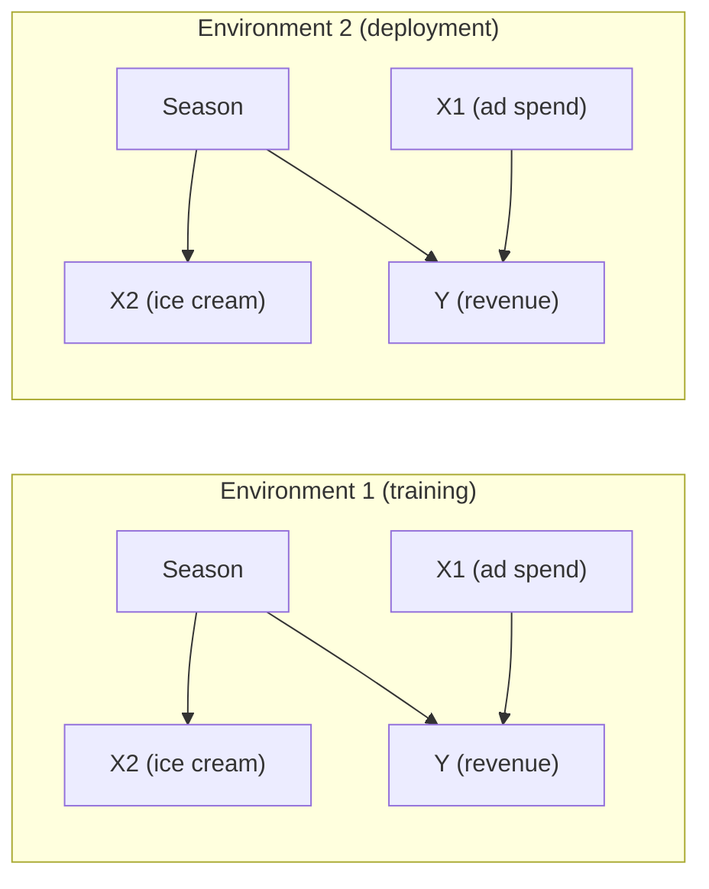
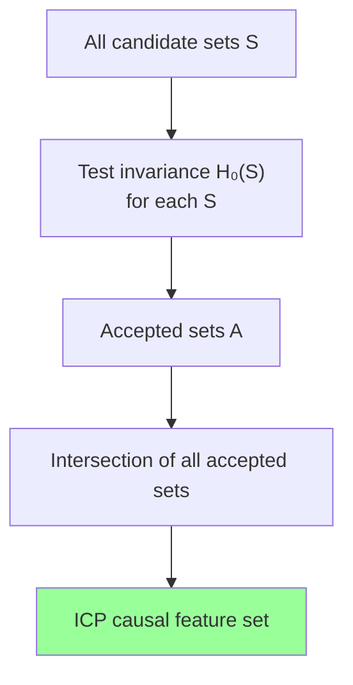
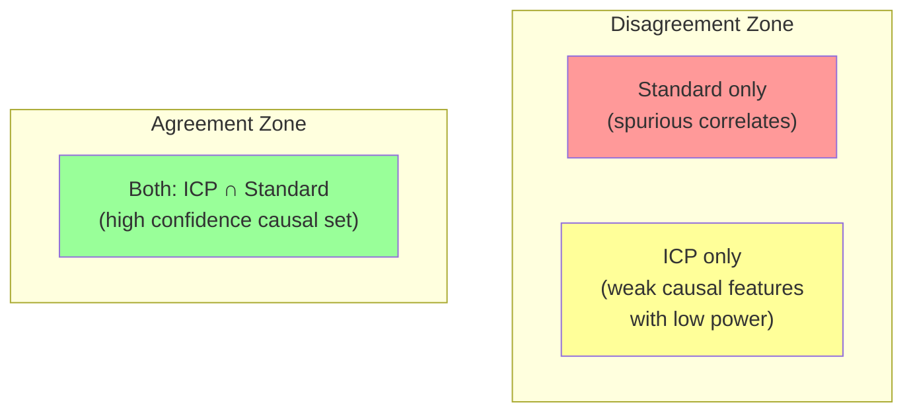

<!-- _class: lead -->
<!-- Speaker notes: ICP is the most practically accessible causal feature selection method. Unlike PC/FCI/GES which require recovering the full causal graph, ICP identifies causal features directly from their invariance property across environments. The reference is Peters, Bühlmann, Meinshausen (2016), JRSS-B. -->

# Invariant Causal Prediction

## Module 09 — Causal Feature Selection

Identifying causal features through invariance across environments — Peters, Bühlmann & Meinshausen (2016)

---

<!-- Speaker notes: The core idea in one picture. On the left: training in environment 1, a model selects both X1 (a true cause) and X2 (a seasonal correlate). On the right: when deployed in environment 2 (different season), X2's correlation with Y vanishes. X1 remains predictive. ICP would have excluded X2. This is the operational difference between causal and predictive selection. -->

## The Core Problem: Features That Fail on Deployment



- In Env 1: $\text{Corr}(X2, Y) \approx 0.7$ — Lasso keeps X2
- In Env 2: $\text{Corr}(X2, Y) \approx -0.1$ — X2 fails completely
- ICP identifies X2 as non-invariant and excludes it

<!-- Speaker notes: Walk through the graph carefully. Season causes both ice cream sales and revenue (via summer demand). This is a fork (confounder). The correlation between ice cream and revenue exists only because of the season. When season is different (Env 2), the correlation disappears. A model trained with X2 in Env 1 will fail badly in Env 2. -->

---

<!-- Speaker notes: Formally state the invariance property of causal features. Under the true SCM, regressing Y on its causal parents Pa(Y) gives the same coefficients and same residual distribution in every environment. This is a consequence of the structural equation: Y = f(Pa(Y), noise) — the function f doesn't change across environments, only the distribution of Pa(Y) may change. -->

## The Invariance Principle

**Key theorem:** Under the linear SCM $Y := \mathbf{X}_{S^*} \boldsymbol{\beta}^* + \varepsilon$:

$$P^e(Y \mid X_{S^*}) = P(Y \mid X_{S^*}) \quad \forall e \in \mathcal{E}$$

The conditional distribution of $Y$ given its causal parents is the **same in every environment**.

**What changes across environments:** the marginal distribution of $X_{S^*}$

**What stays constant:** the *coefficients* $\boldsymbol{\beta}^*$ and *residual distribution* $P(\varepsilon)$

> Non-causal features fail this invariance test because their correlation with $Y$ is environment-specific.

<!-- Speaker notes: This is the fundamental theorem. Emphasise: the marginal distribution of features can change (and often does — that's how we define environments). What cannot change is the conditional distribution of Y given its causal parents. The structural equation Y = f(Pa(Y), noise) is fixed — it's the mechanism, not the data. -->

---

<!-- Speaker notes: Walk through the ICP algorithm step by step. It is a set-based procedure: test each candidate subset for invariance, collect all invariant sets, take their intersection. The intersection is guaranteed (under faithfulness) to be a subset of the true causal parents. This gives a conservative but reliable causal feature set. -->

## The ICP Algorithm

**For each candidate set $S \subseteq \{1, \ldots, p\}$:**

Test $H_0(S)$: residuals from $Y \sim X_S$ are identically distributed across all environments.

**Collect accepted sets:**
$$\mathcal{A} = \{S : H_0(S) \text{ not rejected at level } \alpha\}$$

**ICP estimate:**
$$\hat{S}^{\text{ICP}} = \bigcap_{S \in \mathcal{A}} S$$



<!-- Speaker notes: The intersection operation is the key. If S* (true causal set) is invariant, then S* ∈ A. Every other accepted set S must contain S* (otherwise it would fail invariance — this is the faithfulness assumption). So the intersection of all accepted sets = S* ∩ (something) ⊇ S*, meaning the intersection ⊆ S*. The ICP set is a subset of the true causal set, possibly smaller due to finite sample power. -->

---

<!-- Speaker notes: Explain why the intersection works. S* always passes the invariance test (it's the true causal set). Any set containing a spurious feature eventually fails the test (in some environment). The intersection therefore strips out all non-causal features, converging to a subset of S*. With many diverse environments, the ICP set converges to exactly S*. -->

## Why the Intersection Works

**Fact 1:** True causal set $S^*$ satisfies invariance: $S^* \in \mathcal{A}$ (w.h.p.)

**Fact 2:** Any accepted set $S$ that contains a non-causal feature will fail invariance in some environment (faithfulness).

**Consequence:**

$$\hat{S}^{\text{ICP}} = \bigcap_{S \in \mathcal{A}} S \subseteq S^*$$

ICP is **conservative:** may miss some causal features (false negatives) but has provably low false positive rate.

| Property | ICP | Standard Selection |
|---|---|---|
| Controls false positives | **Yes** (provably) | No |
| Controls false negatives | No | Better power |
| Requires environments | **Yes** | No |
| Needs full graph | No | No |

<!-- Speaker notes: The trade-off is important. ICP has provable false positive control at level alpha. Standard methods have no such guarantee — they optimise predictive accuracy, not causal correctness. ICP may miss true causal features (especially weak ones), but what it selects is reliably causal. For high-stakes decisions where spurious features are dangerous, ICP's conservative guarantee is valuable. -->

---

<!-- Speaker notes: The invariance test is the engine of ICP. Show the two-stage approach. Stage 1 tests whether the regression coefficients are the same across environments (F-test or Wald test). Stage 2 tests whether residual variances are equal (Levene's or Bartlett's test). Reject the invariance hypothesis if either test rejects. This makes the test conservative. -->

## The Invariance Test: Two Stages

**Stage 1: Coefficient stability (F-test)**

$$F = \frac{(\text{RSS}_\text{pooled} - \sum_e \text{RSS}_e) / (|\boldsymbol{\beta}| \cdot (E-1))}{\sum_e \text{RSS}_e / (n - E \cdot (|\boldsymbol{\beta}|+1))} \sim F(p(E-1),\, n-E(p+1))$$

Reject if coefficients differ significantly across environments.

**Stage 2: Residual variance equality (Levene's test)**

$$H_0: \sigma^2_{e_1} = \sigma^2_{e_2} = \ldots = \sigma^2_{E}$$

**Combined test:** Reject $H_0(S)$ if either stage rejects (Bonferroni correction).

<!-- Speaker notes: The F-test in Stage 1 compares the pooled regression (same coefficients everywhere) against separate regressions (different coefficients per environment). A large F-statistic means coefficients differ significantly — the invariance assumption fails. Levene's test in Stage 2 checks that the residual spread is the same across environments, even if the coefficients happen to agree. Both are needed for full invariance. -->

---

<!-- Speaker notes: Show the key code for the invariance test. Keep it readable — this is the core computation. The function fits separate regressions per environment, computes pooled vs separate RSS, applies the F-test, and runs Levene's test. Returns a boolean (invariant or not) and a p-value. Students should be able to implement this from scratch. -->

## Invariance Test: Core Implementation

```python
from scipy import stats
from sklearn.linear_model import LinearRegression
import numpy as np

def test_invariance(y, X_S, env_labels, alpha=0.05):
    """Test H0(S): residuals invariant across environments."""
    envs = np.unique(env_labels)
    residuals_per_env, n_per_env = [], []

    # Fit separate model per environment
    for e in envs:
        mask = env_labels == e
        model = LinearRegression().fit(X_S[mask], y[mask])
        residuals_per_env.append(y[mask] - model.predict(X_S[mask]))
        n_per_env.append(mask.sum())

    # Stage 1: F-test for coefficient equality (pooled vs separate)
    pooled = LinearRegression().fit(X_S, y)
    rss_pooled = np.sum((y - pooled.predict(X_S)) ** 2)
    rss_sep = sum(np.sum(r**2) for r in residuals_per_env)
    p_s, n, E = X_S.shape[1], len(y), len(envs)
    df1, df2 = p_s*(E-1), n - E*(p_s+1)
    f_stat = ((rss_pooled - rss_sep)/df1) / (rss_sep/df2) if df2>0 else 0
    p_coef = 1 - stats.f.cdf(f_stat, df1, df2)

    # Stage 2: Levene's test for variance equality
    p_var = stats.levene(*residuals_per_env).pvalue

    p_combined = min(min(p_coef, p_var) * 2, 1.0)  # Bonferroni
    return p_combined > alpha, p_combined
```

<!-- Speaker notes: Walk through the code. The key loop fits a separate LinearRegression per environment and stores residuals. Then: Stage 1 computes the F-statistic comparing pooled RSS (same coefficients) to sum of per-environment RSS (different coefficients). Stage 2 runs Levene's test on the per-environment residuals. The final p-value is Bonferroni-corrected since we're doing two tests. -->

---

<!-- Speaker notes: Defining environments is the most important and most domain-specific step in ICP. The environments must represent genuine distributional shifts where the non-causal correlations change. For financial data, time periods (pre/post regime change, different economic cycles) are natural. For cross-sectional data, different markets or countries work well. Arbitrary random splits give no power. -->

## Defining Environments: The Critical Choice

**Valid environments:** genuine interventions or distributional shifts

| Context | Environment Definition |
|---|---|
| Financial time series | Q1/Q2/Q3/Q4, pre/post crisis, bull/bear regimes |
| Cross-sectional | Country, industry sector, firm size quartile |
| Experimental | Control group, treatment group A, treatment group B |
| Natural experiment | Before/after policy change |
| Multi-source data | Data provider A, provider B, provider C |

**Invalid environments:**
- Random splits of iid data (same distribution — all features pass)
- High-$Y$ vs low-$Y$ splits (selection bias invalidates invariance tests)

```python
# Time-period environments: split into 4 equal windows
n = len(y)
env_labels = np.repeat(np.arange(4), n // 4)[:n]
```

<!-- Speaker notes: Emphasise that environment definition requires domain knowledge. For S&P 500 daily returns, splitting by calendar year gives 4 environments from 2020-2023. Each year had a distinct macro regime: pandemic crash (2020), recovery (2021), rate hike cycle (2022), AI-driven rally (2023). Non-causal features like RSI momentum would have very different correlations with returns in each environment. Genuinely causal micro-structure features (bid-ask spread, order flow) would be more stable. -->

---

<!-- Speaker notes: ICP and standard selection are complementary. When they agree, you have high confidence in the feature set. When they disagree, ICP's exclusions highlight potentially spurious correlates worth investigating. The consensus set (in both ICP and standard) is the most reliable for production use. Features in standard but not ICP should be monitored for degradation under distribution shift. -->

## ICP vs Standard Selection: When They Diverge



**Standard selects, ICP rejects:** Feature correlates with $Y$ only in some environments — confounded.

**ICP selects, standard rejects:** Feature has weak causal effect — Lasso over-penalises, ICP still detects invariance.

**Both select:** Strong causal signal, invariant across environments — most reliable.

<!-- Speaker notes: The Venn diagram logic: (1) Standard selects but ICP rejects = likely spurious. The feature's correlation with Y is environment-specific. Use with caution; monitor for drift. (2) ICP selects but standard rejects = weak causal effect. The feature may not improve cross-validated performance much but is causally relevant. Keep for robustness even if accuracy gain is small. (3) Both select = most reliable. Both the statistical signal and the causal invariance confirm the feature. -->

---

<!-- Speaker notes: Address the limitations honestly. ICP requires multiple genuine environments — if your data is all iid, ICP has no power. The linear formulation misses nonlinear relationships. With 2^p subsets to test, it's intractable for p>20. The power issue means true causal features may be missed. These are engineering problems, not fatal flaws. Show the greedy approximation as the practical solution. -->

## Practical Limitations and Mitigations

<div class="columns">
<div>

**Limitation 1: Exponential subsets**
- Exhaustive ICP: $O(2^p)$ tests
- Intractable for $p > 20$

**Mitigation:** Greedy forward ICP or Lasso pre-screening

**Limitation 2: Linear-only**
- Assumes $Y = X_S \beta + \varepsilon$
- Fails for nonlinear mechanisms

**Mitigation:** Nonlinear ICP (kernel CI tests) or IRM

</div>
<div>

**Limitation 3: Few environments = low power**
- 2 environments: detects only large violations
- 5+ environments: good power

**Mitigation:** Actively design environments; use domain knowledge

**Limitation 4: Environments must be genuine**
- Random splits have zero power
- Outcome-defined splits are invalid

**Mitigation:** Domain expertise required

</div>
</div>

<!-- Speaker notes: For the exponential subset problem: greedy ICP runs in O(p^2) time and recovers most of the ICP set in practice. The idea is to do forward selection, at each step adding the feature that (1) maintains invariance and (2) most reduces residual RSS. Lasso pre-screening to p'=20 features before applying exhaustive ICP is another practical approach. -->

---

<!-- Speaker notes: Show the nonlinear extension — Invariant Risk Minimisation by Arjovsky et al. (2019). IRM finds a feature representation Phi such that the optimal predictor on top of Phi is the same across environments. The gradient penalty enforces this. IRM is harder to optimise than linear ICP but handles nonlinear relationships. The penalty lambda controls the trade-off between predictive accuracy and invariance. -->

## Nonlinear Extension: Invariant Risk Minimisation (IRM)

**Arjovsky et al. (2019):** Learn representation $\Phi$ invariant across environments.

$$\min_{\Phi, w} \sum_e \mathcal{R}^e(w \circ \Phi) + \lambda \underbrace{\left\| \nabla_w \mathcal{R}^e(w \circ \Phi) \big|_{w=1} \right\|^2}_{\text{invariance penalty}}$$

The penalty forces the optimal classifier $w$ on top of $\Phi$ to be $w=1$ in every environment — the representation does all the work.

| | Linear ICP | IRM |
|---|---|---|
| Relationship type | Linear | Nonlinear |
| Implementation | Regression + F-test | Neural network + penalty |
| Interpretability | High | Low |
| Sample requirements | Moderate | High |

> IRM is the right choice when relationships are genuinely nonlinear.

<!-- Speaker notes: IRM is a gradient-based optimisation problem. The invariance penalty is the squared gradient of the loss w.r.t. a fixed scalar w=1. If the optimal predictor on top of Phi requires a different w in each environment, the gradient is nonzero and the penalty is large. Minimising the penalty forces Phi to represent only features where w=1 is globally optimal. Lambda controls: large lambda = more invariant but less accurate. -->

---

<!-- Speaker notes: Show the complete ICP workflow for a real time series problem. Split data into time-period environments. Apply greedy ICP with the invariance test. Compare to SHAP-based selection. Test both feature sets under distribution shift (hold out a future time period). This is the narrative for Notebook 02. -->

## Complete ICP Workflow

```python
import numpy as np
from sklearn.linear_model import LinearRegression, LassoCV

# Step 1: Define environments (time periods)
n = len(y)
env_labels = np.array([0]*n//4 + [1]*n//4 + [2]*n//4 + [3]*(n - 3*n//4))

# Step 2: Pre-screen with Lasso
lasso = LassoCV(cv=5).fit(X, y)
candidate_idx = np.where(np.abs(lasso.coef_) > 1e-4)[0]
X_cand = X[:, candidate_idx]

# Step 3: Greedy ICP on candidate features
icp_features = greedy_icp(y, X_cand, env_labels, alpha=0.05)

# Step 4: Map back to original indices
icp_idx = candidate_idx[icp_features]
icp_names = [feature_names[i] for i in icp_idx]

print(f"ICP selected {len(icp_names)} features: {icp_names}")
```

<!-- Speaker notes: This code shows the practical ICP pipeline. Lasso pre-screening reduces p to a manageable number of candidates (typically 10-30). Greedy ICP then finds the invariant subset among candidates. The two-step approach maintains the causal guarantee approximately while scaling to real datasets. -->

---

<!-- Speaker notes: Close with the practical recommendation. ICP is most valuable when: (1) you have genuine multiple environments, (2) distribution shift is a real concern, (3) you need causal rather than just predictive features. Combine ICP with standard selection: the consensus set is your most reliable production feature set. Monitor features outside the consensus for distribution drift. -->

## When to Use ICP

**Use ICP when:**
- Multiple genuine environments are available
- Distribution shift is a real deployment concern
- Regulatory or interpretability requirements demand causal features
- Domain knowledge suggests confounders may be present

**Combine ICP with standard selection:**
- ICP for robustness (causal guarantee)
- Standard (Lasso, Boruta, SHAP) for accuracy
- Consensus = production feature set

**Key reference:** Peters, Bühlmann, Meinshausen (2016). JRSS-B 78(5), 947–1012.

**Next:** Guide 03 — Causal ML: Double/Debiased ML, causal forests, and the full production workflow.

<!-- Speaker notes: Final message: ICP is not a replacement for standard feature selection but a complement. Use it when you care about causal correctness and distribution shift robustness. The consensus between ICP and standard selection is the most actionable recommendation: features in both are both predictive and causally grounded. Features in standard only should be watched for distribution shift. -->
