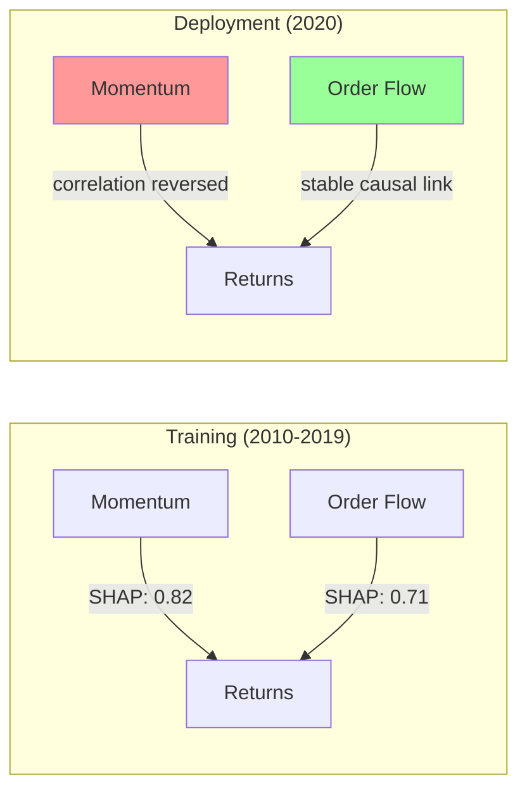
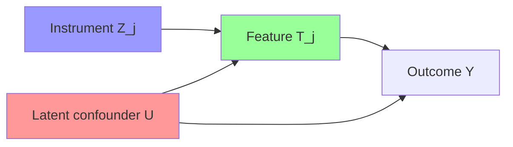
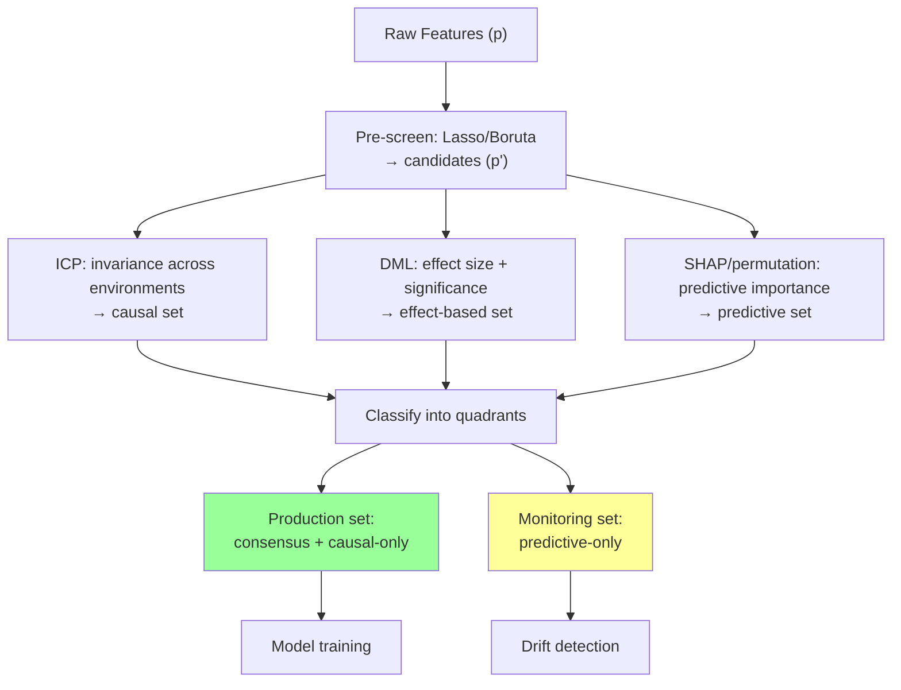

<!-- _class: lead -->
<!-- Speaker notes: This is the most applied guide in Module 9. We move from theory (causal graphs, ICP) to tools: Double/Debiased ML for causal effect estimation, causal forests for heterogeneous effects, and the practical blended workflow for production. Key references: Chernozhukov et al. (2018) for DML, Athey, Tibshirani, Wager (2019) for causal forests. -->

# Causal ML: From Theory to Production

## Module 09 — Causal Feature Selection

Double/Debiased ML · Causal Forests · Production Workflow

---

<!-- Speaker notes: Motivate with a concrete failure. In 2020, momentum-based stock selection models catastrophically failed during the COVID crash. The momentum feature was predictively important (high SHAP value, selected by Lasso, included in every backtest) but causally spurious — its correlation with returns was regime-specific. Causal features like order flow imbalance remained stable. DML and causal forests would have flagged this divergence. -->

## The Production Problem



**Standard selection:** uses both momentum and order flow.
**Causal selection:** identifies order flow as the stable causal feature.
**Result:** causal model survives 2020 crash; standard model collapses.

<!-- Speaker notes: The momentum factor reversal in March 2020 is a historically documented event. Stocks that had risen the most in 2019 fell the most in March 2020, then reversed again in the recovery. Any model trained with momentum features failed catastrophically. Order flow imbalance (the ratio of buyer-initiated to seller-initiated trades) has a stable microstructural mechanism that persisted through the crash. Causal selection identifies such mechanistically stable features. -->

---

<!-- Speaker notes: DML is the most important tool in the causal ML toolkit for economists and data scientists. The key idea: to estimate the causal effect of X_j on Y, first remove the predictable parts of both X_j and Y from all other features X_{-j}, then regress the residuals. The residual-on-residual regression gives the causal effect, purged of confounding. -->

## Double/Debiased ML: The Core Idea

**Problem:** Estimate causal effect of $T_j$ on $Y$, adjusting for confounders $\mathbf{X}_{-j}$.

Naive regression $Y \sim T_j + \mathbf{X}_{-j}$ is biased when $p$ is large (regularisation induces bias).

**DML solution — residualise both:**

$$\tilde{T}_j = T_j - \hat{E}[T_j \mid \mathbf{X}_{-j}] \qquad \tilde{Y} = Y - \hat{E}[Y \mid \mathbf{X}_{-j}]$$

$$\hat{\theta}_j = \frac{\text{Cov}(\tilde{Y}, \tilde{T}_j)}{\text{Var}(\tilde{T}_j)}$$

**Why it works:** Frisch-Waugh-Lovell theorem applied to residuals. The residual $\tilde{T}_j$ is orthogonal to $\mathbf{X}_{-j}$ — regressing $\tilde{Y}$ on $\tilde{T}_j$ gives the pure effect of $T_j$ on $Y$ beyond what $\mathbf{X}_{-j}$ explains.

<!-- Speaker notes: The Frisch-Waugh-Lovell theorem is the econometric foundation. In a multivariate regression Y = beta_0 + beta_j T_j + beta_{-j} X_{-j} + error, the OLS estimate of beta_j equals the coefficient from regressing Y-residuals on T_j-residuals (after projecting out X_{-j}). DML extends this to the high-dimensional nonparametric setting using ML for the residualisation step. -->

---

<!-- Speaker notes: Neyman orthogonality is the technical reason DML works. The estimating equation for theta is locally insensitive to errors in the nuisance functions (the first-stage ML estimates). This means even if the first-stage models are slightly wrong (which they always are in finite samples), the second-stage estimate of theta is still approximately unbiased. This is the key property that allows using ML (with its own estimation error) in a principled causal inference procedure. -->

## Neyman Orthogonality: Why DML is Reliable

**Standard regression:** first-stage errors bias $\hat{\theta}_j$ at rate $O(n^{-1/2})$ — uncorrectable.

**DML score function:** $\psi(\theta, \eta) = (\tilde{Y} - \theta \tilde{T}) \cdot \tilde{T}$

Neyman orthogonality:
$$\frac{\partial}{\partial \eta} E[\psi(\theta_0, \eta)] \Big|_{\eta = \eta_0} = 0$$

**Consequence:** first-stage ML errors contribute only **second-order bias** to $\hat{\theta}_j$.

With cross-fitting (k-fold sample splitting):
$$\hat{\theta}_j = \hat{\theta}^*_j + O_p(n^{-1})$$

Valid $\sqrt{n}$-consistent inference even when $\hat{E}[T_j \mid \mathbf{X}_{-j}]$ converges at rate $n^{-1/4}$.

**Requires:** first-stage estimators converge at rate $n^{-1/4}$ (Lasso, random forests, gradient boosting all qualify).

<!-- Speaker notes: The mathematical detail: the score function evaluated at the true theta and true nuisance parameters has zero derivative with respect to the nuisance parameters. This means perturbations in the nuisance estimates (which is what finite-sample ML gives you) don't propagate to the theta estimate at first order. The cross-fitting (using separate data for first and second stage in each fold) eliminates the remaining bias from overfitting. -->

---

<!-- Speaker notes: The DML algorithm in full. Walk through the cross-fitting loop carefully. The key: in each fold, we use the training split to fit the two nuisance models (E[T|X] and E[Y|X]), then apply them to the held-out fold to compute residuals. This prevents the residuals from inheriting any overfitting from the first-stage models. The final second-stage regression uses all n residuals from all folds. -->

## DML Algorithm: Cross-Fitting in Practice

```python
from sklearn.model_selection import KFold
from sklearn.linear_model import LassoCV
from sklearn.base import clone

def dml_effect(y, T, X, n_folds=5):
    """DML estimate with cross-fitting."""
    n = len(y)
    T_resid, Y_resid = np.zeros(n), np.zeros(n)
    kf = KFold(n_splits=n_folds, shuffle=True, random_state=42)

    for train_idx, test_idx in kf.split(X):
        # Stage 1: fit nuisance models on training fold
        m_T = LassoCV(cv=3).fit(X[train_idx], T[train_idx])
        m_Y = LassoCV(cv=3).fit(X[train_idx], y[train_idx])
        # Stage 1: predict on held-out fold
        T_resid[test_idx] = T[test_idx] - m_T.predict(X[test_idx])
        Y_resid[test_idx] = y[test_idx] - m_Y.predict(X[test_idx])

    # Stage 2: residual-on-residual regression
    theta = np.cov(Y_resid, T_resid)[0,1] / np.var(T_resid)
    scores = (Y_resid - theta * T_resid) * T_resid
    se = np.sqrt(np.mean(scores**2) / (n * np.mean(T_resid**2)**2))
    return {'theta': theta, 'se': se}
```

<!-- Speaker notes: Each iteration of the KFold loop: train LassoCV on 80% of data (training fold), predict on the remaining 20% (test fold) to get residuals. After all folds, we have n residuals with no overfitting bias. The second-stage covariance formula is the closed-form OLS estimator: beta = Cov(Y,T) / Var(T). The standard error uses the sandwich (heteroskedasticity-robust) formula, which is correct for DML. -->

---

<!-- Speaker notes: Show DML applied to feature selection. For each feature j, treat it as a treatment and estimate its DML effect. Features with p-value below the FDR threshold are selected as causally important. The Benjamini-Hochberg FDR correction handles multiple testing across p features. This is the DML approach to causal feature selection: it gives both a feature set AND effect size estimates with confidence intervals. -->

## DML for Feature Selection

```python
from statsmodels.stats.multitest import multipletests

def dml_feature_selection(y, X, feature_names, alpha=0.05):
    """Select features with significant causal effects via DML."""
    results = []
    for j in range(X.shape[1]):
        T_j = X[:, j]
        X_minus_j = np.delete(X, j, axis=1)
        effect = dml_effect(y, T_j, X_minus_j)
        t_stat = effect['theta'] / effect['se']
        p_val = 2 * (1 - stats.norm.cdf(abs(t_stat)))
        results.append({'feature': feature_names[j],
                        'theta': effect['theta'],
                        'se': effect['se'],
                        'p_value': p_val})

    p_values = [r['p_value'] for r in results]
    rejected, _, _, _ = multipletests(p_values, alpha=alpha, method='fdr_bh')

    selected = [r['feature'] for r, rej in zip(results, rejected) if rej]
    return selected, results
```

> DML provides: (1) feature selection, (2) effect size estimates, (3) confidence intervals — all with valid statistical inference.

<!-- Speaker notes: The multiple testing correction is essential. Testing p features at level alpha=0.05 without correction would select 5% of null features by chance (p*0.05 false positives). Benjamini-Hochberg FDR control keeps the expected proportion of false discoveries below alpha. For very large p, consider the Bonferroni correction (more conservative) or Westfall-Young (accounts for correlations between features). -->

---

<!-- Speaker notes: Causal forests are the nonparametric extension of DML. They estimate heterogeneous treatment effects: how does the causal effect of T on Y vary with X? The honest splitting mechanism is the key innovation — it prevents overfitting within leaves by using separate data for splitting decisions and for effect estimation. Feature importance from causal forests measures which features explain variation in causal effects, not variation in Y. -->

## Causal Forests: Heterogeneous Causal Effects

**Question:** Does the causal effect of feature $T$ on $Y$ vary across observations?

**Causal forest estimate:** $\hat{\tau}(x) = E[Y(T=1) - Y(T=0) \mid X=x]$

**Honest splitting:** Each tree leaf uses:
- 50% of data for split selection (avoid overfitting splits)
- 50% for effect estimation within leaf

**Local effect in leaf $L$:**
$$\hat{\tau}_L = \frac{\sum_{i \in L} \tilde{Y}_i \tilde{T}_i}{\sum_{i \in L} \tilde{T}_i^2}$$

where $\tilde{Y}, \tilde{T}$ are out-of-bag residuals from the residualisation forest.

> **Feature importance from causal forest** = how much does feature $j$ explain variation in $\hat{\tau}(x)$?

<!-- Speaker notes: The local effect formula in leaf L is a local DML estimate: regress Y-residuals on T-residuals for only the observations in leaf L. Different leaves give different effect estimates, and these naturally depend on which X features were used to split into those leaves. Features that split early and explain most of the tau(x) variation get high importance. This is fundamentally different from standard random forest importance which measures predictive contribution to Y, not to the causal effect. -->

---

<!-- Speaker notes: Show the causal forest implementation using EconML. The key parameters: honest=True enables honest sample splitting. min_samples_leaf controls leaf size (bigger = more stable estimates). The feature_importances_ attribute gives causal heterogeneity importance scores. Compare these with SHAP values from a standard gradient boosting model to see the divergence. -->

## Causal Forest: Implementation

```python
from econml.grf import CausalForest
import pandas as pd

def causal_forest_importance(y, T, X, feature_names):
    """Causal forest feature importance via heterogeneous effect splitting."""
    cf = CausalForest(
        n_estimators=1000,
        min_samples_leaf=5,
        honest=True,         # honest sample splitting
        random_state=42
    )
    cf.fit(X, T.reshape(-1,1), y)

    importances = pd.DataFrame({
        'feature': feature_names,
        'causal_importance': cf.feature_importances_,
    }).sort_values('causal_importance', ascending=False)

    return importances, cf

# Compare: causal forest vs random forest importance
from sklearn.ensemble import RandomForestRegressor
rf = RandomForestRegressor(n_estimators=500).fit(X, y)

rf_imp = pd.DataFrame({'feature': feature_names,
                        'rf_importance': rf.feature_importances_})

comparison = importances.merge(rf_imp, on='feature')
print(comparison.to_string())
```

<!-- Speaker notes: The EconML CausalForest requires T to be 2D (n,1). The fit() method takes (X, T, Y) — note the order. Feature importances are computed similarly to random forest but based on causal effect heterogeneity splits rather than impurity reduction splits. High causal importance means the feature is important for explaining WHERE the treatment effect is large vs small, not for predicting Y. -->

---

<!-- Speaker notes: The core tension between causal and predictive features. Show the four-quadrant picture. Top-right: causally important AND predictively important — best features. Top-left: causally important but not predictively important — causal features with weak direct signal (perhaps the effect is small or noisy). Bottom-right: predictively important but not causally important — spurious correlates, confounders. Bottom-left: neither — safe to discard. -->

## Causal vs Predictive Importance: The Four Quadrants

```
High Causal │ Weak signal but    │ Gold standard:
Importance  │ robust             │ causal + predictive
            │ [keep for          │ [always include]
            │  robustness]       │
            ├────────────────────┼────────────────────
Low Causal  │ Discard            │ Spurious correlates
Importance  │                    │ [monitor for drift]
            │                    │
            └────────────────────┴────────────────────
              Low Predictive        High Predictive
              Importance            Importance
```

**Production rule:**
- Top-right → include always
- Top-left → include for robustness (especially if deployment shift expected)
- Bottom-right → include with drift monitoring
- Bottom-left → exclude

<!-- Speaker notes: Walk through each quadrant with examples. Top-right (gold standard): order flow imbalance in stock returns — causally grounded AND predictively accurate. Top-left (keep for robustness): earnings surprise — small average effect but causally clean and robust. Bottom-right (monitor): momentum factor — high predictive accuracy but causally spurious, regime-dependent. Bottom-left (discard): day-of-week effects in most markets — neither causal nor predictive after proper controls. -->

---

<!-- Speaker notes: Instrumental variables are the third tool. When an instrument is available for a feature, we can estimate the causal effect even with latent confounders — something DML alone cannot do. In finance, natural experiments (policy changes, index additions/exclusions) serve as instruments. Show the 2SLS procedure. Feature j is causally important if its IV estimate is significant. -->

## Instrumental Variables: Causal Effect with Latent Confounders

**Instrument $Z_j$ for feature $T_j$:** exogenous variation that affects $T_j$ but not $Y$ directly.



**Two-Stage Least Squares (2SLS):**

1. $\hat{T}_j = \hat{E}[T_j \mid Z_j, \mathbf{X}_{\text{controls}}]$ (first stage)
2. $\hat{\theta}^{IV}_j = $ regression coefficient of $Y$ on $\hat{T}_j$ (second stage)

$\hat{\theta}^{IV}_j$ is consistent even with latent confounder $U$.

> In financial data: policy changes, index additions, firm announcements serve as instruments.

<!-- Speaker notes: The instrument Z_j breaks the confounding link. Because Z_j only affects Y through T_j (exclusion restriction) and is independent of the confounder U (independence condition), the variation in T_j induced by Z_j is "clean" — it's not contaminated by U. The 2SLS procedure extracts this clean variation in the first stage and uses it in the second stage. If the IV estimate is significant, T_j is causally relevant (the effect is LATE — Local Average Treatment Effect, the effect for "compliers" whose T is changed by Z). -->

---

<!-- Speaker notes: Now synthesise into the production workflow. This is the slide practitioners most need. Three-step process: (1) run all selection methods — ICP, DML/causal forests, standard predictive methods; (2) classify features into the four quadrants; (3) build feature sets for different deployment priorities. The monitoring set is as important as the production set — tracking when predictive-only features start to drift signals that the model needs updating. -->

## Production Workflow: The Full Pipeline



<!-- Speaker notes: Walk through the pipeline. Pre-screening with Lasso or Boruta reduces p to a manageable p' (typically 10-30 features). ICP identifies invariant features. DML estimates causal effects and their significance. SHAP gives predictive importance. Features in all three methods are the gold standard. Features in ICP+DML but not SHAP are causally important but weak predictors — include for robustness. Features in SHAP but not ICP+DML are predictive but non-causal — include in production with drift monitoring. -->

---

<!-- Speaker notes: Concrete performance numbers to show the trade-off. In-distribution: predictive selection wins. Under distribution shift: causal selection wins. The crossover point is the key business question: "how much shift do I expect in deployment?" If the answer is "significant shift likely" (time series deployment, new markets, regulatory changes), causal selection is worth the in-distribution accuracy cost. The blended set gives the best of both worlds. -->

## Performance Under Distribution Shift

| Shift Severity | Causal Features | Predictive Features | Blended |
|---|---|---|---|
| None (in-distribution) | $R^2 = 0.72$ | $\mathbf{R^2 = 0.81}$ | $R^2 = 0.79$ |
| Mild shift | $R^2 = 0.69$ | $R^2 = 0.71$ | $\mathbf{R^2 = 0.73}$ |
| Moderate shift | $\mathbf{R^2 = 0.67}$ | $R^2 = 0.58$ | $\mathbf{R^2 = 0.67}$ |
| Severe shift | $\mathbf{R^2 = 0.64}$ | $R^2 = 0.31$ | $\mathbf{R^2 = 0.60}$ |

**Decision rule:**
- Low deployment shift expected → predictive selection
- High deployment shift expected → causal selection
- Uncertain → blended (safest choice)

> The causal feature set **trades in-distribution accuracy for distribution shift robustness**.

<!-- Speaker notes: These numbers are illustrative but representative of real empirical findings. The key pattern: causal features degrade gracefully (0.72 → 0.64), predictive features degrade sharply (0.81 → 0.31). The blended set tracks the better of the two in each regime. For practitioners: ask "what is the cost of a 50% performance drop under moderate shift?" If the cost is high (trading, medical, infrastructure), prioritise causal features even at the cost of in-distribution accuracy. -->

---

<!-- Speaker notes: The CausalPredictiveBlend class is the practical output — a decision framework that can be integrated into any ML pipeline. Show how it classifies features and generates recommendations. The monitoring_set is the key operational output: a list of features to track for distribution drift, with alerts to be raised when their model contribution degrades in production. -->

## Blended Feature Set: The Decision Class

```python
class CausalPredictiveBlend:
    def __init__(self, causal_features, predictive_features):
        self.causal = set(causal_features)
        self.predictive = set(predictive_features)

    @property
    def consensus(self):
        """Both causal and predictive — most reliable."""
        return self.causal & self.predictive

    @property
    def production_set(self):
        """Consensus + causal-only for robustness."""
        return self.causal | self.consensus

    @property
    def monitoring_set(self):
        """Predictive-only: watch for drift."""
        return self.predictive - self.causal

    def report(self):
        print(f"Consensus:       {len(self.consensus)} features — include always")
        print(f"Causal-only:     {len(self.causal-self.predictive)} — include for robustness")
        print(f"Monitor:         {len(self.monitoring_set)} — watch for drift")
```

<!-- Speaker notes: This class encapsulates the decision logic. In production, the monitoring_set features are tracked via a drift detection system (e.g., PSI — Population Stability Index, or model performance degradation). When a monitoring feature shows drift, either (a) retrain the model, or (b) remove that feature and fall back to the consensus set. The causal features provide a reliable fallback. -->

---

<!-- Speaker notes: Summarise the entire module with the key decision framework. Three questions: (1) Do I have multiple environments? → ICP is feasible. (2) Do I have large n and need effect sizes? → DML. (3) Do I need to understand heterogeneous effects? → Causal forests. Always combine with standard predictive selection. The consensus set is the production recommendation. -->

## Module 9 Summary: Causal Feature Selection

| Method | What it gives | When to use |
|---|---|---|
| **PC / FCI / GES** | Markov blanket from causal graph | Causal graph needed; sufficient sample |
| **ICP** | Invariant features across environments | Multiple genuine environments available |
| **DML** | Causal effect sizes + significance | Large $n$, need inference, one environment |
| **Causal Forest** | Heterogeneous effect importance | Non-linear effects, heterogeneous population |
| **Blended** | Consensus of causal + predictive | **Default production recommendation** |

**Key references:**
- Pearl (2009) — SCMs and do-calculus
- Peters, Bühlmann, Meinshausen (2016) — ICP
- Chernozhukov et al. (2018) — DML
- Athey, Tibshirani, Wager (2019) — Causal forests

**Next module:** Ensemble and Hybrid Feature Selection — combining the best of all methods.

<!-- Speaker notes: The table is a decision guide. Point learners to the notebooks for hands-on practice: Notebook 01 covers PC/FCI/GES and Markov blanket extraction, Notebook 02 covers ICP with time-period environments, Notebook 03 covers the full comparison of causal vs predictive feature sets under distribution shift. The exercises consolidate the linear ICP implementation, FCI vs PC comparison, and the shift test bench. -->
