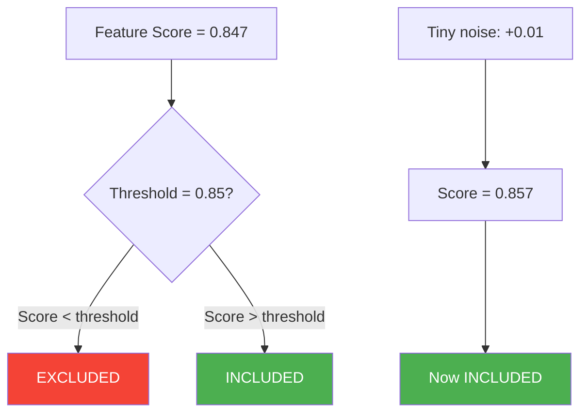
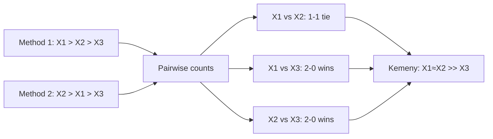
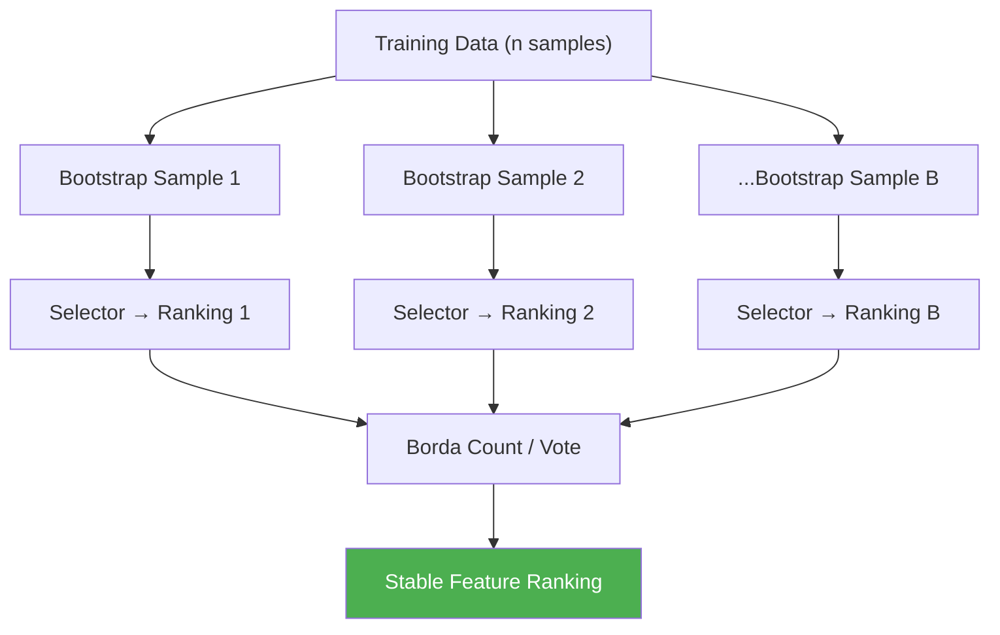
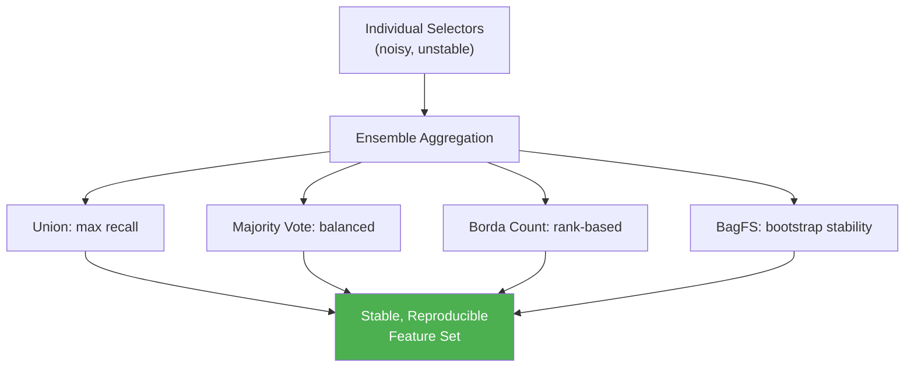

<!-- _class: lead -->
<!-- Speaker notes: Welcome to Module 10, the final stretch of the course. Every module so far taught one selector: filters, wrappers, embedded methods, GAs, PSO. The core question today: what happens when we combine them? Motivating framing: a single expert opinion is useful, but you wouldn't bet your career on one expert when you could ask ten. This module applies that wisdom-of-crowds principle to feature selection. -->

# Ensemble Feature Selection

**Module 10 — Ensemble & Hybrid Methods**

> Combining multiple selectors for stability, accuracy, and reproducibility — because no single method has a monopoly on truth.

---

# The Instability Problem

Run the same feature selector twice on slightly different samples of the same data:

```
Sample A  → Selected: {X1, X3, X7, X12, X15}
Sample B  → Selected: {X1, X4, X9, X12, X18}
                       ↑                ↑
                   same            same
                       ↑   ↑   ↑        ↑
                   different   different  different
```

**Jaccard similarity: 2 / 8 = 0.25**

A good selector should produce the same answer on similar data.

<!-- Speaker notes: This is not a hypothetical. Studies on genomics data show Jaccard similarity of 0.1–0.3 between runs on bootstrap samples. The root cause: selection is a discrete decision. A continuous score near the cutoff flips binary on tiny perturbations. Consequence 1: papers cannot be reproduced. Consequence 2: the selected features overfit the specific sample, not the population. The question to pose: "If your selected features would change with 10% more data, do you really trust them?" -->

---

# Why Does Instability Happen?



**Selection discontinuity:** continuous scores → binary decisions

Near-threshold features flip between include/exclude with minimal data perturbation.

<!-- Speaker notes: The selection discontinuity is the technical name for this phenomenon. Every selector must draw a line somewhere. Features near that line are inherently unstable. This is not a bug in any specific algorithm — it is a fundamental property of discrete selection. The solution: aggregate over many selector runs so that stable features always win, near-threshold features wash out. Analogy: one election can be decided by 10 votes; aggregate polling across thousands reduces this variance. -->

---

# The Bias-Variance Trade-Off for Selectors

$$\text{Selection Error} = \underbrace{\text{Bias}^2}_{\text{Wrong assumptions}} + \underbrace{\text{Variance}}_{\text{Sample sensitivity}} + \underbrace{\varepsilon}_{\text{Irreducible}}$$

<div class="columns">
<div>

**Bias sources:**
- Linearity assumption (LASSO)
- Independence assumption (univariate filter)
- Greedy search (forward selection)

</div>
<div>

**Variance sources:**
- Small sample size (n < 10p)
- Correlated features
- Weak signals near noise floor

</div>
</div>

**Ensemble selection reduces variance** — same principle as bagging for prediction.

<!-- Speaker notes: This is the theoretical justification for everything we do in this module. Just as Random Forests reduce prediction variance by averaging over trees, ensemble selection reduces selection variance by averaging over selectors. Key asymmetry: ensemble selection cannot fix bias (if all your methods assume linearity, the ensemble will also miss nonlinear features). Fix bias with method diversity; fix variance with aggregation. -->

---

# Measuring Stability: Kuncheva's Index

Given two selected subsets $S_1$, $S_2$ of size $k$ from $p$ features:

$$\kappa(S_1, S_2) = \frac{|S_1 \cap S_2| / k - k/p}{1 - k/p}$$

- Range: $[-1, 1]$. Value of **1** = perfect agreement, **0** = chance agreement
- Corrects for expected random overlap — unlike Jaccard

```python
def kuncheva_index(s1: set, s2: set, p: int) -> float:
    k = len(s1)
    intersection = len(s1 & s2)
    chance = k / p
    return (intersection / k - chance) / (1 - chance)

# Example: p=100 features, k=10 selected
s1 = {1,2,3,4,5,6,7,8,9,10}
s2 = {1,2,3,4,5,6,7,8,9,20}  # 9 in common
kuncheva_index(s1, s2, p=100)   # → 0.81
```

<!-- Speaker notes: Walk through the formula numerically. If k=10 and p=100: chance overlap = 10/100 = 0.1 (10% of your selected features overlap by chance). The formula subtracts chance overlap from actual overlap, then normalises. Kuncheva is the standard metric in the stability selection literature. Use it to: (1) compare stability of different selectors on your data, (2) measure stability gain from ensemble selection. Typical individual selector stability: κ ≈ 0.3–0.5. Good ensemble: κ ≈ 0.7–0.9. -->

---

# Three Stability Metrics Compared

| Metric | Formula | Range | Corrected for chance? |
|--------|---------|-------|----------------------|
| Jaccard | $\|S_1 \cap S_2\| / \|S_1 \cup S_2\|$ | [0,1] | No |
| Kuncheva κ | (intersection/k − k/p) / (1 − k/p) | [-1,1] | Yes |
| Spearman footrule | $\sum_i \|\sigma(i) - \tau(i)\|$ / max | [0,1] | No |

**Use Kuncheva** for binary subsets.
**Use Spearman footrule** when you have full feature rankings.

<!-- Speaker notes: Jaccard is intuitive but confounded: two random size-5 subsets from 1000 features have Jaccard ≈ 0.005, which sounds terrible even for chance. Kuncheva corrects this — random selection → κ = 0 by construction. Spearman footrule is for when you have full rankings (all methods output scores for all features, not just a selected subset). Practical recommendation: use Kuncheva as your primary stability metric throughout this module. -->

---

<!-- _class: lead -->
<!-- Speaker notes: Now we have M rankings or M subsets from M selector runs. How do we combine them? We have four main approaches, ranging from simple (union/intersection) to sophisticated (rank aggregation). Think of these as voting rules — the same diversity of options you see in electoral systems. The best choice depends on your false-positive vs false-negative trade-off. -->

# Consensus Methods

---

# Union vs Intersection

<div class="columns">
<div>

### Union
**Take everything selected by anyone.**

$$S_{\text{union}} = \bigcup_{m=1}^{M} S_m$$

- Maximum recall (nothing missed)
- Risk: inflated feature set
- Use when: false negatives are costly

</div>
<div>

### Intersection
**Take only what everyone agrees on.**

$$S_{\text{intersection}} = \bigcap_{m=1}^{M} S_m$$

- Maximum precision (nothing spurious)
- Risk: too conservative, shrinks fast
- Use when: false positives are costly

</div>
</div>

> With M=5 methods selecting 20 features each from 100: union can reach 100, intersection can reach 0.

<!-- Speaker notes: These are the two extremes of the consensus spectrum. Union is almost always too aggressive in practice — with 5 diverse methods, the union often includes most features. Intersection is often too conservative — with noisy selectors, even relevant features get dropped by one method. In practice, we almost always want the majority vote middle ground between these extremes. When to use each: classification with many true positives (union), discovery with strict FDR control (intersection). -->

---

# Majority Vote

A feature enters the ensemble if selected by at least a fraction $t$ of methods:

$$S_{\text{vote}} = \{i : \text{count}(i \in S_m) \geq t \cdot M\}$$

```python
from collections import Counter

def majority_vote(subsets, threshold=0.5):
    M = len(subsets)
    counts = Counter(feat for s in subsets for feat in s)
    return [f for f, c in counts.items() if c >= threshold * M]
```

- $t = 0.5$: classic majority vote
- $t = 1.0$: equivalent to intersection
- $t = 1/M$: equivalent to union

**Recommendation:** start with $t = 0.5$, tune on validation set.

<!-- Speaker notes: Majority vote is the practical default for binary ensemble selection. The threshold t is the key hyperparameter — it controls the precision-recall trade-off. As t increases from 1/M to 1, precision increases and recall decreases. Optimal t is problem-dependent, but 0.5 is a sensible starting point. The code is trivially simple — Counter does all the heavy lifting. Extension: weighted majority vote assigns different weights to different methods based on their validation performance. -->

---

# Borda Count Rank Aggregation

For full rankings, Borda count sums positional scores:

$$\text{Borda}(i) = \sum_{m=1}^{M} (p - \text{rank}_m(i))$$

Feature ranked 1st from $p=10$: **9 points**. Ranked last: **0 points**.

```python
def borda_count(rankings):  # rankings[m] = [feat_0, feat_1, ..., feat_p-1]
    p = len(rankings[0])
    scores = {f: 0 for f in rankings[0]}
    for ranking in rankings:
        for rank_idx, feat in enumerate(ranking):
            scores[feat] += (p - 1 - rank_idx)
    return sorted(scores, key=lambda f: scores[f], reverse=True)
```

**Why Borda?** Simple, fast ($O(Mp)$), handles ties, no hyperparameters.

<!-- Speaker notes: Borda count was invented for voting in the French Academy of Sciences in 1781. It works just as well for feature selection. Key property: a feature consistently ranked in the top 10% wins over a feature ranked 1st by one method but 50th by all others. This is exactly the behaviour we want: we want features that are robustly relevant, not features that one method loves and others ignore. Compare with MRR: MRR gives extra credit for being ranked 1st. Use MRR when you care specifically about the single best feature. -->

---

# Kemeny Optimal Ranking (Approximation)

**Goal:** find the ranking that minimises total pairwise disagreements with all input rankings.

**Copeland approximation:** for each pair $(i,j)$, count how many methods rank $i$ above $j$. Feature score = total pairwise wins.



NP-hard exactly; Copeland approximation is $O(Mp^2)$ but excellent in practice.

<!-- Speaker notes: Kemeny is the "gold standard" of rank aggregation — it minimises the number of swaps needed to reconcile all input rankings. The exact solution is NP-hard, but the Copeland approximation (count pairwise wins) is excellent for our purposes. When to use Kemeny vs Borda: they agree in most cases. Kemeny is better when you have strong disagreements between methods; Borda handles ties more gracefully. Practical advice: use Borda count by default; switch to Kemeny if you observe Borda producing counter-intuitive orderings. -->

---

# Bootstrap Aggregation of Feature Selectors (BagFS)

Apply bagging to feature selection:



**Key insight:** features that are robustly relevant will be selected across many bootstrap samples. Noise features won't.

<!-- Speaker notes: BagFS is the feature selection analogue of Random Forest / Bagging for prediction. The mechanism is simple: if a feature is truly relevant, it will score well on any large enough sample of the training data. If a feature scored well only because of 3 specific samples in your training set, it will score poorly on the 63% of bootstrap samples that don't include those 3 samples. This provides a natural filter for overfitting to specific data points. Subsampling without replacement (subsample_ratio < 1.0) increases diversity further by ensuring bootstrap samples share fewer data points. -->

---

# BagFS Variants

<div class="columns">
<div>

### BagFS-LASSO (Stability Selection)
Bootstrap LASSO paths → selection probability:

$$\hat{\pi}_j = \frac{1}{B} \sum_{b=1}^{B} \mathbf{1}[j \in \hat{S}^b(\lambda)]$$

Features with $\hat{\pi}_j > 0.9$: stable selections with family-wise error control.

</div>
<div>

### BagFS-RF
Bootstrap Random Forests → average importance:

$$\hat{I}_j = \frac{1}{B} \sum_{b=1}^{B} \text{importance}_j^b$$

More stable than single-run RF importance.

</div>
</div>

> **Stability selection** (Meinshausen & Bühlmann 2010) provides theoretical guarantees on the false positive rate.

<!-- Speaker notes: Stability selection is one of the most important papers in feature selection (2010, JRSS-B). The key result: if you bootstrap LASSO and only keep features with π > 0.9, you can bound the expected number of false positives. This is rare — most feature selection methods have no formal statistical guarantees. BagFS-RF is simpler and doesn't require tuning λ, but lacks the formal guarantees of stability selection. Practical choice: use stability selection for high-stakes biomarker discovery; BagFS-RF for general ML pipelines. -->

---

# When Ensemble Selection Helps Most

| Situation | Why ensemble helps | Expected gain |
|-----------|-------------------|---------------|
| Small samples (n < 500, p > 50) | Averaging reduces sample sensitivity | Large |
| Correlated features (r > 0.8) | Distributes votes over correlated group | Large |
| Noisy features (SNR < 3) | Noise rarely consistent across bootstraps | Large |
| Heterogeneous methods | Combines complementary strengths | Medium |
| Large clean data, clear signal | Single method already stable | Small |

**Rule of thumb:** if your single-method Kuncheva κ < 0.5, switch to ensemble selection.

<!-- Speaker notes: This slide answers the practical question: "when should I bother with ensemble selection?" For large clean datasets with strong signals, a single selector works fine. The gains are largest exactly where data science is hardest: small samples, noisy signals, correlated features. The correlated features row is particularly important: if X1 and X2 are 0.95 correlated, a single selector picks one arbitrarily. Ensemble selection distributes votes and correctly identifies that BOTH are relevant. Diagnostic: run your selector 20 times on 80% subsamples. If κ < 0.5, you need ensemble selection. -->

---

# Diversity: The Engine of Ensemble Selection

Ensemble selection only improves over the best individual method if the ensemble is **diverse**:

<div class="columns">
<div>

**Low diversity (poor):**
- LASSO α=0.01 + LASSO α=0.1 + LASSO α=1.0
- All three share the same linear assumption
- Correlated errors → small variance reduction

</div>
<div>

**High diversity (good):**
- Mutual Information (nonlinear, univariate)
- LASSO (linear, multivariate)
- Random Forest (nonlinear, interactions)
- These have different biases, complementary strengths

</div>
</div>

> **Diversity rule:** combine methods with different assumptions, search strategies, and stability profiles.

<!-- Speaker notes: This is the single most important principle for designing good ensemble selectors. Analogy: a committee of 5 economists from the same school of thought provides less diverse views than 5 economists from different traditions. Practical heuristic: at minimum, include one filter method (no model assumptions), one embedded method (model-based), and one wrapper or evolutionary method (search-based). The diversity requirement also implies: don't add a 6th method that is highly correlated with your existing 5. Measure pairwise Jaccard between methods' selections — high Jaccard = low added diversity. -->

---

# Putting It Together: Full Ensemble Pipeline

```python
# Five diverse methods → Borda count aggregation
methods = {
    'MI':    mutual_info_selector,     # filter, nonlinear, univariate
    'LASSO': lasso_selector,           # embedded, linear, multivariate
    'Boruta': boruta_selector,         # wrapper, RF-based, interaction-aware
    'SHAP':  shap_selector,            # embedded, model-agnostic
    'GA':    genetic_algorithm_selector  # evolutionary, global search
}

rankings = {name: fn(X_train, y_train) for name, fn in methods.items()}
ensemble_ranking = borda_count(list(rankings.values()))
```

Then validate stability using BagFS:
```python
stability = kuncheva_ensemble_stability(bootstrap_subsets, p=X.shape[1])
print(f"Ensemble stability (κ): {stability:.3f}")
```

<!-- Speaker notes: This is a realistic production ensemble — the exact code used in Notebook 01. Five methods cover the major categories: filter, embedded (linear), wrapper (RF-based), embedded (model-agnostic), and evolutionary. Borda count requires minimal code and has no hyperparameters. The stability check is not optional — always verify that your ensemble is actually more stable than individual methods. This pipeline adds diversity along three axes: model assumptions (linear vs nonlinear), search scope (univariate vs multivariate vs global), and training mechanism (score-based vs importance-based vs fitness-based). -->

---

# Summary



**Key takeaways:**
1. Individual selectors are unstable — Kuncheva κ measures how bad
2. Ensemble selection reduces variance, not bias — diversity is essential
3. Borda count is the default rank aggregation — simple, effective
4. BagFS provides stability guarantees — use for small samples and biomarker discovery

<!-- Speaker notes: Recap the four key takeaways from this deck. The conceptual arc: instability problem → stability metrics → consensus methods → BagFS. What's next: Guide 02 covers hybrid methods — how to cascade different selector types (filter → GA → wrapper) to reduce computation while maintaining quality. Notebook 01 builds the full 5-method ensemble and measures stability across bootstrap samples. Encourage learners to check the stability of their current single-selector choices using Kuncheva's index before the next session. -->

---

# Further Reading

- **Saeys, Abeel & Van de Peer (2008)** — Robust feature selection using ensemble techniques. *ECML PKDD*. Survey with benchmarks.
- **Meinshausen & Bühlmann (2010)** — Stability selection. *JRSS-B 72(4)*. Formal theory for BagFS-LASSO.
- **Kuncheva (2007)** — A stability index for feature selection. *IASTED AIA*. Original κ paper.
- **Abeel et al. (2010)** — Robust biomarker identification for cancer diagnosis. *Bioinformatics 26(3)*. Applied benchmarks.

> Next: **Guide 02 — Hybrid Methods** → Cascaded pipelines that save 80% of computation while matching full-ensemble quality.

<!-- Speaker notes: The four papers listed are the core reading for this module. Meinshausen & Bühlmann is the most important theoretically — required reading for anyone doing biomarker discovery. Saeys et al. is the best practical survey for applied practitioners. Encourage learners to read at least the abstract and conclusions of each paper before the lab session. Preview of Guide 02: if running 5 methods on 10,000 features is expensive, can we pre-screen with a cheap filter and run the expensive methods on 200 candidates? -->
