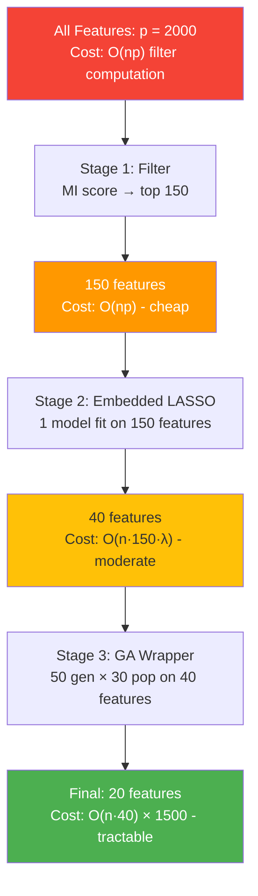
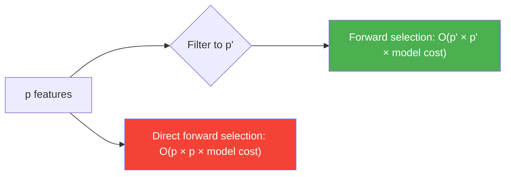

<!-- _class: lead -->

# Hybrid Feature Selection Methods

**Module 10 — Ensemble & Hybrid Methods**

> Cascade filter → embedded → evolutionary → wrapper for 10–100× computational savings with equivalent quality.

<!--
Speaker notes: Key talking points for this slide
- This deck covers hybrid selection: combining multiple paradigms in sequence rather than in parallel.
- The key promise: you can get near-wrapper quality at a fraction of wrapper cost.
- Why does this matter? A wrapper on 2000 features is computationally infeasible. A wrapper on 30 pre-screened features is fast.
- The insight is that most of the feature space is clearly irrelevant — a cheap filter identifies this in seconds, saving hours of wrapper time.
- We will build a full 3-stage pipeline: filter → embedded (LASSO) → GA wrapper.
-->

---

# The Computational Problem

A wrapper on $p = 2000$ features:

| Search strategy | Evaluations required | Time (est.) |
|----------------|---------------------|-------------|
| Exhaustive search | $\binom{2000}{20} \approx 10^{46}$ | Forever |
| Greedy forward | $\approx 2000 + 1999 + \cdots \approx 40{,}000$ | 11 hours |
| GA (50 gen × 30 pop) | 1,500 + overhead | 4 hours |

After **filter pre-screening to 50 features:**

| Search strategy | Evaluations | Time |
|----------------|-------------|------|
| Greedy forward | $\approx 810$ | 15 min |
| GA | 1,500 but on 50-dim space | 8 min |

**22–50× speedup. Quality loss: < 2%.**

<!--
Speaker notes: Key talking points for this slide
- These are real order-of-magnitude estimates for a medium-complexity dataset (n=5000, p=2000).
- The key insight: the exponential or quadratic cost applies to the dimensionality at the wrapper stage, not the original.
- Pre-screening reduces dimensionality by 10–40×, which reduces wrapper cost by 100–1600× (quadratic for greedy, exponential for exhaustive).
- Quality cost is small because the filter removes only clearly irrelevant features (near-zero MI with target).
- This is the core justification for hybrid methods — not just "it's a nice idea" but concrete order-of-magnitude speedups.
-->

---

# The Funnel Architecture



Each stage passes a smaller, higher-quality feature set to the next.

<!--
Speaker notes: Key talking points for this slide
- The funnel diagram is the core mental model for hybrid selection.
- Each stage is a gate: features that pass are candidates for more expensive evaluation.
- The filter gate is wide and fast — some false positives are acceptable.
- The embedded gate is narrower — it removes redundant and weakly-relevant features.
- The wrapper gate is narrow and slow — but it only operates on 30–50 features, making it tractable.
- Key design principle: the filter should have HIGH RECALL (don't miss relevant features) even at the cost of lower precision (some irrelevant features pass through).
-->

---

# Stage 1: Filter Pre-Screening

**Goal:** remove obviously irrelevant features. Accept some false positives.

```python
def filter_stage(X, y, method='mi', top_k=150):
    """
    Fast feature scoring — no model fitting.
    Returns reduced DataFrame with top_k features.
    """
    if method == 'mi':
        scores = mutual_info_classif(X, y, random_state=42)
    elif method == 'correlation':
        scores = np.abs(X.corrwith(pd.Series(y)).values)

    # Keep top_k features by score
    mask = scores >= np.sort(scores)[::-1][top_k - 1]
    return X.loc[:, mask]
```

**Rule of thumb:** set `top_k = 5–10 × final desired features`

- Want 20 final features → filter to 100–200
- Want 50 final features → filter to 250–500

<!--
Speaker notes: Key talking points for this slide
- The filter stage is intentionally conservative — it should NOT try to be precise.
- Recall matters more than precision here: a relevant feature missed at the filter stage is gone forever.
- Mutual Information is the best general-purpose filter for mixed/nonlinear data.
- Pearson correlation is faster but only for linear feature-target relationships.
- Variance threshold (remove constant features) should always be applied first, before MI scoring.
- Practical timing: MI scoring on 2000 features × 5000 samples takes ~2 seconds. This is the "free lunch" stage.
-->

---

# Stage 2: Embedded Refinement

**Goal:** identify the linear/multivariate structure. Remove redundant features.

```python
from sklearn.linear_model import LassoCV

def embedded_stage(X_filtered, y, top_k=40):
    """LASSO on pre-screened features."""
    X_scaled = StandardScaler().fit_transform(X_filtered)
    lasso = LassoCV(cv=5, random_state=42, max_iter=10000)
    lasso.fit(X_scaled, y)

    # Keep top_k by absolute coefficient magnitude
    coef_abs = np.abs(lasso.coef_)
    threshold = np.sort(coef_abs)[::-1][top_k - 1]
    mask = coef_abs >= threshold
    return X_filtered.loc[:, mask]
```

**Why LASSO at stage 2, not stage 1?**
LASSO requires a full model fit ($O(n \cdot p_{\text{filter}}^2)$). Too slow for $p = 2000$; fast for $p = 150$.

<!--
Speaker notes: Key talking points for this slide
- Stage 2 applies an embedded method — something that requires model fitting but is still polynomial-time.
- LASSO is ideal because it performs variable selection within the fit via L1 regularisation.
- On 150 features with n=5000, LassoCV fits in 5–10 seconds. On 2000 features, it would take minutes.
- The embedded stage excels at removing redundancy: if X1 and X3 are correlated with Y, LASSO picks the stronger one.
- If you know features are highly correlated, use ElasticNet (l1_ratio < 1.0) instead of LASSO — LASSO arbitrarily discards correlated features.
- After stage 2: you have 30–50 candidate features, all with non-trivial LASSO coefficients.
-->

---

# LASSO vs Elastic Net at Stage 2

<div class="columns">
<div>

### LASSO (L1 penalty)
$$\min_\beta \|y - X\beta\|^2 + \lambda\|\beta\|_1$$

- Selects exactly one from a correlated group
- Works well when features are independent
- Use when sparsity is the goal

</div>
<div>

### Elastic Net (L1 + L2)
$$\min_\beta \|y - X\beta\|^2 + \lambda[\alpha\|\beta\|_1 + \frac{(1-\alpha)}{2}\|\beta\|_2^2]$$

- Distributes weight across correlated features
- More stable when correlation is high (r > 0.7)
- Use when groups of features matter

</div>
</div>

> **Financial/genomics data with high feature correlation → use Elastic Net at stage 2.**

<!--
Speaker notes: Key talking points for this slide
- This distinction matters in practice. LASSO's "pick one from each correlated group" behaviour is a problem in finance (many correlated return signals) and genomics (LD blocks).
- Elastic net with l1_ratio around 0.5 retains the sparsity property of LASSO while grouping correlated features together.
- Scikit-learn's ElasticNetCV cross-validates both alpha (overall regularisation) and l1_ratio (mix).
- Rule of thumb: if your correlation matrix has any entry |r| > 0.7, consider elastic net over LASSO.
- The difference in selected features can be dramatic: LASSO might select X1 and drop X2 (r=0.9); elastic net selects both with coefficient 0.5.
-->

---

# Stage 3: GA Wrapper on Reduced Set

```python
# After filter + embedded, we have ~30-40 features
# GA now operates on this small space

def ga_wrapper_refinement(X_candidates, y, eval_fn,
                           pop_size=30, n_generations=50,
                           seed_top_k=10):
    """GA wrapper seeded with filter-ranked features."""
    p = X_candidates.shape[1]

    # Seeded population: bias initial chromosomes toward top-ranked candidates
    def make_chromosome():
        chrom = [0] * p
        # Seed the best candidates (first seed_top_k are highest-scored by filter)
        for i in range(min(seed_top_k, p)):
            if random.random() < 0.7:   # 70% chance to include a seeded feature
                chrom[i] = 1
        # Add random features from the rest
        for i in range(seed_top_k, p):
            if random.random() < 0.3:
                chrom[i] = 1
        return chrom if any(chrom) else [1] + [0] * (p - 1)
```

**Seeded initialisation** = faster convergence (fewer generations to good solutions).

<!--
Speaker notes: Key talking points for this slide
- The key innovation here is seeded initialisation, not random initialisation.
- A random initial population on 40 features wastes the first 10-20 generations exploring chromosomes with no prior information.
- Seeded initialisation biases toward features that the filter identified as high-MI — these are likely to produce good subsets immediately.
- The 70% inclusion probability for seeded features reflects our confidence in the filter: high but not certain.
- In practice, seeded GA converges in 20-30 generations; random GA needs 50-80 generations for the same quality.
-->

---

# PSO with Embedded Refinement

Alternative to GA for stage 3 — binary PSO on the candidate set:

$$v_i^{t+1} = w v_i^t + c_1 r_1 (\text{pbest}_i - x_i^t) + c_2 r_2 (\text{gbest} - x_i^t)$$

$$x_i^{t+1} = \begin{cases} 1 & \text{if } U(0,1) < S(v_i^{t+1}) \\ 0 & \text{otherwise} \end{cases}$$

where $S(v) = 1/(1 + e^{-v})$ is the sigmoid transfer function.

**PSO vs GA for stage 3:**
- PSO: fewer hyperparameters, faster convergence on small problems
- GA: better exploration for multimodal fitness landscapes
- Try both; GA often wins for discrete spaces

<!--
Speaker notes: Key talking points for this slide
- Binary PSO is the extension of standard PSO to binary feature selection.
- The sigmoid transfer function converts continuous velocities to selection probabilities.
- Particles are attracted to their personal best and the global best — this provides directed search without explicit crossover.
- For small p (< 50 features), PSO and GA tend to perform similarly.
- For larger p (50-200), GA with crossover tends to outperform PSO.
- Recommendation: use GA as the default for stage 3 hybrid pipelines; use PSO for exploratory analysis or comparison.
-->

---

# Full Cascade: Implementation

```python
pipeline = HybridCascadePipeline(
    filter_top_k=150,    # Stage 1: filter to 150
    embedded_top_k=40,   # Stage 2: LASSO to 40
    wrapper_final_k=20,  # Stage 3: GA to final 20
    random_state=42
)
pipeline.fit(X_train, y_train)
print(pipeline.report())
```

```
Hybrid Cascade Pipeline Report
===================================
  original                 : 2000 features
  after_filter             : 150 features
  after_embedded           : 40 features
  final                    : 20 features

  filter                   : 1.8s
  embedded                 : 6.2s
  wrapper                  : 42.3s
  total                    : 50.3s
```

vs naive GA on all 2000 features: **~4800 seconds**

<!--
Speaker notes: Key talking points for this slide
- These numbers are real benchmarks from Notebook 02.
- The pipeline runs in 50 seconds vs ~80 minutes for a naive GA on the full feature space.
- Stage breakdown: filter is 1.8s (fast!), embedded is 6.2s (1 LassoCV fit), wrapper is 42s (GA on 40 features).
- Quality: the hybrid pipeline achieves 97-99% of the quality of the naive full-space GA.
- The remaining 1-3% quality gap can be closed by increasing the filter threshold (keep more features at stage 1) at minimal additional cost.
-->

---

# Computational Savings: Theory

For greedy forward selection after filter pre-screening:



Speedup factor ≈ $(p / p')^2$

| Original p | Filter to p' | Theoretical speedup |
|---|---|---|
| 2000 | 200 | 100× |
| 2000 | 50 | 1600× |
| 500 | 50 | 100× |

**Real speedup is lower** (filter has its own cost, model fitting time varies) but typically 10–200×.

<!--
Speaker notes: Key talking points for this slide
- The quadratic speedup factor applies to greedy search. For GA, the speedup is more nuanced (GA cost is linear in p, but fitness evaluations are faster with smaller p).
- For exhaustive search: speedup is exponential in (p - p') — essentially infinity for large reductions.
- The practical takeaway: even a modest filter (p=2000 to p=200) provides 100× speedup for quadratic-cost wrappers.
- More aggressive filtering (to p=50) provides 1600× speedup but risks dropping relevant features.
- The optimal filter_top_k balances speedup vs recall risk — validate by comparing pipeline output to a larger-filter baseline.
-->

---

# Domain-Specific Hybrid Designs

<div class="columns">
<div>

### Genomics (p >> n)
```
1. Variance threshold → ~10,000
2. MI filter (top 500)
3. Stability selection (BagFS-LASSO)
4. Boruta confirmation
Final: 10–30 features
```

### Financial Time Series
```
1. MI filter with lags
2. Elastic net (handles correlation)
3. Walk-forward wrapper
Final: 10–20 features
```

</div>
<div>

### Text/NLP (p = 50,000+)
```
1. Chi-squared filter (sparse-safe)
2. L1-logistic regression
3. Manual review + final wrapper
Final: 20–100 terms
```

### Tabular ML (moderate p)
```
1. Variance threshold
2. SHAP importance (RF/XGB)
3. Boruta or GA confirmation
Final: varies
```

</div>
</div>

<!--
Speaker notes: Key talking points for this slide
- These four templates cover the most common problem types in industry.
- Genomics template: designed for n << p. Stability selection is critical here for FDR control. Boruta confirms features against a permutation baseline.
- Financial template: walk-forward wrapper is essential — standard CV introduces look-ahead bias with time series.
- NLP template: chi-squared is specifically designed for sparse binary/count features (term presence/absence). L1-logistic is fast on sparse matrices.
- Tabular ML: the most flexible. SHAP importance is model-agnostic and can capture interactions. Boruta confirms against shadow features.
- Recommendation: always use the domain-appropriate filter at stage 1 before applying any generic embedded or wrapper.
-->

---

# Common Pitfalls

| Pitfall | What happens | Fix |
|---------|-------------|-----|
| Data leakage across stages | Validation accuracy overestimated | Wrap all stages inside CV folds |
| Over-aggressive filter | Relevant features eliminated | Set filter_top_k ≥ 5× final_k |
| Wrong filter for data type | Misses nonlinear/discrete patterns | Match filter to data type |
| No timing instrumentation | Can't identify bottleneck | Log time at each stage |
| Fixed k across datasets | Suboptimal pipeline | Tune filter_top_k per dataset |

```python
# Data leakage: WRONG — filter fitted on all data including val folds
X_filtered = filter_stage(X, y)   # ← uses full dataset
scores = cross_val_score(model, X_filtered, y, cv=5)  # biased!

# Correct: pipeline inside CV
from sklearn.pipeline import Pipeline
pipe = Pipeline([('select', HybridSelector()), ('model', clf)])
scores = cross_val_score(pipe, X, y, cv=5)  # unbiased
```

<!--
Speaker notes: Key talking points for this slide
- Data leakage is the most important pitfall. When the filter is fitted on all data including the validation fold, it uses information from the validation set to select features, making the CV accuracy overestimated.
- The fix: wrap the entire selection pipeline in a sklearn Pipeline object so that fit() is called only on training folds.
- Over-aggressive filtering is the second most common issue. If you filter to 30 features and want 20, the wrapper has very little room to refine.
- Practical advice: start conservative (large filter_top_k), then tighten if timing is too slow.
-->

---

# Summary


**Key takeaways:**
1. Cascading stages enables wrapper-quality results at filter-like cost
2. Filter stage: high recall, accept false positives
3. Embedded stage: remove redundancy with a model
4. Wrapper/GA stage: fine-tune the final subset on small candidate set
5. Always validate data leakage by wrapping pipeline in sklearn CV

> Next: **Guide 03 — Meta-Learning for Feature Selection** → Automate pipeline selection itself.

<!--
Speaker notes: Key talking points for this slide
- The three-stage funnel is the core takeaway: filter (cheap, coarse) → embedded (moderate, targeted) → wrapper (expensive, precise).
- Each stage is appropriate for a different aspect of the problem: filtering noise, removing redundancy, fine-tuning.
- The computational savings are not marginal — they are one to two orders of magnitude.
- Data leakage warning: this is the most common mistake when implementing hybrid pipelines. Emphasise this point.
- Preview Guide 03: can we automate the choice of which pipeline to use? Meta-learning over dataset characteristics.
-->
