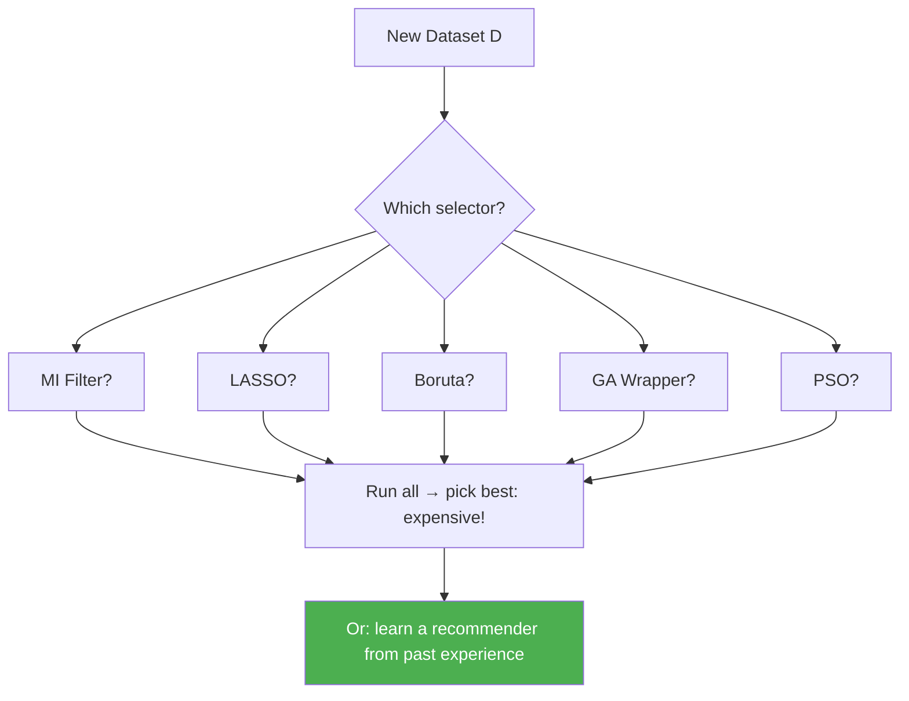
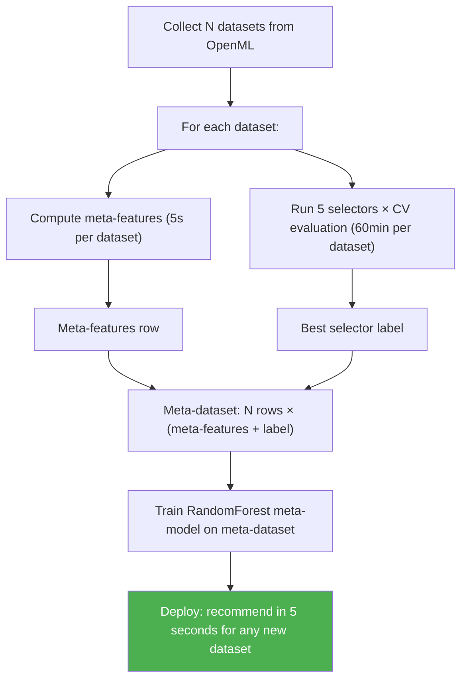
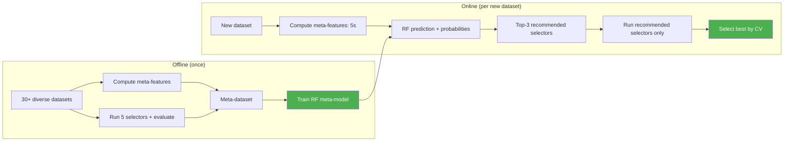
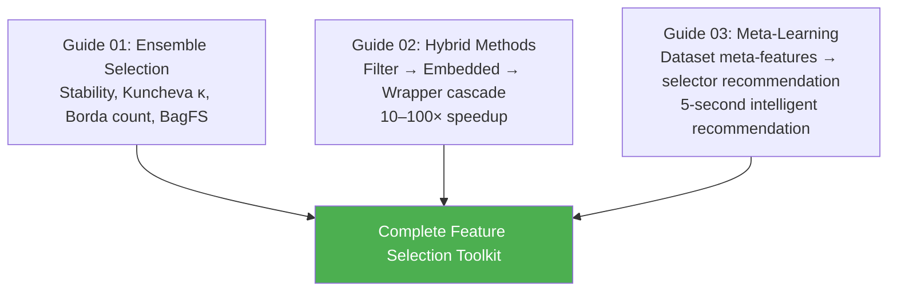

<!-- _class: lead -->
<!-- Speaker notes: This is the third and final guide of Module 10. The key idea: everything we have learned so far (filters, wrappers, embedded methods, evolutionary algorithms, ensembles) requires a human to choose which method to use. Meta-learning removes that choice: we train a model that looks at dataset properties and recommends the best selector. This is the same idea behind AutoML systems like Auto-sklearn and FLAML, but focused specifically on feature selection. By the end of this deck, you will understand how to build, train, and evaluate a meta-learning recommender for feature selection. -->

# Meta-Learning for Feature Selection

**Module 10 — Ensemble & Hybrid Methods**

> Teaching a model to recommend the best feature selection method — automatically, from data.

---

# The Algorithm Selection Problem

Given dataset $\mathcal{D}$, which selector from your portfolio should you use?



$$A^*(\mathcal{D}) = \arg\max_{A \in \mathcal{A}} \text{Performance}(\text{Model}(A(\mathcal{D})))$$

<!-- Speaker notes: The algorithm selection problem (Rice, 1976) is the foundational problem of meta-learning. The naive solution: run all methods and pick the best. This is expensive (hours) and defeats the purpose. The meta-learning solution: observe dataset properties, look up what worked before on similar datasets. Key equation: A* is the algorithm that maximises downstream model performance when applied to D. This is what experienced data scientists do intuitively — meta-learning makes this intuition explicit and learnable from data. -->

---

# The CASH Problem

**Combined Algorithm Selection and Hyperparameter optimisation:**

$$A^*, \lambda^* = \arg\max_{A \in \mathcal{A},\, \lambda \in \Lambda_A} \text{CV}(A(\mathcal{D}; \lambda))$$

<div class="columns">
<div>

**For feature selection, CASH covers:**
- Which selector(s) to use
- Regularisation strength (LASSO λ)
- Number of features to select
- Whether to cascade
- GA population size & generations

</div>
<div>

**AutoML systems solving CASH:**
- Auto-sklearn (Bayesian optimisation)
- FLAML (low-cost search)
- H2O AutoML (grid search)
- TPOT (evolutionary search)

</div>
</div>

> Meta-learning provides warm-start candidates for CASH, dramatically reducing search time.

<!-- Speaker notes: CASH was formalised by Thornton et al. (2013) with Auto-WEKA. It is the theoretical foundation of AutoML. For feature selection specifically, the search space includes which selector to use AND its hyperparameters. Meta-learning's role in CASH: instead of starting the search from scratch, use past experience to identify promising (algorithm, hyperparameter) combinations. This is called warm-starting: Auto-sklearn uses meta-learning to identify the top-25 (algorithm, config) pairs for a new dataset, then runs Bayesian optimisation from those starting points. Result: warm-started AutoML typically finds good solutions 10× faster than cold-started search. -->

---

# Dataset Meta-Features

Properties we can compute cheaply from any dataset:

<div class="columns">
<div>

### Statistical
- n, p, log(n/p) ratio
- Class balance, class entropy
- Feature skewness/kurtosis
- Fraction near-constant

### Information-theoretic
- Mean/max MI with target
- Fraction zero-MI features
- MI Gini coefficient

</div>
<div>

### Correlation structure
- Mean absolute correlation
- Fraction highly correlated (|r| > 0.7)
- Effective rank ratio (PCA 95% var)

### Landmarking
- Decision stump accuracy
- 1-NN accuracy
- Lift over baseline

</div>
</div>

<!-- Speaker notes: These four categories of meta-features are the standard in the AutoML meta-learning literature. Statistical features: basic dataset size and distributional properties. Cheap (O(np)). Information-theoretic: capture the signal structure. How much does the average feature correlate with the target? Correlation structure: captures inter-feature redundancy. Predicts whether methods like LASSO or elastic net will work better. Landmarking: use fast proxy algorithms to characterize dataset difficulty. A dataset where a depth-1 tree achieves 95% accuracy has different structure than one where it achieves 52%. Landmarking is empirically one of the most predictive meta-feature categories. -->

---

# Why Meta-Features Predict Selector Performance

```
log(n/p) is low  →  small sample regime  →  ensemble selection > single method
                                             BagFS wins

mean_abs_corr is high  →  correlated features  →  elastic net > LASSO
                                                    wrapper > filter

frac_zero_mi is high   →  many noise features  →  aggressive filter first
                                                    GA on pre-screened subset

mi_gini is high        →  concentrated signal  →  univariate filter sufficient
                                                    less need for wrappers
```

**These rules are automatically learned from data by the meta-model.**

<!-- Speaker notes: This slide builds intuition for WHY meta-features predict selector performance. Each meta-feature captures a specific property of the dataset that we know (from theory and practice) affects selector behaviour. Low n/p: we are in the small sample regime where single selectors are unreliable. Ensemble methods dominate. High correlation: LASSO is unstable. Elastic net or wrapper methods are better. High frac_zero_mi: most features are noise. A filter as the first stage eliminates noise cheaply. High mi_gini: a few features carry almost all the information. Simple filter ranking is sufficient. The meta-model learns these rules from data and may discover non-obvious patterns. -->

---

# Computing Meta-Features: Code

```python
def compute_all_meta_features(X, y):
    """Compute all meta-features for a dataset in ~5 seconds."""
    mf = {}

    # Basic statistics
    n, p = X.shape
    mf['log_n'] = np.log1p(n)
    mf['log_p'] = np.log1p(p)
    mf['log_ratio_n_p'] = np.log1p(n / p)

    # Correlation structure (subsample for large p)
    corr = np.corrcoef(X[:, :min(p, 200)].T)
    abs_corr = np.abs(corr[np.triu_indices_from(corr, k=1)])
    mf['mean_abs_correlation'] = float(np.mean(abs_corr))
    mf['frac_highly_correlated'] = float(np.mean(abs_corr > 0.7))

    # MI-based features (subsample features for speed)
    mi = mutual_info_classif(X[:, :min(p, 50)], y)
    mf['mean_mi'] = float(np.mean(mi))
    mf['frac_zero_mi'] = float(np.mean(mi < 0.01))

    # Landmarking
    dt1 = DecisionTreeClassifier(max_depth=1, random_state=42)
    mf['dt1_lift'] = cross_val_score(dt1, X, y, cv=3).mean()

    return mf
```

**Total computation time: ~2–10 seconds per dataset.**

<!-- Speaker notes: This is the core code from Notebook 03. Walk through each section. The log transformations are important: n/p ratios span orders of magnitude (1 to 10000). Log makes these comparable. Subsampling features for correlation (min(p, 200)) prevents O(p^2) bottleneck for very high-dimensional data. MI subsampling (min(p, 50)) keeps meta-feature computation fast. Landmarking is the most expensive part (requires CV) — keep it to 3-fold with subsampled data (max 500 samples). Total cost: 2-10 seconds vs hours for running all selectors. This is the "free lunch" of meta-learning. -->

---

# Building the Meta-Dataset



**Trade-off:** expensive offline training → fast online recommendation.

<!-- Speaker notes: The meta-dataset construction is the expensive one-time investment. For N=30 datasets and 5 selectors: 30 × 60 = 1800 minutes ≈ 30 hours of computation. This is done once. After that, recommendations for any new dataset cost only the meta-feature computation (2-10 seconds). This is the classic ML trade-off: amortise expensive offline computation over many online queries. In Notebook 03, we use a much smaller set (10 OpenML datasets) for illustration. OpenML (openml.org) provides hundreds of benchmark datasets and is the standard source for meta-learning experiments. -->

---

# Training the Meta-Model

```python
from sklearn.ensemble import RandomForestClassifier
from sklearn.model_selection import LeaveOneOut

def train_meta_model(meta_df, meta_feature_cols):
    X_meta = meta_df[meta_feature_cols].fillna(0).values
    y_meta = LabelEncoder().fit_transform(meta_df['best_selector'])

    # Leave-One-Dataset-Out CV for unbiased evaluation
    meta_model = RandomForestClassifier(n_estimators=200, random_state=42)
    loo_scores = cross_val_score(meta_model, X_meta, y_meta,
                                 cv=LeaveOneOut(), scoring='accuracy')

    print(f"LODO Top-1 accuracy: {loo_scores.mean():.3f}")  # target: 0.45–0.65
    print(f"Random baseline:     {1/len(np.unique(y_meta)):.3f}")

    meta_model.fit(X_meta, y_meta)
    return meta_model
```

**Why Leave-One-Dataset-Out?**
Standard k-fold would use multiple rows from the same dataset for training and testing — this inflates accuracy.

<!-- Speaker notes: LODO is the correct evaluation methodology for meta-learning. Standard k-fold CV would train and test on rows from the same dataset. If dataset D has 3 runs (different seeds or folds), rows from D would appear in both train and test — this is data leakage. LODO ensures the meta-model is evaluated on completely unseen datasets. Expected accuracy: with 5 selectors, random baseline is 20%. A well-trained meta-model achieves 45-65% top-1 and 75-90% top-3. The meta-model (RF) is appropriate because meta-features are heterogeneous (different scales and types), and RF handles this without normalisation. -->

---

# What Good Recommendations Look Like

| Scenario | Top Meta-Feature Cues | Meta-Recommender Output |
|----------|----------------------|------------------------|
| Genomics (p=20k, n=100) | log_ratio_n_p << 0, mi_gini high | BagFS-LASSO (stability selection) |
| Finance (n=5k, corr high) | frac_highly_correlated > 0.3 | Elastic Net + Walk-forward wrapper |
| Tabular ML (n=10k, balanced) | dt1_lift > 0.2, mi_gini low | RF importance (Boruta) |
| Text (p=50k, sparse) | frac_zero_mi > 0.9 | Chi-squared filter + L1-logistic |

> The meta-recommender learns these associations from data, not hand-coded rules.

<!-- Speaker notes: Walk through each scenario and connect the meta-features to the recommendation. Genomics: n << p is the key signal. log_ratio_n_p is very negative. BagFS-LASSO provides formal FDR guarantees in this regime. Finance: high correlation fraction signals that LASSO will be unstable. Elastic net handles this. Walk-forward wrapper respects temporal ordering. Tabular ML: dt1_lift > 0.2 means a single feature provides significant signal. Text: frac_zero_mi > 0.9 means 90% of features are pure noise. Aggressive filter is essential. The key message: these are the rules that the meta-model learns from data — it may also discover non-obvious patterns. -->

---

# Bayesian Model Averaging over Subsets

Instead of selecting one subset, average over multiple high-performing subsets:

$$P(y^* | x^*, \mathcal{D}) = \sum_{S} P(y^* | x^*_S, \mathcal{D}) \cdot P(S | \mathcal{D})$$

Practical approximation:

```python
def bma_feature_importance(X, y, eval_model, n_subsets=20, top_k=15):
    """Weight feature subsets by their CV performance (BMA approximation)."""
    subset_scores, subset_masks = [], []

    for _ in range(n_subsets):
        subset = np.random.choice(X.shape[1], size=top_k, replace=False)
        mask = np.zeros(X.shape[1], dtype=bool)
        mask[subset] = True
        score = cross_val_score(eval_model, X[:, mask], y, cv=3).mean()
        subset_scores.append(score)
        subset_masks.append(mask)

    # BMA weights = softmax(scores)
    weights = np.exp(np.array(subset_scores) - max(subset_scores))
    weights /= weights.sum()
    importance = sum(w * m for w, m in zip(weights, subset_masks))
    return importance
```

<!-- Speaker notes: BMA is the principled alternative to selecting a single feature subset. Instead of committing to one subset, we maintain uncertainty over which features are relevant. The BMA weight P(S|D) is approximated by exp(cv_score) — subsets that predict well get higher weight. In the limit of many subsets, features that appear in all high-scoring subsets get high importance. Use BMA when you want feature importance scores (for ranking or interpretation) rather than a discrete include/exclude decision. -->

---

# AutoML Feature Selection: FLAML

```python
from flaml import AutoML

automl = AutoML()
automl.fit(
    X_train, y_train,
    task='classification',
    time_budget=120,        # seconds to search
    verbose=0
)

# Best model's feature importances serve as implicit feature ranking
best_model = automl.model.estimator
if hasattr(best_model, 'feature_importances_'):
    importances = best_model.feature_importances_
    ranked = np.argsort(-importances)
    print(f"Top features: {feature_names[ranked[:10]]}")

print(f"Best estimator: {automl.best_estimator}")
print(f"Best CV score: {automl.best_loss:.4f}")
```

**FLAML** selects the model type AND hyperparameters jointly. The best model's feature importances provide implicit feature selection.

<!-- Speaker notes: FLAML is Microsoft's Fast and Lightweight AutoML library. It is faster than Auto-sklearn for small-to-medium time budgets. The implicit feature selection through the best model's importances is a practical approach: AutoML finds the best model, and that model's importances identify which features matter. This is not a replacement for explicit feature selection, but it is a useful baseline for comparison. In practice: run FLAML for 120 seconds, extract importances, compare to your manual ensemble selection. They should largely agree on the top features. If they disagree substantially, that is a signal to investigate further. -->

---

# Evaluating the Meta-Recommender

**Leave-One-Dataset-Out (LODO) evaluation:**

```
For each dataset D:
  1. Train meta-model on all other datasets
  2. Predict best selector for D
  3. Check if prediction matches true best selector
```

| Metric | Random (5 selectors) | Typical LODO result |
|--------|---------------------|---------------------|
| Top-1 accuracy | 20% | 45–65% |
| Top-3 accuracy | 60% | 75–90% |
| Avg rank of best | 3.0 | 1.8–2.5 |

**Top-3 accuracy 75–90%** means: 3 recommended selectors cover the best one in 8/10 cases.

<!-- Speaker notes: These benchmarks come from the meta-learning literature. Your results in Notebook 03 will be lower because we only use 10 datasets for training — in a real setting you'd use 50–200. Top-3 accuracy is the most important practical metric: if the meta-model recommends 3 selectors and the best is in that list, you've reduced a 5-way search to a 3-way search at minimal cost. Average rank of best: 1.8 means the best selector is typically the top-1 or top-2 recommendation. Random baseline: 3.0. With only 10 training datasets, expect top-1 accuracy around 30-40%. This is still better than random (20%) and demonstrates the concept. -->

---

# Meta-Recommender: Full Workflow



<!-- Speaker notes: This diagram summarises the full meta-learning workflow. Left side (offline): done once. Takes hours for 30 datasets but never repeated. Right side (online): fast. For any new dataset, compute meta-features (5s), get recommendations (< 1s), run only the recommended 3 selectors. Total online cost: ~3× the cost of one selector instead of 5× the cost of all selectors. Combined with warm-starting Bayesian optimisation, this reduces total AutoML wall time by 5-10×. This is the production workflow for intelligent feature selection in large-scale ML systems. -->

---

# Limitations and Honest Assessment

<div class="columns">
<div>

**What meta-learning does well:**
- Narrows the selector search space
- Provides principled warm-start
- Captures domain expertise as data
- Scales to new datasets without manual tuning

</div>
<div>

**What it doesn't do:**
- Guarantee the best selector is recommended
- Handle distribution shift in meta-features
- Work well with < 20 training datasets
- Replace domain knowledge for novel problems

</div>
</div>

> **Practical guidance:** use meta-learning to identify top-3 candidates, then validate with cross-validation on your actual data. Never skip validation.

<!-- Speaker notes: Honest assessment is important here. Meta-learning is a powerful tool but not a silver bullet. The main limitation: generalisation requires diverse training data. If all your training datasets are financial time series, the recommender will be biased. Distribution shift: if your production dataset has characteristics outside the range of training datasets (e.g., much larger n/p ratio), predictions degrade. The 20-dataset minimum is a rough rule of thumb. Key message: meta-learning reduces exploration cost but doesn't eliminate the need to validate recommendations on the actual task. -->

---

# Summary of Module 10



**Module 10 completes your feature selection toolkit:**
- **Ensemble** for stability when data is noisy or small
- **Hybrid** for computational efficiency when p is large
- **Meta-learning** for automated method selection

> **Next: Module 11 — Production Feature Selection** → deployment, monitoring, drift detection.

<!-- Speaker notes: This is the capstone of Module 10. The three guides complement each other: ensemble addresses instability, hybrid addresses computation, meta-learning addresses method selection. Together they form a complete advanced framework that practitioners can apply immediately. Module 11 closes the course with the production perspective: how do you deploy, monitor, and maintain feature selection pipelines in real systems? Encourage learners to complete all three notebooks before moving to Module 11. -->
