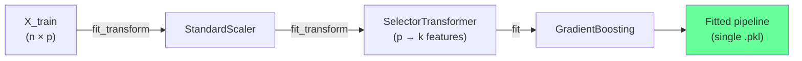

<!-- _class: lead -->
<!-- Speaker notes: This deck covers the production engineering of feature selection — moving from research notebook to deployed pipeline. The central problem is leakage: when you select features outside the cross-validation loop, your validation scores are lying to you. Pipelines fix this automatically. -->

# Feature Selection in sklearn Pipelines
## From Research Code to Production Estimators

### Module 11 — Production Feature Selection Pipelines

Build, cross-validate, tune, and serialise leak-free feature selection pipelines

---

<!-- Speaker notes: Start with the motivation. Most teams get burned by this at least once: they select features on the full dataset, cross-validate the model, and deploy — then see significantly worse real-world performance. A Pipeline is the cure. -->

## The Leakage Problem

<div class="columns">
<div>

**WRONG — selection outside CV:**

```python
# Selector sees ALL folds
selector.fit(X, y)
X_sel = selector.transform(X)

# Validation contaminated
cv_score = cross_val_score(
    model, X_sel, y, cv=5
)
```

Result: **optimistically biased** score

</div>
<div>

**RIGHT — selection inside Pipeline:**

```python
pipeline = Pipeline([
    ('selector', SelectorTransformer(...)),
    ('model',    GradientBoosting()),
])

# Selection refitted each fold
cv_score = cross_val_score(
    pipeline, X, y, cv=5
)
```

Result: **honest** generalisation score

</div>
</div>

> Every fold runs its own independent selection. No information crosses the fold boundary.

<!-- Speaker notes: The wrong version is far more common than people admit. If you have ever fitted a selector on X_train then cross-validated the model, you have this bug. The validation fold influences which features are selected because the selector saw it during fit. -->

---

<!-- Speaker notes: The fit/transform interface is the contract that every Pipeline step must honour. Focus on the three required methods and why each exists. TransformerMixin gives you fit_transform for free, which is important for Pipeline internals. -->

## The fit/transform Contract

```python
from sklearn.base import BaseEstimator, TransformerMixin

class MySelector(BaseEstimator, TransformerMixin):

    def fit(self, X, y=None):
        # Learn from training data
        # Store all learned state in self.*_
        self.support_ = ...    # trailing underscore = fitted attribute
        return self            # MUST return self

    def transform(self, X):
        # Apply learned state — NO access to y
        # Returns same n_samples, fewer columns
        return X[:, self.support_]

    def get_feature_names_out(self, input_features=None):
        # Required for name propagation (sklearn 1.0+)
        return self.feature_names_in_[self.support_]
```

- `BaseEstimator` → free `get_params` / `set_params` → Grid search works
- `TransformerMixin` → free `fit_transform` → Pipeline works
- Trailing underscores mark fitted attributes (sklearn convention)

<!-- Speaker notes: Emphasise the trailing underscore convention. sklearn uses it consistently to distinguish hyperparameters from fitted state. check_is_fitted looks for these underscored attributes to detect whether fit has been called. -->

---

<!-- Speaker notes: Walk through the wrapper implementation carefully. The key details are: storing feature_names_in_ for name propagation, accepting both DataFrames and ndarrays, and using check_is_fitted for helpful error messages. -->

## Wrapping Any Selector

```python
from sklearn.utils.validation import check_is_fitted

class SelectorTransformer(BaseEstimator, TransformerMixin):
    """Wraps any sklearn selector into a Pipeline-compatible step."""

    def __init__(self, selector):
        self.selector = selector

    def fit(self, X, y):
        # Capture feature names — works for DataFrame or ndarray
        if hasattr(X, 'columns'):
            self.feature_names_in_ = np.array(X.columns)
        else:
            self.feature_names_in_ = np.array([f'x{i}'
                                               for i in range(X.shape[1])])
        self.selector.fit(X, y)
        self.support_ = self.selector.get_support()
        return self

    def transform(self, X):
        check_is_fitted(self, 'support_')          # clear error if not fitted
        if hasattr(X, 'iloc'):
            return X.iloc[:, self.support_]
        return X[:, self.support_]

    def get_feature_names_out(self, input_features=None):
        check_is_fitted(self, 'support_')
        return self.feature_names_in_[self.support_]
```

<!-- Speaker notes: check_is_fitted is underused. Without it, calling transform before fit gives a cryptic AttributeError. With it, the user gets "This SelectorTransformer instance is not fitted yet." which is immediately actionable. -->

---

<!-- Speaker notes: The Pipeline composition slide shows the canonical three-step pattern. Emphasise that the pipeline IS an estimator — it exposes fit, predict, predict_proba, score. You hand it to GridSearchCV exactly as you would hand it a model. -->

## Pipeline Composition

```python
from sklearn.pipeline import Pipeline
from sklearn.preprocessing import StandardScaler
from sklearn.feature_selection import SelectFromModel
from sklearn.ensemble import RandomForestClassifier, GradientBoostingClassifier

# Build selector: keep features above median importance
rf_selector = SelectFromModel(
    estimator=RandomForestClassifier(n_estimators=100, random_state=42),
    threshold='median',
)

pipeline = Pipeline([
    ('scaler',   StandardScaler()),
    ('selector', SelectorTransformer(rf_selector)),
    ('model',    GradientBoostingClassifier(n_estimators=200, random_state=42)),
])

# The pipeline is a single estimator
pipeline.fit(X_train, y_train)
score = pipeline.score(X_test, y_test)
```



<!-- Speaker notes: Draw attention to the mermaid diagram. During fit, every step except the last calls fit_transform. During predict, every step except the last calls transform. The pipeline handles all orchestration. -->

---

<!-- Speaker notes: ColumnTransformer handles mixed data types. The key point is that after ColumnTransformer, all columns are numeric regardless of their original type. SelectKBest then operates on the flattened output. Show how get_feature_names_out propagates mangled names. -->

## ColumnTransformer Integration

```python
from sklearn.compose import ColumnTransformer
from sklearn.preprocessing import StandardScaler, OneHotEncoder
from sklearn.feature_selection import SelectKBest, f_classif

numeric_cols     = ['price', 'volume', 'volatility', 'rsi', 'macd']
categorical_cols = ['sector', 'exchange', 'market_cap_bucket']

preprocessor = ColumnTransformer([
    ('num', StandardScaler(),
             numeric_cols),
    ('cat', OneHotEncoder(handle_unknown='ignore', sparse_output=False),
             categorical_cols),
])

pipeline = Pipeline([
    ('preprocess', preprocessor),
    ('selector',   SelectKBest(f_classif, k=10)),
    ('model',      GradientBoostingClassifier(random_state=42)),
])
```

Feature names after ColumnTransformer: `num__price`, `cat__sector_Technology`, ...

Enable name propagation: `pipeline.set_output(transform='pandas')`

<!-- Speaker notes: The name mangling (num__price, cat__sector_Technology) is a common surprise. Point out that set_output('pandas') makes this visible in every DataFrame returned by transform — very helpful for debugging. -->

---

<!-- Speaker notes: Cross-validation is where the rubber meets the road. Show the correct pattern and explain what happens at each fold. The key message: each fold runs fit on training data only, then score on validation data using parameters learned from training data only. -->

## Cross-Validation: The Right Way

```python
from sklearn.model_selection import StratifiedKFold, cross_validate

cv = StratifiedKFold(n_splits=5, shuffle=True, random_state=42)

results = cross_validate(
    pipeline, X, y,
    cv=cv,
    scoring=['roc_auc', 'f1'],
    return_train_score=True,
    n_jobs=-1,
)

print(f"Val AUC: {results['test_roc_auc'].mean():.4f} "
      f"± {results['test_roc_auc'].std():.4f}")
```

**What happens at each fold:**

| Step | Training fold | Validation fold |
|------|--------------|-----------------|
| Scaler | `fit_transform` | `transform` only |
| Selector | `fit_transform` | `transform` only |
| Model | `fit` | `predict` / `score` |

> Validation fold never influences any fitted parameter.

<!-- Speaker notes: The table is the key deliverable from this slide. Print it out and put it on your wall if you need to. The validation fold is ONLY ever passed through transform/predict — never through fit or fit_transform. -->

---

<!-- Speaker notes: Grid search over both selector and model hyperparameters simultaneously. The double underscore syntax is the key. Show that the selector's selector's threshold is three levels deep. This is common with wrapped selectors. -->

## Hyperparameter Tuning Across the Pipeline

```python
from sklearn.model_selection import GridSearchCV

param_grid = {
    # Selector parameters (double underscore = nested access)
    'selector__selector__threshold':              ['mean', 'median', '0.5*mean'],
    'selector__selector__estimator__n_estimators': [50, 100, 200],
    # Model parameters
    'model__n_estimators': [100, 200],
    'model__max_depth':    [3, 5],
}

grid_search = GridSearchCV(
    pipeline,
    param_grid,
    cv=cv,
    scoring='roc_auc',
    n_jobs=-1,
    refit=True,  # refit best model on full training set
)
grid_search.fit(X_train, y_train)

print(f"Best params: {grid_search.best_params_}")
print(f"Best CV AUC: {grid_search.best_score_:.4f}")
```

> Every grid point is independently cross-validated with selection re-run from scratch inside each fold.

<!-- Speaker notes: Point out that `refit=True` means after finding the best parameters, sklearn refits the entire pipeline on all of X_train. The resulting `grid_search.best_estimator_` is what you deploy. -->

---

<!-- Speaker notes: Stability selection is the gold standard for production because it answers: "would this feature be selected if we had slightly different data?" Features with high selection frequency are robust; features with low frequency are artifacts. -->

## Stability Selection Transformer

```python
class StabilitySelector(BaseEstimator, TransformerMixin):
    """Keep features selected in >= threshold fraction of bootstrap runs."""

    def __init__(self, base_selector, n_bootstrap=100,
                 threshold=0.8, subsample=0.5, random_state=42):
        self.base_selector = base_selector
        self.n_bootstrap   = n_bootstrap
        self.threshold     = threshold
        self.subsample     = subsample
        self.random_state  = random_state

    def fit(self, X, y):
        rng = np.random.default_rng(self.random_state)
        counts = np.zeros(X.shape[1], dtype=int)
        X_arr, y_arr = (X.values if hasattr(X, 'values') else X), np.asarray(y)

        for _ in range(self.n_bootstrap):
            seed = int(rng.integers(0, 2**31))
            X_b, y_b = resample(X_arr, y_arr,
                n_samples=int(len(y_arr) * self.subsample),
                random_state=seed)
            sel = clone(self.base_selector)
            sel.fit(X_b, y_b)
            counts += sel.get_support().astype(int)

        self.selection_scores_ = counts / self.n_bootstrap
        self.support_ = self.selection_scores_ >= self.threshold
        self.feature_names_in_ = (np.array(X.columns) if hasattr(X, 'columns')
                                   else np.arange(X.shape[1]).astype(str))
        return self
```

<!-- Speaker notes: Walk through the bootstrap loop. Each iteration: subsample 50% of training data, clone and refit the base selector, record which features were selected. After n_bootstrap iterations, the selection_scores_ tell you how often each feature was selected. -->

---

<!-- Speaker notes: Serialisation is critical for production. joblib is preferred over pickle for pipelines with large numpy arrays because it uses memory mapping. The assert at the end is not optional — always verify that predictions are identical after reload. -->

## Serialisation and Reload

```python
import joblib
import pathlib

# Serialise the full fitted pipeline
model_path = pathlib.Path('artefacts/feature_pipeline_v1.pkl')
model_path.parent.mkdir(parents=True, exist_ok=True)
joblib.dump(grid_search.best_estimator_, model_path)

# Reload and verify
loaded = joblib.load(model_path)
selector_step = loaded.named_steps['selector']

print("Features preserved after reload:")
for name in selector_step.get_feature_names_out():
    print(f"  {name}")

# Predictions must be byte-identical
y_orig   = grid_search.best_estimator_.predict_proba(X_test)[:, 1]
y_loaded = loaded.predict_proba(X_test)[:, 1]
assert np.allclose(y_orig, y_loaded), "Prediction mismatch after reload"
print("Serialisation verified.")
```

**Production checklist:**
- Version artefact filenames: `pipeline_v1.pkl`, `pipeline_v2.pkl`
- Store feature names alongside the pkl: `pipeline_v1_features.json`
- Test reload in a fresh Python process (import conflicts are common)

<!-- Speaker notes: The "fresh Python process" note is important. If you reload in the same process, you might be using cached imports. A true reload test imports the pkl in a subprocess with no shared state. -->

---

<!-- Speaker notes: Pipeline gotchas — these are the sharp edges that burn practitioners. Spend extra time on the feature name propagation issue because it causes silent errors that are hard to debug in production. -->

## Common Gotchas

<div class="columns">
<div>

**Feature name propagation**
```python
# Enable DataFrame output at every step
from sklearn import set_config
set_config(transform_output='pandas')

# Now pipeline.transform() returns DataFrames
# with correct column names throughout
```

**Caching expensive steps**
```python
from joblib import Memory
memory = Memory(location='cache/', verbose=0)
pipeline = Pipeline([...], memory=memory)
# Cached steps skip re-computation
```

</div>
<div>

**No inverse_transform for selectors**
```python
# Manually decode selected features
def selected_names(pipeline):
    sel = pipeline.named_steps['selector']
    return sel.get_feature_names_out()
```

**Pickle fails with lambdas**
```python
# WRONG — lambda not picklable
FunctionTransformer(lambda x: x**2)

# RIGHT — named function is picklable
def square(x): return x**2
FunctionTransformer(square)
```

</div>
</div>

<!-- Speaker notes: The lambda gotcha trips up many people who use FunctionTransformer for quick data transforms. Named functions are picklable; lambda functions are not. This manifests as a PicklingError only when you try to serialise, not during development. -->

---

<!-- Speaker notes: Concrete production example — a commodity price forecasting pipeline with 500+ features reduced to a stable subset using stability selection. Show the full pattern from raw data to deployed artifact. -->

## Production Example: Commodity Features

```python
from sklearn.linear_model import LassoCV

# 500+ engineered features → stable subset
commodity_pipeline = Pipeline([
    ('scaler',    StandardScaler()),
    ('stability', StabilitySelector(
        base_selector=SelectFromModel(
            LassoCV(cv=5, random_state=42), threshold='mean'
        ),
        n_bootstrap=200,
        threshold=0.75,
    )),
    ('model',     GradientBoostingClassifier(
        n_estimators=300, max_depth=4, random_state=42
    )),
], memory=Memory('cache/'))

commodity_pipeline.fit(X_train, y_train)

# Inspect selected feature frequencies
selector = commodity_pipeline.named_steps['stability']
scores   = selector.get_selection_scores()
print(f"Selected {selector.support_.sum()} / {len(selector.support_)} features")
print(scores.head(10))
```

Real-world result: 23 features selected from 512 (95.5% reduction), OOS AUC 0.71 vs baseline 0.68.

<!-- Speaker notes: The real-world numbers are from a commodity trading signal paper. 23 stable features outperformed 512 raw features by 4% AUC because the model wasn't fitting noise. Stability selection is particularly valuable in finance where n is small relative to p. -->

---

<!-- Speaker notes: Summarise the key patterns. These are the engineering decisions learners need to internalise to ship production feature selection systems. -->

## Key Takeaways

| Pattern | Production Benefit |
|---------|-------------------|
| Selection inside Pipeline | Zero data leakage, guaranteed |
| `get_feature_names_out` | Auditable feature lists at every step |
| `check_is_fitted` | Clear error messages in production |
| `joblib.dump/load` + assert | Verified serialisation |
| `GridSearchCV` over full pipeline | Honest hyperparameter search |
| `StabilitySelector` | Robust features, not noise artifacts |
| `Memory` cache | Fast iteration on expensive selectors |

---

<!-- Speaker notes: Connections slide. Emphasise that the pipeline pattern is the foundation for everything in Module 11. Drift monitoring (next guide) wraps the pipeline in a monitoring harness. MLflow (guide 3) logs the pipeline artifact. -->

## Connections

<div class="columns">
<div>

**Builds On:**
- Module 03: Wrapper methods (RFE → custom transformer)
- Module 04: Embedded methods (SelectFromModel)
- Module 10: Ensemble selection (any selector wraps)

</div>
<div>

**Leads To:**
- Guide 02: Drift monitoring around the pipeline
- Guide 03: MLflow logging of pipeline artifacts
- Notebook 01: Full pipeline implementation

</div>
</div>

> A Pipeline is not just a convenience — it is the production boundary that separates research code from deployed models.

<!-- Speaker notes: Close with the philosophical point. Research code can afford to leak. Production code cannot. The Pipeline is the discipline mechanism that enforces correct data flow at scale. -->
