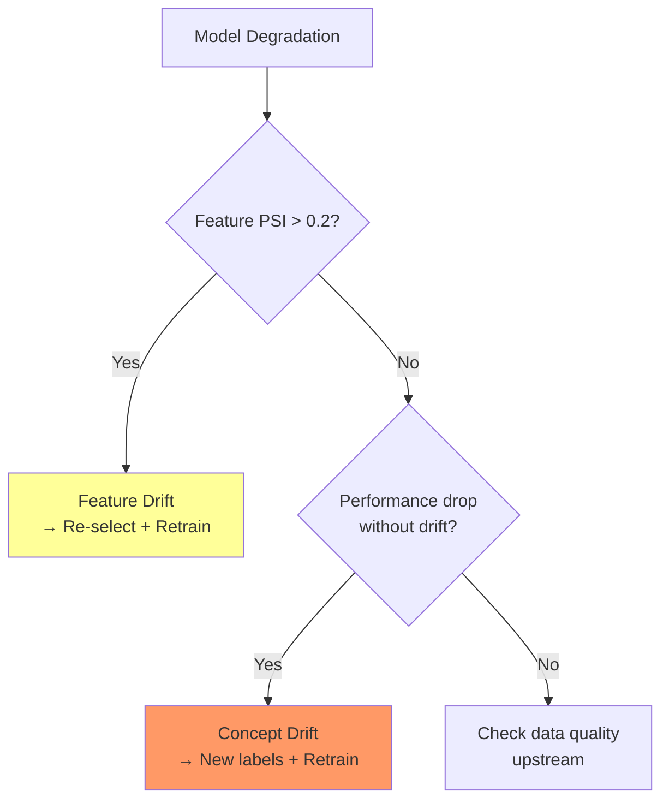

<!-- _class: lead -->
<!-- Speaker notes: This deck covers the production monitoring problem: what happens to your feature selection after deployment? Features don't stay stable. The world changes. Today we build the instrumentation to detect those changes and respond automatically. -->

# Feature Drift Monitoring and Adaptive Re-Selection
## Keeping Deployed Feature Sets Current

### Module 11 — Production Feature Selection Pipelines

Detect distribution shift before it degrades your model

---

<!-- Speaker notes: Start with a concrete failure scenario. A credit scoring model trained in 2019 deployed without monitoring. COVID hits in 2020. Income distributions shift, employment patterns change. The model keeps scoring as if nothing happened. The business doesn't notice for months. This is the drift problem. -->

## Why Monitoring Matters

```
Training Day                    Serving Day (6 months later)
────────────────────────────    ────────────────────────────
income: N(50k, 15k)             income: N(38k, 22k)  ← shifted
employment: 92% employed        employment: 78% employed ← shifted
credit_util: mean 0.35          credit_util: mean 0.61  ← shifted

Model trained on 2019 data      Model scoring 2020 data
AUC at training:   0.82         AUC at serving:   0.71  ← degraded
```

**What went wrong?** The features the model was trained to use no longer represent the same thing in production.

**The solution:** Monitor input distributions continuously. Trigger re-selection when drift is detected.

<!-- Speaker notes: These numbers are illustrative of the COVID economic shock. Similar patterns appear in commodity markets during regime changes, in fraud detection as fraud patterns evolve, and in recommendation systems as user behaviour shifts seasonally. -->

---

<!-- Speaker notes: PSI is the most widely deployed drift metric in industry, especially in banking and insurance. Its simplicity and interpretable thresholds made it a standard before statistical testing was widely understood in MLOps. -->

## Population Stability Index (PSI)

Split each feature into $B$ bins on the reference distribution, count proportions in each bin for reference and current data:

$$\text{PSI}(p, q) = \sum_{i=1}^{B} \left(q_i - p_i\right) \ln \frac{q_i}{p_i}$$

This equals the symmetric KL divergence: $\text{KL}(q \| p) + \text{KL}(p \| q)$

**Decision thresholds (industry standard):**

| PSI | Status | Action |
|-----|--------|--------|
| < 0.10 | Stable | Monitor only |
| 0.10 – 0.20 | Warning | Investigate; consider re-selection |
| > 0.20 | Critical | Re-select features immediately |

> PSI requires no distributional assumption. Runs in O(n). Industry standard in credit risk.

<!-- Speaker notes: The thresholds (0.1, 0.2) are empirical conventions from the credit scoring world. They work well in practice but have no formal statistical basis — that's what the KS test provides. Use PSI for operational dashboards and KS for statistical reporting. -->

---

<!-- Speaker notes: Walk through the implementation carefully. The key insight is that bins MUST be defined on the reference distribution and then applied to the current distribution. If you bin each independently, the bins don't correspond and PSI is meaningless. -->

## PSI Implementation

```python
def compute_psi(reference, current, n_bins=10, eps=1e-6):
    """
    PSI with percentile-based bins from reference distribution.
    Bins defined on reference, applied identically to current.
    """
    # CRITICAL: bins from reference only
    bin_edges = np.percentile(reference, np.linspace(0, 100, n_bins + 1))
    bin_edges[0]  -= 1e-10   # include minimum
    bin_edges[-1] += 1e-10   # include maximum

    ref_counts = np.histogram(reference, bins=bin_edges)[0]
    cur_counts = np.histogram(current,   bins=bin_edges)[0]

    # Smooth to avoid log(0) — must normalise after smoothing
    ref_props = (ref_counts / ref_counts.sum()) + eps
    cur_props = (cur_counts / cur_counts.sum()) + eps
    ref_props /= ref_props.sum()
    cur_props /= cur_props.sum()

    return float(np.sum((cur_props - ref_props) * np.log(cur_props / ref_props)))
```

**Common mistake:** Defining bins separately on reference and current. This produces incomparable proportions. Always anchor bins to the reference.

<!-- Speaker notes: Show the bins-on-reference point. If income bins in reference are [0-40k, 40k-60k, 60k+] and you re-bin current data as [0-35k, 35k-50k, 50k+], the proportions don't compare. PSI would be meaningless even if the distributions are identical. -->

---

<!-- Speaker notes: The KS test provides what PSI does not: a formal p-value. The tradeoff is that p-values require adjustment for multiple comparisons — if you test 100 features at alpha=0.05, you expect 5 false positives even if there's no drift. -->

## Kolmogorov-Smirnov Test

Two-sample KS test compares empirical CDFs:

$$D_{n,m} = \sup_x |F_n(x) - G_m(x)|$$

```python
from scipy.stats import ks_2samp

def ks_drift_report(reference_df, current_df, alpha=0.05):
    """KS test for all features with Bonferroni correction."""
    n_features = len(reference_df.columns)
    alpha_corrected = alpha / n_features   # Bonferroni

    rows = []
    for col in reference_df.columns:
        stat, pval = ks_2samp(reference_df[col].values, current_df[col].values)
        rows.append({
            'feature': col,
            'ks_stat': stat,
            'pvalue':  pval,
            'drifted': pval < alpha_corrected,  # corrected threshold
        })
    df = pd.DataFrame(rows).sort_values('ks_stat', ascending=False)
    print(f"Drifted: {df['drifted'].sum()}/{n_features} "
          f"(Bonferroni alpha={alpha_corrected:.4f})")
    return df
```

**KS advantages:** No binning required; exact p-values; sensitive to shape and tail differences.

<!-- Speaker notes: Bonferroni is conservative but simple. Benjamini-Hochberg (FDR control) is less conservative if you have many features. For monitoring dashboards with human review, Bonferroni is usually the right choice because false positives are expensive. -->

---

<!-- Speaker notes: Wasserstein distance is the mathematically richest drift metric. It quantifies HOW FAR the distribution has moved, not just whether it has moved. This is useful for ranking features by drift severity and for setting adaptive alert thresholds. -->

## Wasserstein Distance

Earth Mover's Distance — minimum work to transform reference into current distribution:

$$W_1(p, q) = \int_{-\infty}^{\infty} |F_p(x) - F_q(x)| \, dx$$

For empirical samples: L1 distance between sorted values.

```python
from scipy.stats import wasserstein_distance

def wasserstein_normalised(reference, current):
    """Wasserstein distance normalised by reference std."""
    w1     = wasserstein_distance(reference, current)
    ref_std = reference.std()
    return w1 / ref_std if ref_std > 0 else 0.0

# Rank features by drift severity
drift_ranking = pd.Series({
    col: wasserstein_normalised(ref[col].values, cur[col].values)
    for col in ref.columns
}).sort_values(ascending=False)
```

**When to use Wasserstein over PSI:**
- When you need to rank drifted features by severity
- When drift is gradual and you want a continuous magnitude signal
- When tails matter (Wasserstein is sensitive to outlier shifts)

<!-- Speaker notes: The normalisation by reference std is important. Without it, high-variance features (like commodity prices in volatile markets) will always dominate. Normalised Wasserstein puts all features on a comparable scale in units of "standard deviations of shift." -->

---

<!-- Speaker notes: This slide is the conceptual core of the deck. Feature drift and concept drift are often confused, and the confusion leads to wrong remediation. If you apply the wrong fix, you waste compute and potentially make things worse. -->

## Feature Drift vs. Concept Drift

<div class="columns">
<div>

**Feature Drift**
$p_{train}(X) \neq p_{serve}(X)$

*The inputs changed*

Detection: PSI / KS / Wasserstein on features

Response:
- Re-calibrate scaler/encoder
- Re-select features on recent data
- May need to retrain model

</div>
<div>

**Concept Drift**
$p_{train}(Y|X) \neq p_{serve}(Y|X)$

*The relationship changed*

Detection: Monitor model performance (needs labels)

Response:
- Collect new labelled data
- Retrain (or fine-tune) model
- May need domain expert review

</div>
</div>



<!-- Speaker notes: Walk through the decision tree. The key branch is: is PSI high? If yes, feature drift. If PSI is low but performance is falling, that's concept drift. Both are real problems; both need different responses. In commodity markets, you often see both simultaneously during regime changes. -->

---

<!-- Speaker notes: The trigger system is the operational heart of adaptive re-selection. Show all three trigger types and explain when each fires. The combination of all three is the industry best practice. -->

## Adaptive Re-Selection Triggers

```python
@dataclass
class ReSelectionTrigger:
    psi_threshold:            float = 0.2
    psi_fraction_threshold:   float = 0.2   # 20% of features critical
    ks_fraction_threshold:    float = 0.3   # 30% of features drifted
    max_days_since_selection: int   = 30    # monthly scheduled trigger
    last_selection_date: datetime.date = field(
        default_factory=datetime.date.today
    )

    def should_reselect(self, reference, current):
        # 1. Scheduled: time-based safety net
        if days_since(self.last_selection_date) >= self.max_days_since_selection:
            return True, "Scheduled trigger"

        # 2. PSI: operational threshold crossing
        psi_report = compute_psi_dataframe(reference, current)
        if (psi_report['psi'] > self.psi_threshold).mean() >= self.psi_fraction_threshold:
            return True, "PSI trigger"

        # 3. KS: statistical evidence
        ks_report = ks_drift_report(reference, current)
        if ks_report['drifted'].mean() >= self.ks_fraction_threshold:
            return True, "KS trigger"

        return False, "No trigger"
```

<!-- Speaker notes: The three-trigger system provides defense in depth. PSI fires fast but has no statistical guarantee. KS provides statistical rigor but can miss slow drift. The scheduled trigger is the safety net that catches everything else — even if your monitoring has a bug, you re-select monthly. -->

---

<!-- Speaker notes: The A/B testing slide is critical for teams that need to justify feature set changes to stakeholders. You can't just deploy a new feature set and declare victory — you need statistical evidence that it's actually better. -->

## A/B Testing Feature Sets

When re-selection proposes a new feature set, validate it statistically before full deployment:

```python
from scipy.stats import mannwhitneyu

def ab_test_feature_sets(scores_control, scores_treatment, alpha=0.05):
    """Compare model performance between two feature sets."""
    stat, pvalue = mannwhitneyu(
        scores_treatment, scores_control, alternative='greater'
    )
    lift = np.mean(scores_treatment) - np.mean(scores_control)
    return {
        'lift':           float(lift),
        'pvalue':         float(pvalue),
        'significant':    pvalue < alpha,
        'recommendation': 'promote' if (pvalue < alpha and lift > 0) else 'keep_control',
    }

# Required sample size before running the test
def ab_sample_size(sigma, mde, alpha=0.05, power=0.8):
    z_a, z_b = scipy_norm.ppf(1 - alpha/2), scipy_norm.ppf(power)
    return int(np.ceil(2 * (z_a + z_b)**2 * sigma**2 / mde**2))

n_needed = ab_sample_size(sigma=0.15, mde=0.01)
print(f"Need {n_needed:,} observations per variant for MDE=0.01 AUC")
```

**Protocol:** Run control and treatment in parallel for `n_needed` observations. Only promote treatment if `pvalue < alpha` AND `lift > 0`.

<!-- Speaker notes: Mann-Whitney U is preferred over t-test for AUC and probability scores because it makes no normality assumption. The one-sided alternative ('greater') tests whether treatment beats control — not just that they differ. This is the correct framing for a "should we switch?" decision. -->

---

<!-- Speaker notes: Online selection is for truly streaming environments where you can't accumulate a full dataset before re-selecting. The EMA is the key algorithmic idea — it smooths out noise while still adapting to regime changes. -->

## Online Evolutionary Feature Selection

For streaming data, maintain an exponential moving average of feature importance:

```python
class OnlineFeatureSelector:
    """Incremental selection with sliding window + EMA importance."""

    def __init__(self, n_features, k=10, window=1000,
                 ema_alpha=0.1, update_every=100):
        self.k, self.ema_alpha, self.update_every = k, ema_alpha, update_every
        self.buffer_X  = deque(maxlen=window)
        self.buffer_y  = deque(maxlen=window)
        self.ema_scores = np.zeros(n_features)
        self.n_observed = 0

    def update(self, x, y):
        self.buffer_X.append(x)
        self.buffer_y.append(y)
        self.n_observed += 1
        if self.n_observed % self.update_every == 0:
            return self._recompute()
        return None

    def _recompute(self):
        X_w = np.array(self.buffer_X)
        y_w = np.array(self.buffer_y)
        rf = RandomForestClassifier(n_estimators=30, random_state=42)
        rf.fit(X_w, y_w)
        # EMA update: new information blended with history
        self.ema_scores = (self.ema_alpha * rf.feature_importances_
                           + (1 - self.ema_alpha) * self.ema_scores)
        return np.argsort(self.ema_scores)[-self.k:]
```

<!-- Speaker notes: The EMA alpha=0.1 means each recomputation contributes 10% of the new signal and retains 90% of history. High alpha = fast adaptation but noisy. Low alpha = stable but slow. Tune based on how quickly your regime changes. In commodity markets during crises, you might want alpha=0.3. In stable markets, alpha=0.05. -->

---

<!-- Speaker notes: Visualisation is critical for monitoring dashboards. The key charts are: PSI over time per feature (heat map), count of features above threshold over time (line chart), and model performance correlated with drift events. -->

## Monitoring Dashboard Pattern

```python
import matplotlib.pyplot as plt
import matplotlib.dates as mdates

def plot_drift_timeline(drift_history: pd.DataFrame, thresholds=(0.1, 0.2)):
    """
    Visualise PSI over time for all features.

    drift_history: DataFrame with columns [date, feature, psi]
    """
    fig, (ax1, ax2) = plt.subplots(2, 1, figsize=(14, 8), sharex=True)

    # Top: PSI heat map (features × time)
    pivot = drift_history.pivot(index='feature', columns='date', values='psi')
    im = ax1.imshow(pivot, aspect='auto', cmap='RdYlGn_r', vmin=0, vmax=0.3)
    ax1.set_title('Feature PSI Over Time (green=stable, red=critical)')
    ax1.set_yticks(range(len(pivot.index)))
    ax1.set_yticklabels(pivot.index, fontsize=7)
    plt.colorbar(im, ax=ax1, label='PSI')

    # Bottom: count of drifted features over time
    n_critical = (drift_history[drift_history['psi'] > thresholds[1]]
                  .groupby('date').size())
    ax2.bar(n_critical.index, n_critical.values, color='#d62728', alpha=0.7)
    ax2.axhline(y=len(pivot.index) * 0.2, color='orange',
                linestyle='--', label='20% threshold')
    ax2.set_ylabel('Features PSI > 0.2')
    ax2.set_title('Re-selection Trigger Signal')
    ax2.legend()

    plt.tight_layout()
    return fig
```

<!-- Speaker notes: The heat map at the top gives an immediate visual of which features are drifting and when. The bar chart at the bottom translates to a trigger signal — when bars exceed the orange line, re-selection fires. In practice, this dashboard is reviewed daily by the MLOps team. -->

---

<!-- Speaker notes: Common pitfalls slide — these are the mistakes that slip through code review and only manifest in production. Spend extra time on the multiple testing issue because it's the most insidious: your monitoring looks fine statistically but you're getting false positives on stable features. -->

## Common Pitfalls

| Pitfall | Consequence | Fix |
|---------|-------------|-----|
| Binning reference and current separately | PSI is meaningless — comparable bins don't exist | Always anchor bins to reference distribution |
| No PSI smoothing | `log(0)` on empty bins → NaN | Add `eps=1e-6` before computing |
| No multiple testing correction in KS | ~5% false positive rate per feature | Bonferroni: `alpha / n_features` |
| Confusing feature drift with concept drift | Wrong remediation (re-select when you should retrain) | Monitor both; diagnose before acting |
| Online selector EMA alpha too high | Noisy selection thrashing every update | Tune alpha on historical regime transitions |

<!-- Speaker notes: The "wrong remediation" pitfall is expensive. Re-selection is compute-intensive. If concept drift is the actual problem, re-selection won't help — you need new labels and retraining. Monitoring both feature distributions and model performance (when labels are available) is the only way to distinguish them reliably. -->

---

<!-- Speaker notes: The industry case studies ground the abstract concepts. Commodity forecasting, credit scoring, and fraud detection have very different drift patterns and therefore different monitoring needs. -->

## Industry Drift Patterns

<div class="columns">
<div>

**Commodity Trading**
- Regime changes (bull/bear) shift correlations
- Seasonality in raw features (weather, harvest)
- PSI trigger: monthly re-selection
- Window: rolling 252 trading days

**Credit Scoring**
- Macroeconomic cycles shift income distributions
- Regulatory requirement: quarterly drift reports
- KS test required for regulatory submission
- Concept drift during economic crises

</div>
<div>

**Fraud Detection**
- Fraud patterns evolve weekly
- Adversarial drift (fraudsters adapt)
- Online selection mandatory — can't wait
- Wasserstein used to rank feature priority
- EMA alpha = 0.2 (fast adaptation needed)

</div>
</div>

<!-- Speaker notes: The fraud detection case is qualitatively different from the others. In commodity and credit, drift is driven by macroeconomic forces and is relatively slow. In fraud, drift is adversarially driven — fraudsters learn from being caught and change their patterns. Online selection with fast EMA is the only viable approach. -->

---

## Key Takeaways

| Metric | Best For | Key Property |
|--------|----------|--------------|
| **PSI** | Operational dashboards | Interpretable thresholds (0.1/0.2) |
| **KS test** | Statistical reporting | Formal p-values |
| **Wasserstein** | Severity ranking | Continuous magnitude measure |

**Trigger strategy:** Combine all three
- Scheduled: monthly safety net
- PSI: fast operational alarm
- KS: statistical evidence for escalation
- Performance: confirmation (when labels available)

> Feature drift is inevitable. The question is whether you detect it before your users do.

<!-- Speaker notes: Close with the philosophical point. Drift is not a bug in your data — it's a property of the world. Models are snapshots of a changing reality. The monitoring system is what keeps the snapshot current. -->

---

## Connections

<div class="columns">
<div>

**Builds On:**
- Guide 01: Serialised pipelines (what we monitor)
- Module 07: Time series CV (rolling window pattern)
- Module 10: Ensemble selection (what we re-run)

</div>
<div>

**Leads To:**
- Guide 03: MLflow logging of drift events
- Notebook 02: Full drift monitoring implementation
- Production: Automated re-selection in CI/CD

</div>
</div>

> Every drift detector you build is an investment in model longevity. Well-monitored models stay accurate. Unmonitored models silently fail.

<!-- Speaker notes: Final message: monitoring is not overhead — it's the difference between a model that serves the business for years and one that silently degrades until someone notices the P&L impact. Build the monitoring before you ship the model. -->
