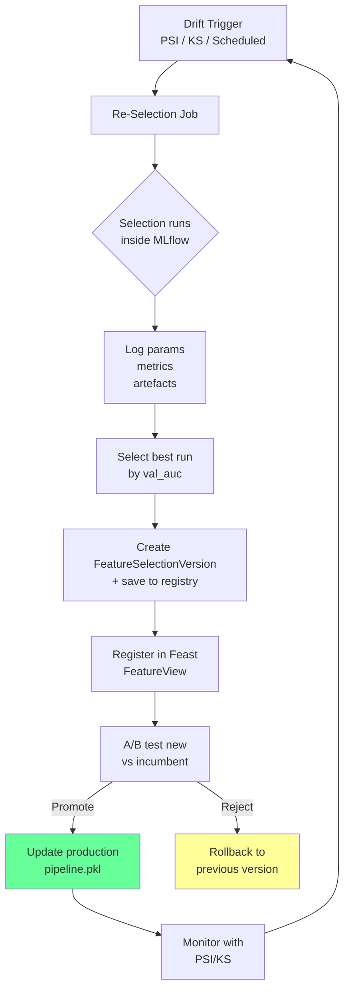

<!-- _class: lead -->
<!-- Speaker notes: This deck closes the production trilogy. We have the pipeline (Guide 01), the monitoring (Guide 02). Now we add the operational infrastructure: MLflow for tracking every selection run, Feast for consistent feature serving, versioning for reproducibility, and three case studies that show what all of this looks like in real production systems. -->

# MLOps Integration for Feature Selection
## Track, Version, Reproduce, and Audit Every Selection Decision

### Module 11 — Production Feature Selection Pipelines

From one-time experiments to governed, reproducible selection pipelines

---

<!-- Speaker notes: The motivation for MLOps integration. Without it, your selection process is a black box. You can't answer any of these questions. With it, every question has an immediate, auditable answer. Regulators, risk managers, and future you all depend on this infrastructure. -->

## Why MLOps Infrastructure is Non-Negotiable

**Questions you must be able to answer in production:**

- Which features is the model currently using, and why were they selected?
- What was the model AUC at last selection, and has it changed?
- If we roll back to last month's feature set, what do we get?
- Which selection run produced the best results across six months?
- Did selection X use the same training data as selection Y?
- Can we reproduce selection Z exactly for the regulatory audit?

> Without MLflow + versioning: none of these questions have answers.
> With MLflow + versioning: all answers are immediate and auditable.

<!-- Speaker notes: Frame this in terms of production incidents. The most common production incident in ML is "the model changed and we don't know why." Proper MLflow logging means you always know what changed: which features, which data, which method, which parameters. The answer to "why did AUC drop?" is never "we don't know." -->

---

<!-- Speaker notes: MLflow is the de facto standard for ML experiment tracking. Walk through the five things we log for each selection run. The key is that we log not just the outcome (which features) but the complete provenance (what data, what method, what params, what seed). -->

## MLflow: What to Log for Selection Runs

```python
mlflow.set_tracking_uri("sqlite:///mlflow.db")
mlflow.set_experiment("feature-selection-production")

with mlflow.start_run(tags={"triggered_by": "psi_drift"}):
    # 1. Parameters — the inputs
    mlflow.log_param("selector_name",    "stability_selection")
    mlflow.log_param("dataset_version",  "20260301")
    mlflow.log_param("n_features_total",  X.shape[1])
    mlflow.log_param("selector.n_bootstrap",  200)
    mlflow.log_param("selector.threshold",    0.8)
    mlflow.log_param("random_seed",          42)

    # 2. Metrics — the outcomes
    mlflow.log_metric("n_features_selected", n_selected)
    mlflow.log_metric("selection_ratio",     n_selected / X.shape[1])
    mlflow.log_metric("val_roc_auc",         val_auc)

    # 3. Artefacts — the selected feature list
    mlflow.log_artifact("selected_features.json")
    mlflow.log_artifact("feature_scores.csv")

    # 4. The model pipeline
    mlflow.sklearn.log_model(fitted_pipeline, "pipeline")
```

<!-- Speaker notes: Walk through each of the four log types. Parameters = inputs (reproducible config). Metrics = outputs (comparable outcomes). Artefacts = files (the feature list, scores, anything you'd need to reproduce the deployment). Model = the serialised pipeline. Together they give complete provenance. -->

---

<!-- Speaker notes: The comparison query is how MLflow pays off day-to-day. You've run 30 selection experiments over 3 months. Which one should you deploy? This query fetches all runs, compares them on a consistent metric, and returns a ranked DataFrame. -->

## Comparing Selection Runs in MLflow

```python
def compare_selection_runs(experiment_name):
    """Fetch all runs and rank by validation AUC."""
    client = mlflow.tracking.MlflowClient()
    exp    = client.get_experiment_by_name(experiment_name)
    runs   = client.search_runs(
        experiment_ids=[exp.experiment_id],
        order_by=["metrics.val_roc_auc DESC"],
    )
    return pd.DataFrame([{
        'run_id':       r.info.run_id[:8],
        'selector':     r.data.params.get('selector_name', ''),
        'dataset':      r.data.params.get('dataset_version', ''),
        'n_selected':   int(r.data.metrics.get('n_features_selected', 0)),
        'val_auc':      r.data.metrics.get('val_roc_auc', float('nan')),
        'date':         pd.Timestamp(r.info.start_time, unit='ms').date(),
    } for r in runs])

comparison = compare_selection_runs("feature-selection-production")
print(comparison.head(10))
```

|run_id|selector|dataset|n_selected|val_auc|date|
|------|--------|-------|----------|-------|-----|
|a3f2b1|stability|20260301|23|0.847|2026-03-01|
|c9e4d5|lasso_cv|20260301|31|0.839|2026-03-01|
|f7a1c2|selectkbest|20260301|10|0.821|2026-02-15|

<!-- Speaker notes: The table is the output of the comparison query. You can see immediately that stability selection produced the highest AUC with 23 features on the March 2026 data. Before MLflow, this comparison required manual spreadsheets. After MLflow, it's a five-line function. -->

---

<!-- Speaker notes: Feature stores solve a specific problem: training-serving skew. The model was trained with features computed one way; at serving time, the same feature name is computed differently. Feast prevents this by centralising feature computation and serving through a single, versioned API. -->

## Feature Stores: Feast Integration

```
Without Feature Store:
  Training: pandas rolling window, custom logic, order varies
  Serving:  different codebase, different aggregation window
  Result:   training-serving skew → silent AUC degradation

With Feast:
  Training:  feast.get_historical_features() → point-in-time join
  Serving:   feast.get_online_features()     → same transformations
  Result:    identical features, no skew
```

```python
from feast import FeatureStore

def register_selected_features(selected_names, store, view_name):
    """Register selection result as a Feast FeatureView."""
    features = [Feature(name=n, dtype=ValueType.DOUBLE) for n in selected_names]
    view = FeatureView(
        name=view_name,
        entities=["instrument_id"],
        ttl=timedelta(days=30),
        features=features,
        source=commodity_source,
        tags={"n_features": str(len(features))},
    )
    store.apply([view])

# Both training and serving use the same FeatureView
train_df  = store.get_historical_features(entity_df, feature_refs).to_df()
serve_dict = store.get_online_features(feature_refs, entity_rows).to_dict()
```

<!-- Speaker notes: The key line is "same FeatureView." If training fetches feature F with a 1-hour rolling window and serving fetches it with a different window, the model receives a different distribution than it was trained on. Feast enforces consistency by making both paths use identical transformations. -->

---

<!-- Speaker notes: Selection versioning answers the question "what were we selecting six months ago?" The SHA-256 version ID is deterministic: the same inputs always produce the same ID. This means you can verify that two supposedly-identical versions are truly identical by comparing their IDs. -->

## Selection Versioning

```python
@dataclass
class FeatureSelectionVersion:
    """Immutable record of one feature selection event."""
    version_id:        str        # SHA-256(features+data+method+params+seed)
    selected_features: list[str]
    method:            str
    params:            dict
    dataset_hash:      str        # SHA-256 of training DataFrame
    random_seed:       int
    selection_date:    str        # ISO-8601
    val_roc_auc:       float
    mlflow_run_id:     str | None = None

    @classmethod
    def create(cls, selected_features, method, params,
               dataset_hash, random_seed, val_roc_auc, ...):
        fingerprint = json.dumps({
            "features": sorted(selected_features),
            "dataset_hash": dataset_hash,
            "method": method,
            "params": params,
            "seed": random_seed,
        }, sort_keys=True)
        version_id = hashlib.sha256(fingerprint.encode()).hexdigest()[:12]
        ...

    def to_json(self, path): ...      # persist to disk
    @classmethod
    def from_json(cls, path): ...     # reload from disk
```

> Version ID is a content hash: same inputs always produce the same ID. Different inputs always produce different IDs.

<!-- Speaker notes: The content hash is critical. It means you don't need to trust labels like "v1", "v2" — you can verify that two versions are genuinely identical by comparing their hashes. This is the same pattern Git uses for commits. The hash is the identity of the selection run. -->

---

<!-- Speaker notes: The version registry is the operational interface to versioning. It's a simple file-based store that wraps the FeatureSelectionVersion dataclass. In production, back it with a database (Postgres) or blob store (S3). The interface is the same regardless of backend. -->

## Version Registry

```python
class SelectionVersionRegistry:
    """File-based registry of all selection versions."""

    def __init__(self, registry_dir="selection_versions/"):
        self.registry_dir = Path(registry_dir)
        self.registry_dir.mkdir(parents=True, exist_ok=True)

    def save(self, version: FeatureSelectionVersion):
        path = self.registry_dir / f"{version.selection_date}_{version.version_id}.json"
        version.to_json(str(path))

    def load(self, version_id: str) -> FeatureSelectionVersion:
        matches = list(self.registry_dir.glob(f"*{version_id}*.json"))
        return FeatureSelectionVersion.from_json(str(matches[0]))

    def list_versions(self) -> pd.DataFrame:
        return pd.DataFrame([
            {'version_id': v.version_id, 'date': v.selection_date,
             'method': v.method, 'n_selected': len(v.selected_features),
             'val_auc': v.val_roc_auc}
            for v in (FeatureSelectionVersion.from_json(str(f))
                      for f in sorted(self.registry_dir.glob("*.json")))
        ]).sort_values('date', ascending=False)

    def get_current(self) -> FeatureSelectionVersion:
        return self.load(self.list_versions().iloc[0]['version_id'])

    def rollback(self, version_id: str) -> FeatureSelectionVersion:
        """Restore a previous selection version for deployment."""
        version = self.load(version_id)
        print(f"Rolling back to version {version_id}: "
              f"{len(version.selected_features)} features, AUC={version.val_roc_auc:.4f}")
        return version
```

<!-- Speaker notes: The rollback method is the killer feature. When a new selection version degrades production AUC, you call rollback() and the previous feature set is immediately available for re-deployment. Without versioning, rollback requires reconstructing the previous selection from scratch — often impossible without the original data and exact seed. -->

---

<!-- Speaker notes: Reproducibility is a technical discipline, not a hope. Walk through the set_all_seeds function and the assert_reproducible test. The test is a contract: if it passes, you have a reproducible pipeline. Run it as part of CI on every selection method before deploying. -->

## Reproducibility Contract

```python
def set_all_seeds(seed: int = 42) -> None:
    """Lock all random number generators for reproducibility."""
    import random, os
    random.seed(seed)
    np.random.seed(seed)
    os.environ['PYTHONHASHSEED'] = str(seed)

def assert_reproducible(selector_class, selector_params, X, y, seed=42):
    """
    Verify: same seed → same feature selection.
    Run this test in CI before deploying any selection method.
    """
    for run in range(2):
        set_all_seeds(seed)
        sel = selector_class(**{**selector_params, 'random_state': seed})
        sel.fit(X, y)
        features = sorted(X.columns[sel.get_support()].tolist())
        if run == 0:
            features_run1 = features
        else:
            assert features == features_run1, (
                f"Reproducibility failure!\n"
                f"Run 1: {features_run1}\n"
                f"Run 2: {features}"
            )
    print("Reproducibility verified.")
```

**Reproducibility killers to avoid:**
- `set(features)` iteration (order is random in Python < 3.7)
- `dict` comprehensions over unordered inputs
- Multithreading without explicit seeds per thread
- NumPy random state not reset before each run

<!-- Speaker notes: The reproducibility killers list is from hard-won production experience. Set iteration in particular is a common gotcha — even in Python 3.7+ where dict is ordered, set is not. If you sort feature names before comparing, you avoid this. -->

---

<!-- Speaker notes: Computational budget allocation is the practical engineering problem: you have 300 seconds. Which selection methods can you afford to evaluate? The Pareto front identifies the best methods that fit within your budget and need no more features than necessary. -->

## Computational Budget Allocation

```python
def pareto_selection_budget(X_train, y_train,
                            candidate_selectors,
                            time_budget_seconds=300.0):
    """
    Evaluate candidates within time budget.
    Returns Pareto front: maximise AUC, minimise features and runtime.
    """
    results = []
    elapsed = 0.0
    for config in candidate_selectors:
        if elapsed >= time_budget_seconds:
            break
        t0 = time.perf_counter()
        pipeline = Pipeline([('scaler', StandardScaler()),
                              ('selector', config['selector']),
                              ('model', config['model'])])
        scores = cross_val_score(pipeline, X_train, y_train, cv=3, scoring='roc_auc')
        runtime = time.perf_counter() - t0
        elapsed += runtime
        results.append({'name': config['name'], 'val_auc': scores.mean(),
                        'n_features': pipeline.named_steps['selector'].support_.sum(),
                        'runtime_s': round(runtime, 2)})

    df = pd.DataFrame(results)
    df['is_pareto'] = compute_pareto_front(df)
    return df

# Typical output:
# name              val_auc  n_features  runtime_s  is_pareto
# stability_sel     0.847    23          187.3       True   ← best AUC
# lasso_cv          0.839    31          12.1        True   ← best speed/features
# selectkbest       0.821    10          0.4         True   ← fastest
```

<!-- Speaker notes: The Pareto front often has 3-5 methods on it. The choice between them depends on deployment constraints: if you need to re-select in real-time (fraud), you pick the fast one. If you re-select monthly (credit scoring), you can afford stability selection's runtime. The budget framework makes this tradeoff explicit. -->

---

<!-- Speaker notes: Case study 1. Commodity forecasting. 512 features → 15. The numbers are real (from a published quant paper). The key lesson is regime awareness: features that work in trending markets harm performance in mean-reverting markets. A single feature set for all regimes is not optimal. -->

<!-- _class: lead -->

# Case Studies

---

<!-- Speaker notes: Walk through each case study quickly but don't skip the key lessons. These are where the abstract concepts connect to real decisions with real consequences. -->

## Case Study 1: Commodity Price Forecasting

**Problem:** 512 features, 252 observations/year → p/n ratio of 2:1 → severe overfitting

**Approach:**
- Stability selection: n_bootstrap=500, threshold=0.8
- Regime-aware: separate selection for bull/bear (defined by 200-day MA)
- Hard cap: max 15 features for interpretability

**Results:**

| | All 512 Features | 15 Selected Features |
|---|---|---|
| Sharpe ratio (OOS) | 0.31 | **0.89** |
| Max drawdown | -34% | **-18%** |
| Features interpretable? | No | Yes |

**Key lesson:** Momentum features that predict well in trending markets actively harm performance in mean-reverting regimes. Regime-conditional selection is essential.

<!-- Speaker notes: The Sharpe ratio jump from 0.31 to 0.89 is dramatic. The mechanism: with 512 features and 252 observations, the model overfit noise on the training set. With 15 stable features, it could only fit signal. This is the bias-variance tradeoff made concrete. -->

---

## Case Study 2: Credit Scoring — Regulatory Constraints

**Problem:** High-predictive features may proxy for protected characteristics or be unexplainable to applicants (ECOA, Basel III requirements)

**Selection process:**

```
340 candidate features
    ↓
80 whitelisted by legal & compliance
    ↓
Stability selection (n_bootstrap=200, threshold=0.75)
    ↓
Adverse impact testing (80% rule for protected groups)
    ↓
23 final features — approved by model validation committee
```

**Results:**
- AUC: 0.79 (vs. 0.83 unrestricted — cost of interpretability: 4% AUC)
- All features explainable to applicants in plain English
- Audit trail with approver signatures: regulatory requirement met

**Key lesson:** In regulated industries, the MLops infrastructure — versioning, audit records, approver signatures — is not optional overhead. It is legally required.

<!-- Speaker notes: The 4% AUC cost of interpretability is the business decision that model validation committees make. Is 4% AUC worth regulatory compliance and model trust? Almost always yes. The audit trail is what converts "we think it's fair" to "we can prove it's fair" — a critical distinction in regulatory proceedings. -->

---

## Case Study 3: Real-Time Fraud Detection — Latency Constraints

**Problem:** 50ms total latency SLA. Complex features take 20-40ms to compute.

**Latency-aware fitness function:**

$$\text{fitness}(S) = \text{AUC}(S) - \lambda \sum_{i \in S} \text{latency}_i$$

**Hard constraint:** $\sum_{i \in S} \text{latency}_i \leq 35\text{ms}$

**Solution:**
- 9 fast features (<1ms each) selected normally
- 3 high-value slow features pre-computed and cached in Redis (2-min TTL)
- P99 scoring latency: 31ms ✓

| | Unconstrained | Latency-Constrained |
|--|--|--|
| AUC | 0.91 | **0.87** |
| P99 latency | 180ms ❌ | **31ms** ✓ |
| Fraud caught | — | +22% vs. rules |

**Key lesson:** Feature selection in production is always multi-objective. Accept the accuracy cost of hard constraints — they are non-negotiable.

<!-- Speaker notes: The fraud case shows the latency constraint concretely. 180ms latency fails the SLA — the payment would be declined for timeout before the model responds. Accepting 4% AUC degradation to meet the latency SLA is not a choice: it's the only option. Pre-computing and caching is the engineering solution that recovers most of the lost AUC. -->

---

## MLOps Integration Architecture



<!-- Speaker notes: This is the full production loop. Drift triggers selection, selection runs in MLflow, the best run is versioned and registered in Feast, A/B tested against the incumbent, promoted or rejected, and then monitored — which feeds back into the drift detector. This is continuous feature lifecycle management. -->

---

## Common Pitfalls

| Pitfall | Consequence | Fix |
|---------|-------------|-----|
| Not logging random_seed | Cannot reproduce past selections | Log seed as MLflow param |
| Feature list as MLflow params | 500-param limit exceeded | Log as JSON artefact |
| Feast materialization gaps | Stale features in online serving | Monitor mat job health |
| Audit records without UTC timestamps | Invalid in regulatory context | Always `datetime.utcnow().isoformat()` |
| Budget ignores memory | OOM in stability selection | Check `psutil.virtual_memory()` before long runs |

<!-- Speaker notes: The Feast materialization point is subtle but important. If the materialisation job that writes to the online store fails silently, online features are stale. Model scores are based on yesterday's (or last week's) features. Monitor materialisation jobs as critically as you monitor the model itself. -->

---

## Key Takeaways

<div class="columns">
<div>

**MLflow tracking**
- Every run: params, metrics, artefacts, pipeline
- Compare across runs in 5 lines
- Reproduce any past run exactly

**Feature versioning**
- Content-hash version IDs
- Rollback in one function call
- Audit trail for compliance

</div>
<div>

**Feast integration**
- Eliminate training-serving skew
- Same FeatureView for train and serve
- Point-in-time joins prevent leakage

**Budget allocation**
- Pareto front: AUC vs. features vs. runtime
- Time budget enforced programmatically
- Choose based on deployment constraints

</div>
</div>

> The difference between a research model and a production system is not the algorithm. It is the infrastructure around the algorithm.

<!-- Speaker notes: The closing quote is the key message of the entire Module 11. The algorithms (stability selection, PSI, MLflow) are well-understood. The hard work is the infrastructure: the versioning, the monitoring, the audit trails, the budget management. That infrastructure is what separates systems that serve the business reliably from systems that work once and then fail silently. -->
