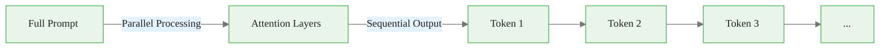
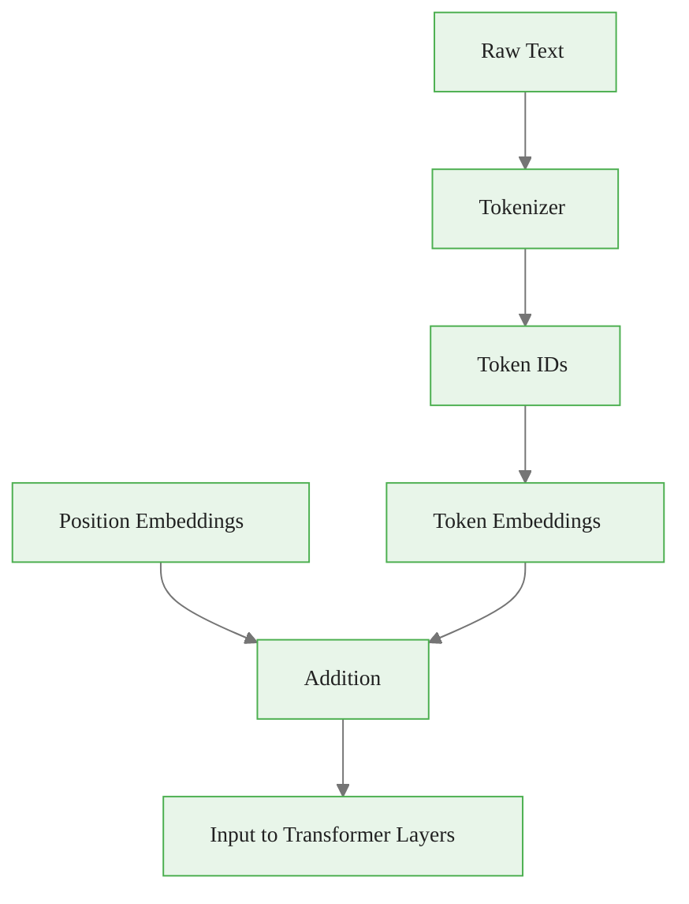
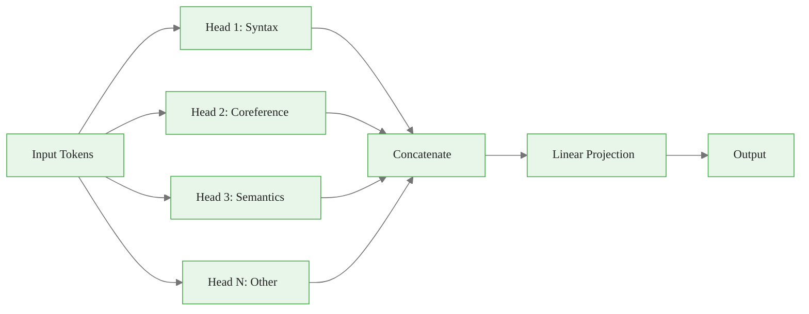
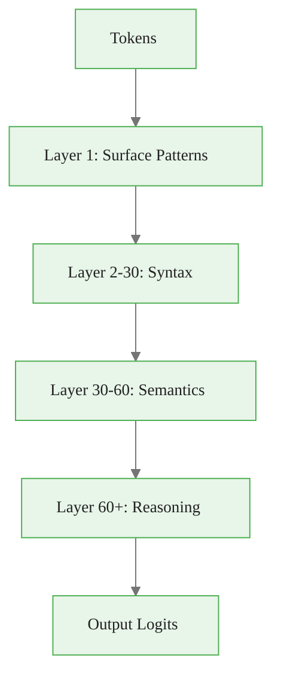
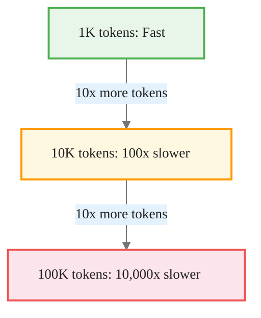
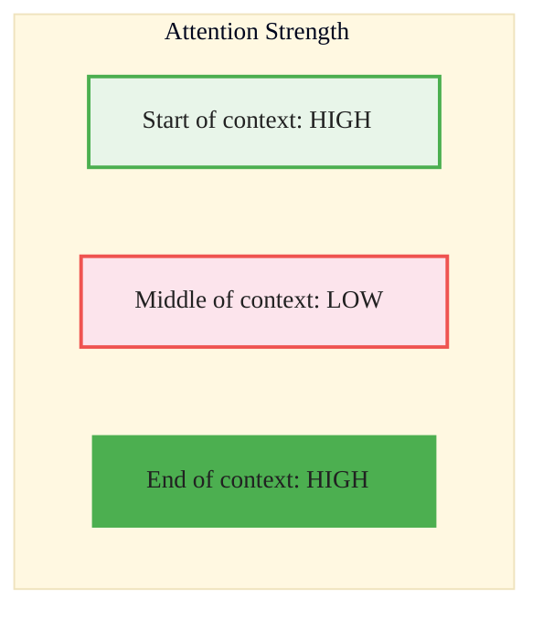
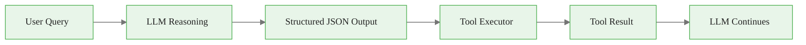
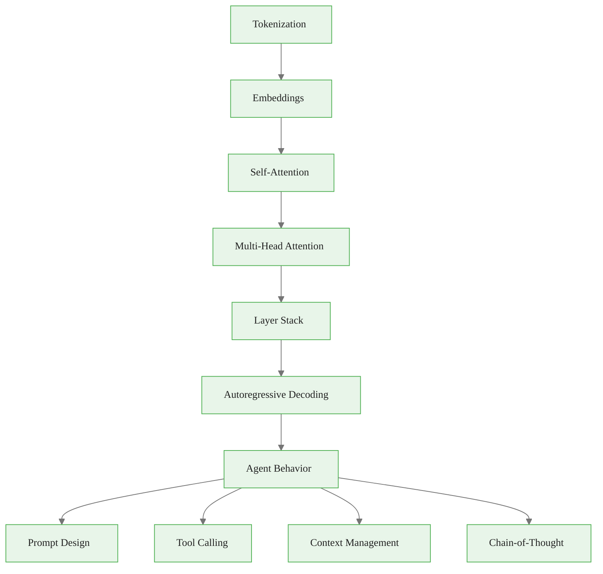

<!-- _class: lead -->

# Transformer Architecture for Agent Builders

**Module 00 — Foundations**

> Understanding how transformers process and generate text helps you write better prompts, debug agent behavior, and make informed design decisions.

<!--
Speaker notes: Key talking points for this slide
- Welcome to the foundations module on transformer architecture
- This is NOT about building transformers -- it is about understanding them well enough to build better agents
- Key question to pose: "Why does prompt ordering matter? Why does chain-of-thought work?" -- these answers come from understanding the architecture
-->

---

# Key Insight

**Transformers process all tokens simultaneously through attention, but generate output one token at a time.**

- The model "sees" your entire prompt at once
- But must commit to each output token sequentially
- Once generated, tokens can't be revised



<!--
Speaker notes: Key talking points for this slide
- This is the single most important insight for agent builders
- Parallel input means the model considers all context at once -- order within the prompt still matters for attention weights
- Sequential output means the model cannot go back and revise -- this is why chain-of-thought helps (reasoning tokens become context)
- Analogy: reading a whole essay at once, then writing your response one word at a time without an eraser
-->

---

<!-- _class: lead -->

# The Transformer Pipeline

<!--
Speaker notes: Key talking points for this slide
- We will walk through the transformer pipeline step by step
- Goal: build intuition, not memorize equations
- Focus on what each stage means for your agent designs
-->

---

# Input Processing

```
"Hello world"
    |
[15496, 995]              # Tokenization
    |
[[0.1, -0.3, ...],        # Token embeddings (d=4096 for large models)
 [0.2,  0.1, ...]]
    |
+ Position embeddings     # Add positional information
    |
Ready for attention layers
```



<!--
Speaker notes: Key talking points for this slide
- Tokenization is not word-level: "Hello" might be one token but "unhappiness" might be three
- Embeddings convert token IDs to dense vectors -- these are learned during training
- Position embeddings tell the model WHERE each token is -- without this, the model cannot distinguish word order
- For agents: token count matters for cost and context limits. Code and non-English text often tokenize less efficiently
-->

---

# The Attention Mechanism

Self-attention allows each token to "look at" every other token:

$$\text{Attention}(Q, K, V) = \text{softmax}\left(\frac{QK^T}{\sqrt{d_k}}\right)V$$

<div class="columns">
<div>

**Intuition:**
- **Q (Query):** "What am I looking for?"
- **K (Key):** "What do I contain?"
- **V (Value):** "What information do I provide?"

</div>
<div>

> Each token computes attention scores with all other tokens, creating a weighted combination of their values.

</div>
</div>

<!--
Speaker notes: Key talking points for this slide
- Don't worry about the math -- focus on the intuition
- Think of it as a lookup table: each token asks "who is relevant to me?" (query-key match) and then gathers information (values)
- The softmax creates a probability distribution -- some tokens get most of the attention
- For agents: this is why placing important instructions where they get high attention scores matters
-->

---

# Multi-Head Attention

Multiple attention "heads" run in parallel, each learning different relationships:

```
Head 1: Learns syntax (subject-verb agreement)
Head 2: Learns coreference (pronouns -> nouns)
Head 3: Learns semantic similarity
...
Head N: Learned patterns
```



<!--
Speaker notes: Key talking points for this slide
- Multiple heads allow the model to attend to different types of relationships simultaneously
- Each head has its own Q, K, V projections -- they learn different patterns
- Results are concatenated and projected back to the model dimension
- For agents: this multi-faceted understanding is why models can follow complex instructions that involve syntax, semantics, and logic at once
-->

---

# Layer Stack

Modern LLMs stack many transformer layers:

| Model | Layers | Parameters |
|-------|--------|------------|
| GPT-4 | Undisclosed | Undisclosed* |
| Claude 3 | Undisclosed | Undisclosed |

*Unverified estimates circulate online, but neither OpenAI nor Anthropic have disclosed these architectures.*
| Llama 3 70B | 80 | 70B |

> Each layer refines the representation, building from tokens to syntax to semantics to reasoning.



<!--
Speaker notes: Key talking points for this slide
- Think of layers as progressive refinement: early layers handle surface patterns, later layers handle abstract reasoning
- This is why simple tasks (classification) can work with smaller models, while complex reasoning needs larger ones
- The exact number of layers is a trade-off between capability and cost/latency
- For agents: complex multi-step reasoning tasks genuinely need larger models -- it is not just marketing
-->

---

<!-- _class: lead -->

# Generation: Autoregressive Decoding

<!--
Speaker notes: Key talking points for this slide
- Now we shift from understanding to generation
- The generation process is fundamentally sequential -- this has deep implications for agent design
- Key question: "If the model generates one token at a time, how can we ensure it produces valid JSON or correct tool calls?"
-->

---

# The Generation Loop

<div class="code-window">
<div class="code-header">
<div class="dots"><span class="dot-red"></span><span class="dot-yellow"></span><span class="dot-green"></span></div>
<span class="filename">agent.py</span>
</div>
<div class="code-body">

```python
def generate(prompt, max_tokens):
    tokens = tokenize(prompt)
    for _ in range(max_tokens):
        logits = transformer(tokens)  # Forward pass
        next_token = sample(logits[-1])
        tokens.append(next_token)
        if next_token == EOS:
            break
    return detokenize(tokens)
```

</div>
</div>

<div class="callout-key">

**Key Point:** Each new token becomes context for the next — this is why chain-of-thought prompting works.

</div>

<!--
Speaker notes: Key talking points for this slide
- This is pseudocode showing the core generation loop
- Each forward pass processes ALL tokens but only the LAST token's logits are used for sampling
- The KV cache optimization stores intermediate results so previous tokens are not recomputed
- For agents: this sequential nature means the model cannot plan ahead -- it commits to each token as it goes
- This is exactly why chain-of-thought works: writing out reasoning creates context that improves subsequent tokens
-->

---

# Sampling Strategies

| Strategy | Description | Best For |
|----------|-------------|----------|
| **Temperature=0** | Always pick highest probability | Tool calls, structured output |
| **Temperature=1** | Sample from true distribution | General text |
| **Temperature>1** | More random/creative | Brainstorming |
| **Top-p (Nucleus)** | Sample from top p% probability mass | Balanced generation |
| **Top-k** | Only consider top k most likely tokens | Controlled diversity |

<!--
Speaker notes: Key talking points for this slide
- Temperature scales the logits before softmax: lower means more peaked distribution, higher means more uniform
- Temperature=0 is greedy decoding -- always picks the most likely token -- deterministic and reliable
- Top-p and top-k cut off the tail of the distribution to prevent very unlikely tokens
- For agents: almost always use temperature=0 for tool calls, structured output, and action decisions
- Higher temperature only for creative content generation within an agent pipeline
-->

---

# For Agents: Use Low Temperature

Agent actions should be reliable and predictable:

<div class="code-window">
<div class="code-header">
<div class="dots"><span class="dot-red"></span><span class="dot-yellow"></span><span class="dot-green"></span></div>
<span class="filename">agent.py</span>
</div>
<div class="code-body">

```python
response = client.messages.create(
    model="claude-sonnet-4-6",
    temperature=0,  # Deterministic for tool calls
    ...
)
```

</div>
</div>

<div class="callout-warning">

**Warning:** For tool calls and structured output, always use temperature=0. For creative tasks, use higher values.

</div>

<!--
Speaker notes: Key talking points for this slide
- This is a concrete recommendation for agent builders
- Temperature=0 ensures the same input produces the same output -- critical for debugging and reliability
- If an agent needs to make a decision (which tool to call, what action to take), you want determinism
- Exception: if the agent is generating creative content (writing, brainstorming), use temperature 0.7-1.0
-->

---

<!-- _class: lead -->

# Context Windows and Attention

<!--
Speaker notes: Key talking points for this slide
- Context window management is one of the most practical skills for agent builders
- Understanding WHY context limits exist helps you design better architectures
- This section connects directly to RAG and memory management in later modules
-->

---

# Quadratic Complexity

Attention is $O(n^2)$ in sequence length — each token attends to every other:

| Context | Attention Computations |
|---------|----------------------|
| 1K tokens | 1M |
| 10K tokens | 100M |
| 100K tokens | 10B |



<!--
Speaker notes: Key talking points for this slide
- The quadratic scaling is the fundamental bottleneck of transformer models
- 10x more tokens means 100x more compute -- this is why long contexts are expensive
- Modern models use optimizations (Flash Attention, sliding window) but the fundamental scaling remains
- For agents: this means dumping entire documents into context is wasteful -- use RAG to retrieve relevant chunks
-->

---

# Implications for Agents

<div class="columns">
<div>

**Three critical rules:**

1. **Longer context ≠ better**
   Relevant info should be near the query

2. **"Lost in the middle" problem**
   Info in the middle of context is harder to retrieve

3. **RAG helps**
   Retrieve relevant chunks rather than stuffing full documents

</div>
<div>



</div>
</div>

<!--
Speaker notes: Key talking points for this slide
- The "lost in the middle" effect is well-documented in research: models attend more to the beginning and end of context
- Practical implication: put your system prompt at the start, user query at the end, and supporting context in between
- RAG is not just about fitting into context windows -- it is about putting the RIGHT information at HIGH-attention positions
- We will cover RAG in depth in Module 03
-->

---

# Context Window Management

<div class="code-window">
<div class="code-header">
<div class="dots"><span class="dot-red"></span><span class="dot-yellow"></span><span class="dot-green"></span></div>
<span class="filename">agent.py</span>
</div>
<div class="code-body">

```python
def manage_context(messages, max_tokens=100000):
    """Keep conversation within context limits."""
    total_tokens = sum(count_tokens(m) for m in messages)

    while total_tokens > max_tokens:
        # Remove oldest messages (keep system prompt)
        messages.pop(1)  # Index 0 is system prompt
        total_tokens = sum(count_tokens(m) for m in messages)

    return messages
```

</div>
</div>

<div class="callout-key">

**Key Point:** Always preserve the system prompt when trimming context.

</div>

<!--
Speaker notes: Key talking points for this slide
- This is a simple but essential pattern for long-running agent conversations
- Key detail: we pop index 1 (not 0) to preserve the system prompt
- More sophisticated approaches: summarize old messages, use sliding windows, or use external memory
- Module 03 will cover advanced memory and context management strategies in depth
-->

---

<!-- _class: lead -->

# Practical Implications for Agents

<!--
Speaker notes: Key talking points for this slide
- Now we connect architecture knowledge to practical agent design
- These four implications are the main takeaways from this deck
- Each one directly affects how you write prompts and design agent systems
-->

---

# 1. Prompt Placement Matters

Put critical instructions at the **beginning** and **end** of prompts — these positions get more attention.

<div class="code-window">
<div class="code-header">
<div class="dots"><span class="dot-red"></span><span class="dot-yellow"></span><span class="dot-green"></span></div>
<span class="filename">agent.py</span>
</div>
<div class="code-body">

```python
system_prompt = """
[CRITICAL INSTRUCTIONS AT START]
You are an agent that...

[DETAILED CONTEXT IN MIDDLE]
...

[CRITICAL REMINDERS AT END]
Remember to always...
"""
```

</div>
</div>

<div class="callout-key">

**Key Point:** Use the "sandwich" technique: critical info at start + end, details in the middle.

</div>

<!--
Speaker notes: Key talking points for this slide
- The sandwich technique leverages the U-shaped attention curve we just discussed
- Start with role definition and critical constraints
- Middle contains reference material, examples, context
- End with action reminders and output format instructions
- This is especially important for long system prompts in production agents
-->

---

# 2. Structured Output is Easier

The model predicts token-by-token. Structured formats (JSON, XML) constrain each token's options:

```
{"name": "   # After this, model knows a string is coming
```

# 3. Chain-of-Thought Works Because of Autoregression

When the model writes out reasoning steps, those tokens become part of the context for subsequent tokens.

```
Let me solve this step by step:
1. First, I need to... [model now has this context]
2. Given step 1, I should... [builds on step 1]
3. Therefore... [conclusion informed by steps 1-2]
```

<!--
Speaker notes: Key talking points for this slide
- Structured output: JSON brackets act as constraints -- once the model outputs '{' it knows a key-value structure follows
- This is why function calling works reliably: the schema constrains the output space
- Chain-of-thought: each reasoning step becomes part of the input for the next step
- The model cannot "think internally" -- writing out steps is literally how it reasons
- Module 01 will cover advanced prompting techniques including chain-of-thought in depth
-->

---

# 4. Tool Calls Are Just Structured Generation

Function calling is the model generating structured JSON that matches a schema:

```json
{
  "tool": "search",
  "arguments": {
    "query": "current weather in NYC"
  }
}
```



<!--
Speaker notes: Key talking points for this slide
- Tool calling demystified: it is just constrained text generation that matches a JSON schema
- The model does not "call" anything -- it generates a JSON blob, your code parses it, executes the tool, and feeds the result back
- This loop (generate tool call -> execute -> feed result -> generate next) is the core of every agent framework
- Module 02 will cover tool use and function calling in depth
-->

---

# Common Misconceptions

| Misconception | Reality |
|--------------|---------|
| "The model understands my intent" | It predicts likely continuations based on patterns. Clear, explicit prompts win. |
| "More context is always better" | Long contexts dilute attention. Focused, relevant context outperforms exhaustive dumps. |
| "The model remembers previous conversations" | Each API call is independent. "Memory" requires explicit context management. |
| "Temperature 0 is always best" | For tool calls: yes. For creative tasks: higher temperature helps. |

<!--
Speaker notes: Key talking points for this slide
- These are the four most common misconceptions we see from new agent builders
- "Understanding intent" vs "pattern matching" -- this is why explicit instructions outperform vague ones
- "More context" -- the quadratic cost and attention dilution mean selective context always wins
- "Memory" -- each API call is stateless. All context must be explicitly passed. This is fundamental.
- "Temperature" -- it is a tool, not a setting. Match it to the task.
-->

---

# Code: Inspecting Tokenization

<div class="code-window">
<div class="code-header">
<div class="dots"><span class="dot-red"></span><span class="dot-yellow"></span><span class="dot-green"></span></div>
<span class="filename">agent.py</span>
</div>
<div class="code-body">

```python
import anthropic

client = anthropic.Anthropic()

def count_tokens(text: str) -> int:
    """Count tokens using Claude's tokenizer."""
    response = client.messages.count_tokens(
        model="claude-sonnet-4-6",
        messages=[{"role": "user", "content": text}]
    )
    return response.input_tokens
```

</div>
</div>

<!--
Speaker notes: Key talking points for this slide
- This is a real, runnable code example using the Anthropic SDK
- The count_tokens endpoint lets you measure token usage without making a generation call
- Useful for budgeting context windows and estimating costs
- Note: token counts vary by model -- always use the target model's tokenizer
-->

---

# Code: Tokenization Examples (continued)

<div class="code-window">
<div class="code-header">
<div class="dots"><span class="dot-red"></span><span class="dot-yellow"></span><span class="dot-green"></span></div>
<span class="filename">agent.py</span>
</div>
<div class="code-body">

```python
examples = [
    "Hello, world!",
    "def fibonacci(n): return n if n < 2 else fibonacci(n-1) + fibonacci(n-2)",
    "The quick brown fox jumps over the lazy dog.",
]

for text in examples:
    tokens = count_tokens(text)
    ratio = len(text.split()) / tokens
    print(f"'{text[:50]}...' -> {tokens} tokens ({ratio:.2f} words/token)")
```

</div>
</div>

<div class="callout-key">

**Key Point:** Code typically has a lower words-per-token ratio than natural language — budget accordingly.

</div>

<!--
Speaker notes: Key talking points for this slide
- Run this code to see how different types of text tokenize differently
- Natural English: roughly 1 word per 1.3 tokens
- Code: often 1 word per 2-3 tokens because of special characters and formatting
- Non-English text: can be 2-5x more tokens per word depending on the language
- Practical takeaway: when estimating costs, measure actual token counts rather than guessing
-->

---

# Summary & Connections



**Key takeaways:**
- Transformers process all input at once, but generate one token at a time
- Attention is quadratic — manage context carefully
- Place critical instructions at start and end of prompts
- Use temperature=0 for agent tool calls

> *Understanding transformers is about intuition for how tokens flow through the model and how that affects your agent designs.*

<!--
Speaker notes: Key talking points for this slide
- Recap the four key takeaways -- these are the "carry forward" ideas for the rest of the course
- Next up: LLM Providers (02) covers the practical API landscape
- Module 01 will build on these foundations with advanced prompt engineering
- Module 02 will dive deep into tool calling, which we introduced here
- Encourage learners to run the tokenization code to build intuition
-->
