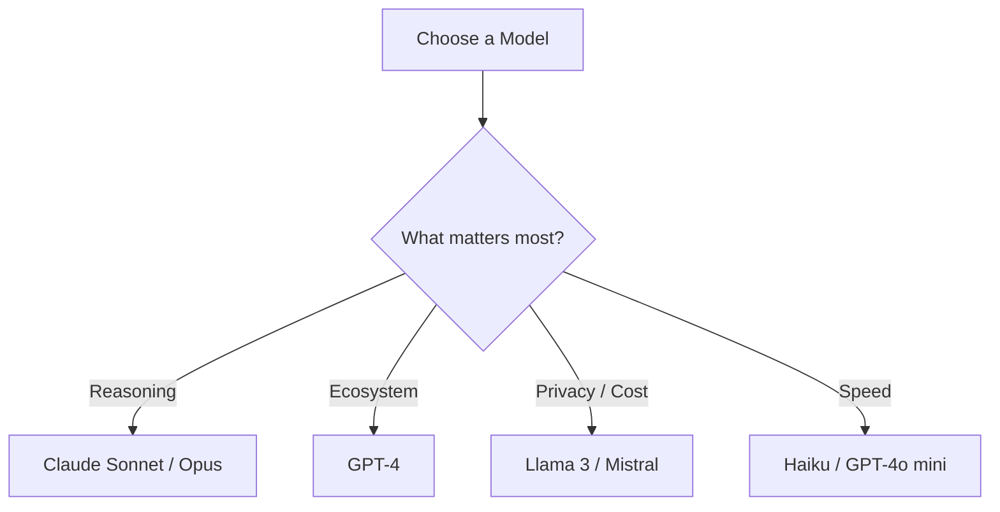
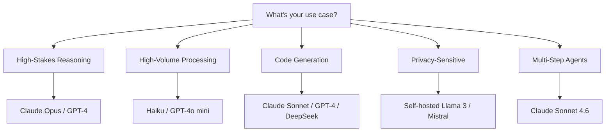
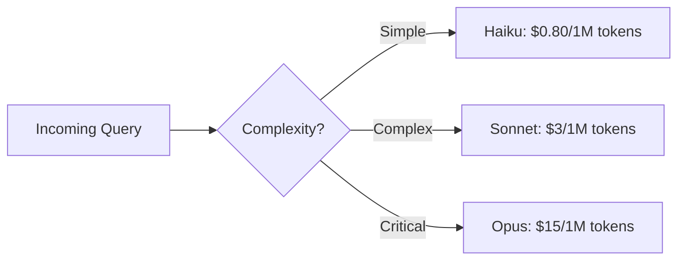
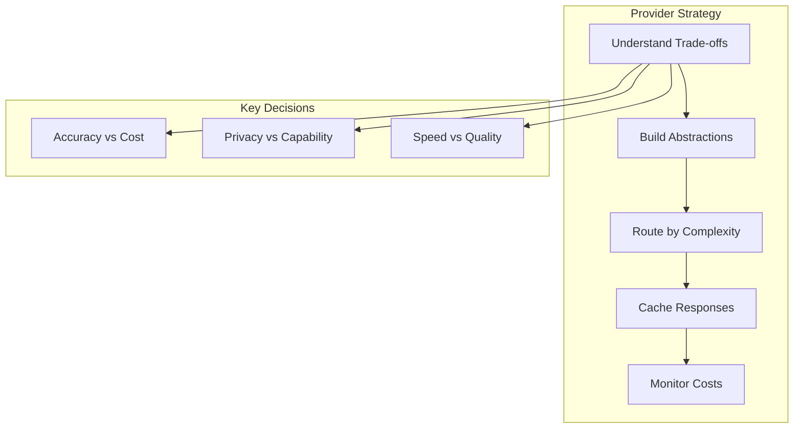

<!-- _class: lead -->

# LLM Providers: Choosing the Right Model

**Module 00 — Foundations**

> No single model is best for everything. Production agents often use multiple models strategically.

<!--
Speaker notes: Key talking points for this slide
- This deck covers the practical landscape of LLM providers
- Key message: there is no single best model -- the right choice depends on your constraints
- Production systems often use 2-3 models for different tasks (routing by complexity)
-->

---

# Key Insight

**Different LLM providers offer distinct trade-offs in capability, cost, latency, and features.**

- Claude excels at reasoning and instruction-following
- GPT-4 at broad knowledge and ecosystem
- Open-source models at cost-efficiency and privacy



<!--
Speaker notes: Key talking points for this slide
- The decision tree is the mental model to carry forward
- Reasoning-heavy tasks (agents, analysis): Claude family dominates benchmarks
- Ecosystem matters when you need integrations, plugins, fine-tuning
- Privacy: open-source lets you self-host with zero data leaving your infrastructure
- Speed: smaller models for high-volume, low-complexity tasks
-->

---

<!-- _class: lead -->

# Provider Comparison

<!--
Speaker notes: Key talking points for this slide
- We will look at three provider categories: Claude, GPT-4, and open-source
- For each: model lineup, strengths, and a minimal working code example
- Goal: you should be able to make your first API call to any provider after this section
-->

---

# Claude (Anthropic)

<div class="columns">
<div>

**Models:**
- Claude Sonnet 4.6: Best balance
- Claude Opus 4.6: Maximum capability
- Claude Haiku 4.5: Fast and cheap

**Strengths:**
- Superior instruction following
- Strong reasoning and analysis
- Excellent structured output
- 200K token context window
- Built-in tool use support

</div>
<div>

```python
import anthropic

client = anthropic.Anthropic()

response = client.messages.create(
    model="claude-sonnet-4-6",
    max_tokens=1024,
    messages=[
        {"role": "user",
         "content": "Explain quantum computing."}
    ]
)
print(response.content[0].text)
```

</div>
</div>

<!--
Speaker notes: Key talking points for this slide
- Claude family is our primary recommendation for agent building due to strong instruction following
- Sonnet is the default choice for most use cases: good balance of capability and cost
- Opus for complex multi-step reasoning where accuracy is critical
- Haiku for high-volume, simple tasks like classification or extraction
- 200K context window is the largest among commercial models
-->

---

# GPT-4 (OpenAI)

<div class="columns">
<div>

**Models:**
- GPT-4 Turbo: 128K context
- GPT-4o: Optimized for speed
- GPT-3.5 Turbo: Fast and cheap

**Strengths:**
- Largest ecosystem and tooling
- Strong general knowledge
- Good code generation
- Extensive fine-tuning options
- Mature function calling

</div>
<div>

```python
from openai import OpenAI

client = OpenAI()

response = client.chat.completions.create(
    model="gpt-4-turbo-preview",
    messages=[
        {"role": "user",
         "content": "Explain quantum computing."}
    ]
)
print(response.choices[0].message.content)
```

</div>
</div>

<!--
Speaker notes: Key talking points for this slide
- OpenAI has the largest ecosystem: most tutorials, integrations, and community support
- GPT-4o is their speed-optimized model -- good for interactive applications
- Fine-tuning is a key differentiator: you can customize GPT models with your own data
- Function calling maturity: OpenAI pioneered the structured tool use format
-->

---

# Open-Source Models

<div class="columns">
<div>

**Popular Options:**
- Llama 3 (Meta): Strong general capability
- Mistral/Mixtral: Excellent efficiency
- DeepSeek: Strong at code
- Qwen: Good multilingual support

**Strengths:**
- No API costs (self-hosted)
- Full data privacy
- Customizable and fine-tunable
- No rate limits

</div>
<div>

```python
# Using Ollama for local inference
import requests

response = requests.post(
    "http://localhost:11434/api/generate",
    json={
        "model": "llama3:70b",
        "prompt": "Explain quantum computing.",
        "stream": False
    }
)
print(response.json()["response"])
```

</div>
</div>

<!--
Speaker notes: Key talking points for this slide
- Open-source models are the cost-effective choice for high-volume or privacy-sensitive applications
- Ollama makes local inference trivial -- install and run with a single command
- Trade-off: smaller models have lower capability, especially for complex reasoning
- Ideal for: classification, extraction, simple QA -- tasks where you do not need frontier model capability
-->

---

# Decision Matrix

| Factor | Claude | GPT-4 | Open-Source |
|--------|--------|-------|-------------|
| Reasoning | ★★★★★ | ★★★★☆ | ★★★☆☆ |
| Speed | ★★★★☆ | ★★★☆☆ | ★★★★★ |
| Cost | ★★★☆☆ | ★★☆☆☆ | ★★★★★ |
| Privacy | ★★★☆☆ | ★★★☆☆ | ★★★★★ |
| Ecosystem | ★★★☆☆ | ★★★★★ | ★★★☆☆ |
| Context | ★★★★★ | ★★★★☆ | ★★☆☆☆ |

<!--
Speaker notes: Key talking points for this slide
- This matrix is a simplified view -- actual performance varies by specific task
- Key insight: no provider wins on every dimension
- Claude leads on reasoning and context; GPT-4 on ecosystem; open-source on cost and privacy
- For agents specifically: reasoning and instruction-following matter most
-->

---

# Selection by Use Case



<!--
Speaker notes: Key talking points for this slide
- Walk through each use case and explain the recommendation
- High-stakes reasoning: Opus or GPT-4 -- when accuracy is worth the cost
- High-volume: Haiku or GPT-4o mini -- keep costs manageable at scale
- Code generation: Sonnet and DeepSeek both excel here
- Privacy: self-hosted open-source is the only option that guarantees data stays on your infrastructure
- Multi-step agents: Sonnet 4.6 is our top recommendation for the sweet spot of capability and cost
-->

---

<!-- _class: lead -->

# Building Provider-Agnostic Systems

<!--
Speaker notes: Key talking points for this slide
- Why abstraction matters: you will want to switch providers, test across models, and optimize costs
- A clean abstraction layer saves enormous effort when models change or pricing shifts
- This pattern is used by every serious production agent system
-->

---

# Abstraction Layer: Data Classes

```python
from abc import ABC, abstractmethod
from dataclasses import dataclass

@dataclass
class Message:
    role: str  # "user", "assistant", "system"
    content: str

@dataclass
class LLMResponse:
    content: str
    model: str
    input_tokens: int
    output_tokens: int
```

<!--
Speaker notes: Key talking points for this slide
- Start with simple data classes that represent the common interface
- Message and LLMResponse are provider-agnostic -- they work with any backend
- The dataclass decorator gives us clean initialization, repr, and equality for free
-->

---

# Abstraction Layer: Base Class (continued)

```python
class LLMProvider(ABC):
    """Abstract base class for LLM providers."""
    @abstractmethod
    def chat(self, messages: list[Message],
             temperature: float = 0.7,
             max_tokens: int = 1024) -> LLMResponse:
        pass
```

> Each provider implements `chat()` with their specific SDK.

<!--
Speaker notes: Key talking points for this slide
- The ABC (Abstract Base Class) enforces that every provider implements the chat method
- This is the Strategy pattern from design patterns -- swap implementations without changing calling code
- The interface is intentionally minimal: messages in, response out
- Production systems often add streaming, tool use, and batch methods to this interface
-->

---

# Claude Provider Implementation

```python
class ClaudeProvider(LLMProvider):
    def __init__(self, model="claude-sonnet-4-6"):
        self.client = anthropic.Anthropic()
        self.model = model

    def chat(self, messages, **kwargs):
        system = next((m.content for m in messages
                       if m.role == "system"), None)
        msgs = [{"role": m.role, "content": m.content}
                for m in messages if m.role != "system"]
        resp = self.client.messages.create(
            model=self.model, system=system,
            messages=msgs, **kwargs)
        return LLMResponse(content=resp.content[0].text, ...)
```

<!--
Speaker notes: Key talking points for this slide
- Claude separates system messages from chat messages -- that is the key API difference
- We extract the system prompt and pass it as a separate parameter
- The LLMResponse wraps the provider-specific response into our common format
-->
---

# OpenAI Provider Implementation

```python
class OpenAIProvider(LLMProvider):
    def __init__(self, model="gpt-4-turbo-preview"):
        self.client = OpenAI()
        self.model = model

    def chat(self, messages, **kwargs):
        msgs = [{"role": m.role, "content": m.content}
                for m in messages]
        resp = self.client.chat.completions.create(
            model=self.model, messages=msgs, **kwargs)
        return LLMResponse(
            content=resp.choices[0].message.content, ...)
```

> Both providers implement the same `chat()` interface -- calling code never changes.

<!--
Speaker notes: Key talking points for this slide
- OpenAI keeps system messages inline with the other messages -- simpler API surface
- Both providers return an LLMResponse -- the calling code is identical regardless of backend
- This is the Strategy pattern: swap implementations without changing client code
-->
---

# Factory Pattern: Creating Providers

```python
def create_provider(provider_name: str, **kwargs) -> LLMProvider:
    """Factory function to create LLM providers."""
    providers = {
        "claude": ClaudeProvider,
        "openai": OpenAIProvider,
    }
    return providers[provider_name](**kwargs)
```

<!--
Speaker notes: Key talking points for this slide
- Factory pattern: create the right provider from a config string
- This enables config-driven provider selection: change a YAML value, switch the model
- Easy to extend: just add new entries to the providers dict
-->

---

# Using the Abstraction (continued)

```python
# Usage - easily switch providers
provider = create_provider("claude", model="claude-sonnet-4-6")

response = provider.chat([
    Message(role="system", content="You are a helpful assistant."),
    Message(role="user", content="What is the capital of France?")
])

print(f"Response: {response.content}")
print(f"Tokens: {response.input_tokens + response.output_tokens}")
```

> 🔑 Build abstractions that let you switch providers with a single config change.

<!--
Speaker notes: Key talking points for this slide
- This is the payoff: clean, provider-agnostic calling code
- To switch from Claude to OpenAI, change one string: "claude" to "openai"
- Token tracking is built into the abstraction for cost monitoring
- This pattern scales to multi-model routing, A/B testing, and fallback strategies
-->

---

<!-- _class: lead -->

# Cost Optimization Strategies

<!--
Speaker notes: Key talking points for this slide
- Cost optimization is critical for production agents -- unoptimized systems can cost 10-100x more than necessary
- Three main strategies: model routing, caching, and rate limiting
- These compound: routing + caching can reduce costs by 80-90% in many applications
-->

---

# Model Routing

Use cheaper models for simple tasks, expensive models for complex ones:

```python
def route_to_model(query: str, complexity: str = "auto") -> LLMProvider:
    """Route queries to appropriate models based on complexity."""
    if complexity == "auto":
        complexity = "simple" if len(query) < 100 else "complex"

    if complexity == "simple":
        return create_provider("claude", model="claude-haiku-4-5")
    else:
        return create_provider("claude", model="claude-sonnet-4-6")
```



<!--
Speaker notes: Key talking points for this slide
- The simplest routing: use query length as a proxy for complexity
- Production systems use more sophisticated classifiers (a small model to classify the query first)
- Cost savings can be dramatic: if 70% of queries are simple, routing saves ~60% on those
- Module 07 covers advanced optimization strategies including semantic caching and batching
-->

---

# Response Caching

```python
import hashlib, json
from functools import lru_cache

def hash_messages(messages: list[Message]) -> str:
    content = json.dumps([(m.role, m.content) for m in messages])
    return hashlib.sha256(content.encode()).hexdigest()

@lru_cache(maxsize=1000)
def cached_chat(provider_name: str, messages_hash: str,
                messages_json: str) -> str:
    messages = [Message(**m) for m in json.loads(messages_json)]
    provider = create_provider(provider_name)
    return provider.chat(messages).content
```

> ✅ Cache identical queries to save cost. Especially effective for classification tasks.

<!--
Speaker notes: Key talking points for this slide
- Caching is the easiest optimization: identical inputs always produce identical outputs (at temperature=0)
- The hash function creates a cache key from the message content
- lru_cache provides an in-memory cache with automatic eviction
- Production systems use Redis or a database for persistent caching across restarts
- Cache hit rates of 30-50% are common for classification and extraction tasks
-->

---

# API Key Management

<div class="columns">
<div>

**Development: Environment Variables**
```bash
# .env file
ANTHROPIC_API_KEY=sk-ant-...
OPENAI_API_KEY=sk-...
```

```python
from dotenv import load_dotenv
load_dotenv()

# Keys auto-detected by clients
client = anthropic.Anthropic()
```

</div>
<div>

**Production: Secrets Manager**
```python
import boto3
from functools import lru_cache

@lru_cache
def get_api_key(secret_name: str) -> str:
    client = boto3.client("secretsmanager")
    response = client.get_secret_value(
        SecretId=secret_name
    )
    return response["SecretString"]

key = get_api_key("prod/anthropic-api-key")
```

</div>
</div>

> ⚠️ Never hardcode API keys. Never commit `.env` files.

<!--
Speaker notes: Key talking points for this slide
- Development: .env files with python-dotenv is the standard approach
- Production: use a secrets manager (AWS Secrets Manager, HashiCorp Vault, GCP Secret Manager)
- The Anthropic and OpenAI SDKs auto-detect environment variables -- no need to pass keys explicitly
- Critical: add .env to .gitignore BEFORE creating it
-->

---

# Rate Limiting and Retries

```python
from tenacity import retry, stop_after_attempt, wait_exponential

class RateLimitedProvider(LLMProvider):
    def __init__(self, provider: LLMProvider,
                 requests_per_minute: int = 60):
        self.provider = provider
        self.min_interval = 60.0 / requests_per_minute
        self.last_request = 0
```

<!--
Speaker notes: Key talking points for this slide
- Rate limiting prevents 429 errors from the API
- The min_interval ensures you do not exceed the provider's rate limit
- tenacity is the go-to library for retry logic in Python
-->

---

# Rate Limiting: Chat Method (continued)

```python
    @retry(stop=stop_after_attempt(3),
           wait=wait_exponential(multiplier=1, min=4, max=60))
    def chat(self, messages, temperature=0.7, max_tokens=1024):
        elapsed = time.time() - self.last_request
        if elapsed < self.min_interval:
            time.sleep(self.min_interval - elapsed)
        self.last_request = time.time()
        return self.provider.chat(messages, temperature, max_tokens)
```

> 🔑 Exponential backoff prevents thundering herd problems on rate limit recovery.

<!--
Speaker notes: Key talking points for this slide
- Exponential backoff: wait 4s, then 8s, then 16s -- prevents hammering the API
- The decorator pattern wraps any provider with rate limiting -- clean separation of concerns
- stop_after_attempt(3) means we give up after 3 retries -- fail fast rather than hang
- In production, combine with circuit breaker pattern (covered in Module 02)
-->

---

# Provider Feature Comparison

| Feature | Claude | GPT-4 | Llama 3 |
|---------|--------|-------|---------|
| Tool/Function Calling | ✅ | ✅ | ✅ (with prompting) |
| Vision | ✅ | ✅ | ❌ |
| Streaming | ✅ | ✅ | ✅ |
| Fine-tuning | ❌ | ✅ | ✅ |
| JSON Mode | ✅ | ✅ | ❌ |
| System Prompts | ✅ | ✅ | ✅ |
| Batch API | ✅ | ✅ | N/A |

<!--
Speaker notes: Key talking points for this slide
- This table helps you choose based on specific feature requirements
- Tool calling: all providers support it, but Claude and GPT-4 have native support vs. prompt-based for Llama
- Fine-tuning: a key differentiator -- if you need to customize model behavior, GPT-4 or open-source
- Vision: both Claude and GPT-4 support image input -- useful for document processing agents
- JSON mode: native structured output support -- reduces parsing errors
-->

---

# Summary & Connections



**Key takeaways:**
- No single model fits all use cases — mix and match strategically
- Build provider-agnostic abstractions from day one
- Route simple tasks to cheap models, complex tasks to capable ones
- Cache responses and manage rate limits for production resilience

> *Build abstractions that let you switch providers easily, and don't hesitate to use multiple models for different purposes.*

<!--
Speaker notes: Key talking points for this slide
- Recap: the three-step strategy is abstract, route, cache
- Next up: Prompt Basics (03) covers how to write effective prompts for any provider
- Module 07 revisits optimization strategies at production scale
- Encourage learners to try all three provider categories with the code examples
-->
