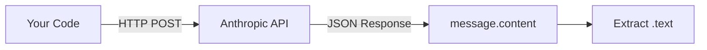
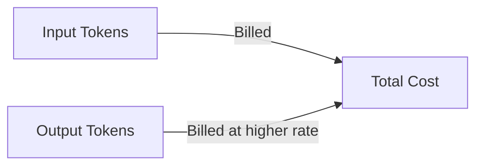
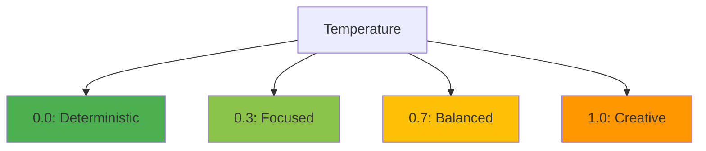
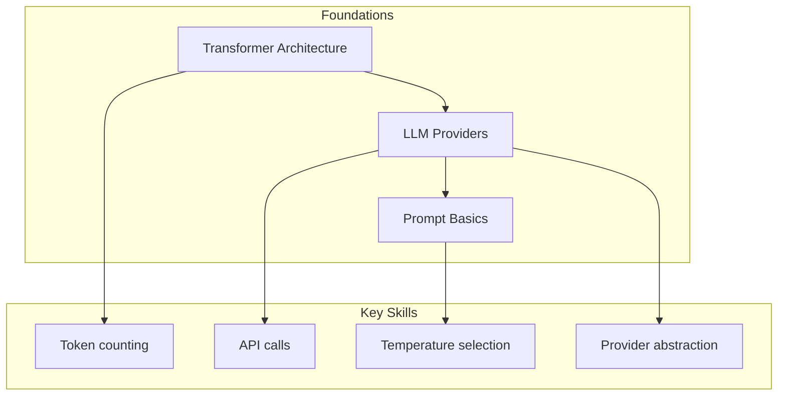

<!-- _class: lead -->

# Module 0: Foundations Cheatsheet

**Quick Reference Card**

> Everything you need at a glance — key concepts, API patterns, token economics, and common gotchas.

<!--
Speaker notes: Key talking points for this slide
- This cheatsheet consolidates Module 0 into a quick reference
- Use this as a lookup during development -- not for learning from scratch
- Print-friendly: each slide covers one topic area
-->

---

# Key Concepts

| Concept | Definition |
|---------|-----------|
| **Transformer** | Neural network using self-attention to process sequences in parallel |
| **Token** | Smallest text unit an LLM processes (subword, word, or character) |
| **Context Window** | Maximum tokens (input + output) per request |
| **Embedding** | Dense vector representation capturing semantic meaning |
| **Attention** | Mechanism allowing each token to weigh relevance of all others |
| **Autoregressive** | Generating one token at a time based on all previous tokens |
| **Temperature** | Controls randomness (0 = deterministic, 2 = very random) |
| **Top-p (Nucleus)** | Sampling from smallest set of tokens exceeding cumulative probability p |

<!--
Speaker notes: Key talking points for this slide
- These are the foundational vocabulary terms for the entire course
- Transformer and Attention are the architecture concepts
- Token, Context Window, and Embedding are the data concepts
- Autoregressive, Temperature, and Top-p are the generation concepts
- Learners should be comfortable defining all eight terms before moving to Module 01
-->

---

# Common API Patterns: Claude

```python
import anthropic

client = anthropic.Anthropic(api_key="your-key")
message = client.messages.create(
    model="claude-sonnet-4-6",
    max_tokens=1024,
    messages=[
        {"role": "user", "content": "Hello, Claude!"}
    ]
)
print(message.content[0].text)
```



<!--
Speaker notes: Key talking points for this slide
- This is the minimal Claude API call -- copy-paste ready
- Note: API key can be set via environment variable (ANTHROPIC_API_KEY) instead of passing directly
- Response structure: message.content is a list -- always access [0].text for single responses
- The Mermaid diagram shows the request/response flow
-->

---

# Common API Patterns: OpenAI

```python
from openai import OpenAI

client = OpenAI(api_key="your-key")
response = client.chat.completions.create(
    model="gpt-4-turbo-preview",
    messages=[
        {"role": "user", "content": "Hello, GPT!"}
    ]
)
print(response.choices[0].message.content)
```

# Streaming Responses (Claude)

```python
with client.messages.stream(
    model="claude-sonnet-4-6",
    max_tokens=1024,
    messages=[{"role": "user", "content": "Tell me a story"}]
) as stream:
    for text in stream.text_stream:
        print(text, end="", flush=True)
```

<!--
Speaker notes: Key talking points for this slide
- OpenAI pattern: similar structure but different response path (choices[0].message.content)
- Streaming: essential for user-facing applications -- provides real-time feedback
- Claude streaming uses a context manager pattern (with ... as stream)
- Both patterns are copy-paste ready -- try them in a notebook
-->

---

# Token Economics Quick Reference

| Model | Context | Input ($/1M tokens) | Output ($/1M tokens) |
|-------|---------|---------------------|----------------------|
| Claude Sonnet 4.6 | 200K | $3.00 | $15.00 |
| Claude Haiku 4.5 | 200K | $0.80 | $4.00 |
| GPT-4o | 128K | $2.50 | $10.00 |
| Llama 3.1 405B | 128K | Free (self-host) | Free (self-host) |

> 🔑 **Rule of Thumb:** 1 word ≈ 1.3 tokens in English



<!--
Speaker notes: Key talking points for this slide
- Output tokens are 3-5x more expensive than input tokens across all providers
- Budget tip: keep max_tokens as low as practical to control output costs
- Self-hosted models have hardware costs instead of per-token costs
- The 1.3 tokens per word ratio is for English -- code and non-English text are higher
-->

---

# Temperature Guide

<div class="columns">
<div>

```python
# Factual, deterministic
# (Q&A, extraction, classification)
temperature=0.0

# Slightly creative
# (summaries, explanations)
temperature=0.3

# Balanced
# (general conversation)
temperature=0.7

# Creative writing
# (stories, brainstorming)
temperature=1.0
```

</div>
<div>



> ✅ For agents and tool calls, always use temperature=0

</div>
</div>

<!--
Speaker notes: Key talking points for this slide
- Temperature is the single most important generation parameter
- For agents: temperature=0 for all decision-making and tool calls -- determinism is critical
- Only use higher temperatures for creative content generation within a pipeline
- If in doubt, start with temperature=0 and increase only if outputs are too repetitive
-->

---

# Gotchas: Context & Tokens

<div class="columns">
<div>

**Context Overflow:**
```python
# Count tokens before sending
token_count = client.count_tokens(text)
if token_count > max_context:
    # Truncate or summarize
```

</div>
<div>

**Output Token Limits:**
```python
# Bad: might truncate mid-sentence
max_tokens=100

# Good: allow full responses
max_tokens=2048
```

</div>
</div>

> ⚠️ Always set `max_tokens` explicitly — models won't complete responses without it.

<!--
Speaker notes: Key talking points for this slide
- Context overflow: the API will reject requests that exceed the context window
- Always count tokens before sending, especially with dynamic content (RAG chunks, conversation history)
- Output token limits: setting max_tokens too low truncates responses mid-thought
- Set max_tokens to accommodate your expected output length with some buffer
-->

---

# Gotchas: Production Concerns

<div class="columns">
<div>

**Rate Limits — Use Backoff:**
```python
from tenacity import (
    retry, stop_after_attempt,
    wait_exponential
)

@retry(
    stop=stop_after_attempt(3),
    wait=wait_exponential(min=1, max=10)
)
def call_api():
    return client.messages.create(...)
```

**API Key Security:**
```python
import os
api_key = os.getenv("ANTHROPIC_API_KEY")
```

</div>
<div>

**Billing Surprises:**
```python
usage = message.usage
cost = (
    usage.input_tokens * 0.000003
    + usage.output_tokens * 0.000015
)
print(f"Request cost: ${cost:.4f}")
```

**Tokenization Differences:**
- Claude: Anthropic API token counter
- GPT: `tiktoken` library
- Llama: Model-specific tokenizer

> ⚠️ Each model uses different tokenizers — always use the correct counter.

</div>
</div>

<!--
Speaker notes: Key talking points for this slide
- Rate limits: every provider has them -- exponential backoff is the standard solution
- API keys: use environment variables in development, secrets managers in production
- Billing: track per-request costs to catch runaway spending early
- Tokenizers: different models tokenize differently -- always use the target model's tokenizer for accurate counts
-->

---

# Module 0 At a Glance



**You should now be able to:**
- Explain how transformers process and generate text
- Choose the right LLM provider for your use case
- Write structured, testable prompts
- Manage tokens, context windows, and API costs

<!--
Speaker notes: Key talking points for this slide
- This is the self-assessment checklist for Module 0
- If any of these four skills feel uncertain, review the relevant deck before proceeding
- Module 01 builds directly on these foundations with advanced prompt engineering
- The skills learned here (API calls, token management, prompt structure) are used in every subsequent module
-->
