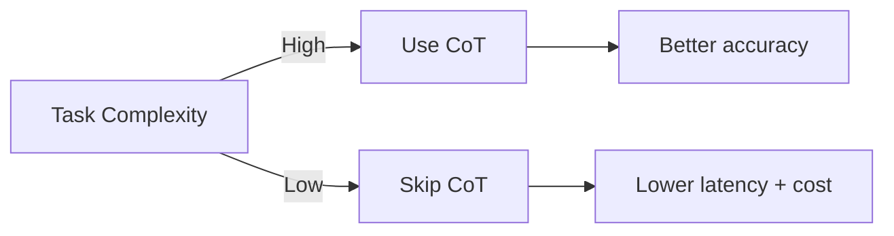
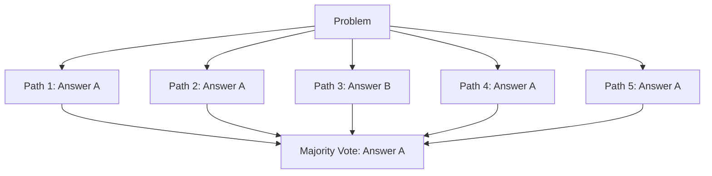
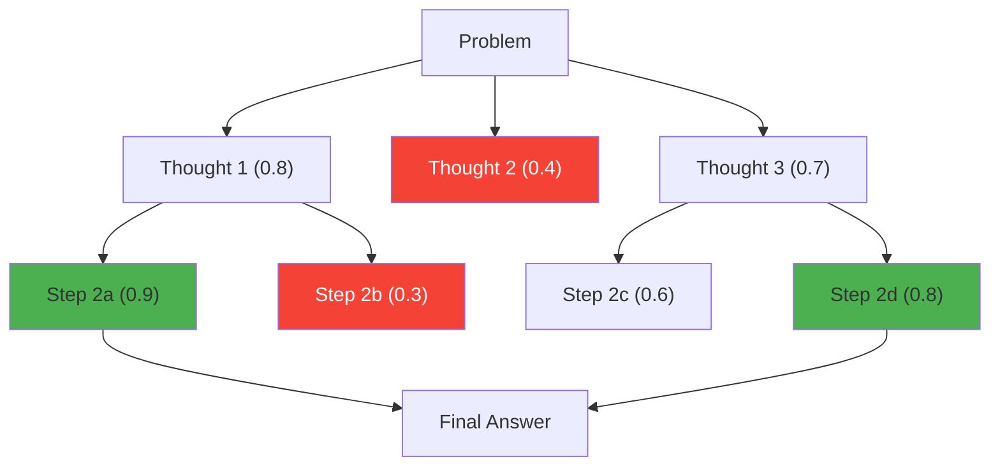
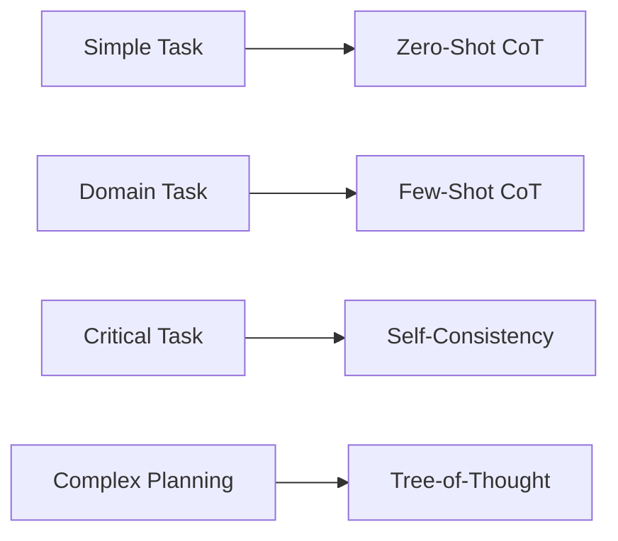
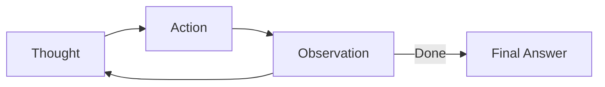
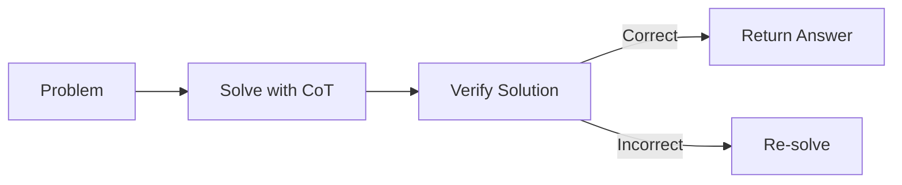
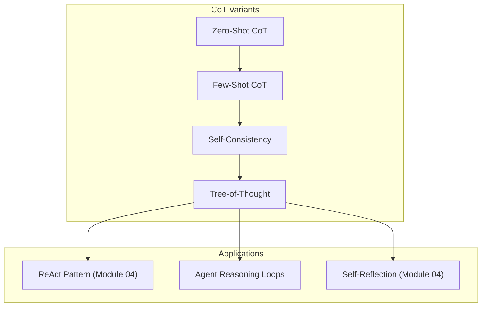

<!-- _class: lead -->

# Chain-of-Thought Reasoning

**Module 01 — Advanced Prompt Engineering**

> When models think out loud, they think better. The reasoning isn't just explanation — it's computation.

<!--
Speaker notes: Key talking points for this slide
- Transition slide: we are now moving into Chain-of-Thought Reasoning
- Pause briefly to let the audience absorb the previous section
- Preview what is coming next in this section
-->
---

# Key Insight

**Autoregressive generation means each token builds on previous tokens.**

By generating reasoning steps, the model creates useful context for its final answer.

<div class="columns">
<div>

**Without CoT:**
```
Q: What is 23 x 47?
A: 1081  <-- Must compute in one step
           (often wrong)
```

</div>
<div>

**With CoT:**
```
Q: What is 23 x 47?
A: Let me calculate step by step:
   23 x 47 = 23 x (40 + 7)
   = 23 x 40 + 23 x 7
   = 920 + 161
   = 1081  <-- Each step provides context
```

</div>
</div>

<!--
Speaker notes: Key talking points for this slide
- Compare the two approaches side by side
- Highlight what makes the recommended approach better
- Point out common mistakes that lead people to the less effective approach
-->
---

# When to Use CoT

| Task Type | CoT Benefit | Example |
|-----------|-------------|---------|
| Math/Logic | **High** | Multi-step calculations |
| Reasoning | **High** | Causal analysis |
| Code | **Medium** | Debugging complex issues |
| Classification | **Low** | Sentiment analysis |
| Translation | **Low** | Direct language transfer |



<!--
Speaker notes: Key talking points for this slide
- Walk through the diagram from left to right (or top to bottom)
- Explain each component and the connections between them
- Relate this architecture back to practical use cases
-->
---

<!-- _class: lead -->

# Chain-of-Thought Variants

<!--
Speaker notes: Key talking points for this slide
- Transition slide: we are now moving into Chain-of-Thought Variants
- Pause briefly to let the audience absorb the previous section
- Preview what is coming next in this section
-->
---

# 1. Zero-Shot CoT

The simplest form — just add "Let's think step by step":

```python
prompt = """A bat and ball cost $1.10 in total. The bat costs $1.00 more
than the ball. How much does the ball cost?

Let's think step by step."""
```

**Output:**
```
Let me call the ball's price "x"
Then the bat's price is "x + $1.00"
Together: x + (x + $1.00) = $1.10
So: 2x + $1.00 = $1.10
Therefore: 2x = $0.10
And: x = $0.05

The ball costs $0.05 (5 cents).
```

> 🔑 One phrase — "Let's think step by step" — dramatically improves reasoning.

<!--
Speaker notes: Key talking points for this slide
- Walk through the code example, focusing on the key pattern being demonstrated
- Highlight the most important lines and explain why they matter
- Point out any edge cases or production considerations
- This code is copy-paste ready for learners to try
-->
---

# 2. Few-Shot CoT

Provide examples with reasoning:

```python
prompt = """Solve these problems by thinking step by step.

Q: Roger has 5 tennis balls. He buys 2 cans of 3 balls each.
   How many tennis balls does he have now?
A: Roger started with 5 balls. He bought 2 x 3 = 6 balls.
   Total: 5 + 6 = 11 tennis balls. The answer is 11.

Q: A juggler has 16 balls. Half are red, half blue.
   He loses 3 red balls. How many balls does he have now?
A: Started with 16 balls. Red: 16/2 = 8. Blue: 16/2 = 8.
   After losing 3 red: 8 - 3 = 5 red.
   Total: 5 + 8 = 13 balls. The answer is 13.

Q: {new_problem}
A: Let's think step by step."""
```

> ✅ Examples teach the model the expected reasoning format.

<!--
Speaker notes: Key talking points for this slide
- Walk through the code example, focusing on the key pattern being demonstrated
- Highlight the most important lines and explain why they matter
- Point out any edge cases or production considerations
- This code is copy-paste ready for learners to try
-->
---

# 3. Self-Consistency

Generate multiple reasoning paths, take the majority answer:

```python
def solve_with_self_consistency(problem: str, n_samples: int = 5) -> str:
    answers = []
    for _ in range(n_samples):
        response = client.messages.create(
            model="claude-sonnet-4-6",
            max_tokens=1000,
            temperature=0.7,  # Higher temperature for diversity
            messages=[{"role": "user",
                "content": f"Solve step by step, end with ANSWER: [answer]\n\n{problem}"}]
        )
        text = response.content[0].text
        if "ANSWER:" in text:
            answers.append(text.split("ANSWER:")[-1].strip())

    return Counter(answers).most_common(1)[0][0]
```



<!--
Speaker notes: Key talking points for this slide
- Walk through the code block line by line, emphasizing the key pattern
- The diagram below shows the architecture/flow visually
- Point out how the code maps to the diagram components
- Highlight any production considerations or gotchas
-->
---

# 4. Tree-of-Thought (ToT)

Explore multiple reasoning branches, evaluate, and prune:



Key steps:
1. **Generate** multiple possible next thoughts
2. **Evaluate** how promising each thought is (0-1)
3. **Select** top-scoring paths
4. **Recurse** to explore further

<!--
Speaker notes: Key talking points for this slide
- Walk through the diagram from left to right (or top to bottom)
- Explain each component and the connections between them
- Relate this architecture back to practical use cases
-->
---

# ToT Implementation

```python
def tree_of_thought(problem: str, breadth: int = 3, depth: int = 3) -> str:
    def generate_thoughts(context: str, n: int) -> list[str]:
        response = client.messages.create(
            model="claude-sonnet-4-6", max_tokens=1000,
            temperature=0.8,
            messages=[{"role": "user",
                "content": f"Given:\n{context}\nGenerate {n} possible next steps."}])
        return parse_numbered_list(response.content[0].text)[:n]

    def evaluate_thought(context: str, thought: str) -> float:
        response = client.messages.create(
            model="claude-sonnet-4-6", max_tokens=100,
            temperature=0,
            messages=[{"role": "user",
                "content": f"Rate this reasoning 0.0 to 1.0:\n{context}\nStep: {thought}"}])
        return float(response.content[0].text.strip())
```

<!--
Speaker notes: Key talking points for this slide
- Walk through the code example, focusing on the key pattern being demonstrated
- Highlight the most important lines and explain why they matter
- Point out any edge cases or production considerations
- This code is copy-paste ready for learners to try
-->
---

# ToT Implementation (continued)

```python
paths = [(problem, 0.5)]
    for _ in range(depth):
        new_paths = []
        for context, _ in paths[:breadth]:
            for thought in generate_thoughts(context, breadth):
                score = evaluate_thought(context, thought)
                new_paths.append((f"{context}\nStep: {thought}", score))
        paths = sorted(new_paths, key=lambda x: x[1], reverse=True)[:breadth]

    return get_final_answer(paths[0][0])
```

<!--
Speaker notes: Key talking points for this slide
- Continuation of the previous code block
- Walk through the remaining implementation details
- Highlight any key patterns or important lines
-->
---

# CoT Variant Comparison

| Variant | Accuracy | Cost | Latency | Best For |
|---------|----------|------|---------|----------|
| Zero-Shot CoT | Good | Low | Low | General reasoning |
| Few-Shot CoT | Better | Low | Low | Domain-specific tasks |
| Self-Consistency | Higher | Medium | Medium | Math, logic |
| Tree-of-Thought | Highest | High | High | Complex planning |



<!--
Speaker notes: Key talking points for this slide
- Walk through the diagram from left to right (or top to bottom)
- Explain each component and the connections between them
- Relate this architecture back to practical use cases
-->
---

<!-- _class: lead -->

# Structured Reasoning Patterns

<!--
Speaker notes: Key talking points for this slide
- Transition slide: we are now moving into Structured Reasoning Patterns
- Pause briefly to let the audience absorb the previous section
- Preview what is coming next in this section
-->
---

# The ReAct Pattern (Preview)

Reasoning + Acting in an interleaved loop:

```
Thought: I need to find the population of France.
Action:  search("France population 2024")
Observation: France has approximately 68 million people.
Thought: Now I can answer the question.
Answer:  France has approximately 68 million people.
```



> 🔑 ReAct combines reasoning (CoT) with tool use — covered in depth in Module 04.

<!--
Speaker notes: Key talking points for this slide
- Walk through the diagram from left to right (or top to bottom)
- Explain each component and the connections between them
- Relate this architecture back to practical use cases
-->
---

# Step-Back and Decomposition

<div class="columns">
<div>

**Step-Back Prompting:**
Ask for principles before specifics:
```python
prompt = """Before solving, let's step back.

Problem: {specific_problem}

Step 1: What general principles apply?
Step 2: How do they guide the solution?
Step 3: Now solve the specific problem.
"""
```

</div>
<div>

**Decomposition Prompting:**
Break complex questions into sub-questions:
```python
prompt = """Break this into smaller parts.

Question: {complex_question}

Sub-questions:
1. [identify sub-question 1]
2. [identify sub-question 2]

Now answer each:
Sub-question 1: ...
"""
```

</div>
</div>

<!--
Speaker notes: Key talking points for this slide
- Walk through the code example, focusing on the key pattern being demonstrated
- Highlight the most important lines and explain why they matter
- Point out any edge cases or production considerations
- This code is copy-paste ready for learners to try
-->
---

<!-- _class: lead -->

# Implementation Patterns

<!--
Speaker notes: Key talking points for this slide
- Transition slide: we are now moving into Implementation Patterns
- Pause briefly to let the audience absorb the previous section
- Preview what is coming next in this section
-->
---

# Basic CoT Wrapper

```python
def with_cot(prompt: str, cot_trigger: str = "Let's think step by step.") -> str:
    """Add chain-of-thought to any prompt."""
    response = client.messages.create(
        model="claude-sonnet-4-6",
        max_tokens=2000,
        messages=[{"role": "user", "content": f"{prompt}\n\n{cot_trigger}"}]
    )
    return response.content[0].text
```

# CoT with Answer Extraction

```python
def solve_with_cot(problem: str) -> dict:
    response = client.messages.create(
        model="claude-sonnet-4-6", max_tokens=2000,
        messages=[{"role": "user",
            "content": f"Solve step by step.\n\nProblem: {problem}\n\n"
                       f"Provide answer as: <answer>your answer</answer>"}])
    text = response.content[0].text
    reasoning = text.split("<answer>")[0].strip()
    answer = text.split("<answer>")[1].split("</answer>")[0].strip()
    return {"reasoning": reasoning, "answer": answer}
```

<!--
Speaker notes: Key talking points for this slide
- Walk through the code example, focusing on the key pattern being demonstrated
- Highlight the most important lines and explain why they matter
- Point out any edge cases or production considerations
- This code is copy-paste ready for learners to try
-->
---

# Verifier Pattern

Have the model check its own work:

```python
def solve_and_verify(problem: str) -> dict:
    # Step 1: Solve
    solution = solve_with_cot(problem)

    # Step 2: Verify
    verification = client.messages.create(
        model="claude-sonnet-4-6", max_tokens=1000,
        messages=[{"role": "user",
            "content": f"Check if correct.\n\nProblem: {problem}\n\n"
                       f"Solution: {solution['reasoning']}\n"
                       f"Answer: {solution['answer']}\n\n"
                       f"End with: VERDICT: CORRECT or VERDICT: INCORRECT"}])

    is_correct = "VERDICT: CORRECT" in verification.content[0].text
    return {**solution, "verified_correct": is_correct}
```



<!--
Speaker notes: Key talking points for this slide
- Walk through the code block line by line, emphasizing the key pattern
- The diagram below shows the architecture/flow visually
- Point out how the code maps to the diagram components
- Highlight any production considerations or gotchas
-->
---

# When CoT Hurts

<div class="columns">
<div>

**Unnecessary for:**
- Simple factual recall
- Basic classification
- Direct translation

**Can actively hurt:**
- Time-sensitive applications (adds latency)
- Token-limited contexts (consumes output tokens)
- May rationalize incorrect answers

</div>
<div>

**Adaptive CoT:**
```python
def adaptive_cot(problem, threshold=0.5):
    """Use CoT only for complex problems."""
    complexity = assess_complexity(problem)

    if complexity > threshold:
        return with_cot(problem)
    else:
        return direct_answer(problem)
```

> ⚠️ Don't over-engineer simple problems with CoT.

</div>
</div>

<!--
Speaker notes: Key talking points for this slide
- Walk through the code example, focusing on the key pattern being demonstrated
- Highlight the most important lines and explain why they matter
- Point out any edge cases or production considerations
- This code is copy-paste ready for learners to try
-->
---

# Summary & Connections



**Key takeaways:**
- CoT makes models reason better by turning implicit computation into explicit tokens
- Use Zero-Shot CoT for quick wins, Few-Shot for domain tasks
- Self-Consistency improves reliability through majority voting
- Tree-of-Thought handles the most complex reasoning tasks
- Always extract final answers with structured output markers

> *Chain-of-thought transforms LLMs from pattern matchers to reasoners.*

<!--
Speaker notes: Key talking points for this slide
- Walk through the diagram from left to right (or top to bottom)
- Explain each component and the connections between them
- Relate this architecture back to practical use cases
-->