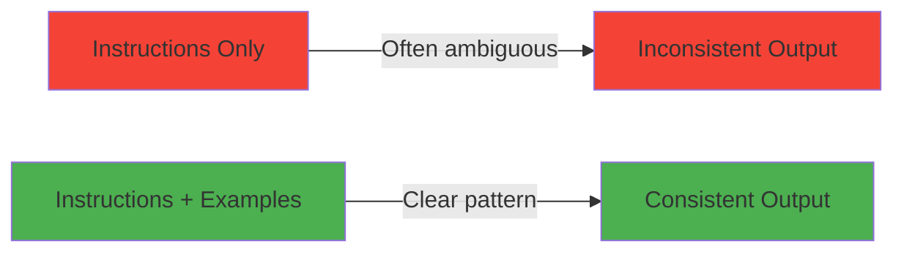
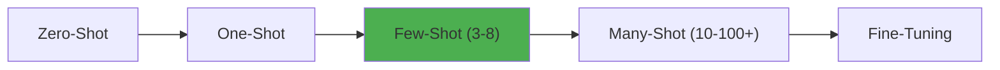
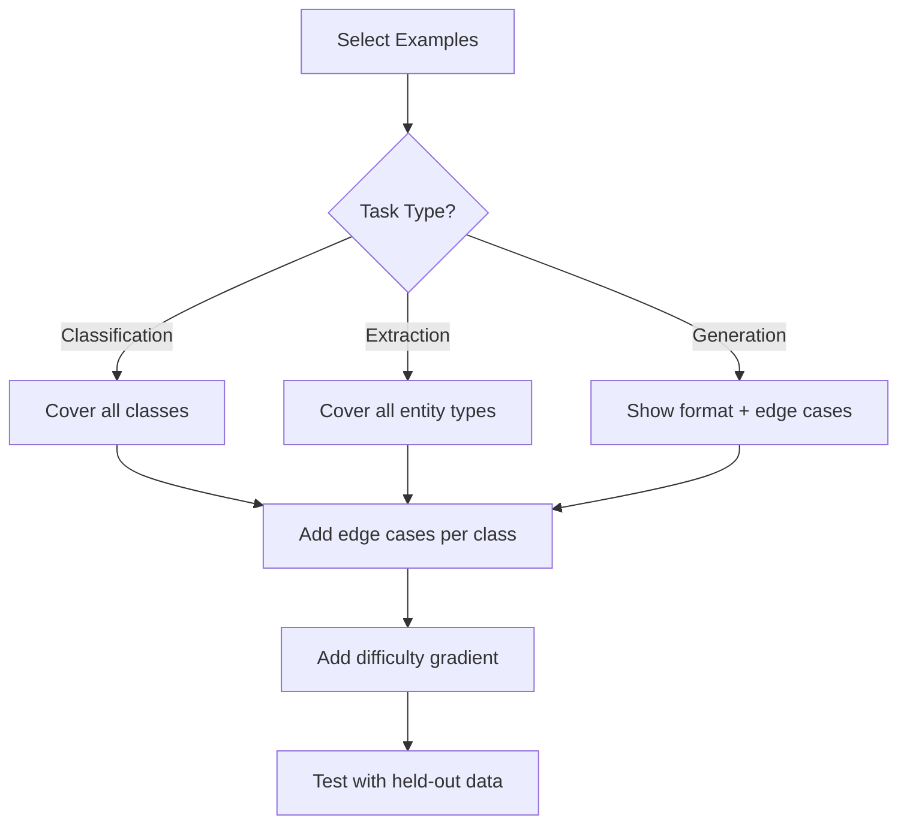
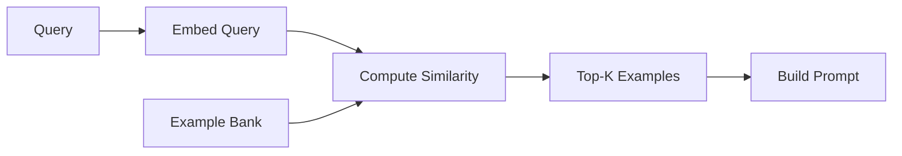
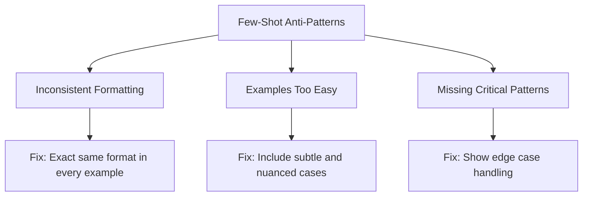
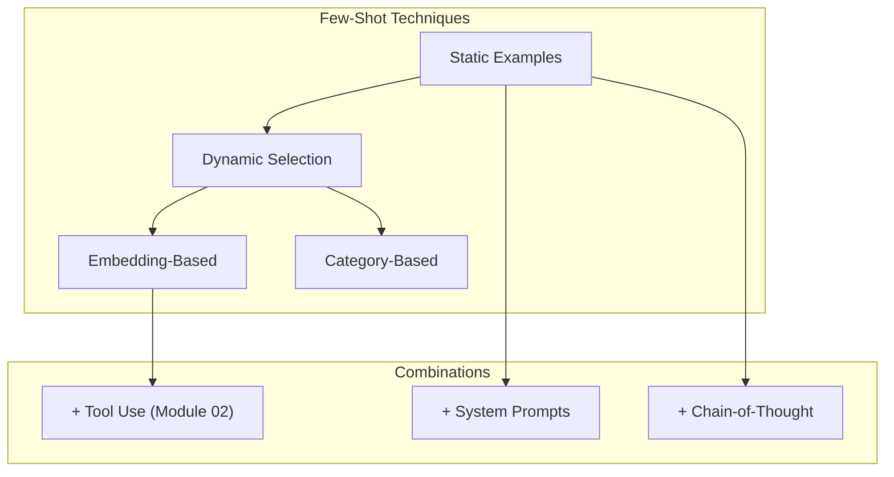

<!-- _class: lead -->

# Few-Shot Learning: Teaching by Example

**Module 01 — Advanced Prompt Engineering**

> Show, don't just tell. A single well-chosen example often conveys more than paragraphs of instructions.

<!--
Speaker notes: Key talking points for this slide
- Transition slide: we are now moving into Few-Shot Learning: Teaching by Example
- Pause briefly to let the audience absorb the previous section
- Preview what is coming next in this section
-->
---

# Key Insight

**Examples demonstrate format, tone, edge case handling, and implicit rules that are hard to describe but easy to recognize.**



<!--
Speaker notes: Key talking points for this slide
- Walk through the diagram from left to right (or top to bottom)
- Explain each component and the connections between them
- Relate this architecture back to practical use cases
-->
---

# The Spectrum of Shot Learning

| Type | Examples | Use When |
|------|----------|----------|
| **Zero-Shot** | None | Task is simple and well-understood |
| **One-Shot** | 1 | Need to show format only |
| **Few-Shot** | 3-8 | Need consistency and nuance |
| **Many-Shot** | 10-100+ | Complex tasks, consider fine-tuning |



<!--
Speaker notes: Key talking points for this slide
- Walk through the diagram from left to right (or top to bottom)
- Explain each component and the connections between them
- Relate this architecture back to practical use cases
-->
---

# Zero-Shot vs One-Shot vs Few-Shot

<div class="columns">
<div>

**Zero-Shot:**
```
Classify the sentiment:
"This product exceeded my expectations!"
```

**One-Shot:**
```
Example:
"I love this!" -> Positive

Classify:
"This product exceeded my expectations!"
```

</div>
<div>

**Few-Shot:**
```
Examples:
"I love this!" -> Positive
"Terrible experience." -> Negative
"It was okay." -> Neutral

Classify:
"This product exceeded my expectations!"
```

> 🔑 More examples = more consistent format adherence.

</div>
</div>

<!--
Speaker notes: Key talking points for this slide
- Compare the two approaches side by side
- Highlight what makes the recommended approach better
- Point out common mistakes that lead people to the less effective approach
-->
---

<!-- _class: lead -->

# Effective Example Selection

<!--
Speaker notes: Key talking points for this slide
- Transition slide: we are now moving into Effective Example Selection
- Pause briefly to let the audience absorb the previous section
- Preview what is coming next in this section
-->
---

# Principle 1: Coverage

Include examples that cover the range of expected inputs:

<div class="columns">
<div>

**Bad: All similar**
```python
examples = [
    ("I love it!", "Positive"),
    ("This is great!", "Positive"),
    ("Amazing product!", "Positive"),
]
```

</div>
<div>

**Good: Diverse coverage**
```python
examples = [
    ("I love it!", "Positive"),
    ("Terrible, waste of money.", "Negative"),
    ("It works, nothing special.", "Neutral"),
    ("Great features but poor battery.",
     "Mixed"),
]
```

</div>
</div>

<!--
Speaker notes: Key talking points for this slide
- Walk through the code example, focusing on the key pattern being demonstrated
- Highlight the most important lines and explain why they matter
- Point out any edge cases or production considerations
- This code is copy-paste ready for learners to try
-->
---

# Principle 2: Difficulty Gradient

Include easy and hard examples:

```python
examples = [
    # Easy (clear sentiment)
    ("Best purchase ever!", "Positive"),
    ("Complete garbage.", "Negative"),

    # Hard (nuanced)
    ("Not bad, I suppose.", "Neutral"),         # Faint praise
    ("Could be worse.", "Neutral"),              # Backhanded
    ("Love the idea, hate the execution.", "Mixed"),
]
```

# Principle 3: Edge Cases

```python
examples = [
    ("Great product!", "Positive"),       # Standard
    ("", "Invalid - empty input"),        # Empty
    ("???", "Invalid - no text content"), # Gibberish
    ("10/10 would not recommend", "Negative"),  # Sarcasm
]
```

<!--
Speaker notes: Key talking points for this slide
- Walk through the code example, focusing on the key pattern being demonstrated
- Highlight the most important lines and explain why they matter
- Point out any edge cases or production considerations
- This code is copy-paste ready for learners to try
-->
---

# Example Selection Decision Tree



<!--
Speaker notes: Key talking points for this slide
- Walk through the diagram from left to right (or top to bottom)
- Explain each component and the connections between them
- Relate this architecture back to practical use cases
-->
---

<!-- _class: lead -->

# Few-Shot Prompt Structures

<!--
Speaker notes: Key talking points for this slide
- Transition slide: we are now moving into Few-Shot Prompt Structures
- Pause briefly to let the audience absorb the previous section
- Preview what is coming next in this section
-->
---

# Basic Structure

```python
def create_few_shot_prompt(examples: list[tuple], task: str) -> str:
    """Create a few-shot prompt from examples."""
    prompt = "Examples:\n\n"
    for input_text, output_text in examples:
        prompt += f"Input: {input_text}\nOutput: {output_text}\n\n"
    prompt += f"Input: {task}\nOutput:"
    return prompt
```

# Structured with Instructions

```python
def create_guided_few_shot(task_description, examples, input_text):
    prompt = f"{task_description}\n\nFollow these examples exactly:\n\n"
    for ex in examples:
        prompt += f"---\nInput: {ex['input']}\nOutput: {ex['output']}\n"
    prompt += f"---\nInput: {input_text}\nOutput:"
    return prompt
```

<!--
Speaker notes: Key talking points for this slide
- Walk through the code example, focusing on the key pattern being demonstrated
- Highlight the most important lines and explain why they matter
- Point out any edge cases or production considerations
- This code is copy-paste ready for learners to try
-->
---

# Few-Shot with Reasoning (CoT)

```python
examples_with_reasoning = [
    {
        "input": "A farmer has 17 sheep. All but 9 run away. How many are left?",
        "reasoning": "This is a trick question. 'All but 9' means 9 remain.",
        "output": "9 sheep"
    },
    {
        "input": "If you have 6 apples and take 2, how many do you have?",
        "reasoning": "The question asks how many YOU have. You took 2.",
        "output": "2 apples"
    }
]
```

> 🔑 Combining few-shot with chain-of-thought teaches both format AND reasoning style.

<!--
Speaker notes: Key talking points for this slide
- Walk through the code example, focusing on the key pattern being demonstrated
- Highlight the most important lines and explain why they matter
- Point out any edge cases or production considerations
- This code is copy-paste ready for learners to try
-->
---

# Few-Shot with Reasoning (CoT) (continued)

```python
def few_shot_cot(examples: list[dict], question: str) -> str:
    prompt = "Solve these problems, showing your reasoning:\n\n"
    for ex in examples:
        prompt += f"Question: {ex['input']}\n"
        prompt += f"Reasoning: {ex['reasoning']}\n"
        prompt += f"Answer: {ex['output']}\n\n"
    prompt += f"Question: {question}\nReasoning:"
    return prompt
```

<!--
Speaker notes: Key talking points for this slide
- Continuation of the previous code block
- Walk through the remaining implementation details
- Highlight any key patterns or important lines
-->
---

<!-- _class: lead -->

# Dynamic Example Selection

<!--
Speaker notes: Key talking points for this slide
- Transition slide: we are now moving into Dynamic Example Selection
- Pause briefly to let the audience absorb the previous section
- Preview what is coming next in this section
-->
---

# Embedding-Based Selection

Choose examples most similar to the input:

```python
from sentence_transformers import SentenceTransformer
import numpy as np

class DynamicFewShot:
    def __init__(self, examples: list[dict]):
        self.examples = examples
        self.model = SentenceTransformer('all-MiniLM-L6-v2')
        self.embeddings = self.model.encode([ex['input'] for ex in examples])

    def select_examples(self, query: str, k: int = 3) -> list[dict]:
        query_emb = self.model.encode([query])[0]
        similarities = np.dot(self.embeddings, query_emb) / (
            np.linalg.norm(self.embeddings, axis=1) * np.linalg.norm(query_emb))
        top_indices = np.argsort(similarities)[-k:][::-1]
        return [self.examples[i] for i in top_indices]
```



<!--
Speaker notes: Key talking points for this slide
- Walk through the code block line by line, emphasizing the key pattern
- The diagram below shows the architecture/flow visually
- Point out how the code maps to the diagram components
- Highlight any production considerations or gotchas
-->
---

# Category-Based Selection

Ensure examples cover different categories:

```python
def select_diverse_examples(examples, query, k=4):
    """Select examples ensuring category diversity."""
    by_category = {}
    for ex in examples:
        cat = ex.get('category', 'default')
        by_category.setdefault(cat, []).append(ex)
```

> ✅ Dynamic selection ensures the most relevant examples are always used.

<!--
Speaker notes: Key talking points for this slide
- Walk through the code example, focusing on the key pattern being demonstrated
- Highlight the most important lines and explain why they matter
- Point out any edge cases or production considerations
- This code is copy-paste ready for learners to try
-->
---

# Category-Based Selection (continued)

```python
# Round-robin from each category
    selected = []
    categories = list(by_category.keys())
    i = 0
    while len(selected) < k and any(by_category.values()):
        cat = categories[i % len(categories)]
        if by_category[cat]:
            selected.append(by_category[cat].pop(0))
        i += 1
    return selected
```

<!--
Speaker notes: Key talking points for this slide
- Continuation of the previous code block
- Walk through the remaining implementation details
- Highlight any key patterns or important lines
-->
---

# Format Examples: JSON Output

```python
prompt = """Examples of entity extraction:

Input: "Microsoft acquired GitHub for $7.5 billion"
Output: {
    "entities": [
        {"name": "Microsoft", "type": "company"},
        {"name": "GitHub", "type": "company"},
        {"name": "$7.5 billion", "type": "money"}
    ],
    "relation": "acquisition"
}
```

<!--
Speaker notes: Key talking points for this slide
- Walk through the code example, focusing on the key pattern being demonstrated
- Highlight the most important lines and explain why they matter
- Point out any edge cases or production considerations
- This code is copy-paste ready for learners to try
-->
---

# Format Examples: JSON Output (continued)

```python
Input: "Satya Nadella became CEO in 2014"
Output: {
    "entities": [
        {"name": "Satya Nadella", "type": "person"},
        {"name": "CEO", "type": "title"},
        {"name": "2014", "type": "date"}
    ],
    "relation": "appointment"
}

Input: "{user_input}"
Output:"""
```

<!--
Speaker notes: Key talking points for this slide
- Continuation of the previous code block
- Walk through the remaining implementation details
- Highlight any key patterns or important lines
-->
---

# Anti-Patterns



<!--
Speaker notes: Key talking points for this slide
- Walk through the diagram from left to right (or top to bottom)
- Explain each component and the connections between them
- Relate this architecture back to practical use cases
-->
---

# Anti-Pattern Details

<div class="columns">
<div>

**1. Inconsistent Formatting:**
```python
# Bad
("good movie", "POSITIVE"),
("bad movie", "negative"),
("okay movie", "Neutral sentiment"),

# Good
("good movie", "Positive"),
("bad movie", "Negative"),
("okay movie", "Neutral"),
```

</div>
<div>

**2. Only Easy Cases:**
```python
# Bad
("I LOVE IT!!!", "Positive"),
("HATE THIS!!!", "Negative"),

# Good: Include subtle
("I LOVE IT!!!", "Positive"),
("It's fine, I guess", "Neutral"),
("Could have been better", "Negative"),
```

</div>
</div>

> ⚠️ The model mirrors your examples exactly — inconsistency in examples produces inconsistency in output.

<!--
Speaker notes: Key talking points for this slide
- Walk through the code example, focusing on the key pattern being demonstrated
- Highlight the most important lines and explain why they matter
- Point out any edge cases or production considerations
- This code is copy-paste ready for learners to try
-->
---

# Optimal Example Counts

| Task Complexity | Recommended Examples |
|----------------|---------------------|
| Simple classification | 2-3 |
| Moderate extraction | 4-6 |
| Complex reasoning | 5-8 |
| Highly nuanced | 8-15 |

**Guidelines:**
- Start with 3 examples, add more if quality is inconsistent
- Watch for diminishing returns (usually after 8-10)
- Balance example count against token costs
- Consider dynamic selection for large example banks

<!--
Speaker notes: Key talking points for this slide
- Explain the core concept on this slide clearly and concisely
- Relate it back to practical agent building scenarios
- Highlight any common pitfalls or misconceptions
- Connect to what was covered previously and what comes next
-->
---

# Combining Techniques

<div class="columns">
<div>

**Few-Shot + System Prompt:**
```python
system = """You are a customer support
classifier. Always respond with exactly
one category."""

few_shot = """
"Can't log in" -> Account Access
"When will my order arrive?" -> Order Status
"How do I get a refund?" -> Billing

"{customer_message}" ->"""
```

</div>
<div>

**Few-Shot + Chain-of-Thought:**
```python
prompt = """
Q: The cafeteria had 23 apples.
   Used 20, bought 6 more.
   How many?
Thought: 23-20=3, 3+6=9.
Answer: 9

Q: {word_problem}
Thought:"""
```

</div>
</div>

<!--
Speaker notes: Key talking points for this slide
- Walk through the code example, focusing on the key pattern being demonstrated
- Highlight the most important lines and explain why they matter
- Point out any edge cases or production considerations
- This code is copy-paste ready for learners to try
-->
---

# Testing Few-Shot Prompts

```python
def evaluate_few_shot(prompt_template, test_cases, examples):
    results = []
    for case in test_cases:
        prompt = prompt_template.format(
            examples=format_examples(examples), input=case["input"])
        response = call_llm(prompt)
        exact_match = response.strip() == case["expected"]
        contains = case["expected"].lower() in response.lower()
        results.append({"exact_match": exact_match, "contains": contains})

    return {
        "exact_match_rate": sum(r["exact_match"] for r in results) / len(results),
        "contains_rate": sum(r["contains"] for r in results) / len(results),
    }
```

<!--
Speaker notes: Key talking points for this slide
- Walk through the code example, focusing on the key pattern being demonstrated
- Highlight the most important lines and explain why they matter
- Point out any edge cases or production considerations
- This code is copy-paste ready for learners to try
-->
---

# Summary & Connections



**Key takeaways:**
- Examples communicate more effectively than instructions alone
- Cover the full range: easy cases, hard cases, and edge cases
- Keep formatting perfectly consistent across all examples
- Use dynamic selection for large example banks
- 3-8 examples is the sweet spot for most tasks

> *Choose your examples as carefully as you would write production code — they directly shape your agent's behavior.*

<!--
Speaker notes: Key talking points for this slide
- Walk through the diagram from left to right (or top to bottom)
- Explain each component and the connections between them
- Relate this architecture back to practical use cases
-->