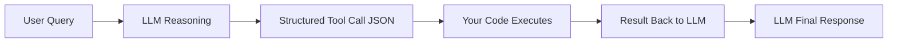
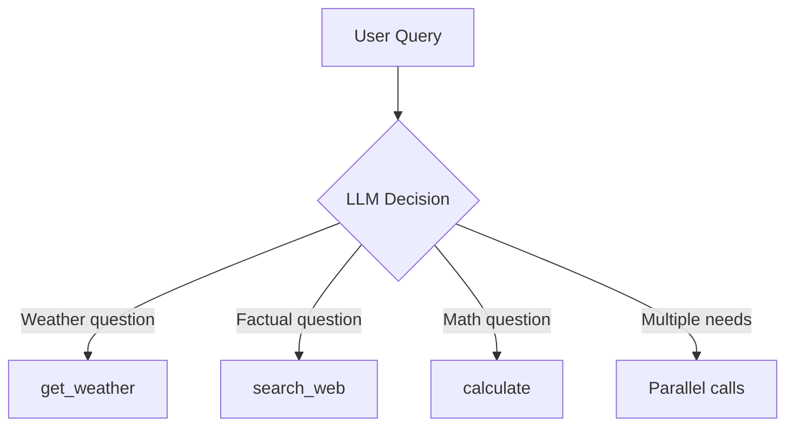
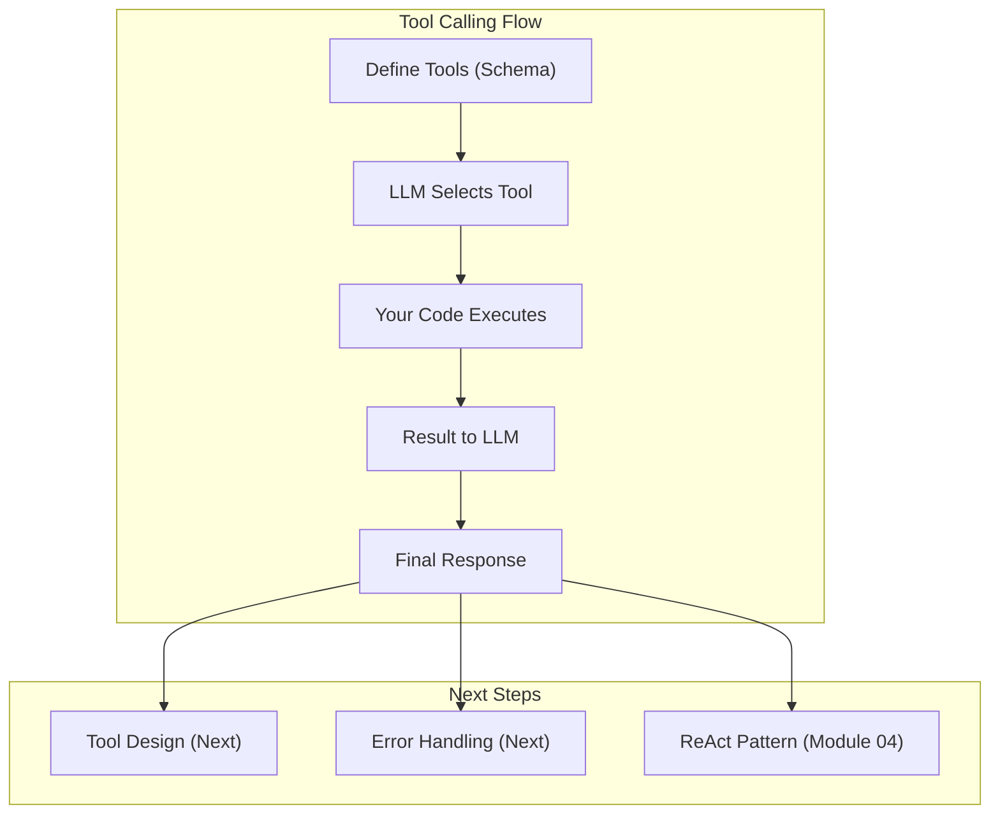

<!-- _class: lead -->

# Tool Fundamentals: How LLM Tool Calling Works

**Module 02 — Tool Use & Function Calling**

> The model doesn't execute tools — it generates instructions for you to execute. This separation is crucial for security, control, and integration.

<!--
Speaker notes: Key talking points for this slide
- Transition slide: we are now moving into Tool Fundamentals: How LLM Tool Calling Works
- Pause briefly to let the audience absorb the previous section
- Preview what is coming next in this section
-->
---

# Key Insight

**Tool calling is a structured output format that your code interprets.**

The LLM decides *when* to call a tool and *with what arguments*. Your code handles execution.



<!--
Speaker notes: Key talking points for this slide
- Walk through the diagram from left to right (or top to bottom)
- Explain each component and the connections between them
- Relate this architecture back to practical use cases
-->
---

# The Tool Calling Flow

```
1. USER INPUT       "What's the weather in Tokyo?"
        |
2. LLM RECEIVES     system prompt + tools + user message
        |
3. LLM DECIDES      "I need get_weather for this query"
        |
4. LLM GENERATES    {"name": "get_weather", "arguments": {"city": "Tokyo"}}
        |
5. YOUR CODE RUNS   result = get_weather("Tokyo")
        |
6. RESULT TO LLM    {"temp": 22, "conditions": "sunny"}
        |
7. FINAL RESPONSE   "The weather in Tokyo is sunny, 22C."
```

<!--
Speaker notes: Key talking points for this slide
- Explain the core concept on this slide clearly and concisely
- Relate it back to practical agent building scenarios
- Highlight any common pitfalls or misconceptions
- Connect to what was covered previously and what comes next
-->
---

# Step 1: Define Tools

```python
tools = [
    {
        "name": "get_weather",
        "description": "Get current weather for a city. Use when users ask about weather.",
        "input_schema": {
            "type": "object",
            "properties": {
                "city": {
                    "type": "string",
                    "description": "The city name, e.g., 'Tokyo' or 'New York'"
                },
```

> 🔑 The `description` field is a prompt — it tells the LLM when to use this tool.

<!--
Speaker notes: Key talking points for this slide
- Walk through the code example, focusing on the key pattern being demonstrated
- Highlight the most important lines and explain why they matter
- Point out any edge cases or production considerations
- This code is copy-paste ready for learners to try
-->
---

# Step 1: Define Tools (continued)

```python
"units": {
                    "type": "string",
                    "enum": ["celsius", "fahrenheit"],
                    "description": "Temperature units"
                }
            },
            "required": ["city"]
        }
    }
]
```

<!--
Speaker notes: Key talking points for this slide
- Continuation of the previous code block
- Walk through the remaining implementation details
- Highlight any key patterns or important lines
-->
---

# Step 2: Implement Execution

```python
def execute_tool(name: str, arguments: dict) -> str:
    """Execute a tool and return the result as a string."""
    if name == "get_weather":
        city = arguments["city"]
        return json.dumps({
            "city": city, "temperature": 22,
            "conditions": "sunny", "humidity": 65
        })
    else:
        return json.dumps({"error": f"Unknown tool: {name}"})
```

# Step 3: The Agent Loop

```python
response = client.messages.create(
    model="claude-sonnet-4-6", max_tokens=1024,
    tools=tools, messages=messages)

while response.stop_reason == "tool_use":
    # Extract tool calls, execute them, add results, continue
    ...
```

<!--
Speaker notes: Key talking points for this slide
- Walk through the code example, focusing on the key pattern being demonstrated
- Highlight the most important lines and explain why they matter
- Point out any edge cases or production considerations
- This code is copy-paste ready for learners to try
-->
---

# Complete Agent Loop

```python
def run_agent(user_message: str) -> str:
    messages = [{"role": "user", "content": user_message}]
    response = client.messages.create(
        model="claude-sonnet-4-6", max_tokens=1024,
        tools=tools, messages=messages)

    while response.stop_reason == "tool_use":
        tool_calls = [b for b in response.content if b.type == "tool_use"]
        messages.append({"role": "assistant", "content": response.content})
```

<!--
Speaker notes: Key talking points for this slide
- Walk through the code example, focusing on the key pattern being demonstrated
- Highlight the most important lines and explain why they matter
- Point out any edge cases or production considerations
- This code is copy-paste ready for learners to try
-->
---

# Complete Agent Loop (continued)

```python
tool_results = []
        for tool_call in tool_calls:
            result = execute_tool(tool_call.name, tool_call.input)
            tool_results.append({
                "type": "tool_result",
                "tool_use_id": tool_call.id, "content": result})

        messages.append({"role": "user", "content": tool_results})
        response = client.messages.create(
            model="claude-sonnet-4-6", max_tokens=1024,
            tools=tools, messages=messages)

    return "".join(b.text for b in response.content if hasattr(b, "text"))
```

<!--
Speaker notes: Key talking points for this slide
- Continuation of the previous code block
- Walk through the remaining implementation details
- Highlight any key patterns or important lines
-->
---

# Tool Schema: JSON Schema Basics

```python
tool = {
    "name": "search_database",
    "description": "Search a database for records matching criteria",
    "input_schema": {
        "type": "object",
        "properties": {
            "table": {
                "type": "string",
                "enum": ["users", "orders", "products"]
            },
            "query": {"type": "string"},
            "limit": {
```

<!--
Speaker notes: Key talking points for this slide
- Walk through the code example, focusing on the key pattern being demonstrated
- Highlight the most important lines and explain why they matter
- Point out any edge cases or production considerations
- This code is copy-paste ready for learners to try
-->
---

# Tool Schema: JSON Schema Basics (continued)

```python
"type": "integer",
                "default": 10, "minimum": 1, "maximum": 100
            },
            "filters": {
                "type": "object",
                "additionalProperties": {"type": "string"}
            }
        },
        "required": ["table", "query"]
    }
}
```

<!--
Speaker notes: Key talking points for this slide
- Continuation of the previous code block
- Walk through the remaining implementation details
- Highlight any key patterns or important lines
-->
---

# Common Schema Types

<div class="columns">
<div>

**String with constraints:**
```json
{
    "type": "string",
    "minLength": 1,
    "maxLength": 1000,
    "pattern": "^[a-z]+$"
}
```

**Number with range:**
```json
{
    "type": "number",
    "minimum": 0,
    "maximum": 100
}
```

</div>
<div>

**Array of items:**
```json
{
    "type": "array",
    "items": {"type": "string"},
    "minItems": 1,
    "maxItems": 10,
    "uniqueItems": true
}
```

**Enum (fixed choices):**
```json
{
    "type": "string",
    "enum": ["option1", "option2", "option3"]
}
```

</div>
</div>

<!--
Speaker notes: Key talking points for this slide
- Walk through the code example, focusing on the key pattern being demonstrated
- Highlight the most important lines and explain why they matter
- Point out any edge cases or production considerations
- This code is copy-paste ready for learners to try
-->
---

<!-- _class: lead -->

# Multiple & Parallel Tools

<!--
Speaker notes: Key talking points for this slide
- Transition slide: we are now moving into Multiple & Parallel Tools
- Pause briefly to let the audience absorb the previous section
- Preview what is coming next in this section
-->
---

# Providing Multiple Tools



The model selects tools based on:
1. **Description matching**: Query keywords vs tool description
2. **Capability matching**: What the tool can do vs what's needed
3. **Specificity**: More specific tools preferred when applicable

<!--
Speaker notes: Key talking points for this slide
- Walk through the diagram from left to right (or top to bottom)
- Explain each component and the connections between them
- Relate this architecture back to practical use cases
-->
---

# Parallel Tool Execution

```python
import asyncio
from concurrent.futures import ThreadPoolExecutor

async def execute_tools_parallel(tool_calls: list) -> list:
    """Execute multiple tool calls in parallel."""
    loop = asyncio.get_event_loop()
    with ThreadPoolExecutor() as executor:
        tasks = [
            loop.run_in_executor(executor, execute_tool, tc.name, tc.input)
            for tc in tool_calls
        ]
        results = await asyncio.gather(*tasks)

    return [
        {"type": "tool_result", "tool_use_id": tc.id, "content": result}
        for tc, result in zip(tool_calls, results)
    ]
```

> ✅ When the model requests multiple independent tools, execute them in parallel for speed.

<!--
Speaker notes: Key talking points for this slide
- Walk through the code example, focusing on the key pattern being demonstrated
- Highlight the most important lines and explain why they matter
- Point out any edge cases or production considerations
- This code is copy-paste ready for learners to try
-->
---

# Tool Choice Control

<div class="columns">
<div>

**Auto (default):**
```python
tool_choice={"type": "auto"}
# Model decides whether to use tools
```

**Force specific tool:**
```python
tool_choice={
    "type": "tool",
    "name": "get_weather"
}
# Model MUST use this tool
```

</div>
<div>

**Require any tool:**
```python
tool_choice={"type": "any"}
# Must use at least one tool
```

**Stop reasons:**
```python
if response.stop_reason == "end_turn":
    # No tool needed
elif response.stop_reason == "tool_use":
    # Tool call requested
elif response.stop_reason == "max_tokens":
    # Response truncated
```

</div>
</div>

<!--
Speaker notes: Key talking points for this slide
- Walk through the code example, focusing on the key pattern being demonstrated
- Highlight the most important lines and explain why they matter
- Point out any edge cases or production considerations
- This code is copy-paste ready for learners to try
-->
---

# Tool Result Formatting

<div class="columns">
<div>

**Success:**
```python
{
    "type": "tool_result",
    "tool_use_id": tool_call.id,
    "content": json.dumps({
        "status": "success",
        "data": {"temperature": 22}
    })
}
```

</div>
<div>

**Error:**
```python
{
    "type": "tool_result",
    "tool_use_id": tool_call.id,
    "content": json.dumps({
        "status": "error",
        "error": "City not found",
        "suggestion": "Check spelling"
    })
}
```

</div>
</div>

**Truncate large results:**
```python
def truncate_result(result: str, max_length: int = 10000) -> str:
    if len(result) <= max_length:
        return result
    return result[:max_length] + f"\n[Truncated: {len(result) - max_length} chars omitted]"
```

<!--
Speaker notes: Key talking points for this slide
- Walk through the code example, focusing on the key pattern being demonstrated
- Highlight the most important lines and explain why they matter
- Point out any edge cases or production considerations
- This code is copy-paste ready for learners to try
-->
---

# Complete ToolAgent Class

```python
class ToolAgent:
    def __init__(self, tools: list, max_turns: int = 10):
        self.client = anthropic.Anthropic()
        self.tools = tools
        self.max_turns = max_turns
        self.tool_handlers = {}

    def register_handler(self, tool_name: str, handler: callable):
        self.tool_handlers[tool_name] = handler
```

<!--
Speaker notes: Key talking points for this slide
- Walk through the code example, focusing on the key pattern being demonstrated
- Highlight the most important lines and explain why they matter
- Point out any edge cases or production considerations
- This code is copy-paste ready for learners to try
-->
---

# Complete ToolAgent Class (continued)

```python
def run(self, user_message: str, system_prompt: str = None) -> str:
        messages = [{"role": "user", "content": user_message}]
        for _ in range(self.max_turns):
            response = self.client.messages.create(
                model="claude-sonnet-4-6", max_tokens=4096,
                system=system_prompt, tools=self.tools, messages=messages)
            if response.stop_reason != "tool_use":
                return "".join(b.text for b in response.content if hasattr(b, "text"))
            # ... handle tool calls
        return "Max turns reached"
```

<!--
Speaker notes: Key talking points for this slide
- Continuation of the previous code block
- Walk through the remaining implementation details
- Highlight any key patterns or important lines
-->
---

# Summary & Connections



**Key takeaways:**
- The LLM generates tool calls, your code executes them
- Define tools with clear names, descriptions, and JSON schemas
- Use the agent loop pattern: call -> check stop_reason -> execute -> repeat
- Execute parallel tool calls concurrently for performance
- Always handle both success and error results

> *Tool calling transforms language models from conversationalists into actors.*

<!--
Speaker notes: Key talking points for this slide
- Walk through the diagram from left to right (or top to bottom)
- Explain each component and the connections between them
- Relate this architecture back to practical use cases
-->