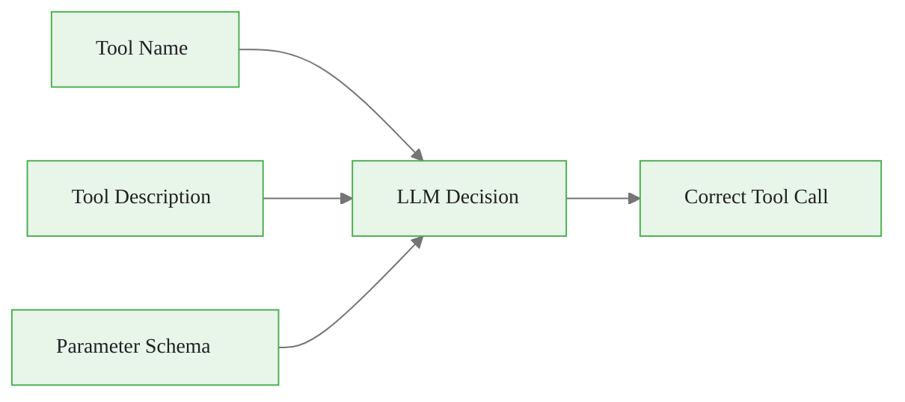
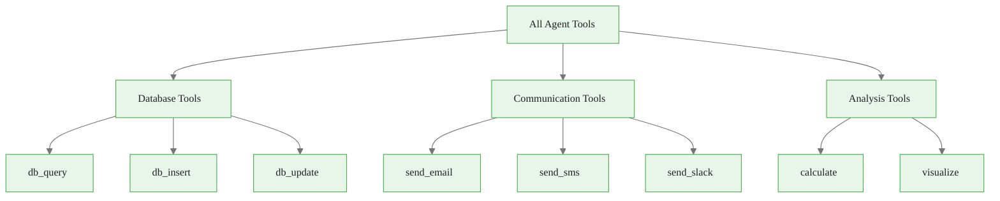
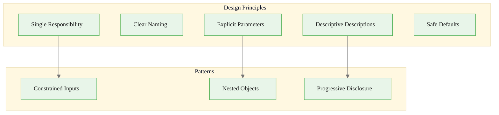

<!-- _class: lead -->

# Tool Design: Principles for Effective Tool Schemas

**Module 02 — Tool Use & Function Calling**

> Your tool descriptions are prompts. The LLM reads your tool name, description, and parameter definitions to decide when and how to use each tool.

<!--
Speaker notes: Key talking points for this slide
- Transition slide: we are now moving into Tool Design: Principles for Effective Tool Schemas
- Pause briefly to let the audience absorb the previous section
- Preview what is coming next in this section
-->
---

# Key Insight

**Invest the same care in tool design as you would in system prompts.**

The LLM reads your tool definitions to decide:
- *When* to use a tool
- *Which* tool to use
- *What arguments* to provide



<!--
Speaker notes: Key talking points for this slide
- Walk through the diagram from left to right (or top to bottom)
- Explain each component and the connections between them
- Relate this architecture back to practical use cases
-->
---

<!-- _class: lead -->

# The SOLID Principles of Tool Design

<!--
Speaker notes: Key talking points for this slide
- Transition slide: we are now moving into The SOLID Principles of Tool Design
- Pause briefly to let the audience absorb the previous section
- Preview what is coming next in this section
-->
---

# 1. Single Responsibility

<div class="columns">
<div>

**Bad: Too many things**
<div class="code-window">
<div class="code-header">
<div class="dots"><span class="dot-red"></span><span class="dot-yellow"></span><span class="dot-green"></span></div>
<span class="filename">agent.py</span>
</div>
<div class="code-body">

```python
{
    "name": "manage_user",
    "description": "Create, update,
      delete, or fetch users",
    "input_schema": {
        "properties": {
            "action": {"enum": [
                "create", "update",
                "delete", "fetch"]},
            "user_id": {"type": "string"},
            "user_data": {"type": "object"}
        }
    }
}
```

</div>
</div>

</div>
<div>

**Good: One tool per action**
```python
{
    "name": "create_user",
    "description": "Create a new user",
    "input_schema": {
        "properties": {
            "email": {"type": "string"},
            "name": {"type": "string"}
        },
        "required": ["email", "name"]
    }
}
```

</div>
</div>

<!--
Speaker notes: Key talking points for this slide
- Walk through the code example, focusing on the key pattern being demonstrated
- Highlight the most important lines and explain why they matter
- Point out any edge cases or production considerations
- This code is copy-paste ready for learners to try
-->
---

# 1. Single Responsibility (continued)

<div class="code-window">
<div class="code-header">
<div class="dots"><span class="dot-red"></span><span class="dot-yellow"></span><span class="dot-green"></span></div>
<span class="filename">agent.py</span>
</div>
<div class="code-body">

```python
{
    "name": "get_user",
    "description": "Fetch user by ID",
    "input_schema": {
        "properties": {
            "user_id": {"type": "string"}
        },
        "required": ["user_id"]
    }
}
```

</div>
</div>

<!--
Speaker notes: Key talking points for this slide
- Continuation of the previous code block
- Walk through the remaining implementation details
- Highlight any key patterns or important lines
-->
---

# 2. Clear Naming

Use verbs that describe the action:

| Convention | Purpose | Examples |
|------------|---------|----------|
| `get_*` | Retrieve data | `get_user`, `get_order` |
| `create_*` | Make something new | `create_event`, `create_ticket` |
| `update_*` | Modify existing | `update_profile`, `update_status` |
| `delete_*` | Remove data | `delete_comment`, `delete_file` |
| `search_*` | Find matching items | `search_products`, `search_docs` |
| `calculate_*` | Compute a value | `calculate_tax`, `calculate_distance` |
| `send_*` | Transmit something | `send_email`, `send_notification` |

<div class="callout-warning">

**Warning:** Avoid vague names like "user", "data", "process" — they don't tell the LLM what the tool does.

</div>

<!--
Speaker notes: Key talking points for this slide
- Explain the core concept on this slide clearly and concisely
- Relate it back to practical agent building scenarios
- Highlight any common pitfalls or misconceptions
- Connect to what was covered previously and what comes next
-->
---

# 3. Descriptive Descriptions

<div class="columns">
<div>

**Bad:**
<div class="code-window">
<div class="code-header">
<div class="dots"><span class="dot-red"></span><span class="dot-yellow"></span><span class="dot-green"></span></div>
<span class="filename">agent.py</span>
</div>
<div class="code-body">

```python
{
    "name": "search_web",
    "description": "Search the web"
}
```

</div>
</div>

</div>
<div>

**Good:**
```python
{
    "name": "search_web",
    "description": """Search the web for
current information.

Use this tool when:
- User asks about recent events
- You need to verify current facts
- User explicitly asks to search

Do NOT use when:
- Question is about well-known facts
- User asks for your opinion
- Info is already in context

Returns: Top 5 results with titles,
snippets, and URLs."""
}
```

</div>
</div>

<!--
Speaker notes: Key talking points for this slide
- Walk through the code example, focusing on the key pattern being demonstrated
- Highlight the most important lines and explain why they matter
- Point out any edge cases or production considerations
- This code is copy-paste ready for learners to try
-->
---

# 4. Explicit Parameters

Every parameter should be self-documenting:

<div class="code-window">
<div class="code-header">
<div class="dots"><span class="dot-red"></span><span class="dot-yellow"></span><span class="dot-green"></span></div>
<span class="filename">agent.py</span>
</div>
<div class="code-body">

```python
{
    "name": "book_flight",
    "input_schema": {
        "type": "object",
        "properties": {
            "origin": {
                "type": "string",
                "description": "Departure airport code (e.g., 'JFK'). Use IATA codes."
            },
            "destination": {
                "type": "string",
                "description": "Arrival airport code (e.g., 'LHR'). Use IATA codes."
            },
```

</div>
</div>

<!--
Speaker notes: Key talking points for this slide
- Walk through the code example, focusing on the key pattern being demonstrated
- Highlight the most important lines and explain why they matter
- Point out any edge cases or production considerations
- This code is copy-paste ready for learners to try
-->
---

# 4. Explicit Parameters (continued)

<div class="code-window">
<div class="code-header">
<div class="dots"><span class="dot-red"></span><span class="dot-yellow"></span><span class="dot-green"></span></div>
<span class="filename">agent.py</span>
</div>
<div class="code-body">

```python
"departure_date": {
                "type": "string",
                "description": "Departure date in YYYY-MM-DD format"
            },
            "passengers": {
                "type": "integer",
                "description": "Number of passengers (1-9)",
                "minimum": 1, "maximum": 9, "default": 1
            }
        },
        "required": ["origin", "destination", "departure_date"]
    }
}
```

</div>
</div>

<!--
Speaker notes: Key talking points for this slide
- Continuation of the previous code block
- Walk through the remaining implementation details
- Highlight any key patterns or important lines
-->
---

# 5. Safe Defaults

Non-required parameters should have sensible defaults:

<div class="code-window">
<div class="code-header">
<div class="dots"><span class="dot-red"></span><span class="dot-yellow"></span><span class="dot-green"></span></div>
<span class="filename">agent.py</span>
</div>
<div class="code-body">

```python
"limit": {
    "type": "integer",
    "default": 10,        # Sensible default
    "minimum": 1,
    "maximum": 100
},
"sort_by": {
    "type": "string",
    "default": "relevance",  # Safe default
    "enum": ["relevance", "date", "popularity"]
},
"include_deleted": {
    "type": "boolean",
    "default": false       # Safe: don't show deleted
}
```

</div>
</div>

<div class="callout-key">

**Key Point:** Defaults should always be the safest, most expected option.

</div>

<!--
Speaker notes: Key talking points for this slide
- Walk through the code example, focusing on the key pattern being demonstrated
- Highlight the most important lines and explain why they matter
- Point out any edge cases or production considerations
- This code is copy-paste ready for learners to try
-->
---

<!-- _class: lead -->

# Schema Design Patterns

<!--
Speaker notes: Key talking points for this slide
- Transition slide: we are now moving into Schema Design Patterns
- Pause briefly to let the audience absorb the previous section
- Preview what is coming next in this section
-->
---

# Pattern 1: Constrained Inputs

Use enums and ranges to limit possible values:

<div class="code-window">
<div class="code-header">
<div class="dots"><span class="dot-red"></span><span class="dot-yellow"></span><span class="dot-green"></span></div>
<span class="filename">agent.py</span>
</div>
<div class="code-body">

```python
{
    "name": "set_thermostat",
    "input_schema": {
        "properties": {
            "temperature": {
                "type": "number",
                "minimum": 55,     # Prevent freezing
                "maximum": 85      # Prevent overheating
            },
            "mode": {
                "type": "string",
```

</div>
</div>

<div class="callout-key">

**Key Point:** Constraints prevent the LLM from generating invalid values.

</div>

<!--
Speaker notes: Key talking points for this slide
- Walk through the code example, focusing on the key pattern being demonstrated
- Highlight the most important lines and explain why they matter
- Point out any edge cases or production considerations
- This code is copy-paste ready for learners to try
-->
---

# Pattern 1: Constrained Inputs (continued)

<div class="code-window">
<div class="code-header">
<div class="dots"><span class="dot-red"></span><span class="dot-yellow"></span><span class="dot-green"></span></div>
<span class="filename">agent.py</span>
</div>
<div class="code-body">

```python
"enum": ["heat", "cool", "auto", "off"]
            },
            "room": {
                "type": "string",
                "enum": ["living_room", "bedroom", "kitchen", "office"]
            }
        },
        "required": ["temperature", "mode", "room"]
    }
}
```

</div>
</div>

<!--
Speaker notes: Key talking points for this slide
- Continuation of the previous code block
- Walk through the remaining implementation details
- Highlight any key patterns or important lines
-->
---

# Pattern 2: Nested Objects

<div class="code-window">
<div class="code-header">
<div class="dots"><span class="dot-red"></span><span class="dot-yellow"></span><span class="dot-green"></span></div>
<span class="filename">agent.py</span>
</div>
<div class="code-body">

```python
{
    "name": "create_event",
    "input_schema": {
        "properties": {
            "title": {"type": "string"},
            "time": {
                "type": "object",
                "properties": {
                    "start": {"type": "string", "description": "ISO 8601 format"},
                    "end": {"type": "string"},
                    "timezone": {"type": "string", "description": "e.g., America/New_York"}
                },
                "required": ["start"]
```

</div>
</div>

<!--
Speaker notes: Key talking points for this slide
- Walk through the code example, focusing on the key pattern being demonstrated
- Highlight the most important lines and explain why they matter
- Point out any edge cases or production considerations
- This code is copy-paste ready for learners to try
-->
---

# Pattern 2: Nested Objects (continued)

<div class="code-window">
<div class="code-header">
<div class="dots"><span class="dot-red"></span><span class="dot-yellow"></span><span class="dot-green"></span></div>
<span class="filename">agent.py</span>
</div>
<div class="code-body">

```python
},
            "location": {
                "type": "object",
                "properties": {
                    "name": {"type": "string"},
                    "address": {"type": "string"},
                    "virtual_url": {"type": "string"}
                }
            }
        },
        "required": ["title", "time"]
    }
}
```

</div>
</div>

<!--
Speaker notes: Key talking points for this slide
- Continuation of the previous code block
- Walk through the remaining implementation details
- Highlight any key patterns or important lines
-->
---

# Pattern 3 & 4: Arrays and Conditionals

<div class="columns">
<div>

**Arrays for multiple items:**
<div class="code-window">
<div class="code-header">
<div class="dots"><span class="dot-red"></span><span class="dot-yellow"></span><span class="dot-green"></span></div>
<span class="filename">agent.py</span>
</div>
<div class="code-body">

```python
"recipients": {
    "type": "array",
    "items": {"type": "string"},
    "minItems": 1,
    "maxItems": 100
},
"message": {
    "type": "string",
```

</div>
</div>

</div>
<div>

**Conditional with oneOf:**
```python
"source": {
    "oneOf": [
        {
            "type": "object",
            "properties": {
                "type": {"const": "database"},
                "table": {"type": "string"}
            },
            "required": ["type", "table"]
        },
```

</div>
</div>

<!--
Speaker notes: Key talking points for this slide
- Walk through the code example, focusing on the key pattern being demonstrated
- Highlight the most important lines and explain why they matter
- Point out any edge cases or production considerations
- This code is copy-paste ready for learners to try
-->
---

# Pattern 3 & 4: Arrays and Conditionals (continued)

<div class="code-window">
<div class="code-header">
<div class="dots"><span class="dot-red"></span><span class="dot-yellow"></span><span class="dot-green"></span></div>
<span class="filename">agent.py</span>
</div>
<div class="code-body">

```python
{
            "type": "object",
            "properties": {
                "type": {"const": "file"},
                "path": {"type": "string"}
            },
            "required": ["type", "path"]
        }
    ]
}
```

</div>
</div>

<!--
Speaker notes: Key talking points for this slide
- Continuation of the previous code block
- Walk through the remaining implementation details
- Highlight any key patterns or important lines
-->
---

# Pattern 3 & 4: Arrays and Conditionals (continued)

<div class="code-window">
<div class="code-header">
<div class="dots"><span class="dot-red"></span><span class="dot-yellow"></span><span class="dot-green"></span></div>
<span class="filename">agent.py</span>
</div>
<div class="code-body">

```python
"maxLength": 500
},
"priority": {
    "type": "string",
    "enum": ["low", "normal",
             "high", "urgent"],
    "default": "normal"
}
```

</div>
</div>

<!--
Speaker notes: Key talking points for this slide
- Continuation of the previous code block
- Walk through the remaining implementation details
- Highlight any key patterns or important lines
-->
---

# Tool Set Organization



| Tool Count | Impact |
|------------|--------|
| 1-5 | Clear selection, low overhead |
| 6-15 | Manageable, needs clear descriptions |
| 16-30 | Higher latency, needs excellent descriptions |
| 30+ | Consider sub-agents or dynamic tool loading |

<!--
Speaker notes: Key talking points for this slide
- Walk through the diagram from left to right (or top to bottom)
- Explain each component and the connections between them
- Relate this architecture back to practical use cases
-->
---

# Progressive Tool Disclosure

<div class="code-window">
<div class="code-header">
<div class="dots"><span class="dot-red"></span><span class="dot-yellow"></span><span class="dot-green"></span></div>
<span class="filename">agent.py</span>
</div>
<div class="code-body">

```python
def get_tools_for_task(task_type: str) -> list:
    """Return appropriate tools for the task type."""
    base_tools = [search_tool, get_info_tool]

    if task_type == "data_analysis":
        return base_tools + [query_db_tool, calculate_tool, visualize_tool]
    elif task_type == "customer_support":
        return base_tools + [get_customer_tool, create_ticket_tool, refund_tool]
    elif task_type == "content_creation":
        return base_tools + [generate_image_tool, spell_check_tool]

    return base_tools
```

</div>
</div>

<div class="callout-key">

**Key Point:** Start with fewer tools, add more as needed. Too many tools confuse the LLM.

</div>

<!--
Speaker notes: Key talking points for this slide
- Walk through the code example, focusing on the key pattern being demonstrated
- Highlight the most important lines and explain why they matter
- Point out any edge cases or production considerations
- This code is copy-paste ready for learners to try
-->
---

# Description Best Practices Template

<div class="code-window">
<div class="code-header">
<div class="dots"><span class="dot-red"></span><span class="dot-yellow"></span><span class="dot-green"></span></div>
<span class="filename">agent.py</span>
</div>
<div class="code-body">

```python
def create_tool_description(purpose, when_to_use, when_not_to_use, returns, notes=None):
    desc = f"{purpose}\n\n"
    desc += "Use this tool when:\n" + "\n".join(f"- {u}" for u in when_to_use)
    desc += "\n\nDo NOT use when:\n" + "\n".join(f"- {n}" for n in when_not_to_use)
    desc += f"\n\nReturns: {returns}"
    if notes:
        desc += f"\n\nNotes: {notes}"
    return desc
```

</div>
</div>

<div class="callout-key">

**Key Point:** Always tell the LLM both *when to use* AND *when not to use* each tool.

</div>

<!--
Speaker notes: Key talking points for this slide
- Walk through the code example, focusing on the key pattern being demonstrated
- Highlight the most important lines and explain why they matter
- Point out any edge cases or production considerations
- This code is copy-paste ready for learners to try
-->
---

# Validation and Testing

<div class="code-window">
<div class="code-header">
<div class="dots"><span class="dot-red"></span><span class="dot-yellow"></span><span class="dot-green"></span></div>
<span class="filename">agent.py</span>
</div>
<div class="code-body">

```python
def validate_tool_schema(tool: dict) -> list[str]:
    issues = []
    if "name" not in tool:
        issues.append("Missing 'name' field")
    if "description" not in tool:
        issues.append("Missing 'description' field")
    if "name" in tool:
        name = tool["name"]
```

</div>
</div>

<!--
Speaker notes: Key talking points for this slide
- Walk through the code example, focusing on the key pattern being demonstrated
- Highlight the most important lines and explain why they matter
- Point out any edge cases or production considerations
- This code is copy-paste ready for learners to try
-->
---

# Validation and Testing (continued)

<div class="code-window">
<div class="code-header">
<div class="dots"><span class="dot-red"></span><span class="dot-yellow"></span><span class="dot-green"></span></div>
<span class="filename">agent.py</span>
</div>
<div class="code-body">

```python
if not name.islower() or " " in name:
            issues.append(f"Name should be lowercase with underscores: {name}")
    if "description" in tool:
        if len(tool["description"]) < 20:
            issues.append("Description too short")
        if "when" not in tool["description"].lower():
            issues.append("Description should explain when to use the tool")
    return issues
```

</div>
</div>

<!--
Speaker notes: Key talking points for this slide
- Continuation of the previous code block
- Walk through the remaining implementation details
- Highlight any key patterns or important lines
-->
---

# Summary & Connections



**Key takeaways:**
- One tool = one action (single responsibility)
- Use action-oriented verb_noun naming
- Descriptions should say *when to use* AND *when not to use*
- Constrain inputs with enums, ranges, and required fields
- Keep tool count manageable (5-15 is ideal)

> *Tool design is UX design for AI.*

<!--
Speaker notes: Key talking points for this slide
- Walk through the diagram from left to right (or top to bottom)
- Explain each component and the connections between them
- Relate this architecture back to practical use cases
-->