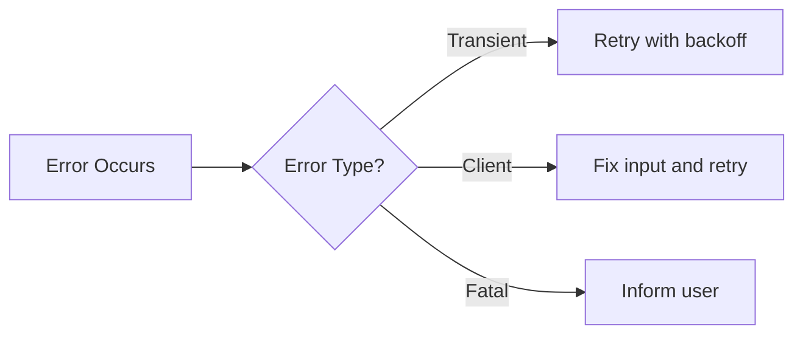
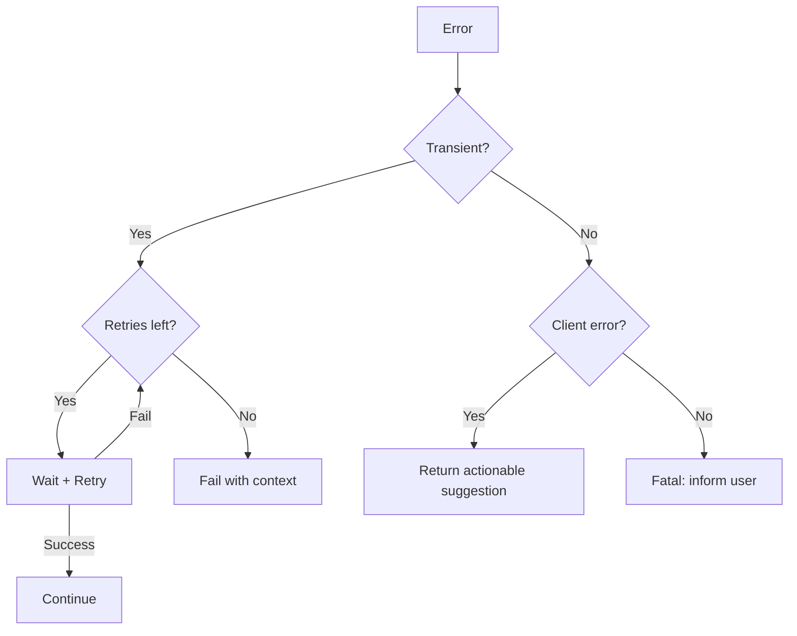
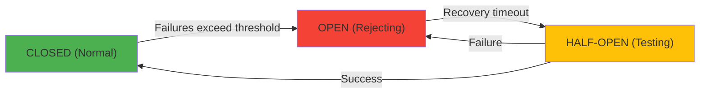
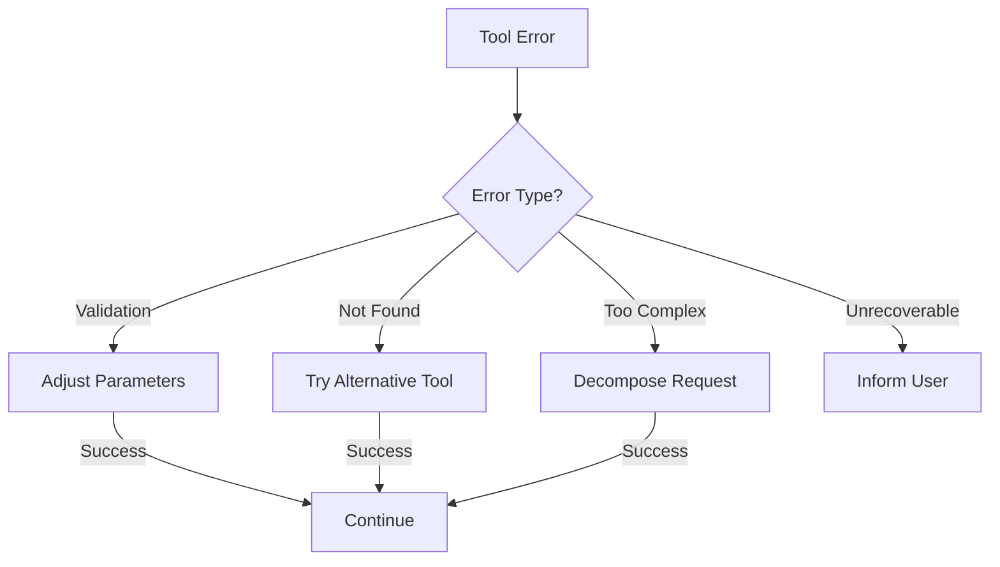
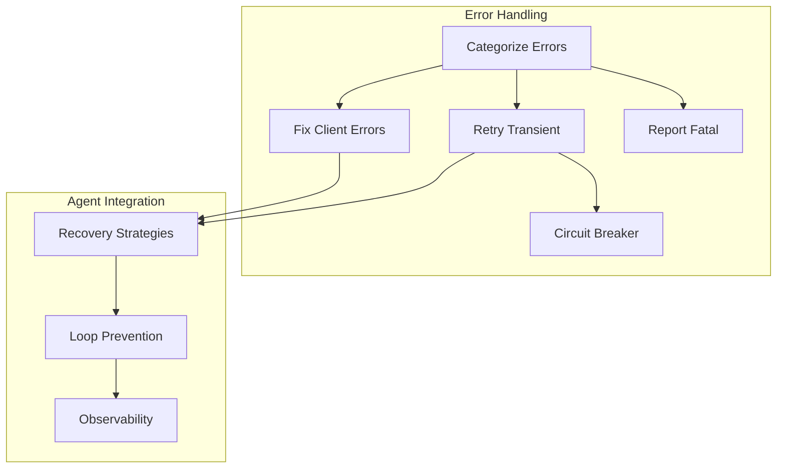

<!-- _class: lead -->

# Error Handling: Graceful Failure and Recovery

**Module 02 — Tool Use & Function Calling**

> Errors are information, not just failures. A well-structured error message helps the LLM understand what went wrong and what to try next.

<!--
Speaker notes: Key talking points for this slide
- Transition slide: we are now moving into Error Handling: Graceful Failure and Recovery
- Pause briefly to let the audience absorb the previous section
- Preview what is coming next in this section
-->
---

# Key Insight

**Turn errors into actionable context.**

The LLM reads error messages just like it reads tool results. Good error messages help it recover. Bad ones cause loops.



<!--
Speaker notes: Key talking points for this slide
- Walk through the diagram from left to right (or top to bottom)
- Explain each component and the connections between them
- Relate this architecture back to practical use cases
-->
---

# Error Categories

<div class="columns">
<div>

**Transient (Retry-able):**
- Rate limits
- Timeouts
- Connection errors
- Server errors (5xx)

```python
TRANSIENT_ERRORS = {
    "rate_limit": {
        "retry": True,
        "max_retries": 3,
        "backoff": "exponential"
    },
    "timeout": {
        "retry": True,
        "max_retries": 2,
        "backoff": "linear"
    }
}
```

</div>
<div>

**Client (Fix Required):**
- Invalid input
- Not found
- Permission denied
- Validation errors

**Fatal (Cannot Proceed):**
- Authentication failed
- Service unavailable
- Quota exceeded

</div>
</div>

<!--
Speaker notes: Key talking points for this slide
- Walk through the code example, focusing on the key pattern being demonstrated
- Highlight the most important lines and explain why they matter
- Point out any edge cases or production considerations
- This code is copy-paste ready for learners to try
-->
---

# Error Category Decision Tree



<!--
Speaker notes: Key talking points for this slide
- Walk through the diagram from left to right (or top to bottom)
- Explain each component and the connections between them
- Relate this architecture back to practical use cases
-->
---

<!-- _class: lead -->

# Retry Strategies

<!--
Speaker notes: Key talking points for this slide
- Transition slide: we are now moving into Retry Strategies
- Pause briefly to let the audience absorb the previous section
- Preview what is coming next in this section
-->
---

# Exponential Backoff

```python
def with_retry(max_retries=3, base_delay=1.0, max_delay=60.0):
    def decorator(func):
        @wraps(func)
        def wrapper(*args, **kwargs):
            retries = 0
            last_error = None
            while retries <= max_retries:
                try:
                    return func(*args, **kwargs)
                except TransientError as e:
                    last_error = e
                    retries += 1
                    if retries > max_retries:
                        break
```

<!--
Speaker notes: Key talking points for this slide
- Walk through the code example, focusing on the key pattern being demonstrated
- Highlight the most important lines and explain why they matter
- Point out any edge cases or production considerations
- This code is copy-paste ready for learners to try
-->
---

# Exponential Backoff (continued)

```python
delay = min(base_delay * (2 ** (retries - 1)), max_delay)
                    delay *= (0.5 + random.random())  # Jitter
                    time.sleep(delay)
            raise MaxRetriesExceeded(f"Failed after {max_retries} retries: {last_error}")
        return wrapper
    return decorator

@with_retry(max_retries=3)
def call_external_api(endpoint, data):
    response = requests.post(endpoint, json=data, timeout=30)
    if response.status_code >= 500:
        raise TransientError(f"Server error: {response.status_code}")
    return response.json()
```

<!--
Speaker notes: Key talking points for this slide
- Continuation of the previous code block
- Walk through the remaining implementation details
- Highlight any key patterns or important lines
-->
---

# Circuit Breaker Pattern

Prevent cascading failures when a service is down:



**States:**
- **CLOSED**: Normal operation, requests pass through
- **OPEN**: Service is failing, reject requests immediately
- **HALF-OPEN**: Test with a few requests to see if recovered

<!--
Speaker notes: Key talking points for this slide
- Walk through the diagram from left to right (or top to bottom)
- Explain each component and the connections between them
- Relate this architecture back to practical use cases
-->
---

# Circuit Breaker Implementation

```python
class CircuitBreaker:
    def __init__(self, failure_threshold=5, recovery_timeout=30):
        self.failure_threshold = failure_threshold
        self.recovery_timeout = recovery_timeout
        self.state = CircuitState.CLOSED
        self.failure_count = 0
        self.last_failure_time = None

    def call(self, func, *args, **kwargs):
        if self.state == CircuitState.OPEN:
            if self._should_attempt_recovery():
                self.state = CircuitState.HALF_OPEN
            else:
                raise CircuitOpenError("Circuit is open")
```

<!--
Speaker notes: Key talking points for this slide
- Walk through the code example, focusing on the key pattern being demonstrated
- Highlight the most important lines and explain why they matter
- Point out any edge cases or production considerations
- This code is copy-paste ready for learners to try
-->
---

# Circuit Breaker Implementation (continued)

```python
try:
            result = func(*args, **kwargs)
            self._record_success()
            return result
        except Exception:
            self._record_failure()
            raise
```

<!--
Speaker notes: Key talking points for this slide
- Continuation of the previous code block
- Walk through the remaining implementation details
- Highlight any key patterns or important lines
-->
---

<!-- _class: lead -->

# Error Response Structure

<!--
Speaker notes: Key talking points for this slide
- Transition slide: we are now moving into Error Response Structure
- Pause briefly to let the audience absorb the previous section
- Preview what is coming next in this section
-->
---

# Standard Error Format

<div class="columns">
<div>

**Bad: Uninformative**
```json
{"error": "Failed"}
```

</div>
<div>

**Good: Actionable**
```json
{
    "status": "error",
    "error": {
        "type": "not_found",
        "message": "User 'john_doe123' not found",
        "suggestion": "Check username or search by email",
        "details": {
            "searched_in": "users",
            "alternatives": [
                "search_by_email",
                "list_all_users"
            ]
        }
    }
}
```

</div>
</div>

> 🔑 Include `suggestion` — it tells the LLM what to do next.

<!--
Speaker notes: Key talking points for this slide
- Walk through the code example, focusing on the key pattern being demonstrated
- Highlight the most important lines and explain why they matter
- Point out any edge cases or production considerations
- This code is copy-paste ready for learners to try
-->
---

# ToolError Data Class

```python
@dataclass
class ToolError:
    error_type: str
    message: str
    suggestion: Optional[str] = None
    details: Optional[dict] = None
    retryable: bool = False
```

> ✅ Standardize error responses across all tools for consistent LLM behavior.

<!--
Speaker notes: Key talking points for this slide
- Walk through the code example, focusing on the key pattern being demonstrated
- Highlight the most important lines and explain why they matter
- Point out any edge cases or production considerations
- This code is copy-paste ready for learners to try
-->
---

# ToolError Data Class (continued)

```python
def to_json(self) -> str:
        return json.dumps({
            "status": "error",
            "error": {
                "type": self.error_type,
                "message": self.message,
                "suggestion": self.suggestion,
                "details": self.details,
                "retryable": self.retryable
            }
        })
```

<!--
Speaker notes: Key talking points for this slide
- Continuation of the previous code block
- Walk through the remaining implementation details
- Highlight any key patterns or important lines
-->
---

# Exception-to-Error Mapping

```python
def handle_api_error(e: Exception, context: dict) -> str:
    if isinstance(e, requests.exceptions.Timeout):
        return ToolError(
            error_type="timeout",
            message="The request timed out",
            suggestion="Try again with a simpler query",
            retryable=True
        ).to_json()
    elif isinstance(e, PermissionError):
```

<!--
Speaker notes: Key talking points for this slide
- Walk through the code example, focusing on the key pattern being demonstrated
- Highlight the most important lines and explain why they matter
- Point out any edge cases or production considerations
- This code is copy-paste ready for learners to try
-->
---

# Exception-to-Error Mapping (continued)

```python
return ToolError(
            error_type="permission_denied",
            message=f"Access denied: {context.get('resource')}",
            suggestion="Request access or try different resource",
            retryable=False
        ).to_json()
    else:
        return ToolError(
            error_type="unknown",
            message=str(e),
            suggestion="Contact support if this persists",
            retryable=False
        ).to_json()
```

<!--
Speaker notes: Key talking points for this slide
- Continuation of the previous code block
- Walk through the remaining implementation details
- Highlight any key patterns or important lines
-->
---

<!-- _class: lead -->

# Agent-Level Error Handling

<!--
Speaker notes: Key talking points for this slide
- Transition slide: we are now moving into Agent-Level Error Handling
- Pause briefly to let the audience absorb the previous section
- Preview what is coming next in this section
-->
---

# Error Recovery Strategies



```python
def execute_with_recovery(self, tool_name, arguments):
    result = self.execute_tool(tool_name, arguments)
    if result["status"] == "success":
        return result

    error_type = result.get("error_type")
    if error_type == "validation":
        adjusted = self.adjust_parameters(tool_name, arguments, result["errors"])
        if adjusted:
            return self.execute_tool(tool_name, adjusted)
    if error_type == "not_found":
        alternative = self.find_alternative_tool(tool_name)
        if alternative:
            return self.execute_tool(alternative, arguments)
    return result  # No recovery possible
```

<!--
Speaker notes: Key talking points for this slide
- Walk through the code block line by line, emphasizing the key pattern
- The diagram below shows the architecture/flow visually
- Point out how the code maps to the diagram components
- Highlight any production considerations or gotchas
-->
---

# Preventing Infinite Error Loops

```python
def run_with_error_awareness(self, query: str) -> str:
    messages = [{"role": "user", "content": query}]
    error_count = {}
    max_consecutive_errors = 2

    for turn in range(10):
        response = self.call_model(messages)
        if response.stop_reason != "tool_use":
            return self.extract_text(response)
```

<!--
Speaker notes: Key talking points for this slide
- Walk through the code example, focusing on the key pattern being demonstrated
- Highlight the most important lines and explain why they matter
- Point out any edge cases or production considerations
- This code is copy-paste ready for learners to try
-->
---

# Preventing Infinite Error Loops (continued)

```python
messages.append({"role": "assistant", "content": response.content})
        tool_results = []
        for tool_call in self.get_tool_calls(response):
            result = self.execute_tool(tool_call.name, tool_call.input)
            if result["status"] == "error":
                error_key = f"{tool_call.name}:{result.get('error_type')}"
                error_count[error_key] = error_count.get(error_key, 0) + 1
                if error_count[error_key] >= max_consecutive_errors:
                    result["suggestion"] = "Consider a different approach."
            tool_results.append({"type": "tool_result",
                "tool_use_id": tool_call.id, "content": json.dumps(result)})
        messages.append({"role": "user", "content": tool_results})
```

<!--
Speaker notes: Key talking points for this slide
- Continuation of the previous code block
- Walk through the remaining implementation details
- Highlight any key patterns or important lines
-->
---

# System Prompt for Error Handling

```python
system_prompt = """You are a helpful assistant with access to tools.

When a tool returns an error:
1. Acknowledge the issue briefly
2. Explain what went wrong in simple terms
3. Suggest next steps or alternatives
4. Do NOT repeatedly retry the same failing action

Example good response:
"I wasn't able to find that user. The username might be misspelled.
Would you like me to search by email instead?"

Example bad response:
"Error: User not found. Let me try again... Error: User not found.
Let me try again..."
"""
```

> ⚠️ Without explicit instructions, the LLM will retry failing tools in a loop.

<!--
Speaker notes: Key talking points for this slide
- Walk through the code example, focusing on the key pattern being demonstrated
- Highlight the most important lines and explain why they matter
- Point out any edge cases or production considerations
- This code is copy-paste ready for learners to try
-->
---

# Logging and Metrics

<div class="columns">
<div>

**Structured Logging:**
```python
class ToolLogger:
    def log_execution(self, tool_name,
                      arguments, result,
                      duration_ms):
        log_entry = {
            "timestamp": datetime.utcnow()
                .isoformat(),
            "event": "tool_execution",
            "tool": tool_name,
```

</div>
<div>

**Metrics Collection:**
```python
class ToolMetrics:
    def get_stats(self, tool_name):
        times = self.execution_times[tool_name]
        total = (self.success_count[tool_name]
                + self.error_count[tool_name])
        return {
            "total_calls": total,
            "success_rate":
                self.success_count[tool_name]
                / total if total else 0,
            "avg_duration_ms":
                sum(times) / len(times),
            "error_breakdown":
                dict(self.error_types[tool_name])
        }
```

</div>
</div>

<!--
Speaker notes: Key talking points for this slide
- Walk through the code example, focusing on the key pattern being demonstrated
- Highlight the most important lines and explain why they matter
- Point out any edge cases or production considerations
- This code is copy-paste ready for learners to try
-->
---

# Logging and Metrics (continued)

```python
"status": result.get("status"),
            "duration_ms": duration_ms
        }
        if result.get("status") == "error":
            self.logger.warning(
                json.dumps(log_entry))
        else:
            self.logger.info(
                json.dumps(log_entry))
```

<!--
Speaker notes: Key talking points for this slide
- Continuation of the previous code block
- Walk through the remaining implementation details
- Highlight any key patterns or important lines
-->
---

# Summary & Connections



**Key takeaways:**
- Categorize errors: transient (retry), client (fix), fatal (stop)
- Use exponential backoff with jitter for retries
- Circuit breakers prevent cascading failures
- Error messages should include type, message, and suggestion
- Prevent infinite loops with error tracking in the agent loop
- Log everything for observability

> *Errors are inevitable — poor error handling is not.*

<!--
Speaker notes: Key talking points for this slide
- Walk through the diagram from left to right (or top to bottom)
- Explain each component and the connections between them
- Relate this architecture back to practical use cases
-->