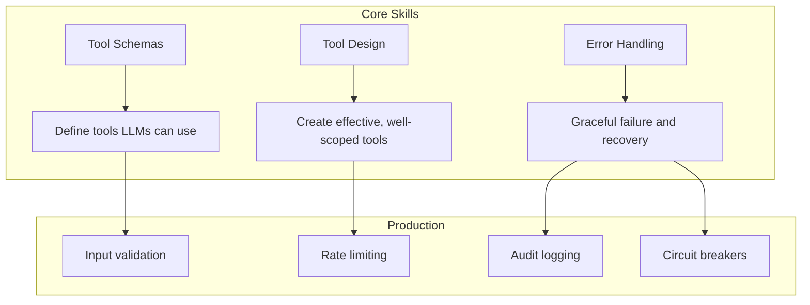

<!-- _class: lead -->

# Module 2: Tool Use & Function Calling

**Cheatsheet — Quick Reference Card**

> Tools, schemas, error handling, and security patterns at a glance.

<!--
Speaker notes: Key talking points for this slide
- Transition slide: we are now moving into Module 2: Tool Use & Function Calling
- Pause briefly to let the audience absorb the previous section
- Preview what is coming next in this section
-->
---

# Key Concepts

| Concept | Definition |
|---------|-----------|
| **Tool/Function** | External capability that LLM can invoke |
| **Tool Schema** | JSON definition of tool name, purpose, and parameters |
| **Function Calling** | LLM generates structured calls to external functions |
| **Tool Use Loop** | LLM decides -> Execute -> Return result -> LLM processes |
| **ReAct Pattern** | Reasoning + Acting: reason, act, observe, repeat |
| **Tool Chaining** | Output of one tool feeds input of another |
| **Sandboxing** | Isolated execution environment for safety |
| **Parameter Validation** | Checking inputs meet schema requirements |

<!--
Speaker notes: Key talking points for this slide
- Explain the core concept on this slide clearly and concisely
- Relate it back to practical agent building scenarios
- Highlight any common pitfalls or misconceptions
- Connect to what was covered previously and what comes next
-->
---

# Tool Definition: Claude vs OpenAI

<div class="columns">
<div>

**Claude:**
```python
tools = [{
    "name": "get_weather",
    "description": "Get weather for a
      location. Use when user asks
      about weather.",
    "input_schema": {
        "type": "object",
        "properties": {
            "location": {
                "type": "string"
            }
        },
        "required": ["location"]
    }
}]
```

</div>
<div>

**OpenAI:**
```python
tools = [{
    "type": "function",
    "function": {
        "name": "get_weather",
        "description": "Get weather
          for a location",
        "parameters": {
            "type": "object",
            "properties": {
```

</div>
</div>

<!--
Speaker notes: Key talking points for this slide
- Walk through the code example, focusing on the key pattern being demonstrated
- Highlight the most important lines and explain why they matter
- Point out any edge cases or production considerations
- This code is copy-paste ready for learners to try
-->
---

# Tool Definition: Claude vs OpenAI (continued)

```python
"location": {
                    "type": "string"
                }
            },
            "required": ["location"]
        }
    }
}]
```

<!--
Speaker notes: Key talking points for this slide
- Continuation of the previous code block
- Walk through the remaining implementation details
- Highlight any key patterns or important lines
-->
---

# Tool Use Loop (Claude)

```python
messages = [{"role": "user", "content": "What's the weather in NYC?"}]
response = client.messages.create(
    model="claude-sonnet-4-6", max_tokens=1024,
    tools=tools, messages=messages)

while response.stop_reason == "tool_use":
    tool_use = next(b for b in response.content if b.type == "tool_use")
    tool_result = process_tool_call(tool_use.name, tool_use.input)
```

<!--
Speaker notes: Key talking points for this slide
- Walk through the code block line by line, emphasizing the key pattern
- The diagram below shows the architecture/flow visually
- Point out how the code maps to the diagram components
- Highlight any production considerations or gotchas
-->
---

# Tool Use Loop (Claude) (continued)

```python
messages.append({"role": "assistant", "content": response.content})
    messages.append({"role": "user", "content": [
        {"type": "tool_result", "tool_use_id": tool_use.id,
         "content": json.dumps(tool_result)}
    ]})
    response = client.messages.create(
        model="claude-sonnet-4-6", max_tokens=1024,
        tools=tools, messages=messages)

print(response.content[0].text)
```

<!--
Speaker notes: Key talking points for this slide
- Continuation of the previous code block
- Walk through the remaining implementation details
- Highlight any key patterns or important lines
-->
---

# Tool Design Principles

| Principle | Bad | Good |
|-----------|-----|------|
| Naming | `"find"` | `"search_documents"` |
| Description | `"Searches stuff"` | `"Search documents. Use when user asks about policies."` |
| Parameters | No description | Each param described with examples |
| Defaults | No defaults | Sensible, safe defaults |
| Scope | `"manage_user"` (CRUD) | `"get_user"`, `"create_user"` (single action) |

<!--
Speaker notes: Key talking points for this slide
- Explain the core concept on this slide clearly and concisely
- Relate it back to practical agent building scenarios
- Highlight any common pitfalls or misconceptions
- Connect to what was covered previously and what comes next
-->
---

# Error Handling Wrapper

```python
@retry(stop=stop_after_attempt(3), wait=wait_exponential(min=1, max=10))
def safe_tool_execution(tool_name, tool_input):
    try:
        validate_tool_input(tool_name, tool_input)
        result = execute_with_timeout(tool_name, tool_input, timeout=30)
        validate_tool_output(tool_name, result)
        return {"success": True, "data": result}
    except ValidationError as e:
        return {"success": False, "error": f"Invalid input: {e}"}
    except TimeoutError:
        return {"success": False, "error": "Tool execution timed out"}
    except Exception as e:
        return {"success": False, "error": f"Tool failed: {e}"}
```

<!--
Speaker notes: Key talking points for this slide
- Walk through the code example, focusing on the key pattern being demonstrated
- Highlight the most important lines and explain why they matter
- Point out any edge cases or production considerations
- This code is copy-paste ready for learners to try
-->
---

# Security Checklist

<div class="columns">
<div>

**Input Validation:**
```python
from jsonschema import validate
validate(instance=tool_input,
         schema=tool_schema)
```

**Parameter Sanitization:**
```python
# SQL: Use parameterized queries
query = text("SELECT * FROM users
  WHERE id = :id")
result = conn.execute(query, {"id": uid})

# Paths: Restrict to safe directory
safe_path = Path("/safe/dir") / \
    Path(user_path).name
```

</div>
<div>

**Rate Limiting:**
```python
@rate_limit(max_calls=60, period=60)
def call_expensive_api():
    ...
```

**Timeout Protection:**
```python
signal.alarm(30)  # 30s timeout
try:
    result = execute_tool()
finally:
    signal.alarm(0)
```

**Audit Logging:**
```python
logger.info(f"Tool: {tool_name}",
    extra={"params": tool_input,
           "user_id": user_id})
```

</div>
</div>

<!--
Speaker notes: Key talking points for this slide
- Walk through the code example, focusing on the key pattern being demonstrated
- Highlight the most important lines and explain why they matter
- Point out any edge cases or production considerations
- This code is copy-paste ready for learners to try
-->
---

# Gotchas

| Gotcha | Solution |
|--------|----------|
| Vague tool descriptions | Include when to use AND when not to use |
| Too many tools (>20) | Group tools or use hierarchical selection |
| Non-deterministic selection | Use `temperature=0` |
| Non-serializable results | Always return JSON-serializable data |
| Circular tool loops | Limit iterations with `max_iterations` counter |
| Expensive tool costs | Cache results with `@lru_cache` |

<!--
Speaker notes: Key talking points for this slide
- Explain the core concept on this slide clearly and concisely
- Relate it back to practical agent building scenarios
- Highlight any common pitfalls or misconceptions
- Connect to what was covered previously and what comes next
-->
---

# Module 2 At a Glance



**You should now be able to:**
- Define tool schemas with clear names, descriptions, and parameters
- Implement the tool use loop for Claude and OpenAI
- Handle errors with retries, circuit breakers, and graceful fallbacks
- Secure tools with validation, sanitization, and rate limiting

<!--
Speaker notes: Key talking points for this slide
- Walk through the diagram from left to right (or top to bottom)
- Explain each component and the connections between them
- Relate this architecture back to practical use cases
-->