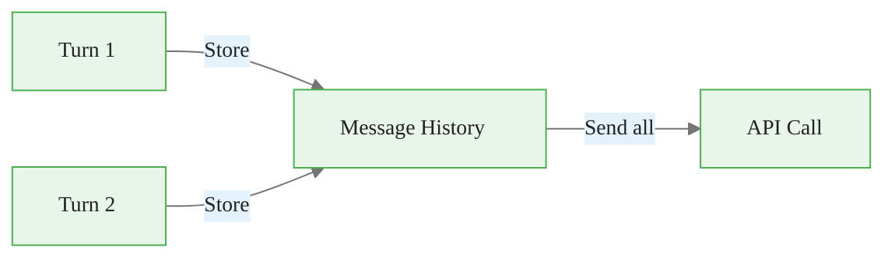
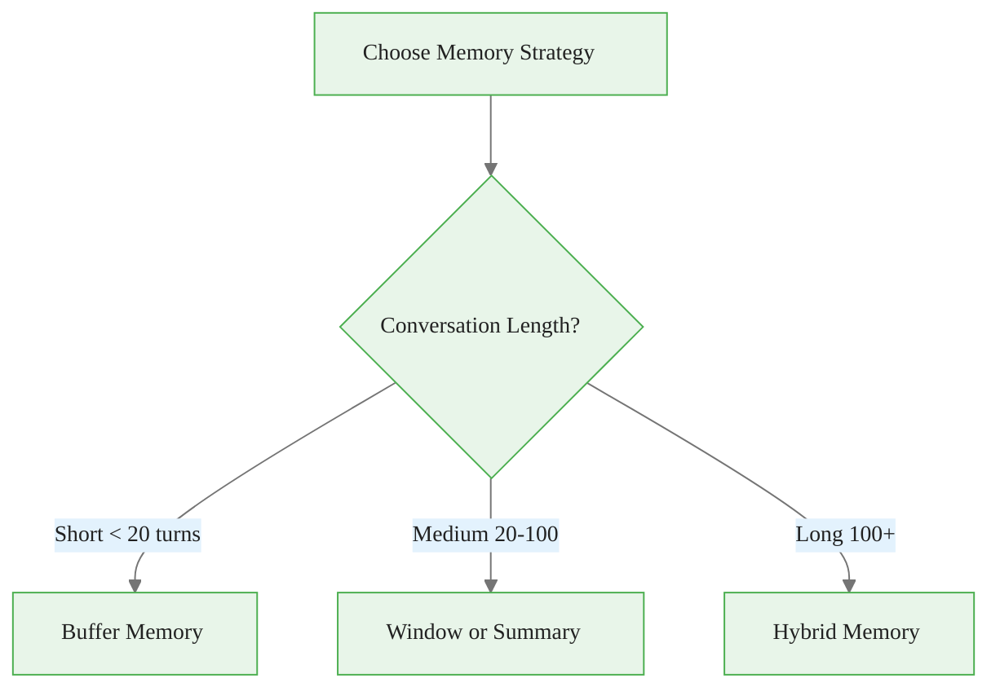
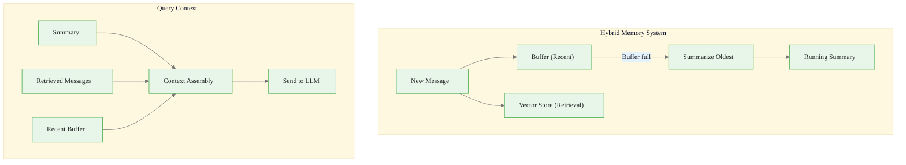
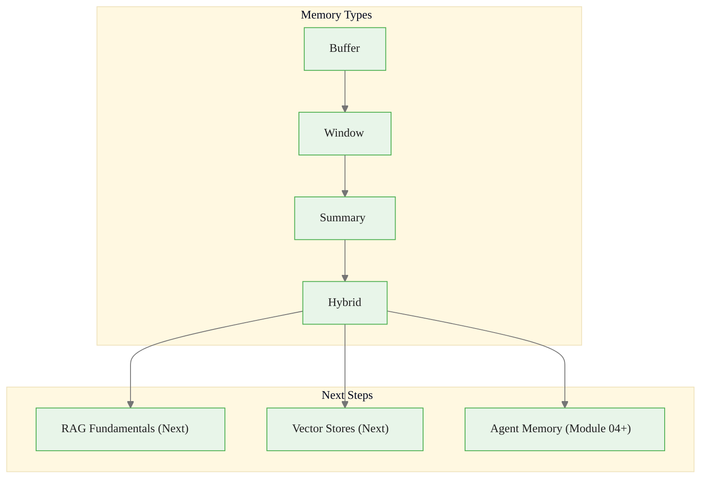

<!-- _class: lead -->

# Conversation Memory: Managing History and Context

**Module 03 — Memory & Context Management**

> Context windows are finite; conversations are not. The art of conversation memory is deciding what to keep, what to summarize, and what to discard.

<!--
Speaker notes: Key talking points for this slide
- Transition slide: we are now moving into Conversation Memory: Managing History and Context
- Pause briefly to let the audience absorb the previous section
- Preview what is coming next in this section
-->
---

# The Memory Problem

Each API call is **stateless** — the model has no memory of previous calls.

<div class="code-window">
<div class="code-header">
<div class="dots"><span class="dot-red"></span><span class="dot-yellow"></span><span class="dot-green"></span></div>
<span class="filename">agent.py</span>
</div>
<div class="code-body">

```python
# Call 1
response = client.messages.create(
    messages=[{"role": "user", "content": "My name is Alice."}])
# "Nice to meet you, Alice!"

# Call 2 - No memory of Call 1
response = client.messages.create(
    messages=[{"role": "user", "content": "What's my name?"}])
# "I don't know your name."
```

</div>
</div>

**Solution:** Maintain and send message history with every call.



<!--
Speaker notes: Key talking points for this slide
- Walk through the code block line by line, emphasizing the key pattern
- The diagram below shows the architecture/flow visually
- Point out how the code maps to the diagram components
- Highlight any production considerations or gotchas
-->
---

<!-- _class: lead -->

# Memory Strategies

<!--
Speaker notes: Key talking points for this slide
- Transition slide: we are now moving into Memory Strategies
- Pause briefly to let the audience absorb the previous section
- Preview what is coming next in this section
-->
---

# Strategy Comparison

| Strategy | Keep | Lose | Cost | Best For |
|----------|------|------|------|----------|
| **Buffer** | Everything | Nothing (until overflow) | High | Short conversations |
| **Window** | Last K turns | Early context | Medium | Chat applications |
| **Summary** | Compressed history | Details | Medium | Long conversations |
| **Token-Limited** | Up to budget | Oldest first | Controlled | Production systems |
| **Hybrid** | Summary + recent + retrieved | Varies | Medium | Complex agents |



<!--
Speaker notes: Key talking points for this slide
- Walk through the diagram from left to right (or top to bottom)
- Explain each component and the connections between them
- Relate this architecture back to practical use cases
-->
---

# 1. Buffer Memory (Full History)

<div class="code-window">
<div class="code-header">
<div class="dots"><span class="dot-red"></span><span class="dot-yellow"></span><span class="dot-green"></span></div>
<span class="filename">agent.py</span>
</div>
<div class="code-body">

```python
class BufferMemory:
    def __init__(self):
        self.messages: list[dict] = []

    def add_user_message(self, content: str):
        self.messages.append({"role": "user", "content": content})

    def add_assistant_message(self, content: str):
        self.messages.append({"role": "assistant", "content": content})

    def get_messages(self) -> list[dict]:
        return self.messages.copy()
```

</div>
</div>

- ✅ Complete context, simple implementation
- ⚠️ Unbounded growth, expensive for long conversations

<!--
Speaker notes: Key talking points for this slide
- Walk through the code example, focusing on the key pattern being demonstrated
- Highlight the most important lines and explain why they matter
- Point out any edge cases or production considerations
- This code is copy-paste ready for learners to try
-->
---

# 2. Window Memory (Recent K Messages)

<div class="code-window">
<div class="code-header">
<div class="dots"><span class="dot-red"></span><span class="dot-yellow"></span><span class="dot-green"></span></div>
<span class="filename">agent.py</span>
</div>
<div class="code-body">

```python
class WindowMemory:
    def __init__(self, k: int = 10):
        self.k = k
        self.messages: list[dict] = []

    def add_message(self, role: str, content: str):
        self.messages.append({"role": role, "content": content})
        if len(self.messages) > self.k * 2:
            self.messages = self.messages[-(self.k * 2):]

    def get_messages(self) -> list[dict]:
        return self.messages.copy()
```

</div>
</div>

- ✅ Bounded size, predictable costs
- ⚠️ Loses early context (user's name, initial requirements, etc.)

<!--
Speaker notes: Key talking points for this slide
- Walk through the code example, focusing on the key pattern being demonstrated
- Highlight the most important lines and explain why they matter
- Point out any edge cases or production considerations
- This code is copy-paste ready for learners to try
-->
---

# 3. Summary Memory

<div class="code-window">
<div class="code-header">
<div class="dots"><span class="dot-red"></span><span class="dot-yellow"></span><span class="dot-green"></span></div>
<span class="filename">agent.py</span>
</div>
<div class="code-body">

```python
class SummaryMemory:
    def __init__(self, client, summary_threshold: int = 20):
        self.client = client
        self.summary_threshold = summary_threshold
        self.summary: str = ""
        self.recent_messages: list[dict] = []

    def _update_summary(self):
        conversation_text = "\n".join(
            f"{m['role']}: {m['content']}" for m in self.recent_messages)
        response = self.client.messages.create(
            model="claude-haiku-4-5",  # Fast, cheap
            max_tokens=500,
            messages=[{"role": "user",
```

</div>
</div>

<!--
Speaker notes: Key talking points for this slide
- Walk through the code example, focusing on the key pattern being demonstrated
- Highlight the most important lines and explain why they matter
- Point out any edge cases or production considerations
- This code is copy-paste ready for learners to try
-->
---

# 3. Summary Memory (continued)

<div class="code-window">
<div class="code-header">
<div class="dots"><span class="dot-red"></span><span class="dot-yellow"></span><span class="dot-green"></span></div>
<span class="filename">agent.py</span>
</div>
<div class="code-body">

```python
"content": f"Summarize preserving key info:\n\n"
                           f"Previous: {self.summary or 'None'}\n"
                           f"New:\n{conversation_text}"}])
        self.summary = response.content[0].text
        self.recent_messages = []

    def get_messages(self) -> list[dict]:
        messages = []
        if self.summary:
            messages.append({"role": "user",
                "content": f"[Previous summary: {self.summary}]"})
        messages.extend(self.recent_messages)
        return messages
```

</div>
</div>

<!--
Speaker notes: Key talking points for this slide
- Continuation of the previous code block
- Walk through the remaining implementation details
- Highlight any key patterns or important lines
-->
---

# 4. Hybrid Memory



Combines: Summary for old context + Buffer for recent + Vector store for retrieval.

<!--
Speaker notes: Key talking points for this slide
- Walk through the diagram from left to right (or top to bottom)
- Explain each component and the connections between them
- Relate this architecture back to practical use cases
-->
---

# Dynamic Context Allocation

<div class="code-window">
<div class="code-header">
<div class="dots"><span class="dot-red"></span><span class="dot-yellow"></span><span class="dot-green"></span></div>
<span class="filename">agent.py</span>
</div>
<div class="code-body">

```python
class DynamicContextManager:
    def __init__(self, max_tokens: int = 100000):
        self.max_tokens = max_tokens
        self.response_budget = 4000

    def allocate(self, system_prompt, retrieved_docs, conversation):
        system_tokens = estimate_tokens(system_prompt)
        remaining = self.max_tokens - self.response_budget - system_tokens

        # Reserve minimum for recent conversation
        min_conv_tokens = 4 * 500  # 4 turns x 500 tokens
        remaining -= min_conv_tokens
```

</div>
</div>

<!--
Speaker notes: Key talking points for this slide
- Walk through the code example, focusing on the key pattern being demonstrated
- Highlight the most important lines and explain why they matter
- Point out any edge cases or production considerations
- This code is copy-paste ready for learners to try
-->
---

# Dynamic Context Allocation (continued)

<div class="code-window">
<div class="code-header">
<div class="dots"><span class="dot-red"></span><span class="dot-yellow"></span><span class="dot-green"></span></div>
<span class="filename">agent.py</span>
</div>
<div class="code-body">

```python
# Allocate to retrieved docs (up to 60%)
        doc_budget = min(remaining * 0.6, 20000)
        selected_docs = self._select_documents(retrieved_docs, int(doc_budget))

        # Remaining to conversation history
        conv_budget = remaining - sum(estimate_tokens(d) for d in selected_docs) + min_conv_tokens
        selected_conv = self._select_messages(conversation, int(conv_budget))

        return {"system": system_prompt, "documents": selected_docs,
                "conversation": selected_conv}
```

</div>
</div>

<!--
Speaker notes: Key talking points for this slide
- Continuation of the previous code block
- Walk through the remaining implementation details
- Highlight any key patterns or important lines
-->
---

# Persistence: Saving and Loading

<div class="columns">
<div>

**Persistent Memory:**
<div class="code-window">
<div class="code-header">
<div class="dots"><span class="dot-red"></span><span class="dot-yellow"></span><span class="dot-green"></span></div>
<span class="filename">agent.py</span>
</div>
<div class="code-body">

```python
class PersistentMemory(BufferMemory):
    def __init__(self, filepath: str):
        super().__init__()
        self.filepath = Path(filepath)
        self._load()

    def _load(self):
        if self.filepath.exists():
            with open(self.filepath, 'r') as f:
                data = json.load(f)
                self.messages = data.get(
                    "messages", [])

    def _save(self):
        with open(self.filepath, 'w') as f:
            json.dump(
                {"messages": self.messages}, f)
```

</div>
</div>

</div>
<div>

**Session Manager:**
```python
class SessionManager:
    def __init__(self, storage_dir: str):
        self.storage_dir = Path(storage_dir)
        self.storage_dir.mkdir(exist_ok=True)

    def create_session(self) -> str:
        return str(uuid.uuid4())[:8]

    def get_memory(self, session_id):
        filepath = (self.storage_dir
            / f"{session_id}.json")
        return PersistentMemory(
            str(filepath))

    def list_sessions(self):
        return [f.stem for f in
            self.storage_dir.glob("*.json")]
```

</div>
</div>

<!--
Speaker notes: Key talking points for this slide
- Walk through the code example, focusing on the key pattern being demonstrated
- Highlight the most important lines and explain why they matter
- Point out any edge cases or production considerations
- This code is copy-paste ready for learners to try
-->
---

# Best Practices

1. **Start Simple**: Buffer memory is often sufficient
2. **Monitor Token Usage**: Log token counts to understand costs
3. **Use System Prompts for Static Context**: Don't repeat in every message
4. **Prioritize Recent Context**: Recent messages usually matter most
5. **Summarize Strategically**: Use fast models (Haiku) for summaries
6. **Test Memory Boundaries**: Verify behavior when context is truncated

<!--
Speaker notes: Key talking points for this slide
- Explain the core concept on this slide clearly and concisely
- Relate it back to practical agent building scenarios
- Highlight any common pitfalls or misconceptions
- Connect to what was covered previously and what comes next
-->
---

# Summary & Connections



**Key takeaways:**
- LLMs are stateless — you must manage conversation history
- Buffer for short, Window for medium, Summary for long conversations
- Hybrid memory combines the best of all strategies
- Allocate context budget dynamically across sources
- Persist memory for cross-session continuity

> *Conversation memory transforms stateless API calls into continuous interactions.*

<!--
Speaker notes: Key talking points for this slide
- Walk through the diagram from left to right (or top to bottom)
- Explain each component and the connections between them
- Relate this architecture back to practical use cases
-->