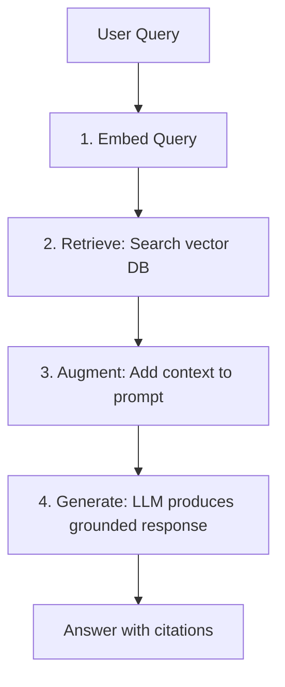
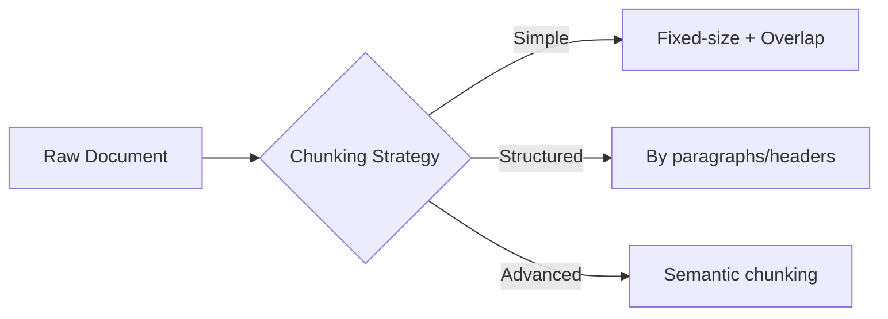
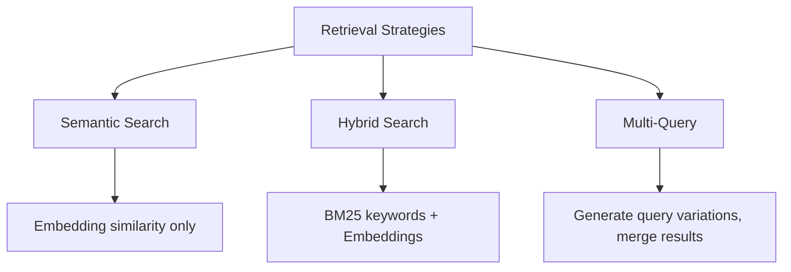
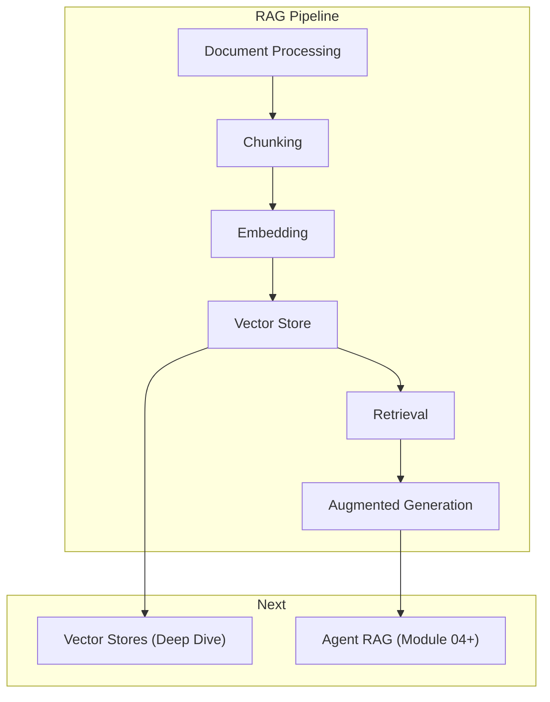

<!-- _class: lead -->

# RAG Fundamentals: Retrieval-Augmented Generation

**Module 03 — Memory & Context Management**

> RAG separates what the model knows from what it can access. Instead of cramming all knowledge into model weights, fetch relevant information at runtime.

<!--
Speaker notes: Key talking points for this slide
- Transition slide: we are now moving into RAG Fundamentals: Retrieval-Augmented Generation
- Pause briefly to let the audience absorb the previous section
- Preview what is coming next in this section
-->
---

# The RAG Pipeline



**Why RAG?**
- Reduces hallucinations
- Enables access to private data
- Keeps responses current beyond training cutoffs
- Knowledge is updatable and verifiable

<!--
Speaker notes: Key talking points for this slide
- Walk through the diagram from left to right (or top to bottom)
- Explain each component and the connections between them
- Relate this architecture back to practical use cases
-->
---

# Basic RAG Implementation

```python
class SimpleRAG:
    def __init__(self):
        self.llm = anthropic.Anthropic()
        self.embedder = SentenceTransformer('all-MiniLM-L6-v2')
        self.db = chromadb.Client()
        self.collection = self.db.create_collection("documents")

    def add_documents(self, documents: list[str], ids: list[str] = None):
        if ids is None:
            ids = [f"doc_{i}" for i in range(len(documents))]
        embeddings = self.embedder.encode(documents).tolist()
        self.collection.add(documents=documents, embeddings=embeddings, ids=ids)
```

<!--
Speaker notes: Key talking points for this slide
- Walk through the code example, focusing on the key pattern being demonstrated
- Highlight the most important lines and explain why they matter
- Point out any edge cases or production considerations
- This code is copy-paste ready for learners to try
-->
---

# Basic RAG Implementation (continued)

```python
def query(self, question: str, n_results: int = 3) -> str:
        query_embedding = self.embedder.encode([question]).tolist()
        results = self.collection.query(query_embeddings=query_embedding, n_results=n_results)
        context = "\n\n".join(results["documents"][0])

        response = self.llm.messages.create(
            model="claude-sonnet-4-6", max_tokens=1000,
            messages=[{"role": "user",
                "content": f"Answer based on context. If context insufficient, say so.\n\n"
                           f"Context:\n{context}\n\nQuestion: {question}"}])
        return response.content[0].text
```

<!--
Speaker notes: Key talking points for this slide
- Continuation of the previous code block
- Walk through the remaining implementation details
- Highlight any key patterns or important lines
-->
---

<!-- _class: lead -->

# Document Processing

<!--
Speaker notes: Key talking points for this slide
- Transition slide: we are now moving into Document Processing
- Pause briefly to let the audience absorb the previous section
- Preview what is coming next in this section
-->
---

# Chunking Strategies

| Strategy | Description | Best For |
|----------|-------------|----------|
| **Fixed-size** | Split at character/token count | General purpose |
| **Sentence** | Split at sentence boundaries | Preserving meaning |
| **Paragraph** | Split at paragraph breaks | Structured text |
| **Markdown** | Split at headers | Documentation |
| **Semantic** | Split at meaning boundaries | High-quality retrieval |



<!--
Speaker notes: Key talking points for this slide
- Walk through the diagram from left to right (or top to bottom)
- Explain each component and the connections between them
- Relate this architecture back to practical use cases
-->
---

# Chunking Code

<div class="columns">
<div>

**Fixed-size with overlap:**
```python
def chunk_by_size(text, chunk_size=1000,
                  overlap=200):
    chunks = []
    start = 0
    while start < len(text):
        end = start + chunk_size
        chunks.append(text[start:end])
        start = end - overlap
    return chunks
```

**By sentences:**
```python
def chunk_by_sentences(text,
                       sentences_per_chunk=5):
    import re
    sentences = re.split(
        r'(?<=[.!?])\s+', text)
    return [' '.join(
        sentences[i:i+sentences_per_chunk])
        for i in range(0, len(sentences),
                       sentences_per_chunk)]
```

</div>
<div>

**By paragraphs:**
```python
def chunk_by_paragraphs(text):
    paragraphs = text.split('\n\n')
    return [p.strip() for p in paragraphs
            if p.strip()]
```

**Markdown by headers:**
```python
def chunk_markdown(text):
    import re
    sections = re.split(r'\n(?=#)', text)
    return [s.strip() for s in sections
            if s.strip()]
```

</div>
</div>

> 🔑 Always use overlap (10-20%) to avoid splitting concepts across chunks.

<!--
Speaker notes: Key talking points for this slide
- Walk through the code example, focusing on the key pattern being demonstrated
- Highlight the most important lines and explain why they matter
- Point out any edge cases or production considerations
- This code is copy-paste ready for learners to try
-->
---

# Semantic Chunking

Split at natural meaning boundaries using embeddings:

```python
class SemanticChunker:
    def __init__(self, threshold: float = 0.5):
        self.embedder = SentenceTransformer('all-MiniLM-L6-v2')
        self.threshold = threshold

    def chunk(self, text: str) -> list[str]:
        sentences = text.replace('\n', ' ').split('. ')
        sentences = [s.strip() + '.' for s in sentences if s.strip()]
        embeddings = self.embedder.encode(sentences)
```

<!--
Speaker notes: Key talking points for this slide
- Walk through the code example, focusing on the key pattern being demonstrated
- Highlight the most important lines and explain why they matter
- Point out any edge cases or production considerations
- This code is copy-paste ready for learners to try
-->
---

# Semantic Chunking (continued)

```python
chunks, current_chunk = [], [sentences[0]]
        for i in range(1, len(sentences)):
            sim = np.dot(embeddings[i-1], embeddings[i]) / (
                np.linalg.norm(embeddings[i-1]) * np.linalg.norm(embeddings[i]))
            if sim < self.threshold:  # Semantic break
                chunks.append(' '.join(current_chunk))
                current_chunk = []
            current_chunk.append(sentences[i])
        if current_chunk:
            chunks.append(' '.join(current_chunk))
        return chunks
```

<!--
Speaker notes: Key talking points for this slide
- Continuation of the previous code block
- Walk through the remaining implementation details
- Highlight any key patterns or important lines
-->
---

# Embedding Models

| Model | Dimensions | Speed | Quality | Use Case |
|-------|------------|-------|---------|----------|
| all-MiniLM-L6-v2 | 384 | Fast | Good | Development |
| all-mpnet-base-v2 | 768 | Medium | Better | General |
| text-embedding-3-large | 3072 | API | Best | Production |
| BAAI/bge-large-en | 1024 | Medium | Excellent | Open-source |

```python
# Local embeddings
embedder = SentenceTransformer('all-MiniLM-L6-v2')
vectors = embedder.encode(["text to embed"]).tolist()

# OpenAI API embeddings
response = openai_client.embeddings.create(
    input=["text to embed"], model="text-embedding-3-small")
vectors = [item.embedding for item in response.data]
```

<!--
Speaker notes: Key talking points for this slide
- Walk through the code example, focusing on the key pattern being demonstrated
- Highlight the most important lines and explain why they matter
- Point out any edge cases or production considerations
- This code is copy-paste ready for learners to try
-->
---

<!-- _class: lead -->

# Retrieval Strategies

<!--
Speaker notes: Key talking points for this slide
- Transition slide: we are now moving into Retrieval Strategies
- Pause briefly to let the audience absorb the previous section
- Preview what is coming next in this section
-->
---

# Semantic vs Hybrid vs Multi-Query



| Strategy | Pros | Cons |
|----------|------|------|
| **Semantic** | Finds meaning | Misses exact terms |
| **Hybrid** | Best of both worlds | More complex |
| **Multi-Query** | Higher recall | Higher cost/latency |

<!--
Speaker notes: Key talking points for this slide
- Walk through the diagram from left to right (or top to bottom)
- Explain each component and the connections between them
- Relate this architecture back to practical use cases
-->
---

# Hybrid Search (Keyword + Semantic)

```python
class HybridRetriever:
    def __init__(self, documents, embedder):
        self.documents = documents
        tokenized = [doc.lower().split() for doc in documents]
        self.bm25 = BM25Okapi(tokenized)
        self.embeddings = embedder.encode(documents)
        self.embedder = embedder

    def search(self, query, n_results=5, alpha=0.5):
        # BM25 keyword scores (normalized)
        bm25_scores = self.bm25.get_scores(query.lower().split())
        bm25_scores = bm25_scores / (bm25_scores.max() + 1e-6)
```

<!--
Speaker notes: Key talking points for this slide
- Walk through the code example, focusing on the key pattern being demonstrated
- Highlight the most important lines and explain why they matter
- Point out any edge cases or production considerations
- This code is copy-paste ready for learners to try
-->
---

# Hybrid Search (Keyword + Semantic) (continued)

```python
# Semantic scores
        query_emb = self.embedder.encode([query])[0]
        semantic_scores = np.dot(self.embeddings, query_emb) / (
            np.linalg.norm(self.embeddings, axis=1) * np.linalg.norm(query_emb))

        # Combine: alpha * semantic + (1-alpha) * keyword
        combined = alpha * semantic_scores + (1 - alpha) * bm25_scores
        top_indices = np.argsort(combined)[-n_results:][::-1]
        return [(idx, combined[idx]) for idx in top_indices]
```

<!--
Speaker notes: Key talking points for this slide
- Continuation of the previous code block
- Walk through the remaining implementation details
- Highlight any key patterns or important lines
-->
---

# Multi-Query Retrieval

```python
class MultiQueryRetriever:
    def __init__(self, llm, base_retriever):
        self.llm = llm
        self.base_retriever = base_retriever

    def generate_queries(self, original_query, n_queries=3):
        response = self.llm.messages.create(
            model="claude-haiku-4-5", max_tokens=200,
            messages=[{"role": "user",
                "content": f"Generate {n_queries} variations of:\n{original_query}"}])
        variations = response.content[0].text.strip().split('\n')
        return [original_query] + [v.strip() for v in variations if v.strip()]
```

<!--
Speaker notes: Key talking points for this slide
- Walk through the code example, focusing on the key pattern being demonstrated
- Highlight the most important lines and explain why they matter
- Point out any edge cases or production considerations
- This code is copy-paste ready for learners to try
-->
---

# Multi-Query Retrieval (continued)

```python
def retrieve(self, query, n_results=5):
        queries = self.generate_queries(query)
        all_results = {}
        for q in queries:
            for r in self.base_retriever.search(q, n_results):
                key = r["content"][:100]
                if key not in all_results or r["score"] > all_results[key]["score"]:
                    all_results[key] = r
        return sorted(all_results.values(), key=lambda x: x["score"], reverse=True)[:n_results]
```

<!--
Speaker notes: Key talking points for this slide
- Continuation of the previous code block
- Walk through the remaining implementation details
- Highlight any key patterns or important lines
-->
---

# RAG Prompt Engineering

<div class="columns">
<div>

**Basic:**
```python
RAG_PROMPT = """Answer based on context.
If context insufficient, say so.

Context:
{context}

Question: {question}
Answer:"""
```

**With Citations:**
```python
CITATION_PROMPT = """Answer using the
sources below. Cite using [1], [2], etc.

Sources:
{numbered_sources}

Question: {question}
Provide answer with citations:"""
```

</div>
<div>

**Instructed RAG:**
```python
INSTRUCTED_RAG = """You are a helpful
assistant with knowledge base access.

Instructions:
1. Base answer ONLY on provided context
2. If insufficient, say so clearly
3. Quote relevant passages
4. If sources conflict, acknowledge it

Context:
{context}

Question: {question}
Response:"""
```

</div>
</div>

<!--
Speaker notes: Key talking points for this slide
- Walk through the code example, focusing on the key pattern being demonstrated
- Highlight the most important lines and explain why they matter
- Point out any edge cases or production considerations
- This code is copy-paste ready for learners to try
-->
---

# Evaluation Metrics

```python
def evaluate_retrieval(queries, ground_truth, retriever, k=5):
    precisions, recalls, mrrs = [], [], []
    for query, relevant_ids in zip(queries, ground_truth):
        results = retriever.search(query, n_results=k)
        retrieved_ids = [r["id"] for r in results]

        relevant_retrieved = len(set(retrieved_ids) & set(relevant_ids))
        precisions.append(relevant_retrieved / k)       # Precision@k
        recalls.append(relevant_retrieved / len(relevant_ids))  # Recall@k
```

<!--
Speaker notes: Key talking points for this slide
- Walk through the code example, focusing on the key pattern being demonstrated
- Highlight the most important lines and explain why they matter
- Point out any edge cases or production considerations
- This code is copy-paste ready for learners to try
-->
---

# Evaluation Metrics (continued)

```python
for i, rid in enumerate(retrieved_ids):  # MRR
            if rid in relevant_ids:
                mrrs.append(1 / (i + 1))
                break
        else:
            mrrs.append(0)

    return {"precision@k": np.mean(precisions),
            "recall@k": np.mean(recalls), "mrr": np.mean(mrrs)}
```

<!--
Speaker notes: Key talking points for this slide
- Continuation of the previous code block
- Walk through the remaining implementation details
- Highlight any key patterns or important lines
-->
---

# Summary & Connections



**Key takeaways:**
- RAG = Embed query + Retrieve docs + Augment prompt + Generate
- Chunk thoughtfully: 400-1000 tokens with 10-20% overlap
- Hybrid search (keyword + semantic) outperforms either alone
- Always include citation instructions in RAG prompts
- Evaluate with precision@k, recall@k, and MRR

> *RAG transforms LLMs from closed knowledge systems to open retrieval engines.*

<!--
Speaker notes: Key talking points for this slide
- Walk through the diagram from left to right (or top to bottom)
- Explain each component and the connections between them
- Relate this architecture back to practical use cases
-->