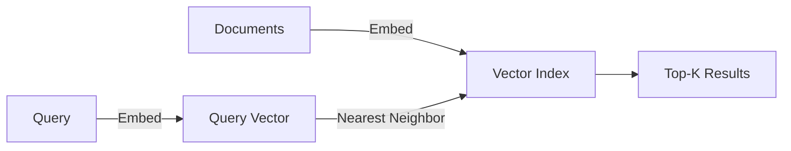
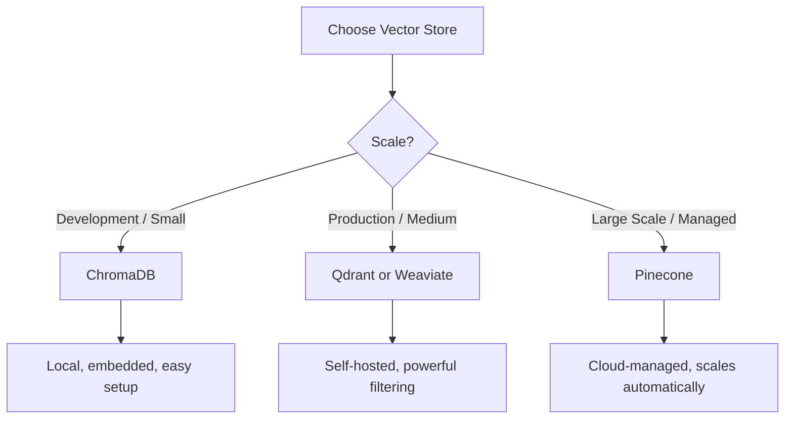
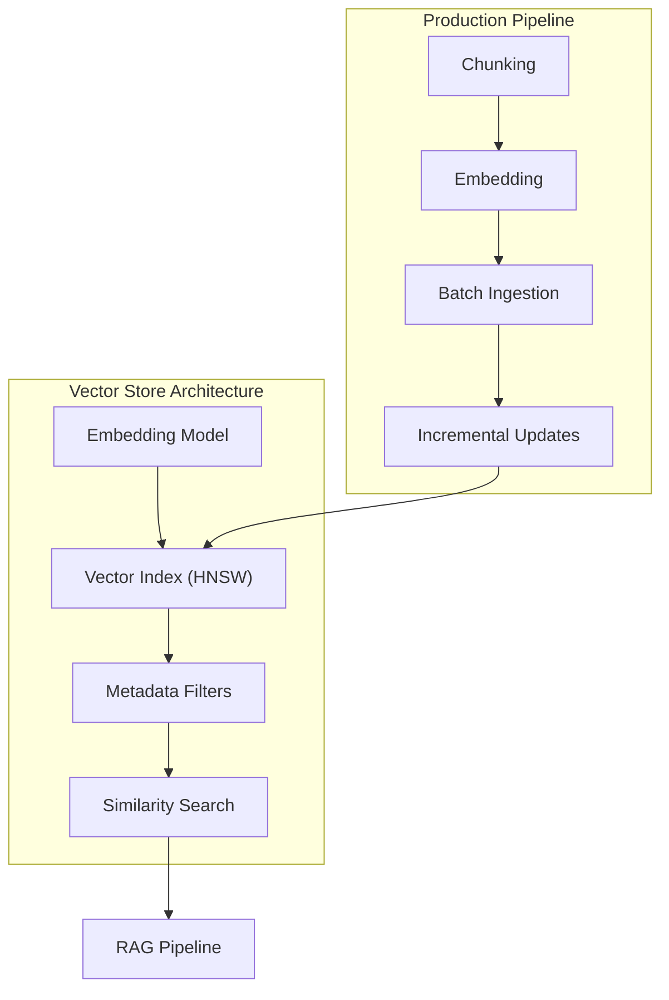

<!-- _class: lead -->

# Vector Stores: Embedding and Storing Knowledge

**Module 03 — Memory & Context Management**

> Vector search finds meaning, not keywords. "Automobile" finds "car," "vehicle," and "transportation."

<!--
Speaker notes: Key talking points for this slide
- Transition slide: we are now moving into Vector Stores: Embedding and Storing Knowledge
- Pause briefly to let the audience absorb the previous section
- Preview what is coming next in this section
-->
---

# How Vector Search Works

```
1. Documents -> Embed -> Vectors stored in index

   "Electric cars are efficient"  ->  [0.12, -0.34, 0.56, ...]
   "Solar panels generate power"  ->  [0.08, -0.28, 0.61, ...]
   "Gas vehicles emit CO2"        ->  [0.15, -0.31, 0.52, ...]

2. Query -> Embed -> Find nearest neighbors

   "renewable energy vehicles"    ->  [0.11, -0.32, 0.58, ...]
                                        |
                                  Similarity search
                                        |
                           Match 1: "Electric cars are efficient"
                           Match 2: "Gas vehicles emit CO2"
```



<!--
Speaker notes: Key talking points for this slide
- Walk through the diagram from left to right (or top to bottom)
- Explain each component and the connections between them
- Relate this architecture back to practical use cases
-->
---

# Distance Metrics

| Metric | Formula | Range | Use Case |
|--------|---------|-------|----------|
| **Cosine** | $1 - \cos(\theta)$ | [0, 2] | Text similarity (normalized) |
| **Euclidean (L2)** | $\sqrt{\sum(a-b)^2}$ | $[0, \infty)$ | Dense vectors |
| **Dot Product** | $\sum(a \cdot b)$ | $(-\infty, \infty)$ | Pre-normalized vectors |

> 🔑 For text similarity, cosine distance is almost always the right choice.

<!--
Speaker notes: Key talking points for this slide
- Explain the core concept on this slide clearly and concisely
- Relate it back to practical agent building scenarios
- Highlight any common pitfalls or misconceptions
- Connect to what was covered previously and what comes next
-->
---

<!-- _class: lead -->

# Vector Store Options

<!--
Speaker notes: Key talking points for this slide
- Transition slide: we are now moving into Vector Store Options
- Pause briefly to let the audience absorb the previous section
- Preview what is coming next in this section
-->
---

# Vector Store Comparison



| Store | Type | Best For | Filtering |
|-------|------|----------|-----------|
| **ChromaDB** | Embedded/Local | Development, small datasets | Basic |
| **Pinecone** | Cloud | Large scale, managed | Good |
| **Weaviate** | Self-hosted/Cloud | GraphQL, multimodal | Excellent |
| **Qdrant** | Self-hosted/Cloud | High performance, complex filtering | Excellent |

<!--
Speaker notes: Key talking points for this slide
- Walk through the diagram from left to right (or top to bottom)
- Explain each component and the connections between them
- Relate this architecture back to practical use cases
-->
---

# ChromaDB (Local/Embedded)

```python
import chromadb
from chromadb.utils.embedding_functions import SentenceTransformerEmbeddingFunction

# Initialize
client = chromadb.Client()  # In-memory
# client = chromadb.PersistentClient(path="./chroma_db")  # Persistent

embedding_fn = SentenceTransformerEmbeddingFunction(model_name="all-MiniLM-L6-v2")
collection = client.create_collection(
    name="documents",
    embedding_function=embedding_fn,
    metadata={"hnsw:space": "cosine"})
```

<!--
Speaker notes: Key talking points for this slide
- Walk through the code example, focusing on the key pattern being demonstrated
- Highlight the most important lines and explain why they matter
- Point out any edge cases or production considerations
- This code is copy-paste ready for learners to try
-->
---

# ChromaDB (Local/Embedded) (continued)

```python
# Add documents
collection.add(
    documents=["Electric cars are efficient", "Solar power is renewable"],
    metadatas=[{"source": "article1"}, {"source": "article2"}],
    ids=["doc1", "doc2"])

# Query
results = collection.query(query_texts=["green energy transportation"], n_results=2)
```

<!--
Speaker notes: Key talking points for this slide
- Continuation of the previous code block
- Walk through the remaining implementation details
- Highlight any key patterns or important lines
-->
---

# Pinecone (Cloud)

```python
from pinecone import Pinecone, ServerlessSpec

pc = Pinecone(api_key="your-api-key")
pc.create_index(
    name="documents", dimension=384, metric="cosine",
    spec=ServerlessSpec(cloud="aws", region="us-east-1"))

index = pc.Index("documents")

# Upsert vectors
embeddings = embedding_model.encode(documents).tolist()
index.upsert(vectors=[
    {"id": f"doc_{i}", "values": emb, "metadata": {"text": doc}}
    for i, (emb, doc) in enumerate(zip(embeddings, documents))])

# Query
query_embedding = embedding_model.encode(["green energy"]).tolist()[0]
results = index.query(vector=query_embedding, top_k=5, include_metadata=True)
```

<!--
Speaker notes: Key talking points for this slide
- Walk through the code example, focusing on the key pattern being demonstrated
- Highlight the most important lines and explain why they matter
- Point out any edge cases or production considerations
- This code is copy-paste ready for learners to try
-->
---

# Qdrant (High Performance)

```python
from qdrant_client import QdrantClient
from qdrant_client.models import Distance, VectorParams, PointStruct

client = QdrantClient(host="localhost", port=6333)

client.create_collection(
    collection_name="documents",
    vectors_config=VectorParams(size=384, distance=Distance.COSINE))
```

<!--
Speaker notes: Key talking points for this slide
- Walk through the code example, focusing on the key pattern being demonstrated
- Highlight the most important lines and explain why they matter
- Point out any edge cases or production considerations
- This code is copy-paste ready for learners to try
-->
---

# Qdrant (High Performance) (continued)

```python
# Insert vectors
points = [PointStruct(
    id=i, vector=embedding_model.encode(doc).tolist(),
    payload={"text": doc, "source": f"source_{i}"})
    for i, doc in enumerate(documents)]
client.upsert(collection_name="documents", points=points)

# Search with filters
results = client.search(
    collection_name="documents",
    query_vector=embedding_model.encode("green energy").tolist(),
    limit=5,
    query_filter={"must": [{"key": "source", "match": {"value": "source_1"}}]})
```

<!--
Speaker notes: Key talking points for this slide
- Continuation of the previous code block
- Walk through the remaining implementation details
- Highlight any key patterns or important lines
-->
---

# Index Types

| Index | Algorithm | Speed | Accuracy | Memory | Best For |
|-------|-----------|-------|----------|--------|----------|
| **HNSW** | Graph-based | Fast | High | High | Most use cases |
| **IVF** | Cluster-based | Fast | Good | Medium | Very large datasets |
| **Flat** | Brute force | Slow | Exact | Low | Small datasets |

```python
# ChromaDB HNSW settings
collection = client.create_collection(
    name="documents",
    metadata={
        "hnsw:space": "cosine",
        "hnsw:construction_ef": 100,  # Build quality
        "hnsw:search_ef": 50,         # Search quality
        "hnsw:M": 16                   # Connections per layer
    })
```

> Higher values = better quality but slower and more memory.

<!--
Speaker notes: Key talking points for this slide
- Walk through the code example, focusing on the key pattern being demonstrated
- Highlight the most important lines and explain why they matter
- Point out any edge cases or production considerations
- This code is copy-paste ready for learners to try
-->
---

# Metadata Filtering

```python
# ChromaDB filtering
results = collection.query(
    query_texts=["electric vehicles"],
    n_results=10,
    where={
        "$and": [
            {"category": {"$eq": "technology"}},
            {"year": {"$gte": 2020}},
            {"source": {"$in": ["reuters", "bbc"]}}
        ]
    })
```

> ✅ Rich metadata enables filtering that reduces search space dramatically.

<!--
Speaker notes: Key talking points for this slide
- Walk through the code example, focusing on the key pattern being demonstrated
- Highlight the most important lines and explain why they matter
- Point out any edge cases or production considerations
- This code is copy-paste ready for learners to try
-->
---

# Metadata Filtering (continued)

```python
# Good metadata design
metadata = {
    "source": "company_wiki",
    "category": "engineering",
    "author": "john_doe",
    "created_at": "2024-01-15",
    "version": 3,
    "is_public": True,
    "tags": ["kubernetes", "deployment"]
}
```

<!--
Speaker notes: Key talking points for this slide
- Continuation of the previous code block
- Walk through the remaining implementation details
- Highlight any key patterns or important lines
-->
---

<!-- _class: lead -->

# Ingestion Pipelines

<!--
Speaker notes: Key talking points for this slide
- Transition slide: we are now moving into Ingestion Pipelines
- Pause briefly to let the audience absorb the previous section
- Preview what is coming next in this section
-->
---

# Document Processing Pipeline

```python
@dataclass
class ProcessedChunk:
    content: str
    metadata: dict
    id: str

def process_documents(documents, chunk_size=1000, chunk_overlap=200):
    for doc in documents:
        chunks = chunk_by_size(doc["content"], chunk_size, chunk_overlap)
        for i, chunk in enumerate(chunks):
            chunk_id = hashlib.md5(
                f"{doc.get('id', '')}_{i}_{chunk[:50]}".encode()).hexdigest()
            yield ProcessedChunk(
```

<!--
Speaker notes: Key talking points for this slide
- Walk through the code example, focusing on the key pattern being demonstrated
- Highlight the most important lines and explain why they matter
- Point out any edge cases or production considerations
- This code is copy-paste ready for learners to try
-->
---

# Document Processing Pipeline (continued)

```python
content=chunk,
                metadata={**doc.get("metadata", {}),
                    "chunk_index": i, "total_chunks": len(chunks)},
                id=chunk_id)

def ingest_to_vector_store(chunks, collection, embedder, batch_size=100):
    for i in range(0, len(chunks), batch_size):
        batch = chunks[i:i + batch_size]
        embeddings = embedder.encode([c.content for c in batch]).tolist()
        collection.add(
            documents=[c.content for c in batch], embeddings=embeddings,
            metadatas=[c.metadata for c in batch], ids=[c.id for c in batch])
```

<!--
Speaker notes: Key talking points for this slide
- Continuation of the previous code block
- Walk through the remaining implementation details
- Highlight any key patterns or important lines
-->
---

# Performance Optimization

<div class="columns">
<div>

**Embedding Caching:**
```python
class CachedEmbedder:
    def __init__(self, embedder, cache_dir):
        self.embedder = embedder
        self.cache = diskcache.Cache(cache_dir)

    def encode(self, texts):
        results, to_compute, indices = [], [], []
        for i, text in enumerate(texts):
            key = hashlib.md5(
                text.encode()).hexdigest()
            cached = self.cache.get(key)
            if cached is not None:
                results.append(cached)
            else:
```

</div>
<div>

**Over-fetch + Rerank:**
```python
def optimized_query(query, collection,
                    embedder, n_results=10,
                    rerank_top_k=50):
    # Over-fetch
    results = collection.query(
        query_embeddings=[
            embedder.encode([query])[0]
                .tolist()],
        n_results=rerank_top_k)
```

</div>
</div>

<!--
Speaker notes: Key talking points for this slide
- Walk through the code example, focusing on the key pattern being demonstrated
- Highlight the most important lines and explain why they matter
- Point out any edge cases or production considerations
- This code is copy-paste ready for learners to try
-->
---

# Performance Optimization (continued)

```python
# Rerank with cross-encoder
    reranker = CrossEncoder(
        'cross-encoder/ms-marco-MiniLM-L-6-v2')
    pairs = [(query, doc)
        for doc in results["documents"][0]]
    scores = reranker.predict(pairs)

    ranked = sorted(zip(
        results["documents"][0],
        results["metadatas"][0], scores),
        key=lambda x: x[2], reverse=True)
    return ranked[:n_results]
```

<!--
Speaker notes: Key talking points for this slide
- Continuation of the previous code block
- Walk through the remaining implementation details
- Highlight any key patterns or important lines
-->
---

# Performance Optimization (continued)

```python
to_compute.append(text)
                indices.append(i)
                results.append(None)
        if to_compute:
            computed = self.embedder.encode(
                to_compute).tolist()
            for idx, emb, text in zip(
                    indices, computed, to_compute):
                key = hashlib.md5(
                    text.encode()).hexdigest()
                self.cache.set(key, emb)
                results[idx] = emb
        return results
```

<!--
Speaker notes: Key talking points for this slide
- Continuation of the previous code block
- Walk through the remaining implementation details
- Highlight any key patterns or important lines
-->
---

# Summary & Connections



**Key takeaways:**
- Vector stores find meaning, not keywords
- ChromaDB for dev, Pinecone/Qdrant/Weaviate for production
- HNSW is the default index for most use cases
- Rich metadata enables powerful filtering
- Cache embeddings and use reranking for quality
- Design ingestion pipelines for incremental updates

> *Vector stores are the long-term memory of your agent.*

<!--
Speaker notes: Key talking points for this slide
- Walk through the diagram from left to right (or top to bottom)
- Explain each component and the connections between them
- Relate this architecture back to practical use cases
-->