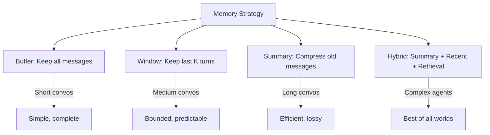
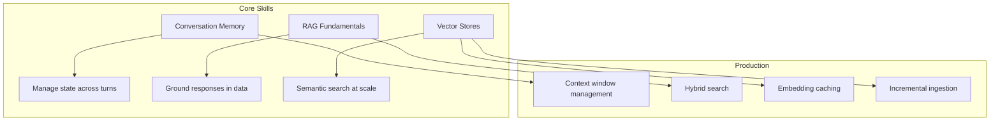

<!-- _class: lead -->

# Module 3: Memory & Context Management

**Cheatsheet — Quick Reference Card**

> Conversation memory, RAG pipelines, vector stores, and context management at a glance.

<!--
Speaker notes: Key talking points for this slide
- Transition slide: we are now moving into Module 3: Memory & Context Management
- Pause briefly to let the audience absorb the previous section
- Preview what is coming next in this section
-->
---

# Key Concepts

| Concept | Definition |
|---------|-----------|
| **Conversation Memory** | Storing and managing chat history within context limits |
| **RAG** | Retrieval-Augmented Generation: grounding responses with retrieved context |
| **Vector Database** | Database optimized for similarity search over embeddings |
| **Embedding** | Dense vector representing semantic meaning of text |
| **Chunking** | Splitting documents into retrieval-friendly pieces |
| **Semantic Search** | Finding info based on meaning, not keywords |
| **Hybrid Search** | Combining keyword + vector search |
| **Reranking** | Re-scoring retrieved results for better relevance |

<!--
Speaker notes: Key talking points for this slide
- Explain the core concept on this slide clearly and concisely
- Relate it back to practical agent building scenarios
- Highlight any common pitfalls or misconceptions
- Connect to what was covered previously and what comes next
-->
---

# Memory Strategies At a Glance



<!--
Speaker notes: Key talking points for this slide
- Walk through the diagram from left to right (or top to bottom)
- Explain each component and the connections between them
- Relate this architecture back to practical use cases
-->
---

# Quick RAG Pipeline

```python
# 1. Setup
collection = chromadb.Client().create_collection("kb", embedding_function=ef)

# 2. Add documents
collection.add(documents=docs, ids=[f"doc_{i}" for i in range(len(docs))])

# 3. Query
results = collection.query(query_texts=[question], n_results=3)
context = "\n".join(results['documents'][0])

# 4. Generate
response = client.messages.create(
    model="claude-sonnet-4-6", max_tokens=1024,
    messages=[{"role": "user",
        "content": f"Answer based on context:\n\n{context}\n\nQ: {question}"}])
```

<!--
Speaker notes: Key talking points for this slide
- Walk through the code example, focusing on the key pattern being demonstrated
- Highlight the most important lines and explain why they matter
- Point out any edge cases or production considerations
- This code is copy-paste ready for learners to try
-->
---

# Chunking Guidelines

| Use Case | Chunk Size | Overlap |
|----------|-----------|---------|
| Question Answering | 400 tokens | 50 |
| Summarization | 1000 tokens | 200 |
| Code Search | 200 tokens | 20 |
| Conversational | 600 tokens | 100 |

> ⚠️ Too large = dilutes relevance. Too small = loses context. Always use overlap.

<!--
Speaker notes: Key talking points for this slide
- Explain the core concept on this slide clearly and concisely
- Relate it back to practical agent building scenarios
- Highlight any common pitfalls or misconceptions
- Connect to what was covered previously and what comes next
-->
---

# Gotchas

| Gotcha | Solution |
|--------|----------|
| Different embedding models for index/query | Always use the SAME model |
| Chunks too large (5000+ tokens) | Use 400-1000 tokens |
| Chunks too small (<50 tokens) | Minimum 200 tokens for coherent meaning |
| No overlap in chunking | Use 10-20% overlap |
| Ignoring metadata | Add source, date, category to every chunk |
| Top-k too low (k=1) | Retrieve 3-5, let LLM select |
| Context position bias | Put most relevant docs at start and end |
| Stale embeddings | Track document versions, re-embed on update |

<!--
Speaker notes: Key talking points for this slide
- Explain the core concept on this slide clearly and concisely
- Relate it back to practical agent building scenarios
- Highlight any common pitfalls or misconceptions
- Connect to what was covered previously and what comes next
-->
---

# Module 3 At a Glance



**You should now be able to:**
- Implement conversation memory (buffer, window, summary, hybrid)
- Build a complete RAG pipeline from chunking to generation
- Choose and configure the right vector store
- Evaluate retrieval quality with precision, recall, and MRR

<!--
Speaker notes: Key talking points for this slide
- Walk through the diagram from left to right (or top to bottom)
- Explain each component and the connections between them
- Relate this architecture back to practical use cases
-->