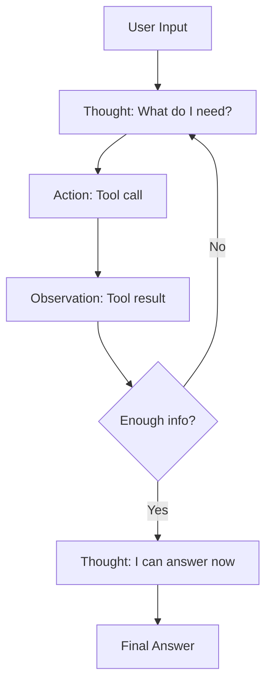
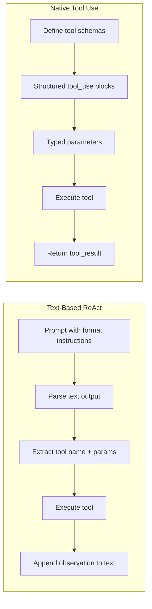
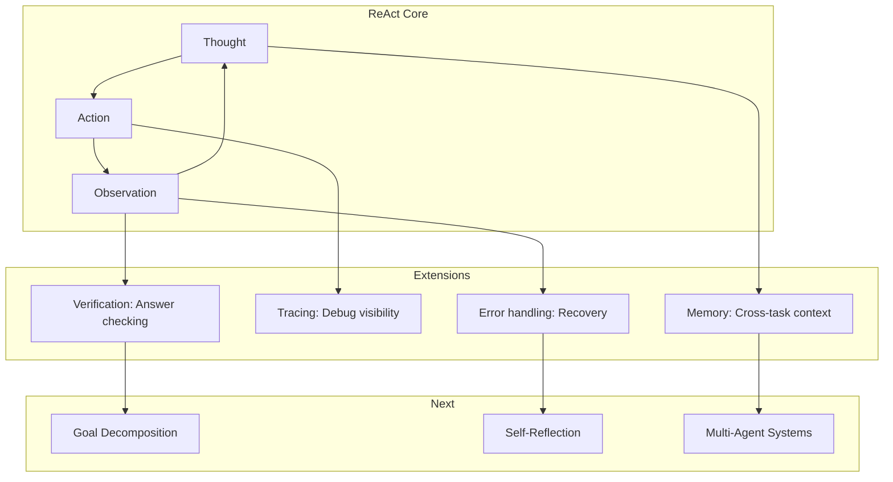

<!-- _class: lead -->

# The ReAct Pattern: Reasoning + Acting

**Module 04 — Planning & Reasoning**

> Think before you act, observe after you act. ReAct makes the agent's decision process explicit through "Thought" traces.

<!--
Speaker notes: Key talking points for this slide
- Transition slide: we are now moving into The ReAct Pattern: Reasoning + Acting
- Pause briefly to let the audience absorb the previous section
- Preview what is coming next in this section
-->
---

# The ReAct Loop



```
Thought: [What do I need to do? What information do I need?]
    ↓
Action: [Tool call with specific parameters]
    ↓
Observation: [Result from the tool]
    ↓
Thought: [What did I learn? What should I do next?]
    ↓
... (repeat until complete)
    ↓
Final Answer: [Response to user]
```

<!--
Speaker notes: Key talking points for this slide
- Walk through the diagram from left to right (or top to bottom)
- Explain each component and the connections between them
- Relate this architecture back to practical use cases
-->
---

# Basic ReAct Implementation

```python
REACT_SYSTEM_PROMPT = """You are a helpful assistant that thinks step by step.

When given a task, you should:
1. Think about what you need to do
2. Take an action using available tools
3. Observe the result
4. Repeat until you can provide a final answer

Format your response as:
Thought: <your reasoning about what to do next>
Action: <tool_name>(<parameters as JSON>)
```

<!--
Speaker notes: Key talking points for this slide
- Walk through the code example, focusing on the key pattern being demonstrated
- Highlight the most important lines and explain why they matter
- Point out any edge cases or production considerations
- This code is copy-paste ready for learners to try
-->
---

# Basic ReAct Implementation (continued)

```python
OR, if you have the final answer:
Thought: <your reasoning>
Final Answer: <your answer to the user>

Available tools:
- search(query): Search the web for information
- calculate(expression): Evaluate a mathematical expression
- get_weather(city): Get current weather for a city

Always think before acting. Always explain your reasoning."""
```

<!--
Speaker notes: Key talking points for this slide
- Continuation of the previous code block
- Walk through the remaining implementation details
- Highlight any key patterns or important lines
-->
---

# Parsing ReAct Responses

```python
def parse_react_response(response: str) -> dict:
    """Parse a ReAct-formatted response."""

    # Check for final answer
    if "Final Answer:" in response:
        thought = response.split("Final Answer:")[0].replace("Thought:", "").strip()
        answer = response.split("Final Answer:")[1].strip()
        return {"type": "final", "thought": thought, "answer": answer}

    # Parse thought and action
    thought_match = re.search(r"Thought:\s*(.+?)(?=Action:|$)", response, re.DOTALL)
    action_match = re.search(r"Action:\s*(\w+)\((.+?)\)", response)
```

<!--
Speaker notes: Key talking points for this slide
- Walk through the code example, focusing on the key pattern being demonstrated
- Highlight the most important lines and explain why they matter
- Point out any edge cases or production considerations
- This code is copy-paste ready for learners to try
-->
---

# Parsing ReAct Responses (continued)

```python
if thought_match and action_match:
        return {
            "type": "action",
            "thought": thought_match.group(1).strip(),
            "tool": action_match.group(1),
            "params": json.loads(action_match.group(2))
        }

    return {"type": "error", "raw": response}
```

<!--
Speaker notes: Key talking points for this slide
- Continuation of the previous code block
- Walk through the remaining implementation details
- Highlight any key patterns or important lines
-->
---

# The Agent Loop

```python
def run_react_agent(task: str, max_steps: int = 10) -> str:
    """Run a ReAct agent on a task."""
    messages = []
    history = f"Task: {task}\n\n"

    for step in range(max_steps):
        response = client.messages.create(
            model="claude-sonnet-4-6", max_tokens=1000,
            system=REACT_SYSTEM_PROMPT,
            messages=[{"role": "user", "content": history}])

        response_text = response.content[0].text
        history += response_text + "\n"
        parsed = parse_react_response(response_text)
```

<!--
Speaker notes: Key talking points for this slide
- Walk through the code example, focusing on the key pattern being demonstrated
- Highlight the most important lines and explain why they matter
- Point out any edge cases or production considerations
- This code is copy-paste ready for learners to try
-->
---

# The Agent Loop (continued)

```python
if parsed["type"] == "final":
            return parsed["answer"]
        elif parsed["type"] == "action":
            observation = execute_tool(parsed["tool"], parsed["params"])
            history += f"Observation: {observation}\n\n"
        else:
            return f"Agent error: Could not parse response"

    return "Max steps reached without final answer"
```

<!--
Speaker notes: Key talking points for this slide
- Continuation of the previous code block
- Walk through the remaining implementation details
- Highlight any key patterns or important lines
-->
---

<!-- _class: lead -->

# ReAct with Native Tool Use

<!--
Speaker notes: Key talking points for this slide
- Transition slide: we are now moving into ReAct with Native Tool Use
- Pause briefly to let the audience absorb the previous section
- Preview what is coming next in this section
-->
---

# Claude's Native Tool Calling

```python
class ReActAgent:
    """ReAct agent using Claude's native tool use."""

    def __init__(self, tools: list, max_steps: int = 10):
        self.client = anthropic.Anthropic()
        self.tools = tools
        self.max_steps = max_steps

    def run(self, task: str) -> str:
        messages = [{"role": "user", "content": task}]

        for step in range(self.max_steps):
            response = self.client.messages.create(
                model="claude-sonnet-4-6", max_tokens=2000,
                system=REACT_SYSTEM, tools=self.tools, messages=messages)
```

<!--
Speaker notes: Key talking points for this slide
- Walk through the code example, focusing on the key pattern being demonstrated
- Highlight the most important lines and explain why they matter
- Point out any edge cases or production considerations
- This code is copy-paste ready for learners to try
-->
---

# Claude's Native Tool Calling (continued)

```python
if response.stop_reason == "end_turn":
                return self._extract_text(response)

            messages.append({"role": "assistant", "content": response.content})
            tool_results = []
            for block in response.content:
                if block.type == "tool_use":
                    result = self.execute_tool(block.name, block.input)
                    tool_results.append({"type": "tool_result",
                        "tool_use_id": block.id, "content": result})
            messages.append({"role": "user", "content": tool_results})

        return "Max steps reached"
```

<!--
Speaker notes: Key talking points for this slide
- Continuation of the previous code block
- Walk through the remaining implementation details
- Highlight any key patterns or important lines
-->
---

# Text-Based vs Native Tool Use



| Aspect | Text-Based | Native Tool Use |
|--------|-----------|-----------------|
| Parsing | Regex/manual | Structured JSON |
| Reliability | Can break on format | Consistent |
| Tool schemas | In system prompt | JSON Schema |
| Best for | Prototyping | Production |

<!--
Speaker notes: Key talking points for this slide
- Walk through the diagram from left to right (or top to bottom)
- Explain each component and the connections between them
- Relate this architecture back to practical use cases
-->
---

<!-- _class: lead -->

# Execution Tracing

<!--
Speaker notes: Key talking points for this slide
- Transition slide: we are now moving into Execution Tracing
- Pause briefly to let the audience absorb the previous section
- Preview what is coming next in this section
-->
---

# Structured Trace Logging

```python
@dataclass
class ReActStep:
    step_number: int
    thought: str
    action: Optional[str] = None
    action_input: Optional[dict] = None
    observation: Optional[str] = None
    timestamp: datetime = field(default_factory=datetime.utcnow)

@dataclass
class ReActTrace:
    task: str
    steps: list[ReActStep] = field(default_factory=list)
    final_answer: Optional[str] = None
    success: bool = False
```

> 🔑 Traces are essential for debugging—they show you exactly why the agent made each decision.

<!--
Speaker notes: Key talking points for this slide
- Walk through the code example, focusing on the key pattern being demonstrated
- Highlight the most important lines and explain why they matter
- Point out any edge cases or production considerations
- This code is copy-paste ready for learners to try
-->
---

# Structured Trace Logging (continued)

```python
def to_markdown(self) -> str:
        md = f"# ReAct Trace\n\n**Task:** {self.task}\n\n"
        for step in self.steps:
            md += f"## Step {step.step_number}\n\n"
            md += f"**Thought:** {step.thought}\n\n"
            if step.action:
                md += f"**Action:** `{step.action}({step.action_input})`\n\n"
            if step.observation:
                md += f"**Observation:** {step.observation}\n\n"
        if self.final_answer:
            md += f"## Final Answer\n\n{self.final_answer}\n"
        return md
```

<!--
Speaker notes: Key talking points for this slide
- Continuation of the previous code block
- Walk through the remaining implementation details
- Highlight any key patterns or important lines
-->
---

# TracingReActAgent

```python
class TracingReActAgent(ReActAgent):
    """ReAct agent with full execution tracing."""

    def run(self, task: str) -> tuple[str, ReActTrace]:
        self.current_trace = ReActTrace(task=task)
        messages = [{"role": "user", "content": task}]
        step_num = 0

        for _ in range(self.max_steps):
            step_num += 1
            response = self.client.messages.create(
                model="claude-sonnet-4-6", max_tokens=2000,
                system=REACT_SYSTEM, tools=self.tools, messages=messages)
```

<!--
Speaker notes: Key talking points for this slide
- Walk through the code example, focusing on the key pattern being demonstrated
- Highlight the most important lines and explain why they matter
- Point out any edge cases or production considerations
- This code is copy-paste ready for learners to try
-->
---

# TracingReActAgent (continued)

```python
thought = self._extract_text(response)

            if response.stop_reason == "end_turn":
                self.current_trace.final_answer = thought
                self.current_trace.success = True
                self.current_trace.add_step(
                    ReActStep(step_number=step_num, thought=thought))
                return thought, self.current_trace
```

<!--
Speaker notes: Key talking points for this slide
- Continuation of the previous code block
- Walk through the remaining implementation details
- Highlight any key patterns or important lines
-->
---

# TracingReActAgent (continued)

```python
messages.append({"role": "assistant", "content": response.content})
            tool_results = []
            for block in response.content:
                if block.type == "tool_use":
                    result = self.execute_tool(block.name, block.input)
                    self.current_trace.add_step(ReActStep(
                        step_number=step_num, thought=thought,
                        action=block.name, action_input=block.input,
                        observation=result))
                    tool_results.append({"type": "tool_result",
                        "tool_use_id": block.id, "content": result})
            messages.append({"role": "user", "content": tool_results})

        return "Max steps reached", self.current_trace
```

<!--
Speaker notes: Key talking points for this slide
- Continuation of the previous code block
- Walk through the remaining implementation details
- Highlight any key patterns or important lines
-->
---

<!-- _class: lead -->

# Advanced ReAct Patterns

<!--
Speaker notes: Key talking points for this slide
- Transition slide: we are now moving into Advanced ReAct Patterns
- Pause briefly to let the audience absorb the previous section
- Preview what is coming next in this section
-->
---

# ReAct with Memory

```python
class ReActWithMemory(ReActAgent):
    """ReAct agent with working memory."""

    def __init__(self, *args, **kwargs):
        super().__init__(*args, **kwargs)
        self.memory = []

    def run(self, task: str) -> str:
        # Include relevant memories in context
        memory_context = ""
        if self.memory:
            memory_context = "Relevant past information:\n"
            memory_context += "\n".join(f"- {m}" for m in self.memory[-5:])
            memory_context += "\n\n"
```

<!--
Speaker notes: Key talking points for this slide
- Walk through the code block line by line, emphasizing the key pattern
- The diagram below shows the architecture/flow visually
- Point out how the code maps to the diagram components
- Highlight any production considerations or gotchas
-->
---

# ReAct with Memory (continued)

```python
augmented_task = f"{memory_context}Current task: {task}"
        result = super().run(augmented_task)

        # Store task and result in memory
        self.memory.append(f"Task: {task} -> Result: {result[:100]}...")
        return result
```

<!--
Speaker notes: Key talking points for this slide
- Continuation of the previous code block
- Walk through the remaining implementation details
- Highlight any key patterns or important lines
-->
---

# ReAct with Verification

```python
class VerifiedReActAgent(ReActAgent):
    """ReAct agent that verifies its answers."""

    def run(self, task: str) -> str:
        # First pass: solve the task
        initial_answer = super().run(task)

        # Verification pass
        verification_prompt = f"""I solved this task:
Task: {task}

My answer was: {initial_answer}

Please verify this answer:
1. Is the reasoning sound?
2. Did I use the tools correctly?
3. Is the answer complete?
```

> ✅ Verification catches errors before returning answers to users.

<!--
Speaker notes: Key talking points for this slide
- Walk through the code example, focusing on the key pattern being demonstrated
- Highlight the most important lines and explain why they matter
- Point out any edge cases or production considerations
- This code is copy-paste ready for learners to try
-->
---

# ReAct with Verification (continued)

```python
If there are issues, provide the corrected answer.
If the answer is correct, confirm it."""

        verification = self.client.messages.create(
            model="claude-sonnet-4-6", max_tokens=1000,
            messages=[{"role": "user", "content": verification_prompt}])

        verified_text = verification.content[0].text
        if "correct" in verified_text.lower() or "confirm" in verified_text.lower():
            return initial_answer
        else:
            return verified_text
```

<!--
Speaker notes: Key talking points for this slide
- Continuation of the previous code block
- Walk through the remaining implementation details
- Highlight any key patterns or important lines
-->
---

# ReAct Prompting Strategies

<div class="columns">
<div>

**Detailed reasoning instructions:**
```python
DETAILED_REACT_SYSTEM = """You are an
AI assistant that solves problems
systematically.

For each step:
1. THINK: State what you know, what
   you need, your strategy
2. ACT: Choose the most appropriate
   tool
3. OBSERVE: Analyze the result
4. REFLECT: Did this help? What next?
```

</div>
<div>

**Few-shot ReAct example:**
```python
"""
Task: What is the population of
the capital of Japan?

Thought: I need the capital of Japan
and its population. Tokyo is the
capital, so I just need its population.
Action: search({"query": "Tokyo
  population 2024"})
Observation: Tokyo has ~13.96 million
  in the city proper.

Thought: I found the population.
Final Answer: The population of Tokyo
is approximately 13.96 million people.
"""
```

</div>
</div>

<!--
Speaker notes: Key talking points for this slide
- Walk through the code example, focusing on the key pattern being demonstrated
- Highlight the most important lines and explain why they matter
- Point out any edge cases or production considerations
- This code is copy-paste ready for learners to try
-->
---

# ReAct Prompting Strategies (continued)

```python
Rules:
- Never skip the thinking step
- If a tool fails, try differently
- If uncertain, acknowledge it
- Break complex problems into steps
- Verify your answer before stating"""
```

<!--
Speaker notes: Key talking points for this slide
- Continuation of the previous code block
- Walk through the remaining implementation details
- Highlight any key patterns or important lines
-->
---

# Error Handling in ReAct

```python
class RobustReActAgent(ReActAgent):
    """ReAct agent with error handling and recovery."""

    def run(self, task: str) -> str:
        messages = [{"role": "user", "content": task}]
        consecutive_errors = 0
        max_errors = 3

        for step in range(self.max_steps):
            try:
                response = self.client.messages.create(
                    model="claude-sonnet-4-6", max_tokens=2000,
                    system=REACT_SYSTEM, tools=self.tools, messages=messages)
                consecutive_errors = 0  # Reset on success

                if response.stop_reason == "end_turn":
                    return self._extract_text(response)
```

> ⚠️ Always cap consecutive errors — infinite retries waste tokens and time.

<!--
Speaker notes: Key talking points for this slide
- Walk through the code example, focusing on the key pattern being demonstrated
- Highlight the most important lines and explain why they matter
- Point out any edge cases or production considerations
- This code is copy-paste ready for learners to try
-->
---

# Error Handling in ReAct (continued)

```python
messages.append({"role": "assistant", "content": response.content})
                tool_results = []
                for block in response.content:
                    if block.type == "tool_use":
                        try:
                            result = self.execute_tool(block.name, block.input)
                        except Exception as e:
                            result = f"Tool error: {e}. Try a different approach."
                        tool_results.append({"type": "tool_result",
                            "tool_use_id": block.id, "content": result})
                messages.append({"role": "user", "content": tool_results})

            except Exception as e:
                consecutive_errors += 1
                if consecutive_errors >= max_errors:
                    return f"Failed after {max_errors} consecutive errors: {e}"
```

<!--
Speaker notes: Key talking points for this slide
- Continuation of the previous code block
- Walk through the remaining implementation details
- Highlight any key patterns or important lines
-->
---

# Summary & Connections



**Key takeaways:**
- ReAct interleaves reasoning (Thought) with action (Tool use) and learning (Observation)
- Native tool use is more reliable than text-based parsing for production
- Execution traces are essential for debugging agent behavior
- Memory, verification, and error handling extend the basic pattern
- ReAct is the foundation for all advanced agent architectures

> *ReAct is the fundamental reasoning pattern for agentic AI. Master it, and you'll have the foundation for building agents that can tackle any complex task.*

<!--
Speaker notes: Key talking points for this slide
- Walk through the diagram from left to right (or top to bottom)
- Explain each component and the connections between them
- Relate this architecture back to practical use cases
-->