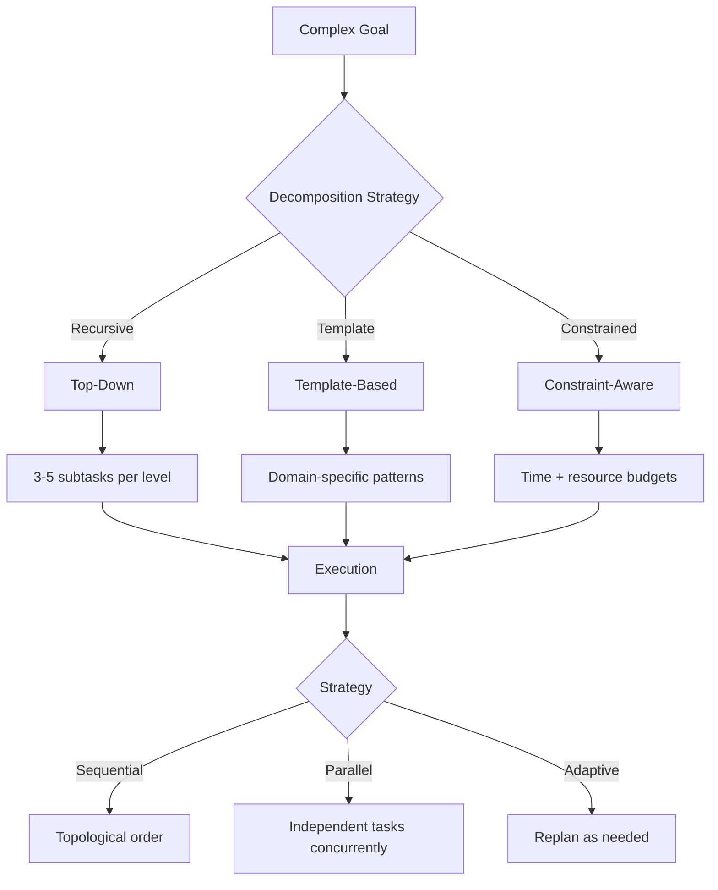
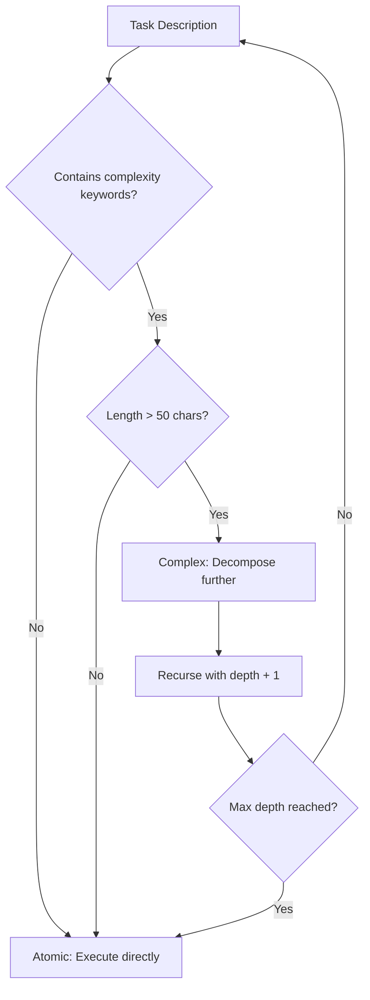
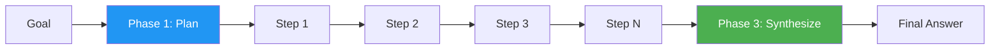
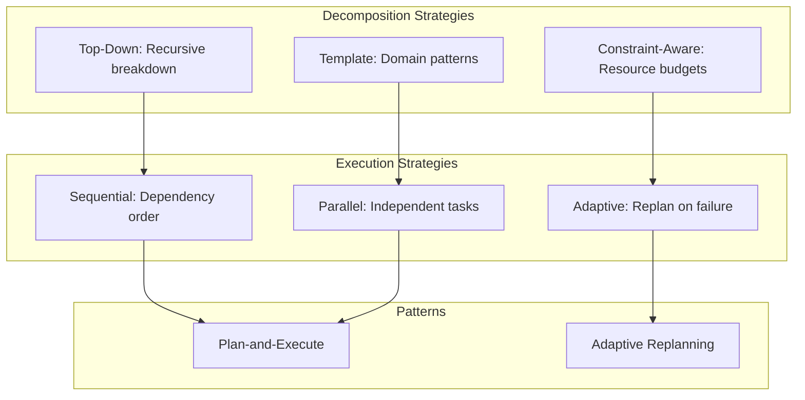

<!-- _class: lead -->

# Goal Decomposition: Breaking Complex Tasks into Steps

**Module 04 — Planning & Reasoning**

> Complex tasks fail when attempted atomically. Decomposition surfaces dependencies, enables parallel execution, and creates natural checkpoints.

<!--
Speaker notes: Key talking points for this slide
- Transition slide: we are now moving into Goal Decomposition: Breaking Complex Tasks into Steps
- Pause briefly to let the audience absorb the previous section
- Preview what is coming next in this section
-->
---

# Decomposition Overview



<!--
Speaker notes: Key talking points for this slide
- Walk through the diagram from left to right (or top to bottom)
- Explain each component and the connections between them
- Relate this architecture back to practical use cases
-->
---

<!-- _class: lead -->

# Decomposition Strategies

<!--
Speaker notes: Key talking points for this slide
- Transition slide: we are now moving into Decomposition Strategies
- Pause briefly to let the audience absorb the previous section
- Preview what is coming next in this section
-->
---

# 1. Top-Down Decomposition

```python
def decompose_goal(goal: str, max_depth: int = 3, current_depth: int = 0) -> dict:
    """Recursively decompose a goal into subtasks."""

    prompt = f"""Break down this goal into 3-5 concrete subtasks.
Each subtask should be:
- Specific and actionable
- Completable independently
- Ordered by dependency (prerequisites first)

Goal: {goal}

Respond in JSON format:
{{
    "subtasks": [
        {{"id": 1, "description": "...", "depends_on": []}},
        {{"id": 2, "description": "...", "depends_on": [1]}},
    ]
}}"""
```

<!--
Speaker notes: Key talking points for this slide
- Walk through the code example, focusing on the key pattern being demonstrated
- Highlight the most important lines and explain why they matter
- Point out any edge cases or production considerations
- This code is copy-paste ready for learners to try
-->
---

# 1. Top-Down Decomposition (continued)

```python
response = client.messages.create(
        model="claude-sonnet-4-6", max_tokens=1000,
        messages=[{"role": "user", "content": prompt}])
    result = json.loads(response.content[0].text)

    # Recursively decompose if subtasks are still complex
    if current_depth < max_depth:
        for subtask in result["subtasks"]:
            if needs_decomposition(subtask["description"]):
                subtask["subtasks"] = decompose_goal(
                    subtask["description"], max_depth, current_depth + 1
                )["subtasks"]
    return result
```

<!--
Speaker notes: Key talking points for this slide
- Continuation of the previous code block
- Walk through the remaining implementation details
- Highlight any key patterns or important lines
-->
---

# Complexity Detection

```python
def needs_decomposition(task: str) -> bool:
    """Heuristic: task needs decomposition if it's complex."""
    complexity_indicators = [
        "implement", "build", "create", "develop",
        "analyze", "optimize", "integrate", "migrate"
    ]
    return any(ind in task.lower() for ind in complexity_indicators) and len(task) > 50
```



> 🔑 Right-size decomposition: not too granular (overhead), not too coarse (complexity).

<!--
Speaker notes: Key talking points for this slide
- Walk through the code block line by line, emphasizing the key pattern
- The diagram below shows the architecture/flow visually
- Point out how the code maps to the diagram components
- Highlight any production considerations or gotchas
-->
---

# 2. Template-Based Decomposition

<div class="columns">
<div>

```python
DECOMPOSITION_TEMPLATES = {
    "data_pipeline": [
        "Define data sources and schemas",
        "Set up ingestion connectors",
        "Implement transformation logic",
        "Create data validation rules",
        "Set up destination/storage",
        "Implement error handling",
        "Add monitoring and alerting",
        "Write documentation"
    ],
    "api_endpoint": [
        "Define request/response schemas",
        "Implement business logic",
        "Add input validation",
```

</div>
<div>

```python
def decompose_with_template(goal: str):
    """Match goal to template."""
    # Classify the task
    prompt = f"""Classify this task:
- data_pipeline
- api_endpoint
- bug_fix
- other

Task: {goal}
Category:"""

    response = client.messages.create(
        model="claude-haiku-4-5",
        max_tokens=50,
        messages=[{"role": "user",
            "content": prompt}])
```

</div>
</div>

<!--
Speaker notes: Key talking points for this slide
- Walk through the code example, focusing on the key pattern being demonstrated
- Highlight the most important lines and explain why they matter
- Point out any edge cases or production considerations
- This code is copy-paste ready for learners to try
-->
---

# 2. Template-Based Decomposition (continued)

```python
category = response.content[0]\
        .text.strip().lower()

    if category in DECOMPOSITION_TEMPLATES:
        template = DECOMPOSITION_TEMPLATES[
            category]
        return customize_template(
            template, goal)
    else:
        return decompose_goal(goal)[
            "subtasks"]
```

<!--
Speaker notes: Key talking points for this slide
- Continuation of the previous code block
- Walk through the remaining implementation details
- Highlight any key patterns or important lines
-->
---

# 2. Template-Based Decomposition (continued)

```python
"Implement error handling",
        "Add authentication",
        "Write tests",
        "Add API documentation"
    ],
    "bug_fix": [
        "Reproduce the bug",
        "Identify root cause",
        "Implement fix",
        "Write regression test",
        "Verify fix in staging",
        "Document the change"
    ]
}
```

<!--
Speaker notes: Key talking points for this slide
- Continuation of the previous code block
- Walk through the remaining implementation details
- Highlight any key patterns or important lines
-->
---

# 3. Constraint-Aware Decomposition

```python
@dataclass
class Task:
    id: str
    description: str
    estimated_time: Optional[int] = None  # minutes
    requires_tools: list[str] = None
    depends_on: list[str] = None
    priority: int = 1
```

<!--
Speaker notes: Key talking points for this slide
- Walk through the code example, focusing on the key pattern being demonstrated
- Highlight the most important lines and explain why they matter
- Point out any edge cases or production considerations
- This code is copy-paste ready for learners to try
-->
---

# 3. Constraint-Aware Decomposition (continued)

```python
def decompose_with_constraints(
    goal: str, available_tools: list[str], time_budget: int
) -> list[Task]:
    """Decompose goal considering available resources."""
    prompt = f"""Break down this goal into tasks, considering:
- Available tools: {', '.join(available_tools)}
- Total time budget: {time_budget} minutes

For each task, specify: description, estimated_time, requires_tools,
depends_on, priority (1=highest, 5=lowest)
```

<!--
Speaker notes: Key talking points for this slide
- Continuation of the previous code block
- Walk through the remaining implementation details
- Highlight any key patterns or important lines
-->
---

# 3. Constraint-Aware Decomposition (continued)

```python
Goal: {goal}"""

    tasks_data = json.loads(response.content[0].text)

    # Validate time budget - drop low-priority tasks if over budget
    total_time = sum(t["estimated_time"] for t in tasks_data)
    if total_time > time_budget:
        tasks_data.sort(key=lambda t: t["priority"])
        filtered, running_time = [], 0
        for t in tasks_data:
            if running_time + t["estimated_time"] <= time_budget:
                filtered.append(t)
                running_time += t["estimated_time"]
        tasks_data = filtered

    return [Task(**t) for t in tasks_data]
```

<!--
Speaker notes: Key talking points for this slide
- Continuation of the previous code block
- Walk through the remaining implementation details
- Highlight any key patterns or important lines
-->
---

<!-- _class: lead -->

# Execution Strategies

<!--
Speaker notes: Key talking points for this slide
- Transition slide: we are now moving into Execution Strategies
- Pause briefly to let the audience absorb the previous section
- Preview what is coming next in this section
-->
---

# Sequential Execution

```python
class SequentialExecutor:
    """Execute tasks in dependency order."""

    def __init__(self, agent):
        self.agent = agent
        self.completed = {}

    def execute(self, tasks: list[Task]) -> dict:
        ordered = self._topological_sort(tasks)
        results = {}

        for task in ordered:
            for dep_id in task.depends_on or []:
                if dep_id not in self.completed:
                    raise ValueError(f"Dependency {dep_id} not completed")
```

<!--
Speaker notes: Key talking points for this slide
- Walk through the code block line by line, emphasizing the key pattern
- The diagram below shows the architecture/flow visually
- Point out how the code maps to the diagram components
- Highlight any production considerations or gotchas
-->
---

# Sequential Execution (continued)

```python
context = {dep_id: self.completed[dep_id]
                       for dep_id in (task.depends_on or [])}
            result = self.agent.run(
                f"Complete this task: {task.description}\n\n"
                f"Context from previous tasks: {context}")
            results[task.id] = result
            self.completed[task.id] = result

        return results
```

<!--
Speaker notes: Key talking points for this slide
- Continuation of the previous code block
- Walk through the remaining implementation details
- Highlight any key patterns or important lines
-->
---

# Topological Sort for Dependencies

```python
def _topological_sort(self, tasks: list[Task]) -> list[Task]:
    """Sort tasks by dependencies."""
    task_map = {t.id: t for t in tasks}
    visited = set()
    ordered = []

    def visit(task_id):
        if task_id in visited:
            return
        visited.add(task_id)
```

<!--
Speaker notes: Key talking points for this slide
- Walk through the code block line by line, emphasizing the key pattern
- The diagram below shows the architecture/flow visually
- Point out how the code maps to the diagram components
- Highlight any production considerations or gotchas
-->
---

# Topological Sort for Dependencies (continued)

```python
task = task_map[task_id]
        for dep in task.depends_on or []:
            visit(dep)
        ordered.append(task)

    for task in tasks:
        visit(task.id)

    return ordered
```

<!--
Speaker notes: Key talking points for this slide
- Continuation of the previous code block
- Walk through the remaining implementation details
- Highlight any key patterns or important lines
-->
---

# Parallel Execution

```python
class ParallelExecutor:
    """Execute independent tasks in parallel."""

    def __init__(self, agent, max_workers: int = 4):
        self.agent = agent
        self.max_workers = max_workers
        self.completed = {}

    async def execute(self, tasks: list[Task]) -> dict:
        remaining = {t.id: t for t in tasks}
        results = {}

        while remaining:
            # Find ready tasks (all dependencies met)
            ready = [t for t in remaining.values()
                     if all(d in self.completed for d in (t.depends_on or []))]
```

<!--
Speaker notes: Key talking points for this slide
- Walk through the code example, focusing on the key pattern being demonstrated
- Highlight the most important lines and explain why they matter
- Point out any edge cases or production considerations
- This code is copy-paste ready for learners to try
-->
---

# Parallel Execution (continued)

```python
if not ready:
                if remaining:
                    raise ValueError("Circular dependency detected")
                break

            # Execute ready tasks in parallel
            with ThreadPoolExecutor(max_workers=self.max_workers) as executor:
                loop = asyncio.get_event_loop()
                futures = [loop.run_in_executor(executor, self._execute_task, task)
                           for task in ready]
                task_results = await asyncio.gather(*futures)

            for task, result in zip(ready, task_results):
                results[task.id] = result
                self.completed[task.id] = result
                del remaining[task.id]

        return results
```

<!--
Speaker notes: Key talking points for this slide
- Continuation of the previous code block
- Walk through the remaining implementation details
- Highlight any key patterns or important lines
-->
---

<!-- _class: lead -->

# Plan-and-Execute Pattern

<!--
Speaker notes: Key talking points for this slide
- Transition slide: we are now moving into Plan-and-Execute Pattern
- Pause briefly to let the audience absorb the previous section
- Preview what is coming next in this section
-->
---

# Create Plan, Then Execute

```python
class PlanAndExecuteAgent:
    """Agent that creates a full plan before execution."""

    def __init__(self, planner_model: str, executor_model: str):
        self.client = anthropic.Anthropic()
        self.planner_model = planner_model
        self.executor_model = executor_model

    def run(self, goal: str) -> str:
        plan = self._create_plan(goal)       # Phase 1: Planning
        results = []
        for step in plan:                     # Phase 2: Execution
            result = self._execute_step(step, results)
            results.append({"step": step, "result": result})
        return self._synthesize(goal, results)  # Phase 3: Synthesize
```



<!--
Speaker notes: Key talking points for this slide
- Walk through the code block line by line, emphasizing the key pattern
- The diagram below shows the architecture/flow visually
- Point out how the code maps to the diagram components
- Highlight any production considerations or gotchas
-->
---

# Planning Phase

```python
def _create_plan(self, goal: str) -> list[str]:
    """Create a complete plan for the goal."""
    prompt = f"""Create a step-by-step plan to achieve this goal:
{goal}

Requirements:
- Each step should be concrete and actionable
- Steps should be in execution order
- Include validation/verification steps
- Be comprehensive but not excessive

Return steps as a numbered list."""

    response = self.client.messages.create(
        model=self.planner_model, max_tokens=1000,
        messages=[{"role": "user", "content": prompt}])

    steps = re.findall(r'\d+\.\s*(.+)', response.content[0].text)
    return steps
```

> ✅ Include validation steps in the plan to catch errors early.

<!--
Speaker notes: Key talking points for this slide
- Walk through the code example, focusing on the key pattern being demonstrated
- Highlight the most important lines and explain why they matter
- Point out any edge cases or production considerations
- This code is copy-paste ready for learners to try
-->
---

# Adaptive Replanning

```python
class AdaptivePlanAgent:
    """Agent that replans when execution diverges from expectations."""

    def run(self, goal: str) -> str:
        plan = self._create_plan(goal)
        results = []
        step_idx, replan_count, max_replans = 0, 0, 3

        while step_idx < len(plan) and replan_count < max_replans:
            step = plan[step_idx]
            result = self._execute_step(step, results)
            results.append({"step": step, "result": result})
```

<!--
Speaker notes: Key talking points for this slide
- Walk through the code block line by line, emphasizing the key pattern
- The diagram below shows the architecture/flow visually
- Point out how the code maps to the diagram components
- Highlight any production considerations or gotchas
-->
---

# Adaptive Replanning (continued)

```python
evaluation = self._evaluate_progress(goal, plan, results)

            if evaluation["on_track"]:
                step_idx += 1
            else:
                remaining_goal = self._extract_remaining_goal(goal, results)
                plan = self._create_plan(remaining_goal)
                step_idx = 0
                replan_count += 1

        return self._synthesize(goal, results)
```

<!--
Speaker notes: Key talking points for this slide
- Continuation of the previous code block
- Walk through the remaining implementation details
- Highlight any key patterns or important lines
-->
---

# Progress Evaluation

```python
def _evaluate_progress(self, goal, plan, results) -> dict:
    """Evaluate if execution is on track."""
    prompt = f"""Goal: {goal}
Original plan: {plan}
Execution so far: {results}

Evaluate:
1. Are we making progress toward the goal?
2. Is the remaining plan still valid?
3. Do we need to adjust our approach?

Respond with JSON:
{{"on_track": true/false, "reason": "...", "suggestion": "..."}}"""

    response = self.client.messages.create(
        model="claude-haiku-4-5", max_tokens=200,
        messages=[{"role": "user", "content": prompt}])
    return json.loads(response.content[0].text)
```

> ⚠️ Use a fast, cheap model (Haiku) for evaluation — it runs after every step.

<!--
Speaker notes: Key talking points for this slide
- Walk through the code example, focusing on the key pattern being demonstrated
- Highlight the most important lines and explain why they matter
- Point out any edge cases or production considerations
- This code is copy-paste ready for learners to try
-->
---

# Best Practices

| Practice | Why |
|----------|-----|
| **Right-size decomposition** | 3-7 subtasks per level; too granular = overhead, too coarse = complexity |
| **Explicit dependencies** | Make task relationships clear for execution ordering |
| **Include validation steps** | Catch errors early, before downstream tasks build on them |
| **Create checkpoints** | Natural save points for recovery from failures |
| **Plan for failure** | Each step should have a fallback or error handling strategy |
| **Log execution** | Track progress for debugging and replanning |
| **Replan adaptively** | Short planning horizons (2-3 steps) beat long brittle plans |

<!--
Speaker notes: Key talking points for this slide
- Explain the core concept on this slide clearly and concisely
- Relate it back to practical agent building scenarios
- Highlight any common pitfalls or misconceptions
- Connect to what was covered previously and what comes next
-->
---

# Summary & Connections



**Key takeaways:**
- Top-down decomposition recursively breaks goals into 3-5 subtasks
- Template-based decomposition leverages domain knowledge
- Constraint-aware decomposition respects time and tool budgets
- Topological sort ensures correct execution order
- Parallel execution speeds up independent tasks
- Adaptive replanning handles unexpected results gracefully

> *Goal decomposition transforms ambitious objectives into achievable task sequences.*

<!--
Speaker notes: Key talking points for this slide
- Walk through the diagram from left to right (or top to bottom)
- Explain each component and the connections between them
- Relate this architecture back to practical use cases
-->