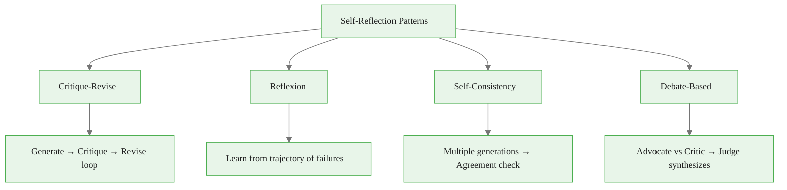
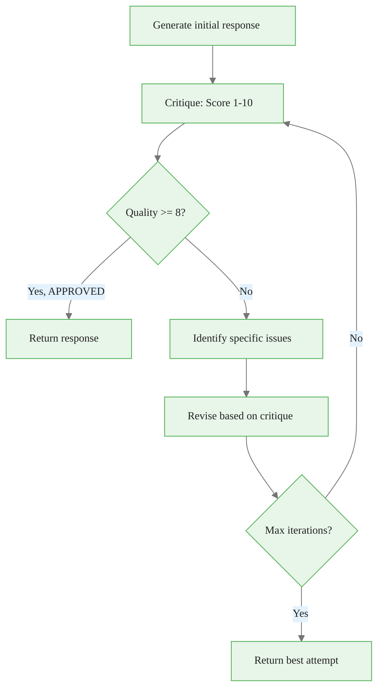
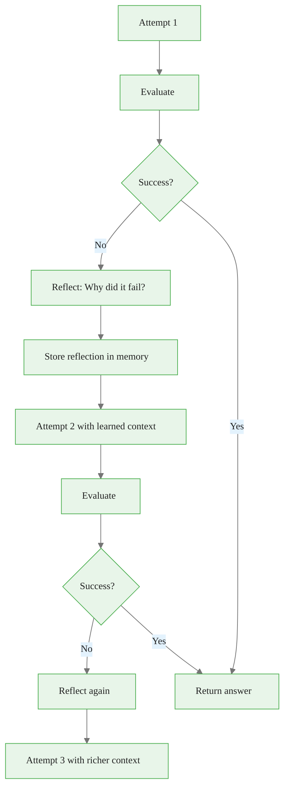
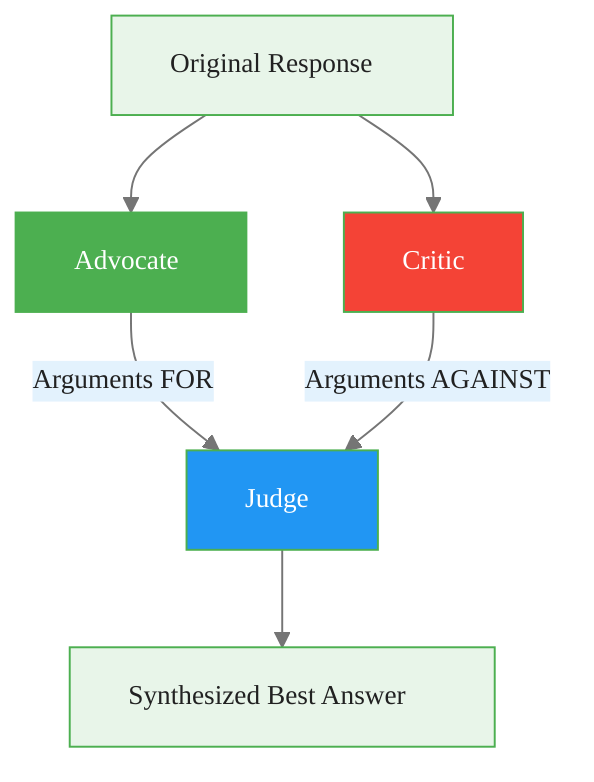
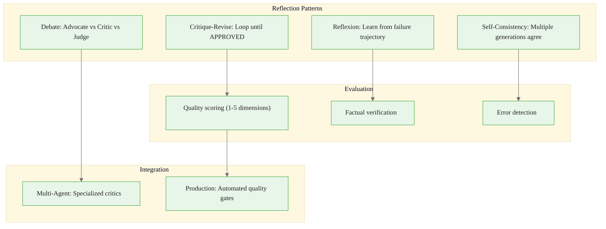

<!-- _class: lead -->

# Self-Reflection: Agents That Learn from Mistakes

**Module 04 — Planning & Reasoning**

> The first answer is rarely the best. Reflection adds a meta-cognitive layer — the agent asks "Is this good? What could be better?"

<!--
Speaker notes: Key talking points for this slide
- Transition slide: we are now moving into Self-Reflection: Agents That Learn from Mistakes
- Pause briefly to let the audience absorb the previous section
- Preview what is coming next in this section
-->
---

# Reflection Patterns Overview



<div class="callout-key">

**Key Point:** Reflection catches errors, improves reasoning, and produces more reliable outputs.

</div>

<!--
Speaker notes: Key talking points for this slide
- Walk through the diagram from left to right (or top to bottom)
- Explain each component and the connections between them
- Relate this architecture back to practical use cases
-->
---

<!-- _class: lead -->

# Core Reflection Patterns

<!--
Speaker notes: Key talking points for this slide
- Transition slide: we are now moving into Core Reflection Patterns
- Pause briefly to let the audience absorb the previous section
- Preview what is coming next in this section
-->
---

# Basic Critique-Revise Loop

<div class="code-window">
<div class="code-header">
<div class="dots"><span class="dot-red"></span><span class="dot-yellow"></span><span class="dot-green"></span></div>
<span class="filename">agent.py</span>
</div>
<div class="code-body">

```python
def reflect_and_revise(task: str, max_iterations: int = 3) -> str:
    """Generate, critique, and revise until satisfactory."""
    response = generate(task)  # Initial generation

    for i in range(max_iterations):
        critique = client.messages.create(
            model="claude-sonnet-4-6", max_tokens=500,
            messages=[{"role": "user",
                "content": f"""Critique this response. Identify:
1. Errors or inaccuracies
2. Missing information
3. Areas that could be clearer
4. Overall quality (1-10)
```

</div>
</div>

<!--
Speaker notes: Key talking points for this slide
- Walk through the code example, focusing on the key pattern being demonstrated
- Highlight the most important lines and explain why they matter
- Point out any edge cases or production considerations
- This code is copy-paste ready for learners to try
-->
---

# Basic Critique-Revise Loop (continued)

<div class="code-window">
<div class="code-header">
<div class="dots"><span class="dot-red"></span><span class="dot-yellow"></span><span class="dot-green"></span></div>
<span class="filename">agent.py</span>
</div>
<div class="code-body">

```python
Task: {task}
Response: {response}

If quality >= 8 and no major issues, say "APPROVED".
Otherwise, list specific improvements needed."""}])
```

</div>
</div>

<!--
Speaker notes: Key talking points for this slide
- Continuation of the previous code block
- Walk through the remaining implementation details
- Highlight any key patterns or important lines
-->
---

# Basic Critique-Revise Loop (continued)

<div class="code-window">
<div class="code-header">
<div class="dots"><span class="dot-red"></span><span class="dot-yellow"></span><span class="dot-green"></span></div>
<span class="filename">agent.py</span>
</div>
<div class="code-body">

```python
critique_text = critique.content[0].text
        if "APPROVED" in critique_text:
            return response

        # Revise based on critique
        response = client.messages.create(
            model="claude-sonnet-4-6", max_tokens=1000,
            messages=[{"role": "user",
                "content": f"""Revise this response based on the critique.
Original task: {task}
Original response: {response}
Critique: {critique_text}
Provide an improved response:"""}]).content[0].text

    return response
```

</div>
</div>

<!--
Speaker notes: Key talking points for this slide
- Continuation of the previous code block
- Walk through the remaining implementation details
- Highlight any key patterns or important lines
-->
---

# Critique-Revise Flow



| Iteration | What happens | Token cost |
|-----------|-------------|------------|
| 0 | Initial generation | ~500 tokens |
| 1 | Critique + Revise | ~1000 tokens |
| 2 | Critique + Revise | ~1000 tokens |
| 3 | Critique (APPROVED) | ~500 tokens |

<div class="callout-warning">

**Warning:** 2-3 reflection rounds usually suffice — diminishing returns after that.

</div>

<!--
Speaker notes: Key talking points for this slide
- Walk through the diagram from left to right (or top to bottom)
- Explain each component and the connections between them
- Relate this architecture back to practical use cases
-->
---

# Reflexion Pattern

<div class="code-window">
<div class="code-header">
<div class="dots"><span class="dot-red"></span><span class="dot-yellow"></span><span class="dot-green"></span></div>
<span class="filename">agent.py</span>
</div>
<div class="code-body">

```python
class ReflexionAgent:
    """Agent that learns from failed attempts."""

    def __init__(self):
        self.memory = []  # Past attempts and reflections

    def run(self, task: str, max_attempts: int = 3) -> str:
        for attempt in range(max_attempts):
            context = self._build_context()
            response = self._generate(task, context)
            evaluation = self._evaluate(task, response)

            if evaluation["success"]:
                return response
```

</div>
</div>

<!--
Speaker notes: Key talking points for this slide
- Walk through the code example, focusing on the key pattern being demonstrated
- Highlight the most important lines and explain why they matter
- Point out any edge cases or production considerations
- This code is copy-paste ready for learners to try
-->
---

# Reflexion Pattern (continued)

<div class="code-window">
<div class="code-header">
<div class="dots"><span class="dot-red"></span><span class="dot-yellow"></span><span class="dot-green"></span></div>
<span class="filename">agent.py</span>
</div>
<div class="code-body">

```python
# Reflect on failure
            reflection = self._reflect(task, response, evaluation)
            self.memory.append({
                "attempt": attempt,
                "response": response,
                "evaluation": evaluation,
                "reflection": reflection
            })

        return response  # Return best attempt
```

</div>
</div>

<!--
Speaker notes: Key talking points for this slide
- Continuation of the previous code block
- Walk through the remaining implementation details
- Highlight any key patterns or important lines
-->
---

# Reflexion Pattern (continued) (continued)

<div class="code-window">
<div class="code-header">
<div class="dots"><span class="dot-red"></span><span class="dot-yellow"></span><span class="dot-green"></span></div>
<span class="filename">agent.py</span>
</div>
<div class="code-body">

```python
def _build_context(self) -> str:
        if not self.memory:
            return ""
        context = "Previous attempts and learnings:\n"
        for m in self.memory[-3:]:
            context += f"\nAttempt {m['attempt']}:\n"
            context += f"Response: {m['response'][:200]}...\n"
            context += f"Reflection: {m['reflection']}\n"
        return context
```

</div>
</div>

<!--
Speaker notes: Key talking points for this slide
- Continuation of the previous code block
- Walk through the remaining implementation details
- Highlight any key patterns or important lines
-->
---

# Reflexion: Learning from Trajectory



<div class="code-window">
<div class="code-header">
<div class="dots"><span class="dot-red"></span><span class="dot-yellow"></span><span class="dot-green"></span></div>
<span class="filename">agent.py</span>
</div>
<div class="code-body">

```python
def _reflect(self, task: str, response: str, evaluation: dict) -> str:
    """Generate reflection on why the attempt failed."""
    prompt = f"""The following attempt failed. Reflect on why and how to improve.

Task: {task}
Attempt: {response}
Evaluation: {evaluation}

Reflection (be specific about what went wrong and how to fix it):"""

    return client.messages.create(
        model="claude-sonnet-4-6", max_tokens=300,
        messages=[{"role": "user", "content": prompt}]).content[0].text
```

</div>
</div>

<!--
Speaker notes: Key talking points for this slide
- Walk through the code block line by line, emphasizing the key pattern
- The diagram below shows the architecture/flow visually
- Point out how the code maps to the diagram components
- Highlight any production considerations or gotchas
-->
---

<!-- _class: lead -->

# Evaluation Strategies

<!--
Speaker notes: Key talking points for this slide
- Transition slide: we are now moving into Evaluation Strategies
- Pause briefly to let the audience absorb the previous section
- Preview what is coming next in this section
-->
---

# Self-Consistency Check

<div class="code-window">
<div class="code-header">
<div class="dots"><span class="dot-red"></span><span class="dot-yellow"></span><span class="dot-green"></span></div>
<span class="filename">agent.py</span>
</div>
<div class="code-body">

```python
def check_consistency(task: str, response: str, n_checks: int = 3) -> dict:
    """Verify response consistency across multiple generations."""

    alternatives = []
    for _ in range(n_checks):
        alt = client.messages.create(
            model="claude-sonnet-4-6", max_tokens=500,
            temperature=0.7,
            messages=[{"role": "user", "content": task}]).content[0].text
        alternatives.append(alt)

    # Check if responses agree
    agreement_prompt = f"""Compare these responses and determine if they agree.
Response 1: {response}
Response 2: {alternatives[0]}
Response 3: {alternatives[1]}
```

</div>
</div>

<div class="callout-key">

**Key Point:** Inconsistency signals uncertainty — investigate disagreements before trusting the answer.

</div>

<!--
Speaker notes: Key talking points for this slide
- Walk through the code example, focusing on the key pattern being demonstrated
- Highlight the most important lines and explain why they matter
- Point out any edge cases or production considerations
- This code is copy-paste ready for learners to try
-->
---

# Self-Consistency Check (continued)

<div class="code-window">
<div class="code-header">
<div class="dots"><span class="dot-red"></span><span class="dot-yellow"></span><span class="dot-green"></span></div>
<span class="filename">agent.py</span>
</div>
<div class="code-body">

```python
Do they reach the same conclusion? (YES/NO)
If NO, what are the disagreements?"""

    check = client.messages.create(
        model="claude-sonnet-4-6", max_tokens=200,
        messages=[{"role": "user", "content": agreement_prompt}]).content[0].text

    return {
        "consistent": "YES" in check.upper(),
        "analysis": check,
        "alternatives": alternatives
    }
```

</div>
</div>

<!--
Speaker notes: Key talking points for this slide
- Continuation of the previous code block
- Walk through the remaining implementation details
- Highlight any key patterns or important lines
-->
---

# Factual Verification

<div class="code-window">
<div class="code-header">
<div class="dots"><span class="dot-red"></span><span class="dot-yellow"></span><span class="dot-green"></span></div>
<span class="filename">agent.py</span>
</div>
<div class="code-body">

```python
def verify_facts(response: str, tools: list) -> dict:
    """Extract and verify factual claims in response."""

    # Extract claims
    extraction = client.messages.create(
        model="claude-sonnet-4-6", max_tokens=500,
        messages=[{"role": "user",
            "content": f"Extract all factual claims from this response.\n"
                       f"Return as a JSON list.\nResponse: {response}"}]
    ).content[0].text

    claims = json.loads(extraction)
```

</div>
</div>

<!--
Speaker notes: Key talking points for this slide
- Walk through the code example, focusing on the key pattern being demonstrated
- Highlight the most important lines and explain why they matter
- Point out any edge cases or production considerations
- This code is copy-paste ready for learners to try
-->
---

# Factual Verification (continued)

<div class="code-window">
<div class="code-header">
<div class="dots"><span class="dot-red"></span><span class="dot-yellow"></span><span class="dot-green"></span></div>
<span class="filename">agent.py</span>
</div>
<div class="code-body">

```python
# Verify each claim
    verified = []
    for claim in claims:
        result = search_tool(claim)
        verification = client.messages.create(
            model="claude-haiku-4-5", max_tokens=100,
            messages=[{"role": "user",
                "content": f"Does this evidence support the claim?\n"
                           f"Claim: {claim}\nEvidence: {result}\n"
                           f"Answer YES or NO with brief reason."}]
        ).content[0].text

        verified.append({"claim": claim, "evidence": result,
                         "verified": "YES" in verification.upper()})

    return {"claims": verified,
            "all_verified": all(v["verified"] for v in verified)}
```

</div>
</div>

<!--
Speaker notes: Key talking points for this slide
- Continuation of the previous code block
- Walk through the remaining implementation details
- Highlight any key patterns or important lines
-->
---

# Reflection Prompts

<div class="columns">
<div>

**Quality Critique:**
<div class="code-window">
<div class="code-header">
<div class="dots"><span class="dot-red"></span><span class="dot-yellow"></span><span class="dot-green"></span></div>
<span class="filename">agent.py</span>
</div>
<div class="code-body">

```python
QUALITY_CRITIQUE = """Evaluate on:

1. ACCURACY (1-5): All facts correct?
2. COMPLETENESS (1-5): Fully addresses
   the question?
3. CLARITY (1-5): Easy to understand?
4. RELEVANCE (1-5): Stays on topic?
5. REASONING (1-5): Logic sound?

Response to evaluate:
{response}

Provide scores and specific issues
for any dimension below 4."""
```

</div>
</div>

</div>
<div>

**Error Detection:**
```python
ERROR_DETECTION = """Analyze for errors:

Response: {response}

Check for:
1. Logical contradictions
2. Factual inaccuracies
3. Unsupported claims
4. Missing considerations
5. Ambiguous statements

List each error with location
and severity (HIGH/MEDIUM/LOW)."""
```

**Improvement Suggestions:**
```python
IMPROVEMENT = """How to improve?

1. What should be added?
2. What should be removed?
3. What should be rephrased?
4. Structure changes needed?

Be concrete and actionable."""
```

</div>
</div>

<!--
Speaker notes: Key talking points for this slide
- Walk through the code example, focusing on the key pattern being demonstrated
- Highlight the most important lines and explain why they matter
- Point out any edge cases or production considerations
- This code is copy-paste ready for learners to try
-->
---

<!-- _class: lead -->

# Multi-Agent Reflection

<!--
Speaker notes: Key talking points for this slide
- Transition slide: we are now moving into Multi-Agent Reflection
- Pause briefly to let the audience absorb the previous section
- Preview what is coming next in this section
-->
---

# Critic Agent

<div class="code-window">
<div class="code-header">
<div class="dots"><span class="dot-red"></span><span class="dot-yellow"></span><span class="dot-green"></span></div>
<span class="filename">agent.py</span>
</div>
<div class="code-body">

```python
class CriticAgent:
    """Specialized agent for critiquing responses."""

    SYSTEM = """You are a critical reviewer. Your job is to find flaws,
    errors, and areas for improvement. Be thorough but fair.
    Do not suggest improvements unless there are genuine issues."""

    def critique(self, task: str, response: str) -> dict:
        result = client.messages.create(
            model="claude-sonnet-4-6", max_tokens=500,
            system=self.SYSTEM,
            messages=[{"role": "user",
                "content": f"Task: {task}\n\nResponse to critique:\n{response}"}])
        return self._parse_critique(result.content[0].text)
```

</div>
</div>

<!--
Speaker notes: Key talking points for this slide
- Walk through the code block line by line, emphasizing the key pattern
- The diagram below shows the architecture/flow visually
- Point out how the code maps to the diagram components
- Highlight any production considerations or gotchas
-->
---

# Critic Agent (continued)

<div class="code-window">
<div class="code-header">
<div class="dots"><span class="dot-red"></span><span class="dot-yellow"></span><span class="dot-green"></span></div>
<span class="filename">agent.py</span>
</div>
<div class="code-body">

```python
def _parse_critique(self, text: str) -> dict:
        return {
            "raw": text,
            "has_issues": "no issues" not in text.lower(),
            "severity": self._assess_severity(text)
        }
```

</div>
</div>

<!--
Speaker notes: Key talking points for this slide
- Continuation of the previous code block
- Walk through the remaining implementation details
- Highlight any key patterns or important lines
-->
---

# Debate-Based Reflection

<div class="code-window">
<div class="code-header">
<div class="dots"><span class="dot-red"></span><span class="dot-yellow"></span><span class="dot-green"></span></div>
<span class="filename">agent.py</span>
</div>
<div class="code-body">

```python
def reflect_through_debate(task: str, response: str) -> str:
    """Use adversarial debate for reflection."""

    # Advocate argues response is correct
    advocate = client.messages.create(
        model="claude-sonnet-4-6", max_tokens=300,
        messages=[{"role": "user",
            "content": f"Argue why this response is correct.\n"
                       f"Task: {task}\nResponse: {response}"}]).content[0].text

    # Critic argues response has problems
    critic = client.messages.create(
        model="claude-sonnet-4-6", max_tokens=300,
        messages=[{"role": "user",
            "content": f"Argue why this response is flawed.\n"
                       f"Task: {task}\nResponse: {response}"}]).content[0].text
```

</div>
</div>

<!--
Speaker notes: Key talking points for this slide
- Walk through the code example, focusing on the key pattern being demonstrated
- Highlight the most important lines and explain why they matter
- Point out any edge cases or production considerations
- This code is copy-paste ready for learners to try
-->
---

# Debate-Based Reflection (continued)

<div class="code-window">
<div class="code-header">
<div class="dots"><span class="dot-red"></span><span class="dot-yellow"></span><span class="dot-green"></span></div>
<span class="filename">agent.py</span>
</div>
<div class="code-body">

```python
# Judge synthesizes
    judgment = client.messages.create(
        model="claude-sonnet-4-6", max_tokens=500,
        messages=[{"role": "user",
            "content": f"""Given this debate, provide the best answer.
Task: {task}
Original: {response}
For: {advocate}
Against: {critic}
Synthesize the best response:"""}]).content[0].text

    return judgment
```

</div>
</div>

<!--
Speaker notes: Key talking points for this slide
- Continuation of the previous code block
- Walk through the remaining implementation details
- Highlight any key patterns or important lines
-->
---

# Debate Flow



| Role | Purpose | Prompt Focus |
|------|---------|-------------|
| **Advocate** | Defend the response | Find strengths and supporting evidence |
| **Critic** | Attack the response | Find flaws, gaps, and errors |
| **Judge** | Synthesize the best answer | Weigh both sides, produce improved result |

<div class="callout-key">

**Key Point:** Debate-based reflection works especially well for subjective or nuanced tasks.

</div>

<!--
Speaker notes: Key talking points for this slide
- Walk through the diagram from left to right (or top to bottom)
- Explain each component and the connections between them
- Relate this architecture back to practical use cases
-->
---

# Best Practices

| Practice | Why |
|----------|-----|
| **Set clear criteria** | Define what "good" means before reflecting |
| **Limit iterations** | 2-3 rounds usually suffice; diminishing returns after |
| **Use different perspectives** | Vary the critique angle each round |
| **Stop when satisfied** | Don't over-refine good responses |
| **Log reflections** | Track common errors for systematic improvement |
| **Use cheap models for evaluation** | Haiku for critiques, Sonnet for revisions |
| **Separate critic from generator** | Avoids confirmation bias |

<!--
Speaker notes: Key talking points for this slide
- Explain the core concept on this slide clearly and concisely
- Relate it back to practical agent building scenarios
- Highlight any common pitfalls or misconceptions
- Connect to what was covered previously and what comes next
-->
---

# Summary & Connections



**Key takeaways:**
- Critique-Revise loops improve quality by iterating on specific feedback
- Reflexion learns from past failures to avoid repeating mistakes
- Self-consistency checks detect uncertainty through multiple generations
- Debate-based reflection leverages adversarial perspectives
- Always set clear quality criteria and iteration limits
- Separate the critic from the generator to avoid bias

> *Self-reflection transforms agents from single-shot responders to iterative improvers. The best agents question their own outputs.*

<!--
Speaker notes: Key talking points for this slide
- Walk through the diagram from left to right (or top to bottom)
- Explain each component and the connections between them
- Relate this architecture back to practical use cases
-->