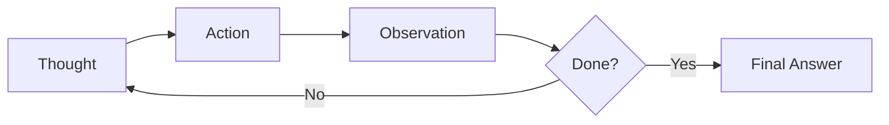
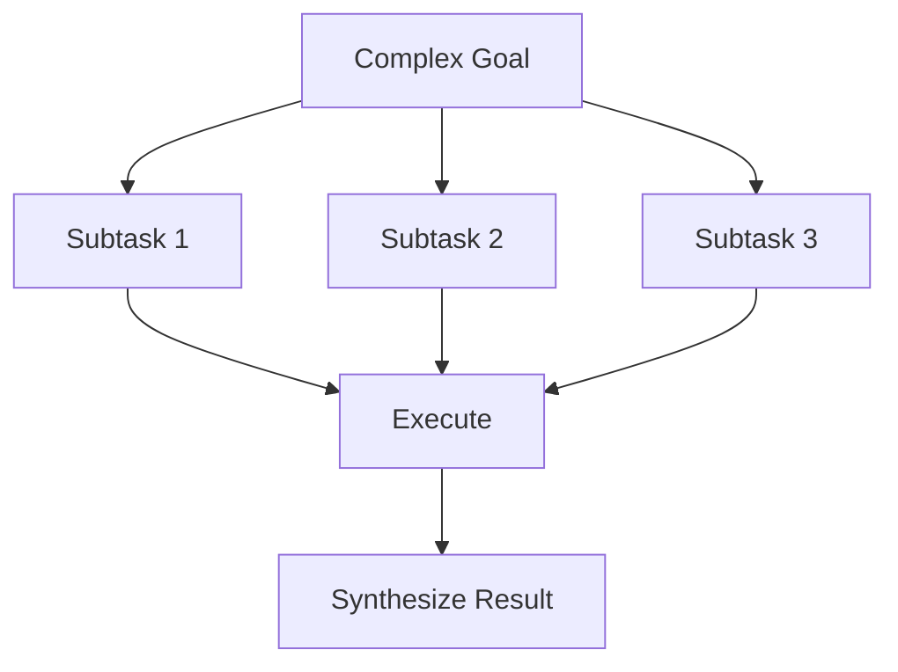
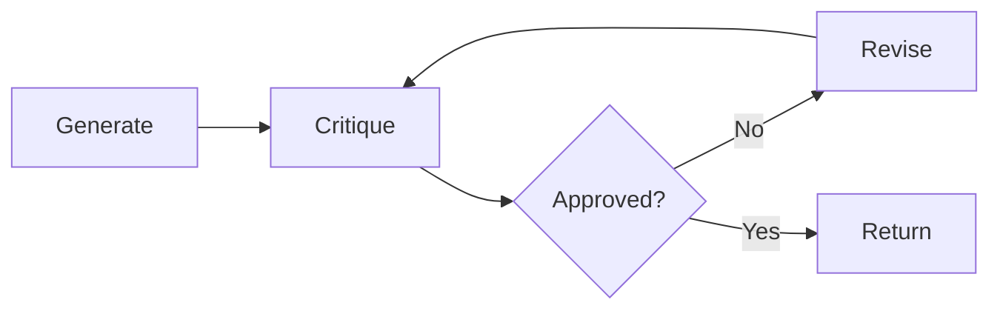
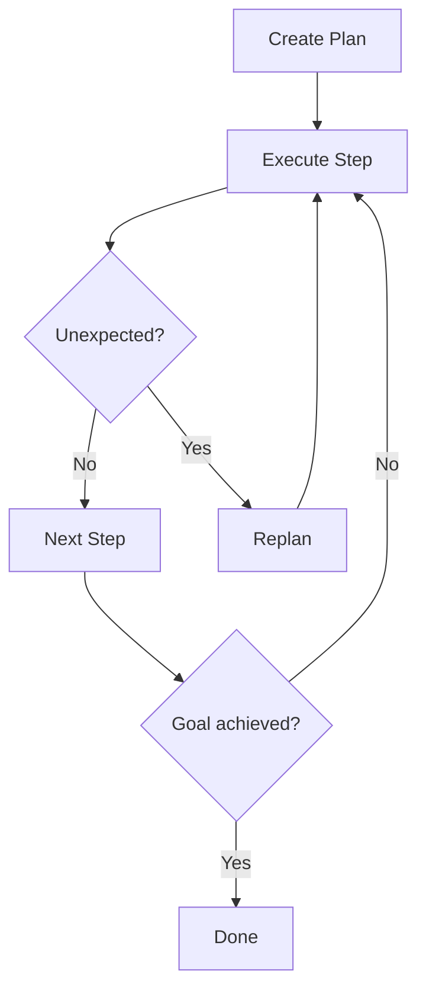
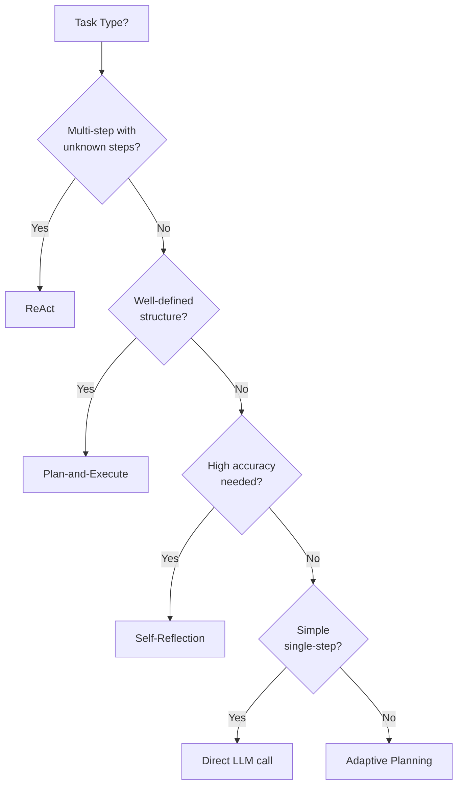
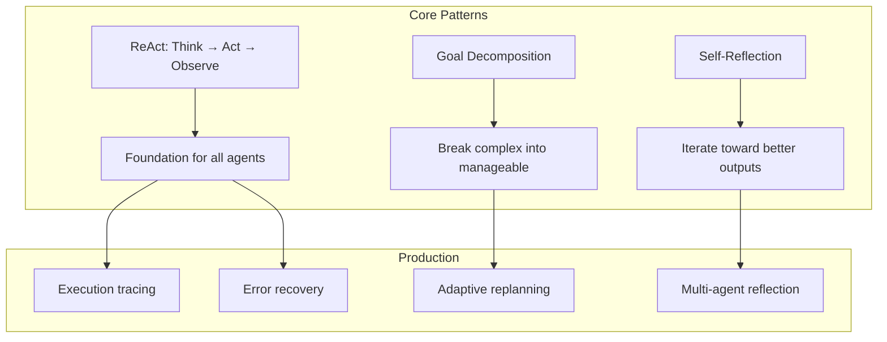

<!-- _class: lead -->

# Module 4: Planning & Reasoning

**Cheatsheet — Quick Reference Card**

> ReAct loops, goal decomposition, self-reflection, and adaptive planning at a glance.

<!--
Speaker notes: Key talking points for this slide
- Transition slide: we are now moving into Module 4: Planning & Reasoning
- Pause briefly to let the audience absorb the previous section
- Preview what is coming next in this section
-->
---

# Key Concepts

| Concept | Definition |
|---------|-----------|
| **ReAct** | Pattern that interleaves reasoning (thinking) with acting (tool use) in a loop |
| **Thought** | Internal reasoning step where the agent decides what to do next |
| **Action** | Execution of a tool or function to gather information |
| **Observation** | Result returned from an action that informs the next thought |
| **Goal Decomposition** | Breaking a complex objective into smaller, manageable subtasks |
| **Self-Reflection** | Process where an agent critiques its own outputs and revises |
| **Planning Horizon** | How far ahead an agent plans before taking action |
| **Replanning** | Adjusting the plan based on new observations or failed attempts |

<!--
Speaker notes: Key talking points for this slide
- Explain the core concept on this slide clearly and concisely
- Relate it back to practical agent building scenarios
- Highlight any common pitfalls or misconceptions
- Connect to what was covered previously and what comes next
-->
---

# ReAct Loop



```python
def react_loop(query, tools, max_steps=10):
    history = []
    for step in range(max_steps):
        thought = llm.generate(
            f"Question: {query}\nHistory: {history}\nThought: What should I do next?")

        if "Final Answer:" in thought:
            return extract_answer(thought)

        action, action_input = parse_action(thought)
        observation = tools[action](action_input)
        history.append({"thought": thought, "action": action,
                        "input": action_input, "observation": observation})

    return "Max steps reached"
```

<!--
Speaker notes: Key talking points for this slide
- Walk through the code block line by line, emphasizing the key pattern
- The diagram below shows the architecture/flow visually
- Point out how the code maps to the diagram components
- Highlight any production considerations or gotchas
-->
---

# Goal Decomposition

```python
def decompose_goal(goal):
    prompt = f"""Break down this goal into 3-5 concrete subtasks:
    Goal: {goal}
    Return as JSON list: [{{"subtask": "...", "dependencies": []}}]"""

    subtasks = llm.generate(prompt)
    return json.loads(subtasks)

def execute_plan(subtasks, tools):
    completed = {}
    for task in subtasks:
        if not all(dep in completed for dep in task["dependencies"]):
            continue
        result = react_loop(task["subtask"], tools)
        completed[task["subtask"]] = result
    return completed
```



<!--
Speaker notes: Key talking points for this slide
- Walk through the code block line by line, emphasizing the key pattern
- The diagram below shows the architecture/flow visually
- Point out how the code maps to the diagram components
- Highlight any production considerations or gotchas
-->
---

# Self-Reflection

```python
def reflect_and_retry(task, initial_result, max_retries=3):
    result = initial_result
    for attempt in range(max_retries):
        critique = llm.generate(
            f"Task: {task}\nResult: {result}\n"
            f"Is this correct and complete? If not, what's wrong?")

        if "correct" in critique.lower():
            return result

        result = llm.generate(
            f"Task: {task}\nPrevious: {result}\n"
            f"Issues: {critique}\nRevised result:")
    return result
```



<!--
Speaker notes: Key talking points for this slide
- Walk through the code block line by line, emphasizing the key pattern
- The diagram below shows the architecture/flow visually
- Point out how the code maps to the diagram components
- Highlight any production considerations or gotchas
-->
---

# Adaptive Planning

```python
def adaptive_plan_execute(goal, tools):
    plan = create_initial_plan(goal)

    while not is_goal_achieved(goal):
        next_step = plan.pop(0)
        result = execute_step(next_step, tools)

        if is_unexpected_result(result):
            plan = replan(goal, result, remaining_steps=plan)

        update_world_state(result)

    return get_final_result()
```



<!--
Speaker notes: Key talking points for this slide
- Walk through the code block line by line, emphasizing the key pattern
- The diagram below shows the architecture/flow visually
- Point out how the code maps to the diagram components
- Highlight any production considerations or gotchas
-->
---

# Gotchas

| Gotcha | Solution |
|--------|----------|
| Infinite loops in ReAct | Add step limits + track observation history for duplicates |
| Overly complex plans fail | Use short planning horizons (2-3 steps), replan frequently |
| Self-reflection adds latency | Only reflect on complex tasks or after failures |
| Decomposition too granular/coarse | Aim for 3-7 subtasks, each achievable in 1-3 ReAct iterations |
| Prompt injection via observations | Sanitize all observations, use XML tags to separate from instructions |

```python
# Bad: No loop detection
while not done:
    action = decide_action()
    observation = execute(action)

# Good: Track and prevent loops
seen_observations = set()
while not done and steps < MAX_STEPS:
    action = decide_action()
    observation = execute(action)
    if observation in seen_observations:
        break  # Stuck in loop
    seen_observations.add(observation)
```

<!--
Speaker notes: Key talking points for this slide
- Walk through the code example, focusing on the key pattern being demonstrated
- Highlight the most important lines and explain why they matter
- Point out any edge cases or production considerations
- This code is copy-paste ready for learners to try
-->
---

# Quick Decision Guide



| Pattern | When to Use | When NOT to Use |
|---------|-------------|-----------------|
| **ReAct** | Multi-step info gathering, adapting to results | Simple single-step tasks |
| **Plan-and-Execute** | Predictable structure, parallel subtasks | Unknown number of steps |
| **Self-Reflection** | High accuracy needed, costly errors | Latency-sensitive, human-reviewed |
| **Adaptive Planning** | Unpredictable environments | Well-known task structures |

<!--
Speaker notes: Key talking points for this slide
- Walk through the diagram from left to right (or top to bottom)
- Explain each component and the connections between them
- Relate this architecture back to practical use cases
-->
---

# Module 4 At a Glance



**You should now be able to:**
- Implement the ReAct pattern with both text-based and native tool use
- Decompose complex goals using top-down, template, or constraint-aware strategies
- Build self-reflection loops with critique-revise, reflexion, and debate patterns
- Choose the right planning pattern for your use case
- Handle errors, loops, and unexpected results in agent execution

<!--
Speaker notes: Key talking points for this slide
- Walk through the diagram from left to right (or top to bottom)
- Explain each component and the connections between them
- Relate this architecture back to practical use cases
-->