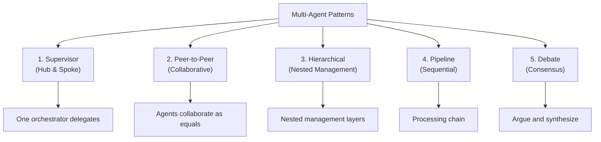
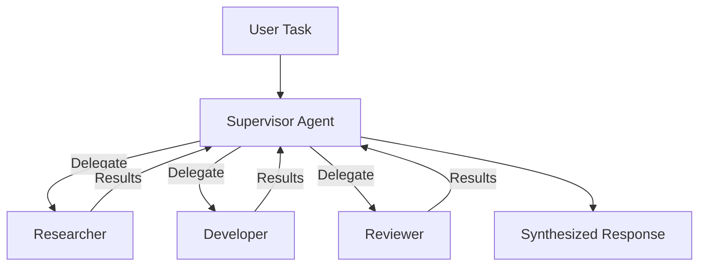
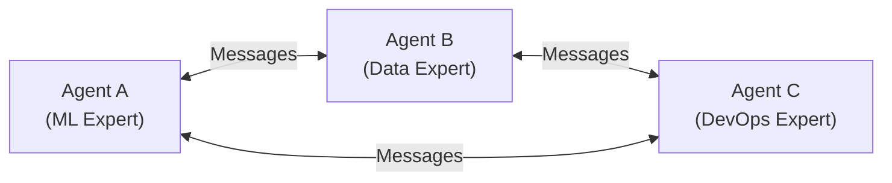
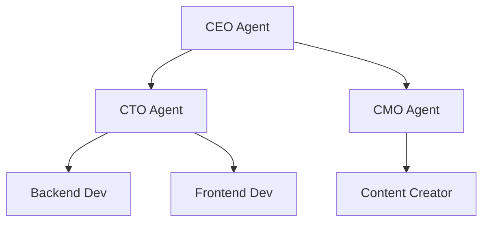
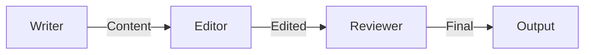
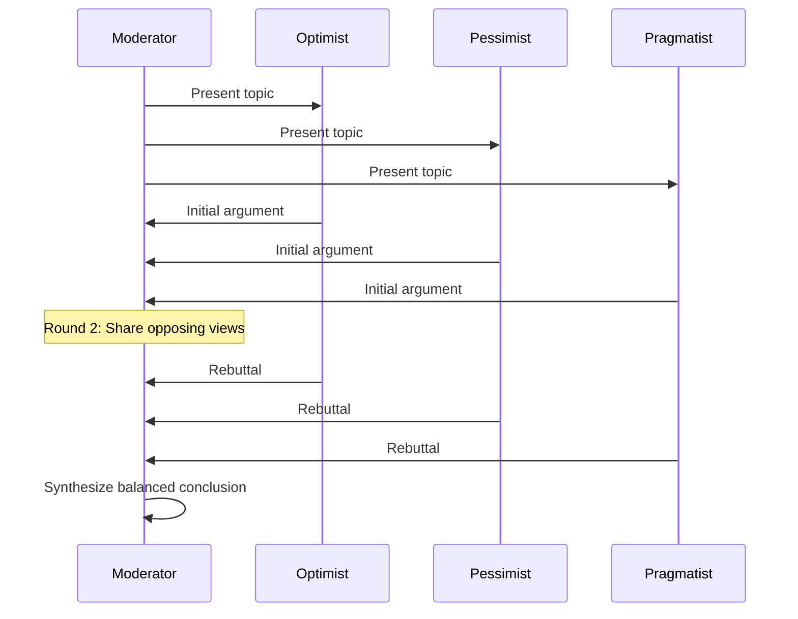
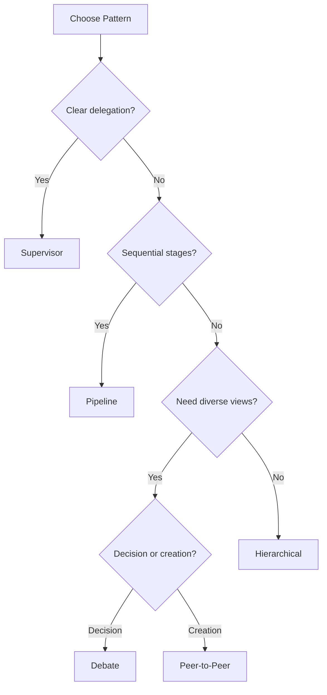
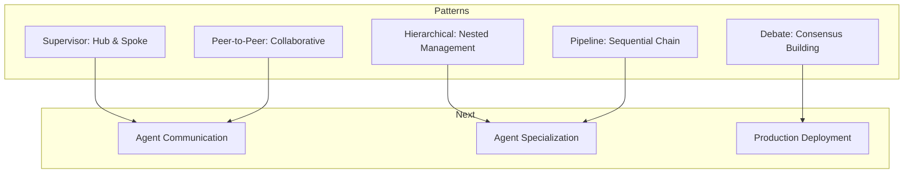

<!-- _class: lead -->

# Multi-Agent Patterns: Orchestration Architectures

**Module 05 — Multi-Agent Systems**

> The right architecture matches problem structure. Choose based on your task decomposition, not technology preferences.

<!--
Speaker notes: Key talking points for this slide
- Transition slide: we are now moving into Multi-Agent Patterns: Orchestration Architectures
- Pause briefly to let the audience absorb the previous section
- Preview what is coming next in this section
-->
---

# Five Orchestration Patterns



<!--
Speaker notes: Key talking points for this slide
- Walk through the diagram from left to right (or top to bottom)
- Explain each component and the connections between them
- Relate this architecture back to practical use cases
-->
---

<!-- _class: lead -->

# Pattern 1: Supervisor (Hub & Spoke)

<!--
Speaker notes: Key talking points for this slide
- Transition slide: we are now moving into Pattern 1: Supervisor (Hub & Spoke)
- Pause briefly to let the audience absorb the previous section
- Preview what is coming next in this section
-->
---

# Supervisor Architecture



```python
@dataclass
class WorkerAgent:
    name: str
    description: str
    handler: Callable

class SupervisorAgent:
    def __init__(self, workers: list[WorkerAgent]):
        self.client = anthropic.Anthropic()
        self.workers = {w.name: w for w in workers}
```

<!--
Speaker notes: Key talking points for this slide
- Walk through the code block line by line, emphasizing the key pattern
- The diagram below shows the architecture/flow visually
- Point out how the code maps to the diagram components
- Highlight any production considerations or gotchas
-->
---

# Supervisor Architecture (continued)

```python
def run(self, task: str) -> str:
        delegation = self._decide_delegation(task)  # Which workers?
        results = {}
        for worker_name, subtask in delegation.items():
            worker = self.workers.get(worker_name)
            if worker:
                results[worker_name] = worker.handler(subtask)
        return self._synthesize(task, results)  # Combine results
```

<!--
Speaker notes: Key talking points for this slide
- Continuation of the previous code block
- Walk through the remaining implementation details
- Highlight any key patterns or important lines
-->
---

# Supervisor: Delegation Logic

```python
def _decide_delegation(self, task: str) -> dict[str, str]:
    worker_list = "\n".join(
        f"- {w.name}: {w.description}" for w in self.workers.values())

    prompt = f"""You are a task coordinator with these specialized workers:
{worker_list}

Given this task: {task}

Decide which worker(s) should handle parts of this task.
Return as JSON:
{{
    "worker_name": "specific subtask for this worker",
    ...
}}
Only include workers that are needed. Be specific about each subtask."""
```

<!--
Speaker notes: Key talking points for this slide
- Walk through the code example, focusing on the key pattern being demonstrated
- Highlight the most important lines and explain why they matter
- Point out any edge cases or production considerations
- This code is copy-paste ready for learners to try
-->
---

# Supervisor: Delegation Logic (continued)

```python
response = self.client.messages.create(
        model="claude-sonnet-4-6", max_tokens=500,
        messages=[{"role": "user", "content": prompt}])
    return json.loads(response.content[0].text)

# Usage
supervisor = SupervisorAgent([
    WorkerAgent("researcher", "Searches and analyzes information", research_handler),
    WorkerAgent("developer", "Writes and implements code", code_handler),
    WorkerAgent("reviewer", "Reviews code and provides feedback", review_handler),
])
result = supervisor.run("Research Python async patterns and implement an example")
```

<!--
Speaker notes: Key talking points for this slide
- Continuation of the previous code block
- Walk through the remaining implementation details
- Highlight any key patterns or important lines
-->
---

<!-- _class: lead -->

# Pattern 2: Peer-to-Peer

<!--
Speaker notes: Key talking points for this slide
- Transition slide: we are now moving into Pattern 2: Peer-to-Peer
- Pause briefly to let the audience absorb the previous section
- Preview what is coming next in this section
-->
---

# Peer Network Architecture



```python
@dataclass
class PeerAgent:
    name: str
    expertise: str
    client: anthropic.Anthropic = field(default_factory=anthropic.Anthropic)
    mailbox: list[Message] = field(default_factory=list)

    def receive(self, message: Message):
        self.mailbox.append(message)
```

<!--
Speaker notes: Key talking points for this slide
- Walk through the code block line by line, emphasizing the key pattern
- The diagram below shows the architecture/flow visually
- Point out how the code maps to the diagram components
- Highlight any production considerations or gotchas
-->
---

# Peer Network Architecture (continued)

```python
def process_messages(self) -> list[Message]:
        responses = []
        for msg in self.mailbox:
            if msg.message_type == "request":
                response = self._handle_request(msg)
                responses.append(Message(
                    sender=self.name, content=response, message_type="response"))
        self.mailbox.clear()
        return responses
```

<!--
Speaker notes: Key talking points for this slide
- Continuation of the previous code block
- Walk through the remaining implementation details
- Highlight any key patterns or important lines
-->
---

# Peer Collaboration Loop

```python
class PeerNetwork:
    def __init__(self, agents: list[PeerAgent]):
        self.agents = {a.name: a for a in agents}

    def broadcast(self, sender: str, content: str, message_type: str = "general"):
        msg = Message(sender=sender, content=content, message_type=message_type)
        for name, agent in self.agents.items():
            if name != sender:
                agent.receive(msg)

    async def run_collaboration(self, task: str, max_rounds: int = 5) -> dict:
        self.broadcast("coordinator", f"Task: {task}", "request")
        all_responses = []
```

> ⚠️ Always set `max_rounds` — peer networks can debate endlessly.

<!--
Speaker notes: Key talking points for this slide
- Walk through the code example, focusing on the key pattern being demonstrated
- Highlight the most important lines and explain why they matter
- Point out any edge cases or production considerations
- This code is copy-paste ready for learners to try
-->
---

# Peer Collaboration Loop (continued)

```python
for round_num in range(max_rounds):
            round_responses = []
            for agent in self.agents.values():
                responses = agent.process_messages()
                round_responses.extend(responses)
                for resp in responses:
                    self.broadcast(resp.sender, resp.content)

            all_responses.extend(round_responses)
            if self._check_consensus(round_responses):
                break

        return {"rounds": round_num + 1, "responses": all_responses}
```

<!--
Speaker notes: Key talking points for this slide
- Continuation of the previous code block
- Walk through the remaining implementation details
- Highlight any key patterns or important lines
-->
---

<!-- _class: lead -->

# Pattern 3: Hierarchical

<!--
Speaker notes: Key talking points for this slide
- Transition slide: we are now moving into Pattern 3: Hierarchical
- Pause briefly to let the audience absorb the previous section
- Preview what is coming next in this section
-->
---

# Hierarchical Architecture



```python
@dataclass
class HierarchicalAgent:
    name: str
    role: str
    subordinates: list["HierarchicalAgent"] = field(default_factory=list)

    def assign_task(self, task: str) -> dict:
        if not self.subordinates:
            return {"executor": self.name, "result": self._execute(task)}

        subtasks = self._decompose(task)
        results = {}
        for subtask, subordinate in zip(subtasks, self.subordinates):
            results[subordinate.name] = subordinate.assign_task(subtask)

        return {"coordinator": self.name,
                "delegated_to": list(results.keys()),
                "results": results}
```

> 🔑 Leaf nodes execute directly; managers decompose and delegate.

<!--
Speaker notes: Key talking points for this slide
- Walk through the code block line by line, emphasizing the key pattern
- The diagram below shows the architecture/flow visually
- Point out how the code maps to the diagram components
- Highlight any production considerations or gotchas
-->
---

<!-- _class: lead -->

# Pattern 4: Pipeline

<!--
Speaker notes: Key talking points for this slide
- Transition slide: we are now moving into Pattern 4: Pipeline
- Pause briefly to let the audience absorb the previous section
- Preview what is coming next in this section
-->
---

# Pipeline (Sequential Processing)



```python
class PipelineStage:
    def __init__(self, name: str, system_prompt: str,
                 next_stage: Optional["PipelineStage"] = None):
        self.name = name
        self.system_prompt = system_prompt
        self.next_stage = next_stage
        self.client = anthropic.Anthropic()

    def process(self, input_data: dict) -> dict:
        response = self.client.messages.create(
            model="claude-sonnet-4-6", max_tokens=1000,
            system=self.system_prompt,
            messages=[{"role": "user", "content": str(input_data)}])
```

<!--
Speaker notes: Key talking points for this slide
- Walk through the code block line by line, emphasizing the key pattern
- The diagram below shows the architecture/flow visually
- Point out how the code maps to the diagram components
- Highlight any production considerations or gotchas
-->
---

# Pipeline (Sequential Processing) (continued)

```python
output = {"stage": self.name, "input": input_data,
                  "output": response.content[0].text}

        if self.next_stage:
            output["next"] = self.next_stage.process(
                {"previous_stage": self.name, "data": output["output"]})
        return output

# Build: Writer -> Editor -> Reviewer
reviewer = PipelineStage("Reviewer", "Review content for errors.")
editor = PipelineStage("Editor", "Edit based on review.", next_stage=reviewer)
writer = PipelineStage("Writer", "Write content.", next_stage=editor)
result = writer.process({"topic": "Introduction to AI Agents"})
```

<!--
Speaker notes: Key talking points for this slide
- Continuation of the previous code block
- Walk through the remaining implementation details
- Highlight any key patterns or important lines
-->
---

<!-- _class: lead -->

# Pattern 5: Debate & Consensus

<!--
Speaker notes: Key talking points for this slide
- Transition slide: we are now moving into Pattern 5: Debate & Consensus
- Pause briefly to let the audience absorb the previous section
- Preview what is coming next in this section
-->
---

# Debate Architecture

```python
class DebateAgent:
    def __init__(self, name: str, position: str):
        self.name = name
        self.position = position

    def argue(self, topic: str, opposing_arguments: list[str] = None) -> str:
        context = ""
        if opposing_arguments:
            context = f"\n\nOpposing arguments:\n"
            context += "\n".join(f"- {arg}" for arg in opposing_arguments)

        prompt = f"""You are arguing for: {self.position}
Topic: {topic}{context}
Make your best argument. Be specific and persuasive."""
```

<!--
Speaker notes: Key talking points for this slide
- Walk through the code example, focusing on the key pattern being demonstrated
- Highlight the most important lines and explain why they matter
- Point out any edge cases or production considerations
- This code is copy-paste ready for learners to try
-->
---

# Debate Architecture (continued)

```python
return self.client.messages.create(
            model="claude-sonnet-4-6", max_tokens=500,
            messages=[{"role": "user", "content": prompt}]).content[0].text

class DebateModerator:
    def run_debate(self, topic: str, rounds: int = 3) -> dict:
        arguments = {d.name: [] for d in self.debaters}
        for round_num in range(rounds):
            for debater in self.debaters:
                opposing = [arguments[o.name][-1] for o in self.debaters
                           if o.name != debater.name and arguments[o.name]]
                argument = debater.argue(topic, opposing if round_num > 0 else None)
                arguments[debater.name].append(argument)
        return {"topic": topic, "rounds": arguments,
                "conclusion": self._synthesize(topic, arguments)}
```

<!--
Speaker notes: Key talking points for this slide
- Continuation of the previous code block
- Walk through the remaining implementation details
- Highlight any key patterns or important lines
-->
---

# Debate Flow



> ✅ Debate works especially well for decisions with trade-offs.

<!--
Speaker notes: Key talking points for this slide
- Walk through the diagram from left to right (or top to bottom)
- Explain each component and the connections between them
- Relate this architecture back to practical use cases
-->
---

# Choosing the Right Pattern

| Scenario | Pattern | Why |
|----------|---------|-----|
| Clear task delegation | **Supervisor** | Central control, predictable routing |
| Creative collaboration | **Peer-to-Peer** | Diverse perspectives, emergent solutions |
| Large-scale organization | **Hierarchical** | Scalable delegation, bounded complexity |
| Sequential processing | **Pipeline** | Each stage refines output |
| Decision-making | **Debate/Consensus** | Weighted perspectives, nuanced conclusions |



<!--
Speaker notes: Key talking points for this slide
- Walk through the diagram from left to right (or top to bottom)
- Explain each component and the connections between them
- Relate this architecture back to practical use cases
-->
---

# Summary & Connections



**Key takeaways:**
- Supervisor pattern suits clear task delegation with centralized control
- Peer-to-peer enables creative collaboration without hierarchy
- Hierarchical scales to large organizations with nested management
- Pipeline chains agents for sequential refinement
- Debate builds consensus through adversarial perspectives
- Choose patterns based on problem structure, not technology

> *Multi-agent systems multiply capabilities. Let agents collaborate effectively.*

<!--
Speaker notes: Key talking points for this slide
- Walk through the diagram from left to right (or top to bottom)
- Explain each component and the connections between them
- Relate this architecture back to practical use cases
-->