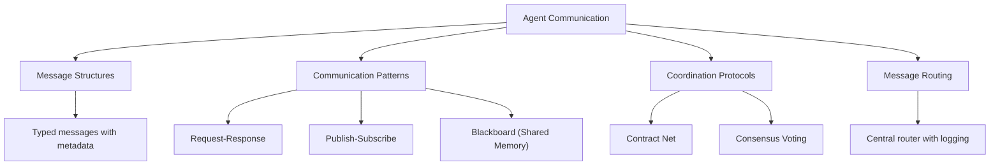
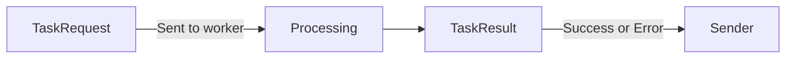
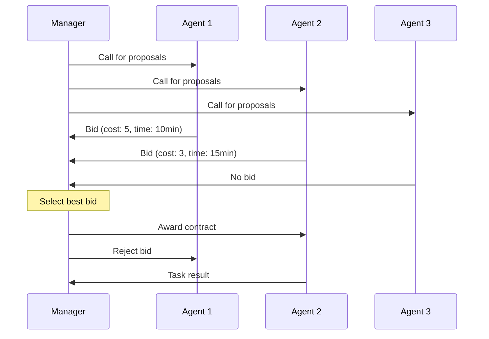
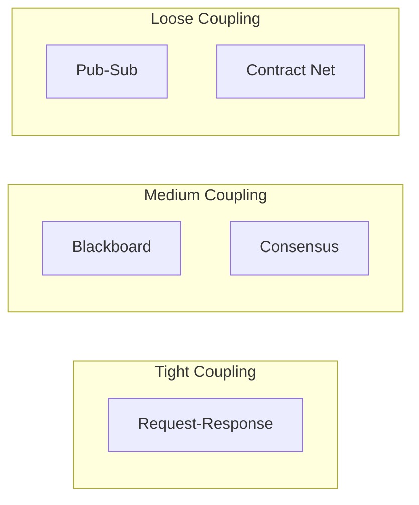
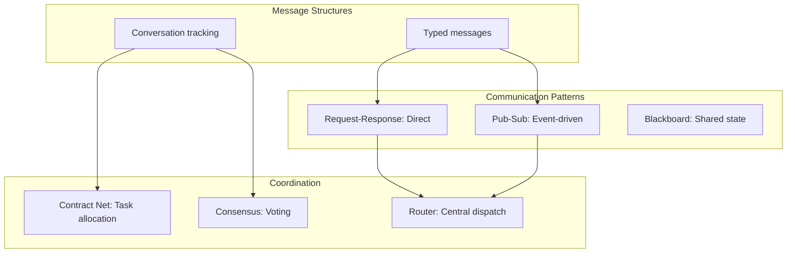

<!-- _class: lead -->

# Agent Communication: Message Passing and Protocols

**Module 05 — Multi-Agent Systems**

> Clear protocols prevent chaos. Without structured communication, agents talk past each other, duplicate work, or create deadlocks.

<!--
Speaker notes: Key talking points for this slide
- Transition slide: we are now moving into Agent Communication: Message Passing and Protocols
- Pause briefly to let the audience absorb the previous section
- Preview what is coming next in this section
-->
---

# Communication Patterns Overview



<!--
Speaker notes: Key talking points for this slide
- Walk through the diagram from left to right (or top to bottom)
- Explain each component and the connections between them
- Relate this architecture back to practical use cases
-->
---

<!-- _class: lead -->

# Message Structures

<!--
Speaker notes: Key talking points for this slide
- Transition slide: we are now moving into Message Structures
- Pause briefly to let the audience absorb the previous section
- Preview what is coming next in this section
-->
---

# Basic Message Format

```python
class MessageType(Enum):
    REQUEST = "request"
    RESPONSE = "response"
    INFORM = "inform"
    QUERY = "query"
    DELEGATE = "delegate"
    RESULT = "result"
    ERROR = "error"

@dataclass
class AgentMessage:
    sender: str
    recipient: str
    message_type: MessageType
```

> 🔑 Every message needs a `conversation_id` to track multi-turn interactions.

<!--
Speaker notes: Key talking points for this slide
- Walk through the code example, focusing on the key pattern being demonstrated
- Highlight the most important lines and explain why they matter
- Point out any edge cases or production considerations
- This code is copy-paste ready for learners to try
-->
---

# Basic Message Format (continued)

```python
content: Any
    conversation_id: str
    timestamp: datetime = field(default_factory=datetime.utcnow)
    in_reply_to: Optional[str] = None
    metadata: dict = field(default_factory=dict)

    def to_dict(self) -> dict:
        return {
            "sender": self.sender, "recipient": self.recipient,
            "type": self.message_type.value, "content": self.content,
            "conversation_id": self.conversation_id,
            "timestamp": self.timestamp.isoformat(),
            "in_reply_to": self.in_reply_to, "metadata": self.metadata
        }
```

<!--
Speaker notes: Key talking points for this slide
- Continuation of the previous code block
- Walk through the remaining implementation details
- Highlight any key patterns or important lines
-->
---

# Typed Message Content

<div class="columns">
<div>

**Task Request:**
```python
@dataclass
class TaskRequest:
    task_description: str
    priority: int = 1
    deadline: Optional[datetime] = None
    context: dict = field(
        default_factory=dict)
```

**Task Result:**
```python
@dataclass
class TaskResult:
    success: bool
    result: Any
    execution_time: float
    errors: list = field(
        default_factory=list)
```

</div>
<div>

**Query Message:**
```python
@dataclass
class QueryMessage:
    question: str
    expected_format: Optional[str] = None
    constraints: dict = field(
        default_factory=dict)
```



</div>
</div>

> ✅ Typed content prevents agents from misinterpreting messages.

<!--
Speaker notes: Key talking points for this slide
- Walk through the code block line by line, emphasizing the key pattern
- The diagram below shows the architecture/flow visually
- Point out how the code maps to the diagram components
- Highlight any production considerations or gotchas
-->
---

<!-- _class: lead -->

# Communication Patterns

<!--
Speaker notes: Key talking points for this slide
- Transition slide: we are now moving into Communication Patterns
- Pause briefly to let the audience absorb the previous section
- Preview what is coming next in this section
-->
---

# Request-Response

```python
class RequestResponseProtocol:
    def __init__(self, timeout: float = 30.0):
        self.timeout = timeout
        self.pending_requests: dict[str, asyncio.Future] = {}

    async def send_request(self, sender, recipient, content, router) -> Any:
        message = AgentMessage(
            sender=sender, recipient=recipient,
            message_type=MessageType.REQUEST,
            content=content, conversation_id=str(uuid.uuid4()))

        future = asyncio.Future()
        self.pending_requests[message.conversation_id] = future
        await router.send(message)
```

<!--
Speaker notes: Key talking points for this slide
- Walk through the code block line by line, emphasizing the key pattern
- The diagram below shows the architecture/flow visually
- Point out how the code maps to the diagram components
- Highlight any production considerations or gotchas
-->
---

# Request-Response (continued)

```python
try:
            response = await asyncio.wait_for(future, self.timeout)
            return response
        except asyncio.TimeoutError:
            del self.pending_requests[message.conversation_id]
            raise TimeoutError(f"No response from {recipient}")

    def handle_response(self, message: AgentMessage):
        if message.in_reply_to in self.pending_requests:
            future = self.pending_requests.pop(message.in_reply_to)
            future.set_result(message.content)
```

<!--
Speaker notes: Key talking points for this slide
- Continuation of the previous code block
- Walk through the remaining implementation details
- Highlight any key patterns or important lines
-->
---

# Publish-Subscribe

```python
class PubSubBroker:
    def __init__(self):
        self.subscriptions: dict[str, list[str]] = {}  # topic -> [agents]
        self.agent_queues: dict[str, asyncio.Queue] = {}

    def subscribe(self, agent_id: str, topic: str):
        if topic not in self.subscriptions:
            self.subscriptions[topic] = []
        if agent_id not in self.subscriptions[topic]:
            self.subscriptions[topic].append(agent_id)
        if agent_id not in self.agent_queues:
            self.agent_queues[agent_id] = asyncio.Queue()
```

<!--
Speaker notes: Key talking points for this slide
- Walk through the code block line by line, emphasizing the key pattern
- The diagram below shows the architecture/flow visually
- Point out how the code maps to the diagram components
- Highlight any production considerations or gotchas
-->
---

# Publish-Subscribe (continued)

```python
async def publish(self, topic: str, message: AgentMessage):
        subscribers = self.subscriptions.get(topic, [])
        for agent_id in subscribers:
            if agent_id in self.agent_queues:
                await self.agent_queues[agent_id].put(message)

    async def receive(self, agent_id: str) -> AgentMessage:
        if agent_id not in self.agent_queues:
            self.agent_queues[agent_id] = asyncio.Queue()
        return await self.agent_queues[agent_id].get()
```

<!--
Speaker notes: Key talking points for this slide
- Continuation of the previous code block
- Walk through the remaining implementation details
- Highlight any key patterns or important lines
-->
---

# Blackboard (Shared Memory)

```python
class Blackboard:
    def __init__(self):
        self.data: dict[str, Any] = {}
        self.history: list[dict] = []
        self.watchers: dict[str, list[Callable]] = {}
        self.lock = asyncio.Lock()

    async def write(self, key: str, value: Any, author: str):
        async with self.lock:
            old_value = self.data.get(key)
            self.data[key] = value
            self.history.append({"action": "write", "key": key,
                "value": value, "author": author,
                "timestamp": datetime.utcnow()})
        await self._notify_watchers(key, old_value, value)
```

<!--
Speaker notes: Key talking points for this slide
- Walk through the code block line by line, emphasizing the key pattern
- The diagram below shows the architecture/flow visually
- Point out how the code maps to the diagram components
- Highlight any production considerations or gotchas
-->
---

# Blackboard (Shared Memory) (continued)

```python
async def read(self, key: str) -> Any:
        return self.data.get(key)

    def watch(self, key: str, callback: Callable):
        if key not in self.watchers:
            self.watchers[key] = []
        self.watchers[key].append(callback)
```

<!--
Speaker notes: Key talking points for this slide
- Continuation of the previous code block
- Walk through the remaining implementation details
- Highlight any key patterns or important lines
-->
---

<!-- _class: lead -->

# Coordination Protocols

<!--
Speaker notes: Key talking points for this slide
- Transition slide: we are now moving into Coordination Protocols
- Pause briefly to let the audience absorb the previous section
- Preview what is coming next in this section
-->
---

# Contract Net Protocol



```python
class ContractNetManager:
    async def announce_task(self, task: TaskRequest) -> str:
        conversation_id = str(uuid.uuid4())
        # Send call for proposals to all agents
        for agent_id in self.agents:
            await self.router.send(AgentMessage(
                sender="manager", recipient=agent_id,
                message_type=MessageType.REQUEST,
                content={"type": "call_for_proposals", "task": task},
                conversation_id=conversation_id))

        # Collect bids with timeout, select winner
        bids = await self._collect_bids(conversation_id)
        winner = min(bids, key=lambda b: b["bid"].get("cost", float("inf")))
        await self._award_contract(winner, task, conversation_id)
        return winner["agent"]
```

<!--
Speaker notes: Key talking points for this slide
- Walk through the code block line by line, emphasizing the key pattern
- The diagram below shows the architecture/flow visually
- Point out how the code maps to the diagram components
- Highlight any production considerations or gotchas
-->
---

# Consensus Protocol

```python
class ConsensusProtocol:
    def __init__(self, agents: list[str], router):
        self.agents = agents
        self.router = router
        self.quorum = len(agents) // 2 + 1

    async def propose_and_vote(self, proposal: Any) -> dict:
        conversation_id = str(uuid.uuid4())
        votes = {"for": [], "against": []}
```

> 🔑 Quorum = majority needed to pass. Prevents deadlocks with even agent counts.

<!--
Speaker notes: Key talking points for this slide
- Walk through the code example, focusing on the key pattern being demonstrated
- Highlight the most important lines and explain why they matter
- Point out any edge cases or production considerations
- This code is copy-paste ready for learners to try
-->
---

# Consensus Protocol (continued)

```python
# Send proposal to all agents
        for agent_id in self.agents:
            await self.router.send(AgentMessage(
                sender="coordinator", recipient=agent_id,
                message_type=MessageType.QUERY,
                content={"type": "vote_request", "proposal": proposal},
                conversation_id=conversation_id))

        # Collect votes with timeout
        votes = await self._collect_votes(conversation_id)

        passed = len(votes["for"]) >= self.quorum
        return {"proposal": proposal, "passed": passed,
                "votes": votes, "quorum": self.quorum}
```

<!--
Speaker notes: Key talking points for this slide
- Continuation of the previous code block
- Walk through the remaining implementation details
- Highlight any key patterns or important lines
-->
---

# Message Router

```python
class MessageRouter:
    """Central message router for multi-agent system."""

    def __init__(self):
        self.agents: dict[str, asyncio.Queue] = {}
        self.message_log: list[AgentMessage] = []

    def register_agent(self, agent_id: str):
        self.agents[agent_id] = asyncio.Queue()

    async def send(self, message: AgentMessage):
        self.message_log.append(message)
```

> ✅ Message logging enables debugging and auditing of all agent interactions.

<!--
Speaker notes: Key talking points for this slide
- Walk through the code example, focusing on the key pattern being demonstrated
- Highlight the most important lines and explain why they matter
- Point out any edge cases or production considerations
- This code is copy-paste ready for learners to try
-->
---

# Message Router (continued)

```python
if message.recipient == "broadcast":
            for agent_id, queue in self.agents.items():
                if agent_id != message.sender:
                    await queue.put(message)
        elif message.recipient in self.agents:
            await self.agents[message.recipient].put(message)
        else:
            raise ValueError(f"Unknown recipient: {message.recipient}")

    async def receive(self, agent_id: str) -> AgentMessage:
        return await self.agents[agent_id].get()

    def get_conversation(self, conversation_id: str) -> list[AgentMessage]:
        return [m for m in self.message_log
                if m.conversation_id == conversation_id]
```

<!--
Speaker notes: Key talking points for this slide
- Continuation of the previous code block
- Walk through the remaining implementation details
- Highlight any key patterns or important lines
-->
---

# Pattern Comparison

| Pattern | Coupling | Scalability | Use Case |
|---------|----------|-------------|----------|
| **Request-Response** | Tight | Low | Direct delegation |
| **Publish-Subscribe** | Loose | High | Event-driven systems |
| **Blackboard** | Shared state | Medium | Collaborative problem solving |
| **Contract Net** | Market-based | High | Task allocation |
| **Consensus** | Voting | Medium | Decision making |



<!--
Speaker notes: Key talking points for this slide
- Walk through the diagram from left to right (or top to bottom)
- Explain each component and the connections between them
- Relate this architecture back to practical use cases
-->
---

# Summary & Connections



**Key takeaways:**
- Structured messages with typed content prevent miscommunication
- Request-Response for direct delegation, Pub-Sub for event-driven systems
- Blackboard pattern enables collaborative problem solving with shared state
- Contract Net allocates tasks through bidding — agents compete for work
- Consensus protocols use voting with quorum for decision making
- Central routers enable logging, debugging, and conversation tracking

> *Effective communication transforms independent agents into collaborative systems.*

<!--
Speaker notes: Key talking points for this slide
- Walk through the diagram from left to right (or top to bottom)
- Explain each component and the connections between them
- Relate this architecture back to practical use cases
-->