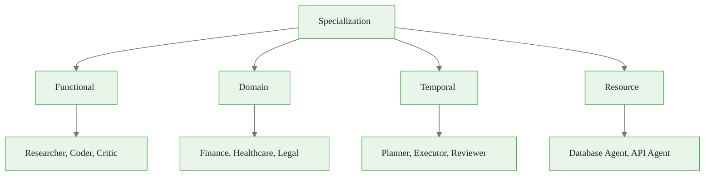
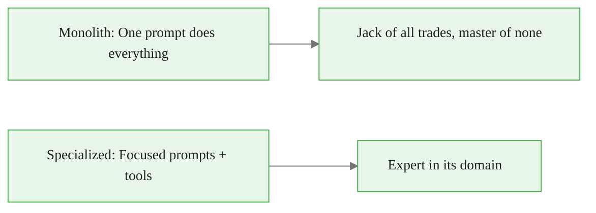
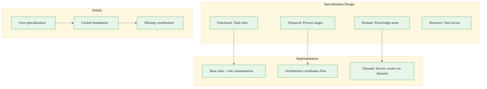

<!-- _class: lead -->

# Agent Specialization

**Module 05 — Multi-Agent Systems**

> Just as human teams succeed through role differentiation, agent teams excel when each agent has a clear domain of expertise and responsibility.

<!--
Speaker notes: Key talking points for this slide
- Transition slide: we are now moving into Agent Specialization
- Pause briefly to let the audience absorb the previous section
- Preview what is coming next in this section
-->
---

# Specialization Dimensions



| Dimension | Focus | Example |
|-----------|-------|---------|
| **Functional** | Task-based roles | researcher, coder, critic |
| **Domain** | Knowledge expertise | finance, healthcare, legal |
| **Temporal** | Process stages | planner, executor, reviewer |
| **Resource** | Access capabilities | database agent, API agent |

<!--
Speaker notes: Key talking points for this slide
- Walk through the diagram from left to right (or top to bottom)
- Explain each component and the connections between them
- Relate this architecture back to practical use cases
-->
---

# Monolith vs Specialized

<div class="columns">
<div>

**Monolithic Agent:**
```
[One Agent]
├─ Research capability
├─ Coding capability
├─ Testing capability
├─ Documentation capability
└─ Review capability
```

- Simple but unfocused
- Context window diluted
- Hard to debug

</div>
<div>

**Specialized Agents:**
```
[Orchestrator]
├─> [Research Agent]
├─> [Code Agent]
├─> [Test Agent]
├─> [Doc Agent]
└─> [Review Agent]
```

- Focused system prompts
- Relevant tools only
- Domain-specific RAG
- Clear quality criteria

</div>
</div>



<!--
Speaker notes: Key talking points for this slide
- Compare the two approaches side by side
- Highlight what makes the recommended approach better
- Point out common mistakes that lead people to the less effective approach
-->
---

<!-- _class: lead -->

# Implementation

<!--
Speaker notes: Key talking points for this slide
- Transition slide: we are now moving into Implementation
- Pause briefly to let the audience absorb the previous section
- Preview what is coming next in this section
-->
---

# Base Specialization Pattern

<div class="code-window">
<div class="code-header">
<div class="dots"><span class="dot-red"></span><span class="dot-yellow"></span><span class="dot-green"></span></div>
<span class="filename">agent.py</span>
</div>
<div class="code-body">

```python
class SpecializedAgent:
    """Base class for specialized agents."""

    def __init__(self, client: Anthropic, role: str,
                 system_prompt: str, tools: list):
        self.client = client
        self.role = role
        self.system_prompt = system_prompt
        self.tools = tools

    def execute(self, task: str) -> str:
        response = self.client.messages.create(
            model="claude-sonnet-4-6", max_tokens=2048,
            system=self.system_prompt, tools=self.tools,
            messages=[{"role": "user", "content": task}])
        return response.content[0].text
```

</div>
</div>

Each specialist customizes:
- **System prompt** — defines role, focus, quality criteria
- **Tools** — only what's needed for the domain
- **Knowledge base** — specialized RAG collections

<!--
Speaker notes: Key talking points for this slide
- Walk through the code example, focusing on the key pattern being demonstrated
- Highlight the most important lines and explain why they matter
- Point out any edge cases or production considerations
- This code is copy-paste ready for learners to try
-->
---

# Research Agent

<div class="code-window">
<div class="code-header">
<div class="dots"><span class="dot-red"></span><span class="dot-yellow"></span><span class="dot-green"></span></div>
<span class="filename">agent.py</span>
</div>
<div class="code-body">

```python
class ResearchAgent(SpecializedAgent):
    def __init__(self, client: Anthropic):
        system_prompt = """You are a research specialist. Your role is to:
        - Find accurate, relevant information on any topic
        - Synthesize multiple sources into coherent summaries
        - Cite sources and assess credibility
        - Identify gaps in available information

        Focus on thoroughness and accuracy. Always cite your sources."""
```

</div>
</div>

<div class="callout-key">

**Key Point:** Research agent gets search tools, not code execution.

</div>

<!--
Speaker notes: Key talking points for this slide
- Walk through the code example, focusing on the key pattern being demonstrated
- Highlight the most important lines and explain why they matter
- Point out any edge cases or production considerations
- This code is copy-paste ready for learners to try
-->
---

# Research Agent (continued)

<div class="code-window">
<div class="code-header">
<div class="dots"><span class="dot-red"></span><span class="dot-yellow"></span><span class="dot-green"></span></div>
<span class="filename">agent.py</span>
</div>
<div class="code-body">

```python
tools = [
            {"name": "search_web",
             "description": "Search the web for current information",
             "input_schema": {"type": "object",
                 "properties": {"query": {"type": "string"}},
                 "required": ["query"]}},
            {"name": "search_papers",
             "description": "Search academic papers",
             "input_schema": {"type": "object",
                 "properties": {"query": {"type": "string"}},
                 "required": ["query"]}}
        ]

        super().__init__(client, "Research Specialist", system_prompt, tools)
```

</div>
</div>

<!--
Speaker notes: Key talking points for this slide
- Continuation of the previous code block
- Walk through the remaining implementation details
- Highlight any key patterns or important lines
-->
---

# Code and Review Agents

<div class="columns">
<div>

**Code Agent:**
<div class="code-window">
<div class="code-header">
<div class="dots"><span class="dot-red"></span><span class="dot-yellow"></span><span class="dot-green"></span></div>
<span class="filename">agent.py</span>
</div>
<div class="code-body">

```python
class CodeAgent(SpecializedAgent):
    def __init__(self, client):
        system_prompt = """You are a
        coding specialist. Your role:
        - Write clean, efficient code
        - Follow best practices
        - Implement error handling
        - Write testable code

        Focus on quality and clarity.
        Always include docstrings."""
```

</div>
</div>

</div>
<div>

**Review Agent:**
```python
class ReviewAgent(SpecializedAgent):
    def __init__(self, client):
        system_prompt = """You are a
        review specialist. Your role:
        - Evaluate outputs for accuracy
        - Identify issues and edge cases
        - Provide actionable feedback
        - Assess completeness

        Be thorough and constructive.
        Point out strengths AND
        weaknesses."""
```

</div>
</div>

<!--
Speaker notes: Key talking points for this slide
- Walk through the code example, focusing on the key pattern being demonstrated
- Highlight the most important lines and explain why they matter
- Point out any edge cases or production considerations
- This code is copy-paste ready for learners to try
-->
---

# Code and Review Agents (continued)

<div class="code-window">
<div class="code-header">
<div class="dots"><span class="dot-red"></span><span class="dot-yellow"></span><span class="dot-green"></span></div>
<span class="filename">agent.py</span>
</div>
<div class="code-body">

```python
# Review uses reasoning,
        # not tools
        tools = []

        super().__init__(client,
            "Review Specialist",
            system_prompt, tools)
```

</div>
</div>

<!--
Speaker notes: Key talking points for this slide
- Continuation of the previous code block
- Walk through the remaining implementation details
- Highlight any key patterns or important lines
-->
---

# Code and Review Agents (continued)

<div class="code-window">
<div class="code-header">
<div class="dots"><span class="dot-red"></span><span class="dot-yellow"></span><span class="dot-green"></span></div>
<span class="filename">agent.py</span>
</div>
<div class="code-body">

```python
tools = [
            {"name": "execute_code",
             "description": "Execute Python
               code in sandbox",
             ...},
            {"name": "analyze_code",
             "description": "Run static
               analysis on code",
             ...}
        ]
        super().__init__(client,
            "Code Specialist",
            system_prompt, tools)
```

</div>
</div>

<!--
Speaker notes: Key talking points for this slide
- Continuation of the previous code block
- Walk through the remaining implementation details
- Highlight any key patterns or important lines
-->
---

# Orchestrator: Coordinating Specialists

<div class="code-window">
<div class="code-header">
<div class="dots"><span class="dot-red"></span><span class="dot-yellow"></span><span class="dot-green"></span></div>
<span class="filename">agent.py</span>
</div>
<div class="code-body">

```python
class AgentOrchestrator:
    def __init__(self, client: Anthropic):
        self.research_agent = ResearchAgent(client)
        self.code_agent = CodeAgent(client)
        self.review_agent = ReviewAgent(client)

    def build_feature(self, feature_request: str) -> dict:
        # Step 1: Research phase
        research = self.research_agent.execute(
            f"Research best practices for: {feature_request}")
```

</div>
</div>

<!--
Speaker notes: Key talking points for this slide
- Walk through the code block line by line, emphasizing the key pattern
- The diagram below shows the architecture/flow visually
- Point out how the code maps to the diagram components
- Highlight any production considerations or gotchas
-->
---

# Orchestrator: Coordinating Specialists (continued)

<div class="code-window">
<div class="code-header">
<div class="dots"><span class="dot-red"></span><span class="dot-yellow"></span><span class="dot-green"></span></div>
<span class="filename">agent.py</span>
</div>
<div class="code-body">

```python
# Step 2: Implementation phase
        code = self.code_agent.execute(
            f"Based on this research:\n{research}\n\nImplement: {feature_request}")

        # Step 3: Review phase
        review = self.review_agent.execute(
            f"Review this implementation:\nRequirements: {feature_request}\n"
            f"Research: {research}\nCode: {code}\nAssess quality.")

        return {"research": research, "implementation": code, "review": review}
```

</div>
</div>

<!--
Speaker notes: Key talking points for this slide
- Continuation of the previous code block
- Walk through the remaining implementation details
- Highlight any key patterns or important lines
-->
---

# Dynamic Agent Factory

<div class="code-window">
<div class="code-header">
<div class="dots"><span class="dot-red"></span><span class="dot-yellow"></span><span class="dot-green"></span></div>
<span class="filename">agent.py</span>
</div>
<div class="code-body">

```python
class DynamicAgentFactory:
    """Create specialized agents on-demand based on task requirements."""

    def __init__(self, client: Anthropic):
        self.client = client
        self.specialized_agents = {}

    def create_specialist(self, domain: str, capabilities: list[str],
                          knowledge_base: str = None) -> SpecializedAgent:
        system_prompt = f"""You are an expert in {domain}.
        Your specialized capabilities:
        {chr(10).join(f'- {cap}' for cap in capabilities)}
        {"Knowledge base: " + knowledge_base if knowledge_base else ""}
        Focus on excellence in your domain."""
```

</div>
</div>

<!--
Speaker notes: Key talking points for this slide
- Walk through the code example, focusing on the key pattern being demonstrated
- Highlight the most important lines and explain why they matter
- Point out any edge cases or production considerations
- This code is copy-paste ready for learners to try
-->
---

# Dynamic Agent Factory (continued)

<div class="code-window">
<div class="code-header">
<div class="dots"><span class="dot-red"></span><span class="dot-yellow"></span><span class="dot-green"></span></div>
<span class="filename">agent.py</span>
</div>
<div class="code-body">

```python
tools = self._select_tools_for_domain(domain)
        agent = SpecializedAgent(self.client, f"{domain.title()} Specialist",
                                 system_prompt, tools)
        self.specialized_agents[domain] = agent
        return agent

    def _select_tools_for_domain(self, domain: str) -> list:
        tool_registry = {
            "finance": ["calculate_metrics", "fetch_market_data"],
            "legal": ["search_case_law", "analyze_contract"],
            "medical": ["search_pubmed", "check_interactions"],
            "data_science": ["run_analysis", "create_visualization"]
        }
        return tool_registry.get(domain, [])
```

</div>
</div>

<!--
Speaker notes: Key talking points for this slide
- Continuation of the previous code block
- Walk through the remaining implementation details
- Highlight any key patterns or important lines
-->
---

# Common Pitfalls

<div class="columns">
<div>

**Over-Specialization:**
<div class="code-window">
<div class="code-header">
<div class="dots"><span class="dot-red"></span><span class="dot-yellow"></span><span class="dot-green"></span></div>
<span class="filename">agent.py</span>
</div>
<div class="code-body">

```python
# DON'T: Too many narrow specialists
agents = [
    FileReaderAgent(),
    FileWriterAgent(),
    FileDeleterAgent(),
    FileRenamerAgent(),
]

# DO: Appropriate granularity
agents = [
    FileSystemAgent(),  # All file ops
    ResearchAgent(),
    CodeAgent()
]
```

</div>
</div>

**Unclear Boundaries:**
```python
# DON'T: Overlapping roles
research_agent = "Research and write
  code..."
code_agent = "Research best practices
  and implement..."

# DO: Clear boundaries
research_agent = "Research only."
code_agent = "Implement based on
  research provided."
```

</div>
<div>

**Missing Coordination:**
```python
# DON'T: Agents in isolation
result1 = research_agent.execute(task)
result2 = code_agent.execute(task)
# ^ Ignores research!

# DO: Coordinate outputs
research = research_agent.execute(task)
code = code_agent.execute(
    f"Based on: {research}")
```

**Insufficient Tools:**
```python
# DON'T
ResearchAgent(tools=[])  # Can't search!

# DO
ResearchAgent(tools=[
    search_web,
    search_papers,
    fetch_data
])
```

</div>
</div>

<div class="callout-warning">

**Warning:** The right number of specialists is usually 3-5 per orchestrator.

</div>

<!--
Speaker notes: Key talking points for this slide
- Walk through the code example, focusing on the key pattern being demonstrated
- Highlight the most important lines and explain why they matter
- Point out any edge cases or production considerations
- This code is copy-paste ready for learners to try
-->
---

# Summary & Connections



**Key takeaways:**
- Specialized agents outperform monolithic agents on complex tasks
- Four dimensions: functional, domain, temporal, resource
- Each specialist gets focused prompts, relevant tools, domain knowledge
- Orchestrator coordinates the flow between specialists
- Dynamic factories create specialists on-demand for new domains
- Avoid over-specialization (3-5 agents per orchestrator) and unclear boundaries
- Always coordinate outputs — specialists must build on each other's work

> *Specialization is the key to building effective agent teams.*

<!--
Speaker notes: Key talking points for this slide
- Walk through the diagram from left to right (or top to bottom)
- Explain each component and the connections between them
- Relate this architecture back to practical use cases
-->