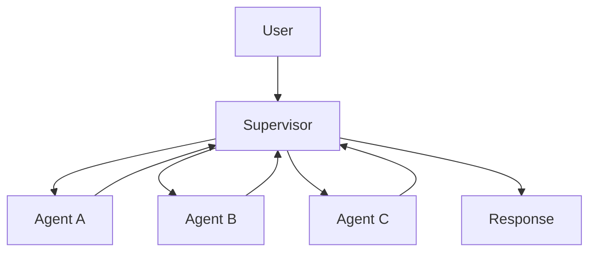
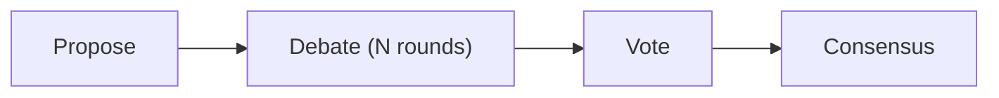
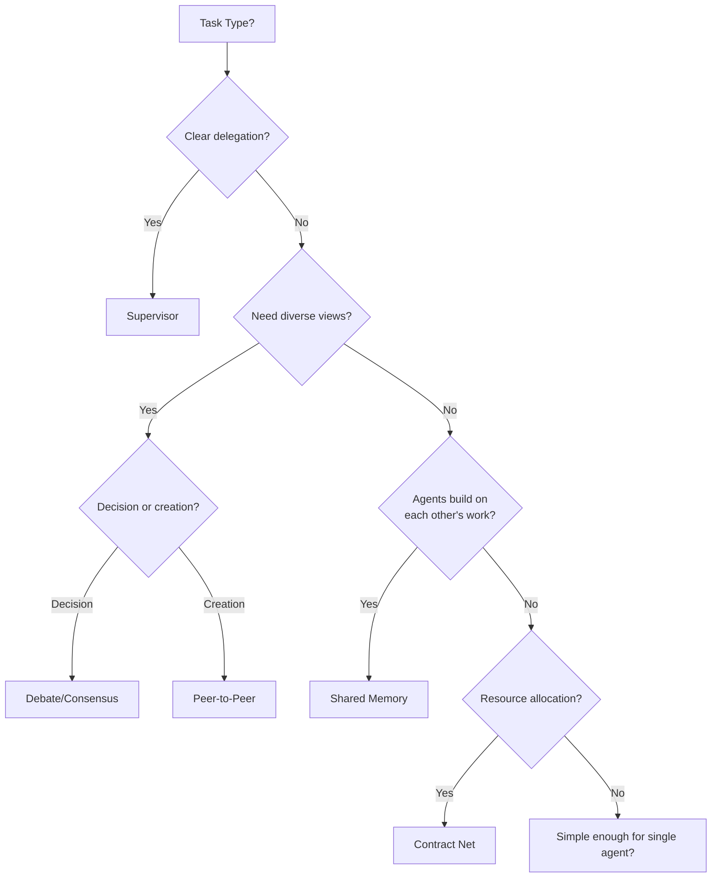
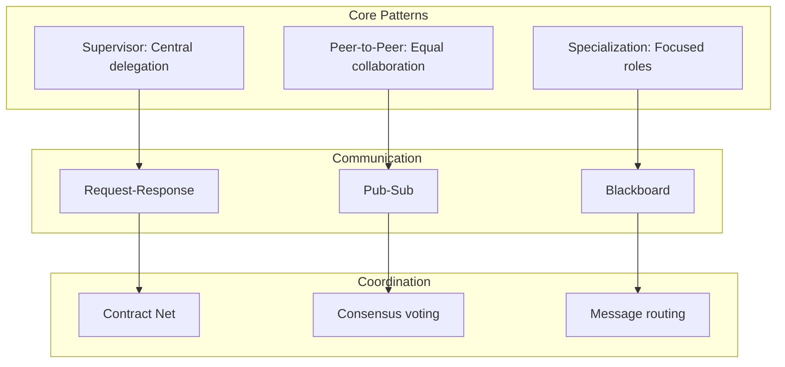

<!-- _class: lead -->

# Module 5: Multi-Agent Systems

**Cheatsheet — Quick Reference Card**

> Orchestration patterns, communication protocols, specialization, and coordination at a glance.

<!--
Speaker notes: Key talking points for this slide
- Transition slide: we are now moving into Module 5: Multi-Agent Systems
- Pause briefly to let the audience absorb the previous section
- Preview what is coming next in this section
-->
---

# Key Concepts

| Concept | Definition |
|---------|-----------|
| **Orchestrator** | Coordinator that assigns tasks and synthesizes results |
| **Supervisor Pattern** | One agent directs and manages other agents hierarchically |
| **Peer-to-Peer** | Agents collaborate as equals without central coordination |
| **Specialization** | Assigning specific roles and expertise to different agents |
| **Message Passing** | Structured messages between agents for communication |
| **Shared Memory** | Common state that multiple agents can read and write |
| **Blackboard System** | Collaborative workspace for posting partial solutions |
| **Consensus** | Agreement via voting or deliberation |
| **Agent Protocol** | Standardized format and rules for agent communication |

<!--
Speaker notes: Key talking points for this slide
- Explain the core concept on this slide clearly and concisely
- Relate it back to practical agent building scenarios
- Highlight any common pitfalls or misconceptions
- Connect to what was covered previously and what comes next
-->
---

# Supervisor Pattern

```python
class Supervisor:
    def __init__(self, agents):
        self.agents = agents

    def process_request(self, user_request):
        plan = self.create_plan(user_request)
        results = {}
        for step in plan:
            agent = self.agents[step["role"]]
            context = self.build_context(step, results)
            result = agent.execute(step["task"], context)
            results[step["role"]] = result
        return self.synthesize(user_request, results)
```



<!--
Speaker notes: Key talking points for this slide
- Walk through the code block line by line, emphasizing the key pattern
- The diagram below shows the architecture/flow visually
- Point out how the code maps to the diagram components
- Highlight any production considerations or gotchas
-->
---

# Peer-to-Peer & Blackboard

<div class="columns">
<div>

**Peer-to-Peer:**
```python
class CollaborativeAgent:
    def process_task(self, task):
        if self.can_handle(task):
            return self.solve(task)

        responses = []
        for peer in self.peers:
            response = peer.receive_message(
                {"from": self.name,
                 "request": task})
            responses.append(response)

        return self.combine_perspectives(
            responses)
```

</div>
<div>

**Blackboard:**
```python
class Blackboard:
    def __init__(self):
        self.memory = {}
        self.lock = asyncio.Lock()

    def write(self, key, value, agent_id):
        with self.lock:
            if key not in self.memory:
                self.memory[key] = []
```

</div>
</div>

<!--
Speaker notes: Key talking points for this slide
- Walk through the code example, focusing on the key pattern being demonstrated
- Highlight the most important lines and explain why they matter
- Point out any edge cases or production considerations
- This code is copy-paste ready for learners to try
-->
---

# Peer-to-Peer & Blackboard (continued)

```python
self.memory[key].append({
                "value": value,
                "agent": agent_id,
                "timestamp": time.time()
            })

    def read(self, key):
        with self.lock:
            return self.memory.get(key, [])
```

<!--
Speaker notes: Key talking points for this slide
- Continuation of the previous code block
- Walk through the remaining implementation details
- Highlight any key patterns or important lines
-->
---

# Consensus Building

```python
def debate_consensus(agents, question, rounds=3):
    proposals = []
    for agent in agents:
        proposal = agent.propose(question)
        proposals.append({"agent": agent.name, "proposal": proposal, "votes": 0})

    for round_num in range(rounds):
        for agent in agents:
            critiques = agent.critique(proposals)
            proposals = update_proposals(proposals, critiques)

    for agent in agents:
        vote = agent.vote(proposals)
        proposals[vote]["votes"] += 1

    winner = max(proposals, key=lambda p: p["votes"])
    return winner["proposal"]
```



<!--
Speaker notes: Key talking points for this slide
- Walk through the code block line by line, emphasizing the key pattern
- The diagram below shows the architecture/flow visually
- Point out how the code maps to the diagram components
- Highlight any production considerations or gotchas
-->
---

# Agent Team with Specialization

```python
class AgentTeam:
    def __init__(self):
        self.agents = {
            "researcher": ResearchAgent(tools=["web_search", "arxiv"]),
            "coder": CodingAgent(tools=["python_repl", "code_search"]),
            "tester": TestingAgent(tools=["pytest", "coverage"]),
            "reviewer": ReviewAgent(tools=["linter", "security_scan"])
        }

    def build_feature(self, requirement):
        research = self.agents["researcher"].investigate(requirement)
        code = self.agents["coder"].implement(requirement, research)
        tests = self.agents["tester"].create_tests(code)
        test_results = self.agents["tester"].run_tests(tests)
```

<!--
Speaker notes: Key talking points for this slide
- Walk through the code example, focusing on the key pattern being demonstrated
- Highlight the most important lines and explain why they matter
- Point out any edge cases or production considerations
- This code is copy-paste ready for learners to try
-->
---

# Agent Team with Specialization (continued)

```python
if not test_results["passed"]:
            code = self.agents["coder"].fix(code, test_results)

        review = self.agents["reviewer"].review(code, tests)
        return {"code": code, "tests": tests, "research": research,
                "review": review}
```

<!--
Speaker notes: Key talking points for this slide
- Continuation of the previous code block
- Walk through the remaining implementation details
- Highlight any key patterns or important lines
-->
---

# Gotchas

| Gotcha | Solution |
|--------|----------|
| Agents talking in circles | Set max rounds, track progress, use tie-breaking |
| Race conditions in shared memory | Use proper locking, append-only logs, version numbers |
| Orchestrator bottleneck | Async execution, hierarchical orchestration, caching |
| Specialization too narrow | Add generalist fallback, confidence-based routing |
| Consensus takes too long | Voting over deliberation, early stopping at majority |
| Message passing overhead | Batch messages, async communication, priorities |
| Context explosion | Summarize old messages, keep only relevant context |

```python
# Bad: Unlimited debate
while not consensus:
    for agent in agents:
        agent.respond_to_others()

# Good: Limited rounds with progress tracking
for round in range(max_rounds):
    new_info = any(is_novel(agent.respond_to_others()) for agent in agents)
    if not new_info:
        break  # Converged or stuck
```

<!--
Speaker notes: Key talking points for this slide
- Walk through the code example, focusing on the key pattern being demonstrated
- Highlight the most important lines and explain why they matter
- Point out any edge cases or production considerations
- This code is copy-paste ready for learners to try
-->
---

# Quick Decision Guide



| Pattern | When | When NOT |
|---------|------|----------|
| **Supervisor** | Clear decomposition, distinct specialists | Dynamic peer collaboration |
| **Peer-to-Peer** | Creative collaboration, diverse perspectives | Need central control |
| **Shared Memory** | Building on each other's work | Independent tasks |
| **Contract Net** | Variable costs/capabilities | Fixed assignments |
| **DON'T use multi-agent** | Simple tasks, real-time, limited budget | - |

<!--
Speaker notes: Key talking points for this slide
- Walk through the diagram from left to right (or top to bottom)
- Explain each component and the connections between them
- Relate this architecture back to practical use cases
-->
---

# Module 5 At a Glance



**You should now be able to:**
- Choose the right orchestration pattern for your problem structure
- Implement supervisor, peer-to-peer, hierarchical, pipeline, and debate patterns
- Design structured message formats and communication protocols
- Build specialized agents with focused prompts, tools, and knowledge
- Coordinate agents using contract net, consensus, and blackboard patterns
- Avoid common pitfalls like infinite loops, race conditions, and bottlenecks

<!--
Speaker notes: Key talking points for this slide
- Walk through the diagram from left to right (or top to bottom)
- Explain each component and the connections between them
- Relate this architecture back to practical use cases
-->