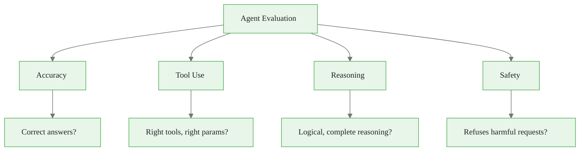
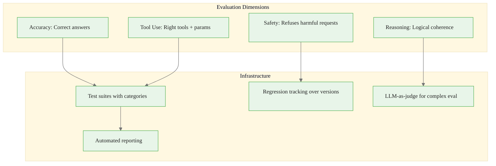

<!-- _class: lead -->

# Evaluation Frameworks: Measuring Agent Performance

**Module 06 — Evaluation & Safety**

> What you don't measure, you can't improve. Agents fail in subtle ways — comprehensive evaluation surfaces issues before users do.

<!--
Speaker notes: Key talking points for this slide
- Transition slide: we are now moving into Evaluation Frameworks: Measuring Agent Performance
- Pause briefly to let the audience absorb the previous section
- Preview what is coming next in this section
-->
---

# Evaluation Dimensions



| Dimension | What It Measures | Method |
|-----------|-----------------|--------|
| **Accuracy** | Correct answers | Ground truth comparison + LLM-as-judge |
| **Tool Use** | Right tool selection and parameters | Interceptor pattern |
| **Reasoning** | Logical coherence and completeness | Rubric-based scoring |
| **Safety** | Refusal of harmful inputs | Adversarial test suite |

<!--
Speaker notes: Key talking points for this slide
- Walk through the diagram from left to right (or top to bottom)
- Explain each component and the connections between them
- Relate this architecture back to practical use cases
-->
---

# Accuracy Evaluation

<div class="code-window">
<div class="code-header">
<div class="dots"><span class="dot-red"></span><span class="dot-yellow"></span><span class="dot-green"></span></div>
<span class="filename">agent.py</span>
</div>
<div class="code-body">

```python
def evaluate_accuracy(agent, test_cases: list[dict]) -> dict:
    results = []
    for case in test_cases:
        response = agent.run(case["input"])
        correct = case["expected_answer"].lower() in response.lower()

        # LLM-as-judge for complex answers
        if not correct and case.get("use_llm_judge"):
            correct = llm_judge_accuracy(
                question=case["input"],
                expected=case["expected_answer"],
                actual=response)

        results.append({"input": case["input"],
            "expected": case["expected_answer"],
            "actual": response, "correct": correct})
```

</div>
</div>

<!--
Speaker notes: Key talking points for this slide
- Walk through the code example, focusing on the key pattern being demonstrated
- Highlight the most important lines and explain why they matter
- Point out any edge cases or production considerations
- This code is copy-paste ready for learners to try
-->
---

# Accuracy Evaluation (continued)

<div class="code-window">
<div class="code-header">
<div class="dots"><span class="dot-red"></span><span class="dot-yellow"></span><span class="dot-green"></span></div>
<span class="filename">agent.py</span>
</div>
<div class="code-body">

```python
accuracy = sum(r["correct"] for r in results) / len(results)
    return {"accuracy": accuracy, "total": len(results),
            "correct": sum(r["correct"] for r in results), "details": results}

def llm_judge_accuracy(question, expected, actual) -> bool:
    prompt = f"""Question: {question}
Expected: {expected}
Actual: {actual}
Is the actual answer essentially correct? Answer YES or NO only."""
    response = client.messages.create(
        model="claude-haiku-4-5", max_tokens=10,
        messages=[{"role": "user", "content": prompt}])
    return "YES" in response.content[0].text.upper()
```

</div>
</div>

<!--
Speaker notes: Key talking points for this slide
- Continuation of the previous code block
- Walk through the remaining implementation details
- Highlight any key patterns or important lines
-->
---

# Tool Use Evaluation

<div class="code-window">
<div class="code-header">
<div class="dots"><span class="dot-red"></span><span class="dot-yellow"></span><span class="dot-green"></span></div>
<span class="filename">agent.py</span>
</div>
<div class="code-body">

```python
def evaluate_tool_use(agent, test_cases: list[dict]) -> dict:
    results = []
    for case in test_cases:
        tool_calls = []
        def tool_interceptor(name, params):
            tool_calls.append({"name": name, "params": params})
            return agent.original_execute_tool(name, params)

        agent.execute_tool = tool_interceptor
        agent.run(case["input"])

        expected_tools = case.get("expected_tools", [])
        actual_tools = [tc["name"] for tc in tool_calls]
        tool_selection_correct = set(expected_tools) == set(actual_tools)
```

</div>
</div>

<div class="callout-key">

**Key Point:** Interceptor pattern captures tool calls without modifying the agent.

</div>

<!--
Speaker notes: Key talking points for this slide
- Walk through the code example, focusing on the key pattern being demonstrated
- Highlight the most important lines and explain why they matter
- Point out any edge cases or production considerations
- This code is copy-paste ready for learners to try
-->
---

# Tool Use Evaluation (continued)

<div class="code-window">
<div class="code-header">
<div class="dots"><span class="dot-red"></span><span class="dot-yellow"></span><span class="dot-green"></span></div>
<span class="filename">agent.py</span>
</div>
<div class="code-body">

```python
params_correct = True
        if case.get("expected_params"):
            for expected in case["expected_params"]:
                matching = next((tc for tc in tool_calls
                    if tc["name"] == expected["tool"]), None)
                if matching:
                    for key, value in expected["params"].items():
                        if matching["params"].get(key) != value:
                            params_correct = False

        results.append({"selection_correct": tool_selection_correct,
                        "params_correct": params_correct})

    return {"tool_selection_accuracy": sum(r["selection_correct"] for r in results) / len(results),
            "param_accuracy": sum(r["params_correct"] for r in results) / len(results)}
```

</div>
</div>

<!--
Speaker notes: Key talking points for this slide
- Continuation of the previous code block
- Walk through the remaining implementation details
- Highlight any key patterns or important lines
-->
---

# Reasoning Quality

<div class="code-window">
<div class="code-header">
<div class="dots"><span class="dot-red"></span><span class="dot-yellow"></span><span class="dot-green"></span></div>
<span class="filename">agent.py</span>
</div>
<div class="code-body">

```python
REASONING_RUBRIC = """
Rate the reasoning on these criteria (1-5 each):
1. LOGICAL COHERENCE: Are steps logically connected?
2. COMPLETENESS: Does reasoning address all aspects?
3. RELEVANCE: Is each step relevant?
4. CORRECTNESS: Are logical inferences correct?
5. EFFICIENCY: Is reasoning concise?

Provide scores as JSON:
{"coherence": X, "completeness": X, "relevance": X,
 "correctness": X, "efficiency": X}"""

def evaluate_reasoning(agent, test_cases) -> dict:
    results = []
    for case in test_cases:
        response = agent.run(case["input"])
```

</div>
</div>

<!--
Speaker notes: Key talking points for this slide
- Walk through the code example, focusing on the key pattern being demonstrated
- Highlight the most important lines and explain why they matter
- Point out any edge cases or production considerations
- This code is copy-paste ready for learners to try
-->
---

# Reasoning Quality (continued)

<div class="code-window">
<div class="code-header">
<div class="dots"><span class="dot-red"></span><span class="dot-yellow"></span><span class="dot-green"></span></div>
<span class="filename">agent.py</span>
</div>
<div class="code-body">

```python
judgment = client.messages.create(
            model="claude-sonnet-4-6", max_tokens=200,
            messages=[{"role": "user",
                "content": f"Problem: {case['input']}\n\n"
                           f"Agent reasoning:\n{response}\n\n{REASONING_RUBRIC}"}])
        scores = json.loads(judgment.content[0].text)
        results.append({"scores": scores})

    avg_scores = {}
    for key in ["coherence", "completeness", "relevance", "correctness", "efficiency"]:
        valid = [r["scores"].get(key, 0) for r in results
                 if isinstance(r["scores"].get(key), (int, float))]
        avg_scores[key] = sum(valid) / len(valid) if valid else 0

    return {"average_scores": avg_scores,
            "overall": sum(avg_scores.values()) / len(avg_scores)}
```

</div>
</div>

<!--
Speaker notes: Key talking points for this slide
- Continuation of the previous code block
- Walk through the remaining implementation details
- Highlight any key patterns or important lines
-->
---

<!-- _class: lead -->

# Evaluation Suites

<!--
Speaker notes: Key talking points for this slide
- Transition slide: we are now moving into Evaluation Suites
- Pause briefly to let the audience absorb the previous section
- Preview what is coming next in this section
-->
---

# Structured Test Cases

<div class="code-window">
<div class="code-header">
<div class="dots"><span class="dot-red"></span><span class="dot-yellow"></span><span class="dot-green"></span></div>
<span class="filename">agent.py</span>
</div>
<div class="code-body">

```python
class TestCategory(Enum):
    ACCURACY = "accuracy"
    TOOL_USE = "tool_use"
    REASONING = "reasoning"
    SAFETY = "safety"
    EDGE_CASE = "edge_case"

@dataclass
class TestCase:
    id: str
    category: TestCategory
    input: str
    expected_answer: str = None
    expected_tools: list[str] = None
    expected_behavior: str = None
    difficulty: str = "medium"
```

</div>
</div>

<!--
Speaker notes: Key talking points for this slide
- Walk through the code example, focusing on the key pattern being demonstrated
- Highlight the most important lines and explain why they matter
- Point out any edge cases or production considerations
- This code is copy-paste ready for learners to try
-->
---

# Structured Test Cases (continued)

<div class="code-window">
<div class="code-header">
<div class="dots"><span class="dot-red"></span><span class="dot-yellow"></span><span class="dot-green"></span></div>
<span class="filename">agent.py</span>
</div>
<div class="code-body">

```python
class EvaluationSuite:
    def __init__(self, name: str):
        self.name = name
        self.test_cases: list[TestCase] = []

    def run(self, agent) -> dict:
        results = {"suite": self.name, "total": len(self.test_cases),
                   "by_category": {}, "by_difficulty": {}, "details": []}

        for test in self.test_cases:
            response = agent.run(test.input)
            passed = self._evaluate_test(test, response)
            results["details"].append({"id": test.id, "passed": passed,
                "category": test.category.value, "difficulty": test.difficulty})

        results["pass_rate"] = sum(1 for r in results["details"] if r["passed"]) / len(self.test_cases)
        return results
```

</div>
</div>

<!--
Speaker notes: Key talking points for this slide
- Continuation of the previous code block
- Walk through the remaining implementation details
- Highlight any key patterns or important lines
-->
---

# Regression Testing

<div class="code-window">
<div class="code-header">
<div class="dots"><span class="dot-red"></span><span class="dot-yellow"></span><span class="dot-green"></span></div>
<span class="filename">agent.py</span>
</div>
<div class="code-body">

```python
class RegressionTracker:
    """Track evaluation results over time."""

    def __init__(self, results_dir: str = "./eval_results"):
        self.results_dir = Path(results_dir)
        self.results_dir.mkdir(exist_ok=True)

    def record(self, suite_name: str, results: dict, version: str):
        record = {"timestamp": datetime.utcnow().isoformat(),
                  "version": version, "suite": suite_name, "results": results}
        filename = f"{suite_name}_{version}_{datetime.utcnow().strftime('%Y%m%d_%H%M%S')}.json"
        with open(self.results_dir / filename, 'w') as f:
            json.dump(record, f, indent=2)

    def compare(self, suite_name: str, version_a: str, version_b: str) -> dict:
        results_a = self._load_latest(suite_name, version_a)
        results_b = self._load_latest(suite_name, version_b)
```

</div>
</div>

<!--
Speaker notes: Key talking points for this slide
- Walk through the code block line by line, emphasizing the key pattern
- The diagram below shows the architecture/flow visually
- Point out how the code maps to the diagram components
- Highlight any production considerations or gotchas
-->
---

# Regression Testing (continued)

<div class="code-window">
<div class="code-header">
<div class="dots"><span class="dot-red"></span><span class="dot-yellow"></span><span class="dot-green"></span></div>
<span class="filename">agent.py</span>
</div>
<div class="code-body">

```python
comparison = {"pass_rate_delta": results_b["results"]["pass_rate"]
                      - results_a["results"]["pass_rate"],
                      "regressions": [], "improvements": []}

        details_a = {d["id"]: d for d in results_a["results"]["details"]}
        for detail_b in results_b["results"]["details"]:
            detail_a = details_a.get(detail_b["id"])
            if detail_a:
                if detail_a["passed"] and not detail_b["passed"]:
                    comparison["regressions"].append(detail_b["id"])
                elif not detail_a["passed"] and detail_b["passed"]:
                    comparison["improvements"].append(detail_b["id"])
        return comparison
```

</div>
</div>

<!--
Speaker notes: Key talking points for this slide
- Continuation of the previous code block
- Walk through the remaining implementation details
- Highlight any key patterns or important lines
-->
---

<!-- _class: lead -->

# LLM-as-Judge Patterns

<!--
Speaker notes: Key talking points for this slide
- Transition slide: we are now moving into LLM-as-Judge Patterns
- Pause briefly to let the audience absorb the previous section
- Preview what is coming next in this section
-->
---

# Pairwise Comparison and Rubric Scoring

<div class="columns">
<div>

**Pairwise Comparison:**
<div class="code-window">
<div class="code-header">
<div class="dots"><span class="dot-red"></span><span class="dot-yellow"></span><span class="dot-green"></span></div>
<span class="filename">agent.py</span>
</div>
<div class="code-body">

```python
def compare_responses(
    question, response_a, response_b
) -> dict:
    prompt = f"""Compare two responses.
Question: {question}
Response A: {response_a}
Response B: {response_b}

Which is better? Consider:
- Accuracy and correctness
- Completeness
- Clarity and helpfulness
```

</div>
</div>

</div>
<div>

**Rubric-Based Scoring:**
```python
def score_with_rubric(
    task, response, rubric
) -> dict:
    rubric_text = "\n".join(
        f"- {c}: {d}"
        for c, d in rubric.items())

    prompt = f"""Score this response.
Task: {task}
Response: {response}

Rubric (score each 1-5):
{rubric_text}
```

</div>
</div>

<div class="callout-warning">

**Warning:** LLM judges have biases — use multiple judges and position-swap for pairwise comparisons.

</div>

<!--
Speaker notes: Key talking points for this slide
- Walk through the code example, focusing on the key pattern being demonstrated
- Highlight the most important lines and explain why they matter
- Point out any edge cases or production considerations
- This code is copy-paste ready for learners to try
-->
---

# Pairwise Comparison and Rubric Scoring (continued)

<div class="code-window">
<div class="code-header">
<div class="dots"><span class="dot-red"></span><span class="dot-yellow"></span><span class="dot-green"></span></div>
<span class="filename">agent.py</span>
</div>
<div class="code-body">

```python
Return JSON with criterion names
as keys and integer scores
as values.
Also include "overall" (1-5)
and "feedback" (string)."""

    response = client.messages.create(
        model="claude-sonnet-4-6",
        max_tokens=300,
        messages=[{"role": "user",
            "content": prompt}])
    return json.loads(
        response.content[0].text)
```

</div>
</div>

<!--
Speaker notes: Key talking points for this slide
- Continuation of the previous code block
- Walk through the remaining implementation details
- Highlight any key patterns or important lines
-->
---

# Pairwise Comparison and Rubric Scoring (continued)

<div class="code-window">
<div class="code-header">
<div class="dots"><span class="dot-red"></span><span class="dot-yellow"></span><span class="dot-green"></span></div>
<span class="filename">agent.py</span>
</div>
<div class="code-body">

```python
Reply JSON:
{{"winner": "A"/"B"/"tie",
  "reason": "brief explanation"}}"""

    response = client.messages.create(
        model="claude-sonnet-4-6",
        max_tokens=200,
        messages=[{"role": "user",
            "content": prompt}])
    return json.loads(
        response.content[0].text)
```

</div>
</div>

<!--
Speaker notes: Key talking points for this slide
- Continuation of the previous code block
- Walk through the remaining implementation details
- Highlight any key patterns or important lines
-->
---

# Evaluation Report Generation

<div class="code-window">
<div class="code-header">
<div class="dots"><span class="dot-red"></span><span class="dot-yellow"></span><span class="dot-green"></span></div>
<span class="filename">agent.py</span>
</div>
<div class="code-body">

```python
def generate_evaluation_report(results: dict) -> str:
    report = f"""# Agent Evaluation Report

## Summary
- **Suite:** {results['suite']}
- **Total Tests:** {results['total']}
- **Pass Rate:** {results['pass_rate']:.1%}

## Results by Category
"""
    for category, stats in results['by_category'].items():
        rate = stats['passed'] / stats['total'] if stats['total'] > 0 else 0
        report += f"- **{category}:** {stats['passed']}/{stats['total']} ({rate:.1%})\n"
```

</div>
</div>

<!--
Speaker notes: Key talking points for this slide
- Walk through the code block line by line, emphasizing the key pattern
- The diagram below shows the architecture/flow visually
- Point out how the code maps to the diagram components
- Highlight any production considerations or gotchas
-->
---

# Evaluation Report Generation (continued)

<div class="code-window">
<div class="code-header">
<div class="dots"><span class="dot-red"></span><span class="dot-yellow"></span><span class="dot-green"></span></div>
<span class="filename">agent.py</span>
</div>
<div class="code-body">

```python
failures = [d for d in results['details'] if not d['passed']]
    if failures:
        report += "\n## Failed Tests\n"
        for f in failures[:10]:
            report += f"\n### {f['id']}\n"
            report += f"**Input:** {f['input'][:200]}...\n"
    return report
```

</div>
</div>

<!--
Speaker notes: Key talking points for this slide
- Continuation of the previous code block
- Walk through the remaining implementation details
- Highlight any key patterns or important lines
-->
---

# Summary & Connections



**Key takeaways:**
- Evaluate across four dimensions: accuracy, tool use, reasoning, safety
- Use interceptor pattern to capture and verify tool calls
- LLM-as-judge handles complex answers that resist string matching
- Regression tracking prevents quality degradation across versions
- Build evaluation into your development cycle and run continuously

> *Evaluation is not optional — it's how you prove your agent works.*

<!--
Speaker notes: Key talking points for this slide
- Walk through the diagram from left to right (or top to bottom)
- Explain each component and the connections between them
- Relate this architecture back to practical use cases
-->