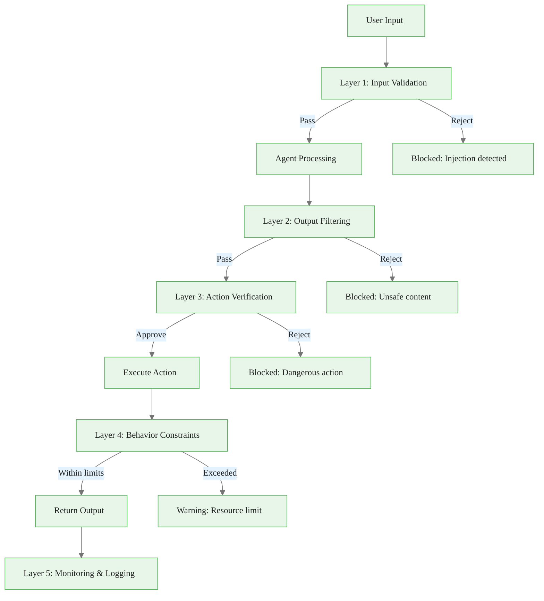
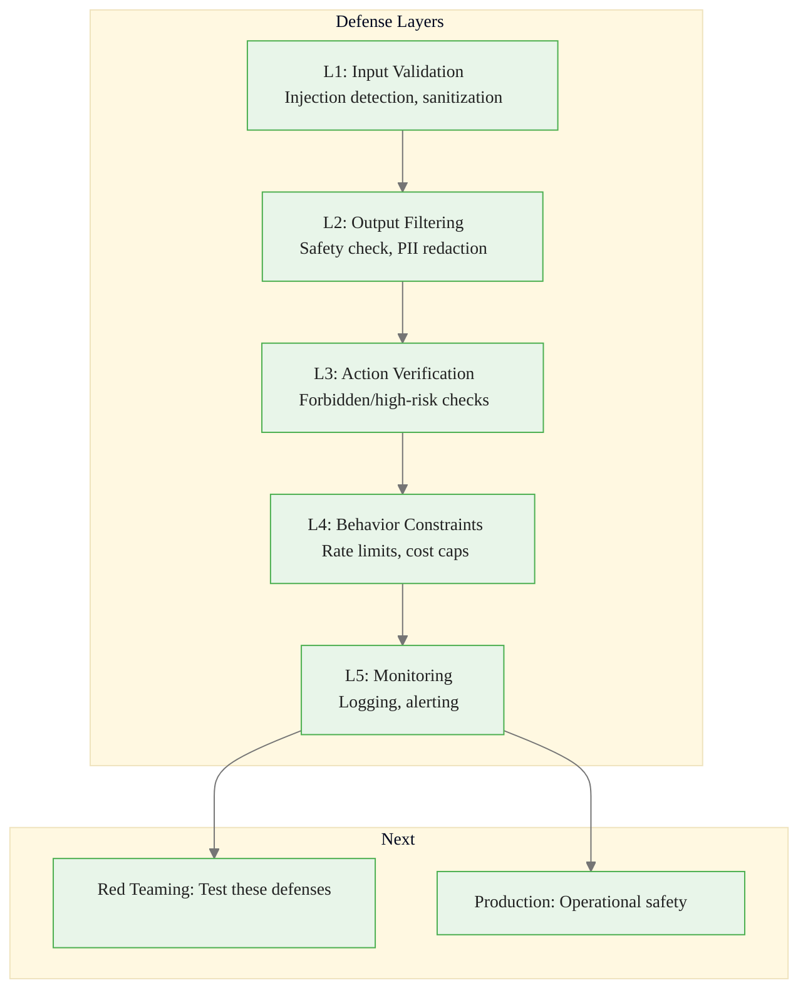

<!-- _class: lead -->

# Safety Guardrails for AI Agents

**Module 06 — Evaluation & Safety**

> Agents are more dangerous than static LLMs because they can act in the world. Guardrails must protect not just what agents say, but what they do.

<!--
Speaker notes: Key talking points for this slide
- Transition slide: we are now moving into Safety Guardrails for AI Agents
- Pause briefly to let the audience absorb the previous section
- Preview what is coming next in this section
-->
---

# Defense-in-Depth Architecture



<div class="callout-key">

**Key Point:** No single layer is perfect — multiple independent layers dramatically reduce risk.

</div>

<!--
Speaker notes: Key talking points for this slide
- Walk through the diagram from left to right (or top to bottom)
- Explain each component and the connections between them
- Relate this architecture back to practical use cases
-->
---

<!-- _class: lead -->

# Layer 1: Input Validation

<!--
Speaker notes: Key talking points for this slide
- Transition slide: we are now moving into Layer 1: Input Validation
- Pause briefly to let the audience absorb the previous section
- Preview what is coming next in this section
-->
---

# Input Guardrails

<div class="code-window">
<div class="code-header">
<div class="dots"><span class="dot-red"></span><span class="dot-yellow"></span><span class="dot-green"></span></div>
<span class="filename">agent.py</span>
</div>
<div class="code-body">

```python
class InputGuardrails:
    def __init__(self):
        self.injection_patterns = [
            r"ignore previous instructions",
            r"disregard all prior",
            r"new instructions:",
            r"system prompt:",
            r"</system>",
            r"<\|im_start\|>",
        ]
```

</div>
</div>

<!--
Speaker notes: Key talking points for this slide
- Walk through the code example, focusing on the key pattern being demonstrated
- Highlight the most important lines and explain why they matter
- Point out any edge cases or production considerations
- This code is copy-paste ready for learners to try
-->
---

# Input Guardrails (continued)

<div class="code-window">
<div class="code-header">
<div class="dots"><span class="dot-red"></span><span class="dot-yellow"></span><span class="dot-green"></span></div>
<span class="filename">agent.py</span>
</div>
<div class="code-body">

```python
self.max_input_length = 10000
        self.blocked_phrases = [
            "how to make explosives",
            "hack into",
            "bypass security",
        ]

    def validate_input(self, user_input: str) -> tuple[bool, Optional[str]]:
        if len(user_input) > self.max_input_length:
            return False, f"Input too long ({len(user_input)} > {self.max_input_length})"
```

</div>
</div>

<!--
Speaker notes: Key talking points for this slide
- Continuation of the previous code block
- Walk through the remaining implementation details
- Highlight any key patterns or important lines
-->
---

# Input Guardrails (continued)

<div class="code-window">
<div class="code-header">
<div class="dots"><span class="dot-red"></span><span class="dot-yellow"></span><span class="dot-green"></span></div>
<span class="filename">agent.py</span>
</div>
<div class="code-body">

```python
for pattern in self.injection_patterns:
            if re.search(pattern, user_input, re.IGNORECASE):
                return False, f"Potential prompt injection detected"

        user_input_lower = user_input.lower()
        for phrase in self.blocked_phrases:
            if phrase in user_input_lower:
                return False, f"Blocked content detected"

        return True, None

    def sanitize_input(self, user_input: str) -> str:
        sanitized = user_input.replace("<|", "").replace("|>", "")
        sanitized = sanitized.replace("</system>", "").replace("<system>", "")
        return " ".join(sanitized.split())
```

</div>
</div>

<!--
Speaker notes: Key talking points for this slide
- Continuation of the previous code block
- Walk through the remaining implementation details
- Highlight any key patterns or important lines
-->
---

<!-- _class: lead -->

# Layer 2: Output Filtering

<!--
Speaker notes: Key talking points for this slide
- Transition slide: we are now moving into Layer 2: Output Filtering
- Pause briefly to let the audience absorb the previous section
- Preview what is coming next in this section
-->
---

# Output Safety Check + PII Redaction

<div class="columns">
<div>

**Safety Evaluation:**
<div class="code-window">
<div class="code-header">
<div class="dots"><span class="dot-red"></span><span class="dot-yellow"></span><span class="dot-green"></span></div>
<span class="filename">agent.py</span>
</div>
<div class="code-body">

```python
class OutputGuardrails:
    def is_output_safe(self, output):
        safety_prompt = f"""Evaluate
for safety issues:

OUTPUT: {output}

Check for:
1. Harmful/dangerous content
2. Personal attacks
3. Biased language
4. Privacy violations (PII)
5. Hallucinations as fact
```

</div>
</div>

</div>
<div>

**PII Redaction:**
```python
def redact_pii(self, text: str) -> str:
    # Email addresses
    text = re.sub(
        r'\b[A-Za-z0-9._%+-]+@'
        r'[A-Za-z0-9.-]+\.[A-Z|a-z]{2,}\b',
        '[EMAIL_REDACTED]', text)

    # Phone numbers
    text = re.sub(
        r'\b\d{3}[-.]?\d{3}[-.]?\d{4}\b',
        '[PHONE_REDACTED]', text)
```

</div>
</div>

<!--
Speaker notes: Key talking points for this slide
- Walk through the code example, focusing on the key pattern being demonstrated
- Highlight the most important lines and explain why they matter
- Point out any edge cases or production considerations
- This code is copy-paste ready for learners to try
-->
---

# Output Safety Check + PII Redaction (continued)

<div class="code-window">
<div class="code-header">
<div class="dots"><span class="dot-red"></span><span class="dot-yellow"></span><span class="dot-green"></span></div>
<span class="filename">agent.py</span>
</div>
<div class="code-body">

```python
# SSN-like patterns
    text = re.sub(
        r'\b\d{3}-\d{2}-\d{4}\b',
        '[SSN_REDACTED]', text)

    # Credit card patterns
    text = re.sub(
        r'\b\d{4}[- ]?\d{4}[- ]?'
        r'\d{4}[- ]?\d{4}\b',
        '[CARD_REDACTED]', text)

    return text
```

</div>
</div>

<!--
Speaker notes: Key talking points for this slide
- Continuation of the previous code block
- Walk through the remaining implementation details
- Highlight any key patterns or important lines
-->
---

# Output Safety Check + PII Redaction (continued)

<div class="code-window">
<div class="code-header">
<div class="dots"><span class="dot-red"></span><span class="dot-yellow"></span><span class="dot-green"></span></div>
<span class="filename">agent.py</span>
</div>
<div class="code-body">

```python
Respond JSON:
{{"is_safe": true/false,
  "issues": ["..."],
  "severity": "none"|"low"|
    "medium"|"high"|"critical"
}}"""

        result = json.loads(
            response.content[0].text)
        if not result["is_safe"]:
            return False, result["issues"]
        return True, None
```

</div>
</div>

<!--
Speaker notes: Key talking points for this slide
- Continuation of the previous code block
- Walk through the remaining implementation details
- Highlight any key patterns or important lines
-->
---

<!-- _class: lead -->

# Layer 3: Action Verification

<!--
Speaker notes: Key talking points for this slide
- Transition slide: we are now moving into Layer 3: Action Verification
- Pause briefly to let the audience absorb the previous section
- Preview what is coming next in this section
-->
---

# Action Guardrails

<div class="code-window">
<div class="code-header">
<div class="dots"><span class="dot-red"></span><span class="dot-yellow"></span><span class="dot-green"></span></div>
<span class="filename">agent.py</span>
</div>
<div class="code-body">

```python
class ActionGuardrails:
    def __init__(self):
        self.high_risk_actions = {
            "delete_file", "execute_code", "send_email",
            "make_payment", "modify_database"}
        self.forbidden_actions = {
            "format_disk", "drop_database", "disable_security"}

    def verify_action(self, action_name, action_params, context):
        if action_name in self.forbidden_actions:
            return False, f"Action '{action_name}' is forbidden"

        if action_name in self.high_risk_actions:
            if not context.get("user_approved", False):
                return False, f"Action '{action_name}' requires user approval"
```

</div>
</div>

<!--
Speaker notes: Key talking points for this slide
- Walk through the code block line by line, emphasizing the key pattern
- The diagram below shows the architecture/flow visually
- Point out how the code maps to the diagram components
- Highlight any production considerations or gotchas
-->
---

# Action Guardrails (continued)

<div class="code-window">
<div class="code-header">
<div class="dots"><span class="dot-red"></span><span class="dot-yellow"></span><span class="dot-green"></span></div>
<span class="filename">agent.py</span>
</div>
<div class="code-body">

```python
if action_name == "execute_code":
            return self._verify_code_execution(action_params)
        elif action_name == "delete_file":
            return self._verify_file_deletion(action_params)
        return True, None

    def _verify_code_execution(self, params):
        dangerous_patterns = [r"import os", r"import subprocess",
            r"eval\(", r"exec\(", r"__import__"]
        for pattern in dangerous_patterns:
            if re.search(pattern, params.get("code", "")):
                return False, f"Dangerous operation: {pattern}"
        return True, None
```

</div>
</div>

<!--
Speaker notes: Key talking points for this slide
- Continuation of the previous code block
- Walk through the remaining implementation details
- Highlight any key patterns or important lines
-->
---

<!-- _class: lead -->

# Layer 4: Behavior Constraints

<!--
Speaker notes: Key talking points for this slide
- Transition slide: we are now moving into Layer 4: Behavior Constraints
- Pause briefly to let the audience absorb the previous section
- Preview what is coming next in this section
-->
---

# Rate Limiting and Resource Caps

<div class="code-window">
<div class="code-header">
<div class="dots"><span class="dot-red"></span><span class="dot-yellow"></span><span class="dot-green"></span></div>
<span class="filename">agent.py</span>
</div>
<div class="code-body">

```python
class BehaviorGuardrails:
    def __init__(self):
        self.request_counts = defaultdict(list)
        self.max_requests_per_minute = 60
        self.max_tokens_per_request = 4000
        self.max_tool_calls_per_request = 10
        self.max_execution_time = 300  # seconds
        self.max_cost_per_request = 1.00
        self.max_cost_per_day = 100.00
        self.daily_cost = 0.0

    def check_rate_limit(self, user_id: str):
        now = time.time()
        self.request_counts[user_id] = [
            t for t in self.request_counts[user_id] if now - t < 3600]
```

</div>
</div>

<!--
Speaker notes: Key talking points for this slide
- Walk through the code example, focusing on the key pattern being demonstrated
- Highlight the most important lines and explain why they matter
- Point out any edge cases or production considerations
- This code is copy-paste ready for learners to try
-->
---

# Rate Limiting and Resource Caps (continued)

<div class="code-window">
<div class="code-header">
<div class="dots"><span class="dot-red"></span><span class="dot-yellow"></span><span class="dot-green"></span></div>
<span class="filename">agent.py</span>
</div>
<div class="code-body">

```python
recent = [t for t in self.request_counts[user_id] if now - t < 60]
        if len(recent) >= self.max_requests_per_minute:
            return False, "Rate limit exceeded (per minute)"

        self.request_counts[user_id].append(now)
        return True, None

    def check_cost_limit(self, estimated_cost: float):
        if estimated_cost > self.max_cost_per_request:
            return False, f"Per-request cost limit exceeded (${estimated_cost:.2f})"
        if self.daily_cost + estimated_cost > self.max_cost_per_day:
            return False, f"Daily cost limit exceeded"
        self.daily_cost += estimated_cost
        return True, None
```

</div>
</div>

<!--
Speaker notes: Key talking points for this slide
- Continuation of the previous code block
- Walk through the remaining implementation details
- Highlight any key patterns or important lines
-->
---

# Integrated SafeAgent

<div class="code-window">
<div class="code-header">
<div class="dots"><span class="dot-red"></span><span class="dot-yellow"></span><span class="dot-green"></span></div>
<span class="filename">agent.py</span>
</div>
<div class="code-body">

```python
class SafeAgent:
    """Agent with comprehensive safety guardrails."""

    def __init__(self, client: Anthropic):
        self.client = client
        self.input_guardrails = InputGuardrails()
        self.output_guardrails = OutputGuardrails(client)
        self.action_guardrails = ActionGuardrails()
        self.behavior_guardrails = BehaviorGuardrails()

    def execute(self, user_input: str, user_id: str, context: dict) -> str:
        # Layer 1: Input validation
        is_valid, error = self.input_guardrails.validate_input(user_input)
        if not is_valid:
            return f"Input rejected: {error}"

        sanitized = self.input_guardrails.sanitize_input(user_input)
```

</div>
</div>

<!--
Speaker notes: Key talking points for this slide
- Walk through the code example, focusing on the key pattern being demonstrated
- Highlight the most important lines and explain why they matter
- Point out any edge cases or production considerations
- This code is copy-paste ready for learners to try
-->
---

# Integrated SafeAgent (continued)

<div class="code-window">
<div class="code-header">
<div class="dots"><span class="dot-red"></span><span class="dot-yellow"></span><span class="dot-green"></span></div>
<span class="filename">agent.py</span>
</div>
<div class="code-body">

```python
# Layer 4: Rate limiting
        is_allowed, error = self.behavior_guardrails.check_rate_limit(user_id)
        if not is_allowed:
            return f"Request rejected: {error}"

        # Execute agent
        response = self.client.messages.create(
            model="claude-sonnet-4-6", max_tokens=2048,
            messages=[{"role": "user", "content": sanitized}])
        output = response.content[0].text

        # Layer 2: Output filtering
        is_safe, error = self.output_guardrails.is_output_safe(output)
        if not is_safe:
            return f"Output blocked: {error}"

        return self.output_guardrails.redact_pii(output)
```

</div>
</div>

<!--
Speaker notes: Key talking points for this slide
- Continuation of the previous code block
- Walk through the remaining implementation details
- Highlight any key patterns or important lines
-->
---

# Common Pitfalls

| Pitfall | Problem | Solution |
|---------|---------|----------|
| **Too restrictive** | Blocks legitimate requests | Context-aware filtering, confidence thresholds |
| **Single layer** | One bypass = full compromise | Defense in depth: input + output + action + behavior |
| **Silent failures** | Can't improve guardrails | Detailed logging + alerting |
| **Ignoring patterns** | Misses repeated attackers | Track attack patterns, flag suspicious accounts |

<div class="code-window">
<div class="code-header">
<div class="dots"><span class="dot-red"></span><span class="dot-yellow"></span><span class="dot-green"></span></div>
<span class="filename">agent.py</span>
</div>
<div class="code-body">

```python
# Bad: Over-blocking
if any(word in input for word in ["medical", "legal"]):
    return "Blocked"

# Good: Context-aware
if is_asking_for_medical_diagnosis(input) and not user_is_doctor(user_id):
    return "Cannot provide diagnosis. Please consult a doctor."
```

</div>
</div>

<div class="callout-warning">

**Warning:** Balance safety with helpfulness — overly cautious agents frustrate users.

</div>

<!--
Speaker notes: Key talking points for this slide
- Walk through the code example, focusing on the key pattern being demonstrated
- Highlight the most important lines and explain why they matter
- Point out any edge cases or production considerations
- This code is copy-paste ready for learners to try
-->
---

# Summary & Connections



**Key takeaways:**
- Defense in depth: 5 layers of independent safety controls
- Input validation catches prompt injection and blocked content
- Output filtering blocks harmful responses and redacts PII
- Action verification prevents dangerous tool calls
- Behavior constraints enforce rate limits, resource caps, and cost budgets
- Log everything — you can't improve what you don't track

> *Safety is not a feature — it's a requirement.*

<!--
Speaker notes: Key talking points for this slide
- Walk through the diagram from left to right (or top to bottom)
- Explain each component and the connections between them
- Relate this architecture back to practical use cases
-->