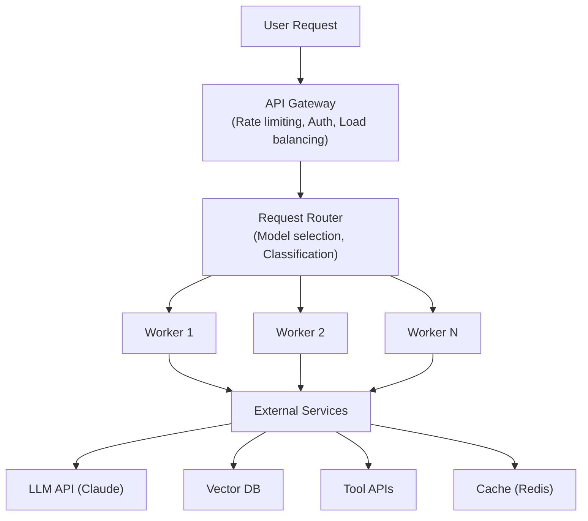
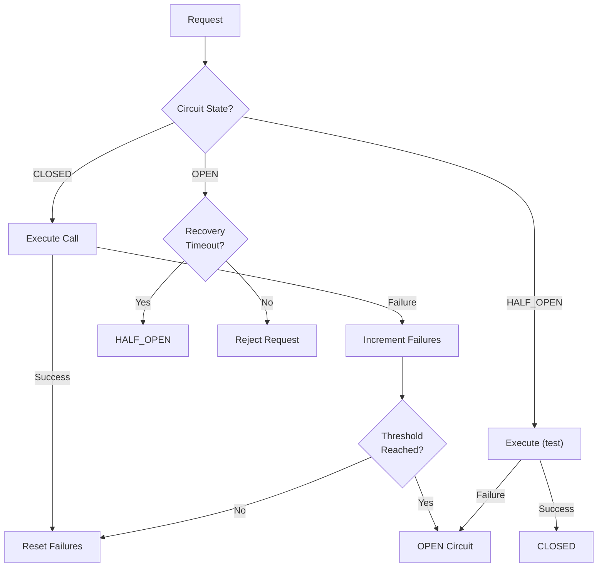
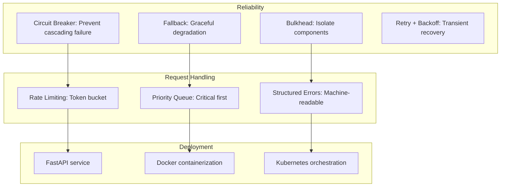

<!-- _class: lead -->

# Production Architecture: Designing for Reliability

**Module 07 — Production Deployment**

> Production readiness is about failure handling. Assume everything will fail — APIs timeout, models hallucinate, users send garbage. Build systems that fail gracefully and recover automatically.

<!--
Speaker notes: Key talking points for this slide
- Transition slide: we are now moving into Production Architecture: Designing for Reliability
- Pause briefly to let the audience absorb the previous section
- Preview what is coming next in this section
-->
---

# Reference Architecture



**Worker Components:**
- Input Validation
- Context Manager (Memory, RAG)
- LLM Client (with retries)
- Tool Executor (sandboxed)
- Output Validator

<!--
Speaker notes: Key talking points for this slide
- Walk through the diagram from left to right (or top to bottom)
- Explain each component and the connections between them
- Relate this architecture back to practical use cases
-->
---

# Production Agent Configuration

```python
@dataclass
class AgentConfig:
    model: str = "claude-sonnet-4-6"
    max_tokens: int = 4096
    max_retries: int = 3
    timeout_seconds: int = 120
    max_tool_calls: int = 10
    enable_caching: bool = True
    log_level: str = "INFO"
```

```python
class ProductionAgent:
    def __init__(self, config: AgentConfig):
        self.config = config
        self.client = anthropic.Anthropic()
        self.cache = RedisCache() if config.enable_caching else None
        self.metrics = MetricsCollector()
        self.logger = StructuredLogger(config.log_level)
```

> 🔑 Externalize configuration — never hardcode models, timeouts, or limits.

<!--
Speaker notes: Key talking points for this slide
- Walk through the code example, focusing on the key pattern being demonstrated
- Highlight the most important lines and explain why they matter
- Point out any edge cases or production considerations
- This code is copy-paste ready for learners to try
-->
---

# Production Request Lifecycle

```python
async def run(self, request_id: str, user_input: str) -> dict:
    span = self.start_trace(request_id)

    try:
        validated_input = self.validate_input(user_input)         # Layer 1

        if self.cache:                                             # Layer 2
            cached = await self.cache.get(validated_input)
            if cached:
                self.metrics.increment("cache_hit")
                return cached

        result = await self._process_with_retry(validated_input)   # Layer 3
        validated_output = self.validate_output(result)            # Layer 4
```

<!--
Speaker notes: Key talking points for this slide
- Walk through the code example, focusing on the key pattern being demonstrated
- Highlight the most important lines and explain why they matter
- Point out any edge cases or production considerations
- This code is copy-paste ready for learners to try
-->
---

# Production Request Lifecycle (continued)

```python
if self.cache:
            await self.cache.set(validated_input, validated_output)

        self.metrics.increment("success")
        return {"status": "success", "result": validated_output}

    except ValidationError as e:
        return {"status": "error", "error": str(e), "code": "INVALID_INPUT"}
    except RateLimitError as e:
        return {"status": "error", "error": "Service busy", "code": "RATE_LIMITED"}
    except Exception as e:
        self.logger.error("Unexpected error", error=str(e), request_id=request_id)
        return {"status": "error", "error": "Internal error", "code": "INTERNAL"}
    finally:
        span.end()
```

<!--
Speaker notes: Key talking points for this slide
- Continuation of the previous code block
- Walk through the remaining implementation details
- Highlight any key patterns or important lines
-->
---

<!-- _class: lead -->

# Reliability Patterns

<!--
Speaker notes: Key talking points for this slide
- Transition slide: we are now moving into Reliability Patterns
- Pause briefly to let the audience absorb the previous section
- Preview what is coming next in this section
-->
---

# Circuit Breaker



> 🔑 Circuit breakers prevent cascading failures — when a dependency is down, fail fast instead of waiting.

<!--
Speaker notes: Key talking points for this slide
- Walk through the diagram from left to right (or top to bottom)
- Explain each component and the connections between them
- Relate this architecture back to practical use cases
-->
---

# Circuit Breaker Implementation

```python
class CircuitBreaker:
    def __init__(self, failure_threshold: int = 5,
                 recovery_timeout: timedelta = timedelta(seconds=60),
                 half_open_requests: int = 3):
        self.failure_threshold = failure_threshold
        self.recovery_timeout = recovery_timeout
        self.half_open_requests = half_open_requests
        self.state = CircuitState.CLOSED
        self.failures = 0
```

<!--
Speaker notes: Key talking points for this slide
- Walk through the code example, focusing on the key pattern being demonstrated
- Highlight the most important lines and explain why they matter
- Point out any edge cases or production considerations
- This code is copy-paste ready for learners to try
-->
---

# Circuit Breaker Implementation (continued)

```python
async def call(self, func, *args, **kwargs):
        if self.state == CircuitState.OPEN:
            if self._should_attempt_recovery():
                self.state = CircuitState.HALF_OPEN
            else:
                raise CircuitOpenError("Circuit breaker is open")
        try:
            result = await func(*args, **kwargs)
            self._record_success()
            return result
        except Exception as e:
            self._record_failure()
            raise
```

<!--
Speaker notes: Key talking points for this slide
- Continuation of the previous code block
- Walk through the remaining implementation details
- Highlight any key patterns or important lines
-->
---

# Fallback & Bulkhead Patterns

<div class="columns">
<div>

**Fallback Strategies:**
```python
class FallbackAgent:
    def __init__(self):
        self.primary = "claude-sonnet-4-6"
        self.fallback = "claude-haiku-4-5"
        self.emergency = "Technical difficulties."

    async def run(self, query: str) -> str:
        # Try primary model
        try:
            return await self._call_model(
                query, self.primary)
        except (RateLimitError, TimeoutError):
            pass
```

</div>
<div>

**Bulkhead Isolation:**
```python
from asyncio import Semaphore

class BulkheadAgent:
    """Isolate failures per component."""

    def __init__(self,
                 max_concurrent_llm: int = 10,
                 max_concurrent_tools: int = 5):
        self.llm_semaphore = Semaphore(
            max_concurrent_llm)
        self.tool_semaphore = Semaphore(
            max_concurrent_tools)
```

</div>
</div>

> ⚠️ Without bulkheads, a slow tool can exhaust all connections and bring down LLM calls too.

<!--
Speaker notes: Key talking points for this slide
- Walk through the code example, focusing on the key pattern being demonstrated
- Highlight the most important lines and explain why they matter
- Point out any edge cases or production considerations
- This code is copy-paste ready for learners to try
-->
---

# Fallback & Bulkhead Patterns (continued)

```python
async def call_llm(self, messages):
        async with self.llm_semaphore:
            return await self._llm_call(
                messages)

    async def call_tool(self, name, params):
        async with self.tool_semaphore:
            return await self._tool_call(
                name, params)
```

<!--
Speaker notes: Key talking points for this slide
- Continuation of the previous code block
- Walk through the remaining implementation details
- Highlight any key patterns or important lines
-->
---

# Fallback & Bulkhead Patterns (continued)

```python
# Try fallback model
        try:
            return await self._call_model(
                query, self.fallback)
        except (RateLimitError, TimeoutError):
            pass

        # Emergency fallback
        return self.emergency
```

<!--
Speaker notes: Key talking points for this slide
- Continuation of the previous code block
- Walk through the remaining implementation details
- Highlight any key patterns or important lines
-->
---

# Rate Limiting

```python
class RateLimiter:
    """Token bucket rate limiter."""

    def __init__(self, requests_per_minute: int = 60):
        self.rate = requests_per_minute / 60.0  # per second
        self.tokens = defaultdict(lambda: requests_per_minute)
        self.last_update = defaultdict(time.time)

    def allow(self, key: str) -> bool:
        now = time.time()
        elapsed = now - self.last_update[key]
        self.last_update[key] = now
```

<!--
Speaker notes: Key talking points for this slide
- Walk through the code example, focusing on the key pattern being demonstrated
- Highlight the most important lines and explain why they matter
- Point out any edge cases or production considerations
- This code is copy-paste ready for learners to try
-->
---

# Rate Limiting (continued)

```python
# Add tokens based on elapsed time
        self.tokens[key] = min(
            self.tokens[key] + elapsed * self.rate,
            self.rate * 60  # Max bucket size
        )

        if self.tokens[key] >= 1:
            self.tokens[key] -= 1
            return True
        return False
```

<!--
Speaker notes: Key talking points for this slide
- Continuation of the previous code block
- Walk through the remaining implementation details
- Highlight any key patterns or important lines
-->
---

# Request Prioritization

```python
class Priority(Enum):
    HIGH = 1
    NORMAL = 2
    LOW = 3

class PriorityQueue:
    def __init__(self):
        self.queue = []
        self.counter = 0
```

<!--
Speaker notes: Key talking points for this slide
- Walk through the code block line by line, emphasizing the key pattern
- The diagram below shows the architecture/flow visually
- Point out how the code maps to the diagram components
- Highlight any production considerations or gotchas
-->
---

# Request Prioritization (continued)

```python
def enqueue(self, priority: Priority, request: dict):
        heappush(self.queue, (priority.value, self.counter, request))
        self.counter += 1

    def dequeue(self):
        if self.queue:
            _, _, request = heappop(self.queue)
            return request
        return None
```

<!--
Speaker notes: Key talking points for this slide
- Continuation of the previous code block
- Walk through the remaining implementation details
- Highlight any key patterns or important lines
-->
---

<!-- _class: lead -->

# Deployment Patterns

<!--
Speaker notes: Key talking points for this slide
- Transition slide: we are now moving into Deployment Patterns
- Pause briefly to let the audience absorb the previous section
- Preview what is coming next in this section
-->
---

# FastAPI + Docker + Kubernetes

<div class="columns">
<div>

**FastAPI Service:**
```python
app = FastAPI()
agent = ProductionAgent(AgentConfig())

class AgentRequest(BaseModel):
    query: str
    user_id: str
    priority: str = "normal"

@app.post("/agent/query")
async def query_agent(request: AgentRequest):
    request_id = str(uuid.uuid4())
    result = await agent.run(
        request_id, request.query)
```

</div>
<div>

**Dockerfile:**
```dockerfile
FROM python:3.11-slim
WORKDIR /app
COPY requirements.txt .
RUN pip install --no-cache-dir \
    -r requirements.txt
COPY . .

HEALTHCHECK --interval=30s \
    --timeout=10s \
    --start-period=5s \
    --retries=3 \
    CMD curl -f \
    http://localhost:8000/health \
    || exit 1

EXPOSE 8000
CMD ["uvicorn", "main:app", \
     "--host", "0.0.0.0", \
     "--port", "8000"]
```

</div>
</div>

<!--
Speaker notes: Key talking points for this slide
- Walk through the code example, focusing on the key pattern being demonstrated
- Highlight the most important lines and explain why they matter
- Point out any edge cases or production considerations
- This code is copy-paste ready for learners to try
-->
---

# FastAPI + Docker + Kubernetes (continued)

```python
return AgentResponse(
        request_id=request_id,
        status=result["status"],
        result=result.get("result"),
        error=result.get("error"))

@app.get("/health")
async def health_check():
    return {"status": "healthy",
            "version": "1.0.0"}
```

<!--
Speaker notes: Key talking points for this slide
- Continuation of the previous code block
- Walk through the remaining implementation details
- Highlight any key patterns or important lines
-->
---

# Structured Error Handling

```python
class ErrorCode(Enum):
    INVALID_INPUT = "INVALID_INPUT"
    RATE_LIMITED = "RATE_LIMITED"
    MODEL_ERROR = "MODEL_ERROR"
    TOOL_ERROR = "TOOL_ERROR"
    TIMEOUT = "TIMEOUT"
    INTERNAL = "INTERNAL"

@dataclass
class AgentError:
    code: ErrorCode
    message: str
    details: Optional[dict] = None
    retry_after: Optional[int] = None
```

> ✅ Always return structured errors with codes — clients need machine-readable error types, not just strings.

<!--
Speaker notes: Key talking points for this slide
- Walk through the code example, focusing on the key pattern being demonstrated
- Highlight the most important lines and explain why they matter
- Point out any edge cases or production considerations
- This code is copy-paste ready for learners to try
-->
---

# Structured Error Handling (continued)

```python
def to_response(self) -> dict:
        return {"status": "error", "error": {
            "code": self.code.value, "message": self.message,
            "details": self.details, "retry_after": self.retry_after}}

def handle_llm_error(error: Exception) -> AgentError:
    if isinstance(error, anthropic.RateLimitError):
        return AgentError(code=ErrorCode.RATE_LIMITED,
                          message="Rate limit exceeded", retry_after=60)
    if isinstance(error, anthropic.APITimeoutError):
        return AgentError(code=ErrorCode.TIMEOUT, message="Request timed out")
    return AgentError(code=ErrorCode.INTERNAL, message="Unexpected error")
```

<!--
Speaker notes: Key talking points for this slide
- Continuation of the previous code block
- Walk through the remaining implementation details
- Highlight any key patterns or important lines
-->
---

# Summary & Connections



**Key takeaways:**
- Production readiness = handling every failure mode gracefully
- Circuit breakers, fallbacks, and bulkheads prevent cascading failures
- Rate limiting and priority queues protect from overload
- Structured error responses enable client-side retry logic
- Containerize and orchestrate with health checks and readiness probes
- Externalize all configuration — models, timeouts, limits, and feature flags

> *Production deployment is where agents prove their value. Build for failure, measure everything, and iterate based on real-world performance.*

<!--
Speaker notes: Key talking points for this slide
- Walk through the diagram from left to right (or top to bottom)
- Explain each component and the connections between them
- Relate this architecture back to practical use cases
-->