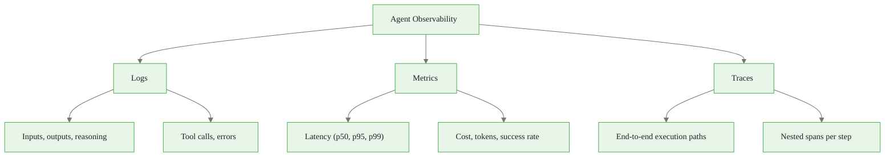
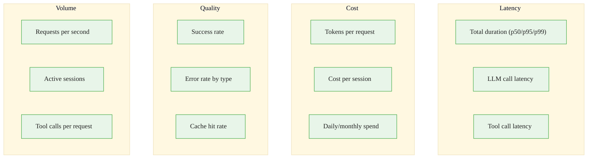
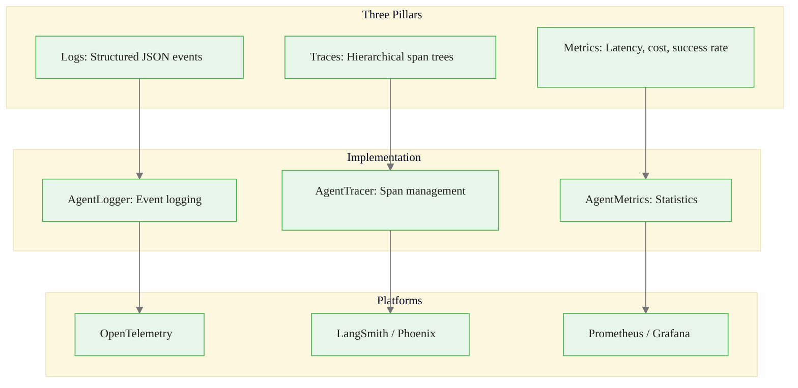

<!-- _class: lead -->

# Observability for AI Agents

**Module 07 — Production Deployment**

> You can't fix what you can't see. Agents make complex multi-step decisions — without observability, debugging is like troubleshooting a black box.

<!--
Speaker notes: Key talking points for this slide
- Transition slide: we are now moving into Observability for AI Agents
- Pause briefly to let the audience absorb the previous section
- Preview what is coming next in this section
-->
---

# Three Pillars of Observability



| Pillar | What It Captures | Key Properties |
|--------|-----------------|----------------|
| **Logs** | Detailed event records | Structured JSON, session-scoped |
| **Metrics** | Quantitative measurements | Aggregatable, time-series |
| **Traces** | Execution flow paths | Hierarchical spans, causal ordering |

<div class="callout-key">

**Key Point:** Observability overhead should be minimal — target less than 5% performance impact.

</div>

<!--
Speaker notes: Key talking points for this slide
- Walk through the diagram from left to right (or top to bottom)
- Explain each component and the connections between them
- Relate this architecture back to practical use cases
-->
---

# Without vs. With Observability

<div class="columns">
<div>

**Without:**
```
Agent crashed.
Error: "Failed to complete task"
[No additional information]
```

</div>
<div>

**With:**
```
Session: abc-123
Duration: 45.3s | Cost: $0.23

Trace:
1. [0.000s] User input received
2. [0.100s] Planning: fetch data
3. [0.150s] Tool: fetch_financial_data
4. [5.200s] Tool result: 15MB
5. [5.300s] Reasoning: analyze
6. [25.40s] LLM call (2800 tokens)
7. [35.50s] Safety check: passed
8. [35.70s] Response delivered

Metrics:
- Tool calls: 1 | LLM calls: 1
- Total tokens: 2800
- p95 latency: 42.1s
```

</div>
</div>

<div class="callout-key">

**Key Point:** Good observability answers: **What** did the agent do? **Why** each decision? **How long** each step? **What went wrong**?

</div>

<!--
Speaker notes: Key talking points for this slide
- Compare the two approaches side by side
- Highlight what makes the recommended approach better
- Point out common mistakes that lead people to the less effective approach
-->
---

<!-- _class: lead -->

# Structured Logging

<!--
Speaker notes: Key talking points for this slide
- Transition slide: we are now moving into Structured Logging
- Pause briefly to let the audience absorb the previous section
- Preview what is coming next in this section
-->
---

# AgentLogger Implementation

<div class="code-window">
<div class="code-header">
<div class="dots"><span class="dot-red"></span><span class="dot-yellow"></span><span class="dot-green"></span></div>
<span class="filename">agent.py</span>
</div>
<div class="code-body">

```python
class AgentLogger:
    def __init__(self, session_id: Optional[str] = None):
        self.session_id = session_id or str(uuid.uuid4())
        self.logger = logging.getLogger(f"agent.{self.session_id}")

    def log_event(self, event_type: str, message: str, **kwargs):
        event = {
            "timestamp": datetime.utcnow().isoformat(),
            "session_id": self.session_id,
            "event_type": event_type,
            "message": message,
            **kwargs
        }
        self.logger.info(json.dumps(event))
```

</div>
</div>

<!--
Speaker notes: Key talking points for this slide
- Walk through the code example, focusing on the key pattern being demonstrated
- Highlight the most important lines and explain why they matter
- Point out any edge cases or production considerations
- This code is copy-paste ready for learners to try
-->
---

# AgentLogger Implementation (continued)

<div class="code-window">
<div class="code-header">
<div class="dots"><span class="dot-red"></span><span class="dot-yellow"></span><span class="dot-green"></span></div>
<span class="filename">agent.py</span>
</div>
<div class="code-body">

```python
def log_llm_call(self, model, input_tokens, output_tokens, latency_ms, cost):
        self.log_event("llm_call", f"LLM call to {model}",
            model=model, input_tokens=input_tokens,
            output_tokens=output_tokens,
            total_tokens=input_tokens + output_tokens,
            latency_ms=latency_ms, cost=cost)

    def log_tool_call(self, tool_name, parameters, result, latency_ms, success):
        self.log_event("tool_call", f"Tool call: {tool_name}",
            tool_name=tool_name, parameters=parameters,
            result_preview=str(result)[:200],
            latency_ms=latency_ms, success=success)

    def log_error(self, error: Exception, context: dict):
        self.log_event("error", f"Error: {str(error)}",
            error_type=type(error).__name__,
            error_message=str(error), context=context, level="ERROR")
```

</div>
</div>

<!--
Speaker notes: Key talking points for this slide
- Continuation of the previous code block
- Walk through the remaining implementation details
- Highlight any key patterns or important lines
-->
---

# Logging Best Practices

<div class="columns">
<div>

**Too Little:**
<div class="code-window">
<div class="code-header">
<div class="dots"><span class="dot-red"></span><span class="dot-yellow"></span><span class="dot-green"></span></div>
<span class="filename">agent.py</span>
</div>
<div class="code-body">

```python
# DON'T: Minimal logging
logger.info("Agent executed")

# DO: Comprehensive logging
logger.log_event(
    "agent_execution",
    "Agent completed task",
    user_id=user_id,
    duration_ms=duration,
    tokens=tokens,
    cost=cost,
    steps=num_steps,
    tools_used=tools
)
```

</div>
</div>

</div>
<div>

**Too Much:**
```python
# DON'T: Log everything verbatim
logger.info(
    f"Full prompt: "
    f"{ten_thousand_character_prompt}")

# DO: Log strategically
logger.info(
    f"Prompt: {prompt[:200]}... "
    f"(length: {len(prompt)})")
```

</div>
</div>

```python
# DON'T: Unstructured strings
logger.info(f"LLM call took {latency}ms and cost ${cost}")

# DO: Structured JSON
logger.info(json.dumps({"event": "llm_call", "latency_ms": latency, "cost_usd": cost}))
```

<div class="callout-warning">

**Warning:** Unstructured logs can't be queried or analyzed — always use JSON.

</div>

<!--
Speaker notes: Key talking points for this slide
- Walk through the code example, focusing on the key pattern being demonstrated
- Highlight the most important lines and explain why they matter
- Point out any edge cases or production considerations
- This code is copy-paste ready for learners to try
-->
---

<!-- _class: lead -->

# Metrics Collection

<!--
Speaker notes: Key talking points for this slide
- Transition slide: we are now moving into Metrics Collection
- Pause briefly to let the audience absorb the previous section
- Preview what is coming next in this section
-->
---

# AgentMetrics

<div class="code-window">
<div class="code-header">
<div class="dots"><span class="dot-red"></span><span class="dot-yellow"></span><span class="dot-green"></span></div>
<span class="filename">agent.py</span>
</div>
<div class="code-body">

```python
@dataclass
class AgentMetrics:
    total_duration_ms: float = 0
    llm_latency_ms: List[float] = field(default_factory=list)
    tool_latency_ms: List[float] = field(default_factory=list)
    total_input_tokens: int = 0
    total_output_tokens: int = 0
    total_cost: float = 0.0
    llm_calls: int = 0
    tool_calls: int = 0
    errors: int = 0
    successful_completions: int = 0
    failed_completions: int = 0
```

</div>
</div>

<!--
Speaker notes: Key talking points for this slide
- Walk through the code example, focusing on the key pattern being demonstrated
- Highlight the most important lines and explain why they matter
- Point out any edge cases or production considerations
- This code is copy-paste ready for learners to try
-->
---

# AgentMetrics (continued)

<div class="code-window">
<div class="code-header">
<div class="dots"><span class="dot-red"></span><span class="dot-yellow"></span><span class="dot-green"></span></div>
<span class="filename">agent.py</span>
</div>
<div class="code-body">

```python
def add_llm_call(self, input_tokens, output_tokens, latency_ms, cost):
        self.llm_calls += 1
        self.total_input_tokens += input_tokens
        self.total_output_tokens += output_tokens
        self.llm_latency_ms.append(latency_ms)
        self.total_cost += cost
```

</div>
</div>

<!--
Speaker notes: Key talking points for this slide
- Continuation of the previous code block
- Walk through the remaining implementation details
- Highlight any key patterns or important lines
-->
---

# AgentMetrics (continued)

<div class="code-window">
<div class="code-header">
<div class="dots"><span class="dot-red"></span><span class="dot-yellow"></span><span class="dot-green"></span></div>
<span class="filename">agent.py</span>
</div>
<div class="code-body">

```python
def compute_summary(self) -> Dict[str, Any]:
        return {
            "total_duration_ms": self.total_duration_ms,
            "avg_llm_latency_ms": statistics.mean(self.llm_latency_ms) if self.llm_latency_ms else 0,
            "p95_llm_latency_ms": statistics.quantiles(self.llm_latency_ms, n=20)[18]
                if len(self.llm_latency_ms) > 1 else 0,
            "total_tokens": self.total_input_tokens + self.total_output_tokens,
            "total_cost": self.total_cost,
            "success_rate": self.successful_completions /
                (self.successful_completions + self.failed_completions)
                if (self.successful_completions + self.failed_completions) > 0 else 0
        }
```

</div>
</div>

<!--
Speaker notes: Key talking points for this slide
- Continuation of the previous code block
- Walk through the remaining implementation details
- Highlight any key patterns or important lines
-->
---

# Key Metrics to Track



<div class="callout-key">

**Key Point:** Collect latency percentiles (p50, p95, p99), not just averages — averages hide tail latency.

</div>

<!--
Speaker notes: Key talking points for this slide
- Walk through the diagram from left to right (or top to bottom)
- Explain each component and the connections between them
- Relate this architecture back to practical use cases
-->
---

<!-- _class: lead -->

# Distributed Tracing

<!--
Speaker notes: Key talking points for this slide
- Transition slide: we are now moving into Distributed Tracing
- Pause briefly to let the audience absorb the previous section
- Preview what is coming next in this section
-->
---

# Span-Based Tracing

<div class="code-window">
<div class="code-header">
<div class="dots"><span class="dot-red"></span><span class="dot-yellow"></span><span class="dot-green"></span></div>
<span class="filename">agent.py</span>
</div>
<div class="code-body">

```python
class Span:
    def __init__(self, name: str, parent: Optional['Span'] = None):
        self.name = name
        self.parent = parent
        self.span_id = str(uuid.uuid4())
        self.trace_id = parent.trace_id if parent else str(uuid.uuid4())
        self.start_time = time.time()
        self.end_time = None
        self.attributes = {}
        self.events = []
```

</div>
</div>

<!--
Speaker notes: Key talking points for this slide
- Walk through the code block line by line, emphasizing the key pattern
- The diagram below shows the architecture/flow visually
- Point out how the code maps to the diagram components
- Highlight any production considerations or gotchas
-->
---

# Span-Based Tracing (continued)

<div class="code-window">
<div class="code-header">
<div class="dots"><span class="dot-red"></span><span class="dot-yellow"></span><span class="dot-green"></span></div>
<span class="filename">agent.py</span>
</div>
<div class="code-body">

```python
def set_attribute(self, key: str, value: Any):
        self.attributes[key] = value

    def end(self):
        self.end_time = time.time()

    def duration_ms(self) -> float:
        return (self.end_time - self.start_time) * 1000 if self.end_time else 0
```

</div>
</div>

<!--
Speaker notes: Key talking points for this slide
- Continuation of the previous code block
- Walk through the remaining implementation details
- Highlight any key patterns or important lines
-->
---

# Observable Agent

<div class="code-window">
<div class="code-header">
<div class="dots"><span class="dot-red"></span><span class="dot-yellow"></span><span class="dot-green"></span></div>
<span class="filename">agent.py</span>
</div>
<div class="code-body">

```python
class ObservableAgent:
    def __init__(self, client):
        self.client = client
        self.logger = AgentLogger()
        self.metrics = AgentMetrics()
        self.tracer = AgentTracer()

    def execute(self, user_input: str, user_id: str) -> str:
        start_time = time.time()

        with self.tracer.start_span("agent_execution") as span:
            span.set_attribute("user_id", user_id)
            try:
                self.logger.log_user_input(user_input, user_id)
                result = self._execute_with_tracing(user_input, span)
                self.metrics.successful_completions += 1
                span.set_attribute("success", True)
```

</div>
</div>

<!--
Speaker notes: Key talking points for this slide
- Walk through the code example, focusing on the key pattern being demonstrated
- Highlight the most important lines and explain why they matter
- Point out any edge cases or production considerations
- This code is copy-paste ready for learners to try
-->
---

# Observable Agent (continued)

<div class="code-window">
<div class="code-header">
<div class="dots"><span class="dot-red"></span><span class="dot-yellow"></span><span class="dot-green"></span></div>
<span class="filename">agent.py</span>
</div>
<div class="code-body">

```python
return result
            except Exception as e:
                self.logger.log_error(e, {"user_input": user_input})
                self.metrics.failed_completions += 1
                span.set_attribute("success", False)
                raise
            finally:
                duration_ms = (time.time() - start_time) * 1000
                self.metrics.total_duration_ms = duration_ms

    def get_observability_data(self) -> Dict:
        return {"session_id": self.logger.session_id,
                "metrics": self.metrics.compute_summary(),
                "trace": self.tracer.get_trace()}
```

</div>
</div>

<!--
Speaker notes: Key talking points for this slide
- Continuation of the previous code block
- Walk through the remaining implementation details
- Highlight any key patterns or important lines
-->
---

# OpenTelemetry Integration

<div class="code-window">
<div class="code-header">
<div class="dots"><span class="dot-red"></span><span class="dot-yellow"></span><span class="dot-green"></span></div>
<span class="filename">agent.py</span>
</div>
<div class="code-body">

```python
from opentelemetry import trace, metrics
from opentelemetry.sdk.trace import TracerProvider
from opentelemetry.sdk.trace.export import BatchSpanProcessor
from opentelemetry.exporter.otlp.proto.grpc.trace_exporter import OTLPSpanExporter

class OTelAgentObservability:
    def __init__(self):
        trace.set_tracer_provider(TracerProvider())
        span_processor = BatchSpanProcessor(OTLPSpanExporter())
        trace.get_tracer_provider().add_span_processor(span_processor)
        self.tracer = trace.get_tracer(__name__)
```

</div>
</div>

<div class="callout-key">

**Key Point:** OpenTelemetry provides vendor-neutral tracing — export to Jaeger, Zipkin, Datadog, or any OTLP backend.

</div>

<!--
Speaker notes: Key talking points for this slide
- Walk through the code example, focusing on the key pattern being demonstrated
- Highlight the most important lines and explain why they matter
- Point out any edge cases or production considerations
- This code is copy-paste ready for learners to try
-->
---

# OpenTelemetry Integration (continued)

<div class="code-window">
<div class="code-header">
<div class="dots"><span class="dot-red"></span><span class="dot-yellow"></span><span class="dot-green"></span></div>
<span class="filename">agent.py</span>
</div>
<div class="code-body">

```python
@contextmanager
    def trace_llm_call(self, model: str):
        with self.tracer.start_as_current_span("llm_call") as span:
            span.set_attribute("llm.model", model)
            span.set_attribute("llm.provider", "anthropic")
            yield span

    @contextmanager
    def trace_tool_call(self, tool_name: str):
        with self.tracer.start_as_current_span("tool_call") as span:
            span.set_attribute("tool.name", tool_name)
            yield span
```

</div>
</div>

<!--
Speaker notes: Key talking points for this slide
- Continuation of the previous code block
- Walk through the remaining implementation details
- Highlight any key patterns or important lines
-->
---

# Common Pitfalls

| Pitfall | Problem | Solution |
|---------|---------|----------|
| **Logging too little** | Can't debug failures | Log event type, duration, tokens, cost, tools |
| **Logging too much** | Expensive storage, noise | Previews, sampling, log levels |
| **No structured logging** | Can't query or analyze | Always use JSON format |
| **Missing error context** | Can't reproduce issues | Include input, state, stack trace |

<div class="code-window">
<div class="code-header">
<div class="dots"><span class="dot-red"></span><span class="dot-yellow"></span><span class="dot-green"></span></div>
<span class="filename">agent.py</span>
</div>
<div class="code-body">

```python
# DON'T: Minimal error logging
logger.error(str(e))

# DO: Full context
logger.error({
    "error": str(e),
    "error_type": type(e).__name__,
    "user_input": user_input,
    "agent_state": agent_state,
    "stack_trace": traceback.format_exc()
})
```

</div>
</div>

<!--
Speaker notes: Key talking points for this slide
- Walk through the code example, focusing on the key pattern being demonstrated
- Highlight the most important lines and explain why they matter
- Point out any edge cases or production considerations
- This code is copy-paste ready for learners to try
-->
---

# Summary & Connections



**Key takeaways:**
- Three pillars: logs (events), metrics (numbers), traces (execution paths)
- Structured JSON logging enables querying and analysis
- Metrics must include percentiles, not just averages
- Distributed tracing captures hierarchical execution with nested spans
- Integrate with OpenTelemetry for vendor-neutral observability
- Balance detail vs. overhead — log strategically, sample when needed

> *Observability is not optional — it's how you debug, optimize, and operate agents in production.*

<!--
Speaker notes: Key talking points for this slide
- Walk through the diagram from left to right (or top to bottom)
- Explain each component and the connections between them
- Relate this architecture back to practical use cases
-->